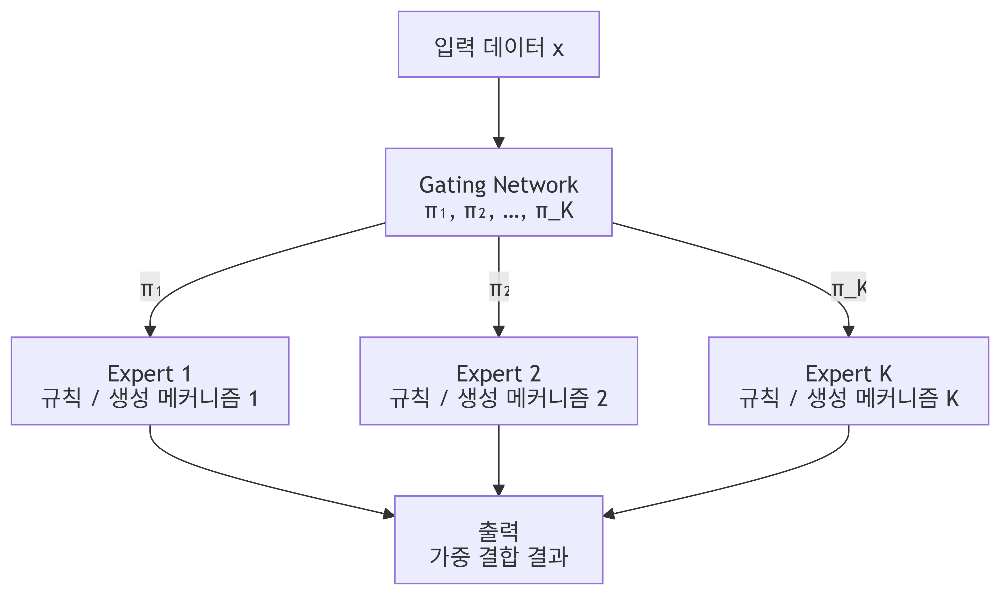

<!-- ───────────────── 강의 음성 기반 보완 제안 ─────────────────
  이 파일의 제안 11건 (개념보강 8 / 결과해석 1 / 그림해설 1 / 실무맥락 1)

  각 제안은 「+강의」 마커로 감싸여 있다. 마커 줄 끝의 판정을 고친다.
    채택하려면  물음표를  y  로
    기각하려면  물음표를  n  로
    보류하면    그대로 두면 되고 '미검토'로 보고된다

  검토를 마치면 저장소 루트에서  python3 apply_lecture.py  를 실행한다.
  (--dry-run 을 붙이면 고치지 않고 집계만 한다)
  ─────────────────────────────────────────────────────────── -->

# 1.1 Deep Learning 기반 Data 분석

**학습 목표**

- 전통적 분석과 DL 기반 분석의 관점 차이를 설명할 수 있다.
- DL 모델을 데이터 구조를 노출시키는 **계측기(instrument)** 로 바라보는 관점을 설명할 수 있다.
- 전통적 분석이 전제하는 단일 분포 가정과 요약 충분성 가정이 왜 현실 데이터에서 깨지는지 설명할 수 있다.
- 혼합 구조 $x \sim \sum_k \pi_k p_k(x)$ 를 읽고, 표현 공간으로의 사상이 이 구조를 어떻게 드러내는지 설명할 수 있다.
- 전통적 분석과 DL 기반 분석을 잇는 4단계 절차를 사례에 적용하고, 중간 표현에 접근하는 방법들을 구분할 수 있다.

**이 절의 구성**

- 1.1.1 관점의 차이: 전통적 분석 vs DL 기반 분석
- 1.1.2 전통적 Data 분석의 관점
- 1.1.3 DL 기반 Data 분석의 관점
- 1.1.4 DL 기반 Data 분석의 한계
- 1.1.5 전통적 분석과 DL 기반 분석의 연결
- 1.1.6 사례 연구: 고객 Data 분석
- 1.1.7 중간 표현에 접근하는 방법
- 1.1.8 1.1절 정리

---

## 1.1.1 관점의 차이: 전통적 분석 vs DL 기반 분석
<!-- 슬라이드 7 -->

이 절의 목표는 Deep Learning 모델을 정답을 맞히는 예측기가 아니라, **복잡한 Data 구조를 드러내는 분석 도구**로 활용하는 관점을 습득하는 것이다. 그 출발점은 전통적 분석과 DL 기반 분석이 서로 무엇을 보고 있는지를 구분하는 데 있다.

| 구분 | 전통적 분석 | DL 기반 분석 |
|---|---|---|
| 분석 대상 | 관측된 변수의 통계적 특성(평균·분산·상관) | 학습 과정에서 형성된 표현(representation)과 출력 분포 |
| 초점 | 데이터를 **설명**하는 것 | 데이터가 어떤 **구조와 생성 규칙**을 갖는지 관찰하는 것 |
| 한 줄 요약 | 관측된 데이터의 통계적 특성을 설명 | 데이터에 숨겨진 구조적 특성을 관찰하고 설명 |

**DL 모델을 바라보는 핵심 관점**

- DL 모델은 데이터 구조를 노출시키는 **계측기(instrument)** 이다.
- 학습 결과에 나타나는 오류(error), 혼동(confusion), 불일치 패턴은
  → 모델의 실패가 아니라 **데이터 구조의 모순·혼합·가설 충돌의 신호** 로 해석한다.

<!-- +강의 id=1.1_DL기반Data분석-01 w=w1b ts=[02:19] [02:47] [03:12] 유형=개념보강 채택=? -->
일반적인 Deep Learning에서는 정답을 얼마나 잘 맞히느냐가 곧 목적이다. 이 과목의 관점은 다르다. 모델이 정답을 찾았는지보다 데이터 구조를 얼마나 드러냈는지를 본다. 그래서 잘 맞히지 못한 학습 결과에서도 얻어낼 정보가 있다.
<!-- /+강의 -->

> **이 강의의 범위**
> - 다루지 않는 것: 모델을 잘 만드는 법, 성능 최적화
> - 다루는 것: DL 모델의 구조적 특성, 학습 결과를 통해 데이터를 의심하고 해석하는 접근

---

## 1.1.2 전통적 Data 분석의 관점
<!-- 슬라이드 8 -->

전통적 분석의 문제의식은 **"데이터의 통계적 특성(parameter)을 찾자"** 이다.
역할은 데이터의 **해석 가능성과 재현성**을 기반으로 의사결정을 지원하는 것이다.

**수학적 틀**

데이터 집합

$$\mathcal{D}=\{\mathbf{x}_i \in \mathbb{R}^{d}\}_{i=1}^{N}, \qquad N:\text{샘플 수}, \; d:\text{각 데이터의 차원 수}$$

분석은 곧 통계적 특성을 찾는 일이다.

$$\theta = \mathbb{E}[X] \quad \text{: } X\text{의 기대값(평균)}$$

$$\Sigma = \mathrm{Cov}(X) \quad \text{: 공분산 행렬(분산과 상관관계)}$$

이 통계량들은 데이터의 분포를 저차원으로 요약하는 값으로 사용된다. 즉 분포를 **저차원 통계량으로 요약**하여 데이터를 이해하려는 접근이다.

**전통적 분석이 전제하는 두 가정**

1. **단일 분포 가정**

   $$X \sim p(x \mid \theta)$$

   특정한 생성 규칙을 따르는 하나의 분포 $p(x \mid \theta)$ 를 가지고, 데이터 전체가 그 하나의 분포로 설명될 수 있다고 가정한다.

2. **요약 충분성 가정**

   평균 $\mu$ 와 공분산 $\Sigma$ 만으로 분포의 핵심 구조를 충분히 설명할 수 있다고 가정한다.

많은 전통적 방법들이 이 두 가정을 따라 데이터를 분석한다.

> **핵심 문제**
> 현실 데이터는 이 두 가정에 맞지 않는 경우가 많다.
> 그 결과 전통적 분석은 **데이터의 구조를 평균으로 붕괴시킨다.**

---

## 1.1.3 DL 기반 Data 분석의 관점
<!-- 슬라이드 9 -->

DL 기반 분석의 출발점은 **"데이터는 종종 서로 다른 생성 규칙을 가진 여러 데이터가 섞인 결과"** 라는 인식이다. 이는 다음과 같이 일반화된다.

$$x \sim \sum_{k=1}^{K} \pi_k \, p_k(x)$$

이를 **혼합 구조(mixture structure)** 라 하며, 세 가지 관점으로 읽을 수 있다.

- **혼합 구조 관점**: $K$개의 서로 다른 분포를 갖는 생성 규칙의 결합으로 표현된다.
- **조건부 관점**: $p_k(x \mid y)$ 형태의 조건부 확률로 본다.
- **잠재 변수 관점**: $\pi_k$ 와 $p_k(x)$ 가 보이지 않는 요인(잠재 변수)에 의해 결정되는 확률로 본다.

<!-- +강의 id=1.1_DL기반Data분석-02 w=w1b ts=[09:00] [09:30] 유형=개념보강 채택=? -->
조건부 관점과 잠재 변수 관점은 둘 중 하나를 고르는 문제가 아니라, 두 가지가 섞인 형태로 분포가 만들어지기도 한다. 이렇게 여러 분포의 가중합에서 수집된 데이터는 평균과 분산을 계산해도 내부 구조를 알 수 없다.
<!-- /+강의 -->

**DL 학습이 하는 일** — 새로운 표현 공간으로의 사상(mapping)을 학습하는 과정

$$f_\theta : \mathbb{R}^{d} \rightarrow \mathbb{R}^{m}$$

새로운 표현 공간에서 혼합된 구조가 분리되고, 생성 규칙의 차이가 드러날 것이라고 기대한다.

**DL 기반 분석의 태도**

- 데이터는 설명 대상이 아니라 **판단의 근거**이다.
- 데이터의 통계적 특성을 설명하려 하지 말고, **구조적 특성을 관찰**한다.
- 모델을 설명하려 하지 말고, 모델을 **분석 도구로 사용**한다.

**학습 결과에 대한 해석 전환**

- 학습 과정은 성능 향상 과정이 아니라 **데이터 구조 노출 과정**이다.
- 좋은 모델 = 예측 성능이 높은 모델이 아니라, **구조가 잘 보이는 모델**이다.
- 목적은 구조 해석의 품질 향상이며, 그 기준으로 구조가 잘 보이는 모델을 선택한다.

<!-- +강의 id=1.1_DL기반Data분석-03 w=w1b ts=[12:27] 유형=개념보강 채택=? -->
성능이 좋다고 해서 구조가 잘 보이는 것은 아니다. 오히려 성능이 낮은 상태에서 데이터 구조가 더 선명하게 드러나는 경우도 있다. 그래서 모델을 고르는 기준은 성능 지표가 아니라 구조가 관찰되는 정도가 된다.
<!-- /+강의 -->

---

## 1.1.4 DL 기반 Data 분석의 한계
<!-- 슬라이드 10 -->

**DL이 제공하는 것**

- 데이터를 다른 **표현 공간(representation space)** 으로 mapping한다.
- 그 공간에서 분리, 군집, 밀도 차이, 혼합 구조 등 **형태적 구조**가 드러난다.
- 즉, 구조를 보여주는 데는 매우 강력하다. 그러나 **구조를 보여줄 뿐 설명하지는 못한다.**

**DL이 제공하지 못하는 것**

- 왜 그런 구조가 생겼는지
- 어떤 변수 조합이 그 구조를 만들었는지
- 현실에서 무엇을 의미하는지
  → **구조의 원인과 의미는 설명되지 않는다.**

**표현 공간의 근본적 한계 — 해석 가능한 좌표계가 아니다**

- 사람이 설계한 변수가 아니라, 모델이 학습 과정에서 필요에 의해 만든 좌표계이다.
- 각 축의 의미가 명확하지 않다.
- 거리나 방향이 현실 변수와 1:1로 대응되지 않는다.
- 모델·초기값에 따라 다른 모양으로 나타난다.
  → **드러난 구조가 유일한 참 구조라는 보장은 없다.**

**구조는 보이지만 명확하지 않다**

- 잘 드러내는 것: 혼합 구조, 점진적 변화, 중첩된 집단
- 제공하지 못하는 것: 분할, 결정 경계, 해석 기준선

> **분석가의 역할**
> 구조 판단, 분할 기준, 해석의 책임은 분석가의 몫이다. 의심을 갖고 분석해야 한다.

---

## 1.1.5 전통적 분석과 DL 기반 분석의 연결
<!-- 슬라이드 11 -->

DL은 전통적 분석을 **대체하지 않는다.** DL 기반 분석은 전통적 Data 분석을 부정하거나 대체하는 접근이 아니다. 두 접근은 서로 다른 역할을 가진 관측 도구이며, 구조를 더 잘 이해하기 위한 선택적 접근이다. 대체가 아니라 **확장된 관측 도구**로 보아야 한다.

**4단계 분석 절차**

1. **전통적 분석으로 가설 수립**
   - 데이터의 기본 분포와 특성 파악, 변수 간 관계에 대한 초기 가설 설정, 문제 정의와 분석 방향 정립
   - 수단: 기술통계, EDA, 상관 분석, 회귀, 기본 분류 → 데이터의 전체적 윤곽 이해

2. **전통적 가정이 깨지는 지점 확인**
   - 설명되지 않는 잔차, 구간별 변수 관계의 불안정, 특정 조건에서의 오류 → 모델이 데이터를 설명하지 못한다는 뜻이다.
   - → "모델을 더 잘 만들자"가 아니라 **"데이터 구조를 더 의심하자"**

3. **DL을 계측기로 사용한 구조 분석**
   - 학습 성능보다 **학습된 표현 공간에서 관찰되는 구조의 품질**이 중요하다.
   - 표현 공간의 군집 분리, 출력 분포의 다중성, 특정 영역에서 반복되는 오류, 클래스 간 혼동 패턴 → 복잡한 데이터 구조 노출

4. **DL 결과를 다시 전통적 언어로 해석**
   - 관찰된 구조를 다시 변수 수준으로 환원하여 해석하고 도메인 지식과 연결한다.
   - 통계·논리·설명 가능한 언어로 재해석 → 분석 결과에 의미 부여

---

## 1.1.6 사례 연구: 고객 Data 분석
<!-- 슬라이드 12 -->

DL을 사용하면 분석이 어떻게 개선될 수 있는지를 고객 Data 분석 사례로 확인한다.

> 이해를 돕기 위한 단순한 사례이다. 실제로는 더 복잡한 경우에 DL이 효과적이다.

**① 문제 설정 (전통적 분석 관점)**

- 목적: 고객의 구매 금액 이해
- 접근: 평균 구매 금액, 연령대별 구매 차이, 회귀 분석
- 결과: "나이가 많을수록 구매액이 증가한다 → 나이가 구매액에 영향을 준다"

**② 전통적 분석에서 나타나는 이상 신호**

- 같은 나이인데 행동이 완전히 다른 사람들이 많다.
- 오차가 특정 구간에서 계속 크다.

<!-- +강의 id=1.1_DL기반Data분석-04 w=w1b ts=[26:11] 유형=개념보강 채택=? -->
같은 나이에서 행동이 갈리고 특정 구간의 오차가 반복된다는 것은, 전통적 분석으로는 설명할 수 없는 정보가 데이터 안에 남아 있다는 뜻이다. 이 지점에서 회귀식을 더 다듬는 대신 DL 모델로 방향을 바꾼다.
<!-- /+강의 -->

**③ DL 기반 접근** — 구매 금액을 예측하는 것이 아니라, **중간 표현(embedding)** 을 관찰한다.

표현 공간에서 데이터를 시각화하면 나이와 무관하게 3개의 뚜렷한 군집이 나타난다.

| 군집 | 성격 |
|---|---|
| A | 할인 반응형 |
| B | 프리미엄 고정형 |
| C | 이벤트 단발형 |

<!-- +강의 id=1.1_DL기반Data분석-05 w=w1b ts=[27:00] 유형=결과해석 채택=? -->
표현 공간에 세 덩어리가 보인다는 사실만으로는 각 군집이 무엇인지 알 수 없다. 군집이 입력 데이터의 어느 부분과 연결되는지 되짚어 해석한 뒤에야 이런 이름을 붙일 수 있다. 이름을 붙이는 일은 모델이 아니라 분석가의 몫이다.
<!-- /+강의 -->

**④ 다시 전통적 언어로 해석**

- 서로 다른 구매 규칙을 가진 집단의 혼합이다.
- 각 군집 안에서는 나이 효과가 거의 없다.

> **최종 해석**
> 나이 효과를 가진 단일 집단이 아니라, **서로 다른 행동 규칙을 가진 집단이 섞인 구조**이다.

---

## 1.1.7 중간 표현에 접근하는 방법
<!-- 슬라이드 13 -->

앞의 고객 Data 분석 사례를 확장하여, 중간 표현에 접근하는 구체적 방법들을 정리한다.

**① Regression 모델** — 고객정보 → 예상 매출

- 입력 데이터
  - 수치형: 구매 금액, 빈도, 최근성, …
  - 범주형: 성별, 지역, 멤버십, 품목, …
- 출력 전 **마지막 layer의 출력을 embedding vector로 사용**한다.
- **Layer-wise probing**: 2~3개 층(중간/마지막)을 뽑아 UMAP/PCA 등으로 시각화한다.

<!-- +강의 id=1.1_DL기반Data분석-06 w=w1b ts=[28:34] [29:20] [30:37] 유형=실무맥락 채택=? -->
어느 층의 출력이 구조를 가장 잘 보여줄지는 미리 알 수 없다. 모델 구조에 따라 다르므로 몇 개 층을 뽑아 비교하며 실험적으로 정해야 한다. 경험적으로는 출력 직전 마지막 layer의 출력이 가장 효과적인 경우가 많다.
<!-- /+강의 -->

**② Multi-task 모델로 구조 강화** — 고객정보 → 예상 매출, 품목, 할인/프리미엄 반응

- 복합적·구조적 표현 학습에 유리하며, 그 결과 행동 규칙이 선명하게 분리된다.

**③ Auto Encoder / VAE** — 고객 정보 → 고객 정보

- Bottleneck layer가 잠재적 데이터 구조를 직접 노출한다.
- 정답(label) 없이 데이터 자체의 구조를 드러낼 수 있다.

<!-- +강의 id=1.1_DL기반Data분석-07 w=w1b ts=[32:11] [32:33] [32:55] 유형=개념보강 채택=? -->
입력과 출력을 무엇으로 둘지가 분명하지 않을 때 선택하는 구조다. 입력을 그대로 목표값으로 주면 모델은 좁아졌다 다시 넓어지는 형태가 되고, 가장 좁은 지점에 데이터 구조가 직접 노출된다. 구조 해석에서 가장 먼저 시도해 보는 모델이다.
<!-- /+강의 -->

**④ Mixture of Experts** — 고객정보 → 예상 매출

- 여러 Expert가 서로 다른 생성 규칙을 담당한다.
- Gating Network를 통해 **어떤 규칙이 작동하는지 직접 관찰할 수 있다.**

<!-- +강의 id=1.1_DL기반Data분석-08 w=w1b ts=[33:13] [33:39] [34:04] 유형=개념보강 채택=? -->
여기서의 Mixture of Experts는 LLM에서 쓰이는 MoE와 개념적으로 거의 같다. Regression 모델의 중간에서 경로를 몇 갈래로 분리하면, 각 갈래가 서로 다른 생성 메커니즘을 나누어 학습하고 그 결과가 결합되어 출력이 된다.
<!-- /+강의 -->

입력 데이터 $x$ 가 Gating Network로 전달되어 가중치 $\pi_1, \pi_2, \dots, \pi_K$ 가 결정되고, 각 Expert(규칙 / 생성 메커니즘 $1 \dots K$)의 결과가 그 가중치로 결합되어 출력된다. Gating 값을 관찰하면 어떤 생성 규칙이 활성화되었는지 확인할 수 있다.

*그림 1-1. Mixture of Experts 구조*

<!-- +강의 id=1.1_DL기반Data분석-09 w=w1b ts=[34:42] [35:10] 유형=그림해설 채택=? -->
한 고객의 데이터가 들어오면 Gating Network가 각 규칙에 0.8, 0.2 같은 가중치를 배분한다. 각 Expert의 출력에 그 값을 곱해 더한 것이 예상 매출이다. 이 가중치를 읽으면 그 고객이 어떤 행동 규칙을 어느 정도 비중으로 따르는지 볼 수 있다.
<!-- /+강의 -->

---

## 1.1.8 1.1절 정리
<!-- 슬라이드 14~15 -->

**① 관점의 전환: 모델이 아니라 데이터**

- Deep Learning을 예측 성능 향상 도구가 아니라 → **데이터 구조를 드러내는 분석 도구(instrument)** 로 사용한다.
- 오류(error)와 혼동(confusion)은 모델 실패가 아니라 → **데이터 구조의 모순·가설 충돌의 신호**이다.

**② 전통적 분석 vs DL 기반 분석**

- 전통적 데이터 분석: 관측 변수의 통계량(평균·분산·상관)에 의존하며, 단일 분포 가정과 저차 통계 요약 위에 서 있다.
- DL 기반 데이터 분석: 학습된 표현(representation)과 출력 분포를 분석하여, 데이터의 생성 구조와 잠재적 혼합을 해석한다.

**③ 데이터 생성 관점의 확장**

- 데이터는 하나의 분포가 아니라 → 여러 생성 메커니즘의 혼합·조건부 구조의 결과이다.
- DL은 명시적 분해 없이도 → **표현 사상(Representation Mapping)** 을 통해 구조를 암묵적으로 노출한다.

**④ Deep Learning의 본질**

- Deep Learning = **Layered Representation Learning**
- 계층적 변환을 통해 저차 특징 → 고차 특징으로 나아간다.
- 학습 과정은 정답을 외우는 과정이 아니라 **데이터를 해석 가능한 좌표계로 변환하는 과정**이다.

<!-- +강의 id=1.1_DL기반Data분석-10 w=w1b ts=[59:17] [60:05] [60:38] [61:07] 유형=개념보강 채택=? -->
표현 학습은 가설 공간에서 좋은 표현을 자동으로 검색하는 과정으로 정의된다. 여기서 가설 공간은 그 모델이 만들어 낼 수 있는 변환의 집합이다. 섞여 있던 점들도 적절한 좌표계로 옮기면 분류가 훨씬 간단해지는데, 그 좌표계를 찾는 일이 곧 학습이다.
<!-- /+강의 -->

**⑤ 출력의 재해석**

- 분류 출력은 값이 아니라 **확률 분포**이다.
- Softmax: score(logit) → 분포
- Cross Entropy: 정답 분포와 예측 분포의 차이
- 출력 분포는 불확실성과 구조적 모호성을 포함한다.

<!-- +강의 id=1.1_DL기반Data분석-11 w=w1b ts=[55:19] [57:39] 유형=개념보강 채택=? -->
logit은 확률을 양과 음의 무한대 구간으로 펼쳐 놓은 값이고, Softmax는 그것을 다시 합이 1인 확률로 되돌린다. Cross Entropy는 두 확률 분포를 구별하는 데 필요한 비트 수로, 값이 클수록 두 분포가 서로 다르다는 뜻이다.
<!-- /+강의 -->

> **1.1절 결론**
> Deep Learning 기반 데이터 분석은 관측된 통계를 설명하는 것이 아니라,
> 학습된 **표현**과 출력 **분포**를 통해 **데이터의 생성 구조와 모순을 드러내는 접근**이다.
