# 1.2 Deep Learning 개요

**학습 목표**

- Deep Learning을 계층화(Layering)를 통해 고차원 특징을 찾는 과정으로 설명할 수 있다.
- 인공 뉴런 하나가 회귀 모델과 같다는 점을 수식으로 설명할 수 있다.
- 선형·비선형·로지스틱 회귀를 구분하고, logit과 logistic(sigmoid) 함수의 역함수 관계를 설명할 수 있다.
- 다항 로지스틱 회귀와 Softmax를 통해 분류 출력이 왜 값이 아니라 확률 분포인지 설명하고, Cross Entropy로 두 분포의 차이를 계산할 수 있다.
- 학습을 표현 학습(Representation Learning)으로 설명하고, 순전파–손실–역전파의 흐름과 Vanishing Problem의 원인을 설명할 수 있다.

**이 절의 구성**

- 1.2.1 DL = Deep Layered Learning
- 1.2.2 Regression의 종류
- 1.2.3 Multinomial Logistic Regression
- 1.2.4 Softmax Activation과 Cross Entropy
- 1.2.5 Representation Learning — 최상위 개념
- 1.2.6 학습 과정
- 1.2.7 DL 학습을 방해하는 요인 — Vanishing Problem
- 1.2.8 심화 과제
- 1.2.9 1.2절 정리

---

## 1.2.1 DL = Deep Layered Learning
<!-- 슬라이드 16 -->

**계층화(Layering)를 통해 고차원의 특징을 찾는 것**

- 주어진 데이터의 평가를 통해 특징을 찾는 것
- \+ 특징들의 조합으로 고차원의 특징을 찾는 것
- 계층화의 구현: **Neural Net이 유일한 접근**

**인공 신경망(Artificial Neural Network)**

- 생물학적 신경망을 수학적으로 모델링한 것이다.
- **Single Neuron = Regression model**

$$= f\!\left(\sum_i w_i x_i + b\right) = f(\text{Linear Regression})$$

생물학적 뉴런은 수상돌기(dendrites)로 신호를 받아 세포체(soma)에서 통합하고, 축삭(axon)을 따라 시냅스(synapse)로 신호를 전달한다.

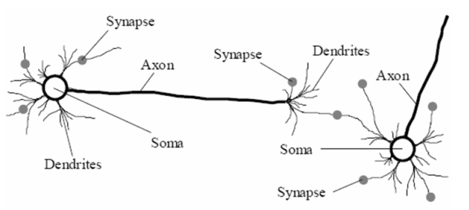

*그림 1-2. 생물학적 뉴런의 구조*

인공 뉴런은 이 구조를 그대로 옮긴 것이다. 입력 $x_0, x_1, x_2$ 에 가중치 $w_0, w_1, w_2$ 가 곱해져 cell body에서 $\sum_i w_i x_i + b$ 로 합산되고, activation function $f$ 를 거쳐 output axon으로 출력된다. 즉 시냅스는 가중치에, 세포체는 가중합에, 축삭은 출력에 대응된다.

계층화가 가능한 구조는 현재로서 신경망뿐이다. 머신러닝에는 여러 기법이 있지만 레이어를 쌓아 특징을 다시 결합하는 방식이 성립하는 것은 신경망이고, 그보다 효율적인 다른 방법은 아직 찾아지지 않았다. 그래서 딥러닝을 한다는 것은 곧 인공 신경망으로 모델을 만든다는 뜻이 된다.

생물학적 뉴런에서 학습이 일어나는 자리는 시냅스다. 앞 뉴런에서 오는 전기 신호를 얼마나 증폭해 전달할지를 시냅스가 결정하고, 경우에 따라 신호를 억제하거나 음의 신호로 바꿔 전달하기도 한다. 무언가를 기억한다는 것은 시냅스의 화학물질 농도가 달라지고 시냅스의 크기가 바뀌는 일이다.

시냅스를 지나 전달되는 것은 펄스이며, 펄스를 받으면 세포의 전위가 올라간다. 여러 시냅스에서 들어오는 신호에 따라 전위가 오르내리다가 threshold를 넘는 전압에 이르면 그때 펄스가 축삭으로 나간다. 이것이 생물학적 뉴런의 기본 동작이다.

뉴런마다 기본 전압, 즉 bias가 다르다는 점도 함께 옮겨졌다. bias가 큰 뉴런은 입력이 조금만 들어와도 곧바로 threshold를 넘고, bias가 작은 뉴런은 입력이 많이 쌓여야 넘어선다. 인공 뉴런에서 가중합에 더해지는 bias 항이 이 기본 전압에 대응한다.

다만 그대로 옮기지 않은 부분도 있다. 생물학적 뉴런은 전압을 계속 높일 수 없어서 큰 값일수록 펄스를 촘촘하게, 작은 값일수록 듬성듬성 내보내는 방식으로 크기를 전달한다. 수학적 모델에서는 펄스 형태로 다룰 필요가 없으므로 출력값이 계속 커질 수 있는 형태의 뉴런으로 만들었다.

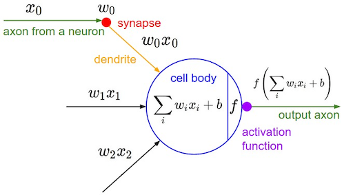

*그림 1-3. 인공 뉴런 모델*

---

## 1.2.2 Regression의 종류
<!-- 슬라이드 17 -->

**① Linear Regression**

$$y=\beta_0+\beta_1 x+\beta_2 x^{2}+\beta_3 x^{3}$$

- $\beta$ 에 대해 선형 결합이다($x$ 에 대해서는 비선형).
- $\beta$ 의 역할과 관계로 **해석**한다.

**② Nonlinear Regression**

$$y=\frac{\beta_1 x}{\beta_2 + x}$$

- 해석이 아니라 **예측용**으로 사용한다. DL은 대부분 비선형 회귀를 사용한다.

**③ Logistic Regression** — logistic function을 적용하여 분류에 사용한다.

**Logit function**

확률 $p$, 승산 $\text{odds}=\dfrac{p}{1-p}$ 일 때

$$\mathrm{logit}(p)=\log(\text{odds})=\log\!\left(\frac{p}{1-p}\right)$$

logit은 $(0,1)$ 구간의 확률 $p$ 를 실수 전체로 펼치는 함수이다. 아래 그림에서 붉은 곡선은 odds, 푸른 곡선은 logit이며, $p \to 1$ 에서 발산한다.

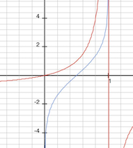

*그림 1-4. Logit function과 odds*

**Logistic function** — logit의 **역함수**

- $\pm\infty$ 값을 확률에 mapping한다(logit function의 역변환).
- Standard Logistic function(= Sigmoid function)

$$f(x)=\frac{L}{1+e^{-k(x-x_0)}}$$

$L=1,\; k=1,\; x_0=0$ 인 경우

$$f(x)=\frac{1}{1+e^{-x}}$$

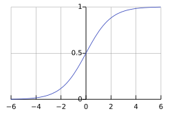

*그림 1-5. Logistic(Sigmoid) function*

### logit이 나온 자리 — 확률에서 승산으로

확률은 도박에서 나온 개념이지만 값 자체가 직관적으로 와닿지 않는다. 그래서 확률을 그대로 쓰지 않고 승산 형태로 바꿔 쓰는 관행이 생겼다. 승산은 확률을 1에서 확률을 뺀 값으로 나눈 것이다. 어떤 게임에서 이길 확률이 90%라면 이길 승산은 9배가 되는데, 이길 확률이 90%라는 말보다 이길 승산이 9배라는 말이 더 직관적으로 읽힌다.

승산은 0에서 무한대까지의 값을 갖고, 여기에 로그를 씌운 것이 logit이다. 그래서 logit은 0과 1 사이의 확률을 양과 음의 무한대에 대응시키는 함수가 된다.

logistic function은 logit의 역함수이므로 두 축을 뒤집으면 그대로 얻어진다. 가로축이 양과 음의 무한대이고 세로축이 0과 1 사이가 된다. 즉 logit이 확률을 무한대 구간으로 펼치는 함수라면, logistic function은 무한대 구간의 값을 확률로 되돌리는 함수다. 회귀의 출력 쪽에 이 함수를 붙여 출력값을 확률로 바꾼 구조가 로지스틱 회귀다.

### Sigmoid와 Logistic은 같은 말이 아니다

두 이름은 흔히 같은 뜻으로 쓰이지만 가리키는 범위가 다르다. sigmoid function은 $L$, $k$, $x_0$ 값에 따라 기울기와 모양이 달라지는 함수들의 이름이고, 그중 $L=1$, $k=1$, $x_0=0$ 인 특정한 경우가 logistic function이다. 즉 logistic function은 sigmoid function의 특별한 경우이며, 이 기본형을 standard logistic function이라고 부른다. 일반적으로 sigmoid라고 부를 때 실제로 쓰고 있는 것은 이 기본형이다.

---

## 1.2.3 Multinomial Logistic Regression (다항 로지스틱 회귀)
<!-- 슬라이드 18 -->

= Multi-Class Classification

입력 특징 벡터를 클래스 확률 분포로 사상한다.

$$f : \mathbb{R}^{d} \longrightarrow \mathbb{R}^{m}, \quad \text{sum to } 1$$

- 입력 특징 예: Age, Height, Weight, Blood pressure, …
- 출력 예: Clean, Cancer, Cold, High blood pressure, … (각 클래스의 확률)

즉 입력 특징 벡터 $x \in \mathbb{R}^{d}$ 가 사상 $f$ 를 거쳐 각 클래스의 확률을 담은 $y \in \mathbb{R}^{m}$(sum to 1)으로 바뀐다.

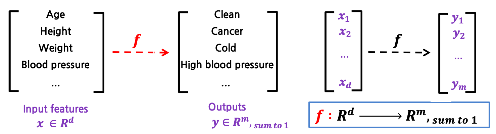

*그림 1-6. 다항 로지스틱 회귀의 입출력*

이 사상을 행렬 연산으로 쓰면 다음과 같다. 입력 벡터에 가중치 행렬 $W$ 를 곱하고 편향 $b$ 를 더한 결과에 softmax를 씌운다.

![행렬 연산으로 본 다항 로지스틱 회귀 — [x1 x2 … xd]W + b = [y1 y2 … ym] (sum to 1), W ∈ R^(d×m), 아래에 f: Y = σ(X·W+b), σ = softmax(sum to 1)](images/s018_03.png)

*그림 1-7. 행렬 연산으로 본 다항 로지스틱 회귀*

같은 구조를 신경망 도식으로 보면, Linear activation을 수행하는 Cell 1~3의 출력이 Softmax를 통해 확률 분포 $y_1, y_2, y_3$ 로 정규화된다.

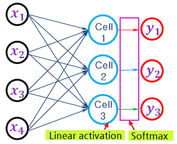

*그림 1-8. 다항 로지스틱 회귀의 신경망 도식*

이 구조를 보통 멀티 클래스 분류라고 부르지만, 이름과 달리 실제로 하고 있는 것은 회귀다. logistic function을 여러 클래스로 확장한 형태가 다항 로지스틱 회귀이고, 여러 클래스에 대한 분류에서 우리가 쓰고 있는 것이 바로 이 회귀 모델이다.

각 뉴런의 출력값은 logit이라고 부른다. logit은 확률이 양과 음의 무한대로 펼쳐진 값이므로, 뉴런의 출력을 logit이라 부르는 것은 아직 확률로 되돌리지 않은 상태의 값이라는 뜻이다. 뒤에 붙는 Softmax가 이 값들을 확률 분포로 되돌린다.

---

## 1.2.4 Softmax Activation과 Cross Entropy
<!-- 슬라이드 19 -->

**Softmax Activation** — logistic function과 같이 마지막 layer에 적용한다.

logistic function을 $n$-class로 일반화하고, "sum to 1"로 변환한다.

$$\sigma(z)_j=\frac{e^{z_j}}{\sum_{k=1}^{K} e^{z_k}}, \qquad j=1,\dots,K$$

logistic function을 두 class 확률로 표현하면

$$P(y=1\mid z)=\frac{e^{z_1}}{e^{z_1}+e^{z_2}}, \qquad P(y=2\mid z)=\frac{e^{z_2}}{e^{z_1}+e^{z_2}}$$

logits(scores) $[2.0,\,1.0,\,0.1]$ 이 Softmax를 통해 확률 $[0.7,\,0.2,\,0.1]$(sum to 1)로 변환된다.

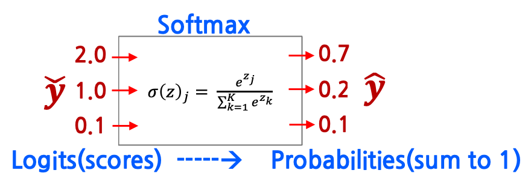

*그림 1-9. Softmax: logits에서 확률 분포로*

신경망에서는 Cell 1~3의 선형 출력 $\check{y}$ 가 마지막 layer의 Softmax를 거쳐 예측 확률 분포 $\hat{y}$ 가 된다.

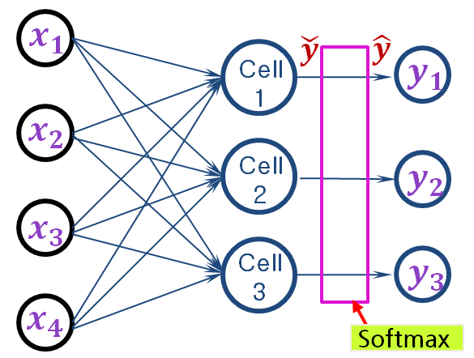

*그림 1-10. 마지막 layer에 적용되는 Softmax*

**확률 값의 비교**

$$\mathbf{Target} = [\,0\;\;1\;\;0\;\;0\,], \quad K=4 \quad \text{(one-hot coding = 확률분포)}$$

$$\mathbf{Estimation} = [\,3\;\;-1\;\;2\;\;10\,] \;\;(\text{logits})$$

$$\longrightarrow \frac{[\,e^{3}\;\; e^{-1}\;\; e^{2}\;\; e^{10}\,]}{e^{3}+e^{-1}+e^{2}+e^{10}} = [\,0.009\;\;0.0001\;\;0.0009\;\;0.99\,] \quad (\text{예측한 확률 분포})$$

**Cross Entropy**

두 확률 분포 $p$ 와 $q$ 가 있을 때 둘을 식별하는 데 필요한 비트 수(정보이론)이며, 두 확률변수의 **유사도를 측정하는 함수**로 사용할 수 있다.

$$H(p,q)=-\sum_i p_i \log q_i = -\sum_i y_i \log \hat{y}_i$$

- $y_i = p(x_i)$ : 정답의 확률 분포
- $\hat{y}_i = q(x_i)$ : 예측한 확률 분포

---

## 1.2.5 Representation Learning — 최상위 개념
<!-- 슬라이드 20~21 -->

학습을 Representation Learning 관점에서 설명하면,

> **가설공간(hypothesis space) 내에서 좋은 표현(representations / transformations)을 자동으로 검색하는 과정**

이다. 즉 **분류가 쉬운 새로운 좌표계로 변환** → 새로운 데이터 표현 → 특징의 이해로 이어진다.

- **가설공간(Hypothesis space)**: 모델이 제공하는 transform의 집합

원본 데이터에서는 두 클래스가 $x$–$y$ 좌표계에서 섞여 있다(1: Raw data). 여기에 새로운 축을 도입하고(2: Coordinate change), 변환된 좌표계에서 보면 두 클래스가 축 기준으로 단순하게 분리된다(3: Better representation). 데이터는 그대로이고 **표현(좌표계)** 만 바뀌었다는 점이 핵심이다.

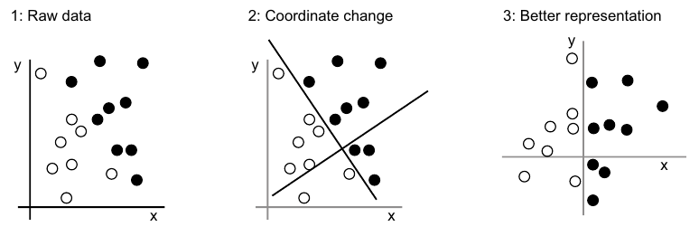

*그림 1-11. 좌표계 변환에 의한 표현 개선*

**Layered Representations Learning**

- Layer(filter / transform)를 통과하며 정제된 정보(표현)로 변환된다.
- 출력의 표현을 학습하는 **다단계 처리 방식**이다.
- 입력 표현을 출력 표현으로 바꾸는 과정, 즉 **표현 사상(Representation Mapping)** 이다.

손글씨 숫자 이미지가 Layer 1 → Layer 2 → Layer 3 을 지나며 점점 추상화된 표현으로 변환되고, Layer 4의 최종 출력에서 0~9 클래스에 대한 값으로 나타난다. 하위 layer는 국소적 특징(획·경계)을, 상위 layer는 고차 특징(숫자 정체성)을 담는다.

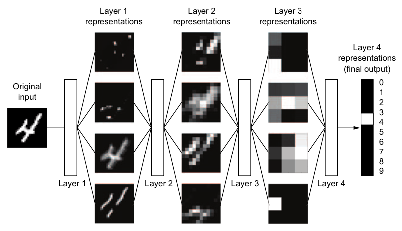

*그림 1-12. 계층적 표현 학습(MNIST 예시)*

### 중간에 만들어지는 것도 모두 표현이다

입력 이미지는 숫자 4에 대한 하나의 표현이고, 층을 지나며 만들어지는 feature map들도 같은 숫자 4에 대한 또 다른 표현이다. 마지막에 나오는 클래스별 확률 역시 같은 대상에 대한 표현이다. 즉 뉴런이 만들어 내는 모든 정보가 표현이며, 층을 지난다는 것은 그 표현이 다른 표현으로 옮겨진다는 뜻이다.

이렇게 보면 모델이 하는 일은 이미지로 된 표현을 클래스 확률로 된 표현으로 바꾸는 일이고, 그 사이의 층들은 원하는 형태의 정제된 정보에 이르기까지 표현을 단계적으로 옮기는 통로가 된다.

한 가지 더 짚을 것이 있다. 데이터가 더 좋은 표현으로 바뀌었다는 말은, 모델이 그 데이터셋의 특징을 이해해서 적절한 변환 방법을 찾아냈다는 말과 같다. 좌표계를 바꾸는 일이 곧 특징을 이해하는 일이라는 이 관계는 이후 논의에서 계속 쓰인다.

---

## 1.2.6 학습 과정
<!-- 슬라이드 22 -->

- **Forward processing**: 입력 표현을 target 표현으로 변환한다.
- **Loss**: 두 표현의 유사도를 측정한다.
- **Backward processing**: target 표현과 같아지도록 transformation parameter를 수정한다.

Input X가 Weights를 가진 Layer(data transformation)들을 통과해 Predictions Y′를 만들고, True targets Y와 함께 Loss function에 입력되어 Loss score가 계산된다. Optimizer가 이 값을 받아 Weight update를 수행하는 경로가 Back Propagation이다.

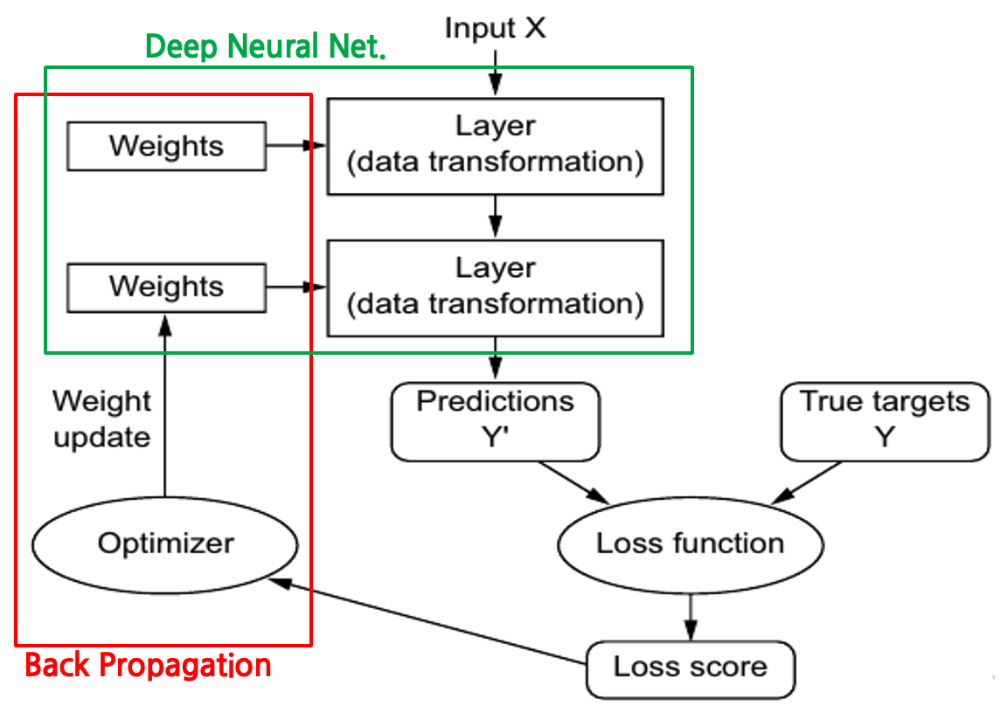

*그림 1-13. 딥러닝 학습 루프*

---

## 1.2.7 DL 학습을 방해하는 요인 — Vanishing Problem
<!-- 슬라이드 23 -->

**Backpropagation of error**

$$\text{Error} = \text{cost func}(z, y) = \delta$$

$$w' = w - lr \cdot \frac{\partial \delta}{\partial w}$$

**$\delta$ 가 작아지면?** → 학습 둔화 또는 멈춤

**$\delta$ 가 작아지는 원인**

1. Activation function의 **saturation 영역**으로 값이 입력되는 경우
2. $w$ 값이 작아서 역전파되는 $\delta$ 가 너무 작은 경우
   (생각해 볼 문제: $w$ 가 너무 커지면 어떻게 되는가?)

입력 $x_1 \dots x_n$ 이 가중치 $w_1 \dots w_n$ 와 결합해 net input $net=\sum_i w_i x_i$ 를 만들고, 활성함수 $\sigma(net)=\dfrac{1}{1+e^{-net}}$ 를 거쳐 출력된다. 출력에서 계산된 error $\delta$ 가 Gradient Descent 등의 최적화를 통해 Weight update로 되돌아간다.

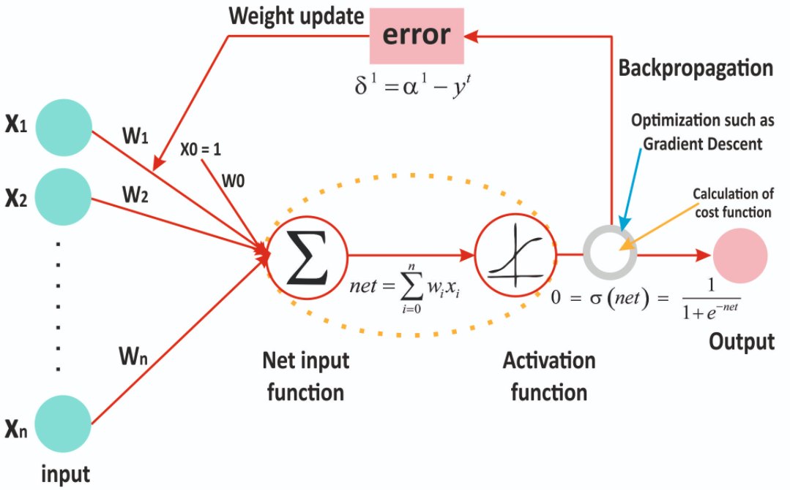

*그림 1-14. 순전파와 오차 역전파*

활성함수의 **saturation 영역**은 sigmoid 곡선의 양 끝, 즉 기울기가 거의 0인 구간이다. 이 구간으로 값이 들어가면 $\delta$ 가 급격히 작아진다.

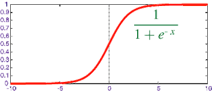

*그림 1-15. Activation function의 saturation 영역*

오차는 층을 거슬러 가중치에 비례해 분배된다. 출력층에서 계산된 $\delta = z - y$ 가 먼저 $\delta_4 = w_{46}\delta$ 로 앞 층에 전달되고,

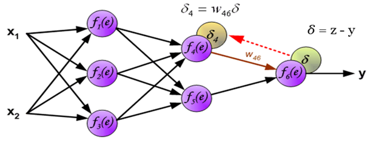

*그림 1-16. 오차 역전파 — 출력층에서 은닉층으로*

그 다음 층에서는 여러 경로의 오차가 합쳐져 $\delta_1 = w_{14}\delta_4 + w_{15}\delta_5$ 가 된다. 이 과정을 반복하면서 $w$ 값이 작으면 $\delta$ 는 층을 지날수록 계속 줄어든다.

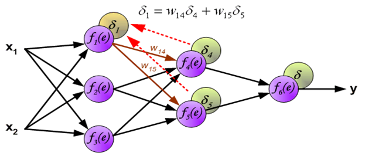

*그림 1-17. 오차 역전파 — 여러 경로의 오차 합산*

### 레이어를 쌓을수록 나빠지는 현상

개념만 놓고 보면 레이어가 많을수록 더 고차원적인 특징을 잘 찾아야 한다. 그런데 실제로는 층을 잔뜩 쌓으면 학습이 되지 않고 성능이 오히려 떨어진다. 이렇게 레이어링 자체가 방해받는 현상이 Vanishing Problem이며, 딥러닝에서 가장 까다로운 문제 가운데 하나다. 최근 모델들은 skip connection을 갖는 구조로 이 문제를 거의 회피했고 그 덕분에 아주 큰 모델을 만들 수 있게 되었지만, 문제 자체가 사라진 것은 아니다. 층을 무한정 쌓을 수는 없다.

### saturation 영역에서 무슨 일이 일어나는가

모든 뉴런은 activation function을 갖고 있고, 모든 activation function은 어딘가에 saturation 구간을 갖는다. ReLU는 0 이하가 0이고 0 이상이 선형이므로 0 이하가 saturation 구간이며, hyperbolic tangent는 양쪽 끝에 saturation 구간을 갖는다.

문제는 이 구간에서 노드의 출력값이 바뀌어도 activation function을 지나 나가는 값은 그대로라는 데 있다. 파라미터를 바꿔도 출력이 달라지지 않으니 error가 작아지는 방향을 알 수 없고, 그 파라미터들은 수정 방향을 정하지 못한다. 노드 출력값의 일부가 이 구간을 지나면 거기에 연결된 파라미터들만 부분적으로 학습되지 않는다.

### 작은 weight가 층마다 곱해진다

두 번째 원인은 전달 과정에 있다. $\delta$ 는 앞 층으로 갈 때 연결의 weight가 곱해져 전달된다. 그런데 정상적으로 학습된 모델의 파라미터 분포를 보면 weight 값이 0.1 이하인 경우가 대부분이다. 모델마다 다르지만 이 경향은 넓게 나타난다.

그러면 $\delta$ 는 층을 지날 때마다 0.1 이하의 값이 곱해지면서 계속 작아진다. 일반적인 구조에서 층을 열 개쯤 쌓으면 학습이 크게 둔화되고, 스무 개쯤 쌓으면 학습이 되지 않는다. activation function의 saturation과 작은 weight의 누적 곱, 이 두 가지가 층을 쌓아도 성능이 좋아지지 않는 원인이다.

---

## 1.2.8 심화 과제
<!-- 슬라이드 24~28 -->

> 점수에 포함되지 않는 연습 과제이다.
> 다음 과제를 LLM을 사용해 결과를 얻고 1page로 정리한다. 결과 뒤에 LLM과의 채팅 내역 전체를 첨부 파일로 추가한다.
> 제출: ① i-campus 제출, ② gshong@ai-camp.kr (자동 채점 실험)

### 심화 과제 1 — DL 모델: 예측기인가, 계측기인가?

**목적**: DL 모델을 "예측기"와 "계측기"로 바라보는 두 관점의 차이를 개념적으로 분석하고, 각 관점이 분석 실천에 어떤 차이를 낳는지 논증한다.

이 두 관점은 이번 학기 전체를 관통하는 축이다. 딥러닝 모델을 결과를 예측하는 모델이 아니라 데이터의 구조를 드러내는 도구로 쓰는 것이 이 강의의 방향이며, 이후 관측공간·표현공간·출력공간·오류공간을 차례로 살펴보는 구성도 모두 같은 목적에서 나온 것이다.

**상황**: 병원에서 환자 재입원 예측 모델을 개발했다.

| 모델 | 관점 | 결과 |
|---|---|---|
| 모델 A | 예측기 관점 | Accuracy 88%, 재입원 여부를 맞힘 |
| 모델 B | 계측기 관점 | Accuracy 83%, 단 오류가 "고령+만성질환+저소득" 그룹에 집중 |

**요구 사항**

1. 두 관점에서 "모델 B의 오류"를 각각 어떻게 해석하는가?
2. 계측기 관점에서 "오류가 집중된 그룹"이 주는 정보는 무엇인가?
3. 의사결정자에게 어느 모델을 추천하겠는가? 관점에 따른 근거를 제시하라.
4. "정확도가 낮은 모델이 더 좋은 분석 도구일 수 있다"는 명제에 동의하는가? 구체적인 반례 또는 지지 논거를 1개 이상 제시하라.

#### LLM 답변 예시

**1) 두 관점에서 "모델 B의 오류"를 어떻게 해석하는가?**

- *예측기 관점*: 모델 B는 실패한 모델이다. 모델 A보다 정확도가 5% 낮으며, 특정 그룹에서 예측 성능이 무너진다는 것은 일반화 성능(Generalization)에 심각한 결함이 있음을 의미한다.
- *계측기 관점*: 모델 B는 정밀한 진단 도구이다. 특정 그룹(고령+만성질환+저소득)에서 오류가 집중된다는 사실은, 해당 그룹의 재입원 기전이 일반 환자와는 다른 특수한 메커니즘(사회적 결정요인 등)에 의해 작동함을 시사한다.

**2) 오류가 집중된 그룹이 주는 정보**

이 오류는 "데이터의 한계" 또는 "변수의 누락"을 가리키는 강력한 신호이다. 현재 모델이 학습한 피처(의료적 수치 등)만으로는 저소득 고령층의 재입원 원인을 설명하기 부족하다는 뜻이며, 주거 환경·영양 상태·간병인 유무 같은 외부 요인이 개입하고 있음을 암시한다.

**3) 모델 추천 근거**

상황에 따라 다르지만, 시스템의 근본적 개선을 목표로 한다면 모델 B 기반 분석을 추천한다. 모델 A는 "누가 재입원할 것인가"는 잘 맞히지만 "어떻게 막을 것인가"에 답하지 못한다. 반면 모델 B는 특정 취약 계층에서 모델이 작동하지 않음을 보여줌으로써, 맞춤형 복지 서비스나 집중 케어 프로그램 설계라는 정책적 인사이트를 제공한다.

**4) 명제에 대한 찬반**

동의한다. 해석 가능성(Explainability)과 강건성(Robustness)의 가치 때문이다. 예를 들어 채용 스크리닝 모델의 정확도가 99%라 해도, 그 정확도가 성별·인종 편향에서 얻어진 것이라면 분석 도구로서 가치가 없다. 오히려 정확도 85%라도 편향되지 않은 기준으로 평가하고 어떤 기준에서 탈락자가 발생하는지 명확히 보여주는 모델이 인사 전략 수립에 훨씬 유익하다.

#### LLM 채점 기준 — 심화 과제 1 (총 10점)

| 배점 | 항목 | 기준 |
|---|---|---|
| 3점 | 두 관점의 핵심 차이 서술 | 예측기(정확도 최적화) vs 계측기(구조 드러내기). 단순 정의 나열이 아닌, 분석 목적과 실천 방식의 차이로 설명해야 함 |
| 3점 | 오류 집중 그룹의 의미 해석 | 모델 실패가 아닌 데이터 서브그룹 구조의 신호로 해석. "고령+만성질환+저소득" 등의 그룹이 다른 생성 규칙을 가질 가능성에 대한 논거 포함 |
| 2점 | 모델 추천 근거 | 어느 관점을 택하든, 목적에 기반한 일관된 논리 |
| 2점 | 명제에 대한 찬반 논거 | 구체적 예시 포함. 단순 "동의/반대"만이면 0점 |

**감점 기준**

- 두 관점을 동일하게 서술: −2점
- 오류를 단순히 "모델 개선 필요"로만 해석: −2점
- LLM으로 요약 작업 또는 출력내용 단순 전사: −4점

#### 채점 예시 — 총점 8.5 / 10점

| 항목 | 점수 | 채점 근거 및 비판적 분석 |
|---|---|---|
| 1. 두 관점 차이 | 2.5/3 | 예측기(블랙박스, 오차 최소화)와 계측기(진단적, 구조 파악)의 차이를 명확히 구분함. 다만 실천 방식의 구체성이 조금 더 보강될 필요가 있음 |
| 2. 오류 그룹 해석 | 2.5/3 | 모델 실패가 아닌 '사회적 결정요인'이라는 신호로 해석함. 하지만 "해당 그룹이 다른 생성 규칙을 가질 가능성"이라는 용어를 직접 사용한 논거가 부족함 |
| 3. 모델 추천 근거 | 1.5/2 | '정책적 인사이트'와 '시스템 개선'이라는 목적에 기반해 모델 B를 일관되게 추천함. 논리는 타당하나 운영 효율(모델 A)과의 균형점을 더 날카롭게 지적해야 함 |
| 4. 명제 찬반 논거 | 2.0/2 | '채용 스크리닝의 편향'이라는 구체적 반례를 제시하며 논리적으로 지지함. 명확한 예시가 포함되어 감점 요인 없음 |
| 감점 요소 | 0 | 두 관점을 확연히 다르게 서술했으며, 오류를 순수 모델 개선 과제로만 보지 않았음. 단순 요약이 아닌 비판적 재구성을 수행함 |

### 심화 과제 2 — 혼합 구조 데이터와 단일 분포 가정의 충돌

**목적**: 현실 데이터에서 "단일 분포 가정"이 실제로 어떻게 무너지는지를 구체적 사례로 선택·분석하고, DL 기반 접근의 필요성을 개념으로 논증한다.

**상황 A: 의료 — 혈압 예측 모델**

- 나이로 혈압을 예측하면 설명력이 낮다.
- 고혈압 환자군 / 정상군 / 경계군이 섞여 있다.

**상황 B: 교육 — 시험 점수 예측 모델**

- 학습 시간으로 점수를 예측하면 $R^2 = 0.15$ 이다.
- 학습 방식(강의 / 문제풀이 / 복습)에 따라 효과가 전혀 다르다.

**요구 사항**

1. 선택한 상황에서 "단일 분포 가정"이 왜 성립하지 않는지를 설명하라.
2. 수식 $x \sim \sum_k \pi_k p_k(x)$ 를 선택한 상황에 대입하여 $K$, $\pi_k$, $p_k(x)$ 를 구체화하라.
3. 전통적 회귀 분석의 결과($R^2$ 낮음)를 "실패"가 아닌 "신호"로 재해석하라.
4. DL 기반 접근(AE, 잠재공간 시각화 등)을 쓰면 무엇을 추가로 발견할 수 있는가?

---

## 1.2.9 1.2절 정리

> **정리**
> - Deep Learning은 계층화(Layering)를 통해 저차 특징에서 고차 특징으로 나아가는 **Layered Representation Learning**이며, 그 구현체가 인공 신경망이다.
> - 뉴런 하나는 $f(\sum_i w_i x_i + b)$, 즉 활성함수를 씌운 회귀 모델이다. 여기서 어떤 회귀를 쓰느냐에 따라 선형·비선형·로지스틱 회귀로 갈린다.
> - 분류 출력은 값이 아니라 **확률 분포**이다. Softmax가 logit(score)을 sum-to-1 분포로 바꾸고, Cross Entropy가 정답 분포와 예측 분포의 차이를 잰다.
> - 학습은 정답을 외우는 과정이 아니라, 분류가 쉬운 **새로운 좌표계로 데이터를 변환**하는 과정이다.
> - 순전파–Loss–역전파의 순환이 학습을 이루며, activation의 saturation 영역이나 작은 $w$ 때문에 $\delta$ 가 줄어들면 학습이 둔화·정지한다(Vanishing Problem).
