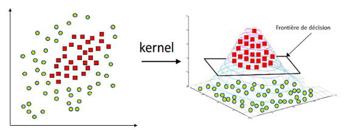

# 2장. 관측 공간 (Observation Space)

> **응용데이터분석 (Applied Data Analysis) — 딥러닝 기반 데이터 분석**
> 데이터사이언스융합학과 · Rev 1.0
> 원본 슬라이드: 31 ~ 38, 97 (9장)

**학습 목표**

- 관측 공간을 "측정 가능성이 규정하는 인식 공간"으로 정의하고, 그것이 표현 수준과 해석 수준이라는 두 층위에서 분석을 제약하는 방식을 설명할 수 있다.
- 관측공간의 한계와 관측통계의 제약이 어떻게 연쇄적으로 작동하여 분석의 한계를 고착화하는지 논증할 수 있다.
- 차원 축소·특징 공학·커널 방법·밀도 추정·혼합 모델·비선형 의존성 측정·조건부 모델링이 각각 어느 제약을 어디까지 완화했는지 구분할 수 있다.
- 딥러닝이 두 제약을 동시에 다루는 접근인 이유를, 학습된 관측공간과 에너지 함수로서의 통계라는 관점에서 설명할 수 있다.
- 관측 공간 분석을 건너뛸 때 이후 분석 전체가 어떤 위험에 놓이는지 판단할 수 있다.

**이 장의 구성**

- 2.1 관측 공간의 한계 (Limitations of Observation Space)
- 2.2 관측 통계의 제약 (Constraints of Observational Statistics)
- 2.3 선형 투영의 실패 (Failure of Linear Projection)

**이 장 개요의 구성**

- 2.0.1 관측 공간이란 무엇인가
- 2.0.2 관측 공간의 한계를 넘기 위한 접근들
- 2.0.3 관측 통계의 제약을 넘기 위한 접근들
- 2.0.4 그래서 문제가 해결되었나?
- 2.0.5 딥러닝의 잠재공간도 결국 관측공간 아닌가?
- 2.0.6 관측통계는 딥러닝에서 사라졌는가?
- 2.0.7 2장 정리 — 관측 공간을 건너뛰면 무엇이 무너지는가

---

## 2.0.1 관측 공간이란 무엇인가

**정의**

관측 공간이란 데이터가 **측정 가능하다는 조건** 하에서, 데이터의 **표현 방식과 해석 방식을 동시에 제한하는 인식 공간**이다.

이 공간은 두 층위에서 우리를 제약한다.

- **표현 수준**: 데이터의 내재적 구조를 드러내지 못하는 **한계**를 가진다.
- **해석 수준**: 평균·분산·상관 중심의 요약을 강제하는 **제약**을 가진다.

즉 관측 공간은 *볼 수 있는 것*과 *보이는 것을 이해하는 방식*을 동시에 규정한다.

| 층위 | 이름 | 내용 |
|---|---|---|
| 표현 수준 | **관측공간의 한계** | 측정된 변수들로 구성된 좌표계가 데이터의 내재적·비선형 구조를 드러내지 못하는 구조적 한계 |
| 해석 수준 | **관측통계의 제약** | 평균·분산·상관 중심의 전통적 통계 요약이 데이터의 복합적 분포 구조를 필연적으로 붕괴시키는 문제 |

**두 제약의 연쇄 작동**

전통적 데이터 분석은 ① 데이터가 놓이는 관측공간 자체가 구조를 드러내기 어려운 제약을 갖고, ② 그 공간 위에서 사용하는 관측통계가 구조를 다시 붕괴시킨다. 두 제약이 연쇄적으로 작동하며 분석의 한계를 고착화한다.

- 공간의 제약 → 구조가 잘 드러나지 않는 좌표계에서 **시작**
- 관측통계의 제약 → 남아 있던 구조마저 요약 과정에서 **소실**
- 결과: 분석은 단순·안정·설명 가능해 보이나 실제로는 구조적 통찰을 제공하지 못함

그 결과 전통적 분석은 **통계적으로 동일하지만 구조적으로 다른 데이터들을 구분하지 못한다.** 해석은 안정적처럼 보이지만 본질을 놓친다.

> **핵심 명제**
> 전통적인 데이터 분석은 **구조를 드러내기 어려운 공간에서 출발해, 구조를 파괴하는 통계 요약으로 끝난다.**

---

## 2.0.2 관측 공간의 한계를 넘기 위한 접근들

관측공간의 한계는 오래전부터 인식되어 왔고, 이를 넘기 위한 세 갈래의 시도가 있었다.

**① 차원 축소 (Dimensionality Reduction)** — 관측공간을 저차원 구조로 투영하여 관측공간의 **형태**를 바꾼다.

- PCA: 분산 최대 방향으로 선형 투영
- MDS: 거리 구조 보존
- Isomap / LLE: 다양체 가설 기반 비선형 차원 축소
- → 좌표를 바꿀 뿐, **의미를 학습하지는 못한다.** 분산·거리 중심의 사고는 그대로 유지된다.

**② 특징 추출 & 특징 공학 (Feature Engineering)** — 의미 있는 좌표를 **사람이 설계**한다.

- 이미지: SIFT, HOG
- 신호: 주파수 스펙트럼, 웨이블릿
- 텍스트: TF–IDF, n-gram
- → 관측공간을 의미 공간으로 재설계하지만, **모델이 데이터로부터 표현을 학습하지는 못한다.**

**③ 커널 방법 (Kernel Methods)** — 관측공간을 고차원 특징공간으로 **암묵적으로 확장**한다.

- Kernel PCA
- SVM (RBF, polynomial kernel)
- Kernel Ridge Regression
- → 비선형 구조를 표현 차원에서 우회하지만 커널 선택에 좌우되고, **표현 자체를 모델이 데이터로부터 학습하지는 않는다.**

2차원 관측공간에서 원형으로 뒤섞여 선형 분리가 불가능한 두 클래스도, 커널 매핑을 통해 3차원 특징공간으로 올라가면 평면 형태의 결정 경계(Frontière de décision)로 분리할 수 있게 된다.

*그림 2-1. 커널 방법에 의한 고차원 특징공간의 암묵적 확장*

---

## 2.0.3 관측 통계의 제약을 넘기 위한 접근들

해석 수준의 제약을 완화하려는 시도 역시 네 갈래로 전개되었다.

**① 분포 전체 모델링 (Density Estimation)** — 평균·분산 대신 분포 전체를 보자는 접근이다.

- 비모수 밀도 추정: 커널 밀도 추정(KDE), 히스토그램 기반 모델
- → 관측통계의 제약은 일부 완화되지만, **관측공간의 제약에는 무력하다.**

**② 혼합 모델 & 잠재변수 모델** — 데이터를 여러 생성 원인의 혼합으로 모델링한다.

- Gaussian Mixture Model (GMM)
- Hidden Markov Model (HMM)
- Factor Analysis: 상관관계를 통해 데이터를 축약하는 통계 기법
- Latent Dirichlet Allocation (LDA): 자연어 처리의 topic modeling 방식
- → 단일 평균 사고에서는 탈출하지만, 복잡한 고차원 구조에서 **모델이 표현을 직접 학습하지는 못한다.**

**③ 비선형 의존성 측정 (Beyond Correlation)** — 상관계수는 관계의 일부만 포착한다는 인식에서 출발한다. 이들 측도는 딥러닝의 손실 함수로 쓰이기도 한다.

- 상호정보량(Mutual Information): 정보이론에 기반해 확률 변수 사이의 의존성을 측정
- Distance Correlation: 두 변수 사이의 거리 구조를 측정한다($x$ 에서 멀어지는 두 점이 $y$ 에서도 멀어지는지)
- HSIC: kernel mapping된 고차 공간에서 두 변수의 공분산으로 의존성을 측정한다(딥러닝에 종종 사용된다)
- → "**관계가 있다**"까지만 말해 줄 뿐, 구조적 형태는 여전히 불분명하다.

**④ 조건부·계층적 모델링** — 집계하지 말고 조건화하자는 접근이다.

- 베이지안 계층 모델
- 다변량 회귀 / 혼합 회귀
- → Simpson's Paradox를 해결하여 집계 통계의 위험성을 인식하게 했지만, 자동적인 구조 발견이나 표현 학습은 어렵다.

---

## 2.0.4 그래서 문제가 해결되었나?

딥러닝 이전의 모든 고급 분석 기법들은 관측공간의 한계 **또는** 관측통계의 제약 중 **일부만** 부분적으로 완화했다.

| 접근 | 관측공간 | 관측통계 |
|---|:---:|:---:|
| PCA / 차원축소 | △ | ✗ |
| 특징공학 | △ | ✗ |
| 커널 방법 | △ | ✗ |
| KDE | ✗ | △ |
| 혼합 모델 | ✗ | △ |
| MI | ✗ | △ |

반면 Deep Learning은 다음 두 가지를 **동시에** 수행한다.

- 표현공간을 데이터로부터 학습한다 → **관측공간의 한계**를 넘는다.
- 통계 요약 자체를 학습 과정에 흡수한다 → **관측통계의 제약**을 해결한다.

> 딥러닝은 기존 기법들의 두 문제를 동시에 해결하는 **첫 번째 접근**이다.

---

## 2.0.5 딥러닝의 잠재공간도 결국 관측공간 아닌가?

관측공간은 "무엇이 관측(측정) 가능한가"를 규정하는 좌표계이므로, 그 정의를 따르면 **잠재공간도 새로운 관측공간**이다. 다만 딥러닝의 잠재공간은 성격이 다르다.

- 데이터와 목적 함수로 **학습되어** 만들어지고,
- 예측·재구성·분리라는 목적에 최적화되며,
- **구조를 드러내도록 강제된** 좌표계이다.

즉 목적에 맞는 구조가 드러나도록 설계된 관측공간이다.

*그림 2-2. 층을 지날 때마다 다시 만들어지는 좌표계. 각 layer의 표현은 그 자체로 하나의 관측공간이며, 목적 함수가 그 형태를 결정한다*

> 딥러닝의 잠재공간은 **주어진 관측공간**이 아니라 **학습된 관측공간**이다.

---

## 2.0.6 관측통계는 딥러닝에서 사라졌는가?

사라지지 않았다. 다만 **분리된 단계로 존재하지 않게 되었다.**

- 전통적 분석에서 관측통계의 위치: 데이터 → 관측공간 → **통계 요약** → 해석
- 딥러닝에서 통계의 위치: 통계를 요약으로 쓰지 않고, **표현학습을 강제하는 압력**으로 사용한다.

| 통계량 | 딥러닝에서의 역할 |
|---|---|
| MSE | 평균적 오차가 아니라, 어떤 표현이 살아남는지를 결정하는 힘 |
| Cross-Entropy, KL divergence | 분포 형태를 선택하고, 분포를 일치시키는 힘 |
| Mutual Information | 입력과 출력 사이에서 유지되어야 할 정보량을 선택하는 힘 |
| Likelihood | 전체 데이터를 설명(생성)할 수 있는 구조를 선호하는 힘 |

관측통계는 사라지지 않고 **위치와 역할이 바뀌었다.** 여전히 평균·분산·정보량을 쓰지만, 그것이 구조를 대표하지는 않는다. 통계는 표현을 밀어내는 **에너지 함수**가 되었다.

**그렇다면 관측통계의 제약은 사라졌는가?**

제약은 사라진 것이 아니라 **해석의 제약에서 설계의 제약으로 넘어갔을 뿐이다.**

- 어떤 손실함수를 쓰는가
- 어떤 확률 가정을 넣는가
- 어떤 정보량을 최소화 또는 최대화하는가

이 선택들이 표현공간의 형태를 제한하고 구조를 결정한다.

---

## 2.0.7 2장 정리 — 관측 공간을 건너뛰면 무엇이 무너지는가

> **정리**
> 관측 공간 분석을 건너뛰면, 데이터의 경계·편향·구조를 모른 채 분석에 들어가
> **이후 모든 결과가 검증되지 않은 가정 위에** 있게 된다.

**① 관측 공간의 한계를 무시하면**

- 측정 가능한 범위 밖의 변수·구간을 '존재하지 않는 것'으로 오인한다.
- 잘못된 전제 위에서 분석을 시작하므로 결론 자체가 무효화된다.

**② 관측 통계의 제약을 무시하면**

- 표본·측정 편향을 보정 없이 전체 모집단으로 일반화한다.
- 평균·상관 등의 지표가 실제와 어긋난 결론으로 연결된다.

**③ 선형 투영의 실패를 점검하지 않으면**

- 비선형 구조에 선형 투영(회귀·PCA)을 적용하여 구조의 왜곡과 소실이 발생한다.
- 실패를 인지하지 못한 채 모델 결과를 과신한다.
