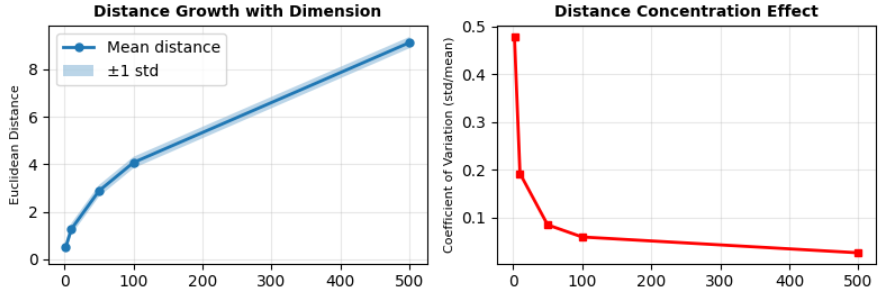
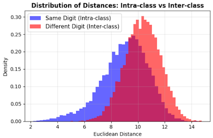
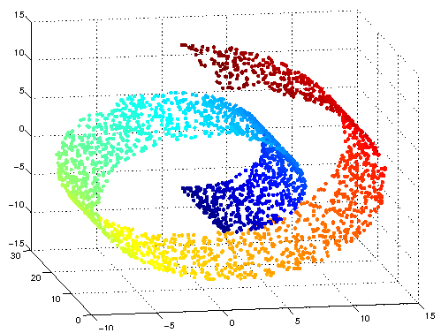
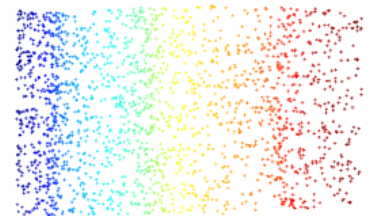
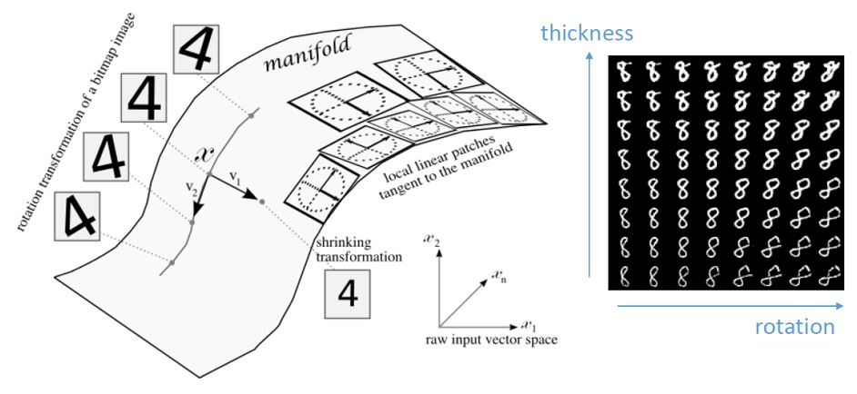
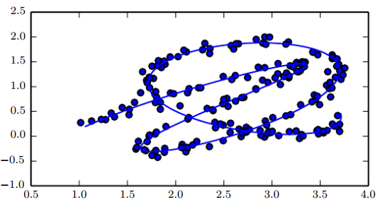
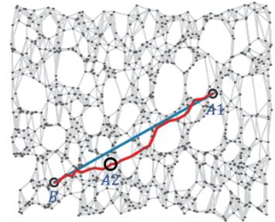
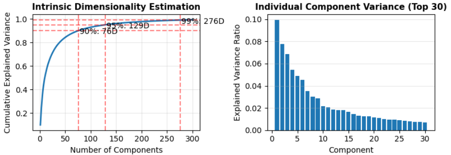

# 2.1 관측 공간의 한계

**학습 목표**

- 관측공간을 기술적 정의와 인식론적 정의 두 방향에서 서술하고, 그 기준이 '의미'가 아니라 '측정 가능성'임을 설명할 수 있다.
- 관측공간이 전제하는 네 가지 암묵적 가정(좌표 독립성·균질성·거리 유사성·선형성)을 지적하고, 그것이 어떤 한계를 낳는지 연결할 수 있다.
- 차원의 저주, 표현의 중복성, 비선형 구조의 은폐라는 세 가지 근본적 한계를 예시와 함께 설명할 수 있다.
- 다양체 가설을 사용해 관측 차원과 내재 차원의 차이를 정의하고, PCA의 누적 분산 설명률로 내재 차원을 추정할 수 있다.
- Manifold, Latent space, Representation space의 포함 관계를 구분하고, 재구성 오차가 표현 품질을 보장하지 못하는 이유를 논할 수 있다.

**이 절의 구성**

- 2.1.1 관측공간의 정의
- 2.1.2 관측공간의 암묵적 가정들
- 2.1.3 관측공간의 한계 (Limits of Observation Space)
- 2.1.4 한계 ① 차원의 저주
- 2.1.5 한계 ② 표현의 중복성
- 2.1.6 한계 ③ 비선형 구조의 은폐
- 2.1.7 Manifold, Latent Space, Representation Space
- 2.1.8 PCA를 사용한 내재 차원 추정
- 2.1.9 심화 과제
- 2.1.10 정리

> 실습 번호는 강의 슬라이드의 번호를 그대로 쓴다. 소절 번호와는 무관하다.
> 이 절의 실습은 슬라이드에서 모두 `실습 2.1.1` 한 번호로 불리므로 (a)·(b)·(c) 로만 구별한다.

---

## 2.1.1 관측공간의 정의
<!-- 슬라이드 39~40 -->

**기술적 정의** — 관측공간은 데이터로서 직접 측정·기록·저장할 수 있는 모든 변수들이 이루는 공간이다.

$$\mathcal{X} \subset \mathbb{R}^{d}, \qquad \mathbf{x}=(x_1, x_2, \dots, x_d)$$

여기서 $\mathbf{x}$ 는 하나의 데이터 샘플이며, 각 차원 $x_i$ 는 다음 세 조건을 만족한다.

- 센서, 장치, 규약에 의해 **직접 측정 가능**하다.
- 명시적 수치 또는 기호로 **기록 가능**하다.
- 모든 샘플에 대해 **동일한 좌표계를 공유**한다.

이렇게 정의하면 관측공간은 데이터의 *입력 형식*처럼 보인다.

| 데이터 종류 | 관측공간 |
|---|---|
| 이미지 | 픽셀 값들의 집합 (RGB) |
| 텍스트 | 단어 빈도, 토큰 인덱스 |
| 시계열 | 시간별 센서 측정값 |
| 테이블 데이터 | 변수(column)들의 나열 |

### 관측공간의 성격 (1) — 기준은 측정 가능성이며, 의미가 아니다

관측공간에 어떤 축이 들어가는지를 결정하는 것은 그 축의 의미가 아니라 측정 가능성이다.

- 픽셀이 *의미 있어서*가 아니라 → 측정할 수 있기 때문이다.
- 단어 빈도가 *의미를 담아서*가 아니라 → 셀 수 있기 때문이다.
- 센서 값이 *구조를 반영해서*가 아니라 → 기계가 읽을 수 있기 때문이다.

> 관측공간은 세계의 구조를 반영한 공간이 아니라, **세계를 측정할 수 있는 방식**을 반영한 공간이다.

### 관측공간의 성격 (2) — 인간·장치·규약의 산물

관측공간은 자연에 주어져 있는 것이 아니라 **선택되는 것**이다. 다음 네 가지가 모두 선택의 결과다.

- 어떤 센서를 쓰는가
- 어떤 해상도로 측정하는가
- 어떤 단위와 표준을 쓰는가
- 어떤 항목을 변수로 포함하는가

그 선택의 결과가 곧 관측공간이므로, 관측공간은 항상 **역사적·기술적·도구 의존적·임의적(contingent)** 이다.

### 인식론적 정의

관측공간이란 *무엇이 데이터로 보일 수 있는가*를 규정하는 **인식의 1차 좌표계**이다.

- 관측공간에 포함되지 않은 것은 → 존재해도 데이터로는 보이지 않는다.
- 관측공간의 좌표로 표현된 것만이 → 분석·통계·모델링의 대상이 된다.

> 관측공간은 세계를 있는 그대로 반영하는 공간이 아니라, 세계를 **보이게 만드는 필터**다.

---

## 2.1.2 관측공간의 암묵적 가정들
<!-- 슬라이드 41 -->

관측공간 위에서 분석을 수행할 때 우리는 네 가지 가정을 암묵적으로 받아들인다.

- **좌표 독립성 가정**: 각 차원을 독립 변수처럼 취급한다.
- **균질성 가정**: 모든 차원이 같은 종류의 정보를 담고 있다고 간주한다. 동일한 중요도, 동일한 의미적 성격, 동일한 통계적 역할을 가정하는 것이다. 예를 들어 이미지의 모든 픽셀을 동등한 정보 단위로 간주한다.
- **거리·유사성 가정**: 좌표 간 거리로 데이터 간 유사성을 판단할 수 있다고 가정한다.
- **선형성 가정**: 구조가 좌표의 선형 결합으로 드러날 것이라 기대한다.

이 가정들이 관측공간의 한계를 직접적으로 야기한다.

**관측공간과 구조의 관계**

관측공간은 데이터가 가진 구조를 *표현하는* 공간이 아니라, 구조가 **우연히 드러나길 기대하는** 공간이다.

- 무언가를 관측해서 기록하는 것이 구조를 보장하지 않는다.
- 구조는 관측공간 위에서 **추론의 대상**일 뿐, 내재되어 있지 않다.
- 따라서 질문해야 한다: **"데이터의 구조는 정말 이 좌표계 위에서 잘 나타나는가?"**

정리하면 관측공간은 세계의 구조를 담은 공간이 아니라 **데이터로 세계를 보는 방식을 담은 공간**이며, 그래서 여러 가지 한계를 가지게 된다.

---

## 2.1.3 관측공간의 한계 (Limits of Observation Space)
<!-- 슬라이드 42~43 -->

측정 가능성을 기준으로 구성된 좌표계는 데이터의 내재적 구조를 표현하기에 부적합하다. 관측공간은 구조 보존이 아니라 기술적 측정 가능성에 의해 결정되기 때문이다. 관측공간이 결정되는 기준과 데이터가 실제로 가진 구조를 나란히 놓으면 그 어긋남이 분명해진다.

| 관측공간이 결정되는 기준 | 데이터가 실제로 가진 구조 |
|---|---|
| 무엇을 측정할 수 있는가 | 의미적 관계 |
| 무엇을 수치로 기록할 수 있는가 | 생성 요인 간의 상호작용 |
| 무엇을 동일한 포맷으로 나열할 수 있는가 | 비선형적 제약 / 조건부·계층적 의존성 |

> 관측공간의 한계는 **잘못된 기준(측정 가능성)에서 출발**한다는 데 있다.

**관측 차원 vs 내재 차원**

실제 관측공간의 차원과, 데이터가 실질적으로 필요로 하는 차원 사이에는 큰 격차가 있다.

| 관측공간 | 차원 | 실제 내재 차원(추정) |
|---|---|---|
| MNIST | 784차원 (28×28 픽셀) | 약 10~20차원 |
| ImageNet | 196,608차원 (256×256×3) | 수백~수천 차원 |
| 자연어 어휘 | 어휘 크기 \|Vocab\|차원 (수만) | 수백 차원 |
| 유전자 발현 데이터 | 수만 개 유전자 차원 | 수십~수백 차원 |

여기서 세 가지 근본적 한계가 발생한다.

1. 차원의 저주 (Curse of Dimensionality)
2. 표현의 중복성 (Redundancy)
3. 비선형 구조의 은폐 (Nonlinear Structure Hidden)

→ **데이터 구조가 관측만으로는 쉽게 드러나지 않는다.**

---

## 2.1.4 한계 ① 차원의 저주 (Curse of Dimensionality)
<!-- 슬라이드 44, 47~48 -->

차원의 저주의 핵심 증상은 **거리 집중**과 **희소성**이다.

- 차원이 높아질수록 데이터 점 사이의 거리가 거의 같아지고, 공간의 대부분이 빈 상태가 된다.
- 고차원에서 유의미한 최근방 탐색(k-NN 분류)을 하려면 **지수적으로 많은 샘플**이 필요하다.
- 최대 거리와 최소 거리의 비율이 1에 수렴하여 **거리 측정이 무의미**해진다.

**거리 집중 현상(Distance Concentration)** 이란 거리가 다양하게 분포하지 않고 하나의 값으로 수렴(집중)하는 현상을 말한다. MNIST에서도 실제로 *같은 숫자 간 거리 ≈ 다른 숫자 간 거리* 가 된다.

이미지 $\mathbf{x}, \mathbf{y}$ 의 유클리드 거리(vector distance)는 다음과 같이 계산된다.

$$d(\mathbf{x},\mathbf{y}) = \lVert \mathbf{x}-\mathbf{y}\rVert_2 = \sqrt{\sum_{i=1}^{784}(x_i-y_i)^2}$$

**수학적 배경** — 단위 하이퍼큐브 $\mathbf{x},\mathbf{y}\sim \mathrm{Unif}([0,1]^d)$ (또는 하이퍼스피어) 위에서 거리의 평균과 표준편차는 다음의 차수를 가진다.

$$\mathbb{E}[\text{dist}]=O(\sqrt{d}), \qquad \mathrm{std}[\text{dist}]=O(1)$$

따라서 변동계수는 0으로 수렴한다.

$$\therefore\;\; \mathrm{CV}=\frac{\mathrm{std}[\text{dist}]}{\mathbb{E}[\text{dist}]} \xrightarrow[\;d\to\infty\;]{} 0 \qquad (\mathrm{CV}: \text{Coefficient of Variation})$$

차원이 커질수록 거리의 **상대적 흔들림(변동)이 사라진다.** 또한 고차원에서는 최소 거리와 최대 거리가 모두 평균 거리로 붙는다.

$$d_{\min}(d)\approx d_{\max}(d)\approx \mathbb{E}[\text{dist}], \qquad \frac{d_{\max}(d)-d_{\min}(d)}{d_{\min}(d)} \xrightarrow[\;d\to\infty\;]{} 0$$

모든 점이 비슷한 거리에 있으므로 **'가까운 이웃'이라는 개념 자체가 무의미해진다.**

이 두 가지 — 차원이 커질수록 거리가 한 값으로 모인다는 것, 그리고 그것이 MNIST 같은 실제 데이터에서도 그대로 나타난다는 것 — 을 수치로 확인한다.

### 실습 2.1.1 (a) 고차원 공간의 희소성과 거리 집중 현상

> 노트북: `code/2.1.1.ObsevationSpace.ipynb`

정규분포에서 sampling한 `dimensions=[2, 10, 50, 100, 500]` 각 1000개의 벡터에서 거리의 평균, 표준편차, 변동계수(CV: Coefficient of Variation)를 확인한다.

모든 점 쌍의 유클리드 거리를 구한 뒤 그 평균·표준편차·변동계수를 차원별로 비교한다.

```python
from scipy.spatial.distance import pdist

def analyze_distance_distribution(n_samples=1000, dimensions=[2, 10, 50, 100, 500]):
    """차원별 점들 간 거리 분포 분석"""
    results = {}
    for dim in dimensions:
        # 균일 분포에서 샘플링 (단위 큐브)
        data = np.random.rand(n_samples, dim)
        # 모든 점 쌍 간 거리 계산
        distances = pdist(data, metric='euclidean')
        results[dim] = {
            'mean': np.mean(distances),
            'std':  np.std(distances),
            'min':  np.min(distances),
            'max':  np.max(distances),
            'distances': distances,
        }
    return results

results = analyze_distance_distribution()

# 상대적 분산 (coefficient of variation)
cv = [results[d]['std'] / results[d]['mean'] for d in results]

for dim in results:
    r = results[dim]
    print(f'{dim}차원: mean={r["mean"]:.3f}, std={r["std"]:.3f}, CV={r["std"]/r["mean"]:.3f}')
```

| 차원 수 | Mean | Std | CV |
|---|---|---|---|
| 2차원 | 0.516 | 0.246 | 0.477 |
| 10차원 | 1.262 | 0.245 | 0.194 |
| 50차원 | 2.877 | 0.242 | 0.084 |
| 100차원 | 4.067 | 0.243 | 0.060 |
| 500차원 | 9.130 | 0.243 | 0.027 |



*그림 2-3. 차원별 거리의 성장(Distance Growth)과 거리 집중 효과(Distance Concentration Effect)*

**해석**: 차원이 높아지면 Mean은 증가하고 std는 동일하게 유지된다. 즉 차원이 높을수록 데이터 사이의 거리가 거의 같아지는 **거리 집중 현상(Distance Concentration)** 이 확인된다.

### 실습 2.1.1 (b) MNIST 숫자 간 거리 검토

> 노트북: `code/2.1.1.ObsevationSpace.ipynb`

MNIST에서 intra/inter class 거리 분포를 확인한다 — *"같은 숫자 간 거리 ≈ 다른 숫자 간 거리"* 인가?

벡터 쌍을 무작위로 뽑아 같은 숫자끼리(intra-class)와 다른 숫자끼리(inter-class)의 유클리드 거리를 각각 모은다.

```python
from scipy.spatial.distance import euclidean

intra_class_distances = []
inter_class_distances = []
n_pairs = 10000  # 각 범주에서 샘플링할 쌍의 수

# 클래스별 인덱스를 미리 만들어 두면 샘플링이 빨라진다
class_indices = [np.where(y == i)[0] for i in range(10)]

# Intra-class : 같은 클래스에서 서로 다른 두 점
count = 0
while count < n_pairs:
    c = np.random.randint(0, 10)
    if len(class_indices[c]) < 2:
        continue
    idx1, idx2 = np.random.choice(class_indices[c], 2, replace=False)
    intra_class_distances.append(euclidean(X[idx1], X[idx2]))
    count += 1

# Inter-class : 서로 다른 두 클래스에서 각각 한 점
count = 0
while count < n_pairs:
    c1, c2 = np.random.choice(10, 2, replace=False)
    idx1 = np.random.choice(class_indices[c1])
    idx2 = np.random.choice(class_indices[c2])
    inter_class_distances.append(euclidean(X[idx1], X[idx2]))
    count += 1

intra_dists = np.array(intra_class_distances)
inter_dists = np.array(inter_class_distances)
for name, d in [('Intra-class (Same Digit)', intra_dists),
                ('Inter-class (Different Digit)', inter_dists)]:
    print(f'{name:<30} | {d.mean():.3f} | {d.std():.3f} | {d.std()/d.mean():.3f}')
```

| Category | Mean | Std Dev | CV |
|---|---|---|---|
| Intra-class (Same Digit) | 9.002 | 1.754 | 0.195 |
| Inter-class (Different Digit) | 10.334 | 1.318 | 0.128 |



*그림 2-4. MNIST의 클래스 내부 거리와 클래스 간 거리 분포*

**해석**

- Intra-class: 거리는 약간 가깝지만 **분산은 더 크다.**
- 변동계수(CV)가 더 크다 → 동일한 숫자의 변동성이 다른 숫자보다 상대적으로 크게 보인다.
- 히스토그램이 겹친다 → **클래스 간 유클리드 거리만으로는 분류가 불가능**하다.

---

## 2.1.5 한계 ② 표현의 중복성 (Redundancy)
<!-- 슬라이드 45 -->

- 관측 변수들은 서로 높은 상관관계를 가진다.
- 동일한 정보를 다양한 방식으로 표현하기 때문에, **본질적 자유도보다 훨씬 많은 차원**을 차지한다.
- MNIST에서 인접 픽셀은 거의 유사하다. 즉 784개 차원 중 독립적인 정보를 가진 차원은 훨씬 적다.

**중복성이 분석을 방해하는 방식**

1. **다중공선성(Multicollinearity)**: 상관이 높은 변수들 사이에서 중요도 판별이 어려워지고, 학습이 불안정해진다.
2. **과적합(Overfitting)**: 하나의 정보를 여러 변수 경로로 반복 처리하게 되어 과적합이 발생한다.

**예: 기상 관측** — 기온, 체감온도, 열지수, 불쾌지수는 서로 0.9 이상의 상관관계를 가진다. 이들을 모두 입력으로 사용하면 1~2개의 기저 요인(날씨의 '더움' 차원)이 존재하는 구조를 오히려 놓치게 된다. PCA나 오토인코더로 차원을 축소하면 이 기저 구조를 파악할 수 있다.

---

## 2.1.6 한계 ③ 비선형 구조의 은폐
<!-- 슬라이드 45~46 -->

- 관측공간에서 데이터는 복잡한 **비선형 다양체(manifold)** 위에 존재한다. 그래서 복잡해 보인다.
- 관측공간의 직교 좌표계는 이 구조를 직접 드러내지 못한다.

**예: Swiss Roll** — 3차원 공간에 나선형으로 감겨 있는 2차원 manifold다. 2차원 내재 구조에서 멀리 떨어져 있는 점이 3차원 관측공간에서는 매우 가까워 보인다.



*그림 2-5. Swiss Roll — 3차원 관측공간에 감긴 2차원 다양체*



*그림 2-6. 같은 데이터를 2차원 내재 구조로 펼친 모습. 관측공간에서 가깝게 보이던 점들이 실제로는 멀리 떨어져 있다*

**예: 인간 동작 데이터** — 인간의 동작은 관절 각도의 고차원 공간에 존재한다(각 관절이 3차원 좌표를 가진다). 그러나 실제로 가능한 동작은 물리적 제약으로 인해 훨씬 낮은 차원의 다양체 위에 존재한다. 여기서 두 종류의 차원이 갈린다.

- **관측공간 차원**: 데이터를 **기록하는 방식**이 결정한다.
- **내재 차원(Intrinsic dimension)**: 데이터를 **생성하는 물리적 과정**이 결정한다.

**대부분의 관측공간은 과잉 표현되어 있다**

| 데이터 | 관측 차원 → 내재 차원 | 압축률 / 내재 요인 |
|---|---|---|
| Swiss Roll | 3 → 2 | (왜 1차원이 아닌가?) |
| MNIST | 784 → 10~20 | 40~80배 / 회전(1), 굵기(1), 기울기(1), 필체 style(5~10) |
| CIFAR-10 | 3,072 (32×32×3) → 10~20 | 150~300배 |
| 음성 신호(Freq) | 40~80 → 10~20 | + 구조: 음소 조합 규칙 |

압축률이 클수록 관측공간에서 직접 분석하는 것은 비효율적이다. Deep Learning은 Layer를 거치며 정교하게 낮은 차원의 표현 공간을 학습하고, 관측공간의 **과잉 차원을 제거**하여 데이터 구조를 찾아낸다. 이것이 **딥러닝이 효과적인 원인**이다.

**다양체 가설 (Manifold Hypothesis)과 내재 차원**

데이터가 $d$ 차원 관측공간에 존재하더라도, 실제로는 $k$ 차원 다양체 $M$ 위에 분포한다고 가정한다($k \ll d$).

$$\mathcal{X}\subset M \subset \mathbb{R}^{d}, \qquad \dim(M)=k$$

내재 차원은 곧 다양체의 차원 $k$ 이다.

---

## 2.1.7 Manifold, Latent Space, Representation Space
<!-- 슬라이드 49~50 -->

**Manifold(다양체) 정의**

- 각 점 근처가 유클리드 공간과 **국부적으로 유사한** 위상 공간이다.
- 복잡한 구조를 더 단순한 공간의 **토폴로지 속성**의 관점에서 설명할 수 있다.
- 여기서 토폴로지는 연결 구조를 뜻한다. 연결되어 있는가? 끊어져 있는가? 구멍이 있는가? 몇 개의 조각으로 나뉘는가?



*그림 2-7. 다양체 개념. 국소적으로는 유클리드 공간처럼 보이는 곡면 구조와, 회전·굵기라는 내재 요인을 축으로 배열한 MNIST 표현*

**Manifold learning — MNIST의 경우**

- 데이터셋에 존재하는 수많은 이미지를 고차원 공간에 mapping한다.
- 유사한 이미지는 공간에 모여 있을 것이다.
- 점들의 집합을 잘 아우르는 전체 공간의 **subspace가 manifold**이며, subspace이기에 낮은 차원으로 표현 가능하다.
- 즉 고차원 공간에서 **특징(feature)을 축으로 하는 공간**을 찾았다는 뜻이다.



*그림 2-8. 점들의 집합을 아우르는 저차원 subspace로서의 manifold*

이렇게 manifold를 찾고 나면, 두 점 사이의 거리도 공간을 가로지르는 직선이 아니라 manifold를 따라가는 경로로 측정할 수 있게 된다.



*그림 2-9. 이웃 그래프 위의 경로와 공간을 가로지르는 직선 경로의 차이*

**용어 구분**

- **Latent space**: 데이터셋이 학습을 통해 mapping되며, 데이터 구조가 드러나는 의미 있는 다차원 표현 공간이다. Manifold-**like** structure가 관찰되지만 매끄러운 연속면이 아닐 수 있다.
- 데이터셋의 정보(특징)를 구조적 다차원 공간에 잘 mapping할 수 있다면, 그것이 데이터를 좋은 표현의 latent space에 mapping하는 것이며 곧 **Representation Learning**이다.

> 포함 관계: Representation learning $>$ Manifold learning, Latent space $>$ Manifold

**재구성 오차 (Reconstruction error)**

저차원 표현(latent representation / code / variable) $z$ 에서 원본 공간으로 복원할 때 발생하는 오차다.

$$L = \lVert x - f(z)\rVert^{2}$$

Autoencoder의 재구성 오차는 다음과 같이 쓴다.

$$L_{recon} = \frac{1}{N}\sum_i \lVert x_i - D(E(x_i))\rVert^{2}$$

- Encoder: 관측공간 → 잠재공간, $z = E(x;\theta)$
- Decoder: 잠재공간 → 관측공간, $\hat{x} = D(z;\varphi)$

재구성 오차가 작다는 것은 압축된 표현이 데이터의 본질적 구조를 잘 포착했음을 의미한다. 하지만 **재구성이 완벽하다고 해서 좋은 표현을 학습했다고 보장할 수는 없다**(→ 심화 과제 2-2).

**어떤 정보가 중요한가?**

고차원 데이터를 저차원으로 투영할 때 정보 손실은 필연적으로 발생한다. 그러므로 무엇을 보존하고 무엇을 버릴 것인가를 결정해야 한다.

- PCA: **분산**을 최대한 보존한다.
- LDA: **클래스 분리**를 최대화한다.

---

## 2.1.8 PCA를 사용한 내재 차원 추정
<!-- 슬라이드 51~52 -->

PCA를 쓰면 내재 차원을 정량적으로 추정할 수 있다.

**누적 분산 설명률 (CVR: Cumulative Variance explained Ratio)**

$$\mathrm{CVR}(k)=\frac{\sum_{i=1}^{k}\lambda_i}{\sum_{i=1}^{d}\lambda_i}, \qquad \lambda_i:\; i\text{번째 주성분의 분산(고유값)}$$

이 값은 상위 $k$ 개 주성분이 설명하는 분산의 합을 전체 데이터가 가진 총 분산으로 나눈 것이며, *전체 정보 중 상위 $k$ 개 축이 얼마나 설명하는가*를 뜻한다.

**내재 차원 추정**

$$k^{*}=\arg\min_{k} \; k \quad \text{s.t.}\quad \mathrm{CVR}(k)\ge \text{threshold}$$

- Threshold: 0.90(실용), 0.95(일반), 0.99(보수)
- 예를 들어 $\mathrm{CVR}(k=50)\ge 0.95$ 이면 내재 차원은 약 50으로 추정한다.
- 단, PCA는 **"정보 ≈ 분산"** 으로 간주한다는 점에 주의해야 한다.

이 방법으로 MNIST의 내재 차원을 실제로 추정해 보면, PCA가 "정보 ≈ 분산"으로 간주한다는 단서가 어떤 결과로 이어지는지 드러난다.

### 실습 2.1.1 (c) MNIST 내재 차원 추정 (PCA)

> 노트북: `code/2.1.1.ObsevationSpace.ipynb`

Sample 1000개, PCA component 300개를 사용한다.

```python
from sklearn.decomposition import PCA

mnist = fetch_openml('mnist_784', version=1, parser='auto')
X = mnist.data[:1000].astype('float32') / 255.0  # 정규화

# PCA로 분산 비율 분석 (선형 근사)
pca = PCA(n_components=300)
pca.fit(X)

# 누적 분산 비율
cumsum_var = np.cumsum(pca.explained_variance_ratio_)

# 90%, 95%, 99% 분산을 설명하는 차원 찾기
thresholds = [0.90, 0.95, 0.99]
dims = {t: np.argmax(cumsum_var >= t) + 1 for t in thresholds}

print(f'원본 차원: {X.shape[1]}')
for t in thresholds:
    print(f'{int(t*100)}% 분산 설명: {dims[t]}차원 (압축률 {X.shape[1]/dims[t]:.1f}x)')
```

| 설명 비율 | 필요 차원 수 | 압축률 |
|---|---|---|
| 90% | 76 | 10.3× |
| 95% | 129 | 6.1× |
| 99% | 276 | 2.8× |



*그림 2-10. MNIST의 누적 분산 설명률(CVR)과 주성분별 분산 기여율*

**해석**: PCA라는 **선형** 분석으로 추정한 차원(76~276)은 MNIST의 내재 차원(10~20)과 큰 차이가 있다.

---

## 2.1.9 심화 과제
<!-- 슬라이드 53~54 -->

### 심화 과제 2-1 — 관측공간의 한계와 내재 차원(Intrinsic Dimension)의 충돌

**목적**: 관측공간 차원과 내재 차원의 차이를 정량·개념적으로 분석하고, 왜 관측공간 기반 분석이 구조를 붕괴시키는지 논증한다.

**상황 설정** — 다음 세 가지 데이터 중 하나를 선택한다.

- A. MNIST 이미지 — 관측공간 784차원
- B. 자연어 문장 데이터(Bag-of-Words 표현) — 관측공간 \|Vocab.\|(수만) 차원
- C. 유전자 발현 데이터 — 관측공간 수만 개 차원

**요구 사항**

1. 선택한 데이터에서 관측공간 차원 $d$ 와 내재 차원 $k$ 가 왜 크게 차이 나는지 설명하라(물리적/생성적 관점 포함).
2. 관측공간에서 사용하는 거리(예: Euclidean distance)가 왜 의미를 잃는지를 "차원의 저주", "거리 집중 현상" 중 최소 하나의 개념을 사용해 설명하라.
3. PCA를 이용한 내재 차원 추정 방법(CVR 기준)을 개념적으로 설명하고, "PCA의 한계"를 명확히 한 문장 이상으로 지적하라.
4. 위 데이터에 대해 "관측공간 기반 분석이 실패했다"는 사실을 '모델 실패'가 아닌 **'구조적 신호'** 로 어떻게 재해석할 수 있는지 논증하라.

**제출 형식(pdf)**: 1page(LLM을 사용해 작성), 결과 뒤에 LLM과의 대화 URL 또는 log 첨부

### 심화 과제 2-2 — Latent Space는 언제 '구조를 드러내는 공간'이 되는가?

**목적**: Latent space가 항상 의미 있는 구조 공간이 아님을 이해하고, "좋은 representation"의 조건을 비판적으로 정립한다.

**상황 설정** — 다음 두 모델을 비교하라.

- 모델 A: Autoencoder, 재구성 오차 거의 0
- 모델 B: Autoencoder, 재구성 오차는 더 크지만 latent space 시각화에서 군집/연속 구조가 관찰됨

**요구 사항**

1. 모델 A에서 재구성 오차가 매우 작은데도 '좋은 표현'이라고 말할 수 없는 이유를 최소 두 가지 다른 관점에서 설명하라(예: 항등 사상, 구조 보존, geometry, 정보 분산 등).
2. "Latent space = manifold"라는 주장에 대해 언제는 타당하고 언제는 위험한 주장인지 강의 내용을 근거로 논하라.
3. 모델 B가 분석 도구(instrument)로서 더 유리할 수 있는 이유를 **관측공간 → 표현공간 → 구조 판단**의 흐름으로 설명하라.
4. 다음 문장을 비판적으로 평가하라: *"재구성 오차는 representation quality의 충분조건이다."*

**제출 형식(pdf)**: 1page(LLM을 사용해 작성), 결과 뒤에 LLM과의 대화 URL 또는 log 첨부

---

## 2.1.10 정리
<!-- 슬라이드 51 -->

> **정리**
> 관측공간 자체가 데이터 구조를 담기에 부적합하다 — **차원의 저주, 표현의 중복성, 비선형 구조의 은폐.**
> 관측공간은 측정 가능성이라는 잘못된 기준에서 출발하며, 좌표 독립성·균질성·거리 유사성·선형성이라는 암묵적 가정을 강요한다.
> 데이터는 관측 차원보다 훨씬 낮은 내재 차원의 다양체 위에 놓여 있고, PCA 같은 선형 도구로는 그 내재 차원조차 제대로 추정되지 않는다.
> **전통적 분석의 한계 = 관측공간의 한계 + 분석 방식의 한계**
