# 2.2 관측 통계의 제약

> **응용데이터분석 (Applied Data Analysis) — 딥러닝 기반 데이터 분석**
> 데이터사이언스융합학과 · Rev 1.0
> 원본 슬라이드: 55 ~ 66 (12장)

**학습 목표**

- 관측통계를 "정보 손실을 동반하는 다대일 요약 연산자"로 정의하고, 그것이 전제하는 암묵적 가정을 지적할 수 있다.
- 평균·상관계수·분산·집계가 각각 어떤 구조(다중 모드·비선형 관계·꼬리·조건부 구조)를 붕괴시키는지 구분할 수 있다.
- Anscombe's Quartet과 Simpson's Paradox를 사용해 "같은 통계, 다른 구조"를 설명할 수 있다.
- 고차 통계량·KDE·상호정보량이 관측통계의 제약을 어디까지 완화하고 어디서 멈추는지 판단할 수 있다.
- 관측 통계의 실패를 모델의 실패가 아니라 구조 존재의 신호로 재해석할 수 있다.

**이 절의 구성**

- 2.2.1 같은 통계, 다른 구조 — 요약 통계량이 놓치는 것들
- 2.2.2 Anscombe's Quartet
- 2.2.3 왜 구조가 붕괴되는가
- 2.2.4 사례 연구
- 2.2.5 관측통계 제약을 완화하려 했던 전통적 대안들
- 2.2.6 심화 과제
- 2.2.7 정리

> 이 절에는 슬라이드에 배정된 실습이 없다. 심화 과제 2-3 · 2-4 만 절 맨 뒤에 둔다.

---

## 2.2.1 같은 통계, 다른 구조 — 요약 통계량이 놓치는 것들
<!-- 슬라이드 55 -->

관측공간 위의 복합적 구조(다중 모드·비선형·조건부·꼬리)를 '평균·분산·상관' 같은 **저차 요약으로 환원하는 순간 구조의 붕괴는 필연적**이다. 관측공간에 대한 통계적 분석이 얼마나 많은 정보를 잃어버리는지 살펴본다.

**관측통계란?** — 데이터를 요약하는 전통적인 기술 통계량들이다.

$$\text{평균(Mean): } \mu=\frac{1}{N}\sum_i x_i \qquad \text{분산(Variance): } \sigma^{2}=\frac{1}{N}\sum_i (x_i-\mu)^{2}$$

$$\text{공분산(Covariance) — 변수 간 선형 관계의 방향/규모: } \mathrm{Cov}(X,Y)=\mathbb{E}[(X-\mu_X)(Y-\mu_Y)]$$

$$\text{상관계수(Correlation) — 변수 간 선형 관계의 방향/강도: } \rho=\frac{\mathrm{Cov}(X,Y)}{\sigma_X \sigma_Y}$$

**관측통계의 본질: 요약 연산자**

관측통계는 데이터(표본 집합) $D=\{x_i\}_{i=1}^{N}$ 를 소수의 수치 $S(D)\in\mathbb{R}^{m}$ 로 투영하는 과정이다.

$$S:\mathcal{X}^{N}\rightarrow \mathbb{R}^{m}, \qquad m \ll Nd$$

여기서 **정보 손실을 동반하는 다대일 사상**이 되고, 그로부터 제약(한계)이 발생한다.

- 관측통계는 *정리*가 아니라 **버림**을 포함한다.
- 무엇을 버릴지가 암묵적으로 결정된다.

**암묵적 가정** — 관측통계는 데이터의 **1차·2차 모멘트만** 포착하며, 가우시안 분포를 가정하는 경향이 있다.

---

## 2.2.2 Anscombe's Quartet — 동일한 통계, 다른 구조
<!-- 슬라이드 56 -->

동일한 평균, 분산, 상관계수를 가지는 네 개의 데이터셋이 있다.

| 데이터셋 | 실제 구조 |
|---|---|
| Dataset 1 | 선형 관계 |
| Dataset 2 | 2차 곡선 관계 |
| Dataset 3 | 선형이지만 이상치 존재 |
| Dataset 4 | 하나의 극단적 이상치가 상관을 만듦 |

→ **관측통계로는 데이터 구조를 파악할 수 없다.**

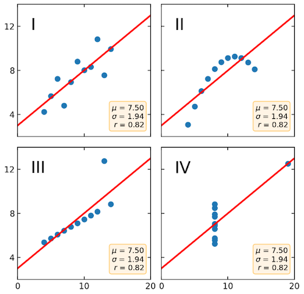

*그림 2-11. Anscombe's Quartet*

**상관계수(Correlation)의 한계**

상관계수 하나로는 관계의 형태를 알 수 없다. 아래 그림의 아래쪽 줄은 모두 상관계수가 0이지만, 실제로는 강한 결정적 구조(포물선, X자, 원 등)를 가지고 있다.

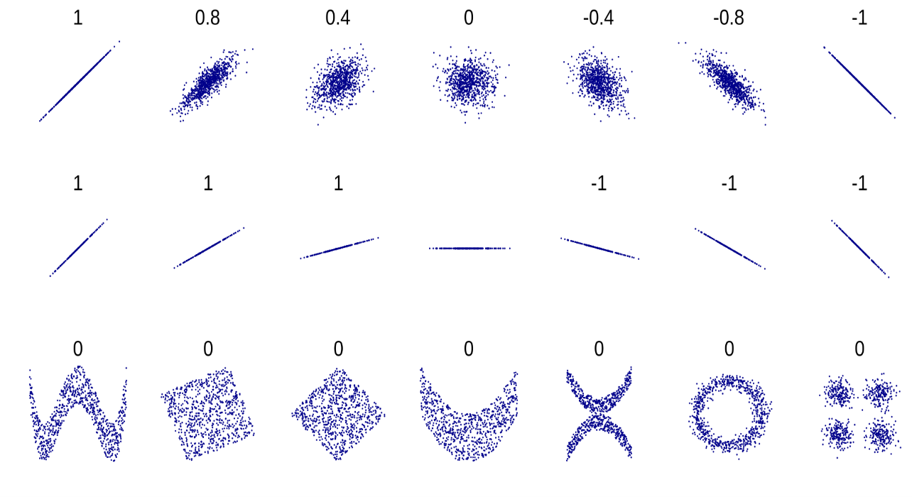

*그림 2-12. 상관계수가 같거나 0이어도 구조는 전혀 다를 수 있다*

---

## 2.2.3 왜 구조가 붕괴되는가
<!-- 슬라이드 57~58 -->

**① 평균 — 다중 모드(Multi-modality) 무시**

- 평균은 다중모드를 표현하지 못한다.
- 따라서 계산된 평균 위치가 **두 클러스터 사이의 빈 공간**일 수 있다.

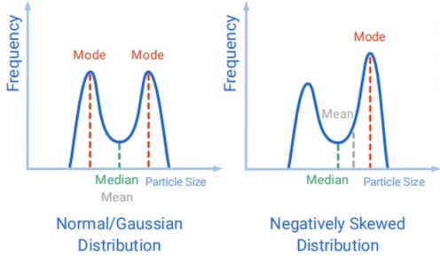

*그림 2-13. 다중 모드 분포와 왜곡된 분포에서 평균이 놓이는 자리*

**② 상관계수 — 비선형 관계 누락 (상관 0 ≠ 관계 없음)**

- $y=x^{2}$ 같은 강한 비선형 관계는 상관계수가 0에 가깝다.
- 상관계수는 **선형 투영 후의 정렬 정도**를 요약하며, 비선형 관계는 통계량에서 제거된다.

**③ 평균·분산 — 이상치/극단값에 민감, 꼬리 분포 무시**

- 분산은 이상치에 민감하다(왜도와 첨도를 제대로 반영하지 못한다).
- 꼬리 분포가 요약에 잠식된다.

**④ 집계 — 조건부 구조 붕괴 (Conditional Structure Collapse)**

집계는 구조를 숨긴다.

- $X$, $Y$ 의 조건부 분포가 복잡(다중 모드·비대칭 등)해도, 단순 상관이나 집계는 이를 드러내지 못한다.
- **이분산성(heteroscedasticity)**: $\mathrm{Var}(Y\mid X=x)=\sigma^{2}(x)$ 를 무시한다.
- **불연속(Discontinuity)과 regime switching**(생성 규칙의 변화)을 표현하지 못한다.

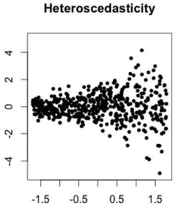

*그림 2-14. 이분산성(Heteroscedasticity) — 조건부 분산이 $X$ 에 따라 변한다*

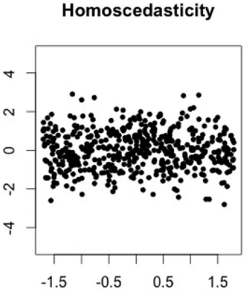

*그림 2-15. 등분산성(Homoscedasticity) — 비교를 위한 기준*

생성 규칙 자체가 구간마다 바뀌는 경우도 있다. 아래 시계열은 음영으로 표시된 구간에서 다른 생성 규칙이 작동한다.

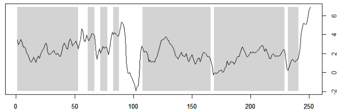

*그림 2-16. Regime switching — 구간마다 생성 규칙이 바뀌는 계열*

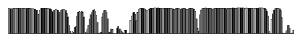

*그림 2-17. 그림 2-16의 계열에서 추정된 국면(regime) 지표*

---

## 2.2.4 사례 연구
<!-- 슬라이드 59~60 -->

**사례 1: Simpson's Paradox — 집계의 함정**

Simpson's Paradox는 전체 데이터에서 관찰되는 경향이 하위 그룹별로는 반대로 나타나는 현상이다.

두 병원의 생존율을 비교하면 병원 A가 80%, 병원 B가 70%다. 그런데 경증 환자와 중증 환자로 나누면 **두 그룹 모두에서 병원 B의 생존율이 더 높다.** 이는 병원 A가 경증 환자를 더 많이 받아서 전체 평균이 높아진 것이다.

$$\text{병원 A} = (\text{경증 }80\% \times \text{생존율 }90\%) + (\text{중증 }20\% \times \text{생존율 }60\%) = 80\%$$

$$\text{병원 B} = (\text{경증 }30\% \times \text{생존율 }95\%) + (\text{중증 }70\% \times \text{생존율 }65\%) = 70\%$$

→ 평균이나 상관 같은 집계 통계는 **하위 구조를 완전히 은폐한다.**

**사례 2: 양방향 관계와 피드백 루프**

경제학에서 가격과 수요의 관계에 단순 상관분석을 적용하면 두 방향의 관계가 동시에 관측된다.

- 수요가 높으면 가격이 상승한다 (양의 상관)
- 가격이 높으면 수요가 감소한다 (음의 상관)

두 효과가 동시에 작용(양방향 관계 / 피드백 루프)하면 관측된 상관계수는 0에 가까울 수 있다. → **두 가지 규칙(두 가지 상관관계, 두 가지 인과 구조)이 은폐된다.**

**사례 3: 이미지 픽셀 간 공분산의 무용성**

- 이미지의 인접 픽셀들은 높은 상관을 가진다(같은 물체의 일부이므로).
- 하지만 픽셀 간 공분산 행렬(784×784)을 분석해서 이미지가 '고양이'인지 '개'인지 알 수 없다.
- 공분산은 단지 **인접성**을 반영할 뿐, 의미론적 구조(귀, 눈, 털의 배치 패턴)를 포착하지 못한다.

**사례 4: 금융 데이터의 꼬리 리스크**

주식 수익률은 평균 0%, 표준편차 15%인 가우시안처럼 보인다. 하지만 실제로는 다음 세 가지 특성을 가진다.

- **Fat tails**: 극단적 사건이 훨씬 자주 발생한다.
- **Skewness**: 손실과 이익이 비대칭이다.
- **시간 의존성**: 변동성 클러스터링이 나타난다 (regime switching).

→ 평균과 분산만으로는 이러한 특성을 설명할 수 없다.

---

## 2.2.5 관측통계 제약을 완화하려 했던 전통적 대안들
<!-- 슬라이드 61~62 -->

**① 고차 통계량**

왜도 (Skewness, 3차 모멘트)

$$\gamma_1=\frac{\mathbb{E}[(X-\mu)^{3}]}{\sigma^{3}}$$

- $\gamma_1 = 0$: 대칭 분포
- $\gamma_1 > 0$: 오른쪽 꼬리 (수입 분포, 수명 데이터)
- $\gamma_1 < 0$: 왼쪽 꼬리

<!-- 원문 불일치 확인 필요: 슬라이드 61 은 오른쪽 꼬리·왼쪽 꼬리를 모두 "γ₁ < 0" 으로 적었다. 오른쪽 꼬리는 γ₁ > 0 이 맞으므로 부등호를 바로잡았다 -->

첨도 (Kurtosis, 4차 모멘트, 초과 첨도)

$$\gamma_2=\frac{\mathbb{E}[(X-\mu)^{4}]}{\sigma^{4}}-3$$

- $\gamma_2 = 0$: 정규 분포
- $\gamma_2 > 0$: 두꺼운 꼬리 (이상치가 많음, 금융 수익률)

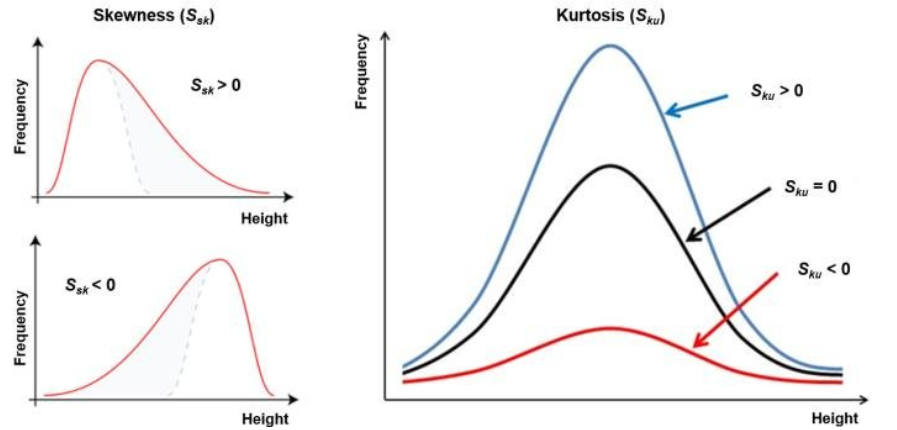

*그림 2-18. 왜도(Skewness)와 첨도(Kurtosis)에 따른 분포 형태의 차이*

**② 커널 밀도 추정 (KDE, Kernel Density Estimation)**

- 관측 통계의 한계를 회피하여 분포를 **비모수적으로 추정**하는 방법이다.
- 다중모드를 **시각화**할 수 있으나 구조를 드러내지는 못한다.
- **시각화 ≠ 구조**: "어디가 많은지"는 "왜 그렇게 되었는지"와 다르다.

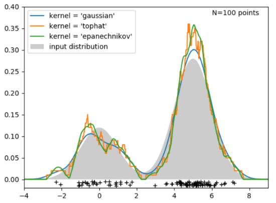

*그림 2-19. 커널 종류에 따른 KDE 추정 결과와 다중모드의 시각화*

**③ 상호 정보량 (Mutual Information) — 비선형 의존성 포착**

상관계수와 달리 비선형 관계도 측정한다.

$$I(X;Y)=0 \;\Rightarrow\; X \text{와 } Y \text{는 완전히 독립}$$

$$\rho=0 \;\Rightarrow\; \text{강한 비선형 의존성이 있을 수 있음}$$

상호정보량은 두 확률 변수가 공유하는 정보량으로 정의되며, 엔트로피의 겹침으로 이해할 수 있다.

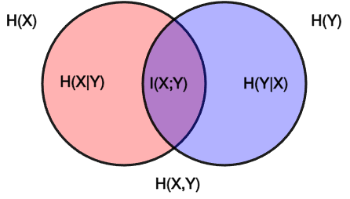

*그림 2-20. 엔트로피와 상호정보량의 관계*

상관계수가 0인 산점도들도 상호정보량 기반 지표로는 뚜렷한 의존성이 검출된다.

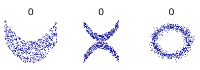

*그림 2-21. 상관계수 $\rho \approx 0$ 이지만 강한 결정적 관계를 가진 예시들*

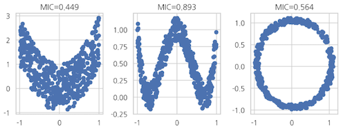

*그림 2-22. 같은 데이터에 대해 정보 기반 의존성 측도(MIC)가 검출하는 값*

상호정보량은 변수 간 **의존성의 존재와 강도**를 측정하지만, **구조를 드러내지는 못한다.**

---

## 2.2.6 심화 과제
<!-- 슬라이드 63~64 -->

### 심화 과제 2-3 — KDE는 무엇을 보여주고, 무엇을 가리는가?

**목적**: 커널 밀도 추정(KDE)이 분포의 형태를 시각화할 수 있음에도, 왜 데이터 구조 분석의 도구로는 불충분한지를 개념적으로 구분한다.

**문제 설정** — 다음 두 데이터 생성 과정을 고려하라.

- **데이터 A**: 두 개의 서로 다른 하위 집단에서 생성됨. 각 하위 집단의 분포는 단일 모드이며, 하위 집단의 비율이 크게 다르다.
- **데이터 B**: 단일 생성 메커니즘에서 생성됨. 분포 자체가 다중 모드이다.

두 데이터 모두에 대해 주변 분포 $p(Y)$ 에 KDE를 적용했을 때, 시각적으로 유사한 다중 모드 분포가 관찰되었다고 가정한다.

**요구 사항**

1. KDE가 위 두 경우 모두에서 다중 모드를 시각화할 수 있는 이유를 설명하라.
2. 그럼에도 불구하고 KDE 결과만으로 데이터 A와 B의 생성 구조가 서로 다르다는 사실을 판별할 수 없는 이유를 설명하라.
3. "KDE가 구조를 드러낸다"는 주장에 대해, 어느 의미에서는 맞고 강의에서 말하는 '구조'의 의미에서는 왜 부적절한지를 구분하여 논하라.
4. 이 한계를 조건부 분포 $p(Y \mid X)$ 관점에서 명확히 정리하라.

**제출 형식(pdf)**: 1page(LLM을 사용해 작성), 결과 뒤에 LLM과의 대화 URL 또는 log 첨부

### 심화 과제 2-4 — Mutual Information은 왜 구조를 '감지'하지만 '드러내지' 못하는가?

**목적**: Mutual Information(MI)이 비선형 의존성까지 감지할 수 있음에도, 왜 데이터 구조 분석의 해답이 될 수 없는지를 명확히 이해한다.

**문제 설정** — 다음 세 경우를 고려하라.

- **Case 1**: $Y = X^{2}$
- **Case 2**: $X$ 에 따라 $Y$ 가 두 개의 서로 다른 모드 중 하나에서 생성됨
- **Case 3**: $Y$ 는 $X$ 와 강하게 의존하지만, 조건부 분포의 분산과 꼬리 구조가 $X$ 에 따라 크게 변함

세 경우 모두에서 $I(X;Y)$ 는 높게 측정되었다고 가정한다.

**요구 사항**

1. MI가 위 세 경우 모두에서 높은 값을 가질 수 있는 이유를 설명하라.
2. 그럼에도 불구하고 MI만으로는 세 경우의 조건부 분포 구조 차이를 구분할 수 없는 이유를 설명하라.
3. "MI는 비선형 관계를 포착하므로 구조를 보여 준다"는 주장에 대해 개념적 오류가 어디에 있는지 명확히 지적하라.
4. MI를 '구조의 지표'가 아니라 **'구조 존재의 신호'** 로 해석해야 하는 이유를 논하라.

**제출 형식(pdf)**: 1page(LLM을 사용해 작성), 결과 뒤에 LLM과의 대화 URL 또는 log 첨부

---

## 2.2.7 정리
<!-- 슬라이드 65~66 -->

같은 통계, 다른 구조 — 이 절에서 본 네 사례를 한 표로 정리하면 다음과 같다.

| 사례 | 요약 통계가 보여주는 것 | 실제 구조 | 결론 |
|---|---|---|---|
| Anscombe's Quartet | 네 데이터셋의 평균·분산·상관계수가 동일 | 선형 관계, 비선형 곡선, 이상치 포함, 단일 극단값이 상관을 생성 | 요약 통계만으로는 구조를 구분할 수 없음 |
| Simpson's Paradox | 전체 평균에서는 병원 A가 우수 | 경증/중증으로 나누면 모든 그룹에서 병원 B가 우수 | 평균·집계 통계는 하위 조건부 구조를 붕괴시킴 |
| 비선형 관계의 은폐 | $y=x^{2}$ 에서 상관계수 ≈ 0 → 관계 없음처럼 보임 | 강한 결정적 비선형 관계 | 상관은 선형 관계만 요약, 비선형 구조 제거 |
| 금융 데이터의 꼬리 구조 | 평균 0%, 분산 일정 → 안정적으로 보임 | Fat tail(극단 사건 빈번), Skewness, 변동성 클러스터링 | 평균·분산은 리스크 구조를 설명하지 못함 |

> **정리**
> 관측 통계의 실패는 모델의 실패가 아니라,
> 데이터에 숨겨진 **복합적 생성 구조가 존재한다는 신호**이다.
