# 2.3 선형 투영의 실패

**학습 목표**

- 선형 투영을 행렬 연산으로 정의하고, PCA·LDA·MDS가 각각 무엇을 최대화하거나 보존하는지 구분할 수 있다.
- 선형 투영의 네 가지 근본적 한계(비선형 매니폴드 붕괴, 국소 구조 무시, 다중 모드 평탄화, 위상 보존 실패)를 설명할 수 있다.
- Isomap·t-SNE·UMAP·LLE의 핵심 아이디어와 오차 정의를 비교하고, 각 기법이 보존하는 구조를 판별할 수 있다.
- 거리 보존·이웃 보존·위상 보존·분산 설명량·클래스 분리도라는 다섯 가지 평가 기준을 적용하고, 기준 사이의 trade-off를 논증할 수 있다.
- 비선형 투영의 여섯 가지 한계를 근거로 딥러닝 기반 표현 학습이 필요한 이유를 설명할 수 있다.

**이 절의 구성**

- 2.3.1 선형 투영이란?
- 2.3.2 주요 선형 투영 기법
- 2.3.3 선형 투영의 근본적 한계
- 2.3.4 Metric MDS vs Non-metric MDS, 그리고 Isomap
- 2.3.5 비선형 차원 축소 방법
- 2.3.6 t-SNE · Isomap · LLE의 오차 표현
- 2.3.7 비선형 차원 축소 비교
- 2.3.8 투영 성능 평가 기준
- 2.3.9 모든 기준을 동시에 만족시킬 수 있나?
- 2.3.10 "잘된 투영"의 정의는 목적 의존적이다
- 2.3.11 비선형 투영의 한계와 DL 기반 분석의 필요성
- 2.3.12 심화 과제
- 2.3.13 정리

> 실습 번호는 강의 슬라이드의 번호를 그대로 쓴다. 소절 번호와는 무관하다.

---

## 2.3.1 선형 투영이란?
<!-- 슬라이드 67~68 -->

이 절은 하나의 질문에서 출발한다. **선형 투영은 비선형 다양체(Non-Linear Manifold)와 다중모드(Multimodal)를 표현하지 못하는가?**

선형 투영(Linear Projection)은 고차원 데이터를 저차원 부분공간으로 변환하는 가장 기본적인 차원 축소 방법이다. 데이터 $\mathbf{x}\in\mathbb{R}^{d}$ 를 투영 행렬 $W\in\mathbb{R}^{d\times k}$ 를 통해 $\mathbf{z}\in\mathbb{R}^{k}$ 로 변환한다.

$$\mathbf{z}=W^{\top}\mathbf{x}$$

- **장점**: 계산이 빠르고 해석이 용이하다.
- **단점**: 비선형 구조를 포착하지 못한다.

예를 들어 MNIST를 PCA 20개의 컴포넌트로 분석한다는 것은, 784차원 픽셀 공간을 분산이 가장 큰(선형 결합으로 정의된) 20개의 '주성분 축'으로 회전시킨 뒤 각 이미지를 새 좌표계에서의 좌표값으로 바꾼다는 뜻이다.

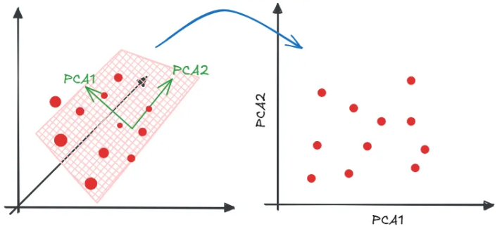

*그림 2-23. 선형 투영 — 새 좌표축으로 회전한 뒤 좌표값을 읽는다*

축을 찾는다는 것은 결국 데이터를 새 좌표계로 옮겨 놓는 일이다. 분산이 큰 방향부터 차례로 축을 잡고, 컴포넌트를 두 개 쓰면 2차원, 스무 개 쓰면 20차원 공간에 같은 데이터를 다시 배치한다. 더 나은 좌표계를 찾아 표현을 만든다는 점에서 선형 투영도 표현 학습의 한 갈래다.

**뉴런은 선형 투영에 비선형 활성화를 더한다**

$$\mathbf{z}=\mathrm{ReLU}(W^{\top}\mathbf{x}+\mathbf{b})$$

- 비선형 활성화 함수 ReLU(그리고 bias $\mathbf{b}$)를 더하면 수평·수직 구조화가 가능해진다.
- ReLU의 역할: **Piecewise linear function** 으로서 공간을 분리한다.
- 병렬 ReLU 뉴런: 공간을 여러 개의 조각으로 분할한다.
- 다음 Layer: 조각 정보를 가중합으로 조합한다.
- → **복잡한 비선형 함수와 비선형 manifold를 표현할 수 있게 된다.**

---

## 2.3.2 주요 선형 투영 기법
<!-- 슬라이드 69 -->

**PCA (Principal Component Analysis)** — 분산을 최대화하는 방향으로 투영한다.

- 데이터의 전역적 구조를 선형 부분공간으로 근사한다.
- 그러나 국소적 비선형 구조와 다중 클러스터를 무시한다.

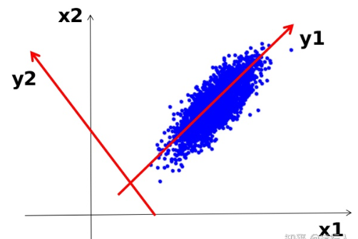

*그림 2-24. PCA — 분산이 최대인 방향으로 좌표축을 회전한다*

**LDA (Linear Discriminant Analysis)** — 클래스 간 분리를 최대화하고 클래스 내 분산을 최소화한다.

- 클래스가 선형으로 분리 가능할 때만 효과적이다.
- 클래스 경계가 비선형이면 실패한다.

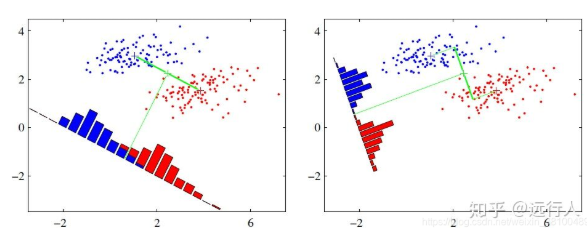

*그림 2-25. LDA — 투영 축의 방향에 따라 클래스 분리 정도가 달라진다*

**MDS (Multidimensional Scaling)** — 점들 간 거리를 보존하며 투영한다.

- 새로운 공간에서 두 점 사이의 거리가 원래 공간에서와 최대한 유사하게 유지된다.
- 유클리드 거리를 가정하므로 비선형 다양체에서는 부적합하다.
- 심리·마케팅·유사도처럼 값 자체는 의미가 없고 **관계(상대 거리)** 가 중요한 경우에 관계를 시각화하는 데 쓴다.

---

## 2.3.3 선형 투영의 근본적 한계
<!-- 슬라이드 70~72 -->

**① 비선형 매니폴드 붕괴**

- 데이터가 곡선이나 나선형 같은 비선형 구조를 가질 때, 선형 투영은 이를 직선으로 펼치지 못하고 접거나 왜곡한다.
- Swiss Roll을 PCA로 투영하면 나선의 양 끝이 겹친다.

**② 국소 구조 무시**

- PCA와 MDS는 전역적 특성(분산, 전체 거리)만 고려하므로, 데이터의 국소적 이웃 관계나 클러스터 내부 구조를 보존하지 못한다.

**③ 다중 모드 평탄화**

- 여러 개의 분리된 클러스터가 있어도 선형 투영은 이들을 하나의 부분공간으로 강제 압축한다.
- 그 결과 전체 평균은 클러스터 사이의 빈 공간을 가리킨다.

**④ 위상(topology) 보존 실패**

데이터의 위상적 성질은 선형 투영에서 보존되지 않는다.

| 위상 요소 | 왜곡의 형태 |
|---|---|
| 덩어리(cluster) | cluster 생성 / 분리 / 결합의 왜곡 |
| 고리(loop) | loop 단절 / 생성의 왜곡 |
| 구멍(void) | 도넛(torus) 제거 / 생성의 왜곡 |
| 연결(bridge) | 연결의 단절 / 생성 / 분기의 왜곡 |

> **위상(Topology)**: 늘리거나 구부리는 등 연속적으로 변형해도 변하지 않는 성질이다. 도넛과 머그컵은 위상적으로 같다(Topological equivalence).
> **위상 데이터 분석(TDA: Topological Data Analysis)**: 고차원 공간의 점들을 '유사성'이라는 끈으로 묶어 하나의 의미 있는 형체로 만드는 접근이다.

이 네 가지 한계가 실제 데이터에서 어떤 모습으로 나타나는지를, 정답을 아는 비선형 다양체(Swiss Roll)와 고차원 실데이터(MNIST) 두 곳에서 확인한다.

### 실습 2.3.1 PCA · LDA · MDS 특성 확인 (Swiss Roll)

비선형 manifold를 갖는 Swiss Roll(3d vector, value)을 분석한다. LDA는 클래스가 있어야 하므로 연속적인 value를 4개 class로 분리하여 사용한다.

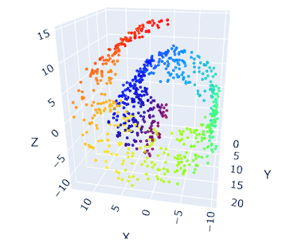

*그림 2-26. LDA 적용을 위해 value를 4개 class로 나눈 Swiss Roll*

나선을 따라 value가 이어지므로 색도 감긴 순서대로 배열된다. 그러나 3차원 공간에서는 안쪽 층과 바깥쪽 층이 맞닿아 있어, 나선을 따라가면 멀리 떨어진 두 점이 유클리드 거리로는 가깝다. 거리만 보는 방법이 이 데이터에서 무너지는 이유가 여기에 있다.

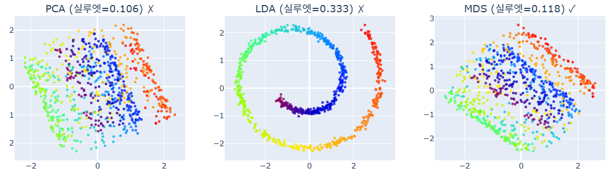

*그림 2-27. Swiss Roll에 대한 PCA · LDA · MDS 투영 결과*

- **PCA**: 두 개의 분산 축에 mapping한다. 나선을 눌러 찌그러뜨리기 때문에 모든 값(색)이 섞인다.
- **LDA**: class를 4분면에 놓고 값을 배치하지만, class가 선형으로 분리되지 못해 4개 class의 흔적이 사라진다.
- **MDS**: PCA와 유사하게 보일 수 있다.
  - PCA가 분산을 기준으로 투영하는 것은 **암묵적**으로 유클리드 거리를 유지하는 것이다.
  - MDS는 **명시적**으로 유클리드 거리를 유지하며 투영한다.
  - MDS는 거리 함수(유클리드가 아닌 것)를 선택하거나 설계할 수 있다.

### 실습 2.3.2 PCA · LDA · MDS 특성 확인 (MNIST)

투영 방법과 성능 측정 지표는 다음과 같다.

- **PCA**: 누적분산비율 $\mathrm{CVR}(3)=15\%$
- **LDA**: 설명분산(Fisher criterion)

  $$\text{explained-variance-ratio}=\lambda_k \approx \frac{\mathrm{std}(\text{intra class})}{\mathrm{std}(\text{inter class})}$$

  분리 능력(eigenvalue)들을 상대 비율로 정규화한 값이다.
- **MDS**: stress

  $$\text{stress}\approx \sum_{i<j}\left(d_{ij}^{high}-d_{ij}^{low}\right)^{2}$$

  $d_{ij}^{high}$ 는 고차원에서의 $i$–$j$ 거리, $d_{ij}^{low}$ 는 저차원에서의 $i$–$j$ 거리다.

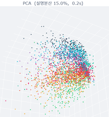

*그림 2-28. MNIST의 PCA 투영 — 설명분산이 낮고 클래스가 섞인다*

설명분산 15%는 세 개의 주성분이 784차원 데이터가 가진 전체 분산 중 15%만 담아냈다는 뜻이다. 나머지는 투영 과정에서 버려진다. 그래서 이 그림에서는 숫자별 색이 서로 뭉쳐 있을 뿐 클래스 경계가 드러나지 않는다.

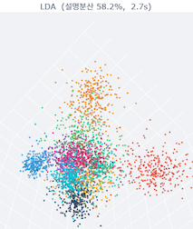

*그림 2-29. MNIST의 LDA 투영 — 설명분산은 높지만 클래스 경계가 비선형이라 겹침이 남는다*

LDA는 클래스 레이블을 축 계산에 직접 쓰므로 PCA보다 숫자별 형태가 훨씬 잘 드러난다. 설명분산도 약 58%로 PCA의 15%보다 크게 높다. 다만 이 값은 클래스 간·클래스 내 편차의 비율일 뿐이어서, 경계가 비선형인 곳의 겹침까지 없애 주지는 않는다.

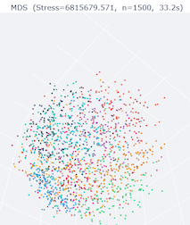

*그림 2-30. MNIST의 MDS 투영 — 거리 구조를 명시적으로 맞추지만 클래스는 분리되지 않는다*

MDS는 모든 픽셀 값의 거리만으로 위치를 정하므로 숫자 클래스가 완전히 섞인다. stress는 고차원에서의 표본 간 거리가 저차원으로 옮겨진 뒤 얼마나 달라졌는지를 재는 값인데, 여기서는 그 값이 매우 크게 나온다. 거리 구조조차 지켜지지 않은 것이다.

---

## 2.3.4 Metric MDS vs Non-metric MDS, 그리고 Isomap
<!-- 슬라이드 73 -->

- **Metric MDS**: 유클리드 거리를 사용하는 방식이다.
- **Non-metric MDS**: Rank order(설문조사 응답, 심리적 유사성)처럼 순서를 수치화할 수 없는 경우에 사용한다.

**외부 함수 사용하기**

- Custom 함수로 계산된 값을 넣어 주거나, 호출 가능한 함수를 전달한다.

**Isomap** — graph 기반 거리측정함수를 사용하는 MDS다. 전처리된 값을 MDS에 전달하는 구조이며, 전처리는 두 단계로 이루어진다.

- 전처리 ① 인접점으로 그래프를 구성한다(k-NN).
- 전처리 ② 그래프 위에서 거리를 측정한다(**측지 거리, Geodesic distance**). 즉 manifold 위에서 거리를 측정하는 것이다.

Manifold의 구조에 기반해 거리를 계산하므로 **Swiss Roll을 가장 정확하게 펼칠 수 있다.**

> **측지 거리(Geodesic Distance)**: manifold 위에서의 최단 거리
> **유클리드 거리**: manifold 또는 space를 가로지르는 최단 거리

---

## 2.3.5 비선형 차원 축소 방법
<!-- 슬라이드 74 -->

**Isomap** — graph 기반 거리측정함수를 사용하는 MDS이다.

**t-SNE (t-Distributed Stochastic Neighbor Embedding)** — 이웃과의 확률(관계)을 저차원에서 보존한다.

- t-분포를 사용하여, 저차원에서도 유사한 분포를 유지하도록 투영한다.
- 이웃의 관계만 중요하게 다루며, 포함되지 않은 다른 이웃과의 관계는 무시한다.
- → class는 잘 보이지만 **class 간 관계(거리, 유사도)는 보이지 않고**, 전체 구조가 쉽게 무너진다.
- 고차원에서는 정규분포를, 저차원에서는 t분포를 사용한다. 같은 확률이면 t분포 쪽에서 더 멀어지게 된다.

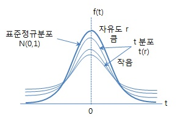

*그림 2-31. 표준정규분포와 t 분포 — 같은 확률이라도 t 분포에서는 더 멀리 배치된다*

**UMAP (Uniform Manifold Approximation and Projection)** — 이웃과의 연결 강도(소속 강도)를 사용한다.

- 이웃을 찾아(k-NN) 점을 연결(edge)하고, 거리에 따라 연결 강도를 부여한다 → **fuzzy neighborhood graph** 를 생성한다(확률이 아니라 fuzzy simplicial set이다).
- 이웃 점의 거리를 0~1 값으로 설정한다. 연결 강도의 합이 1이 아니므로 확률이 아니다.
- $x_i \leftrightarrow x_j$ 연결 강도에는 **방향성**이 있다. 주변 데이터 밀도가 낮으면(시골과 도시의 비유처럼) 멀어도 상대적으로 가까운 것으로 본다.
- 비대칭 연결의 결합과 대칭화는 fuzzy set에서의 'or' 연산으로 처리한다.
- 저차원에서도 유사한 연결 강도를 유지하도록 투영한다.
- 전역에서 분리된(떨어진) 관계는 특성이 다를 가능성이 높으므로, **전체 구조를 유지할 가능성이 높다.**

**LLE (Locally Linear Embedding)** — 주변 point로부터 복원 가능한 가중치를 사용한다.

- 저차원에서 가중치를 보존한다: $A = W_1 B + W_2 C + W_3 D$ 형태로 각 점을 이웃 $k$ 개(parameter)의 선형 결합으로 표현한다.

- 국소적 특징을 세밀하게 사용하며, 복잡한 구조의 manifold를 펼칠 때 강력하다.

---

## 2.3.6 t-SNE · Isomap · LLE의 오차 표현
<!-- 슬라이드 75~78 -->

**t-SNE** — 고차원 이웃 확률 분포 $P$ 와 저차원 이웃 확률 분포 $Q$ 의 KL divergence를 사용한다.

$$KL(P\parallel Q)=\sum_{i,j}p_{ij}\log\frac{p_{ij}}{q_{ij}}$$

**Isomap** — 측지 거리의 왜곡을 재구성 오차로 삼는다.

$$\text{reconstruction error}=\frac{\sum_{i<j}\left(d_{ij}^{geo}-d_{ij}^{low}\right)^{2}}{\sum_{i<j}\left(d_{ij}^{geo}\right)^{2}}$$

여기서 $d_{ij}^{geo}$ 는 고차원 측지거리, $d_{ij}^{low}$ 는 저차원 유클리드 거리다.

**LLE** — 이웃 가중치의 재구성 오차를 사용한다.

$$\text{reconstruction error}=\lVert Y-WY\rVert_F^{2}$$

$Y\in\mathbb{R}^{n\times d}$ 는 저차원 임베딩, $W\in\mathbb{R}^{n\times n}$ 은 고차원에서 계산한 재구성 가중치 행렬, $\lVert\cdot\rVert_F$ 는 행렬의 $L_2$ norm이다. 이 오차는 **완전히 국소적인 재구성 오차이므로 값이 작아도 품질이 보장되지 않는다.**

세 오차 지표가 실제로 어떤 값을 내놓는지, 그리고 각 기법의 하이퍼파라미터가 결과를 얼마나 뒤흔드는지를 같은 두 데이터에서 확인한다.

### 실습 2.3.3 t-SNE · UMAP · Isomap · LLE 특성 확인 (Swiss Roll)

> 노트북: `code/2.3.3.swiss_roll_nonlinear.ipynb`

각 기법의 주요 파라미터와 오차 지표는 다음과 같다.

- **Isomap**: `k` = k-NN에서 이웃의 수, 오차 = reconstruction error
- **LLE**: `method` = standard / modified / ltsa, `n_neighbors` = 이웃의 수
- **t-SNE**: `perplexity` = 유효한 이웃의 수 설정
- **UMAP**: `min_dist` = 2차원에서의 최소 거리, `n_neighbors` = 이웃의 수

Swiss Roll을 만들고 표준화한 뒤, 나선 위치 파라미터 `t` 를 색으로 입혀 각 기법의 결과를 비교한다.

```python
from sklearn.datasets import make_swiss_roll
from sklearn.preprocessing import StandardScaler

X_raw, t = make_swiss_roll(n_samples=N_SAMPLES, noise=SWISS_NOISE,
                           random_state=RANDOM_SEED)
scaler = StandardScaler()
X = scaler.fit_transform(X_raw).astype('float32')

# 평가용 클래스 레이블 (t를 N_T_CLASSES 등분)
bins  = np.percentile(t, np.linspace(0, 100, N_T_CLASSES + 1)[1:-1])
y_cls = np.digitize(t, bins=bins)
```

Isomap은 이웃 수 `n_neighbors` 를 바꿔 가며 재구성 오차를 함께 기록한다.

```python
from sklearn.manifold import Isomap

for k in ISOMAP_K_RANGE:
    iso_k = Isomap(n_components=2, n_neighbors=k)
    c = iso_k.fit_transform(X)
    print(f'  n_neighbors={k:2d}: 재구성 오차={iso_k.reconstruction_error():.4f}')
```

LLE는 `method` 와 `n_neighbors` 두 축으로 본다.

```python
from sklearn.manifold import LocallyLinearEmbedding

for method in LLE_METHODS:          # standard / modified / ltsa
    lle_m = LocallyLinearEmbedding(n_components=2, n_neighbors=LLE_N_NEIGHBORS,
                                   method=method, random_state=RANDOM_SEED)
    c = lle_m.fit_transform(X)
    print(f'  method={method:8s}: 재구성 오차={lle_m.reconstruction_error_:.6f}')

for k in LLE_K_RANGE:               # n_neighbors 민감도
    lle_k = LocallyLinearEmbedding(n_components=2, n_neighbors=k,
                                   method=LLE_METHOD, random_state=RANDOM_SEED)
    coords = lle_k.fit_transform(X)
```

t-SNE는 `perplexity` 를 바꾸며 KL 발산을 기록한다.

```python
from sklearn.manifold import TSNE

for perp in TSNE_PERP_RANGE:
    ts = TSNE(n_components=2, perplexity=perp, n_iter=TSNE_N_ITER,
              random_state=RANDOM_SEED)
    c = ts.fit_transform(X)
    print(f'  perplexity={perp:3d}: KL={ts.kl_divergence_:.4f}')
```

UMAP은 `n_neighbors` 와 `min_dist` 두 파라미터를 따로 흔들어 본다.

```python
import umap

for k in UMAP_K_RANGE:              # n_neighbors 민감도 (min_dist 고정)
    um = umap.UMAP(n_components=2, n_neighbors=k,
                   min_dist=UMAP_MIN_DIST, random_state=RANDOM_SEED)
    coords = um.fit_transform(X)

for d in UMAP_DIST_RANGE:           # min_dist 민감도 (n_neighbors 고정)
    um = umap.UMAP(n_components=2, n_neighbors=UMAP_N_NEIGHBORS,
                   min_dist=d, random_state=RANDOM_SEED)
    coords = um.fit_transform(X)
```

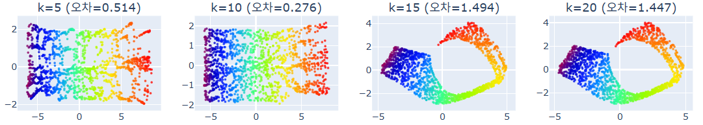

*그림 2-32. Isomap의 이웃 수 $k$ 민감도. $k$ 가 커지면 지름길 연결이 생겨 나선이 제대로 펼쳐지지 않는다*

Isomap은 Swiss Roll을 3차원에서 2차원으로 매우 잘 펼쳐 내지만, 이웃 수를 5·10·15·20으로 바꾸는 것만으로 펼쳐진 모양과 재구성 오차가 함께 달라진다. 이 데이터에서 잘 펼쳐졌다고 해서 다른 데이터에서도 그러리라는 보장은 없다.

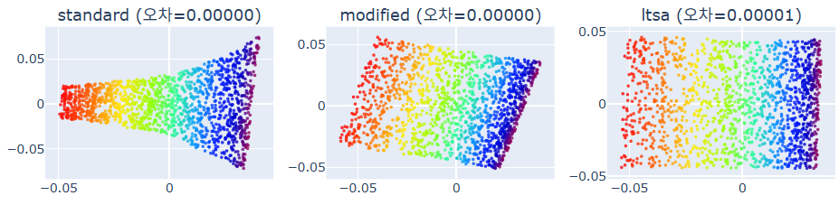

*그림 2-33. LLE의 method(standard / modified / ltsa)에 따른 차이*

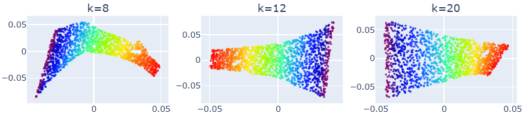

*그림 2-34. LLE의 `n_neighbors` 민감도*


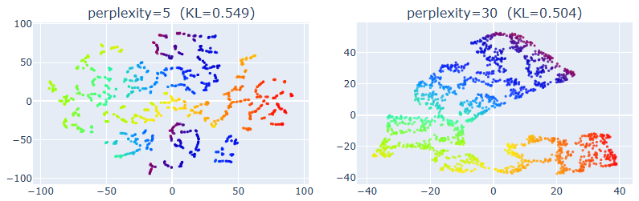

*그림 2-35. t-SNE의 `perplexity` 민감도 (1) — 값이 작으면 연속적인 나선이 조각으로 끊어진다*

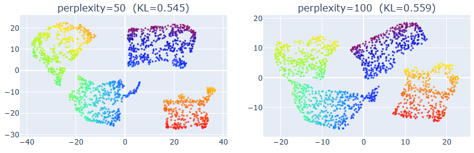

*그림 2-36. t-SNE의 `perplexity` 민감도 (2)*

perplexity는 t-SNE가 유효한 이웃으로 삼을 점의 개수를 정하는 값이다. 같은 Swiss Roll을 5, 30, 50, 100으로 바꿔 가며 펼치면 결과가 서로 전혀 다른 모양으로 나온다. 하나의 데이터에 하나의 t-SNE 그림이 대응하지는 않는다.

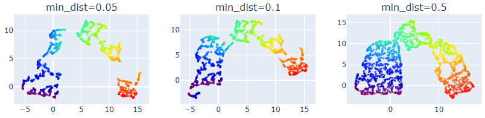

*그림 2-37. UMAP의 `min_dist` 민감도 — 값이 커질수록 점들이 서로 밀려나 응집도가 낮아진다*

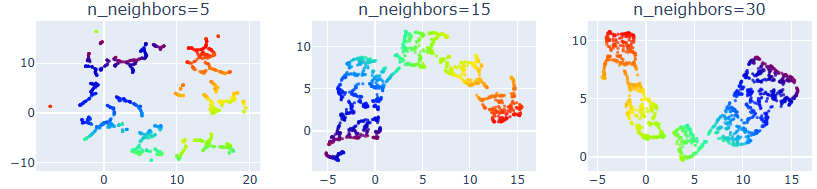

*그림 2-38. UMAP의 `n_neighbors` 민감도 — 값이 작으면 연속 구조가 조각나고, 크면 전역 구조가 살아난다*

이웃 수 같은 하이퍼파라미터는 비선형 투영의 결과를 극단적으로 바꾼다. 딥러닝 모델도 하이퍼파라미터에 민감하지만 변동 폭이 제한적이고 실험적으로 좁혀 갈 방법이 있는 반면, 비선형 투영은 값을 직접 바꿔 가며 전부 확인해 보는 것 외에 방법이 없다.

### 실습 2.3.4 t-SNE · UMAP · Isomap · LLE 특성 확인 (MNIST)

> 노트북: `code/2.3.4.mnist_nonlinear_projection.ipynb`

MNIST는 클래스별로 균등하게 뽑고, 비선형 기법의 계산량을 줄이기 위해 사전 PCA로 784차원을 50차원으로 압축한 뒤 네 기법을 적용한다.

```python
RANDOM_SEED    = 42
N_SAMPLES      = 3000   # 전체 사용 샘플 수 (클래스당 300개)
N_PCA_PRETRAIN = 50     # 사전 PCA 압축 차원 (784 → 50, 속도 개선용)

TSNE_PERPLEXITY    = 30
UMAP_N_NEIGHBORS   = 15
UMAP_MIN_DIST      = 0.1
ISOMAP_N_NEIGHBORS = 10
LLE_N_NEIGHBORS    = 10
LLE_METHOD         = 'standard'

(x_train, y_train), (x_test, y_test) = keras.datasets.mnist.load_data()
x_all = np.concatenate([x_train, x_test], axis=0).reshape(-1, 784).astype('float32') / 255.0
y_all = np.concatenate([y_train, y_test], axis=0)
```

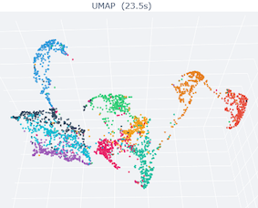

*그림 2-39. MNIST — UMAP 임베딩*

덩어리가 나뉠 뿐 아니라 덩어리 사이의 관계도 비교적 또렷하다. 생김새가 크게 다른 0과 1은 멀리 떨어지고, 5·6·8처럼 획이 비슷한 숫자들은 가까이 놓인다. 가까이 놓인 덩어리일수록 형태가 닮았을 가능성이 높다고 읽을 수 있다.

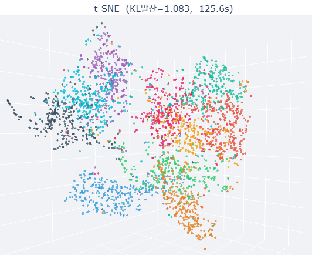

*그림 2-40. MNIST — t-SNE 임베딩*

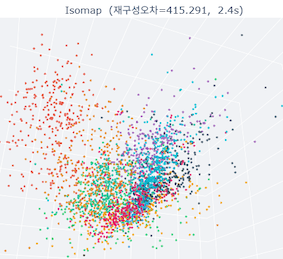

*그림 2-41. MNIST — Isomap 임베딩*

Swiss Roll을 거의 완벽하게 펼쳤던 기법이 MNIST에서는 크게 무너진다. Isomap은 이론적으로 매니폴드를 정확히 펼칠 수 있지만 노이즈와 이상치에 취약해서, 실제 데이터의 복잡한 매니폴드에서는 기대만큼 동작하지 않는 경우가 많다.

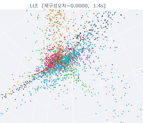

*그림 2-42. MNIST — LLE 임베딩*

점이 가운데로 몰려 클래스 구조가 거의 보이지 않는다. LLE는 이웃과의 관계를 정교하게 맞추므로 국소 재구성 오차는 거의 0까지 내려가지만, 그 값이 작다는 것과 전체 배치가 살아 있다는 것은 별개다. 국소 구조를 얻는 대신 전역 구조를 잃은 결과다.

---

## 2.3.7 비선형 차원 축소 비교
<!-- 슬라이드 79 -->

네 기법이 무엇을 보존하고 무엇을 포기하는지 정리하면 다음과 같다.

| 방법 | 핵심 아이디어 | 보존하는 구조 | 장점 | 단점 | 주 사용 목적 |
|---|---|---|---|---|---|
| **t-SNE** | 고차원 이웃 관계를 확률 분포로 모델링하고 KL divergence 최소화 | 국소 구조 | 클러스터 분리가 시각적으로 직관적인 임베딩 | 전역 거리 해석 불가, 계산 비용 큼, 재현성 낮음 | 시각화 전용 |
| **UMAP** | 매니폴드를 위상 공간으로 근사 후 저차원에서 재구성 | 국소 + 일부 전역 구조 | t-SNE보다 빠름, 전역 구조 일부 보존, 재현성 좋음, 대규모 데이터 가능 | 거리 해석에 주의 필요, 파라미터에 민감 | 시각화 + 구조 파악 |
| **Isomap** | k-NN 그래프에서 측지 거리를 최단거리로 근사 후 MDS 적용 | 전역 매니폴드 구조 | 매니폴드 펼침, 거리 의미 명확 | 노이즈·outlier에 취약, 매니폴드 가정이 강함, 계산량 큼 | 이론적 매니폴드 분석 |
| **LLE** | 각 점을 이웃의 선형 결합으로 표현 → 가중치 보존 | 국소 선형 구조 | 국소 구조 보존 우수, 비선형 구조 표현 | 전역 구조 완전 상실, 노이즈·샘플링 밀도 민감, 시각화 해석 어려움 | 국소 구조 학습 |

---

## 2.3.8 투영 성능 평가 기준
<!-- 슬라이드 80~84 -->

**1. 거리 보존 (Distance Preservation)** — 고차원 공간에서의 점 간 거리가 저차원에서도 유지되는가?

- Stress (Kruskal), Normalized Stress: 값이 0에 가까울수록 거리 구조가 잘 보존된 것이다.
- **PCA가 유리**하다 (분산 최대화 = 글로벌 거리 구조 보존 우선).

**2. 이웃 보존 (Neighborhood Preservation)** — 고차원에서 가까운 점이 저차원에서도 가까운 이웃인가?

- **k-NN Overlap**: 고차원 k-NN과 저차원 k-NN이 겹치는 비율 → *이웃이 유지되었는가?*
- **신뢰성(Trustworthiness)**: 투영 공간의 이웃이 원공간에서도 이웃인가 → *거짓 이웃이 생겼나?* k-NN Overlap이 낮은 경우 중에서도 새로 생긴 이웃에 민감하다 → *보이는 관계를 믿어도 되는가?*
- **연속성(Continuity)**: 원공간의 이웃이 투영 후에도 이웃인가 → *이웃이 사라졌나?* k-NN Overlap이 낮은 경우 중에서도 놓친 관계에 민감하다 → *원래 구조를 빠뜨리지 않았는가?*
- **t-SNE와 UMAP이 유리**하다.

**3. 위상 보존 (Topological Preservation)** — 데이터의 위상적 특성이 보존되는가?

- 지속 상동성(Persistent Homology) 기반 **Betti 수**를 비교한다. RIPSER 라이브러리를 활용한다.
- 3D 구조의 투영 전후 Persistence Diagram 유사도(**Wasserstein 거리**)로 정량화한다.
- **UMAP이 유리**하다.

| Betti 수 | 위상적 의미 | 직관적 설명 | 데이터/투영 해석 |
|---|---|---|---|
| $\beta_0$ | 연결 요소 수 | 서로 떨어져 있는 덩어리의 개수 | 클러스터 개수 |
| $\beta_1$ | 1차 루프 수 | 고리·원형 구조의 개수 | 원형 / 주기적 구조(원형 매니폴드, 순환 패턴 등) |
| $\beta_2$ | 2차 공동(구멍) 수 | 속이 빈 껍질 구조의 개수 | 3D 이상에서의 빈 공간(구, 토러스 등) |

원본과 투영 결과에서 이 세 숫자를 각각 세어 비교하면, 덩어리가 몇 개로 쪼개졌는지, 없던 고리가 생겼는지, 속이 빈 구조가 사라졌는지를 개수로 확인할 수 있다. 앞서 표로 정리한 위상 왜곡을 수치로 바꾸어 보는 방법이다.

**Persistence Diagram**

스케일 $\varepsilon$ (거리)를 늘려가면서 위상적 특징($\beta_0, \beta_1, \beta_2$ 등)의 등장과 소멸을 표시한다.

- **긴 막대**: 데이터가 가진 '진짜 구조'다(그림에서 가운데 큰 구멍을 뜻하는 긴 **초록색** 막대).
- **짧은 막대**: 일시적으로 생겼다 사라지는 '노이즈'다.
- **대각선**: 탄생하자마자 소멸한 특징은 대각선 위에 놓이고, 대각선에서 떠 있는 점은 오래 지속된 구조를 뜻한다.

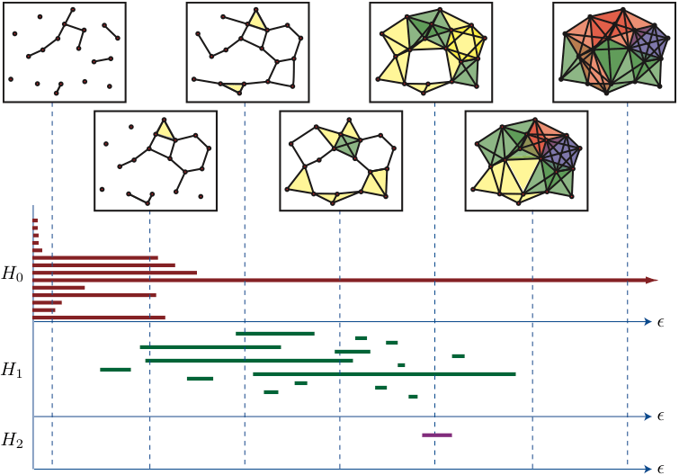

*그림 2-43. 스케일 $\varepsilon$ 증가에 따른 위상적 특징의 생성과 소멸(barcode)*

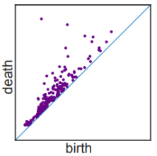

*그림 2-44. Persistence Diagram — 대각선에서 멀리 떨어진 점일수록 오래 지속된 구조다*

- **Wasserstein 거리**: 두 Persistence Diagram의 선·점을 매칭하여 차이를 계산하며, 맞는 것이 없으면 제거 비용까지 포함한다.
- 원본 데이터, PCA, UMAP의 Persistence Diagram에 대해 상대적 Wasserstein 거리를 측정하면, 데이터의 위상 구조를 $\varepsilon$ 전 스케일에 걸쳐 얼마나 유사하게 유지했는지 알 수 있다 → **투영 성능을 위상 관점에서 정량 평가**한다는 뜻이다.

**4. 분산 설명량 (Variance Explained)** — 원 데이터의 정보를 얼마나 유지하는가?

$$\mathrm{VE}=\frac{\mathrm{Var}(\hat{X})}{\mathrm{Var}(X)}, \qquad \hat{X}:\text{투영 후 복원 데이터},\; X:\text{원 데이터}$$

$$\mathrm{VE}=\mathrm{CVR}\;(\text{누적 분산 비율}), \qquad 1=\mathrm{CVR}+\text{Reconstruction Error}$$

- PCA는 CVR을 직접 계산한다. 비선형 방법은 Autoencoder로 근사해서 해석한다.
- 참고) EVR (Explained Variance Ratio)은 각 주성분의 기여율이다.

  $$\mathrm{EVR}_k=\frac{\lambda_k}{\sum_{i=1}^{D}\lambda_i}$$

**5. 클래스 분리도 (Class Separability)** — 레이블이 같은 클래스는 뭉치고 다른 클래스는 떨어지는가?

- **Silhouette Score**: 올바른 cluster에 있는가를 본다(크면 좋다).

  $$s(i)=\frac{b(i)-a(i)}{\max\{a(i),\,b(i)\}}$$

  <!-- 원문에 없는 식: 슬라이드 82 는 a(i)·b(i) 의 정의만 제시하고 s(i) 식은 싣지 않았다. 표준 정의를 보충한 것이다 -->

  $a(i)$ 는 같은 클래스 내 평균 거리, $b(i)$ 는 가장 가까운 타 클래스까지의 평균 거리다. t-SNE가 시각적 분리에서 유리하지만 **과장될 수 있다.**
- **DB Index (Davies-Bouldin Index)**: cluster가 잘 분리되어 있는가를 본다(작으면 좋다).

  $$DB=\frac{1}{K}\sum_{i=1}^{K}\max_{j\neq i}\frac{s_i+s_j}{d_{ij}}$$

  $s_i+s_j$ 는 두 cluster 분산의 합, $d_{ij}$ 는 두 cluster 중심 간 거리다.
- **NMI (Normalized Mutual Information)**: cluster와 실제 label이 얼마나 정보를 공유하는가를 본다.

앞서 눈으로 비교한 네 기법을 이 기준들로 다시 재어 본다. 실행 시간도 함께 기록한다.

### 실습 2.3.3 (계속) 정량 평가 — Swiss Roll

> 노트북: `code/2.3.3.swiss_roll_nonlinear.ipynb`

정량 지표로는 다음 세 가지를 사용한다.

- **Silhouette Score**: 올바른 cluster에 있는가?
- **Trustworthiness**: 투영 공간의 이웃이 원공간에서도 이웃인가?
- **이웃 t값 분산**: $k$ 개 이웃의 t값(manifold 좌표)의 분산으로, cluster 응집도를 뜻한다.

네 기법을 같은 조건에서 다시 돌려 wall-clock time을 재고, 그 결과를 로그 축 막대로 비교한다.

```python
bench_methods = [
    ('Isomap', lambda: Isomap(n_components=2,
                              n_neighbors=ISOMAP_N_NEIGHBORS).fit_transform(X)),
    ('LLE',    lambda: LocallyLinearEmbedding(n_components=2,
                                              n_neighbors=LLE_N_NEIGHBORS,
                                              method=LLE_METHOD,
                                              random_state=RANDOM_SEED).fit_transform(X)),
    ('t-SNE',  lambda: TSNE(n_components=2, perplexity=TSNE_PERPLEXITY,
                            n_iter=TSNE_N_ITER,
                            random_state=RANDOM_SEED).fit_transform(X)),
    ('UMAP',   lambda: umap.UMAP(n_components=2, n_neighbors=UMAP_N_NEIGHBORS,
                                 min_dist=UMAP_MIN_DIST,
                                 random_state=RANDOM_SEED).fit_transform(X)),
]

times_dict = {}
for name, fn in bench_methods:
    t_start = time.perf_counter()
    fn()
    times_dict[name] = time.perf_counter() - t_start
    print(f'  {name:8s}: {times_dict[name]:6.2f}초')
```

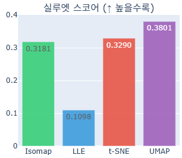

*그림 2-45. Swiss Roll — 실루엣 스코어 비교(높을수록 좋음)*

Isomap과 t-SNE, UMAP은 서로 비슷한 수준의 값을 내지만 LLE만 눈에 띄게 낮다. 앞서 임베딩 그림에서 LLE의 구조가 크게 무너져 보였던 것이, 올바른 cluster에 놓였는지를 재는 이 점수로도 그대로 확인된다.

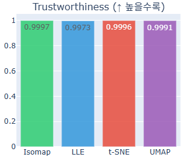

*그림 2-46. Swiss Roll — Trustworthiness 비교(높을수록 좋음)*

Trustworthiness는 투영 후 이웃으로 보이는 점이 원공간에서도 실제 이웃이었는지, 즉 거짓 이웃이 생기지 않았는지를 재는 신뢰성 지표다. 네 기법 모두 0.99를 크게 넘는 값이 나오며, 거짓 이웃이 아주 조금 섞여 있는 정도라는 뜻이다.

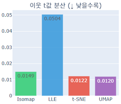

*그림 2-47. Swiss Roll — 이웃 t값 분산 비교(낮을수록 좋음)*

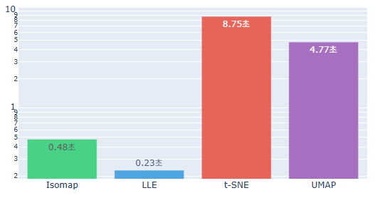

*그림 2-48. Swiss Roll — 네 기법의 실행 시간 비교*

네 기법을 같은 조건에서 다시 돌려 잰 시간이다. Swiss Roll 하나를 처리하는 데 t-SNE가 가장 오래 걸리고, UMAP과 Isomap은 그보다 짧게 끝난다. 투영 품질과 별개로 계산 비용도 기법을 고를 때 함께 봐야 하는 항목이다.

### 실습 2.3.4 (계속) 정량 평가 — MNIST

> 노트북: `code/2.3.4.mnist_nonlinear_projection.ipynb`

네 임베딩에 대해 실루엣 스코어를 구하고, 소요 시간과 함께 비교한다.

```python
from sklearn.metrics import silhouette_score

sil_tsne   = silhouette_score(tsne_coords,   y, sample_size=1000, random_state=RANDOM_SEED)
sil_umap   = silhouette_score(umap_coords,   y, sample_size=1000, random_state=RANDOM_SEED)
sil_isomap = silhouette_score(isomap_coords, y, sample_size=1000, random_state=RANDOM_SEED)
sil_lle    = silhouette_score(lle_coords,    y, sample_size=1000, random_state=RANDOM_SEED)

methods    = ['t-SNE', 'UMAP', 'Isomap', 'LLE']
sil_scores = [sil_tsne, sil_umap, sil_isomap, sil_lle]
elapsed    = [tsne_elapsed, umap_elapsed, isomap_elapsed, lle_elapsed]

for name, sil, t in zip(methods, sil_scores, elapsed):
    print(f'{name:>8}  {sil:>14.4f}  {t:>9.1f}s')
```

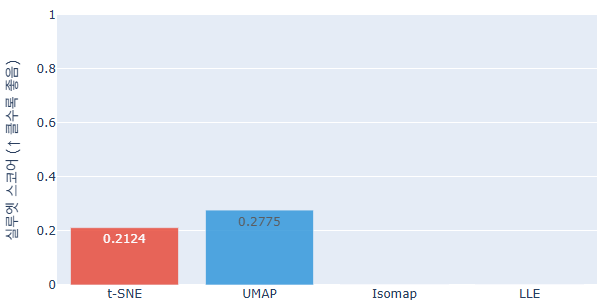

*그림 2-49. MNIST — 실루엣 스코어 비교*

t-SNE와 UMAP만 값이 올라가고 Isomap과 LLE는 거의 바닥에 붙는다. 뒤의 두 기법에서는 숫자 클래스가 사실상 구분되지 않는다는 뜻이다. 그림으로는 섞여 보인다는 인상만 남지만, 이렇게 점수로 바꾸면 얼마나 나뉘었는지를 비교할 수 있다.

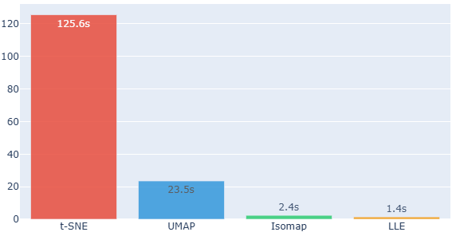

*그림 2-50. MNIST — 네 기법의 실행 시간 비교*

---

## 2.3.9 모든 기준을 동시에 만족시킬 수 있나?
<!-- 슬라이드 85 -->

전역 거리, 지역 이웃, 위상 구조를 **모두** 만족시키는 투영은 없다. 저차원 투영은 결국 **어떤 정보를 살릴 것인지 선택의 문제**다.

| Trade-off | 내용 |
|---|---|
| 거리 보존 ↔ 이웃 보존 | 전역 거리를 맞추면 밀집 클러스터가 뭉개진다. t-SNE는 이웃을 살리되 먼 거리를 무시한다. |
| 이웃 보존 ↔ 위상 보존 | k-NN 최적화는 연속적 구조를 단절시킬 수 있다 (t-SNE의 "섬 현상"). |
| 분산 설명 ↔ 클래스 분리 | PCA는 전체 분산을 최대화하지만 클래스 경계는 무시한다. → LDA가 필요한 이유 |
| 전역 ↔ 지역 | Johnson–Lindenstrauss 정리 |

**Johnson–Lindenstrauss 정리**

저차원에서 모든 거리를 동시에 보존하려면 다음 차원이 필요하다.

$$O\!\left(\frac{\log n}{\epsilon^{2}}\right)$$

- $n$(샘플 수)에 대한 민감도는 낮다: $\log n$
- $\epsilon$(허용 왜곡)에 대한 민감도는 높다: $1/\epsilon^{2}$ — 예를 들어 $\epsilon: 0.2 \rightarrow 0.1$ 이면 필요한 차원 $k$ 는 **4배**가 된다.

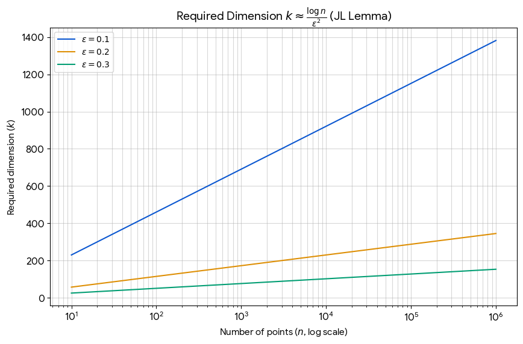

*그림 2-51. Johnson–Lindenstrauss 정리가 요구하는 차원 수*

가로축은 점의 개수이고 각 곡선은 허용 왜곡 $\epsilon$ 값에 대응한다. $\epsilon=0.1$ 로 1000개 점의 거리를 모두 지키려면 700차원 가까이가 필요하다. $\epsilon$ 을 0.3까지 늘려 그만큼의 점들을 하나로 묶어 취급하면 요구 차원은 급격히 낮아진다.

---

## 2.3.10 "잘된 투영"의 정의는 목적 의존적이다
<!-- 슬라이드 86 -->

평가 기준 자체가 목적의 함수다.

**Case 1 — 탐색적 시각화가 목적일 때**
연구자가 단순히 "어떤 클러스터가 있는가?"를 보고 싶다면 t-SNE 또는 UMAP을 쓰고 클래스 분리도와 이웃 보존을 우선한다. 거리가 왜곡되어도 괜찮다.
→ **잘된 투영 = 눈에 잘 보이는 투영**

**Case 2 — 전처리 / 특성 압축이 목적일 때**
ML 파이프라인의 입력 특성으로 사용할 때는 PCA를 쓰고 분산 설명량과 거리 보존을 우선한다. 선형성과 해석 가능성이 필요하며, 클러스터가 예쁘게 보이지 않아도 괜찮다.
→ **잘된 투영 = 하위 모델 성능을 최대화하는 투영**

**Case 3 — 이상 탐지가 목적일 때**
정상 데이터와 이상 데이터를 분리해야 할 때는 위상 보존과 이웃 보존을 우선한다(이상치는 위상적으로 고립되기 때문이다).
→ **잘된 투영 = 이상 탐지 F1을 높이는 투영**

**Case 4 — 과학적 해석이 목적일 때**
단백질 구조, 유전체 데이터 등 원공간의 의미가 중요할 때는 거리 보존과 분산 설명량을 우선하며 해석 가능성이 필수다.
→ **잘된 투영 = 원공간 관계를 왜곡 없이 전달하는 투영**

---

## 2.3.11 비선형 투영의 한계와 DL 기반 분석의 필요성
<!-- 슬라이드 87~88 -->

| # | 비선형 투영의 한계 | 내용 | DL의 대응 |
|---|---|---|---|
| 1 | **역변환 불가** (Non-invertibility) | PCA는 $X\approx ZW^{\top}$ 로 역투영 가능하지만 t-SNE / UMAP은 단방향 압축이다 | Autoencoder의 **Decoder** |
| 2 | **새 데이터 일반화 불가** (Out-of-sample) | 학습 데이터로 만든 투영 공간에 새 샘플을 정확히 배치할 방법이 없다 → 실시간 스트리밍·온라인 학습 불가, Batch 처리만 가능 | **명시적 변환 함수**(일반화 가능) |
| 3 | **재현성 없음** (Non-determinism) | t-SNE, UMAP은 랜덤 초기화에 따라 결과가 달라진다 | control 가능(seed 고정 학습) |
| 4 | **Hyperparameter 민감성** | UMAP도 `n_neighbors`, `min_dist`에 따라 결과가 극단적으로 변한다 | control 가능(제한적·실험적) |
| 5 | **설명 불가능성** (Interpretability Zero) | 투영 결과의 "x축이 크다"가 원공간에서 무엇을 의미하는지 알 수 없다 | **Disentangled Representation**(해석 가능한 표현) |
| 6 | **글로벌 vs 로컬 양립 불가** | t-SNE는 로컬 이웃만 최적화하므로 클러스터 간 거리가 무의미하고, UMAP은 로컬에 일부 글로벌을 더하지만 먼 거리 왜곡은 피할 수 없다 | control 가능(loss 함수 설계·추가) |

> 두 마리 토끼를 동시에 잡는 **단일 비선형 투영은 존재하지 않는다.**
> 다만 DL에도 단점은 있다. 계산 비용이 높고, 소규모 데이터 처리에는 부적합하다.

표현 자체를 학습하면 어떤 공간이 나오는지, 분류 모델의 병목 층을 그대로 열어 확인한다.

### 실습 2.3.5 DL 기반 분석 (MNIST)

> 노트북: `code/2.3.5.mnist_DL_manifold.ipynb`

1.1절 "중간 표현에 접근하는 방법"(고객 Data 분석 사례)의 확장이다.

- Regression 모델: 고객정보 → 예상 매출
- **출력 전 마지막 layer의 출력을 embedding vector로 사용**한다.

모델은 `784 → 512 → 256 → 128 → [3] → 10` 구조이며, 출력 직전의 3차원 층이 곧 embedding vector다.

```python
def build_model(bottleneck_dim=3):
    inputs = keras.Input(shape=(784,), name="input")

    x = layers.Dense(512)(inputs)
    x = layers.BatchNormalization()(x)
    x = layers.ReLU()(x)

    x = layers.Dense(256)(x)
    x = layers.BatchNormalization()(x)
    x = layers.ReLU()(x)

    x = layers.Dense(128)(x)
    x = layers.BatchNormalization()(x)
    x = layers.ReLU()(x)

    bottleneck = layers.Dense(bottleneck_dim, name="bottleneck")(x)   # ← 3D 병목
    outputs    = layers.Dense(10, activation="softmax", name="classifier")(bottleneck)

    model         = keras.Model(inputs, outputs,    name="MNISTManifoldNet")
    feature_model = keras.Model(inputs, bottleneck, name="FeatureExtractor")
    return model, feature_model

model, feature_model = build_model(bottleneck_dim=BOTTLENECK)
```

학습이 끝나면 `feature_model` 로 병목 층의 출력만 뽑아 3차원 좌표로 쓴다.

```python
features = feature_model.predict(x_test[:VIZ_SAMPLES], batch_size=BATCH_SIZE, verbose=0)
labels   = y_test[:VIZ_SAMPLES]

assert features.shape[1] == 3, f"병목 출력 shape 오류: {features.shape}"
print(f"추출된 특징 shape: {features.shape}")
```

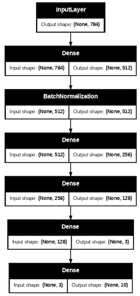

*그림 2-52. 출력 직전 layer의 출력을 embedding vector로 뽑아내는 모델 구조*

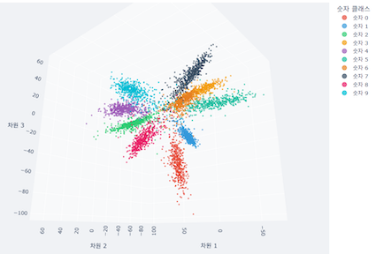

*그림 2-53. 학습된 embedding 공간에서 관찰되는 MNIST의 구조*

분류 모델 학습이 끝난 뒤 병목 3차원 값만 꺼내어 그린 그림이다. 숫자별 덩어리가 뚜렷하게 갈라져, 앞서 본 t-SNE·UMAP·Isomap·LLE의 MNIST 투영보다 클래스 구조가 훨씬 잘 드러난다. 표현을 직접 학습시키면 결과가 어떻게 달라지는지 보여준다.

---

---

## 2.3.12 심화 과제
<!-- 슬라이드 89~96 -->

### 심화 과제 2-5 — 비선형 투영은 구조를 보존하는가, 재해석하는가?

**목적**: 비선형 투영이 원래 데이터 구조를 그대로 보존하는 것이 아니라, 특정 관점(목적함수)에서 재해석(구조를 강조·재배치)한다는 점을 이해한다.

**상황 설정**: 같은 데이터에 t-SNE와 UMAP을 적용했더니 국소 클러스터는 유사하지만 전역 배치는 크게 달라졌다.

**요구 사항**

1. '구조 보존'이라는 표현이 왜 오해를 낳을 수 있는지 설명하라.
2. 비선형 투영에서 보존되는 것과 버려지는 것을 구분하라.
3. 전역 구조가 달라지는 이유를 개념적으로 설명하라.
4. 해석 시 사용자가 가져야 할 태도를 제시하라.

#### 해답 정리

> **핵심**: 비선형 투영은 고차원 구조를 옮기는 것이 아니라, 목적함수가 정의한 관점에서 **선택적으로 재해석**한다.

**1) '구조 보존'이라는 표현의 오해**

- '보존'이라는 단어는 원본 구조 전체가 저차원으로 이전된다는 느낌을 주지만, 실제로는 목적함수가 중요하다고 정의한 **특정 관계만 부분적으로** 보존된다.
- t-SNE는 국소 이웃 간 유사도 확률분포를 보존하도록 설계되어, 전체 구조의 보존을 보장하지 않는다.
- 따라서 구조 보존은 정확히는 **특정(목적함수) 관점에서의 구조 강조**이다.

**2) 보존되는 것과 버려지는 것**

*보존되는 것 — 국소 구조*

- 가까운 점들 사이의 상대적 유사성
- 클러스터 내부의 밀집 패턴
- 같은 그룹 멤버십

*버려지는 것 — 전역 구조*

| 버려지는 정보 | t-SNE | UMAP |
|---|---|---|
| 클러스터 간의 실제 거리 비율 | 완전 무시 | 간접적으로 유지 |
| 고차원에서의 전체 위상 관계(topological relation) | cluster만 유지 | 부분적으로 유지 |
| 클러스터 간 상대적 밀도 차이(cluster 내 변동성) | 버림 | 밀도 적응적 표현 |

**3) 전역 구조가 달라지는 이유**

- **t-SNE**: 국소 확률분포의 KL Divergence를 최소화하여 일치시킨다. 먼 거리의 점들은 목적함수에서 사실상 무시되므로, 전역 배치는 초기화 의존적이며 실제 거리 관계를 반영하지 못한다.
- **UMAP**: 퍼지 위상 구조를 보존하도록 설계되어 전역 연결성도 목적함수에 일부 반영된다. 클러스터 간 거리가 t-SNE보다 더 의미 있게 배치되는 경향이 있다.
- → 같은 데이터라도 **어떤 목적함수로 재해석하는지에 따라 전역 배치가 달라지는 것은 필연적**이다.

**4) 해석자의 태도**

- 시각화에서 보이는 클러스터 간 거리를 수치적으로 신뢰하면 안 된다. 전역 배치는 실제 고차원 거리를 반영하지 않을 수 있기 때문이다.
- 사용하는 알고리즘의 목적함수를 먼저 이해해야 한다. 어떤 구조가 강조되고 어떤 구조가 버려지는지 알고 해석해야 한다.
- 하나의 투영 결과만으로 결론을 내리지 말고 PCA·t-SNE·UMAP을 병행하여 **교차 검증**해야 한다. 추가로 parameter 변경에 따라 구조가 유지되는지 **안정성 테스트**가 필요하다.
- 투영 결과는 **가설 생성 도구**로 바라봐야 한다. 시각화는 패턴 발견의 출발점이지 그 자체가 분석의 결론이 아니다.

### 심화 과제 2-6 — 비선형 투영은 언제 실패하는가?

**목적**: 비선형 투영 기법의 한계와 실패 조건을 개념적으로 이해한다.

**상황 설정**: UMAP으로 시각화했을 때 명확한 클러스터가 나타났으나, 원본 데이터에서는 그러한 분리가 의미 없다는 지적이 제기되었다.

**요구 사항**

1. 비선형 투영이 '과도한 구조'를 만들 수 있는 이유를 설명하라.
2. 국소 구조 강조가 왜 오해를 유발할 수 있는지 논하라.
3. 비선형 투영 결과를 검증하는 개념적 기준을 제안하라.
4. "보이는 구조 = 실제 구조"라는 주장에 반박하라.

#### 해답 정리

> **핵심**: 비선형 투영의 실패는 알고리즘 오작동이 아니라, 결과를 실제 구조로 오인하는 **해석의 실패**다.

**1) 과도한 구조가 만들어지는 이유**

- 고차원 관계를 저차원에 압축할 때 어떤 관계를 살리고 버릴지는 **목적함수와 하이퍼파라미터가 결정**한다.
- UMAP의 `n_neighbors`를 작게 설정하면 연속적인 데이터도 조각조각 분리된 클러스터처럼 보이고, 크게 설정하면 실제로 분리된 클러스터가 뭉쳐 보인다.
- UMAP과 t-SNE의 **반발력 메커니즘**이 점들을 서로 밀어내면서 빈 공간을 만들고, 이것이 클러스터 경계처럼 보이게 한다.
  - t-SNE: 점들이 겹치지 않게 밀어낸다.
  - UMAP: 연결되지 않은 점들을 밀어낸다.

**2) 국소 구조 강조가 유발하는 오해** — 국소 이웃 관계를 우선 보존하는 과정에서 두 가지 왜곡이 발생한다.

- t-SNE는 국소 분포를 확률적으로 정규화한다 → 고차원에서 밀도가 다른 클러스터들이 시각적으로 비슷한 크기·모양으로 표현되어 **동등하게 중요해 보인다.**
- 이웃 밖의 연결을 사실상 무시한다 → 원본에서 연속적이고 점차적인 분포 변화로 이어진 구조도 **날카로운 경계를 가진 클러스터처럼** 표현된다.

**3) 검증 기준**

- **Hyperparameter 안정성 검증**: 파라미터에 따라 클러스터가 합쳐지거나 분리된다면 그 구조는 파라미터의 산물이다.
- **교차 검증**: PCA처럼 구조를 덜 왜곡하는 선형 투영에서도 비슷한 분리가 나타나면 신뢰도가 높다. t-SNE·UMAP·Isomap 등을 병행하여 교차 검증한다.
- **원본 공간에서의 직접 거리 확인**: 분리된 클러스터의 점들을 고차원 공간에서 직접 거리 계산(cosine similarity, Euclidean distance)하여 실제로 멀리 떨어져 있는지 검증한다.

**4) "보이는 구조 = 실제 구조"에 대한 반박**

- 구조가 없는 **랜덤 데이터**를 t-SNE나 UMAP에 넣어도 시각적으로 그럴듯한 클러스터가 보인다.
- 차원 축소의 본질을 보면, 고차원의 구조를 2~3차원에 동시에 보존하는 것은 **수학적으로 불가능**하다. 보이는 것은 원본의 특정 측면을 강조한 부분적 투영이다.
- **알고리즘 간 불일치**: t-SNE와 UMAP은 같은 데이터에서 서로 다른 전역 구조를 보인다. 실제 구조가 하나라면 둘 다 옳을 수 없으므로, 두 결과 모두 데이터의 특정 측면을 재해석한 것임을 의미한다.

### 심화 과제 2-7 — 국소 이웃을 완벽히 보존하면 좋은 Embedding인가?

**목적**: t-SNE와 UMAP이 강조하는 국소 구조 보존의 의미와 그 대가(trade-off)를 명확히 이해한다.

**상황 설정**: 한 임베딩 방법 X는 kNN Overlap이 0.9로 매우 높지만, 다른 방법 Y는 0.6 수준이면서 전역적인 거리 관계를 더 잘 유지한다.

**요구 사항**

1. kNN Overlap이 높다는 것이 보장해주지 못하는 정보를 설명하라.
2. t-SNE 결과에서 전역 거리 해석이 위험한 이유를 논리적으로 서술하라.
3. 분석 목적이 클러스터 탐색이 아닐 때, 국소 보존이 오히려 문제가 되는 상황을 제시하라.
4. UMAP이 절충안으로 간주되는 이유를 위상 개념을 사용해 설명하라.

### 심화 과제 2-8 — 좋은 시각화와 좋은 표현은 같은가?

**목적**: 차원 축소 결과를 시각화 도구로 볼 때와 학습 표현으로 볼 때의 차이를 구분한다.

**상황 설정**: t-SNE로 매우 깔끔한 클러스터 시각화를 얻었으나, 해당 좌표를 downstream 분류기에 사용하자 성능이 불안정하다.

**요구 사항**

1. t-SNE 임베딩이 학습 표현으로 부적합한 이유를 2가지 이상 설명하라.
2. '새 데이터 투영 불가'가 실무에서 치명적인 이유를 구체적으로 서술하라.
3. PCA는 시각적으로는 못 생겼지만 전처리로는 여전히 쓰이는 이유를 설명하라.

---

## 2.3.13 정리
<!-- 이 절에는 review 슬라이드가 없다. 2.3.3 · 2.3.7 · 2.3.9~2.3.11 의 요약 -->

> **정리**
> 선형 투영은 빠르고 해석하기 쉽지만, 비선형 매니폴드를 접어 버리고 국소 구조를 지우며 다중 모드를 평탄화하고 위상을 보존하지 못한다.
> 비선형 투영(Isomap · t-SNE · UMAP · LLE)은 각기 다른 목적함수로 이 한계를 우회하지만, 거리 보존·이웃 보존·위상 보존·분산 설명·클래스 분리를 **동시에** 만족시키지는 못한다.
> 따라서 "잘된 투영"은 절대적 기준이 아니라 **분석 목적의 함수**이며, 투영 결과는 결론이 아니라 가설 생성 도구다.
> 역변환 불가·일반화 불가·재현성 없음·파라미터 민감성·설명 불가능성·전역과 국소의 양립 불가라는 여섯 한계가, 표현 자체를 학습하는 **딥러닝 기반 분석**으로 넘어가야 할 이유가 된다.
