# 3.1 표현 공간과 Autoencoder

**학습 목표**

- 관측 공간 기반 분석과 표현 공간 기반 분석의 차이를 설명하고, 기존 차원 축소 기법이 새 데이터 앞에서 갖는 한계를 지적할 수 있다.
- 표현 공간(representation space), 잠재 공간(latent space), 잠재 표현(latent representation)의 포함 관계를 구분해 사용할 수 있다.
- Autoencoder의 encoder·latent code·decoder 구조와 재구성 손실의 수식을 쓰고, 손실 함수 선택 기준을 설명할 수 있다.
- Silhouette Score, 샘플별 MSE 분포, 잠재 공간 보간을 사용해 학습된 잠재 공간의 품질을 정량적으로 진단할 수 있다.
- 정보 병목을 정보이론의 언어로 해석하고, 목적에 맞는 잠재 차원을 설계 관점에서 선택할 수 있다.

**이 절의 구성**

- 3.1.1 관측 공간 기반 분석에서 표현 공간 기반 분석으로
- 3.1.2 Encoder, Decoder, 그리고 Autoencoder
- 3.1.3 표현 공간·잠재 공간·잠재 표현
- 3.1.4 용어의 혼용과 이 수업의 관점
- 3.1.5 Autoencoder의 기본 구조와 학습
- 3.1.6 Autoencoder의 주요 수식
- 3.1.7 잠재 공간 품질 지표
- 3.1.8 잠재 공간 보간과 연속성 검증
- 3.1.9 정보이론 관점: 병목의 수식적 이해
- 3.1.10 Autoencoder의 다양한 구조와 적용 분야
- 3.1.11 첫 Autoencoder 설계와 가중치 해석
- 3.1.12 2차원과 3차원 잠재 공간
- 3.1.13 Convolutional Autoencoder
- 3.1.14 시계열로 옮기기: 복원 오차 기반 이상 탐지
- 3.1.15 잠재 차원은 몇이어야 하는가
- 3.1.16 레이블 없이 잠재 차원 고르기
- 3.1.17 심화 과제
- 3.1.18 정리

> 실습 번호는 강의 슬라이드의 번호를 그대로 쓴다. 소절 번호와는 무관하다.

---

## 3.1.1 관측 공간 기반 분석에서 표현 공간 기반 분석으로
<!-- 슬라이드 99 -->

기존의 선형·비선형 변환 기법이 하는 일은 결국 **데이터 관계의 보존적 재배치**다. 관측 공간에서 이미 정의되어 있는 분산, 거리, 이웃 관계를 기준으로 삼아 데이터를 더 낮은 차원의 좌표계에 다시 늘어놓는 것이다. 기준이 먼저 있고 배치가 뒤따른다.

이 접근은 두 갈래의 실용적 한계를 갖는다.

- **MDS, t-SNE**: 새 데이터를 받았을 때 즉시 투영할 수 없다는 한계가 있다. 이 기법들이 만들어 낸 것은 주어진 데이터 집합에 대한 분석 결과일 뿐이며, 그 분석을 새 데이터에 그대로 적용할 수 없다.
- **PCA, LDA, Isomap, UMAP**: 새 데이터를 투영할 수는 있다. 다만 그 투영은 **기존 데이터가 만든 좌표계 안에 새 데이터를 놓는 일**이다. 기존 좌표계 안에서의 상대적 위치는 알 수 있지만, 새 데이터가 가진 특성을 독립적으로 해석하는 데에는 한계가 남는다.

딥러닝 모델의 학습을 통한 비선형 변환은 이 지점에서 다른 것을 제공한다. 제공하는 것은 축소된 좌표가 아니라 **표현 함수 그 자체**다. 모델은 훨씬 복잡한 비선형 변환 함수를 학습하고, 학습이 끝난 뒤에는 새 데이터도 단순한 forward pass 한 번으로 즉시 잠재 공간에 투영된다. 새 데이터의 특성은 이미 학습된 표현 함수에 따라 일관되게 투영되고 해석된다. 다시 말해 **과거의 데이터로 학습한 함수를 통해 현재의 데이터를 해석**하는 구도가 된다.

> **두 가지 분석의 대비**
> - **관측 공간 기반 분석**: 관계를 해석하는 기준이 이미 정해져 있다. 관측 공간에서 정의된 분산·거리·이웃 관계를 기준으로 저차원 좌표계에 재배치한다.
> - **표현 공간 기반 분석**: 데이터의 관계를 설명하는 **새로운 내부 좌표와 표현을 학습**한다.

---

## 3.1.2 Encoder, Decoder, 그리고 Autoencoder
<!-- 슬라이드 100 -->

Encoder와 decoder라는 말은 통신에서 온 비유다. 한 사람이 머릿속의 생각을 말이라는 신호로 바꾸어 내보내고(encoding), 다른 사람이 그 신호를 받아 다시 자기 머릿속의 의미로 되돌린다(decoding). 중간에 오가는 것은 원래의 생각 그 자체가 아니라 압축된 신호다.

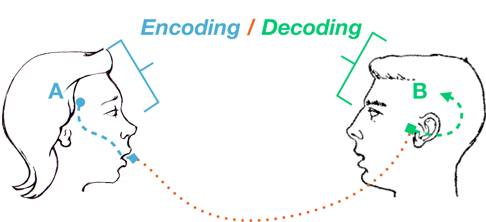

Autoencoder(AE)는 이 구조를 학습으로 옮긴 모델이다. **압축된 표현을 찾기 위해 데이터를 압축하고, 다시 입력을 재구성하는 비지도 학습**이다. 정답 레이블이 아니라 입력 자신이 목표가 된다.

- **Encoder**: 입력 데이터를 고정 길이 벡터(fixed vector), 곧 압축된 표현으로 mapping한다.
- **Decoder**: 그 고정 벡터로부터 입력과 유사한 데이터를 생성(재구성)한다.

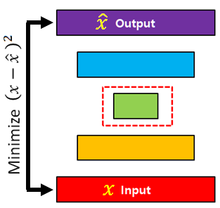

여기서 한 가지 관점을 기억해 둘 필요가 있다. **AE의 decoder는 생성(generative) 모델**이다. 잠재 벡터 하나를 입력받아 데이터 하나를 만들어 내는 함수이기 때문이다. 이 성질은 뒤에서 잠재 공간을 격자 형태로 훑으며 이미지를 생성해 볼 때 그대로 사용된다.

---

## 3.1.3 표현 공간·잠재 공간·잠재 표현
<!-- 슬라이드 101~102 -->

### 잠재 공간이란 무엇을 묻는 개념인가

AE에서 **잠재 공간(Latent Space)** 이란 Autoencoder가 발견하는 데이터의 좌표계를 말한다. 이 좌표계를 얻는 목적은 성능이 아니라 해석이다. 잠재 공간을 통해 데이터 구조를 발견하고, 그 구조를 읽어 내는 것이 목적이다. 그래서 잠재 공간을 다룰 때 던져야 할 질문은 두 개다.

- 모델이 스스로 학습한 잠재 공간은 데이터의 진짜 구조를 드러내는가?
- 드러난 그 구조를 우리는 어떻게 해석할 수 있는가?

### 표현 공간

**표현 공간(Representation Space)** 은 데이터가 변환을 거쳐 다시 기술되는 좌표계, 곧 공간이다. 딥러닝의 맥락에서는 데이터가 모델 내부에서 어떤 방식으로 다시 표현되는지를 담는 전체 공간, 즉 각 layer의 출력이 놓이는 공간을 가리킨다. 입력 $x$ 가 어떤 변환 $f$ 를 거쳐 $h = f(x)$ 가 되었을 때, 이 $h$ 들이 놓이는 공간 전체가 표현 공간이다.

- **관측 공간**: 원본 데이터가 놓여 있는 공간
- **표현 공간**: 모델이 데이터를 재배치(변환)한 공간

표현 공간에는 넓은 뜻과 좁은 뜻이 있다. **광의의 표현 공간**은 모델 내부로 한정되지 않는다. 원시 데이터를 여러 방식으로 변형하거나 전처리한 표현도 하나의 표현 공간이 될 수 있다. 따라서 광의의 표현 공간은 모델 내부의 표현 공간보다 넓다. 반면 **협의의 표현 공간**은 해석의 대상이 되는 내부 표현을 가리키며, 이 수업에서 주로 다루는 것은 협의의 표현 공간이다.

대표적인 예로는 다음이 있다.

- Hidden layer output space
- Embedding space
- Feature space
- Latent space

표현 공간에서 우리가 찾으려는 **데이터 구조**는 세 가지 형태로 나타난다.

- **Cluster**: 연속적인 밀집 영역
- **Manifold**: 연속적인 변화(저차원)
- **Feature axis**: 연속적인 의미

여기서 오해하지 말아야 할 점이 있다. AE는 구조를 **강제하지 않는다.** 구조는 이미 데이터 안에 있다. AE가 하는 일은 **그 구조가 보이는 좌표계를 재구성**하는 것이다.

### 잠재 표현

**잠재 표현(Latent Representation)** 은 잠재 공간 안에서 각 샘플이 갖는 표현 벡터, 곧 latent code 또는 latent vector다. 입력 $x_i$ 가 encoder를 통해

$$z_i = f_\theta(x_i)$$

로 바뀌면, 이 $z_i$ 가 $x_i$ 의 잠재 표현이다. 정리하면 다음과 같다.

- **표현 공간** = 벡터들이 놓이는 공간
- **잠재 표현** = 그 공간 안의 한 점(vector)

예를 들면 이렇다.

- AE가 encoding한 이미지 한 장 → 16차원 vector
- 문장 encoder가 만든 문장 표현 → 768차원 embedding
- 시계열 encoder가 만든 입력 값 하나 → 8차원 latent code

### 잠재 공간

**잠재 공간(Latent Space)** 은 이 잠재 표현들이 놓이는 표현 공간이다. 모델이 학습을 통해 얻은 (압축된) 내부 좌표계이며, Autoencoder에서는 bottleneck이 갖는 공간이 여기에 해당한다. 이 압축된 저차원 공간을 latent space라 하고, 이곳의 좌표 성분, 곧 숨은 변수를 **잠재 변수(Latent Variables)** 라 한다.

잠재 공간은 표현 공간의 한 형태이지만, 단순한 feature 표현 공간보다 강한 전제를 깔고 있다. 그 공간에는

- 숨겨진 구조가 들어 있거나,
- 생성 요인의 정보가 들어 있거나,
- 압축된 설명이 들어 있거나,
- 데이터의 본질적 자유도가 담겨 있다

는 의미가 강하게 붙는다. 따라서 포함 관계는 다음과 같이 정리된다.

$$\text{Representation Space} \;>\; \text{Latent Space (defined by Latent Variables)} \;>\; \text{Latent Representation}$$

> **핵심 메시지**
> 광의의 latent space에서 **압축 여부는 본질이 아니다.** Latent space의 본질은 압축이 아니라, **비가시적 구조의 변수가 놓이는 공간**이라는 데 있다.

---

## 3.1.4 용어의 혼용과 이 수업의 관점
<!-- 슬라이드 103 -->

실무에서는 이 용어들이 자주 섞여 쓰인다. 모델 내부 표현을 latent representation, representation, embedding, code 등으로 혼용하는 일이 흔하다. Autoencoder에서도 bottleneck layer의 출력을 latent representation, latent code, latent vector, embedding, representation 등 여러 이름으로 부르는 경우가 많다.

엄밀하게 말하면 위계는 분명하다.

- Latent space는 representation space의 한 종류다.
- Latent representation은 representation의 한 종류다.

이 수업에서는 세 용어를 각각 서로 다른 질문에 대응시켜 사용한다.

- **표현 공간**: 모델이 데이터를 어떤 좌표계로 다시 보게 만드는가
- **잠재 표현**: 각 샘플이 그 좌표계에서 어떤 위치에 놓이는가
- **잠재 공간**: 데이터 구조를 담는 좌표계가 무엇인가

그리고 **딥러닝 모델**은 데이터가 드러내는 구조를 담는 공간, 곧 잠재 공간을 만들어 내는 **계측기**로 본다.

> **정리**
> 표현 공간은 모델 내부 좌표계이고, 잠재 공간은 숨은 구조를 담도록 학습된 표현 공간이며, 잠재 표현은 그 안의 개별 벡터(point)다.

---

## 3.1.5 Autoencoder의 기본 구조와 학습
<!-- 슬라이드 104~105 -->

### 세 개의 구성 요소

AE의 기본 구조는 encoder, latent code, decoder 세 부분으로 이루어진다.

- **Encoder**: 입력 $x$ 를 (구조화된) 잠재 공간의 벡터 $z$ 로 변환하는 함수
- **Latent Code**: encoder가 만든 잠재 공간의 벡터 표현
- **Decoder**: 잠재 공간의 벡터 $z$ 로부터 입력을 복원한 $\hat{x}$ 를 생성하는 함수

시계열 Autoencoder를 예로 들면 각 요소의 역할이 분명해진다. Encoder는 시계열 입력을 압축된 잠재 벡터로 변환하고, latent code는 추세·주기성·변동성 등의 구조를 담으며, decoder는 그 잠재 벡터로부터 원래 시계열을 재구성한다.

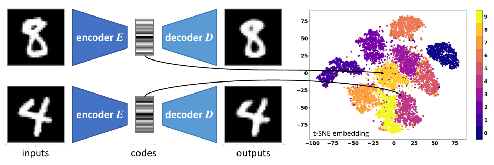

### 압축과 복원을 함께 학습한다

Autoencoder의 학습은 **압축과 복원을 함께 학습하는 표현 모델**의 학습이다. 입력을 저차원 잠재 공간으로 압축하고, 복원 오차를 최소화하도록 학습한다. 선형 AE는 PCA와 유사한 결과에 도달하지만, 비선형 AE는 더 복잡한 구조도 표현할 수 있다.

이 과정에서 일어나는 일은 관측 공간의 복잡한 구조를 더 구조적인 잠재 좌표계로 옮겨 표현하는 것이다. 옮겨 가는 목적지는 복원과 구조 해석에 유리한 좌표계, 곧 저차원에서 구조를 드러내기 쉬운 단순하고 구조적인 좌표계다.

### Autoencoder의 잠재 공간은 manifold인가

**Manifold(다양체)** 는 국부적으로 유클리드 공간과 유사한 위상 공간을 말한다. 그렇다면 latent space는 manifold 자체인가? 그렇지 않다. Latent space는 **manifold 구조를 기술하기 위해 학습된 좌표계**다. Manifold를 펼치듯 기술하려는 내부 좌표계이며, 관측 공간의 구조를 복사해 오는 공간이 아니라 **복원 가능성을 기준으로 manifold를 재좌표화한 공간**이다.

그래서 AE는 manifold를 **발견하는** 것이 아니라 **재구조화한다**고 말하는 편이 정확하다. 학습이 복원 손실을 줄이는 방향으로 진행되므로, latent space는 원래 manifold를 그대로 보존한 결과일 수도 있고, 복원에 유리하도록 일부 구조만 재배치한 결과일 수도 있다.

> **핵심 메시지**
> Latent space는 manifold 자체가 아니라, **복원 가능성을 기준으로 manifold를 재좌표화한 학습된 좌표계**다.

---

## 3.1.6 Autoencoder의 주요 수식
<!-- 슬라이드 106 -->

### 학습의 정의

Encoder와 decoder를 각각 파라미터 $\theta_e$, $\theta_d$ 를 갖는 함수로 쓰면 다음과 같다.

$$z = E(x;\theta_e), \qquad x \in \mathbb{R}^{d},\; z \in \mathbb{R}^{k},\; k \ll d$$

$$\hat{x} = D(z;\theta_d), \qquad \hat{x} \in \mathbb{R}^{d} \;\text{(원본 공간으로 복원)}$$

둘을 이어 붙이면 재구성(reconstruction)이 된다.

$$\hat{x} = D\big(E(x;\theta_e);\theta_d\big)$$

학습은 재구성 오차 $L_{\text{recon}}$ 을 최소화하는 파라미터 쌍을 찾는 최적화 문제다.

$$(\theta_e^{*},\, \theta_d^{*}) \;=\; \arg\min_{\{\theta_e,\,\theta_d\}} \; L_{\text{recon}}\Big(x,\; D\big(E(x;\theta_e);\theta_d\big)\Big)$$

### 재구성 오차 $L_{\text{recon}}$ 의 선택

재구성 오차는 데이터의 성격에 따라 골라 쓴다.

**MSE (Mean Squared Error)**

$$L_{\text{MSE}} = \frac{1}{N}\sum_{i=1}^{N} \big\lVert x_i - \hat{x}_i \big\rVert^{2}$$

픽셀 단위로 계산해 전체 이미지의 오차를 재는 방식이다. 큰 오차에 민감하므로 센서값이나 가격처럼 값의 크기 자체가 의미를 갖는 데이터에 적합하다.

**BCE (Binary Cross-Entropy)**

$$L_{\text{BCE}} = -\frac{1}{N}\sum_{i=1}^{N}\sum_{j=1}^{d} \Big[\, x_{ij}\log \hat{x}_{ij} + (1-x_{ij})\log\big(1-\hat{x}_{ij}\big) \,\Big]$$

Decoder 출력에 sigmoid를 적용해 사용한다. 픽셀 단위 Bernoulli 분포의 cross-entropy에 해당하므로, 0과 1 사이로 normalize한 이미지에 적합하다.

**CE (Cross-Entropy)**

$$H(p,q) = -\sum_{x} p(x)\,\log q(x)$$

Decoder 출력에 softmax를 적용해 사용하며, 범주형(categorical) 데이터에 쓴다.

---

## 3.1.7 잠재 공간 품질 지표
<!-- 슬라이드 107 -->

잠재 공간은 눈으로만 볼 것이 아니라 재야 한다. 구조 해석을 위한 정량 도구로 두 가지를 사용한다.

### Silhouette Score: 올바른 cluster에 있는가

샘플 $i$ 의 Silhouette Score는 다음과 같이 정의된다.

$$s(i) = \frac{b(i) - a(i)}{\max\big(a(i),\, b(i)\big)}$$

여기서 $a(i)$ 는 같은 클래스 안에서의 평균 거리이고, $b(i)$ 는 가장 가까운 다른 클래스까지의 평균 거리다. 전체 점수는 이들의 평균으로 구한다.

$$S = \frac{1}{N}\sum_{i=1}^{N} s(i), \qquad S \in [-1,\, 1]$$

아래 표는 $S$ 값의 범위별로 잠재 공간의 군집 구조를 어떻게 읽어야 하는지 정리한 것이다.

| Silhouette Score 범위 | 해석 |
|---|---|
| $S > 0.7$ | 매우 명확한 클러스터 |
| $0.5 < S \le 0.7$ | 합리적인 클러스터 |
| $0.2 < S \le 0.5$ | 약한 클러스터 |
| $S \le 0.2$ | 클러스터 구조 없음 또는 심한 겹침 |

### 샘플별 MSE 분포: 잠재 공간 표현의 균형

샘플 하나하나의 재구성 오차를 차원 수 $d$ 로 normalize해 분포를 본다.

$$e_i = \big\lVert x_i - \hat{x}_i \big\rVert^{2} \big/ d$$

이 분포의 모양이 곧 잠재 공간의 균형을 말해 준다.

- **정규 분포에 가까움**: 데이터 구조가 균일하게 잘 학습되었다.
- **오른쪽으로 긴 꼬리(right-skewed)**: 일부 데이터가 학습된 잠재 공간에서 멀리 떨어져 있다.
- **특정 클래스에서 오차가 집중**: 해당 클래스의 내부 구조가 잠재 공간에서 잘 표현되지 않았다.

---

## 3.1.8 잠재 공간 보간과 연속성 검증
<!-- 슬라이드 108 -->

### 연속성은 왜 중요한가

**잠재 공간 보간(interpolation)** 은 잠재 공간의 **연속성(continuity)** 을 확인하는 도구다. AE가 의미 있는 표현을 학습했는지 검증하는 핵심 실험이며, 방법은 간단하다. 두 입력 $x_A$, $x_B$ 의 잠재 표현 사이를 보간해 중간 이미지를 생성해 보는 것이다. 중간 지점에서도 그럴듯한 데이터가 나온다면 그 사이 공간이 비어 있지 않다는 뜻이다.

### 선형 보간 (LERP: Linear Interpolation)

잠재 공간이 유클리드 구조를 갖는다고 볼 때 사용한다. 먼저 두 끝점을 encoding한다.

$$z_A = E(x_A), \qquad z_B = E(x_B)$$

그리고 두 점 사이를 직선으로 잇는다.

$$z(\alpha) = (1-\alpha)\, z_A + \alpha\, z_B, \qquad \alpha \in [0,\,1]$$

$$\hat{x}(\alpha) = D\big(z(\alpha)\big)$$

$\alpha$ 를 움직이면 다음과 같이 변한다.

- $\alpha = 0.0$ : $z_A$ 이므로 $\hat{x} \approx x_A$
- $\alpha = 0.5$ : $(z_A + z_B)/2$ 이므로 $\hat{x}$ 는 $x_A$ 와 $x_B$ 의 중간 형태
- $\alpha = 1.0$ : $z_B$ 이므로 $\hat{x} \approx x_B$

### 구면 보간 (SLERP: Spherical Linear Interpolation)

잠재 공간이 구면 분포를 이루는 경우에는 직선이 아니라 구면 위의 최단 경로를 따라가야 한다. 두 벡터 사이의 각도를 먼저 구한다.

$$\Omega = \arccos\!\left(\frac{z_A \cdot z_B}{\lVert z_A\rVert \, \lVert z_B\rVert}\right)$$

그리고 각도를 나누어 보간한다.

$$z(\alpha) = \frac{\sin\big((1-\alpha)\Omega\big)}{\sin \Omega}\, z_A \;+\; \frac{\sin\big(\alpha \Omega\big)}{\sin \Omega}\, z_B$$

여기 쓰인 구면 관련 용어들은 다음의 뜻을 갖는다.

- **Hyperspherical(초구체)**: 고차원 구
- **Spherical Clustering**: 데이터 군집이 구형으로 뭉쳐 있는 상태
- **Spherical Normalization(구면 분포화)**: 데이터를 단위 구 표면으로 이동시켜 방향 정보만 남기는 것
- **Spherical Gaussian**: 모든 축의 분산이 동일해 확률 분포가 원형인 상태

### 보간 결과를 읽는 법

보간 결과로 나온 이미지 열은 잠재 공간의 상태를 그대로 드러낸다. 아래 표는 세 가지 전형적인 패턴과 그 진단을 정리한 것이다.

| 보간 결과 패턴 | 해석 | 시사점 |
|---|---|---|
| 전 구간에서 의미 있는 중간 이미지가 나온다 | 잠재 공간이 dense하고 연속적이다 | AE가 다양체를 잘 포착했다 |
| 일부 구간에서 노이즈 같은 이미지가 나온다 | 훈련 데이터가 없는 빈 영역이다 | AE 잠재 공간의 불연속성 → VAE로 해결 |
| 보간 경로가 부자연스럽게 도약한다 | 두 클래스 간 거리가 잠재 공간에서 멀게 설정되었다 | 클러스터를 잘 분리했다는 역설적 증거 |

---

## 3.1.9 정보이론 관점: 병목의 수식적 이해
<!-- 슬라이드 109 -->

AE의 정보 병목을 정보이론의 언어로 옮기면 학습 목표가 한층 명확해진다.

### 데이터 처리 부등식 (Data Processing Inequality)

AE에서 정보는 다음 순서로 흐른다.

$$X \;\to\; Z \;\to\; \hat{X}$$

이때 다음 부등식이 성립한다.

$$I(X;\hat{X}) \;\le\; I(X;Z)$$

원본과 재구성 사이의 상호정보량은 원본과 잠재 표현 사이의 상호정보량을 넘을 수 없다는 뜻이다. 의미는 분명하다. **잠재 공간이 보유한 정보보다 더 많은 정보를 재구성에 사용할 수 없다.** 따라서 잠재 차원 $k$ 를 줄이면 $I(X;Z)$ 가 줄어들고, 재구성 품질도 함께 제한된다.

### 정보 병목의 최적화 관점

이 구도를 최적화 문제로 다시 쓰면 목적과 제약이 갈린다.

- **품질 극대화**: $I(\hat{X};X)$ 를 최대화하는 것이 곧 재구성 품질을 극대화하는 것이다.
- **제약**: $I(X;Z) \le H_k$ 이며, 여기서 $H_k$ 는 $k$ 차원 잠재 공간이 담을 수 있는 최대 정보량, 곧 최대 entropy다.

이 제약 아래에서 **살아남는 정보가 데이터 구조의 가장 핵심적인 부분**이다. 병목이 정보를 버리는 장치가 아니라 정보를 선별하는 장치라는 관점이 여기서 나온다.

### 이 관점을 어떻게 사용하는가

주의할 점은, 이 값들이 AE에서 실제로 **계산하는 값이 아니라 AE를 설명하는 도구**라는 것이다. 다만 VAE에서는 ELBO와 KL 정규화 항을 이해하는 데 직접 사용된다(VAE에서 다시 설명한다). KL 정규화 손실

$$KL\big(q(z \mid x)\,\big\|\,p(z)\big)$$

는 원본과 잠재 표현 사이 상호정보량의 상한을 이루기 때문이다.

$$I(X;Z) \;\le\; \mathbb{E}_{x}\Big[\,KL\big(q(z \mid x)\,\|\,p(z)\big)\Big]$$

상호정보량 자체도 KL 발산으로 다시 쓸 수 있다.

$$I(X;Z) = D_{KL}\big(p(x,z)\,\|\,p(x)p(z)\big) = \mathbb{E}_{p(x)}\Big[D_{KL}\big(p(z \mid x)\,\|\,p(z)\big)\Big]$$

---

## 3.1.10 Autoencoder의 다양한 구조와 적용 분야
<!-- 슬라이드 110~111 -->

### 기본형: Under-Complete AE

**(Basic) AE**, 곧 **Under-Complete AE** 는 잠재 차원 $k$ 가 원본 차원 $d$ 보다 작은 구조다. Bottleneck을 두어 핵심 정보만 남게 만든다.

변형 구조 가운데 일부는 encoder의 민감도를 직접 제어한다. 이때 쓰이는 것이 **Jacobian**이다.

$$J(x) = \frac{\partial z}{\partial x}$$

Jacobian은 입력의 변화가 잠재 표현에 주는 영향을 나타낸다. 그 크기는 Frobenius norm으로 잰다.

$$\lVert J \rVert_F^2 = \sum_{i=1}^{k}\sum_{j=1}^{d}\left(\frac{\partial z_i}{\partial x_j}\right)^{2}$$

이는 입력의 모든 방향의 변화가 잠재 표현에 주는 영향을 제곱합으로 측정한 값이며, $\lVert \cdot \rVert_F^2$ 를 프로베니우스(Frobenius) norm이라 한다.

### 변형 구조들

아래 표는 각 변형이 기본형에서 무엇을 바꾸었고, 그 변경이 어떤 문제를 겨냥한 것인지 정리한 것이다.

| 구조 | 핵심 변경 사항 | 해결하려는 문제 |
|---|---|---|
| Sparse AE | $L = L_{\text{recon}} + \lambda \lVert z \rVert_1$ (L1 정규화) | 잠재 차원이 과도하게 사용됨 |
| Denoising AE | 입력에 노이즈를 추가한 뒤 원본을 복원 | 노이즈에 민감한 잠재 표현 |
| Contractive AE | $L \mathrel{+}= \lambda \left\lVert \dfrac{\partial z}{\partial x} \right\rVert_F^2$ (Jacobian 정규화) | 입력의 미세 변동에 민감한 표현 |
| Variational AE | 잠재 변수를 분포 $\mathcal{N}(\mu, \sigma^2)$ 로 모델링 | 잠재 공간의 빈 영역 문제 |
| Conditional AE | 조건 정보 $y$ 를 encoder/decoder에 입력 | 클래스별 제어된 생성 |

### 대표적인 적용 분야

AE 구조는 네 가지 방향으로 널리 쓰인다.

- **Anomaly Detection(노이즈 식별)**: 복원 오차가 큰 샘플을 이상치로 본다.
- **Denoising(노이즈 제거)**: 노이즈가 섞인 입력에서 깨끗한 출력을 얻는다. 학습 방식으로서의 Denoising AE와는 구분해서 생각해야 한다.
- **Super-resolution**: 저해상도 입력에서 고해상도 출력을 만든다.
- **Semantic Segmentation**: 입력 영상을 픽셀 단위 의미 지도로 변환한다.

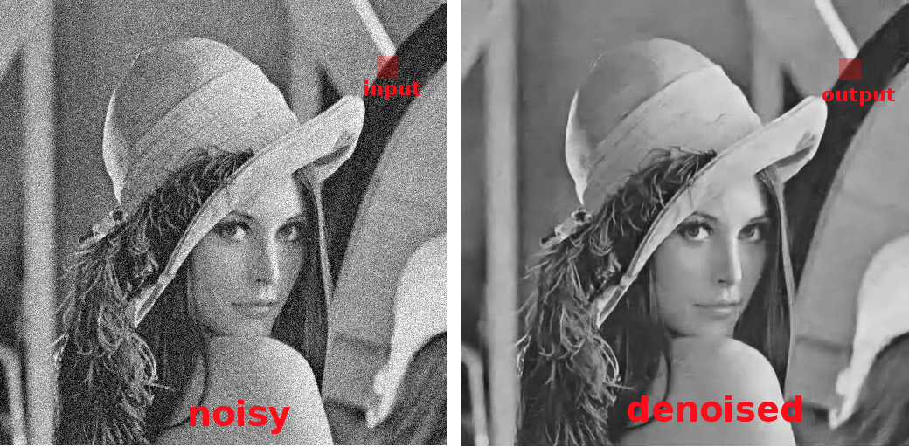

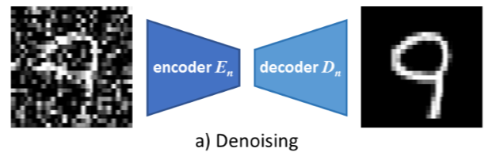

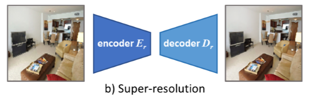

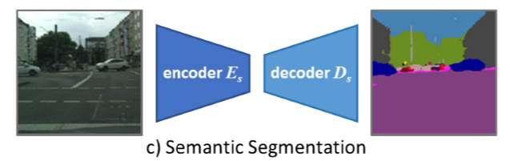

---

## 3.1.11 첫 Autoencoder 설계와 가중치 해석
<!-- 슬라이드 112~116 -->

여기까지가 Autoencoder를 정의하고 진단하는 도구다. 이제 그 도구를 실제 모델에 대어 본다. 첫 실습의 목적은 성능이 아니라 **AE가 무엇을 학습하는지를 가중치 수준에서 확인하는 것**이다.

### 실습 3.1.1 — Auto Encoder / Denoising AE

> 노트북: `code/3.1.1.AE.ipynb`

**목표** — Auto Encoder를 직접 설계하고, AE의 기본 특성을 이해한다.

**실습 개요**

MNIST와 FashionMNIST 데이터셋을 사용하여 세 가지 간단한 AE를 설계하고, 학습 후 노이즈를 제거한 이미지가 생성되는지 확인한다. 확인할 항목은 다음과 같다.

- MSE Loss와 시각적 성능의 차이를 확인해 본다.
- 노이즈가 추가된 입력 데이터로 학습하고, 노이즈가 제거된 출력을 확인한다.
- `encoding_dim=10` 으로 설정하고, 학습된 가중치를 읽어 시각화하여 그 의미를 알아본다. Encoder와 decoder의 학습된 weight를 시각화하고 결과를 분석한다.

데이터는 0~1로 normalize한 뒤 784차원으로 펼치고, 여기에 노이즈를 더해 쓴다.

```python
(x_train, y_train), (x_test, y_test) = keras.datasets.mnist.load_data()
#(x_train, y_train), (x_test, y_test) = keras.datasets.fashion_mnist.load_data()

x_train, x_test = x_train/255., x_test/255.

x_train = x_train.reshape(x_train.shape[0], 784)
x_test = x_test.reshape(x_test.shape[0], 784)

noise_level = 0.1
x_train = x_train + noise_level * np.random.randn(x_train.shape[0], 784)
x_test = x_test + noise_level * np.random.randn(x_test.shape[0], 784)
```

**AE1 — 784 → 10 → 784**

가장 단순한 Dense AE다. 784차원을 10차원으로 압축하므로 압축률은 78.4배다.

```python
# Size of encoded representation
# 784 -> 10 : compression factor 78.4
encoding_dim = 10

### Functional API ###
i_input = layers.Input(shape=(784,))

## AutoEncoder-1
encode_1 = layers.Dense(encoding_dim, activation='tanh')(i_input)
decoded_1 =  layers.Dense(784, activation='sigmoid')(encode_1)

autoencoder1 =  keras.models.Model(inputs=i_input, outputs=decoded_1, name='ae-1')
autoencoder1.summary()
```

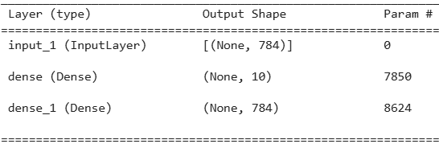

학습은 입력과 목표가 같은 형태로 진행된다.

```python
epoch_n = 50
batch_size_n = 512
### Model-1 ###
autoencoder1.compile(optimizer='adam', loss='mse')

history_1 = autoencoder1.fit(x_train, x_train,
                epochs=epoch_n, batch_size=batch_size_n,
                validation_split=0.3 )
```

**AE2 — AE1 + L2 regularization**

병목 층의 가중치에 L2 정규화를 걸어 잠재 차원이 과도하게 커지지 않도록 제약한 모델이다.

```python
##AutoEncoder-2
encode_2 = layers.Dense(encoding_dim, activation='tanh',
             kernel_regularizer = keras.regularizers.l2(0.005))(i_input)
decoded_2 =  layers.Dense(784, activation='sigmoid',)(encode_2)

autoencoder2 =  keras.models.Model(inputs=i_input, outputs=decoded_2, name='ae-2')
```

**AE3 — AE1 + classification**

AE3은 AE1에 classification을 덧붙인 모델로, 입력과 출력이 모두 이미지와 레이블을 함께 갖는다. 구조는 (784 + 10) → 10 → (784 + 10) 이다. 이미지 입력과 one-hot 레이블 입력을 concatenate해 794차원을 만든 뒤 같은 10차원 병목을 통과시키고, 출력에서 다시 이미지와 클래스로 갈라 놓는다.

```python
##AutoEncoder-3
i_input = layers.Input(shape=(784,))
l_input = layers.Input(shape=(10,)) # one-hot coded Label
t_input = layers.concatenate([i_input,l_input]) # (794,)<-(784,),(10,)
encode_3 = layers.Dense(encoding_dim, activation='tanh')(t_input)
decoded_3i =  layers.Dense(784, activation='sigmoid',name="img")(encode_3)
decoded_3l = layers.Dense(10, activation='softmax',name='class')(encode_3)

autoencoder3 =  keras.models.Model(inputs=[i_input,l_input],
                                   outputs=[decoded_3i,decoded_3l], name='ae-3')
```

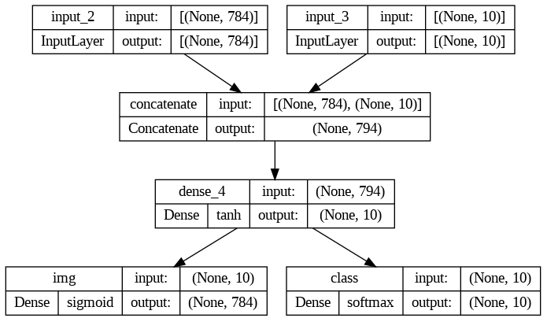

손실은 이미지 쪽 `mse` 와 클래스 쪽 `categorical_crossentropy` 를 같은 가중치로 합쳐 쓴다.

```python
y_train_oh = tf.one_hot(y_train, depth=10).numpy()

# 직접 검증 데이터 분리
split_idx = int(len(x_train) * 0.7)
x_tr, y_tr_oh = x_train[:split_idx], y_train_oh[:split_idx]
x_val, y_val_oh = x_train[split_idx:], y_train_oh[split_idx:]

autoencoder3.compile(optimizer='adam',
                     loss=['mse','categorical_crossentropy'],
                     loss_weights=[1.0,1.0],
                     metrics={'class': 'acc'})

history_3 = autoencoder3.fit(
                x=[x_tr, y_tr_oh], y=[x_tr, y_tr_oh],
                epochs=epoch_n, batch_size=batch_size_n,
                validation_data=([x_val, y_val_oh], [x_val, y_val_oh])
)
```

### 결과: MSE Loss와 시각적 성능은 같이 가지 않는다

먼저 MSE Loss와 시각적 성능의 차이를 확인하고, 노이즈가 제거된 출력을 확인한다.

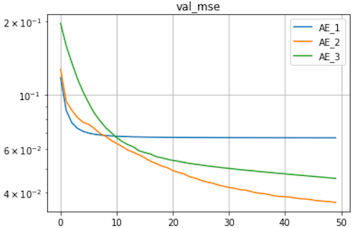

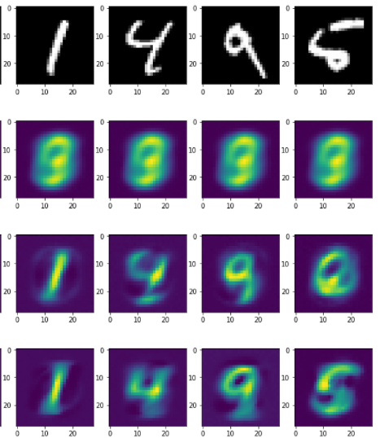

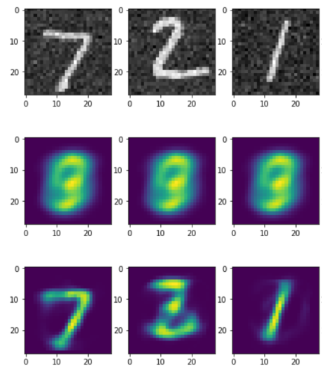

### 가중치 시각화

`encoding_dim=10` 인 상태에서 encoder와 decoder의 weight를 시각화한다.

- Encoder dense layer 가중치: $(784 \times 10)$ 을 transpose하여 본다.
- Decoder dense layer 가중치: $(10 \times 784)$ 를 그대로 본다.
- Bottleneck의 $n$ 번 node에 연결된 decoder의 가중치를 시각화한다. 이때 $(784,)$ 를 $(28, 28, 1)$ 로 reshape한다.

```python
## Encoder Weight (784,10) or (794,10)
plt.figure(figsize=(200, 10))

plt.subplot(3,1,1)
k_weight=autoencoder1.layers[1].get_weights()[0]
plt.imshow(np.transpose(k_weight))

plt.subplot(3,1,2)
k_weight=autoencoder2.layers[1].get_weights()[0]
plt.imshow(np.transpose(k_weight))

plt.subplot(3,1,3)
k_weight=autoencoder3.layers[3].get_weights()[0]
plt.imshow(np.transpose(k_weight))

plt.show()
```

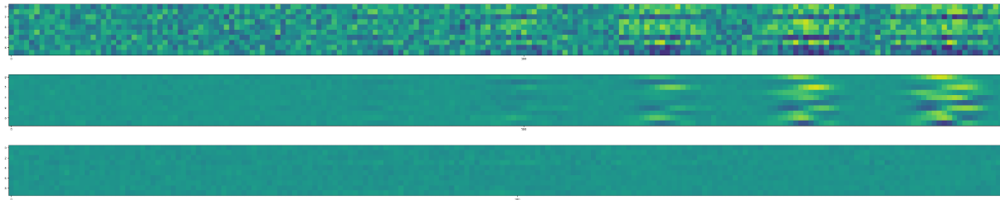

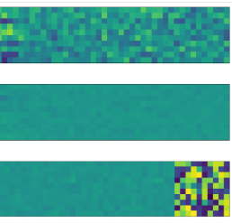

Decoder 쪽도 같은 방식으로 본다.

```python
## Decoder weight (10,784)
plt.figure(figsize=(200,10))

# Decoder_1 Dense Layer의 W(10x784=7840) 읽음
plt.subplot(3,1,1)
k_weight=autoencoder1.layers[2].get_weights()[0]
plt.imshow(k_weight)

plt.subplot(3,1,2)
k_weight=autoencoder2.layers[2].get_weights()[0]
plt.imshow(k_weight)

plt.subplot(3,1,3)
k_weight=autoencoder3.layers[4].get_weights()[0]
plt.imshow(k_weight)

plt.show()
```

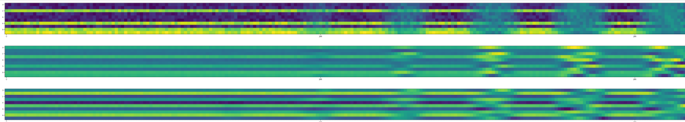

마지막으로 bottleneck 노드 하나하나에 연결된 decoder 가중치를 $(28,28)$ 로 되돌려 그린다.

```python
n=10
plt.figure(figsize=(14,5))
k_w1=autoencoder1.layers[2].get_weights()[0]
k_w2=autoencoder2.layers[2].get_weights()[0]
k_w3=autoencoder3.layers[4].get_weights()[0]
for i in range(n):
    plt.subplot(3,n,i+1)
    img = k_w1[i].reshape(28,28)
    plt.imshow(img)
    plt.subplot(3,n,n+i+1)
    img = k_w2[i].reshape(28,28)
    plt.imshow(img)
    plt.subplot(3,n,n+n+i+1)
    img = k_w3[i].reshape(28,28)
    plt.imshow(img)

plt.show()
```

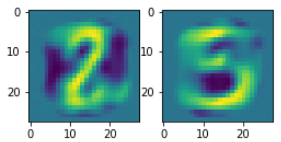

**질문**

- AE3 Encoder의 parameter를 통해 알 수 있는 것은 무엇인가?
- AE3 Decoder 가중치 시각화에서 보이는 이미지는 무엇을 의미하는가?

---
## 3.1.12 2차원과 3차원 잠재 공간
<!-- 슬라이드 117~124 -->

잠재 공간을 눈으로 보려면 차원이 2나 3이어야 한다. 그런데 차원을 그렇게까지 줄이면 무엇이 보이고 무엇이 무너지는가? 3.1.7과 3.1.8에서 정의한 세 도구 — Silhouette Score, 샘플별 MSE 분포, 보간 — 를 그대로 적용해 2d 모델과 3d 모델을 비교한다.

### 실습 3.1.2 — 2d, 3d Latent Space 시각화 및 Decoder 성능 확인

> 노트북: `code/3.1.2.AE_2d_3d.ipynb`

**목표** — Auto Encoder의 bottleneck을 2개, 3개 node로 설계하고 그 특성을 확인한다.

**실습 개요**

- 실습 3.1.1의 코드에서 bottleneck layer가 2개, 3개 node를 갖는 조금 더 큰 모델로 수정한다.
- Latent Space를 시각화하여 확인한다. 2d와 3d로 각각 시각화하여 차이를 확인하고, encoder가 mapping한 latent code의 영역(범위)을 검토한다.
- Decoder에 latent code를 grid sampling하여 넣고, 생성되는 이미지를 확인한다. 이때 grid sampling하는 범위를 어떻게 결정할 것인지 스스로 판단해야 한다. 3d에서는 $z_2 = 0$ 으로 고정하고, 2d 평면 $(z_0, z_1)$ 에서 grid sampling하여 decoder 출력을 그려 본다.
- 두 모델의 성능 차이를 확인한다. 시각화 결과를 비교하고, Silhouette Score(2D vs 3D)를 계산해 비교하며, 샘플들의 MSE Distribution을 비교해 그 차이를 설명한다. 마지막으로 Latent Interpolation(Narrow $z_0$ Sampling)을 통해 성능 차이를 비교한다. 성능 차이가 보이는가? 더 잘 보이게 하려면 무엇을 바꿔야 하는가?

### Model 2d

Encoder는 784 → 128 → 32 → 2 로 좁혀 가고, decoder는 그 역순이다. 모든 Dense 층에 `max_norm` 제약을 걸어 가중치가 커지는 것을 막는다.

```python
from keras.constraints import max_norm
encoding_dim = 2
m_norm = 1. # 2.

# Encoded representation of input image
def encoder():
  img = layers.Input(shape=(784,))
  x = layers.Dense(128, activation='relu',
                   kernel_constraint=max_norm(m_norm))(img)
  x = layers.Dense(32, activation='relu',
                   kernel_constraint=max_norm(m_norm))(x)
  x = layers.Dense(encoding_dim, activation='linear',
                   kernel_constraint=max_norm(m_norm),name='enc')(x)
  return keras.Model(img,x,name='encoder')

# Decode is lossy reconstruction of input
def decoder():
  dec_in = layers.Input(shape=(2,))
  x = layers.Dense(32, activation='relu',
                   kernel_constraint=max_norm(m_norm),name='dec_in')(dec_in)
  x = layers.Dense(128, activation='relu',
                   kernel_constraint=max_norm(m_norm))(x)
  x = layers.Dense(784, activation='sigmoid',
                   kernel_constraint=max_norm(m_norm),name='dec')(x)
  return keras.Model(dec_in,x, name='decoder')
```

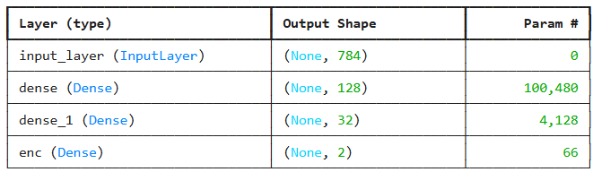

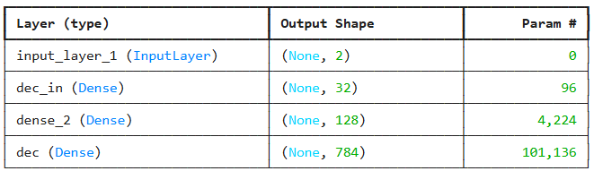

두 모델을 이어 붙여 하나의 AE로 만든다.

```python
enc_model = encoder()
dec_model = decoder()
img = layers.Input(shape=(784,))
enc_out = enc_model(img)
out_img = dec_model(enc_out)
AE = keras.Model(img,out_img)

AE.summary()
```

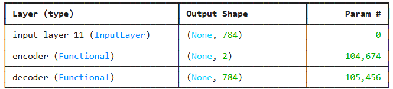

**Training**

```python
epoch_n = 100
batch_size_n = 512
AE.compile(optimizer=keras.optimizers.Adam(learning_rate=0.001), loss='mse')

history_1 = AE.fit(x_train, x_train, verbose=2,
                epochs=epoch_n, batch_size=batch_size_n,
                validation_data=(x_test,x_test))
```

**Prediction**

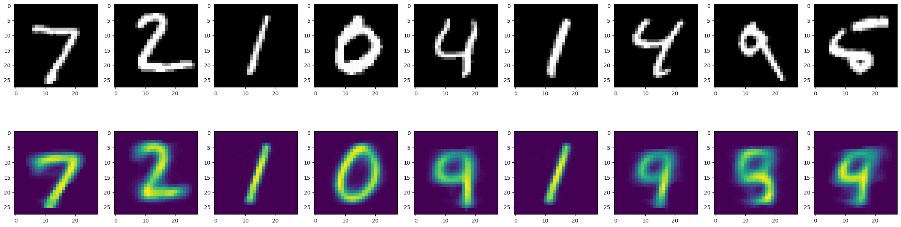

### Latent Space Visualization

Training image가 2d latent space로 mapping되는 관계를 시각화한다.

```python
def plot_label_clusters(encoder, data, labels):
    # display a 2D plot of the digit classes in the latent space
    _z = encoder.predict(data,verbose=0) # data.shape:(60000,28,28,1)
    # z_mean.shape:(60000,2)
    plt.figure(figsize=(6, 5))
    plt.scatter(_z[:, 0], _z[:, 1], c=labels, s=2) # z[0],z[1]
    plt.colorbar()
    plt.xlabel("z[0]")
    plt.ylabel("z[1]")
    plt.grid()
    plt.show()

plot_label_clusters(enc_model, x_train, y_train)
```

![학습 이미지를 2차원 잠재 공간에 투영한 산점도 — 클래스별 색 영역이 원점 주변에서 부채꼴로 갈라지고, z[0]는 대략 −10에서 10, z[1]은 −5에서 15에 걸쳐 있다](images/s120_02.png)

![같은 시각화를 더 넓은 축 범위에서 본 산점도 — z[0]가 −20까지 퍼져 있고 클래스별 색 영역의 배치가 다르게 나타난다](images/s120_03.png)

### 2d Grid Decoding Visualization

Latent code를 $\pm 5$ 범위에서 sampling하여 decoder에 넣고, 생성된 이미지를 격자로 배열한다.

```python
figure = np.zeros((digit_size * n, digit_size * n))
grid_x = np.linspace(-5, 5, n)
grid_y = np.linspace(-5, 5, n)

for i, xi in enumerate(grid_x):
    for j, yi in enumerate(grid_y):
        z_sample = np.array([[xi, yi]])
        # 그리드 좌표값으로 추론
        x_decoded = dec_model.predict(z_sample, batch_size=batch_size,verbose=0)
        # 28 x 28 로 변환
        digit = x_decoded[0].reshape(digit_size, digit_size)

        figure[i * digit_size: (i + 1) * digit_size,
               j * digit_size: (j + 1) * digit_size] = digit
```

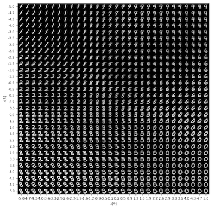

### Model 3d

3d 모델은 2d와 동일한 구조에서 `encoding_dim = 3` 으로만 수정한 모델이다. 파라미터 수는 210,130개(820.82 KB)에서 210,195개(821.07 KB)로 늘어난다.

Latent Space Visualization에서는 training image가 3d latent space로 mapping되는 관계를 시각화하고, 유사한 숫자끼리 인접한 클래스로 배치되었는지 확인한다. 확인해 볼 조합은 다음과 같다.

- 4와 9 (세로선이 유사하다)
- 3과 8 (둥근 부분이 유사하다)
- 1과 7 (대각선이 유사하다)

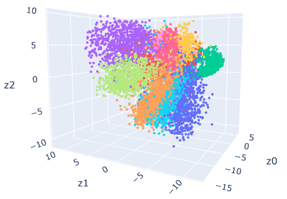

Grid Decoding Visualization은 $z_2 = 0$ 으로 고정하고 latent code를 $\pm 5$ 범위에서 sampling하여 decoder 출력을 그린다. 결과는 그다지 좋아 보이지 않는다. 왜 그런지 설명해 보아야 한다.

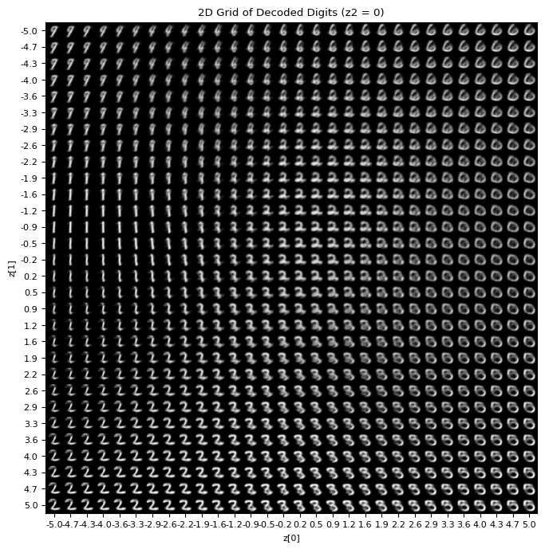

### 결과: 두 모델 성능 비교

비교는 두 축으로 진행한다. 하나는 Silhouette Score(2D vs 3D)이고, 다른 하나는 모델별 MSE Distribution이다.

```python
from sklearn.metrics import silhouette_score
# Get 2D latent representations for the test set
z_test_2d = enc_model.predict(x_test, verbose=0)
# Calculate Silhouette Score for 2D latent space
silhouette_2d = silhouette_score(z_test_2d, y_test)
print(f"Silhouette Score (2D Latent Space): {silhouette_2d:.4f}")
# Calculate Silhouette Score for 3D latent space (z_test_3d already exists)
silhouette_3d = silhouette_score(z_test_3d, y_test)
print(f"Silhouette Score (3D Latent Space): {silhouette_3d:.4f}")
```

출력된 값은 2D 잠재 공간에서 0.0951, 3D 잠재 공간에서 0.0993이다. 3.1.7의 해석 기준으로 보면 둘 다 $S \le 0.2$ 구간, 곧 **클러스터 구조가 없거나 심하게 겹치는** 영역이며 차원을 하나 늘린 효과도 크지 않다.

이어서 샘플별 재구성 오차의 분포를 본다.

```python
# 1. Predict the reconstructed images for the test set
x_recon_2d = AE.predict(x_test, verbose=0)
x_recon_3d = AE_3d.predict(x_test, verbose=0)
# 2. Calculate the Mean Squared Error (MSE) for each individual sample
mse_2d = np.mean(np.square(x_test - x_recon_2d), axis=1)
mse_3d = np.mean(np.square(x_test - x_recon_3d), axis=1)

plt.hist(mse_2d, bins=50, alpha=0.5, label='2D Autoencoder', density=True)
plt.hist(mse_3d, bins=50, alpha=0.5, label='3D Autoencoder', density=True)
```

MSE 분포를 읽는 기준은 앞서 정리한 그대로다. 정규 분포에 가까우면 데이터 구조가 균일하게 잘 학습된 것이고, 오른쪽으로 긴 꼬리가 나타나면 일부 데이터가 잠재 공간에서 멀리 위치한 것이며, 특정 클래스에서 오차가 집중되면 해당 클래스의 내부 구조가 잠재 공간에서 잘 표현되지 않은 것이다.

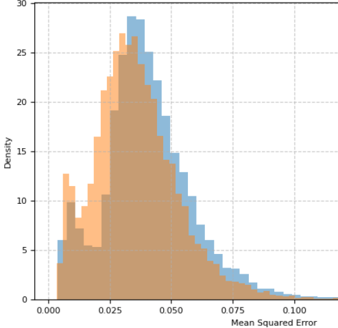

### 클래스별 MSE와 Narrow $z_0$ 보간

다음으로 클래스별 MSE 분포를 best case와 worst case로 나누어 보고, 클래스별 평균과 분산을 비교한다.

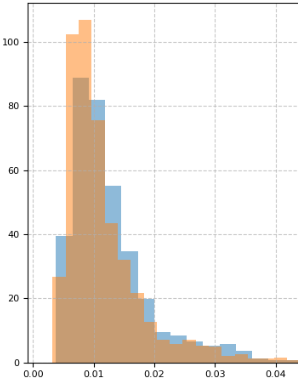

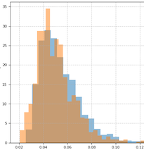

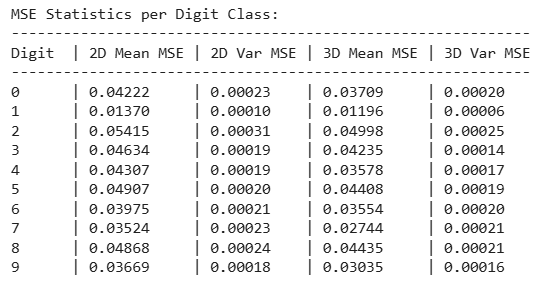

이어서 Latent Interpolation(Narrow $z_0$ Sampling)을 시각화한다. $z_0$ 에 대해 $\pm 2$ 영역에서 sampling한 latent code로 decoding하여, latent space가 dense하게 구성되었는지 비교한다. 의미 있는 분석이 가능해 보이는가? 3자 중심에서 시작해 8자 중심까지 20개의 interpolation point를 사용해 비교해 본다.

```python
n_sample = 20
z0_range = np.linspace(-2, 2, n_sample)

# Construct latent inputs
z_input_2d = np.column_stack((z0_range, np.zeros(n_sample)))
z_input_3d = np.column_stack((z0_range, np.zeros(n_sample), np.zeros(n_sample)))

# Predict and reshape
decoded_2d = dec_model.predict(z_input_2d, verbose=0).reshape(n_sample, 28, 28)
decoded_3d = dec_model_3d.predict(z_input_3d, verbose=0).reshape(n_sample, 28, 28)
```

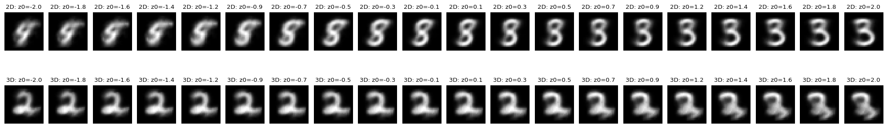

---
## 3.1.13 Convolutional Autoencoder
<!-- 슬라이드 125~128 -->

Dense 층만으로 만든 AE는 이미지의 공간 구조를 전혀 쓰지 않는다. 픽셀을 784개의 독립된 숫자로 늘어놓기 때문이다. 합성곱을 쓰면 이 가정이 바뀐다.

### 실습 3.1.3 — Convolutional Autoencoder

> 노트북: `code/3.1.3.ConvAE.ipynb`

**목표** — 잘 만들어진 Autoencoder의 성능을 확인해 본다.

**실습 개요**

- Conv layer 3개로 이루어진 encoder와 decoder를 구성한다. 성능을 잘 튜닝했을 때의 denoising 성능을 확인한다.
- Fashion MNIST 데이터셋도 함께 사용해 본다.

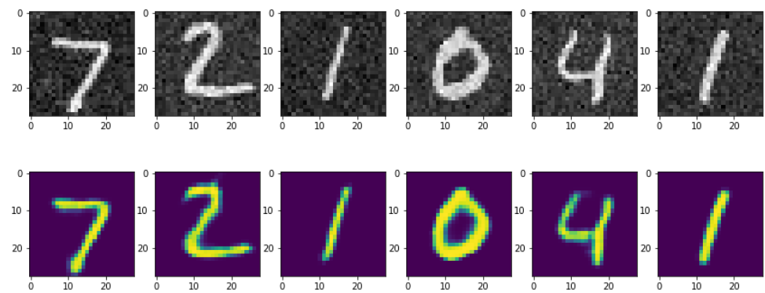

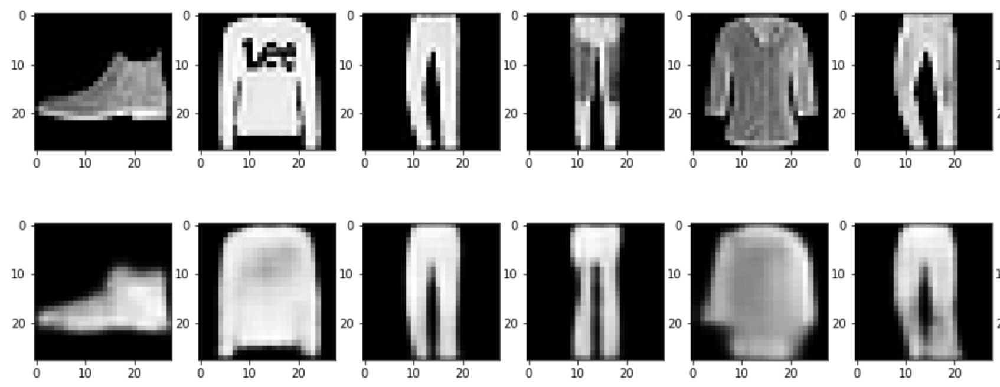

### Keras Conv layer

Conv AE를 만들 때 쓰는 층은 두 가지다.

- **Conv2D layer**: 입력을 합성곱으로 훑어 채널 수를 바꾸고, pooling으로 해상도를 줄인다.
- **Conv2DTranspose layer**: `UpSampling2D + Conv2D` 조합과 유사하되, 값을 복사해 채워 넣는 대신 0을 삽입한 뒤 합성곱을 수행한다. UpSampling 방식에 비해 성능 향상이 가능하다.

인코더 앞단은 `Conv2D` 와 `MaxPooling2D` 를 번갈아 쌓아 만든다.

```python
x = layers.Conv2D(32, 3, 1, 'same', activation='relu')(i_input)
x = layers.MaxPooling2D(2,padding='same')(x)
x = layers.Conv2D(16, 3, 1, 'same', activation='relu')(x)
x = layers.MaxPooling2D(2,padding='same')(x)
```

디코더에서 `Conv2DTranspose` 를 쓸 때는 `strides=2` 로 해상도를 두 배씩 늘린다. 실습 3.1.3의 노트북은 `UpSampling2D + Conv2D` 조합 쪽을 쓰므로, `Conv2DTranspose` 를 쓰는 형태는 슬라이드의 예시 코드로 남겨 둔다.

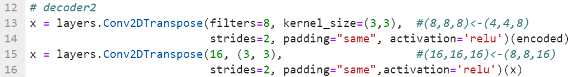

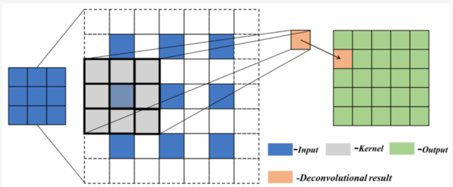

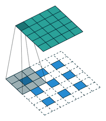

> 그림 출처: https://www.mdpi.com/2076-3417/10/14/4999/htm

### Convolutional AE 구성과 학습

Encoder는 `Conv2D` 와 `MaxPooling2D` 로 $28 \times 28 \times 1$ 을 $4 \times 4 \times 8$ 까지 줄이고, decoder는 `UpSampling2D` 와 `Conv2D` 로 되돌린다.

```python
i_input = keras.layers.Input(shape=(28, 28, 1))
# encoder
x = layers.Conv2D(32, 3, 1, 'same', activation='relu')(i_input)
x = layers.MaxPooling2D(2,padding='same')(x)
x = layers.Conv2D(16, 3, 1, 'same', activation='relu')(x)
x = layers.MaxPooling2D(2,padding='same')(x)
x = layers.Conv2D(8, 3, 1, 'same', activation='relu')(x)
encoded = layers.MaxPooling2D(2,padding='same',name="encoded")(x)

# decoder
x = layers.Conv2D(8, 3, 1, 'same', activation='relu')(encoded)
x = layers.UpSampling2D(2)(x)
x = layers.Conv2D(16, 3, 1, 'same', activation='relu')(x)
x = layers.UpSampling2D(2)(x)
x = layers.Conv2D(32, 3, 1, activation='relu')(x)
x = layers.UpSampling2D(2)(x)
decoded = layers.Conv2D(1, 3, 1,'same', activation='sigmoid')(x)
autoencoder = keras.models.Model(inputs=i_input, outputs=decoded)
autoencoder.summary()
```

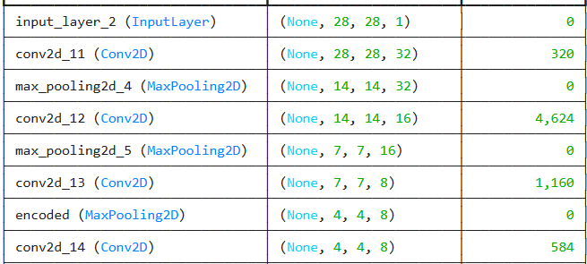

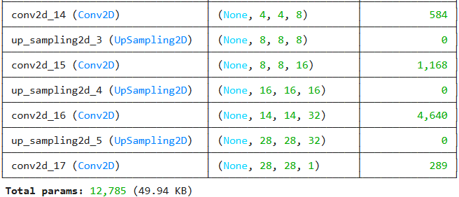

**Training**

```python
autoencoder.compile(optimizer='rmsprop', loss='mse')
history1 = autoencoder.fit(x_train, x_train,
                epochs=30,
                batch_size=512,
                validation_data=(x_test, x_test))
```

학습 후 예측 결과를 보며 다음 질문을 던진다. 정말 노이즈가 제거된 것인가?

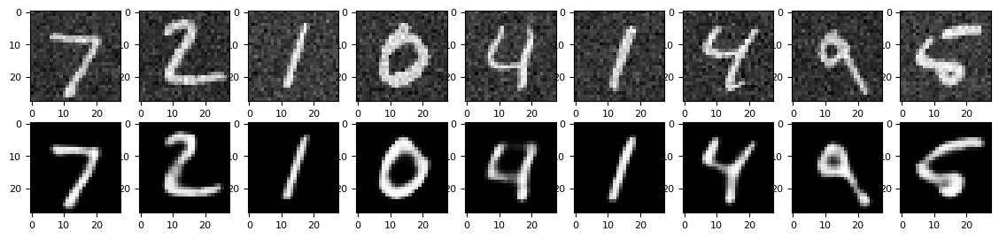

---

## 3.1.14 시계열로 옮기기: 복원 오차 기반 이상 탐지
<!-- 슬라이드 131~132 -->

지금까지는 잠재 공간의 구조를 읽는 데 AE를 썼다. 그런데 AE가 내놓는 또 하나의 값, **복원 오차** 자체를 신호로 쓰는 용법이 있다. 정상 데이터만으로 학습한 AE는 정상 패턴을 잘 복원하지만 처음 보는 패턴은 잘 복원하지 못한다. 그 오차의 크기가 곧 이상 여부의 척도가 된다.

### 실습 3.1.4 — 1d Conv AE를 사용한 Time series Anomaly Detection

> 노트북: `code/3.1.4.AnomalyDetection.ipynb`

**목표** — 시계열 이상 탐지(Time series Anomaly Detection)를 수행한다.

**실습 개요**

- 288 길이로 sampling된 시계열을 준비한다.
- 1d Conv를 사용한 AE를 구성한다.
- 정상 시계열만으로 학습한다.
- 복원 error를 기준으로 삼는다.
- 비정상 시계열을 detection한다.

시계열은 길이 288의 창으로 잘라 쌓는다.

```python
TIME_STEPS = 288

# Generated training sequences for use in the model.
def create_sequences(values, time_steps=TIME_STEPS):
    output = []
    for i in range(len(values) - time_steps + 1):
        output.append(values[i : (i + time_steps)])
    return np.stack(output)

x_train = create_sequences(df_training_value.values)
```

**모델**

`Conv1D` 로 줄이고 `Conv1DTranspose` 로 되돌리는 대칭 구조다.

```python
model = keras.Sequential(
    [
        layers.Input(shape=(x_train.shape[1], x_train.shape[2])),
        layers.Conv1D( 32, 7, 2, padding="same", activation="relu"),
        layers.Dropout(0.2),
        layers.Conv1D( 16, 7, 2, padding="same", activation="relu"),
        layers.Conv1DTranspose( 16, 7, 2, padding="same",activation="relu"),
        layers.Dropout(0.2),
        layers.Conv1DTranspose(32, 7, 2, padding="same", activation="relu"),
        layers.Conv1DTranspose(1, 7, padding="same"),
    ] )
model.compile(optimizer='adam', loss="mse",metrics=['mape'])
model.summary()
```

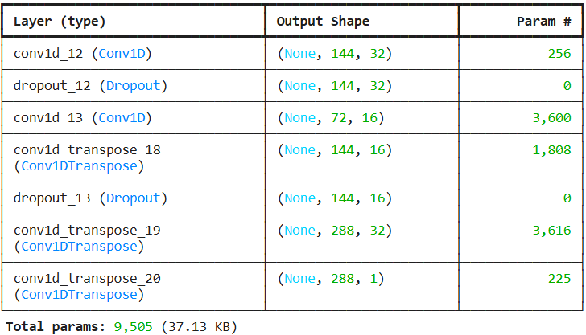

### 결과: 오차 분포가 임계값을 준다

정상 시계열로 학습한 뒤 train MAE loss의 분포를 보고, 그 최대값을 이상 판정 임계값으로 삼는다.

```python
# Get train MAE loss.
x_train_pred = model.predict(x_train,verbose=0)
train_mae_loss = np.mean(np.abs(x_train_pred - x_train), axis=1)

# Get reconstruction loss threshold.
threshold = np.max(train_mae_loss)
```

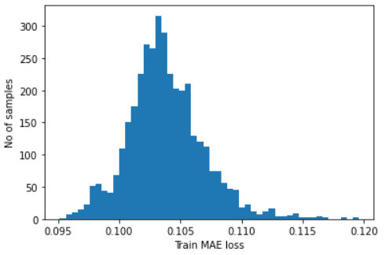

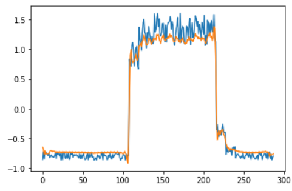

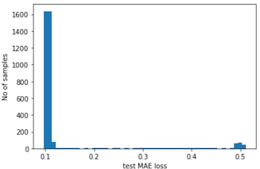

---
## 3.1.15 잠재 차원은 몇이어야 하는가
<!-- 슬라이드 133~136 -->

지금까지의 실습은 잠재 차원을 2, 3, 10처럼 손으로 정했다. 그러나 잠재 차원은 임의로 고를 수 있는 값이 아니다. 3.1.9에서 보았듯 $k$ 를 줄이면 $I(X;Z)$ 가 줄고 재구성 품질이 제한된다. 반대로 $k$ 를 키우면 구조가 흩어진다. 그렇다면 어디가 적당한가? 이 물음에 **여러 지표를 동시에 재서** 답하는 것이 다음 실습이다.

### 실습 3.1.5 — Latent dim 결정하기

> 노트북: `code/3.1.5.Latent_Dim.ipynb`

**목표** — 최적의 latent dim을 결정하기 위한 방법을 살펴본다.

**실습 개요**

- 노이즈가 포함된 MNIST 데이터를 준비한다.
- Conv AE 모델의 `latent_dim` 을 [2, 3, 8, 32, 128, 256, 512]로 바꾸어 가며 학습한다.
- t-SNE 시각화와 Silhouette score를 함께 본다.
- 평가 지표를 계산한다.
  - MSE
  - Sil: Silhouette score
  - DB Index
  - NMI: Normalized Mutual Information
  - Acc: LogisticRegression Accuracy
  - LID: Local Intrinsic Dimensionality(국소 고유 차원)
- UMAP 시각화와 평가 지표를 함께 본다.

**실습 과제** — 평가 지표를 분석하여 최적 latent dim을 결정한다.

모델은 Conv 층 뒤에 `Flatten` 과 `Dense(latent_dim)` 을 두어 잠재 차원을 명시적으로 잡는다.

```python
latent_dim = 16

i_input = keras.layers.Input(shape=(28, 28, 1))
# encoder
x = layers.Conv2D(32, 3, 1, 'same', activation='relu')(i_input)
x = layers.MaxPooling2D(2,padding='same')(x)
x = layers.Conv2D(16, 3, 1, 'same', activation='relu')(x)
x = layers.MaxPooling2D(2,padding='same')(x)
x = layers.Flatten()(x)
encoded = layers.Dense(latent_dim, name="encoded")(x)

# decoder
x = layers.Dense(7*7*16)(encoded)
x = layers.Reshape((7, 7, 16))(x)
x = layers.UpSampling2D(2)(x)
x = layers.Conv2D(16, 3, 1, 'same', activation='relu')(x)
x = layers.UpSampling2D(2)(x)
x = layers.Conv2D(32, 3, 1, 'same', activation='relu')(x)
decoded = layers.Conv2D(1, 3, 1,'same', activation='sigmoid')(x)
autoencoder = keras.models.Model(inputs=i_input, outputs=decoded)
```

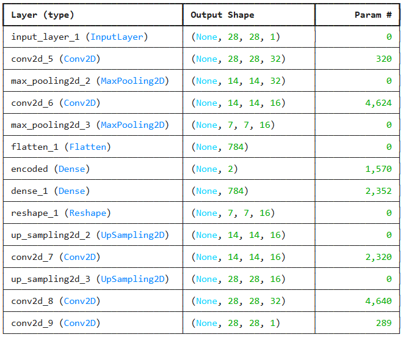

### 다차원 t-SNE 처리: PCA 전처리 후 t-SNE

잠재 차원이 큰 경우에는 t-SNE를 바로 적용하지 않는다. 차원이 50을 넘으면 PCA로 50차원까지 먼저 줄인 뒤 t-SNE를 적용한다.

```python
# If latent dimension is large, use PCA to reduce to 50 dimensions before t-SNE
if dim > 50:
    pca = PCA(n_components=50)
    latent_codes_reduced = pca.fit_transform(latent_codes)
else:
    latent_codes_reduced = latent_codes

# Apply t-SNE
tsne = TSNE(n_components=2, random_state=42)
latent_2d = tsne.fit_transform(latent_codes_reduced)
```

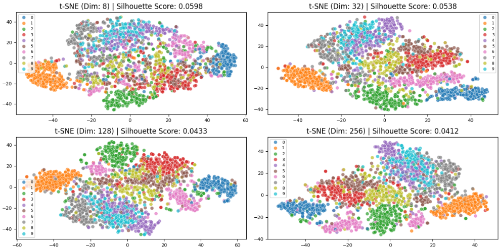

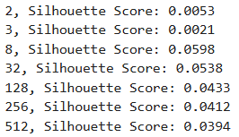

### 결과: 지표마다 최적점이 다르다

계산한 평가 지표는 차원별로 나란히 놓고 읽는다.

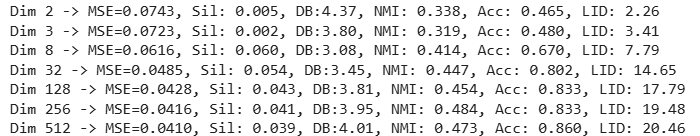

각 지표는 다음 기준으로 읽는다.

| 지표명 | 해석 방법 (Goal) |
|---|---|
| Silhouette Score | 1에 가까울수록 좋다 (0 이하는 군집 중첩) |
| DB Index | 값이 낮을수록(0에 가까울수록) 군집 분리가 우수하다 |
| NMI | 1에 가까울수록 실제 클래스 정보를 잘 간직한다 |
| Linear Accuracy | 정확도가 높을수록 특징(feature)이 명확하게 추출된다 |
| LID (Local Intrinsic Dim) | 설정한 차원보다 현저히 낮으면 차원 축소의 여지가 있다 |
| Reconstruction Error | 값이 낮을수록 정보 복원 능력이 뛰어나다 |

목적에 따라 읽는 지점도 달라진다.

1. **시각화 중점**: Silhouette과 DB Index가 가장 좋은 지점
2. **분류/예측 중점**: Linear Accuracy와 NMI가 고점을 찍고 유지되는 지점
3. **압축 효율 중점**: Reconstruction Error가 급격히 줄어들다가 완만해지고, LID와 실제 차원의 격차가 적은 지점

---

## 3.1.16 레이블 없이 잠재 차원 고르기
<!-- 슬라이드 137~138 -->

실습 3.1.5의 지표 가운데 NMI와 Accuracy는 레이블을 쓴다. 레이블이 없는 상황에서는 쓸 수 없는 지표다. 그렇다면 레이블 없이도 잠재 차원을 고를 수 있는가? 지표를 바꾸고 가중합으로 종합하면 가능하다.

### 실습 3.1.6 — Labelless Clustering

> 노트북: `code/3.1.6.LabellessClustering.ipynb`

**목표** — 레이블을 사용하지 않고 적절한 cluster를 발견할 수 있는 latent dim을 결정한다.

**실습 개요**

- 노이즈가 포함된 MNIST 데이터를 준비한다.
- Conv AE 모델의 `latent_dims` 를 [3, 7, 12, 18, 24, 30]으로 바꾸어 가며 학습한다.
- 평가 지표를 계산한다.
  - MSE
  - Sil: Silhouette score
  - DB Index
  - LID: Local Intrinsic Dimensionality(국소 고유 차원)
  - Calinski-Harabasz Score(Variance Ratio Criterion): 군집 간 분산 / 군집 내 분산
  - NMI: Normalized Mutual Information
  - Acc: LogisticRegression Accuracy
- 평가 지표의 가중합으로 최적의 latent dim을 결정한다.
- UMAP으로 시각화한다.

**실습 과제** — 평가 지표의 가중치를 변경하면서 민감도를 검토해 본다.

여기서는 노이즈를 두 종류로 섞는다. 픽셀 단위 노이즈에 더해 가로줄(row) 단위 편향까지 얹어, 구조가 더 어지러운 데이터를 만든다.

```python
# Noise levels
pixel_noise = 0.2
line_noise = 0.3

# Add Pixel Noise
x_train_noisy = x_train + pixel_noise * np.random.randn(x_train.shape[0], 784)

# Add Line (Row) Bias Noise
# 784 차원을 28x28로 변환하여 가로줄(row) 단위로 노이즈를 더합니다.
train_line_bias = line_noise * np.random.randn(x_train.shape[0], 28, 1)
x_train = (x_train_noisy.reshape(-1, 28, 28) + train_line_bias).reshape(-1, 784)
```

모델은 잠재 차원을 인자로 받는 함수로 만들어 여섯 개 차원을 차례로 학습시킨다.

```python
def build_cae(hidden_dim):
    i_input = keras.layers.Input(shape=(28, 28, 1))
    # encoder
    x = layers.Conv2D(32, 3, 1, 'same', activation='relu')(i_input)
    x = layers.MaxPooling2D(2, padding='same')(x)
    x = layers.Conv2D(16, 3, 1, 'same', activation='relu')(x)
    x = layers.MaxPooling2D(2, padding='same')(x)
    x = layers.Flatten()(x)
    encoded = layers.Dense(hidden_dim, name="encoded")(x)
    encoder = keras.models.Model(inputs=i_input, outputs=encoded,
                                 name=f"encoder_dim_{hidden_dim}")
    # decoder
    x = layers.Dense(7*7*16)(encoded)
    x = layers.Reshape((7, 7, 16))(x)
    x = layers.UpSampling2D(2)(x)
    x = layers.Conv2D(16, 3, 1, 'same', activation='relu')(x)
    x = layers.UpSampling2D(2)(x)
    x = layers.Conv2D(32, 3, 1, 'same', activation='relu')(x)
    decoded = layers.Conv2D(1, 3, 1, 'same', activation='sigmoid')(x)
    autoencoder = keras.models.Model(inputs=i_input, outputs=decoded,
                                     name=f"autoencoder_dim_{hidden_dim}")
    autoencoder.compile(optimizer='rmsprop', loss='mse')
    return autoencoder, encoder

latent_dims = [3, 7, 12, 18, 24, 30]
```

### 결과: 가중합이 하나의 차원을 지목한다

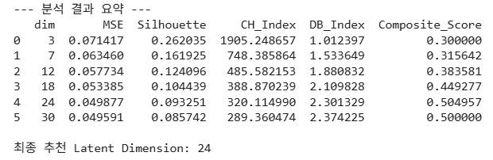

---

## 3.1.17 심화 과제
<!-- 슬라이드 129~130 -->

### 심화 과제 3-1 — Conv AE에 bottleneck 추가하기

실습 3.1.3의 Conv AE에 bottleneck layer를 추가하여 3d latent dim을 갖도록 수정한다. 그리고 실습 3.1.2의 3d latent dim 모델과 비교하여, 객관적인 성능 향상이 있는지 확인한다.

비교 항목은 네 가지다.

1. 3d latent space visualization 비교
2. Silhouette Scores (2D vs 3D) 비교
3. MSE Distribution 비교
4. Visualize Latent Interpolation (Narrow $z_0$ Sampling) 비교

**제출물** — 결과를 설명한 pdf 파일과, 실행 결과가 포함된 `.ipynb` 파일을 첨부하여 제출한다.

---

### 심화 과제 3-2 — 잠재 차원은 어떻게 선택되어야 하는가

**목적**

잠재 차원(latent dimension)을 단순한 hyperparameter가 아니라, **데이터 가설과 목적에 기반한 설계**로 이해한다.

**상황 설정**

동일한 데이터에 대해 다음 세 가지 목적 중 하나를 가진 AE를 설계해야 한다고 하자.

- (A) 데이터 구조 시각화 및 교육용 설명
- (B) 다운스트림 분류기를 위한 특징 추출
- (C) 이상 탐지(anomaly detection)

**요구사항**

1. 세 목적 (A)(B)(C)에 대해 각각 적절하다고 생각되는 잠재 차원의 크기 범위를 제시하고, 그 이유를 개념적으로 설명하라.
2. 데이터의 내재 차원(intrinsic dimensionality) 개념이 잠재 차원 선택과 어떻게 연결되는지 서술하라.
3. PCA 결과를 먼저 보는 전략이 왜 합리적인 출발점인지, 그리고 왜 종착점이 될 수 없는지 함께 설명하라.
4. 잠재 차원이 너무 작을 때와 너무 클 때, 잠재 공간에서 관찰되는 구조가 어떻게 달라질지 비교 설명하라.

---

## 3.1.18 정리
<!-- 슬라이드 99~138 요약 -->

> **정리**
> - 기존 차원 축소 기법은 관측 공간에 이미 정의된 관계를 보존하며 재배치할 뿐이지만, 딥러닝은 **표현 함수 자체를 학습**하므로 새 데이터도 forward pass 한 번으로 일관되게 투영된다.
> - **표현 공간 > 잠재 공간 > 잠재 표현** 의 포함 관계를 갖는다. 표현 공간은 모델 내부 좌표계, 잠재 공간은 숨은 구조를 담도록 학습된 표현 공간, 잠재 표현은 그 안의 개별 벡터다.
> - Autoencoder는 encoder $E$, latent code $z$, decoder $D$ 로 구성되며, $\hat{x} = D(E(x))$ 의 재구성 오차를 최소화하도록 학습한다. 손실은 데이터 성격에 따라 MSE, BCE, CE 중에서 고른다.
> - Latent space는 manifold 자체가 아니라 **복원 가능성을 기준으로 manifold를 재좌표화한 학습된 좌표계**다. AE는 구조를 강제하지 않고, 이미 데이터 안에 있는 구조가 보이는 좌표계를 재구성할 뿐이다.
> - 잠재 공간의 품질은 Silhouette Score, 샘플별 MSE 분포, 보간 결과의 연속성으로 정량 진단한다. 정보이론의 데이터 처리 부등식 $I(X;\hat{X}) \le I(X;Z)$ 는 잠재 차원을 줄이면 재구성 품질이 함께 제한되는 이유를 설명한다.
