# 3.2 분포 표현과 VAE

**학습 목표**

- 판별 모델과 생성 모델, 잠재변수 모델의 관계를 구분하고 각 모델이 무엇을 기술하는지 설명할 수 있다.
- 점 표현(point representation)과 분포 표현(distributional representation)의 차이를 설명하고, 오토인코더가 왜 엄밀한 의미의 잠재변수 모델이 아닌지 논증할 수 있다.
- 가능도, 사후확률, 증거의 관계를 정리하고 변분추론(variational inference)이 필요한 이유를 설명할 수 있다.
- 엔트로피에서 KL 발산까지의 유도를 따라가고, ELBO를 직접 유도하여 VAE의 손실함수가 재구성 오차와 KL 정규화 항으로 분해되는 과정을 설명할 수 있다.
- 재매개변수화 트릭이 왜 필요한지 설명하고, β-VAE·Sigma-VAE가 두 손실의 균형을 어떻게 다루는지 비교할 수 있다.
- VAE를 데이터 구조를 해석하는 도구로 사용하여 잠재공간의 군집·연속성·중첩·모호성을 읽어낼 수 있다.

**이 절의 구성**

- 3.2.1 판별 모델과 생성 모델
- 3.2.2 잠재변수 모델에서 분포 표현으로
- 3.2.3 VAE의 구조와 분포 표현
- 3.2.4 사전분포 제약과 좋은 잠재공간
- 3.2.5 가능도, 사후확률, 그리고 변분추론
- 3.2.6 엔트로피와 KL 발산
- 3.2.7 하한과 ELBO
- 3.2.8 ELBO의 유도
- 3.2.9 VAE의 목적과 손실함수
- 3.2.10 재매개변수화 트릭
- 3.2.11 비용함수의 구성
- 3.2.12 두 손실의 균형: β-VAE와 Sigma-VAE
- 3.2.13 Denoising AE, Denoising VAE, 그리고 Diffusion
- 3.2.14 VAE를 직접 만든다
- 3.2.15 3차원 잠재공간과 변수 붕괴
- 3.2.16 β의 자동 최적화를 확인한다
- 3.2.17 레이블 y와 잠재변수 z의 관계
- 3.2.18 준지도 VAE
- 3.2.19 심화 과제
- 3.2.20 정리

> 실습 번호는 강의 슬라이드의 번호를 그대로 쓴다. 소절 번호와는 무관하다.

---

## 3.2.1 판별 모델과 생성 모델
<!-- 슬라이드 139~141 -->

### 두 모델이 학습하는 대상

딥러닝 모델은 무엇을 학습하느냐에 따라 크게 두 계열로 나뉜다. 하나는 **판별 모델(discriminative model)** 이고 다른 하나는 **생성 모델(generative model)** 이다. 이 구분은 알고리즘의 차이라기보다 **모델이 데이터의 어느 측면을 붙잡으려 하는가**의 차이다.

판별 모델은 주로 지도학습으로 학습한다. 입력 데이터에서 클래스를 구분하는 **결정 경계**를 학습하며, 관심은 레이블의 분포를 포착하는 데 집중되어 있다. 판별 모델에게 데이터란 경계를 긋기 위한 재료이며, 경계 바깥의 구조는 관심 대상이 아니다.

생성 모델은 주로 비지도학습 또는 자기지도학습으로 학습한다. 생성 모델은 입력 데이터의 **분포 자체를 심층적으로 분석**하며, 입력 데이터와 레이블의 결합 확률 분포를 학습하고 이해한다. 그 결과 생성 모델은 데이터 내의 복잡한 패턴과 구조를 들여다볼 수 있는 **창(window)** 을 제공한다. 나아가 창의적인 데이터 합성과 생성, 증강까지 가능해진다.

이 강의에서 생성 모델에 주목하는 이유는 그림을 잘 그리기 위해서가 아니다. 생성 모델이 데이터의 구조를 드러내는 창이기 때문이다.

### 생성 모델에 잠재변수를 결합하면

생성 모델에 **잠재변수 모델(latent variable model)** 을 결합하면, 잠재변수 $z$ 로부터 학습 데이터 분포와 유사한 데이터를 생성하는 구조가 만들어진다. 이 구조를 이루는 요소는 다음과 같다.

- $p(x)$ : 실제 데이터의 분포. 그림에서 검은 점으로 찍힌 것이 실제 데이터 포인트다.
- $\hat{p}(x)$ : 모델이 생성한 데이터의 분포.
- $z$ : 표준정규분포를 따르는 잠재변수.
- $g_\theta$ : $z$ 에서 샘플링한 값을 받아 $\hat{p}(x)$ 를 만들어 내는 생성기.

학습이란 이 구조에서 $\theta$ 를 변경하여

$$\hat{p}(x) \;\longrightarrow\; p(x)$$

즉 생성된 데이터의 분포 $\hat{p}(x)$ 가 실제 데이터의 분포 $p(x)$ 와 일치하도록 만드는 과정이다.

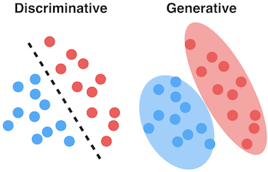

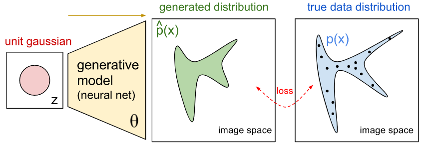

### 생성 모델과 잠재변수 모델은 같은 말이 아니다

생성 모델과 잠재변수 모델은 자주 함께 쓰이지만 같은 개념이 아니다. 둘은 서로 다른 축이다.

**생성 모델**은 데이터가 어떻게 생성되는지를 모델링한다. 관측 데이터 $x$ 의 분포 $p(x)$ 자체, 또는 데이터의 생성 확률 구조 $p(x, y)$ 를 기술한다.

**잠재변수 모델**은 관측되지 않는 숨은 변수 $z$ 를 통해 데이터를 설명한다. 일반적인 형태는 다음과 같다.

$$p(x, z) = p(z)\, p(x \mid z)$$

이 식은 "관측 데이터 $x$ 에는 잠재 요인(숨겨진 본질적 속성) $z$ 가 있으며, $x$ 는 $z$ 로부터 생성된다"는 가정을 담고 있다.

두 축을 교차시키면 네 가지 조합이 나온다.

**생성 + 잠재변수** — GMM(Gaussian Mixture Model), HMM, 요인분석(Factor Analysis), VAE가 여기에 속한다. 일반적인 잠재변수 모델 $p(x,z)=p(z)p(x \mid z)$ 에서 $x$ 의 분포는

$$p(x) = \int p(x, z)\, dz = \int p(z)\, p(x \mid z)\, dz$$

로 얻어지므로, 잠재변수 모델은 그 자체로 생성 모델이 된다.

**생성 + 비잠재변수** — 자기회귀 언어 모델(GPT 계열), PixelCNN 계열이 여기에 속한다. 자기회귀 모델은

$$p(x) = \prod_{t=1}^{T} p(x_t \mid x_{<t})$$

처럼 잠재 변수 없이 직접 $p(x)$ 를 분해한다.

**비생성 + 잠재변수** — $p(y \mid x, w)$ 형태의 모델과 latent SVM 계열이 여기에 속한다. 잠재 구조를 쓰기는 하지만 $p(x)$ 를 모델링하지는 않는다.

**비생성 + 비잠재변수** — 판별 모델 계열과 비판별 알고리즘 계열이 여기에 속한다. 판별 모델 $p(y \mid x)$ 계열에는 로지스틱 회귀, 일반적인 분류기, 표준 회귀 모델이 있고, 비판별 알고리즘 계열에는 k-means, k-NN, PCA, 전통적인 feature transform 등이 있다.

---

## 3.2.2 잠재변수 모델에서 분포 표현으로
<!-- 슬라이드 142~143 -->

### 잠재변수 모델과 분포 표현의 차이

잠재변수 모델은 "데이터는 숨은 변수 $z$ 로 설명 가능하다, 즉 $z$ 로부터 생성된다"는 명제를 $p(x,z)=p(z)p(x \mid z)$ 로 형식화한 것이다.

**분포 표현(distributional representation)** 은 여기서 한 걸음 더 나아간다. "데이터는 숨은 변수 $z$ 의 **분포 표현**으로 설명 가능하다"는 관점이며, 기호로는

$$q(z \mid x)$$

로 쓴다. 이는 **점 표현(point representation, latent vector)**

$$z = f(x)$$

와 대비된다. 점 표현은 데이터 하나를 잠재공간의 한 좌표에 대응시키고, 분포 표현은 데이터 하나를 잠재공간의 한 **확률분포**에 대응시킨다. 분포 표현은 잠재변수 모델의 학습 결과를 해석한 것이라고 볼 수 있다.

### 오토인코더는 잠재변수 모델이 아니다

이 구분에서 중요한 결론이 하나 나온다.

> **핵심 주장**
> AE는 잠재변수 모델이 아니다.

오토인코더(AE)는 데이터를 잠재 벡터(latent vector)에 매핑한다. 즉 데이터를 잠재공간의 **점**으로 표현한다. 그런데 통계학에서 변수(variable)라는 말에는 **확률적 샘플링이 가능하다**는 전제가 깔려 있다. AE의 $z$ 공간에서 임의로 샘플링하는 행위에는 그런 수학적 근거가 없다. AE는 잠재공간(latent space)을 갖고, 잠재 코드(latent code)라는 잠재 표현(latent representation)을 갖지만, 엄밀하게는 잠재변수 모델이 아니다. 넓은 의미에서 잠재변수 모델로 분류하는 경우는 있다.

반면 VAE는 데이터를 **잠재 분포(latent distribution)** 에 매핑한다. 데이터를 분포로 표현하므로 샘플링에 근거가 생기고, 따라서 진정한 의미의 잠재변수 모델에 속한다.

> **생각해 볼 질문**
> AE의 입력에 노이즈를 섞어서 학습하면(Denoising AE) 어떻게 될까? AE가 분포를 학습할 수 있을까? 그러면 잠재변수 모델이 될까? VAE와는 무엇이 다를까?
> — 이 질문의 답은 3.2.13에서 다시 다룬다.

### 오토인코더의 한계

점 표현이 만들어 내는 문제는 학습된 잠재공간의 모양에서 직접 관찰된다. AE는 잠재공간에 데이터를 **비대칭적으로 매핑**한다.

MNIST를 예로 들면 클래스별 분포의 불균형이 그대로 드러난다. 넓게 퍼진 분포와 좁게 뭉친 분포가 한 공간에 혼재한다. 그 결과 데이터가 전혀 배치되지 않은 **빈 공간(hole)** 이 발생한다. 빈 공간에서 잠재 좌표를 하나 뽑아 디코딩하면, 그 자리에는 학습 근거가 없으므로 **디코딩 결과의 품질이 낮다.**


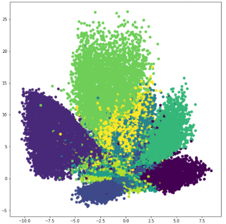

이 문제를 **Variational Autoencoder** 로 개선한다. 그리고 개선의 부산물로, 분포 표현을 통해 **데이터의 불확실성까지 모델링**할 수 있게 된다.

---

## 3.2.3 VAE의 구조와 분포 표현
<!-- 슬라이드 144~146 -->

### Variational Autoencoder의 구조

Variational AE는 학습을 통해 데이터를 잠재공간에서 **확률분포로 구조화**한다. 구성 요소는 세 부분이다.

- **Encoder** : 데이터를 잠재공간의 분포 표현 $q(z \mid x)$ 로 인코딩한다.
- **Latent vector** : 인코딩된 분포에서 샘플링된 잠재 표현 $z$ 다. 데이터의 주요 특징 정보를 담는다.
- **Decoder** : 잠재 벡터를 자연스럽고 일관된 관측공간 데이터로 복원하거나 생성한다.

정리하면 두 모델의 구조적 차이는 가운데 한 칸에서 갈린다.

- **Basic AE** : Encoder + single point vector + Decoder
- **VAE** : Encoder + Latent distribution ( + sampling ) + Decoder


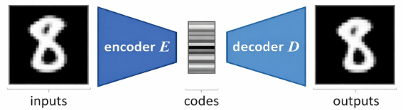

### 분포 표현이란 무엇인가

분포 표현은 데이터를 확률분포로 잠재공간에 매핑하는 것, 즉 **특징을 분포로 표현**하는 것이다. 단일 점 벡터로는 데이터의 애매한 정보를 표현할 수 없기 때문이다.

같은 6차원 잠재공간이라도 단일 점 벡터 표현은 각 축마다 값 하나를 찍는 데 그치지만, 분포 표현은 각 축마다 하나의 분포를 얹는다. 분포의 중심은 그 특징의 대표값이고, 분포의 폭은 그 특징에 대해 모델이 얼마나 확신하는지를 나타낸다.

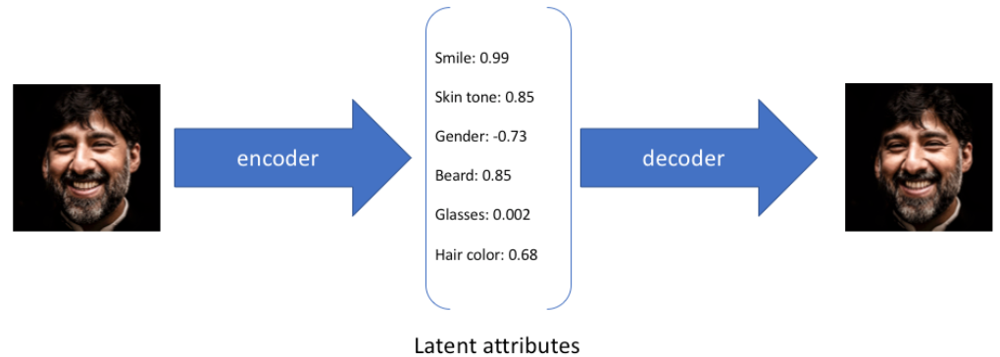

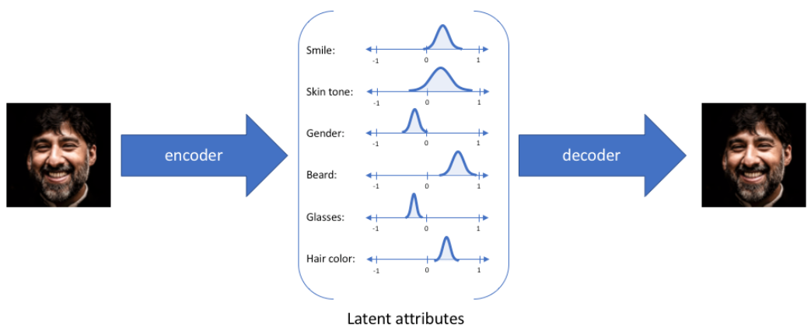

*그림 3-1. 점 표현과 분포 표현. 분포의 폭이 그 특징에 대한 모델의 확신 정도를 담는다.*

### 분포 표현이 필요한 이유

애매한 특징은 예외적인 사건이 아니라 **모든 데이터의 기본 속성**이다.

어떤 입력 $x$ 는 하나의 잠재 좌표에 매핑되기보다 **여러 잠재 상태와 양립**될 수 있다. 특히 노이즈가 섞여 있거나, 일부만 관측되었거나, 클래스 경계가 애매하거나, 동일한 관측에 대해 복수의 해석이 가능한 경우에는 더욱 그렇다. 이런 데이터에 대해 하나의 점 표현을 부여하는 것은 **과도하게 단정적인 표현**이다.

분포 표현은 "이 데이터가 어디에 속하는가?"라는 질문에 단일한 답 대신 **가능한 영역**으로 답한다. 그리고 "이 데이터가 어떤 확률분포에서 생성되었는가?"를 알 수 있게 한다.

> **정의 — 분포 표현**
> 각 데이터 $x$ 를 잠재공간에서 하나의 점 $z$ 가 아니라 확률분포 $q(z \mid x)$ 로 나타내어, 데이터의 불확실성까지 구조적으로 포함하는 표현 방식.

### q(z|x)의 형태

$q(z \mid x)$ 는 입력 $x$ 에 해당하는 잠재 코드 위치의 표현이다. VAE에서는 이 분포를 대각 공분산을 갖는 정규분포로 놓는다.

$$q_\phi(z \mid x) = \mathcal{N}\!\left(z;\; \mu(x),\; \mathrm{diag}\!\left(\sigma^2(x)\right)\right)$$

잠재공간이 다차원 공간이므로 인코더는 각 축에 대한 평균값들의 벡터 $\mu(x)$ 와 대각 공분산 값들의 벡터 $\mathrm{diag}(\sigma^2(x))$ 를 출력한다. 즉 인코더의 출력은 잠재 코드 하나가 아니라 잠재 분포의 **모수 두 벌**이다.

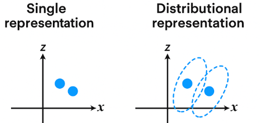

여기서 $\sigma^2$ 의 해석에 주의가 필요하다. $\sigma^2$ 는 현실의 물리적 불확실성을 측정한 값이 아니다. **모델이 입력을 잠재공간에 어떻게 배치하는지**를 의미한다. 이 값에는 관측 노이즈, 클래스 경계의 애매함, 잠재공간에서의 중첩 가능성, 모델의 구조적 제약이 함께 반영되어 있다.

> **주의**
> $\sigma^2$ 는 해석 가능한 구조적 분산일 뿐, 진실은 아니다.

---

## 3.2.4 사전분포 제약과 좋은 잠재공간
<!-- 슬라이드 147~149 -->

### prior를 N(0, I)로 가정한다

VAE의 분포 표현에는 한 가지 제약이 붙는다. 잠재변수의 **사전분포(prior)** $p(z)$ 를 표준정규분포 $\mathcal{N}(0, I)$ 로 가정하는 것이다.

VAE는 $q(z \mid x)$ 를 학습하는 동시에, 그 분포가 사전분포 $p(z)=\mathcal{N}(0,I)$ 에 가까워지도록 학습한다. 이렇게 하면 서로 다른 데이터들이 잠재공간에 **연속적이고 비교적 정돈된 방식으로 배치**된다. 정리하면 VAE는 분포 표현이 가능할 뿐 아니라, 그 **분포들의 전체 구조를 정렬**할 수도 있다.

### 왜 prior 제약이 필요한가

인코더가 출력하는 $q(z \mid x)$ 는 데이터마다 하나씩 만들어진다. 데이터가 $N$ 개면 분포도 $N$ 개다. 이 분포들의 전체 구조를 통제하는 장치가 KL 손실이다.

$$D_{KL}\!\left(q(z \mid x)\,\big\|\,p(z)\right)$$

이 손실 항이 개별 분포들을 표준정규분포 쪽으로 유도한다. 그 결과 잠재공간 전체의 질서가 유지된다. 구체적으로는 분포의 대칭성, 값 범위의 제한, 구조적 배치가 확보된다.

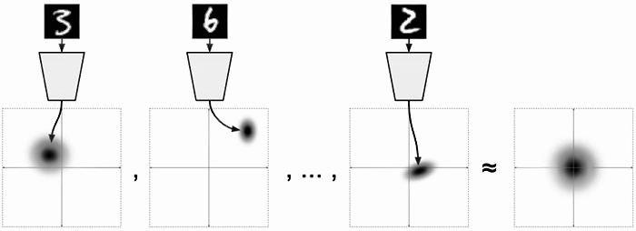

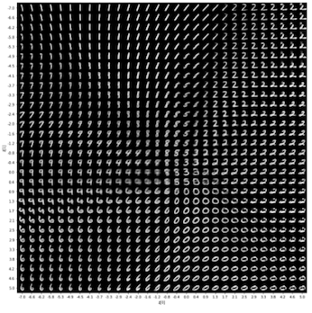

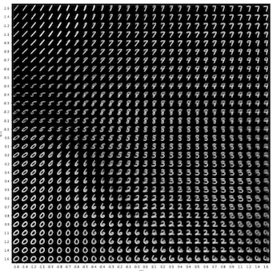

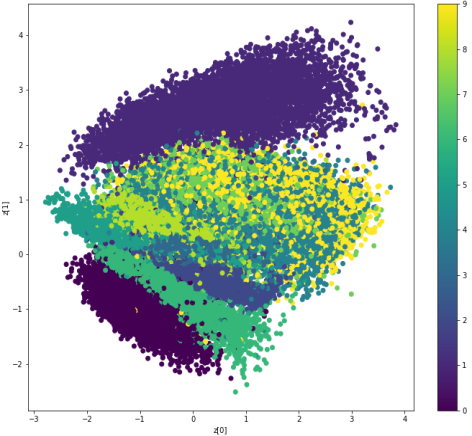

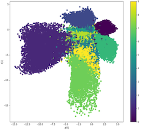

### 잠재공간이 연속적이고 정돈된다는 의미

잠재공간이 "연속적이고 정돈되었다"는 표현은 다음 네 가지를 뜻한다.

첫째, 잠재공간이 **연속적이고 매끄러워진다.** 여기에는 KL 손실 항이 작용한다.

둘째, **잠재 보간(latent interpolation)** 이 가능해진다. 데이터 사이의 중간 상태를 해석할 수 있다는 뜻이다.

셋째, 클러스터 간 경계가 단절된 점의 이웃이 아니라 **확률적 전이 영역**으로 보이게 된다.

넷째, 그 결과 데이터가 정말 이산적으로 나뉘는지, 아니면 연속적으로 변하는지를 분석하고 해석할 수 있게 된다.

잠재 보간이 가능해지면 두 가지 이득이 따라온다. 잠재공간 보간은 **생성 가능성**과 **구조적 일관성**을 동시에 확보해 주며, 구조의 연속성·중첩·애매한 경계를 더 쉽게 관찰할 수 있는 공간을 제공하므로 **해석이 용이해진다.**

### Distributional 과 Distributed 는 다른 말이다

용어 하나를 구분해 둘 필요가 있다. 발음이 비슷하지만 가리키는 바가 다르다.

| 용어 | 우리말 | 무엇을 가리키는가 |
|---|---|---|
| Distributional | 분포형·분포적 | **의미가 어떻게 포착되는지** — 주변 정보의 분포에 기반한다 |
| Distributed | 분산형 | **정보가 어떻게 저장되는지** — 벡터의 여러 차원에 분산되어 있다 |

대부분의 단어 임베딩은 분포형이자 분산형이다.

### 좋은 잠재공간의 조건

좋은 잠재공간이란 **데이터 구조를 해석 가능하게 조직하는 공간**이다. 네 가지 조건으로 정리할 수 있다.

- **연속성(smoothness)** : 가까운 $z$ 는 비슷한 데이터를 복원해야 한다.
- **구조 보존(structured organization)** : 비슷한 데이터는 잠재공간에서 가까이 위치해야 한다.
- **의미 있는 변화 방향(interpretable variation)** : 한 방향으로의 이동이 데이터의 일관된 변화를 유도하면 해석이 쉬워진다. 표정 변화, 회전, 두께, 밝기 등이 그런 예다.
- **생성 가능성(generatability)** : 사전분포 $p(z)$ 에서 샘플링한 $z$ 가 그럴듯한 데이터를 생성해야 한다.

이상적인 잠재 순회(latent traversal)에서는 한 축을 변화시킬 때 하나의 의미 있는 속성만 변한다. 예를 들어 $z_1$ 을 변화시키면 **웃음의 정도(degree of smile)** 가 바뀌고, $z_0$ 을 변화시키면 **머리의 방향(head pose)** 이 바뀌는 식이다.

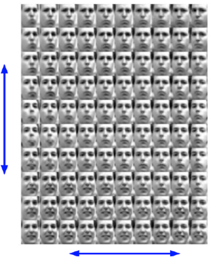

> **주의**
> 잠재 차원 하나가 현실적 의미와 정확히 대응하는 것은 보장되지 않는다.

---

## 3.2.5 가능도, 사후확률, 그리고 변분추론
<!-- 슬라이드 150~153 -->

### 가능도(Likelihood)

VAE의 손실함수로 들어가기 전에 확률론 용어 몇 개를 정리해 둔다.

먼저 **가능도 기여도**다. 데이터 $x_i$ 하나가 어떤 분포에 대해 갖는 기여도는, 연속확률밀도함수(PDF)에서는 그 데이터 위치에서 곡선까지 세운 점선의 **높이**이고, 이산 확률질량함수(PMF)라면 그 값의 **확률**이다.

**가능도(likelihood)** 는 $\mathcal{L}(\cdot)$ 또는 $L(\cdot)$ 로 표기하며, 다음과 같이 정의한다.

$$\mathcal{L}(\theta \mid x) = P(x \mid \theta) = \prod_{k=1}^{n} P(x_k \mid \theta)$$

이는 **지금 얻은 데이터가 $\theta$ 분포로부터 나왔을 가능성**을 뜻한다. 계산 절차로 읽으면, 데이터 샘플 각각에서 $\theta$ 분포의 높이(가능도 기여도)를 찾고, 그것을 전부 곱한 것이다.

곱은 다루기 어려우므로 로그를 취해 **로그 가능도(log-likelihood)** 를 쓴다.

$$l(\cdot) = \log \mathcal{L}(\cdot) = \log L(\cdot)$$

$$l(\theta \mid x) = \log \mathcal{L}(x \mid \theta) = \log P(x \mid \theta) = \sum_{i=1}^{n} \log P(x_i \mid \theta)$$

곱이 합으로 바뀌었다. 문헌에 따라 $L(\cdot) = \mathcal{L}^{*}(\cdot) = \log \mathcal{L}(\cdot)$ 처럼 표기하기도 한다.

**최대가능도추정(Maximum Likelihood Estimation, MLE)** 은 이 가능도를 최대로 만드는 모수를 찾는 것이다.

$$\hat{\theta} = \operatorname*{arg\,max}_{\theta} \; \mathcal{L}(\theta)$$

정규분포의 경우 $\theta = (\mu, \sigma)$ 이고, 해는 익숙한 형태로 떨어진다.

$$\hat{\mu} = \frac{1}{n}\sum_{i=1}^{n} x_i, \qquad \hat{\sigma}^2 = \frac{1}{n}\sum_{i=1}^{n}\left(x_i - \mu\right)^2$$

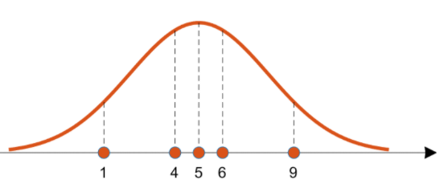

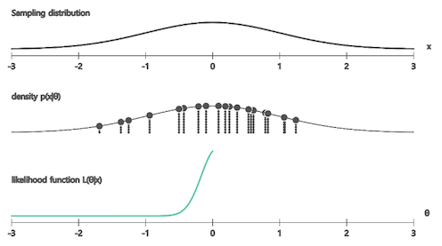

### 사후확률(Posterior)과 베이즈 규칙

**사후확률(posterior)** 은 관찰(입력 데이터)을 통해 결과(그것이 어떤 것인지)의 확률을 찾는 것, 즉 **추론**이다. 여기에 두 가지 개념이 함께 등장한다.

- **사전확률(prior)** : 관찰 전에 주어져 있는 선험적 확률.
- **가능도(likelihood)** : 어떤 것(대상 또는 분포)에서 해당 관찰(입력 데이터)이 나올 가능성.

커튼 뒤에 철수가 있을 확률을 예로 들면 세 개념이 이렇게 대응한다.

- 사후확률 : $P(\text{철수} \mid \text{관찰})$ — 관찰이 철수일 확률
- 가능도 : $P(\text{관찰} \mid \text{철수})$ — 철수일 때 그 관찰이 나타날 가능도
- 사전확률 : $P(\text{철수})$ — 철수가 나타날 선험적 확률

이 셋을 잇는 것이 **베이즈 규칙(Bayes' rule)** 이다.

$$p(\text{철수} \mid \text{관찰}) = \frac{p(\text{관찰} \mid \text{철수})\,P(\text{철수})}{p(\text{관찰})} = \frac{\text{likelihood} \times \text{prior}}{\text{관찰이 나타날 확률}}$$

기호를 잠재변수로 바꾸면 우리가 원하는 형태가 된다.

$$p(z \mid x) = \frac{p(x \mid z)\,P(z)}{p(x)} = \frac{\text{likelihood} \times \text{prior}}{P(\text{관찰})} \;\propto\; \text{likelihood} \times \text{prior}$$

분모 $p(x)$ 를 상수로 볼 수 있다면 사후확률은 가능도와 사전확률의 곱에 비례한다.

일반적인 딥러닝에서는 사전확률을 거의 사용하지 않는다. 대부분 모르기 때문이다. 그래서 실무에서는 posterior $\propto$ likelihood 로 두고, **최대가능도추정을 통해 사후확률을 학습**한다.


### VAE에서 무엇이 문제가 되는가

VAE에서 정답 분포 표현은 $p(z \mid x)$ 다. 이것을 알려면 베이즈 규칙의 분모 $p(x)$ 를 알아야 한다. 그런데 $p(x)$ 는 다음과 같이 정의된다.

$$p(x) = \int P(x \mid z)\, P(z)\, dz$$

$z$ 의 차원이 높아지면 이 적분을 계산하는 것이 사실상 불가능하다. 그래서 다른 길을 택한다. $p(z \mid x)$ 를 정확히 구하는 대신, 다루기 쉬운 분포 $q(z \mid x)$ 로 **직접 근사**하는 접근을 쓴다. 이것이 **변분추론(Variational Inference)** 이다.

### 변분추론의 필요성

정리하면 이렇다. 정답 사후확률 $p(z \mid x)$ 를 찾는 것은 어렵고, 직접 계산도 어렵다. 그 대신,

- 인코더는 $p(z \mid x)$ 를 대신할 **근사 사후확률** $q(z \mid x)$ 를 학습한다.
- $q(z \mid x)$ 에서 샘플링한 $z$ 를 사용해 데이터를 복원하거나 생성한다.

> **VAE의 한 줄 정의**
> VAE는 변분추론을 이용해 잠재 분포를 근사하는 생성 모델이다. 즉 **계산이 어려운 사후확률 $p(z \mid x)$ 를 인코더의 $q(z \mid x)$ 로 근사하는 모델**이다.

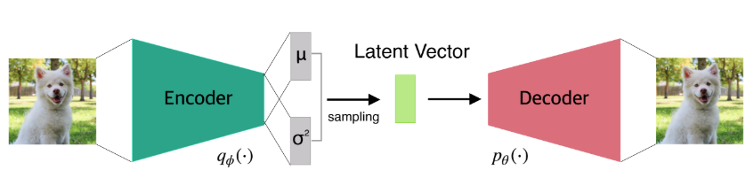

### 변분추론이 실제로 하는 일

변분추론이란 **복잡한 분포를 더 간단한 분포를 이용해서 근사하는 것**이다. 우리가 알고 싶은 $P(z \mid x)$ 에 $Q(z \mid x)$ 가 가깝도록 만들자는 발상이다.

여기서 $Q(z \mid x)$ 를 정규분포로 놓으면 문제가 크게 단순해진다. 임의의 함수 형태를 찾는 대신 **정규분포의 모수만 바꾸어 근사**하면 되기 때문이다. 복잡한 모양의 $P(z \mid x)$ 를 근사하기 위해 정규분포 $Q(z \mid x)$ 는 $\mu$ 와 $\sigma$ 두 개만 조정하면 된다.

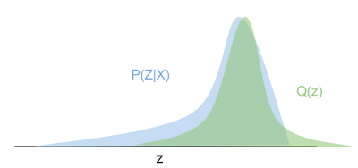

*그림 3-2. 변분추론. 근사 분포의 모수를 조정하며 목표 분포에 다가간다. (출처: https://blog.evjang.com/2016/08/variational-bayes.html)*

그렇다면 두 분포의 유사도는 어떻게 측정할까? **KL 발산 $D_{KL}$** 을 사용한다.

---

## 3.2.6 엔트로피와 KL 발산
<!-- 슬라이드 154~156 -->

### 엔트로피

**엔트로피(entropy)** 는 정보량의 기대값, 즉 평균 정보량이다. 무질서도 또는 불확실성이라고도 부른다.

출발점은 정보량의 정의다. 확률이 적은 사건 $p$ 의 발생은 놀라운 일, 즉 정보량이 많은 일이다. 따라서 정보량은 발생 확률과 반비례한다. 기호로 쓰면 $1/p$ 다.

여기에 로그가 왜 붙는지도 근거가 있다. 독립사건의 발생 확률은 곱으로 결합되는데, 두 사건의 정보량은 합으로 결합되어야 자연스럽다. 곱을 합으로 바꾸는 연산이 로그이므로

$$\log\!\left(\frac{1}{p}\right) = -\log(p) \quad : \text{자기정보량}$$

이 된다. 모든 사건에 대해 이 자기정보량의 평균(기대값)을 취한 것이 엔트로피다.

$$H(p) = \sum_i p_i \log\!\left(\frac{1}{p_i}\right) = -\sum_i p_i \log(p_i)$$

유도 과정을 한 줄로 늘어놓으면 다음과 같다.

$$\text{정보량} \Rightarrow \frac{1}{p} \Rightarrow \log\!\left(\frac{1}{p}\right) \Rightarrow \sum_i p_i \log\!\left(\frac{1}{p_i}\right) \Rightarrow -\sum_i p_i \log(p_i) = H(p) = \text{Entropy}$$

로그의 밑으로는 보통 자연로그 $\ln$ 을 쓴다. 정규분포 표현, 미분의 단순화, KL 계산의 단순화라는 세 가지 이유 때문이다.

### KL 발산

**KL 발산(Kullback-Leibler Divergence)** 은 **정보 손실량의 기대값**이다.

받은 정보 $q$ 와 보낸 정보 $p$ 사이의 정보량 차이, 즉 정보의 손실량을 $\Delta_i$ 라 하자. 이 $\Delta_i$ 의 기대값을 $D_{KL}$ 이라 한다.

$$\Delta_i = -\log(q_i) + \log(p_i)$$

$$\mathbb{E}(\Delta_i) = \sum_i p_i \Delta_i = -\sum_i p_i \log(q_i) + \sum_i p_i \log(p_i) = D_{KL}(p \,\|\, q)$$

이 식이 변분추론과 곧바로 연결된다.

- $p$ 의 분포를 추정한다는 것은 **$q$ 의 모수를 수정해 가면서 $D_{KL}$ 이 최소가 되게 하는 것**이다.
- 다시 말해, **알고 있는 $q$ 로 모르는 $p$ 를 설명한다.** 이것이 변분추론이다.

### 교차 엔트로피

**교차 엔트로피(Cross Entropy)** 는 분포 $p$ 와 $q$ 의 관계를 $D_{KL}$ 로 표현했을 때, 분포 $p$ 를 분포 $q$ 로 설명할 때의 평균 정보량이다.

위의 $D_{KL}$ 식에서 뒷항 $\sum_i p_i \log p_i$ 는 $q$ 와 무관하다. 따라서 $q$ 를 최적화할 때는 **앞 항만 최소화**시키면 된다. 이 관계는

$$D_{KL}(p \,\|\, q) = H(p, q) - H(p)$$

로 정리된다. 여기서 앞 항이 바로 교차 엔트로피다.

$$H(p, q) = -\sum_i p_i \log(q_i)$$

다르게 표현하면 다음과 같다.

$$H(p, q) = -\mathbb{E}_p\!\left[\log(q)\right] = H(p) + D_{KL}(p \,\|\, q)$$

이 마지막 식은 **교차 엔트로피 = 송신 정보량 + 정보 손실량** 이라는 해석을 준다. 즉 $H(p)$ 를 송신 엔트로피, $H(p,q)$ 를 수신 엔트로피로 놓고, 그 차이가 KL 발산이라고 읽을 수 있다.

### forward KL 과 reverse KL

KL 발산은 수신 정보량과 송신 정보량의 기대값 차이다. 두 분포가 같으면 0이고 분포가 다를수록 커진다. 그런데 이 값은 **작은 $q$ 에 예민**하다는 성질이 있고, 그 때문에 인자의 순서가 중요해진다.

- $D_{KL}(p \,\|\, q)$ : **forward KL**. $q$ 가 작을 때 $p$ 도 작을 것을 요구한다.
- $D_{KL}(q \,\|\, p)$ : **reverse KL**. $p$ 가 작을 때 $q$ 도 작을 것을 요구한다. **VAE에서 사용하는 구조**다.

forward KL을 사용하는 생성 모델로는 Normalizing Flow가 있으며, reverse KL 쪽에서는 **모드 탐색(mode seeking)** 현상이 발생한다. 근사 분포가 목표 분포의 봉우리 하나에 몰리는 현상이다.

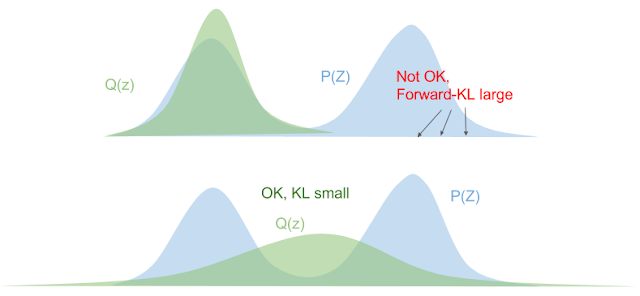

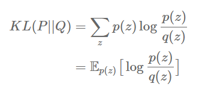

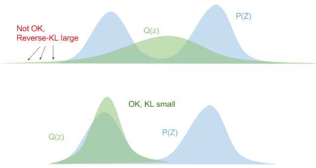

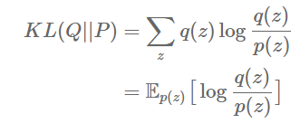

한편 GAN에서는 **JS 발산(Jensen-Shannon Divergence)** 을 사용한다. 두 KL을 대칭적으로 섞은 형태다.

$$D_{JS}(p \,\|\, q) = \frac{1}{2} D_{KL}\!\left(p \,\Big\|\, \frac{p+q}{2}\right) + \frac{1}{2} D_{KL}\!\left(q \,\Big\|\, \frac{p+q}{2}\right)$$

### KL 발산의 계산

앞에서 얻은 관계를 이산형과 연속형으로 나란히 써 보면 다음과 같다.

$$D_{KL}(p \,\|\, q) = H(p,q) - H(p) = -\sum_i p_i \log(q_i) + \sum_i p_i \log(p_i)$$

$$= -\int p(x) \log q(x)\, dx + \int p(x) \log p(x)\, dx$$

KL 발산의 두 가지 기본 성질은 다음과 같다.

- 두 분포가 같으면 0, 다르면 값이 커진다 : $D_{KL}(p \,\|\, q) \geq 0$
- 순서가 바뀌면 값이 변한다 : $D_{KL}(p \,\|\, q) \neq D_{KL}(q \,\|\, p)$

두 분포가 모두 정규분포일 때는 적분을 닫힌 형태로 계산할 수 있다. $p(x) = \mathcal{N}(\mu_1, \sigma_1)$, $q(x) = \mathcal{N}(\mu_2, \sigma_2)$ 이고

$$\mathcal{N}(\mu, \sigma) = \frac{1}{\sqrt{2\pi\sigma^2}}\, e^{-\frac{(x-\mu)^2}{2\sigma^2}}$$

일 때,

$$D_{KL}(p \,\|\, q) = -\int p(x)\log q(x)\, dx + \int p(x)\log p(x)\, dx$$

$$= \frac{1}{2}\log\!\left(2\pi\sigma_2^2\right) + \frac{\sigma_1^2 + (\mu_1 - \mu_2)^2}{2\sigma_2^2} - \frac{1}{2}\left(1 + \log 2\pi\sigma_1^2\right)$$

$$= \log\!\left(\frac{\sigma_2}{\sigma_1}\right) + \frac{\sigma_1^2 + (\mu_1 - \mu_2)^2}{2\sigma_2^2} - \frac{1}{2}$$

### VAE에서의 KL 항

VAE에서는 $q$ 가 정규분포이고 $P(z)$ 를 표준정규분포로 가정하므로, 위 공식에 $\mu_2 = 0$, $\sigma_2 = 1$ 을 대입하면 된다.

$$D_{KL}\!\left(q(z \mid x) \,\big\|\, P(z)\right) = D_{KL}\!\left(\mathcal{N}(\mu_1, \sigma_1^2) \,\big\|\, \mathcal{N}(0, 1)\right)$$

$$= \sum_i \left[ -\log \sigma_{1_i} + \frac{1}{2}\left(\sigma_{1_i}^2 + \mu_{1_i}^2 - 1\right) \right]$$

$$= -\frac{1}{2}\sum_i \left(1 + \log \sigma_{1_i}^2 - \sigma_{1_i}^2 - \mu_{1_i}^2\right)$$

이 마지막 형태가 구현 코드에 그대로 들어가는 식이다. 인코더가 내놓은 $\mu$ 와 $\log \sigma^2$ 만 있으면 적분 없이 계산된다. **VAE의 KL 항이 닫힌 식으로 떨어지는 것은 prior를 표준정규분포로 잡았기 때문**이다.

---

## 3.2.7 하한과 ELBO
<!-- 슬라이드 157~159 -->

### 상한과 하한이라는 도구

**하한(lower bound)** 과 **상한(upper bound)** 은 특정 함수나 분포의 아래위 경계를 뜻한다. 정답 함수를 직접 계산할 수 없는 경우, 상한과 하한을 가이드로 삼아 정답에 근사할 수 있다.

VAE에서 우리가 최대화하고 싶은 것은 $\log p(x)$ 인데 이것을 직접 계산할 수 없다. 그래서 계산 가능한 하한을 하나 잡고, 그 하한을 밀어 올린다. 그 하한이 **ELBO(Evidence Lower BOund)** 다.

$$\log p(x) \;\geq\; \text{ELBO}$$

### ELBO를 키운다는 것의 의미 (1)

ELBO를 최대화하면 근사 분포 $q(z \mid x)$ 와 정답 분포 사이의 차이가 최소화된다. 그 근거는 다음의 항등식이다.

$$\log p(x) = D_{KL}\!\left(q(z \mid x) \,\big\|\, p(z \mid x)\right) + \text{ELBO}$$

좌변이 고정되어 있다고 보면 우변의 두 항은 시소 관계다.

$$\text{ELBO} \uparrow \quad \Longrightarrow \quad D_{KL}\!\left(q(z \mid x) \,\big\|\, p(z \mid x)\right) \downarrow$$

계산할 수 없는 $D_{KL}(q \| p(z \mid x))$ 를 직접 줄이는 대신, 계산할 수 있는 ELBO를 키우는 것으로 목적을 달성한다.

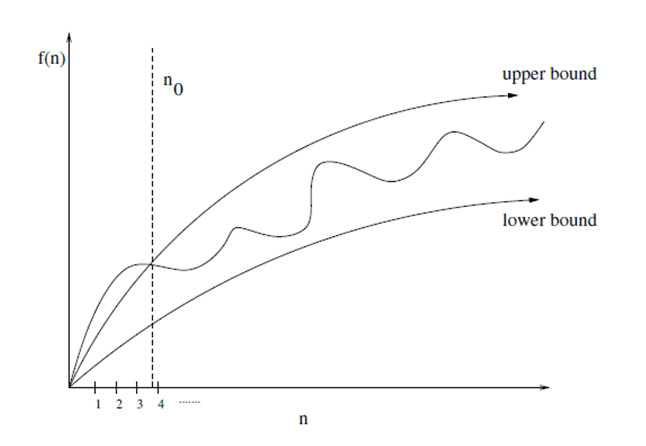

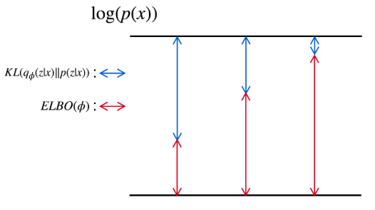

### ELBO를 키운다는 것의 의미 (2)

베이즈 규칙을 VAE의 기호로 다시 쓰면 다음과 같다.

$$q_\phi(z \mid x) = \frac{p_\theta(x \mid z)\, p(z)}{p_\theta(x)} \quad \longleftarrow \quad p(z \mid x) = \frac{p(x \mid z)\, p(z)}{p(x)}$$

여기서 중요한 차이가 하나 있다. VAE에서 $p(x)$ 는 상수가 아니라 **모수 $\theta$ 에 의존하는 $p_\theta(x)$** 다.

$$p_\theta(x) = \int p_\theta(x \mid z)\, p(z)\, dz$$

이 양을 **주변 가능도(marginal likelihood)** 또는 **증거(evidence, 주변우도)** 라 부른다. 적분 $\int p_\theta(x \mid z) p(z)\, dz$ 는 "잠재변수 $z$ 를 모두 고려했을 때, 모델이 관측 데이터 $x$ 를 얼마나 잘 설명하는가"를 뜻한다. 즉 **Evidence(x)는 모델의 성능**이다.

따라서 $p_\theta(x)$ 를 키우는 것이 학습 목표가 된다. 그리고

$$\log p(x) = D_{KL}\!\left(q(z \mid x) \,\big\|\, p(z \mid x)\right) + \text{ELBO}$$

에서 ELBO를 키우면 $\log P(x)$ 가 커지고, 결국 모델의 성능이 높아진다.

여기서 자연스럽게 의문이 하나 생긴다. **$\log p(x)$ 는 고정 값 아니었나?** 두 가지 답이 모두 성립한다.

- ELBO를 키울 때 $\log p(x)$ 도 같이 커지므로 **변동한다.**
- ELBO를 키울 때 KL 항이 작아지므로 $\log p(x)$ 는 **고정된다.**

사실은 두 가지가 동시에 일어난다. 학습이 진행되면서 모델의 $p_\theta(x)$ 자체가 올라가고, 동시에 근사 분포가 정답 사후분포에 가까워지면서 KL 항이 줄어든다.

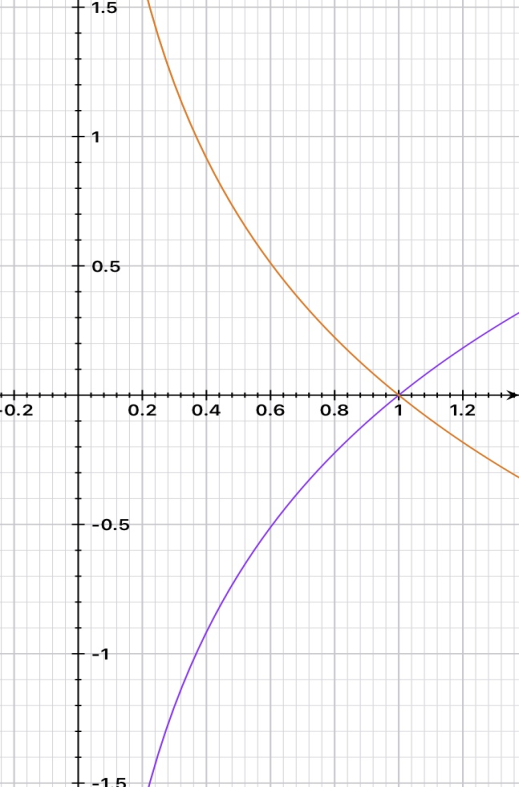

### P(x)는 확률인가, 가능도인가, 증거인가

같은 기호가 문맥에 따라 다른 이름으로 불린다. $p(x \mid \theta)$ 에서

- $\theta$ 가 **고정**되어 있으면(학습 완료) : 이 모델에서 $x$ 가 나올 **확률**이다.
- $\theta$ 가 **변수**이면(학습 대상) : 데이터 $x$ 를 만들 **가능도(likelihood)** 다. 이때는 $x$ 가 고정되고 $\theta$(모델)의 성능을 비교하는 상황이다.

VAE에서 학습 목표는

$$\max_{\theta} \; \log p_\theta(x)$$

이다. 여기서

$$p_\theta(x) = \int p_\theta(x \mid z)\, p(z)\, dz$$

로 잠재변수 $z$ 를 적분으로 제거하고 나면, 이 값은 더 이상 "$x$ 가 나올 확률"이 아니라 "모델 $\theta$ 가 이 데이터를 얼마나 잘 설명하는지"를 나타내는 **주변 가능도, 증거(Evidence)** 가 된다.

$$\text{Evidence}(x) = p(x) = \int p_\theta(x \mid z)\, p(z)\, dz$$

이 양은 세 가지 방식으로 읽을 수 있다.

- 데이터 $x$ 가 이 모델을 얼마나 지지하는가
- 이 모델이 데이터 $x$ 를 얼마나 설명하는가
- 데이터 $x$ 의 증거(evidence), 주변 가능도

**주변 가능도(marginal likelihood, 주변가능도, 주변우도)** 란 적분으로 잠재변수 $z$ 를 제거한 가능도, 즉 잠재변수 제거 가능도를 말한다. 잠재변수를 제거하는 이 적분을 **주변화(marginalize)** 라 부른다.

가능도는 어느 변수를 남기고 어느 변수를 지웠느냐에 따라 이름이 달라진다.

| 이름 | 표기 |
|---|---|
| joint likelihood (결합 가능도) | $p(x, z)$ |
| conditional likelihood (조건부 가능도) | $p(x \mid z)$ |
| marginal likelihood (주변 가능도) | $p(x)$ |

---

## 3.2.8 ELBO의 유도
<!-- 슬라이드 160~161 -->

ELBO가 왜 그런 모양인지는 세 단계로 유도된다.

### Step 1 — 로그 결합확률로 분해

베이즈 규칙 $p(z \mid x) = \dfrac{p(x, z)}{p(x)}$ 에서 $p(x)$ 를 남기면

$$p(x) = \frac{p(x, z)}{p(z \mid x)}$$

양변에 로그를 취한다.

$$\log p(x) = \log p(x, z) - \log p(z \mid x)$$

여기에 $p(x, z) = p(x \mid z)\, p(z)$ 를 대입하면

$$\log p(x) = \log p(x \mid z) + \log p(z) - \log p(z \mid x) \qquad \cdots (1)$$

### Step 2 — 근사 분포로 적분 형태 만들기

$q(z \mid x)$ 는 확률분포이므로 전체 적분이 1이다. 이 성질을 이용해 $\log p(x)$ 에 1을 곱한다.

$$\log p(x) = \log p(x) \int q(z \mid x)\, dz \qquad \left(\because \int q(z \mid x)\, dz = 1\right)$$

$\log p(x)$ 는 $z$ 와 무관하므로 적분 안으로 넣을 수 있다.

$$= \int q(z \mid x) \log p(x)\, dz \qquad \cdots (2)$$

### Step 3 — (2)에 (1)을 대입

$$\log p(x) = \int q(z \mid x) \log p(x)\, dz$$

$$= \int q(z \mid x)\left[\log p(x \mid z) + \log p(z) - \log p(z \mid x)\right] dz$$

세 항으로 분리한다. 첫 항은 기대값 표기로 바꿀 수 있다.

$$= \mathbb{E}_{q(z \mid x)}\!\left[\log p(x \mid z)\right] + \int q(z \mid x) \log p(z)\, dz - \int q(z \mid x) \log p(z \mid x)\, dz$$

여기서 **더미 항(dummy term)** 을 도입한다. $\int q(z \mid x) \log q(z \mid x)\, dz$ 를 빼고 다시 더하면 값은 변하지 않는다(합이 0이다).

$$= \mathbb{E}_{q(z \mid x)}\!\left[\log p(x \mid z)\right]$$
$$\quad - \int q(z \mid x) \log q(z \mid x)\, dz + \int q(z \mid x) \log p(z)\, dz$$
$$\quad + \int q(z \mid x) \log q(z \mid x)\, dz - \int q(z \mid x) \log p(z \mid x)\, dz$$

이제 KL 발산의 정의

$$D_{KL}(p \,\|\, q) = H(p,q) - H(p) = -\sum_i p_i \log(q_i) + \sum_i p_i \log(p_i) = -\int p(x)\log q(x)\, dx + \int p(x)\log p(x)\, dx$$

를 적용하면 둘째 줄이 $-D_{KL}(q(z \mid x) \| p(z))$, 셋째 줄이 $+D_{KL}(q(z \mid x) \| p(z \mid x))$ 로 묶인다.

$$\log p(x) = \mathbb{E}_{q(z \mid x)}\!\left[\log p(x \mid z)\right] - D_{KL}\!\left(q(z \mid x) \,\big\|\, p(z)\right) + D_{KL}\!\left(q(z \mid x) \,\big\|\, p(z \mid x)\right)$$

### 마지막 항을 버릴 수 있는 이유

세 항의 성격이 서로 다르다.

- 마지막 항 $D_{KL}(q(z \mid x) \| p(z \mid x))$ 는 우리가 근사하려는 대상 $p(z \mid x)$ 를 포함하므로 **계산이 불가능**하다. 하지만 KL 발산은 항상 0 이상이라는 것을 알고 있으므로, 이 항을 **제거하면 부등식**이 된다.
- 앞의 두 항은 계산할 수 있다. $q(z \mid x)$ 는 VAE 인코더가 만드는 정규분포이고, $P(z)$ 는 표준정규분포로 가정했으므로 KL 항은 닫힌 식으로 계산된다. $z$ 의 분포를 표준정규분포로 가정한 덕분에 계산이 가능해진 것이다.

따라서

$$\log p(x) \;\geq\; \mathbb{E}_{q(z \mid x)}\!\left[\log p(x \mid z)\right] - D_{KL}\!\left(q(z \mid x) \,\big\|\, p(z)\right) \;=\; \text{ELBO}$$

정리하면 두 개의 식이 남는다.

$$\log p(x) \;\geq\; \mathbb{E}_{q(z \mid x)}\!\left[\log p(x \mid z)\right] - D_{KL}\!\left(q(z \mid x) \,\big\|\, p(z)\right) = \text{ELBO}$$

$$\log p(x) = D_{KL}\!\left(q(z \mid x) \,\big\|\, P(z \mid x)\right) + \text{ELBO}$$

> **결론**
> $D_{KL}(q(z \mid x) \,\|\, P(z \mid x))$ 를 최소화하기 위해 ELBO를 키워야 한다.

---

## 3.2.9 VAE의 목적과 손실함수
<!-- 슬라이드 162~163 -->

### VAE = Encoder + Latent distribution + Decoder

이제 VAE를 다시 정의할 수 있다. VAE는 다음 두 모델의 결합이다.

- 데이터와 정답 잠재 분포 사이의 매핑을 잘 하는 **Encoder(추론 모델)**
- 잠재 코드가 갖고 있는 특징을 잘 표현하는 **Decoder(생성 모델)**

이 강의에서 VAE의 목적은 이미지 생성이 아니라 **데이터 구조를 해석하기 위한 도구**로 쓰는 것이다. 구체적으로는 데이터셋의 특징을 대표하는 잘 조직화된 잠재 분포를 찾고, 잠재 변수를 제어(보간)하여 해석 가능한 고품질 데이터를 생성하는 것이 목표다.

VAE의 데이터 흐름은 다음 한 줄로 표현된다.

$$x \;\longrightarrow\; q(z \mid x) \;\longrightarrow\; z \;\longrightarrow\; p(x' \mid z) \;\longrightarrow\; x'$$


### ELBO와 VAE

앞서 유도한 항등식을 VAE의 기호로 다시 쓰면 다음과 같다.

$$\log P(x) = \mathbb{E}_{z \sim q(z \mid x)}\!\left[\log p(x \mid z)\right] - D_{KL}\!\left(q(z \mid x) \,\big\|\, p(z)\right) + D_{KL}\!\left(q(z \mid x) \,\big\|\, p(z \mid x)\right)$$

$$= \text{ELBO} + D_{KL}\!\left(q(z \mid x) \,\big\|\, p(z \mid x)\right)$$

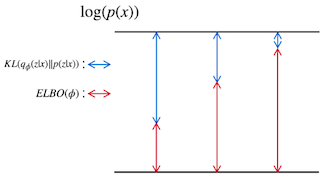

*그림 3-3. log p(x)의 분해. ELBO를 키우면 그만큼 KL 항이 줄어든다.*

손실함수의 관점에서 ELBO를 키운다는 것은 세 가지를 동시에 요구하는 것이다.

- $x \cong x'$ : 복원 결과가 원본과 **시각적으로 유사**하도록
- $q(z \mid x) \cong p(z \mid x)$ : 근사 분포가 **정답 잠재 분포로 근사**되도록
- $q(z \mid x) \cong p(z)$ : 전체 근사 분포가 **표준정규분포에 가깝도록**

첫째는 재구성 항이 담당하고, 셋째는 KL 항이 담당하며, 둘째는 그 결과로 따라온다.

---

## 3.2.10 재매개변수화 트릭
<!-- 슬라이드 164 -->

ELBO를 손실함수로 쓰려면 한 가지 기술적 문제를 해결해야 한다. 인코더와 디코더 사이에 **샘플링**이 끼어 있는데, 샘플링은 미분이 되지 않는다. 역전파(backpropagation)가 그 지점에서 끊긴다.

**재매개변수화 트릭(Reparameterization Trick)** 은 역전파에서 미분이 가능하도록 이 지점을 우회하는 방법이다. 핵심 발상은 **샘플링의 우연성을 분리**하는 것이다. 확률적 노드(stochastic node)를 확률적 부분과 결정적 부분(stochastic + deterministic)으로 분해하고, **결정적 부분으로만 역전파**를 흘린다.

원래 샘플링은 다음과 같이 이루어진다.

$$z^{i,j} \sim \mathcal{N}\!\left(\mu_i,\; \sigma_i^2 I\right)$$

이것을 다음과 같이 다시 쓴다.

$$z^{i,j} = \mu_i + \sigma_i \odot \varepsilon, \qquad \varepsilon \sim \mathcal{N}(0, I)$$

여기서 $\odot$ 는 원소별 곱이다. 이제 무작위성은 전부 $\varepsilon$ 에 격리되었고, $\mu_i$ 와 $\sigma_i$ 는 결정적인 값이다. 기울기는 $\mu_i$ 와 $\sigma_i$ 를 통해 인코더로 흘러갈 수 있다. 그 결과 **학습이 안정적으로 수렴**한다.

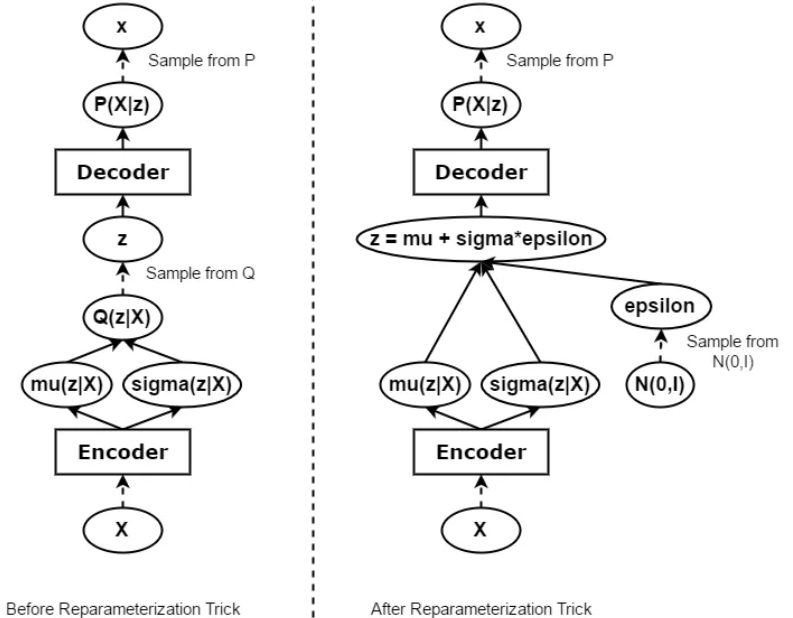

*그림 3-4. 재매개변수화 트릭. 확률 노드를 우회하는 결정적 경로가 만들어진다.*

---

## 3.2.11 비용함수의 구성
<!-- 슬라이드 165~166 -->

### 전체 비용함수

ELBO는 최대화 대상이므로, 손실함수로 쓰려면 부호를 반전시킨다. 그러면 전체 손실은 두 항의 합이 된다.

$$\textbf{Total loss} = \textbf{Reconstruction loss} + \textbf{Latent variable loss}$$

식으로 쓰면 다음과 같다.

$$\mathcal{L}\!\left(x^i, \theta, \phi\right) = -\,\mathbb{E}_{z \sim q_\phi(z \mid x_i)}\!\left[\log p_\theta(x_i \mid z)\right] + D_{KL}\!\left(q_\phi(z \mid x_i) \,\big\|\, p(z)\right)$$

앞의 항이 **Reconstruction Error term**(인코더-디코더 경로의 복원 오차), 뒤의 항이 **Latent variable Regularization term**(잠재 변수 정규화)이다.

### 재구성 오차 항

재구성 오차 항은 디코딩된 이미지의 오차이며, 동시에 로그 가능도다. 데이터 $x_i$ 에 대한 복원 오차를 기대값으로 쓰면

$$\mathbb{E}_{q_\phi(z \mid x_i)}\!\left[\log p_\theta(x_i \mid z)\right] = \int \log p_\theta(x_i \mid z)\, q_\phi(z \mid x_i)\, dz$$

이 적분은 직접 계산하지 않고 **몬테카를로 방법(Monte Carlo method)** 으로 근사한다. 잠재 벡터를 $L$ 번 샘플링해 평균을 낸다.

$$\approx \frac{1}{L}\sum_{j=1}^{L} \log p_\theta\!\left(x_i \mid z^{i,j}\right) \;\approx\; \log p_\theta\!\left(x_i \mid z^{i}\right)$$

여기서 $L$ 은 잠재 벡터를 위한 샘플 개수이며, 실무에서는 보통 $L=1$ 로 둔다. 미니배치 학습에서는 배치 전체에 걸쳐 평균이 이미 취해지므로 $L=1$ 로 간략화해도 충분하다. $z^i \sim q_\phi(z \mid x_i)$ 로 한 번만 샘플링하면 된다.

이제 $\log p_\theta(x_i \mid z^i)$ 를 픽셀 단위로 풀어 쓴다. 픽셀들이 조건부 독립이라고 보면 곱이 합으로 분해된다.

$$\log p_\theta\!\left(x_i \mid z^i\right) = \log \prod_{j=1}^{D} p_\theta\!\left(x_{i,j} \mid z^i\right) = \sum_{j=1}^{D} \log p_\theta\!\left(x_{i,j} \mid z^i\right), \qquad D = \text{픽셀 수}$$

MNIST처럼 픽셀 값을 0과 1 사이로 정규화한 데이터에서는 각 픽셀을 베르누이 분포로 모델링한다. 디코더 출력 픽셀을 $p_{i,j}$ 라 하면

$$= \sum_{j=1}^{D} \log\!\left(p_{i,j}^{\,x_{i,j}}\left(1 - p_{i,j}\right)^{1 - x_{i,j}}\right)$$

로그를 안으로 넣으면

$$= \sum_{j=1}^{D} \left[ x_{i,j}\log p_{i,j} + \left(1 - x_{i,j}\right)\log\!\left(1 - p_{i,j}\right) \right]$$

이 식은 **픽셀 단위 이진 교차 엔트로피(pixel by pixel binary cross entropy)의 음수**다. 디코더 출력을 $x_i'$ 으로 표기하면

$$= \sum_{j=1}^{D} \left[ x_i \log x_i' + \left(1 - x_i\right)\log\!\left(1 - x_i'\right) \right] = -\,\mathrm{BiCE}\!\left(x_i, x_i'\right)$$

즉 **재구성 로그 가능도를 최대화하는 것은 이진 교차 엔트로피를 최소화하는 것과 같다.**

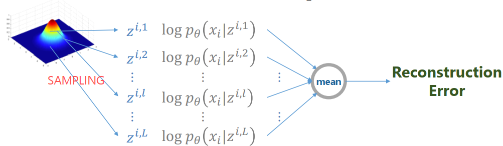

### 잠재 변수 정규화 항

두 번째 항은 $P(z)$ 를 표준정규분포로 설정하여 $q$ 의 분포를 제어하는 역할을 한다. 3.2.6에서 얻은 결과를 그대로 가져온다.

$$D_{KL}\!\left(q_\phi(z \mid x_i) \,\big\|\, p(z)\right) = D_{KL}\!\left(\mathcal{N}(\mu_q, \sigma_q^2) \,\big\|\, \mathcal{N}(0, 1)\right)$$

$$= \sum_i \left[ -\log \sigma_{q_i} + \frac{1}{2}\left(\sigma_{q_i}^2 + \mu_{q_i}^2 - 1\right) \right]$$

$$= -\frac{1}{2}\sum_i \left(1 + \log \sigma_{q_i}^2 - \sigma_{q_i}^2 - \mu_{q_i}^2\right)$$

### 최종 손실

두 항을 합치면 VAE의 전체 손실이 완성된다.

$$\mathcal{L}\!\left(x^i, \theta, \phi\right) = -\sum_{j=1}^{D}\left[ x_i \log x_i' + \left(1 - x_i\right)\log\!\left(1 - x_i'\right) \right] \;-\; \frac{1}{2}\sum_i \left(1 + \log \sigma_{q_i}^2 - \sigma_{q_i}^2 - \mu_{q_i}^2\right)$$

$$= \mathrm{BiCE}\!\left(x, x'\right) + D_{KL}\!\left(q \,\|\, p\right)$$

적분도 없고 근사도 필요 없는, 그대로 코드로 옮길 수 있는 형태다.

---

## 3.2.12 두 손실의 균형: β-VAE와 Sigma-VAE
<!-- 슬라이드 167~169 -->

### VAE의 목적과 성능 확인

VAE의 목적을 다시 정리하면 두 가지다.

- 데이터셋의 특징을 대표하는 **좋은 잠재 변수**를 찾기
- 잠재 변수를 제어하여 데이터를 **생성하고 해석**하기

성능은 결과 이미지가 아니라 잠재 변수의 성질로 확인한다. 잠재 변수를 조정하여 다양한 이미지를 생성해 보고, 각 변수가 실제로 어떤 특징을 대표하는지 확인하는 방식이다.

### 두 손실의 비중이 만드는 트레이드오프

전체 손실이 재구성 손실과 KL 손실의 합이므로, 어느 쪽에 무게를 두느냐에 따라 모델의 성격이 달라진다.

**재구성 손실의 비중을 높이면** 이미지 품질이 향상된다. 그러나 잠재 변수의 모양이 무시된다. 극단으로 가면 KL 제약이 사실상 사라지므로 **AE와 동일해진다.**

**KL 손실의 비중을 높이면** — 이것이 **β-VAE** 다 — 매끄럽고 정규화된 잠재공간이 만들어지고 잠재 변수가 특징을 잘 표현하게 된다. 그러나 이미지 품질은 하락한다. 극단으로 가면 인코더 출력이 $\mu = 0$, $\sigma = 1$ 로 수렴해 버리는 **KL 붕괴(KL collapse), 변수 붕괴(variable collapse)** 가 발생한다. 입력이 무엇이든 같은 분포를 내놓으니 잠재 변수가 정보를 전혀 담지 못하게 된다.

따라서 관건은 두 손실의 **균형 잡기**다. 이 문제를 다룬 최근 연구로는 다음이 있다.

- "Beta-Sigma VAE: Separating beta and decoder variance in Gaussian variational autoencoder", 2024
- "L-VAE: Variational Auto-Encoder with Learnable Beta for Disentangled Representation", 2025

### β-VAE

β-VAE는 **풀린 잠재 요인(disentangled latent factor)** 을 찾는 데 중점을 둔 모델이다. 다만 풀림이 보장되지는 않는다.

> 원논문: https://openreview.net/pdf?id=Sy2fzU9gl

방법은 단순하다. VAE 손실에서 잠재 변수 정규화 항의 강도를 $\beta$ 로 조절한다.

$$\mathcal{L}_{\beta\text{-VAE}} = \mathbb{E}_{q_\phi(z \mid x)}\!\left[\log p_\theta(x \mid z)\right] - \beta \, D_{KL}\!\left(q_\phi(z \mid x) \,\big\|\, p(z)\right)$$

$\beta$ 값에 따라 모델의 성격이 갈린다.

- $\beta = 1$ : 기본형 VAE(vanilla VAE)
- $\beta > 1$ : 강한 제약 조건이 적용된다. 일부 조건부 독립적 생성 요소의 경우 얽히지 않은 상태로 유지하는 것이 가장 효율적인 표현이 된다. 따라서 $\beta$ 가 높을수록 더 효율적인 잠재 인코딩을 장려하고, 더 많이 풀린 표현을 장려하게 된다. 다만 재구성 품질과 얽힘 정도 사이에 절충이 발생할 수 있다.

아래 그림은 $\beta = 250$ 과 $\beta = 1$ 을 나란히 놓고 비교한 것이다.

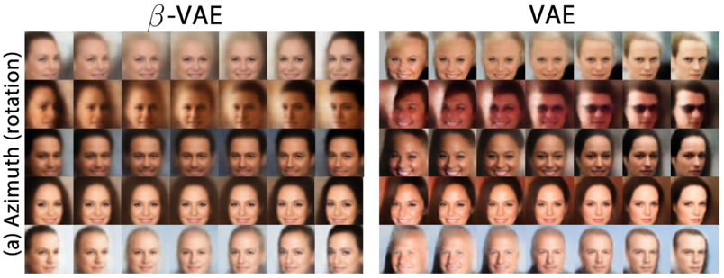

### Sigma-VAE — β의 자동 최적화

$\beta$ 를 손으로 찾는 대신 자동으로 균형을 맞추는 접근이 **Sigma-VAE** 다. 핵심은 **디코더 분산 $\sigma$ 의 최적화**를 통해 재구성 손실과 KL 손실 사이의 균형을 자동으로 잡는 것이다.

일반적인 VAE는 디코더 출력의 분산을 보통 1로 고정한다. Sigma-VAE는 이 분산 값을 모델이 직접 학습한다. 그 결과 이미지 선명도가 개선된다.

컬러 이미지에서는 재구성 손실의 형태부터 달라진다. 픽셀 값이 이진이 아니므로 BCE를 사용할 수 없고 **MSE**를 사용한다. MSE 손실은 다음 가정과 대응된다.

$$\|x - \hat{x}\|^2 \quad \Longrightarrow \quad p(x \mid z) = \mathcal{N}\!\left(x;\, \hat{x},\, \sigma_x^2 = 0.5\, I\right)$$

여기서 $\sigma_x$ 는 고정된 하이퍼파라미터다. Sigma-VAE는 이 값을 학습 중에 계산하여 최적화한다.

$$\sigma_x^2 \;\leftarrow\; \frac{\mathbb{E}_q\!\left[\|x - \hat{x}\|^2\right]}{D} = \frac{\text{(배치 단위 MSE)}}{D}, \qquad D = \text{입력 데이터의 차원}$$

이렇게 하면 $\sigma_x^2$ 가 현재의 재구성 오차 수준에 자동으로 맞추어진다. $\sigma_x^2$ 는 **모델이 허용하는 재구성 오차의 스케일**로 해석할 수 있다. 재구성이 잘 될수록 $\sigma_x^2$ 가 작아지고, 그만큼 KL 항의 상대적 비중이 증가한다. 즉 $\beta$ 가 자동으로 조정되는 셈이다. 그 결과 β-VAE에서처럼 최적의 $\beta$ 를 따로 찾을 필요가 없어진다.

### Beta-Sigma VAE

"Beta-Sigma VAE: Separating beta and decoder variance in Gaussian variational autoencoder"(2024)는 Sigma-VAE에서 $\beta$ 를 자동 조정하되, **$\beta$ 와 $\sigma$ 의 역할이 서로 다르다**는 점에 주목한다.

- $\beta$ : 풀린 표현(disentangled representation)을 만드는 역할
- $\sigma$ : 선명도를 높이는 역할

두 역할을 분리한 손실은 다음과 같다.

$$L = \frac{1}{\sigma_x^2}\,\|x - \hat{x}\|^2 + \beta\, \mathrm{KL}$$

이렇게 두면 VAE의 **흐림-구조 트레이드오프(blur–structure trade-off)** 를 해석 가능하고 제어 가능하게 만들 수 있다.

---

## 3.2.13 Denoising AE, Denoising VAE, 그리고 Diffusion
<!-- 슬라이드 170~171 -->

### Denoising AE는 VAE와 무엇이 다른가

3.2.2에서 남겨 둔 질문으로 돌아간다. AE의 입력에 노이즈를 섞어 학습하는 **Denoising AE(DAE)** 는 분포를 배우는가?

AE는 점 매핑이므로 원칙적으로 분포 표현을 배우지 못한다. 다만 DAE는 노이즈가 섞인 입력을 원본으로 되돌리는 과정에서 **국소적 분포 정보**를 학습한다. 데이터에 가까운 주변 영역에 의미를 부여하게 되므로, 샘플링이 가능한 생성 모델에 조금 가까워진다. 그럼에도 VAE와는 결정적인 차이가 남는다.

| 구분 | Denoising AE (DAE) | VAE |
|---|---|---|
| 분포의 성격 | 국소적 — 데이터 근처만 학습 | 전역적 — 전체 공간의 형태를 정함 |
| 샘플링 방식 | 데이터 근처에서 조금씩 이동 | $p(z)$ 에서 바로 뽑음 |
| 빈 공간(hole) | 데이터가 없는 먼 공간은 여전히 미지수 | KL 발산으로 빈 공간을 메움 |

핵심 차이는 **전역성**이다. DAE는 데이터 주변의 지역 지도를 그리지만, 잠재공간 전체의 형태를 정하지는 않는다. VAE는 KL 항을 통해 잠재공간 전체를 표준정규분포에 맞추므로, 데이터가 없는 영역까지 포함해 하나의 좌표계를 확보한다.

### Denoising VAE

그렇다면 반대로, VAE에 노이즈를 추가하는 것도 의미가 있을까? 있다. 두 가지 이득이 있다.

**매니폴드 강건성(manifold robustness) 향상** — 데이터 주변의 경사면까지 학습하게 되므로 생성 데이터의 품질이 향상된다.

**가혹한 훈련** — 노이즈가 섞인 데이터에서 본질적 특성을 추출해야 하므로 학습이 더 어려워진다. 그 결과 과적합(overfitting)이 감소하고 데이터 품질이 향상된다.

| 구분 | VAE | Denoising VAE (VDAE) |
|---|---|---|
| 인코더의 역할 | $x$ 의 특징을 분포로 변환 | 노이즈를 제거하며 본질적 특징 추출 |
| 잠재 공간 | 데이터 포인트 간의 연결성 강조 | 데이터 주변 공간까지 아우르는 강건한 지도 구축 |
| 학습 난이도 | 상대적으로 낮음 | 높음 — 더 강력한 규제가 가해짐 |
| 생성 품질 | 약간 흐릿할 수 있음 | 더 선명하고 구조적인 복원 가능 |

### Diffusion Model — 다른 계보

Diffusion Model은 DAE나 VAE의 후속 모델이 아니다. **다른 계보**에 속한다. 두 모델이 노이즈를 다루는 방식을 나란히 놓으면 차이가 분명해진다.

- DAE : $x + \varepsilon \;\rightarrow\; x$ — 한 번에 제거한다.
- Diffusion : $x + \varepsilon \rightarrow +\varepsilon \rightarrow \cdots \rightarrow \text{random noise} \rightarrow -\varepsilon \rightarrow \cdots \rightarrow -\varepsilon \rightarrow x$ — 여러 단계에 걸쳐 더하고, 여러 단계에 걸쳐 제거한다.

구조적으로는 U-Net을 사용하며, 노이즈를 더하는 쪽은 코드로 처리하고 제거하는 쪽을 딥러닝 모델이 담당한다. 노이즈를 한 번에 0.1%씩만 제거하는 DAE를 학습시키는 셈이다. 이 방식에는 장단점이 있다.

- 장점 : VAE보다 간결한 손실로 학습이 안정적이다.
- 단점 : 픽셀 단위로 노이즈를 제거하므로 효율이 낮다. 너무 느리다.

### Stable Diffusion — VAE와 Diffusion의 결합

Stable Diffusion은 이 효율 문제를 VAE로 해결한 구조다. 구성은 **VAE + Diffusion + Cross-Attention + CLIP(conditioning)** 이다.

- VAE를 사용하여 이미지를 작은 잠재공간 이미지로 압축한다(512×512 → 64×64).
- 압축된 잠재공간 이미지에서 diffusion을 적용한다. 픽셀 대신 잠재 좌표를 다루므로 계산량이 크게 줄어든다.
- U-Net 구조의 노이즈 제거 단계에 Cross-Attention을 통해 CLIP(캡션) 정보를 주입한다.

이미지 생성 단계는 다음과 같이 진행된다.

1. 무작위 노이즈($z$ 공간)와 CLIP이 인코딩한 텍스트 프롬프트를 준비한다.
2. Diffusion : U-Net 구조로 노이즈를 제거한다.
3. VAE Decoder : 정제된 잠재변수 $z$ 에서 고해상도 이미지를 생성한다.

---

## 3.2.14 VAE를 직접 만든다
<!-- 슬라이드 172~179 -->

여기까지가 VAE의 이론이다. 이제 그 이론이 코드에서 어떤 모양이 되는지 확인한다. 앞에서 유도한 세 가지 — 재매개변수화 트릭, ELBO의 두 항, prior 제약 — 이 각각 어느 줄에 대응하는지 짚어 가며 읽는다.

### 실습 3.2.1 — Variational Autoencoder (VAE)

> 노트북: `code/3.2.1.VAE.ipynb`

**목표** — MNIST 데이터를 사용하는 VAE 모델을 만든다. 잠재 차원(latent dim)을 2로 두고, 좋은 잠재 변수 두 개를 찾는다.

**Sampling 함수**

인코더는 정규분포 $q$ 의 모수, 즉 평균(mean)과 분산(variance)을 찾고, 그 평균과 분산을 가지고 $z$ 를 샘플링한다. 샘플링에는 재매개변수화 트릭을 사용한다.

$$z^i \sim \mathcal{N}\!\left(\mu_i, \sigma_i^2 I\right) \;\Longrightarrow\; z^i = \mu_i + \sigma_i \odot \varepsilon, \qquad \varepsilon \sim \mathcal{N}(0, I)$$

```python
## z_mean, z_log_var 로부터 샘플링하여 잠재변수 z를 얻는 것
# Reparameterization trick for back-propagation
class Sampling(layers.Layer):
    def call(self, inputs):
        z_mean, z_log_var = inputs
        batch = tf.shape(z_mean)[0]
        dim = tf.shape(z_mean)[1]
        epsilon = tf.keras.backend.random_normal(shape=(batch, dim))
        # return:latent variable(샘플링된 값)
        return z_mean + tf.exp(0.5 * z_log_var) * epsilon
```

여기서 인코더가 $\sigma$ 가 아니라 $\log \sigma^2$(`z_log_var`)을 출력한다는 점에 주의한다. 분산은 항상 양수여야 하는데, 로그 분산으로 다루면 신경망 출력에 아무 제약을 걸지 않아도 되고 `tf.exp(0.5 * z_log_var)` 로 되돌리면 곧 $\sigma$ 가 된다.

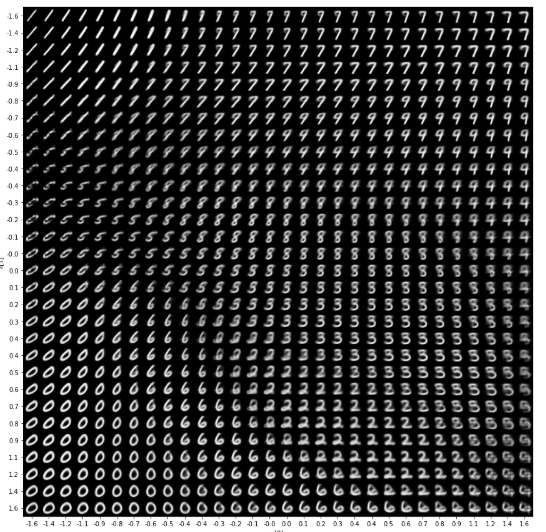

### Encoder

디코더가 잘 복원할 수 있는 $z$ 를 샘플링할 수 있도록, 최적의 $p(z \mid x)$ 를 찾고 싶다. 그러나 그것은 너무 어렵다. 그래서 최적의 $p(z \mid x)$ 를 대신할 $q(z \mid x)$ 를 찾는다. 이것이 변분추론이다.

인코더의 출력은 잠재 차원 수만큼의 쌍이다.

$$z = [\,z\_mean,\; z\_log\_var\,] \times 2 \quad (\text{latent\_dim})$$

```python
latent_dim = 2
def Encoder():
    encoder_inputs = keras.Input(shape=(28, 28, 1))
    x = layers.Conv2D(32, 3, activation="relu", strides=2, padding="same")(encoder_inputs)
    x = layers.Conv2D(64, 3, activation="relu", strides=2, padding="same")(x)
    x = layers.Flatten()(x)
    x = layers.Dense(16, activation="relu")(x)
    # 가정한 확률분포의 모수
    z_mean = layers.Dense(latent_dim, name="z_mean")(x)
    z_log_var = layers.Dense(latent_dim, name="z_log_var")(x)
    # 모수로 부터 z 샘플링
    z = Sampling()([z_mean, z_log_var])
    encoder = keras.Model(
        encoder_inputs, [z_mean, z_log_var, z], name="encoder")
    return encoder
```

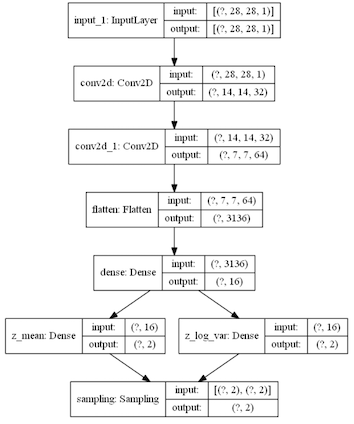

### Decoder

디코더는 샘플링된 $z$ 를 디코딩하여 새로운 이미지 $x'$ 을 출력한다. `Dense` 로 $7\times7\times64$ 를 만든 뒤 전치 합성곱으로 두 번 키워 원래 해상도로 되돌린다.

```python
def Decoder():
    latent_inputs = keras.Input(shape=(latent_dim,))
    x = layers.Dense(7 * 7 * 64, activation="relu")(latent_inputs)
    x = layers.Reshape((7, 7, 64))(x)
    x = layers.Conv2DTranspose(64, 3, activation="relu", strides=2, padding="same")(x)
    x = layers.Conv2DTranspose(32, 3, activation="relu", strides=2, padding="same")(x)
    decoder_outputs = layers.Conv2DTranspose(1, 3, activation="sigmoid", padding="same")(x)
    decoder = keras.Model(latent_inputs, decoder_outputs, name="decoder")
    return decoder
```

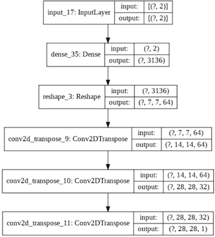

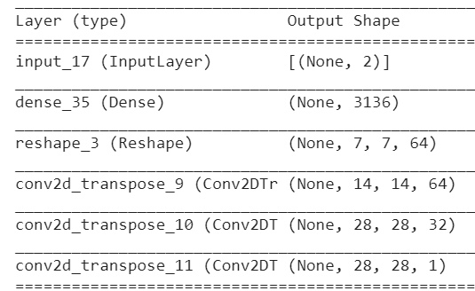

### 손실함수와 train_step

손실함수는 앞서 유도한 것을 그대로 옮긴다.

$$\mathcal{L}\!\left(x^i, \theta, \phi\right) = -\text{ELBO} = \mathrm{BiCE}\!\left(x, x'\right) + D_{KL}\!\left(q \,\|\, p\right)$$

ELBO를 최대로, 즉 $-$ELBO를 최소로 만들도록 학습한다. 재구성 항은 픽셀이 1인 경우에 대한 교차 엔트로피와 0인 경우에 대한 교차 엔트로피의 합, 곧 `binary_crossentropy` 다. KL 항은 3.2.11에서 얻은 닫힌 식 $-\tfrac12\sum(1+\log\sigma^2-\sigma^2-\mu^2)$ 를 그대로 옮긴 것이다. 두 계산이 모두 `train_step` 안에 들어간다.

```python
class VAE(keras.Model):
    def __init__(self, encoder, decoder, **kwargs):
        super(VAE, self).__init__(**kwargs)
        self.encoder = encoder
        self.decoder = decoder

    def train_step(self, data):
        if isinstance(data, tuple):
            data = data[0]
        with tf.GradientTape() as tape:
            z_mean, z_log_var, z = self.encoder(data)
            reconstruction = self.decoder(z)
            # 생성된 결과와 입력값의 비교 : reconstruction error
            reconstruction_loss = tf.reduce_mean(
                keras.losses.binary_crossentropy(data, reconstruction)
            )
            reconstruction_loss *= 28 * 28
            # KL-Divergence 계산
            kl_loss = 1 + z_log_var - tf.square(z_mean) - tf.exp(z_log_var)
            kl_loss = tf.reduce_mean(kl_loss)
            kl_loss *= -0.5
            total_loss = reconstruction_loss + kl_loss * 5
        grads = tape.gradient(total_loss, self.trainable_weights)
        self.optimizer.apply_gradients(zip(grads, self.trainable_weights))
        return {
            "loss": total_loss,
            "reconstruction_loss": reconstruction_loss,
            "kl_loss": kl_loss,
        }
```

모델을 정의(define)하고, 컴파일(compile)하고, 학습(fit)한다.

```python
encoder = Encoder()
decoder = Decoder()

vae = VAE(encoder,decoder)
vae.compile(optimizer=keras.optimizers.Adam()) # learning_rate=0.0005
history = vae.fit(mnist_digits, epochs=60, batch_size=512)
```

### 결과: 학습 결과를 이미지로 출력하기

잠재 영역이 함의한 특징을 이미지로 확인한다. 격자(grid) 좌표를 $z$ 값으로 삼아 디코더에 넣고 결과를 표시하는 방식이다. 이렇게 하면 학습 결과 $z$ 공간이 어떻게 형성(매핑)되었는지, 그곳이 어떤 특징을 갖는지 확인할 수 있다.

격자 간격은 조정이 필요하다. 잠재 분포가 표준정규분포에 가까우므로 중앙에 정보가 집중되기 때문이다. 외곽 부분의 간격을 늘려야 한다. 여기에 **PPF(Percent Point Function)** 를 사용한다. PPF는 CDF의 역함수이므로, 균등한 확률 간격을 좌표 간격으로 변환해 준다. 그 결과 중앙은 촘촘하고 외곽은 성긴 격자가 만들어진다.

```python
figure = np.zeros((digit_size * n, digit_size * n))
grid_x = norm.ppf(np.linspace(0.05, 0.95, n))
grid_y = norm.ppf(np.linspace(0.05, 0.95, n))

for i, xi in tqdm(enumerate(grid_x), total=len(grid_x)):
    for j, yi in enumerate(grid_y):
        z_sample = np.array([[xi, yi]])
        # 그리드 좌표값으로 추론
        x_decoded = decoder.predict(z_sample, batch_size=batch_size,verbose=0)
        # 28 x 28 로 변환
        digit = x_decoded[0].reshape(digit_size, digit_size)

        figure[i * digit_size: (i + 1) * digit_size,
               j * digit_size: (j + 1) * digit_size] = digit
```

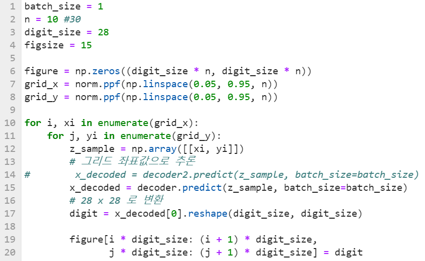

*그림 3-5. 잠재공간 격자 디코딩. 인접한 좌표가 비슷한 숫자를 만들어 내면 잠재공간이 연속적이라는 뜻이다.*


### 잠재 영역의 군집화된 모습 시각화

잠재 영역에 매핑된 레이블의 군집 모습을 확인한다. 데이터를 인코딩한 결과, 즉 $z$ 공간의 좌표를 레이블로 색을 입혀 표시한다. 이렇게 하면 인코더가 $z$ 공간에 데이터를 어떻게 매핑시키는지 시각화된다.

```python
def plot_label_clusters(encoder, decoder, data, labels):
    # display a 2D plot of the digit classes in the latent space
    z_mean, _, _ = encoder.predict(data,verbose=0) # data.shape:(60000,28,28,1)
    # z_mean.shape:(60000,2)
    plt.figure(figsize=(8, 6))
    plt.scatter(z_mean[:, 0], z_mean[:, 1], c=labels, s=3) # z[0],z[1]
    plt.colorbar()
    plt.xlabel("z[0]")
    plt.ylabel("z[1]")
    plt.grid()
    plt.show()
```

![MNIST 전체를 인코딩한 잠재공간 산점도 — 숫자 라벨별 색이 z[0]·z[1] 평면에서 띠 모양 영역으로 나뉜다](images/s178_02.png)

### 잠재공간 검토

잠재 영역에 매핑된 레이블과 잠재 영역에서 샘플링한 이미지를 나란히 놓고 검토한다. 함께 KL 손실의 변화도 확인한다.

![VAE 잠재공간의 레이블별 산점도 — z[0]는 대략 −3에서 4, z[1]은 −2에서 4 범위에 모여 있고 클래스 영역이 서로 맞물려 있다](images/s179_02.png)

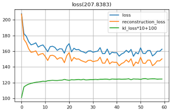

> **실습 과제**
> 과제 1 : `./models/vae_latent.h5` 에 학습 결과를 읽어 실행해 보자.
> - plot cell에서 `n = 15` 값을 30, 40으로 바꾸어 실행해 보자.
> - 성능 향상을 위해 계층을 늘려 보자.
> - VAE model이 만들어 낸 손글씨의 다양성을 검토하고,
> - 활용 가능성을 생각해 보자.

---
## 3.2.15 3차원 잠재공간과 변수 붕괴
<!-- 슬라이드 180~181 -->

잠재 차원을 하나 늘리면 무엇이 달라지는가. 그리고 차원을 늘렸을 때 그 차원이 실제로 **쓰이고 있는지**는 어떻게 확인하는가. 두 번째 물음이 이 소절의 핵심이다.

### 실습 3.2.2 — Latent dim = 3

잠재 차원을 3으로 늘려 잠재공간을 3차원으로 시각화해 본다. 그리고 디코더를 이용해 잠재 변수 보간(latent variable interpolation)을 수행한다.

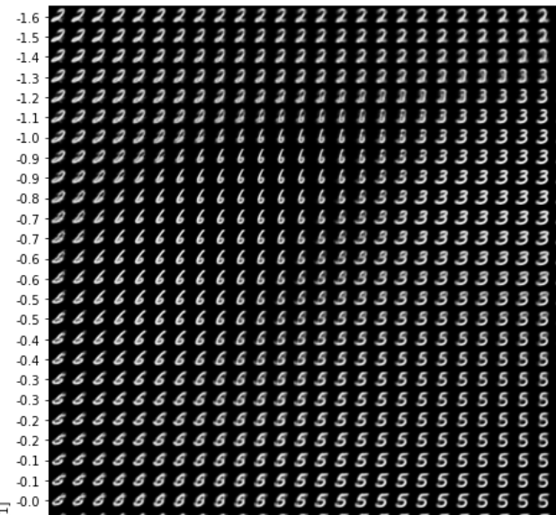

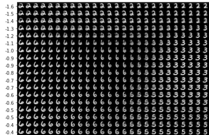

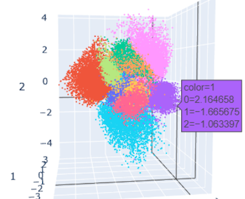

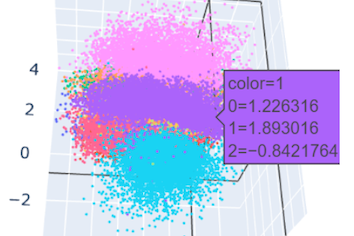

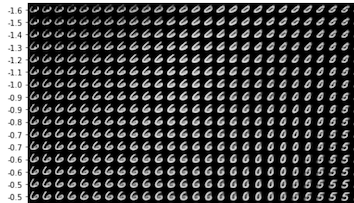

### Variable collapse — 학습 과정의 안정성 확인

**현상** — 모든 잠재 변수가 사용되지 못하거나, 여러 변수가 동일하게 학습되는 현상이다. 모든 변수가 특징을 학습하지 못하고 일부 변수에만 정보가 집중된다. 그 결과 잠재 변수의 표현력이 감소하여 모델이 데이터의 다양한 특성을 포착하기 어렵게 된다.

**원인** — 모델이 복잡한 입력 데이터를 충분히 분리해 내지 못할 때 발생한다. 또는 변수 개수에 비해 학습 데이터의 특성이 충분히 분산되지 않았을 때도 발생한다.

**해결** — 모든 잠재 변수를 고르게 활용하도록 장려한다. 정규화(regularization) 기법을 쓰거나, 변수별 특성 분포를 고르게 조정한다.

이 현상은 VAE뿐 아니라 GAN이나 AE 등 다른 유형의 생성 모델에서도 발생할 수 있다.

**확인 방법** — 평균과 분산을 추적하여 확인한다. 잠재 차원을 10으로 둔 실험에서는 4개의 변수를 사용하지 않았음을 확인할 수 있다.

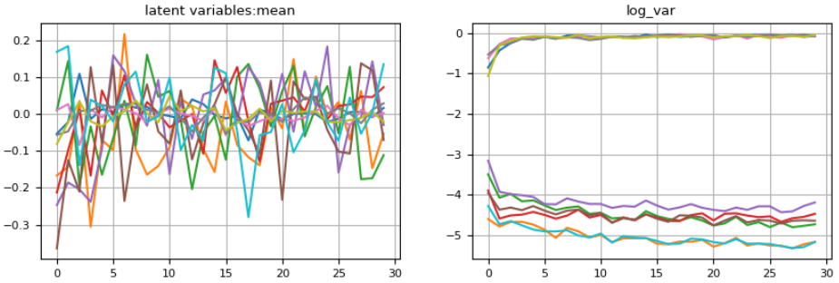

> **Posterior Collapse — 완전히 망가지는 경우**
> - 모든 변수가 표준정규분포로 수렴한다.
> - 디코더가 인코더를 무시하여 발생한다. 디코더가 지나치게 강력하거나, 인코더가 취약할 때 일어난다.
> - 그 결과 모델은 입력에 관계없이 입력 데이터의 평균을 출력한다.

---

## 3.2.16 β의 자동 최적화를 확인한다
<!-- 슬라이드 182 -->

3.2.12에서 Sigma-VAE는 디코더 출력 분산 $\sigma_x$ 를 학습 중에 계산하여 $\beta$ 를 자동으로 조정한다고 했다. 그 조정이 실제로 일어나는지를 학습 곡선에서 직접 확인한다.

### 실습 3.2.3 — Sigma-VAE: β 자동 최적화

> 노트북: `code/3.2.3.Sigma-VAE.ipynb`

컬러 이미지의 재구성 손실에는 BCE를 사용할 수 없고 MSE를 사용한다. MSE 손실은 다음 가정과 대응된다.

$$\|x - \hat{x}\|^2 \quad \Longrightarrow \quad p(x \mid z) = \mathcal{N}\!\left(x;\, \hat{x},\, \sigma_x^2 = 0.5\, I\right)$$

여기서 $\sigma_x$ 는 고정된 하이퍼파라미터다. 학습 중에 디코더 출력 값의 분산 $\sigma_x$ 를 계산하여 최적화한다.

$$\sigma_x^2 \;\leftarrow\; \frac{\mathbb{E}_q\!\left[\|x - \hat{x}\|^2\right]}{D} = \frac{\text{(배치 단위 MSE)}}{D}, \qquad D = \text{입력 데이터의 차원}$$

$\sigma_x^2$ 는 현재의 재구성 오차 수준에 자동으로 맞추어진다. 즉 $\sigma_x^2$ 는 모델이 허용하는 재구성 오차의 스케일이다. 재구성이 잘 될수록 $\sigma_x^2$ 가 작아져 KL 항의 상대적 비중이 증가하고, 그 결과 $\beta$ 가 자동으로 조정된다.

이 조정은 코드에서 **현재 미니배치의 MSE로부터 최적 $\sigma$ 를 계산해 같은 step의 재구성 손실에 바로 쓰는** 방식으로 구현된다.

```python
def _reconstruction_loss_with_current_batch_sigma(self, x, reconstruction):
    """
    current minibatch의 optimal sigma를 계산해서
    같은 step의 reconstruction loss에 바로 사용
    """
    # sample별 SSE
    sse_per_sample = tf.reduce_sum(tf.square(x - reconstruction), axis=[1, 2, 3])

    # batch 전체 기준 MSE = sigma^2 의 optimal estimate
    D = self._num_dims(x)
    mse_scalar = tf.reduce_mean(sse_per_sample) / D
    mse_scalar = tf.maximum(mse_scalar, 1e-8)

    # optimal sigma
    log_sigma = 0.5 * tf.math.log(mse_scalar)
    log_sigma = self._softclip_min(log_sigma, self.sigma_clip_min)
    sigma = tf.exp(log_sigma)
```

KL 항은 샘플별로 잠재 차원을 합한 뒤 배치 평균을 취한다.

```python
def _kl_loss(self, z_mean, z_log_var):
    # sample별 latent dim sum 후 batch mean
    kl_per_sample = -0.5 * tf.reduce_sum(
        1.0 + z_log_var - tf.square(z_mean) - tf.exp(z_log_var),
        axis=1
    )
    return tf.reduce_mean(kl_per_sample)
```

**과제** — 학습이 진행되는 동안 $\sigma$ 가 어떻게 변화하는지 확인한다.

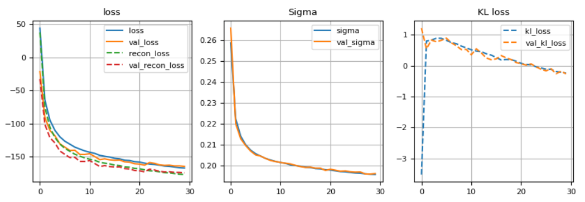

$\sigma$ 가 줄어드는 동안 KL 항의 상대적 비중이 커진다. $\beta$ 를 손으로 찾지 않아도 재구성 품질과 잠재공간 정렬 사이의 균형이 학습 과정에서 스스로 이동한다는 뜻이다.

> 관련 노트북: `code/3.2.4.VAE_실습.ipynb` — VAE 학습, AE와 VAE의 잠재공간 비교, KL Annealing, $\sigma^2$ 분석, 보간 실습을 한 파일에서 이어서 다룬다.

---
## 3.2.17 레이블 y와 잠재변수 z의 관계
<!-- 슬라이드 185~187 -->

### 문제 제기

생성 모델은 데이터의 생성 확률 구조를 $p(x, y)$ 로 기술한다. 잠재변수 모델은 같은 것을 $p(x, z)$ 로 기술한다. 그렇다면 여기서 $y$ 와 $z$ 의 관계는 무엇인가?

먼저 두 기호의 성격을 구분한다.

$y$ 는 **관측 가능한 의미적 변수**다. 클래스, 상태, 진단 결과 등이며 곧 레이블이다. 따라서 $p(x,y)$ 는 데이터 $x$ 와 레이블 $y$ 가 **함께 어떻게 생성되는가**를 의미한다.

$z$ 는 **관측되지 않는 잠재변수**다. 생성 요인, 숨은 상태, 구조 변수라고도 부른다. 따라서 $p(x,z)$ 는 데이터 $x$ 가 **보이지 않는 생성 요인 $z$ 로부터 만들어짐**을 의미한다.

두 변수의 관계는 네 가지 경우로 나뉜다.

- $y \subset z$ : $y$ 는 잠재변수의 특수한 경우
- $y = g(z)$ : 레이블은 잠재구조의 결과
- $y$ 와 $z$ 가 독립적으로 공존
- $y$ 없이 $z$ 만으로 구조 해석 — VAE의 관점

### 1) y ⊂ z : y 는 잠재변수의 특수한 경우

$y$ 를 이산적이고 관측 가능한 잠재변수로 보면, $p(x, y)$ 는 $p(x, z)$ 의 특수한 형태가 된다.

MNIST를 예로 들면

- $y$ : 숫자 클래스 (0–9)
- $z$ : 필체, 기울기, 두께, 스타일 등 연속 요인

이 경우 $y$ 는 $z$ 의 **거친 요약(projection)** 이다. 레이블은 데이터 구조의 전부가 아니라, 일부만 관측된 단면이라고 보는 관점이다.

### 2) y = g(z) : 레이블은 잠재구조의 결과

많은 생성적 해석에서 사용되는 구조다. 인과의 방향을 $z \rightarrow y \rightarrow x$ 또는 $z \rightarrow (x, y)$ 로 놓는다.

- $z$ : 근본적인 생성 요인
- $y$ : 그 요인이 의미 공간에서 양자화된 결과
- $x$ : 실제 관측 값

의료 데이터의 경우가 전형적이다.

- $z$ : 병의 진행 정도, 복합 생리 상태
- $y$ : "정상 / 경계 / 질환"
- $x$ : 영상, 수치 데이터

이 관점에서는 분류 오류의 의미가 달라진다. 분류 오류는 모델의 실패가 아니라 **$z \rightarrow y$ 매핑의 모호성**으로 해석된다. 연속적인 병의 진행 정도를 세 칸으로 양자화하는 과정에서 경계 근처의 샘플은 필연적으로 흔들린다.

### 3) y 와 z 가 독립적으로 공존 : Semi-supervised VAE

$y$ 가 데이터의 내부 구조에서 유도된 것이 아니라 **정책적·업무적으로 부여된 레이블**인 경우다.

- $y$ : 정책적·업무적 기준으로 정해진 레이블
- $z$ : 데이터 내부의 연속 구조

마케팅을 예로 들면, 고객 세그먼트 $y$ 는 마케팅 기준으로 나뉜 것이고, 실제 행동 패턴 $z$ 는 연속적이고 혼합된 구조를 갖는다. 두 체계가 반드시 일치할 이유가 없다.

> **분석가의 역할**
> 딥러닝은 $z$ 를 드러내고, 분석가는 $y$ 의 타당성을 의심해야 한다.

### 4) y 없이 z 만으로 구조 해석 : VAE의 관점

VAE에서는 아예 $y$ 를 쓰지 않는다.

$$p(x, z) = p(z)\, p(x \mid z)$$

레이블이 없어도 잠재적 클래스 경계와 모호성을 드러낼 수 있다. 근거는 세 가지다.

- $z$ 의 분포 구조
- 군집, 연속성, 중첩
- 분산 $\sigma^2(x)$

이 세 가지를 통해 $y$ 없이도 $y$ 와 같은 구조를 오히려 더 풍부하게 볼 수 있다.

---

## 3.2.18 준지도 VAE
<!-- 슬라이드 188~189 -->

### 왜 p(x, y, z)를 명시적으로 모델링하는가

지도학습 분류기와 비지도 VAE는 각각 한쪽만 본다.

**지도학습 분류기** $p(y \mid x)$ 는 예측은 잘하지만, 왜 그런 판단이 나왔는지 알기 어렵고 레이블 바깥의 구조는 보이지 않는다.

**VAE(비지도)** $p(x, z) = p(z)p(x \mid z)$ 는 데이터 내부 구조는 잘 보이지만 레이블 $y$ 와의 연결이 없다.

둘을 동시에 다루기 위해 $p(x, y, z)$ 를 명시적으로 모델링한다.

### 준지도 설정

**준지도(semi-supervised)** 란 일부 데이터에만 $y$ 가 있는 상황이다.

- 레이블 있는 데이터 : $(x, y)$
- 레이블 없는 데이터 : $x$

현실에서는 보통 $\#(x) \gg \#(x, y)$ 다. 레이블 없는 데이터가 압도적으로 많다. 목표는 **$y$ 가 없는 데이터까지 포함해서 하나의 공통된 생성 구조 $z$ 를 학습하는 것**이다.

생성 구조와 추론 구조는 다음과 같이 분해한다.

$$p(x, y, z) = p(z)\, p(y)\, p(x \mid y, z)$$

$$q(z, y \mid x) = q(y \mid x)\, q(z \mid x, y)$$

두 인식 분포는 서로 다른 역할을 맡는다.

- $q(y \mid x)$ : 분류기 역할
- $q(z \mid x, y)$ : 레이블을 조건으로 한 구조 추정

### 준지도 VAE의 ELBO

ELBO는 레이블의 유무에 따라 두 가지 형태로 갈린다.

**1) 레이블이 있는 경우**

$$\log p(x, y) \;\geq\; \mathbb{E}_{q(z \mid x, y)}\!\left[\log p(x \mid z, y)\right] - D_{KL}\!\left(q(z \mid x, y) \,\big\|\, p(z)\right) + \log p(y \mid z)$$

세 항은 각각 다음을 묻는다.

- 재구성이 잘 되는가?
- 잠재 구조가 자연스러운가?
- 이 구조에서 $y$ 가 자연스럽게 나오는가?

**2) 레이블이 없는 경우**

$$\log p(x) \;\geq\; \mathbb{E}_{q(y \mid x)}\!\left[\mathrm{ELBO}(x, y)\right] + H\!\left(q(y \mid x)\right)$$

여기서는 레이블을 **숨은 변수처럼** 다룬다. 즉 레이블이 없는 데이터에 대해서도 "어떤 $y$ 가 그럴듯한가"를 구조적으로 평가한다. 뒤의 엔트로피 항은 분류기가 한쪽으로 성급하게 확신하지 않도록 붙잡아 준다.

전체 손실은 두 집합에 대한 합이다.

$$\mathcal{L}_{total} = \sum_{(x, y) \in D_L} \mathcal{L}_{labeled}(x, y) \;+\; \sum_{x \in D_U} \mathcal{L}_{unlabeled}(x)$$

여기서 $D_L$ 은 레이블이 있는 데이터 집합, $D_U$ 는 레이블이 없는 데이터 집합이다.

### 준지도 VAE의 장점

소량의 레이블만으로도 구조 학습이 가능하다는 것이 가장 큰 장점이다. 역할 분담을 정리하면 다음과 같다.

- 데이터는 많은 $x$(unlabeled)와 적은 $y$(labeled)로 구성된다.
- **구조는 $z$ 가 담당**한다.
- **$y$ 는 구조의 앵커(anchor) 역할**을 한다.

레이블은 구조를 만들지 않는다. 이미 $z$ 가 만든 구조에 좌표의 기준점을 박아 줄 뿐이다.

---

## 3.2.19 심화 과제
<!-- 슬라이드 183~184 -->

### 심화 과제 3-3 — VAE의 σ²는 '노이즈'인가, '구조'인가?

**목적**

VAE 인코더가 출력하는 분산 $\sigma^2$ 를 단순한 모델 불확실성이 아닌 **데이터 구조의 신호**로 재해석하고, AE 관점 및 분류기 관점과의 차이를 명확히 구분한다.

**상황 설정**

다음 중 하나의 데이터셋을 선택한다.

1. MNIST 숫자 이미지
2. 손글씨 알파벳 (EMNIST Letters)
3. 의료 진단용 이미지 (정상 vs 경계성 병변)

VAE(잠재 차원 $\geq$ 5)를 학습한 후, 각 샘플에 대해 $\mu(x)$, $\sigma^2(x)$ 를 얻었다고 가정한다.

**요구 사항**

1. $\sigma^2(x)$ 가 작은 샘플과 큰 샘플이 각각 어떤 유형의 데이터일 가능성이 높은지, **전형성(prototypicality)** 과 **경계성(ambiguity)** 개념을 사용해 설명하라.
2. 같은 데이터에 대해 AE 재구성 오차와 VAE의 $\sigma^2$ 가 서로 다르게 반응할 수 있는 이유를 설명하라. (힌트: 결정론적 표현 vs 확률적 표현)
3. $\sigma^2$ 가 큰 샘플들이 분류기 오류와 어떤 관계를 가질 수 있는지 논증하라. 이때 "모델이 틀렸다"는 해석이 왜 불충분한지 반드시 포함하라.
4. $\sigma^2$ 를 활용해 "이 데이터셋은 구조적으로 어려운 데이터셋이다"라는 진단을 내린다면, 어떤 근거와 지표를 제시해야 하는지 제안하라.

**함께 해 볼 실습 과제**

- 과제 1
    - 성능 향상을 위해 계층을 늘려 보자. 잘 되는가?
    - $p(z)$ 분포를 좀 더 둥글게 만들려면 어떻게 해야 할까?
    - VAE 모델이 만들어 낸 손글씨의 다양성을 검토하고, 활용 가능성을 생각해 보자.
- 과제 2
    - 잠재 차원(latent dim)을 3으로 바꿔서 학습해 보자.
    - 그 결과를 2D 상에 시각화할 수 있는 방법을 생각해 보자.
    - 그 결과를 3D 상에 시각화할 수 있는 방법을 생각해 보자.

---

### 심화 과제 3-4 — fixed mapping과 distribution mapping의 차이를 시각화하기

**목적**

점 매핑과 분포 매핑의 차이를 직접 눈으로 확인한다. 실습 3.2.2의 Beta-VAE 모델을 수정하고 튜닝하여 다음 결과를 만든다.

**요구 사항**

- 인코더가 만들어 내는 분포에서 하나의 샘플에 대해 10번씩 샘플링하여, 잠재공간에 매핑되는 점이 늘어나는 것을 시각화한다. 2D와 3D에서 각각 시각화한다.
- 몇 개 클래스의 중앙을 잇는 보간(interpolation)으로 생성된 이미지를 동영상으로 만든다.

**제출물**

결과가 포함된 `.ipynb` 파일을 메일로 제출한다.

**함께 해 볼 실습 과제**

- Epoch를 늘려서 성능 변화를 확인하자.
- 성능 향상을 위해 계층을 늘려 보자.
- VAE 모델이 만들어 낸 손글씨의 다양성을 검토하고, 활용 가능성을 생각해 보자.


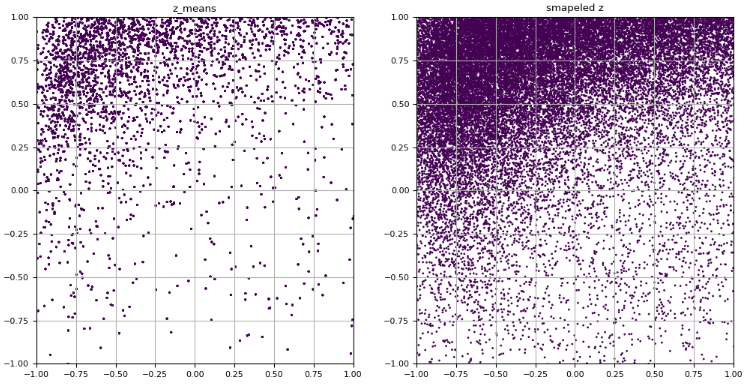

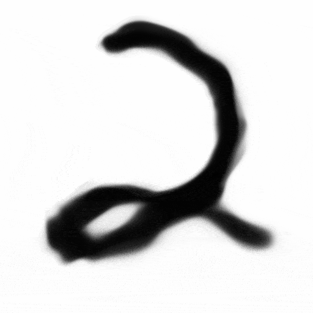

---

### 심화 확인 문제 — y와 z의 관계

생성 모델은 데이터의 생성확률 구조를 $p(x, y)$ 로 기술하고, 잠재변수 모델은 그것을 $p(x, z)$ 로 기술한다. **여기서 $y$ 와 $z$ 의 관계를 설명하라.**

$y$ 는 관측 가능한 의미적 변수(class, 상태, 진단 결과 등)이며 레이블이다. 따라서 $p(x,y)$ 는 데이터 $x$ 와 레이블 $y$ 가 함께 어떻게 생성되는가를 뜻한다. $z$ 는 관측되지 않는 잠재변수(생성 요인, 숨은 상태, 구조 변수)이며, $p(x,z)$ 는 데이터 $x$ 가 보이지 않는 생성 요인 $z$ 로부터 만들어짐을 뜻한다.

두 변수의 관계는 네 가지 경우로 나뉘며, 각각의 내용은 3.2.17에서 다룬다.

---

## 3.2.20 정리
<!-- 슬라이드 139~189 요약 -->

> **정리**
> - AE는 데이터를 잠재공간의 **점**으로 매핑하므로 그 공간에서 샘플링할 수학적 근거가 없다. VAE는 데이터를 **분포** $q(z \mid x)$ 로 매핑하여 진정한 잠재변수 모델이 된다.
> - 분포 표현은 데이터의 애매함을 버리지 않고 $\sigma^2(x)$ 에 담는다. 다만 이 $\sigma^2$ 는 현실의 물리적 불확실성이 아니라 **모델이 입력을 잠재공간에 배치하는 방식**이다.
> - 정답 사후분포 $p(z \mid x)$ 는 $p(x)=\int p(x \mid z)p(z)dz$ 의 적분 때문에 계산할 수 없다. 그래서 **변분추론**으로 $q(z \mid x)$ 를 학습하고, 그 유사도는 KL 발산으로 잰다.
> - $\log p(x) = D_{KL}(q(z \mid x)\|p(z \mid x)) + \text{ELBO}$ 이고 KL은 항상 0 이상이므로, 계산 가능한 **ELBO를 키우면** 계산 불가능한 KL이 줄어든다. 이것이 VAE 학습의 전부다.
> - ELBO를 부호 반전하면 VAE의 손실 $\mathrm{BiCE}(x,x') + D_{KL}(q\|p)$ 가 된다. 앞은 복원 품질을, 뒤는 잠재공간의 질서를 담당하며 둘은 서로 밀고 당긴다. β-VAE와 Sigma-VAE는 이 균형을 각각 수동·자동으로 조절하는 방법이다.
> - 샘플링은 미분되지 않으므로 $z = \mu + \sigma \odot \varepsilon$ 으로 무작위성을 $\varepsilon$ 에 격리하는 **재매개변수화 트릭**을 쓴다.
> - 분석의 관점에서 VAE의 가치는 이미지 생성이 아니라, 레이블 $y$ 없이도 잠재공간의 군집·연속성·중첩·분산을 통해 **데이터의 구조와 모호성을 드러내는 것**에 있다. 레이블의 타당성을 의심하는 일은 분석가의 몫으로 남는다.
