# 4.1 단일 출력(Deterministic Output)의 한계

**학습 목표**

- 회귀 모델이 조건부 분포 $p(y \mid x)$ 가 아니라 손실 함수가 요구하는 대표값을 출력한다는 사실을 설명할 수 있다.
- MSE, MAE, Pinball Loss, Gaussian NLL 각각의 최적해가 무엇인지 유도하고 구분할 수 있다.
- 회귀 모델의 세 가지 암묵적 가정(유일한 정답·등분산성·단일 모드)을 정의하고, 각 가정의 실패를 metric으로 진단할 수 있다.
- 이분산 회귀와 분위수 회귀의 구조·손실 함수·보정 지표를 설계하고, 두 방법이 무엇을 해결하고 무엇을 해결하지 못하는지 판단할 수 있다.
- 예측 구간의 보정(calibration)이 곧 데이터 구조의 설명이 아니라는 점을 coverage와 interval width를 함께 놓고 논증할 수 있다.

**이 절의 구성**

- 4.1.1 단일 출력(점 예측)의 한계와 불확실성 정량화
- 4.1.2 손실 함수와 최적 예측
- 4.1.3 회귀 모델의 세 가지 암묵적 가정
- 4.1.4 가정 실패를 감지하는 metric
- 4.1.5 실용적인 6개 metric과 해석 프레임
- 4.1.6 metric 사용 시의 주의사항
- 4.1.7 진단 metric을 학습 과정에 붙이기
- 4.1.8 단일 출력의 세 가지 실패 모드
- 4.1.9 불완전한 해법 ①: 이분산 회귀
- 4.1.10 보정(Calibration)과 그 한계
- 4.1.11 이분산 회귀를 직접 만들어 보기
- 4.1.12 불완전한 해법 ②: 분위수 회귀
- 4.1.13 분위수 회귀를 직접 만들어 보기
- 4.1.14 심화 과제
- 4.1.15 정리

> 실습 번호는 강의 슬라이드의 번호를 그대로 쓴다. 소절 번호와는 무관하다.

---

## 4.1.1 단일 출력(점 예측)의 한계와 불확실성 정량화
<!-- 슬라이드 193 -->

이 절이 던지는 질문은 하나다. **정답이 하나가 아니라면, 모델은 무엇을 예측해야 하는가?**

### 분포를 숫자 하나로 표현하는 일

많은 회귀 모델은 손실(loss)을 최소화하면서 조건부 분포 $p(y \mid x)$ 를 출력하는 것이 아니라, **그 분포의 대표값 하나**를 출력한다. 즉 모델이 내놓는 $\hat{y}$ 는 분포 전체가 아니라 분포를 한 점으로 압축한 결과다. 이것을 **점 예측(point prediction)** 이라 한다.

데이터가 다음과 같은 특성을 가지면 이 압축에서 문제가 발생한다.

- **정답이 여러 개인 경우 — 역문제(Inverse Problem), 다중 모드(multimodal)**
  같은 $x$ 에 대해 가능한 $y$ 가 여러 개 존재한다. 이때 평균을 내면 **"아무 정답도 아닌 값", 즉 데이터가 존재하지 않는 빈 공간**이 출력될 수 있다.
- **입력에 따라 노이즈 크기가 다른 경우 — 이분산(Heteroscedastic)**
  어떤 구간은 안정적이고 어떤 구간은 변동이 크다. 점 예측은 이 차이를 표현할 수단이 없으므로 **위험한 구간을 위험하다고 말하지 못한다.**
- **비대칭이거나 꼬리가 두꺼운 경우**
  평균만으로는 리스크와 극단값을 반영할 수 없다.

### 불확실성 정량화의 목표: 값 + 얼마나 흔들리는지

따라서 목표는 점 예측 $\hat{y}$ 하나를 잘 맞히는 것이 아니라, **값과 함께 그 값이 얼마나 흔들리는지를 같이 제공하는 것**이다. 최소한 다음 중 하나는 함께 출력해야 한다.

- **(A) 분산 / 표준편차**
  $\mu(x)$ 와 $\sigma(x)$ 를 같이 예측한다. "이 $x$ 에서는 오차가 커질 수 있다"를 수치로 표현하는 방식이다.
- **(B) 분위수(구간)**
  $q_{0.1}(x),\; q_{0.5}(x),\; q_{0.9}(x)$ 처럼 여러 분위수를 예측한다. 예측 구간을 직접 제공하는 방식이다.
- **(C) 혼합분포 예측**
  $p(y \mid x)$ 의 여러 mode를 직접 모델링한다. 가능한 정답들이 여러 덩어리로 존재함을 표현하는 방식이다.

### 불확실성의 두 종류

불확실성은 그 출처에 따라 둘로 나뉜다.

- **Aleatoric(우연적) 불확실성**: 데이터 자체가 가진 노이즈에서 나오는 불확실성이다. 대응 수단은 이분산 회귀와 분위수 회귀다.
- **Epistemic(인식론적) 불확실성**: 데이터가 부족하거나 모델이 부족해서 생기는 불확실성이다.

> **핵심 메시지**
> 점 예측은 분포를 숫자 하나로 붕괴시킨다. 문제는 그 숫자가 틀렸다는 것이 아니라,
> **그 숫자가 분포의 어떤 성질을 버렸는지 모델이 말해 주지 않는다는 것**이다.

---

## 4.1.2 손실 함수와 최적 예측
<!-- 슬라이드 194~195 -->

### 왜 모델은 평균을 내놓는가

딥러닝 회귀에서 **손실 함수의 선택은 곧 모델이 학습할 최적 예측 통계량의 선택**이다. 모델은 데이터가 가진 조건부 분포 $p(y \mid x)$ 를 예측하도록 학습되는 것이 아니라, **손실이 요구하는 대표값(또는 파라미터)을 맞추도록** 학습된다.

모델이 평균을 내놓는 이유는 모델 구조 때문이 아니다. **손실 함수의 수학적 성질에서 결정된다.** 그래서 손실 함수를 바꾸면 예측 대상 자체가 달라진다. 모델의 학습 특성은 구조보다 손실 함수에 달려 있다.

MSE 회귀는 $p(y \mid x)$ 가 복잡할수록 — 다중 모드이거나 비대칭일수록 — 문제가 커진다. 평균이 **실제 데이터가 존재하지 않는 값**을 가리킬 수 있기 때문이다. 따라서 필요에 따라 분산 $\sigma$, 분위수(구간), 나아가 분포 전체를 출력해야 한다.

여기서 **Gaussian NLL(Negative Log Likelihood)** 은 "정답이 이 분포에서 나올 가능도"를 손실로 삼는 방식이다.

아래 표는 손실 함수마다 최적해가 어떤 통계량이 되는지를 비교한 것이다.

| 손실 함수 $L(y, f(x))$ | 최적해 $f^{*}(x)$ | 직관적 의미 |
|---|---|---|
| MSE: $(y-f)^2$ | 조건부 평균 $\mathbb{E}[Y \mid X=x]$ | 분포의 무게중심(평균) |
| MAE: $\lvert y-f \rvert$ | 조건부 중앙값 $\mathrm{Median}[Y \mid X=x]$ | 분포의 중간 값 |
| Pinball Loss $(\tau)$ | 조건부 분위수 $q_{\tau}(x)$ | 분포의 $\tau$ 번째 분위점 |
| Gaussian NLL | 조건부 평균 + 분산 $(\mu(x), \sigma(x))$ | 분산(불확실성)까지 예측 |

### MSE의 최적해는 왜 조건부 평균인가

조건부 평균 $\mathbb{E}[Y \mid X=x]$ 가 MSE의 최적해가 되는 과정을 직접 유도해 본다.

**1) MSE Loss의 정의**

MSE를 최소화하는 함수 $f$ 를 찾는 문제는 다음과 같다.

$$\min_{f}\; \mathbb{E}\!\left[\left(y - f(x)\right)^2\right]$$

여기서 $f$ 는 각 $x$ 마다 값을 주는 함수이므로, 전체 기대값은 조건부 기대값의 기대값으로 분해된다.

$$\mathbb{E}\!\left[\left(Y - f(X)\right)^2\right] = \mathbb{E}_{X}\!\left[\; \mathbb{E}\!\left[\left(Y - f(X)\right)^2 \mid X \right] \right]$$

즉 전체 손실은 **$x$ 별 조건부 손실의 평균**이다. 따라서 전체를 최소화하려면 각 $x$ 에 대해 다음을 최소화하면 충분하다.

$$\min_{f(x)}\; \mathbb{E}\!\left[\left(y - f(x)\right)^2 \mid X = x\right]$$

**2) $x$ 를 고정하고 $f$ 에 대해 미분**

$x$ 를 고정한 뒤 편의상 $f = f(x)$ 를 상수처럼 놓으면, 조건부 손실은 다음과 같이 전개된다.

$$\mathbb{E}\!\left[(Y-f)^2 \mid X=x\right] = \mathbb{E}\!\left[Y^2 \mid x\right] - 2f\,\mathbb{E}\!\left[Y \mid x\right] + f^2$$

이를 $f$ 로 미분하고 0으로 놓으면

$$\frac{d}{df}\,\mathbb{E}\!\left[(Y-f)^2 \mid x\right] = -2\,\mathbb{E}\!\left[Y \mid x\right] + 2f = 0$$

$$\Rightarrow \quad f^{*}(x) = \mathbb{E}\!\left[Y \mid X=x\right]$$

즉 **조건부 평균이 MSE의 최적 예측**이 된다. 모델이 평균을 출력하는 것은 모델이 게을러서가 아니라, 손실 함수가 그렇게 하도록 요구했기 때문이다.

### VAE와 Gaussian NLL — 같은 도구, 다른 공간

두 방법 모두 분포 $N(\mu, \sigma^2)$ 를 학습해 불확실성을 다루지만, **그 분포가 놓이는 공간이 다르다.**

- **VAE**: 입력 $x$ 를 **잠재 공간(latent space)** 의 분포 $N(\mu, \sigma^2)$ 로 인코딩하여 불확실성을 다룬다.
- **Gaussian NLL**: 입력 $x$ 를 **출력 공간(output space)** 의 분포 $N(\mu, \sigma^2)$ 로 인코딩하여 불확실성을 다룬다.

---

## 4.1.3 회귀 모델의 세 가지 암묵적 가정
<!-- 슬라이드 196~197 -->

일반적인 회귀 모델 $Y = f(X) + \varepsilon$ 는 세 가지 가정을 암묵적으로 깔고 있다. **하나라도 성립하지 않으면 단일 출력 회귀는 실패한다.**

- **유일한 정답 가정이 깨지면**: 어떤 정답도 정확하게 표현할 수 없다.
- **등분산성 가정이 깨지면**: 분산이 큰 구간은 과소 추정되고, 분산이 작은 구간은 과대 추정된다.
- **단일 모드 가정이 깨지면**: 데이터가 없는 빈 공간을 예측할 가능성이 생긴다.

아래 표는 각 가정의 수식 표현과, 그 가정이 무너지는 상황을 정리한 것이다.

| 가정 | 수식 표현 | 언제 무너지는가 |
|---|---|---|
| 유일한 정답 | 각 $x$ 에 대해 $y^{*}$ 가 하나 존재 | Inverse problem: 하나의 $x$ 에 여러 $y$ 가 대응 |
| 등분산성 | $\mathrm{Var}(\varepsilon) = \sigma^2$ (상수) | Heteroscedastic: 분산이 $x$ 에 따라 변화 |
| 단일 모드 | $p(y \mid x)$ 가 하나의 mode를 가짐 | Multi-modal 조건부 분포: $x$ 에 따라 두 개 이상의 mode 존재 |

### 가정의 실패를 metric으로 진단한다

가정이 무너지고 있다는 사실은 손실 값만 보아서는 알 수 없다. **별도의 metric 함수를 통해 어떤 가정이 실패하고 있는지 모니터링해야 한다.** 그리고 이 진단을 통해 모델 설계를 바꿔야 한다는 신호, 즉 **출력(output) 또는 손실(loss) 함수를 바꿔야 한다는 신호**를 감지해야 한다.

| 암묵적 가정 | 사용 가능한 metric | 가정 실패의 신호 |
|---|---|---|
| **유일한 정답** — $x$ 에 대해 $y^{*}$ 가 하나 | 비슷한 입력에서 target의 퍼짐 정도 · Local Target Variance · Duplicate/Near-duplicate Disagreement · Irreducible Local Error Floor | 비슷한 $x$ 에 대해 하나의 $y$ 라는 가정이 실패: 비슷한 입력에서 다른 출력이 자주 나옴, 즉 one-to-many 관계의 가능성 |
| **등분산성** — $\mathrm{Var}(\varepsilon \mid x) = \sigma^2$ (상수) | 잔차가 입력 또는 출력 값에 따라 달라지는 정도 · Residual Magnitude Correlation · Bin-wise Residual Variance Ratio · Error Model Predictability | 출력 변동 $\mathrm{Var}(y \mid x)$ 의 일정함이 실패: 어떤 구간은 매우 흔들림, 즉 조건부 분산이 입력에 따라 달라짐 |
| **단일 모드** — $p(y \mid x)$ 가 하나의 봉우리 | mode의 수를 직접 확인 · Local GMM BIC gap · Dip Test / Silverman Test on Local Targets · Residual Sign Mixing Pattern | $p(y \mid x)$ 의 single mode 가정이 실패: 같은 입력에서 결과가 군집으로 갈라짐, 즉 multimodal conditional output |

---

## 4.1.4 가정 실패를 감지하는 metric
<!-- 슬라이드 198~200 -->

### 유일한 정답 가정의 실패 — 비슷한 입력에서 target의 퍼짐

**Local Target Variance** 는 각 샘플 $x_i$ 주변의 유사 샘플 집합 $N_k(i)$ 를 찾고, 그들의 $y$ 분산을 확인하는 metric이다.

$$M_{\text{unique}}^{(1)} = \frac{1}{n}\sum_{i=1}^{n} \mathrm{Var}\!\left(\left\{\, y_j : j \in N_k(i) \,\right\}\right)$$

해석은 단순하다.

- 값이 **작다** → 비슷한 입력은 대체로 비슷한 출력을 가진다.
- 값이 **크다** → 비슷한 입력인데도 출력이 여러 방향으로 퍼져 있다.

이 metric은 매우 기본적이면서도 강력하다. 장점은 두 가지다. 첫째, **모델이 못 배운 것인지 아니면 데이터가 원래 one-to-many인지**를 구분하는 첫 단서를 준다. 둘째, 잔차(residual)가 아니라 **target 자체의 구조**를 본다는 점이 중요하다.

**Learned Local Target Variance** 는 여기서 한 걸음 더 나간다. 이웃을 원래 입력 공간이 아니라 **학습된 표현 공간에서** 정의한다. 학습 시점 $t$ 에서 $z_i(t) = h_{\theta_t}(x_i)$ 를 구하고, 이 공간에서 kNN을 재정의한다.

$$N_k^{(t)}(i) = \text{kNN of } z_i^{(t)}$$

따라서 neighborhood는 epoch마다 달라진다. 이 값이 알려 주는 것은 **모델이 현재 어떤 샘플들을 서로 비슷하다고 보고 있는가**이다. 해석은 다음과 같다.

- 점차 **감소** → 모델이 비슷한 target을 가진 샘플들을 더 잘 모으고 있다.
- 계속 **높은 수준** → 모델이 어떤 식으로 묶어도 target의 퍼짐이 크다. 즉 유일한 정답 가정이 약하다.

### 등분산성 가정의 실패 — 구간별 잔차 분산의 차이

**Bin-wise Residual Variance Ratio** 는 입력에 대한 오차 분산의 최대/최소 비율이다. 예측값 $\hat{y}$ 또는 특정 feature를 여러 구간(bin)으로 나눈 뒤, 구간별 잔차 분산을 비교한다.

$$M_{\text{hetero}}^{(2)} = \frac{\max_{b} \mathrm{Var}(e \mid b)}{\min_{b} \mathrm{Var}(e \mid b) + \varepsilon}$$

해석은 다음과 같다.

- 1에 가까우면 등분산에 가깝다.
- 값이 크면 구간별 오차 분산의 차이가 크다.
- 학습 후반에 이 값이 크다면, **평균 구조를 잘 맞추더라도 구간별 불확실성의 크기가 서로 다르다**는 뜻이다.

여기에 **절대오차와 예측값의 상관도(Correlation between absolute residuals and fitted values)** 를 함께 본다.

$$\mathrm{Corr}\!\left(\lvert e \rvert,\; \hat{y}\right)$$

이 값은 분포의 복잡성과 그 변동을 확인하는 데 쓰인다. $\hat{y}$ 가 커질수록 $\lvert e \rvert$ 가 벌어지면 잔차 산점도가 **부채꼴 분포**로 나타난다.

### 단일 모드 가정의 실패 — mode의 수를 직접 확인

**Local Target GMM gap** 은 국소 분포를 1개 Gaussian으로 설명하는 것과 2개 Gaussian 혼합으로 설명하는 것을 직접 비교한다. 각 샘플 주변 $N_k(i)$ 의 target(데이터셋 진단용) 또는 residual(학습과정 진단용)에 대해

- 1개 Gaussian
- 2개 Gaussian mixture

두 모델을 fitting하고 BIC 또는 AIC를 비교한다.

$$\Delta \mathrm{BIC}_i = \mathrm{BIC}(\text{1-Gaussian on } y) - \mathrm{BIC}(\text{2-Gaussian on } y) \quad \text{: Dataset 진단}$$

$$\Delta \mathrm{BIC}_i = \mathrm{BIC}(\text{1-Gaussian on } e) - \mathrm{BIC}(\text{2-Gaussian on } e) \quad \text{: 학습과정 진단}$$

전체 metric은 이 값들의 평균이다. 해석은 다음과 같다.

- 값이 작거나 음수이면 단일 Gaussian으로 충분하다.
- 값이 크면 2개 성분이 더 적합하다. 즉 **단일 모드 가정이 약하다.**

단일 모드 실패를 판단하는 데는 이 metric이 가장 직접적이다.

여기에도 학습된 표현 공간을 쓰는 변형이 있다. **Learned Local Target GMM gap** 은 학습 step $t$ 에서 $z_i(t) = h_{\theta_t}(x_i)$ 를 구하고 이 잠재 공간에서 kNN을 재정의하므로, neighborhood가 epoch마다 달라진다. **Learned Local Residual GMM BIC gap** 에서는 residual도 바뀌고 neighborhood도 함께 바뀐다.

> **구현 참고**
> BIC는 GaussianMixture를 fitting한 뒤 그 결과에서 바로 가져올 수 있다.

---

## 4.1.5 실용적인 6개 metric과 해석 프레임
<!-- 슬라이드 201~202 -->

실제 학습 과정에서 모니터링할 만한 metric을 여섯 개로 추린다.

- **기본 학습 지표**
  - validation RMSE
  - validation MAE
- **가정 진단 지표**
  - **Learned Local Target Variance** — 유일한 정답 가정의 실패 감지
  - **Residual Variance Ratio across bins** — 등분산성 실패 감지
  - $\mathrm{Corr}(\lvert e \rvert, \hat{y})$ — 이분산 구조의 보강 확인
  - **Local GMM BIC gap** — 단일 모드 실패 감지

이 값들은 따로 읽는 것이 아니라 **RMSE와 짝지어 읽어야** 의미가 생긴다. 아래 표는 상황별 해석 프레임이다.

| 상황 | 해석 |
|---|---|
| RMSE 높고 Learned Local target variance 낮음 | 모델이 못 배운 것일 가능성이 크다 |
| RMSE 높고 Learned Local target variance도 높음 | 애초에 유일한 정답 구조가 약하다 |
| RMSE는 보통인데 Learned Variance ratio 큼 | 평균은 맞추지만 분산 구조를 놓치고 있다 |
| RMSE는 보통인데 Learned target GMM gap 큼 | 평균 회귀가 여러 모드를 하나로 눌러 버리고 있다 |
| Learned Local residual variance는 중간 | 출력은 하나일 수 있어도 불확실성의 크기가 구간별로 다르다 |
| 절대오차와 예측값 상관도의 변화가 큼 | 복잡한 feature 조합의 가능성이 있다 |

### 낮음과 높음의 기준

이 해석 프레임의 약점은 **"낮음"과 "높음"의 기준이 불명확하다**는 점이다. 절대적인 임계값은 없으며 경험적 요소가 필요하다. 판단의 근거는 다음 네 가지다.

- epoch에 따른 추세
- 다른 모델과의 비교(상대적 성능)
- 베이스라인과의 비교
- 부호 확인

metric별로 보는 방식은 다음과 같다.

**Learned Local Target Variance**

- 초반 대비 충분히 감소했는가
- 후반에 높은 수준에서 정체하는가
- 다른 데이터셋이나 모델보다 상대적으로 큰가
- 감소 추세이면 → representation이 target 기준으로 정리되고 있다.
- 높은 수준에서 정체하면 → 유일한 정답 가정이 약하거나 local uncertainty가 크다.

**Learned Local Target GMM BIC gap**

- 부호를 먼저 본다.
- 값이 얼마나 안정적으로 유지되는지를 본다.
- 계속 음수 → 평균적으로 단일 모드다.
- 0 근처에서 출렁임 → 약한 혼합 구조의 가능성이 있다.
- 양수 유지 → 다중 모드의 강한 신호다.

**(Bin-wise) Residual Variance Ratio** — target의 스케일과 binning 방식에 따라 값이 변동적이므로 대략의 눈금으로 읽는다.

- 1에 가까움: 등분산에 가깝다.
- 2 전후 이상: 이분산성이 의심된다.
- 3 이상이 안정적으로 유지: 이분산성이 꽤 강하다.
- 4~5 이상이 반복: 이분산 구조가 매우 강하다.

**절대오차와 예측값의 상관도** — 상대적으로 해석이 명확한 편이다.

- $\lvert r \rvert < 0.1$: 거의 약함
- $0.1 \sim 0.3$: 약함에서 중간
- $0.3 \sim 0.5$: 중간 이상
- $> 0.5$: 강함

---

## 4.1.6 metric 사용 시의 주의사항
<!-- 슬라이드 203 -->

진단 metric은 만능이 아니다. 다음 조건들이 지켜지지 않으면 잘못된 결론으로 이어진다.

- **metric은 모델이 충분히 학습된 뒤에야 의미가 있다.** 초기 epoch의 값은 엉망이다.
- **validation set에서 계산해야 의미가 있다.** train residual은 과적합 때문에 왜곡된다.
- **모델 용량이 너무 작지 않아야 한다.** underfitting을 가정 실패로 착각해서는 안 된다.
- **neighborhood 정의를 신중히 해야 한다.** 유사 입력을 판단하는 방식이 나쁘면 metric도 나빠진다.
- **단일 모드 실패와 이분산을 혼동하지 않도록 주의해야 한다.** 퍼짐이 큰 것과 봉우리가 여러 개인 것은 다른 현상이다.

> **정리**
> 단일 출력 회귀 모델은 언제나 하나의 답을 출력한다.
> 그러나 학습 과정에서 residual과 local target distribution을 함께 보면,
> 데이터가 정말 하나의 답을 가지는지, 흔들림의 크기가 일정한지,
> 출력이 하나의 봉우리로 설명되는지를 따로 점검할 수 있다.
> 즉 **모델은 하나의 답을 학습하고, metric은 그 "하나의 답"이라는 가정이 맞는지 검증한다.**

---

## 4.1.7 진단 metric을 학습 과정에 붙이기
<!-- 슬라이드 204~205 -->

여기까지가 세 가정과 그 실패를 재는 도구다. 이제 그 도구를 실제 학습 과정에 붙여 본다. 이 실습의 목적은 성능이 아니라 **metric이 학습 도중에 어떤 궤적을 그리는지**를 확인하는 것이다.

### 실습 4.1.1 — MSE에 대한 metric 함수 분석

> 노트북: `code/4.1.1.Matrics.ipynb`

임의의 Dataset A, B를 생성하고, 이 데이터셋을 학습시키며 다양한 metric 함수의 결과를 분석한다. 간단한 회귀 모델을 학습하면서 다음 metric 함수들을 모니터링하고 해석한다.

- RMSE, MAE
- Learned Local Target Variance
- Residual Variance Ratio
- Learned Local Target GMM gap
- Learned Local Residual GMM BIC gap

**① 두 개의 데이터셋**

Dataset A는 세 가지 구조를 일부러 심어 놓은 합성 데이터다. 평균 구조는 매끈하게 두고, 그 위에 이분산 구조($x_0$ 의 부호에 따라 $\sigma$ 가 달라진다)와 다중모드 구조($x_3 > 1$ 인 영역에서 target이 $\pm 2$ 로 갈라진다)를 얹었다. 앞 소절에서 정의한 세 가정이 각각 어디서 깨지는지를 미리 알고 있는 데이터인 셈이다.

```python
# =========================================================
# Dataset A
# =========================================================
def make_dummy_data_A(n=3000, d=8, seed=123):
    rng = np.random.default_rng(seed)
    X = rng.normal(size=(n, d)).astype(np.float32)

    # 평균 구조
    mu = 2.0 * X[:, 0] - 1.5 * X[:, 1] + 0.7 * np.sin(2.0 * X[:, 2])

    # 이분산 구조
    sigma = 0.25 + 0.9 * (X[:, 0] > 0).astype(np.float32)

    # 다중모드 구조
    mode_shift = np.where(
        X[:, 3] > 1.0,
        rng.choice([-2.0, 2.0], size=n),
        0.0
    )

    y = mu + mode_shift + rng.normal(0.0, sigma, size=n)
    y = y.astype(np.float32)

    split = int(n * 0.8)
    return X[:split], y[:split], X[split:], y[split:]
```

Dataset B는 같은 세 구조를 더 강하고 더 국소적으로 심은, Dataset A보다 복잡한 데이터다. 다중모드 영역과 이분산 영역을 입력 공간의 서로 다른 조건으로 분리해 놓았고, 나머지 영역에는 아주 약한 잡음만 남겼다.

```python
# =========================================================
# Dataset B : Dataset A 보다 복잡함
# =========================================================
def make_dummy_data_B(n=3000, d=8, seed=123, return_info=False):
    ...
    # 1. 기본 평균 구조 — 회귀모델이 학습할 수 있는 비교적 매끈한 mean function
    mu = 2.4 * x0 - 1.8 * x1 + 0.9 * np.sin(1.8 * x2) + 0.5 * x0 * x2

    # 2. 다중모드 영역 — 같은 local 조건에서 y가 두 개 봉우리로 갈라지게 만듦
    region_multi = ((x3 > 0.2) & (x3 < 1.6) & (np.abs(x4) < 0.8))
    mode_shift[region_multi] = rng.choice([-5.0, 5.0], size=np.sum(region_multi))
    mode_shift[region_multi] += 0.6 * x7[region_multi]   # mode 내부의 local variation

    # 3. 이분산 영역 — local target은 단일모드여도 구간마다 noise scale이 크게 달라짐
    region_hetero = (~region_multi) & (x5 > 0.0)
    sigma[region_hetero] = 0.35 + 1.35 / (1.0 + np.exp(-2.5 * x6[region_hetero]))

    # 나머지 영역은 약한 잡음만 부여
    region_simple = (~region_multi) & (~region_hetero)
    sigma[region_simple] = 0.10 + 0.05 * np.abs(x7[region_simple])

    # 4. 최종 y 생성
    y = mu + mode_shift + rng.normal(0.0, sigma, size=n)
```

**② 모델**

단일 출력 회귀 모델을 구성하되, 마지막 은닉층을 `representation` 이라는 이름의 layer로 명시해 **학습된 표현 공간을 뽑아낼 수 있도록** 만든다.

```python
# =========================================================
# 1) Functional 회귀 모델
#    - penultimate layer를 representation으로 명시
# =========================================================
def build_regression_model(input_dim: int) -> keras.Model:
    inputs = keras.Input(shape=(input_dim,), name="features")
    x = layers.Dense(128, activation="relu")(inputs)
    x = layers.Dense(64, activation="relu")(x)
    x = layers.Dense(32, activation="relu")(x)

    # 학습된 표현공간
    representation = layers.Dense(16, activation=None, name="representation")(x)

    outputs = layers.Dense(1, name="y_hat")(representation)
    model = keras.Model(inputs=inputs, outputs=outputs, name="single_output_regressor")
    return model
```

<!-- 슬라이드 206 -->

**③ Latent representation 추출 모델**

학습 중에 내부 representation을 추출하기 위한 서브 모델을 만든다. 학습이 시작될 때 원 모델의 입력과 `representation` layer의 출력을 연결한 별도의 모델을 구성한다.

```python
    def on_train_begin(self, logs=None):
        # 학습 모델에서 representation 출력용 서브모델 생성
        self.rep_model = keras.Model(
            inputs=self.model.input,
            outputs=self.model.get_layer(self.rep_layer_name).output,
            name="representation_extractor"
        )
```

각 epoch의 끝에서 validation 데이터에 대한 잔차 값과 representation layer의 출력을 추출한다. 여기에 더해 representation 공간에서 인접한 20개의 neighborhood 인덱스를 추출하고, 각 metric 함수에 맞도록 $y$, $\hat{y}$, residual, neighborhood 인덱스를 전달한다.

```python
    def on_epoch_end(self, epoch, logs=None):
        # 1) 현재 epoch의 예측
        y_pred = self.model.predict(self.x_val, verbose=0).reshape(-1)
        residuals = self.y_val - y_pred

        # 2) 현재 epoch의 learned representation
        z_val = self.rep_model.predict(self.x_val, verbose=0)

        # 3) learned space 기준 neighborhood 재구성
        neighbor_idx = self._build_neighbors_in_learned_space(z_val)
```

이웃을 다시 잡는 부분은 별도의 헬퍼로 두었다. epoch마다 representation이 바뀌므로 kNN도 매 epoch 다시 계산해야 한다.

```python
    def _build_neighbors_in_learned_space(self, z_val):
        """epoch마다 representation이 바뀌므로, 매 epoch마다 learned space에서 kNN 재계산"""
        # representation scale 안정화
        scaler = StandardScaler()
        z_scaled = scaler.fit_transform(np.asarray(z_val, dtype=np.float32))

        nn = NearestNeighbors(
            n_neighbors=min(self.n_neighbors + 1, len(z_scaled)),
            metric="euclidean"
        )
        nn.fit(z_scaled)
        neighbor_idx = nn.kneighbors(z_scaled, return_distance=False)

        # 첫 번째는 자기 자신이므로 제거
        if neighbor_idx.shape[1] > 1:
            neighbor_idx = neighbor_idx[:, 1:]
        return neighbor_idx
```

<!-- 슬라이드 207 -->

**④ metric 함수 호출**

수집한 값들을 각 진단 metric 함수에 넘겨 하나의 딕셔너리로 모은다. 유일한 정답 가정, 단일 모드 가정, 등분산성 가정에 각각 대응하는 항목이 한 자리에 모인다.

```python
        # 4) 목적에 맞는 동적 metric 계산
        diag = {
            # 유일한 정답 가정: learned neighborhood 안에서 target dispersion
            "val_learned_local_target_var":
                self._mean_local_variance(self.y_val, neighbor_idx),

            # 단일 모드 가정: learned neighborhood 안에서 local target multimodality
            "val_learned_local_target_gmm_bic_gap":
                self._mean_local_gmm_bic_gap(self.y_val, neighbor_idx),

            # 등분산성 가정: prediction bins 별 residual variance 차이
            "val_resid_var_ratio":
                self._residual_variance_ratio(y_pred, residuals),

            # 단일 출력 회귀가 남긴 local multimodal residual 구조
            "val_learned_local_resid_gmm_bic_gap":
                self._mean_local_gmm_bic_gap(residuals, neighbor_idx),

            # 선택적
            "val_abs_err_pred_corr": self._safe_corr(np.abs(residuals), y_pred),
        }

        for k, v in diag.items():
            logs[k] = v
```

이 계산은 **Callback을 통해 호출한다.** 이웃 개수, bin 개수, GMM 표본 크기 등을 인자로 지정한다.

```python
class LearnedStructureMetrics(keras.callbacks.Callback):
    """
    목적:
      학습이 진행되면서 representation space가 바뀌는 것을 이용해,
      dataset 구조에 대한 힌트를 동적으로 얻는다.
    """
    def __init__(self, x_val, y_val,
                 rep_layer_name: str = "representation",
                 n_neighbors: int = 20,
                 n_bins: int = 10,
                 min_bin_count: int = 20,
                 gmm_sample_size: int = 300,
                 compute_every_n_epochs: int = 1,
                 random_state: int = 42):
        ...


learned_diag_cb = LearnedStructureMetrics(
    x_val=X_val,
    y_val=y_val,
    rep_layer_name="representation",
    n_neighbors=20,
    n_bins=10,
    min_bin_count=20,
    gmm_sample_size=300,
    compute_every_n_epochs=1,
    random_state=42,
)
```

GMM BIC gap과 구간별 잔차 분산비는 앞 소절의 정의를 그대로 옮긴 것이다. 국소 이웃마다 1-Gaussian과 2-Gaussian을 fitting해 BIC 차이를 평균하고, 예측값을 분위수로 나눈 bin마다 잔차 분산을 구해 최대/최소 비를 잡는다.

```python
    def _mean_local_gmm_bic_gap(self, values, neighbor_idx):
        """local values에 대해 BIC(1-Gaussian) - BIC(2-Gaussian) 평균값 반환"""
        ...
        gmm1 = GaussianMixture(n_components=1, random_state=self.random_state)
        gmm2 = GaussianMixture(n_components=2, random_state=self.random_state)
        gmm1.fit(local_vals)
        gmm2.fit(local_vals)
        bic_gaps.append(float(gmm1.bic(local_vals) - gmm2.bic(local_vals)))
        ...

    def _residual_variance_ratio(self, y_pred, residuals):
        quantiles = np.linspace(0.0, 1.0, self.n_bins + 1)
        edges = np.unique(np.quantile(y_pred, quantiles))
        ...
        return float(max_var / min_var)
```

<!-- 슬라이드 208 -->

**⑤ 학습(Train)**

손실은 MSE로 두고, 기본 지표로 RMSE와 MAE를 함께 기록한다. 앞에서 만든 진단 콜백을 `callbacks` 에 넣어 학습을 진행한다.

```python
model = build_regression_model(input_dim=X_train.shape[1])

model.compile(
    optimizer=keras.optimizers.Adam(1e-3),
    loss="mse",
    metrics=[
        keras.metrics.RootMeanSquaredError(name="rmse"),
        keras.metrics.MeanAbsoluteError(name="mae"), ], )

history = model.fit(
    X_train,
    y_train,
    validation_data=(X_val, y_val),
    epochs=20,
    batch_size=128,
    callbacks=[learned_diag_cb],
    verbose=1, )
```

<!-- 슬라이드 209~210 -->

### 결과: Dataset A의 Validation 분석

**Loss** 는 초기에 크게 떨어진 뒤 빠르게 평탄해진다. 모델이 큰 평균 구조는 초반에 빨리 잡고, 그 이후에는 남는 오차가 쉽게 줄지 않는다는 뜻이다. 즉 **단일 출력 회귀가 학습할 수 있는 평균 구조는 이미 학습되었다.**

**Learned local target variance** 도 초기에 빠르게 떨어진 뒤 후반에는 그 수준을 유지한다. 이 값은 표현 공간에서 가까운 샘플들의 target 분산이므로, 초반의 급감은 representation이 빠르게 정리되었다는 뜻이고, 후반의 정체는 **local target의 퍼짐이 해결되지 않았다**는 뜻이다. 모델이 한데 모아 놓은 샘플들 안에도 여전히 퍼짐이 남아 있다.

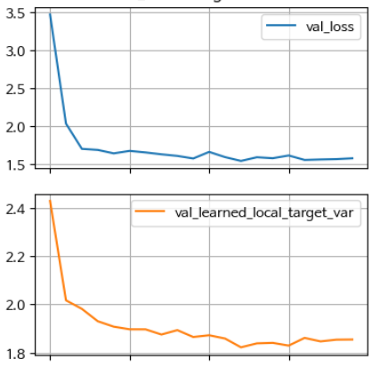

*그림 4-1. Loss와 Learned local target variance의 epoch별 추이.*

**Residual Variance Ratio** 는 예측값 구간별 잔차 분산의 최대/최소 비율이며, 숫자가 클수록 이분산성이 강하다. 이 실험에서는 **2.7에서 시작해 4~5 수준까지 올라가고 꽤 높은 수준을 유지한다.** 즉 모델이 평균 구조를 더 잘 맞출수록 더 불확실한 영역과 덜 불확실한 영역의 차이가 커진다. 데이터가 상당한 이분산성을 가지고 있다는 신호다.

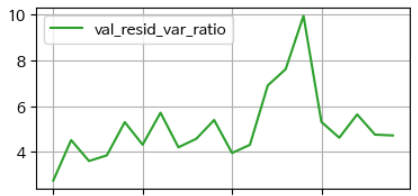

*그림 4-2. 구간별 잔차 분산 비율의 추이.*

**Learned Local target GMM BIC gap** 은 전 구간에서 계속 음수이며 $-5.6 \sim -4.4$ 범위에 머문다. 이 값은 $\mathrm{BIC}(\text{1-Gaussian}) - \mathrm{BIC}(\text{2-Gaussian})$ 이므로, 음수라는 것은 1-Gaussian이 더 낫다는 뜻이다. 즉 학습된 표현 공간에서 가까운 샘플들의 target 분포는 **2모드보다 1모드로 설명되는 편이 좋다.**

**Learned Local residual GMM BIC gap** 도 전 구간에서 음수이며 $-5.7 \sim -3.6$ 범위다. 평균적으로 2모드보다 1모드에 가깝다. residual의 local 분포가 다중 모드는 아니라는 뜻이며, **남는 오차의 핵심은 봉우리의 수보다 퍼짐의 크기 차이에 있다.**

**절대오차와 예측값의 상관도** 는 초기 이후 거의 $0.24 \sim 0.29$ 의 안정적인 양의 상관을 보인다. 예측값이 커질수록 절대오차도 커지는 경향이 있다는 뜻이다. 이분산성이 출력 수준 또는 그와 연관된 입력 구간에 따라 **비교적 일관되게 증가하는 구조**임을 보여준다.

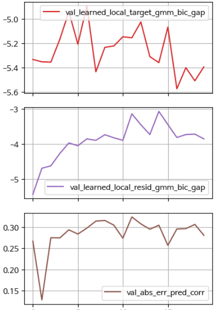

*그림 4-3. GMM BIC gap 두 종류와 절대오차–예측값 상관도의 추이.*

> **읽는 법**
> 이 실험에서 세 가정 중 실제로 흔들리는 것은 **등분산성**이다. 두 GMM BIC gap이 계속 음수이므로 단일 모드 가정은 유지되고, learned local target variance가 높은 수준에서 정체하므로 유일한 정답 가정은 약해져 있다. 남는 오차의 정체는 봉우리의 수가 아니라 **퍼짐의 크기 차이**다.

---

## 4.1.8 단일 출력의 세 가지 실패 모드
<!-- 슬라이드 211~213 -->

### ① Inverse Problem — 결과에서 원인을 추정하는 문제

로봇 팔의 운동을 예로 들면 두 방향의 문제를 구분할 수 있다.

- **Forward problem**: 관절 각을 알면 손끝의 위치를 알 수 있다.
- **Inverse problem**: 위치를 알면 관절 각을 알 수 있지만, **해가 두 개 존재한다.**

2-link 로봇 팔에서 입력은 위치 $(x_1, x_2)$ 두 개이고 출력은 각도 $(\theta_1, \theta_2)$ 두 개이지만, 같은 위치를 만드는 자세는 **elbow up과 elbow down 두 가지**다.

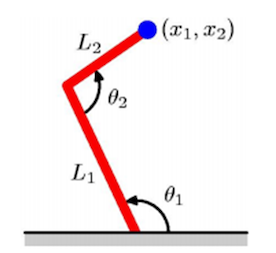

*그림 4-4. Forward problem — 관절 각에서 위치를 구한다.*

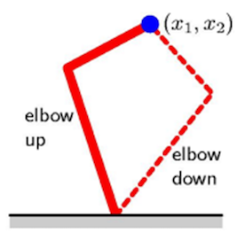

*그림 4-5. Inverse problem — 하나의 위치에 두 개의 해가 대응한다.*

**Inverse Problem의 정의**는 다음과 같다. 관측 $y$ 가 주어졌을 때, **그 관측을 생성했거나 설명하는 어떤 $x$ 를 추정하는 문제**다. 여기서 "어떤 $x$"는 입력 $x$ 일 수도 있고, 잠재 상태, 물리적 파라미터, 초기 조건, 구조적 원인, 숨은 feature일 수도 있다.

한 가지 오해를 짚어 둔다. **해가 여럿 존재하는 것(또는 multimodal인 것)은 Inverse Problem의 필요조건이 아니다.** 해가 하나뿐인 역문제도 얼마든지 존재한다.

### ② 이분산성(Heteroscedasticity)

선형 회귀의 기본 가정 중 하나는 데이터의 **등분산성(homoscedasticity)** 이다.

- **등분산성(homoscedasticity)**: 값의 표준편차가 어디서나 동일하다는 것이다.
- **이분산성(heteroscedasticity)**: 값의 분산에 변화가 있는 것이다. 그리고 **현실 데이터에는 이쪽이 훨씬 더 많다.**

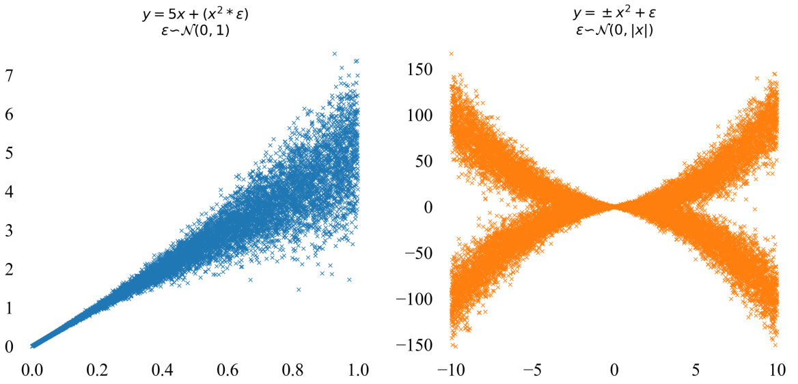

*그림 4-6. 입력에 따라 노이즈의 크기가 달라지는 데이터.*

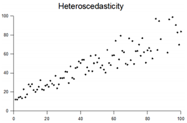

*그림 4-7. 분산이 상수로 유지되지 않는(Variance does not remain constant) 전형적인 형태.*

### ③ 다중 모드 분포(Multimodal distribution)

세 번째 실패 모드는 조건부 분포 자체가 봉우리를 여러 개 가지는 경우다. 예를 들어 다음과 같은 혼합 분포를 보자.

$$p(y \mid x) = 0.6 \cdot \mathcal{N}(-2,\, 0.5^2) + 0.4 \cdot \mathcal{N}(+2,\, 0.5^2)$$

이 분포의 평균은 $0.11$ 이다. 그런데 $y \approx 0.11$ 부근에는 **데이터가 거의 존재하지 않는다.**

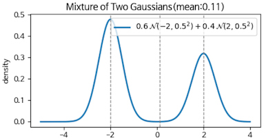

*그림 4-8. 평균이 데이터가 없는 자리를 가리키는 경우.*

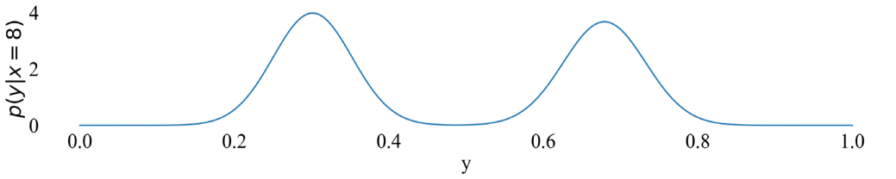

*그림 4-9. 봉우리 두 개 사이의 빈 공간.*

이때 모델은 **일관되게, 실제로는 존재하지 않는 값을 예측한다.** 이 출력은 어떤 의사결정에도 사용할 수 없는 완전히 잘못된 값이다. 더 중요한 점은, 이 실패는 뒤에서 다룰 **이분산 회귀나 분위수 회귀로도 해결되지 않는다**는 것이다.

봉우리가 두 개인 분포를 bimodal distribution, 셋 이상인 분포를 multimodal distribution이라 한다.

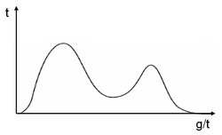

*그림 4-10. Bimodal distribution.*

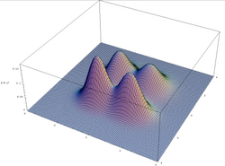

*그림 4-11. Multimodal distribution.*

---

## 4.1.9 불완전한 해법 ①: 이분산 회귀(Heteroscedastic Regression)
<!-- 슬라이드 214 -->

단일 출력의 실패에 대한 두 가지 불완전한 해법 중 첫 번째는 **이분산 회귀**다. 이 모델은 출력으로 평균 $\mu(x)$ 와 로그 표준편차 $\log \sigma(x)$ 두 가지를 예측한다. 즉 조건부 분포를 Gaussian으로 가정한다.

$$y \mid x \sim \mathcal{N}\!\left(\mu(x),\, \sigma^2(x)\right)$$

- $\mu(x)$: 입력 $x$ 에서의 조건부 평균
- $\sigma^2(x)$: 입력 $x$ 에서의 조건부 분산

즉 이분산 회귀는 **예상값과 그 예상값의 불확실성을 함께 주는 모델**이다.

모델은 두 값을 출력한다.

$$\text{model}(x) \;\longrightarrow\; \left(\mu(x),\, \sigma^2(x)\right)$$

여기서 구현상의 제약이 하나 있다. **분산은 양수여야 한다.** 그래서 $\sigma^2$ 를 직접 출력하지 않고 $\log \sigma^2(x)$ 혹은 $s(x)$ 를 출력한 뒤

$$\sigma^2(x) = \exp\!\left(s(x)\right)$$

로 변환해 사용한다.

### 손실 함수: Gaussian NLL

손실 함수로는 **Gaussian NLL(Negative Log-Likelihood)** 을 쓴다.

$$L(x, y) = \frac{1}{2}\log \sigma^2(x) + \frac{\left(y - \mu(x)\right)^2}{2\sigma^2(x)}$$

두 항의 역할이 서로를 견제한다.

- **첫 번째 항**은 분산을 무한정 크게 키우지 못하도록 제한한다.
- **두 번째 항**은 오차가 크면 손실을 증가시키되, 분산이 크면 그 오차를 어느 정도 허용한다.

이 균형 때문에 모델은 "정말로 불확실한 구간에서만" $\sigma$ 를 키우도록 학습된다.

---

## 4.1.10 보정(Calibration)과 그 한계
<!-- 슬라이드 215 -->

### 보정이란 무엇인가

**보정(calibration)** 은 모델이 예측한 불확실성의 수준과 실제 발생 비율이 일치하는 성질이다.

모델이 잘 보정되었다(well-calibrated)는 것은 coverage 지표로 확인한다. 예측 모델이 $x$ 에서 $y$ 의 90% 예측 구간을 $[L(x),\, U(x)]$ 로 제시했다면, **테스트 데이터의 90%가 이 구간 안에 들어와야 한다.**

보정을 평가하는 지표는 다음과 같다.

| 지표 | 정의 | 이상적 값 | 해석 |
|---|---|---|---|
| Coverage | 예측 구간이 실제 $y$ 를 포함한 비율 | 목표 $\tau$ (예: 90%) | Coverage $<\tau$: 구간이 좁다 = 과소신뢰 |
| Interval Width | 예측 구간의 평균 폭 $U(x) - L(x)$ | 작을수록 좋음 | Width가 크면 구간은 맞지만 정보 가치가 낮다 |
| Coverage Gap | $\lvert \text{Coverage} - \tau \rvert$ | 0에 가까울수록 좋음 | Coverage Gap이 크면 보정 실패 |

### 이분산 회귀 보정의 한계 — Gaussian 가정에 묶여 있다

이분산 회귀의 보정 지표는 **Gaussian 분포라는 기본 가정에 강하게 묶여 있다.**

- **가정 의존**: 데이터가 실제로 Gaussian 분포를 따를 때에만 정확한 보정이 달성된다.
- **추론 방식**: $\mu \pm 1.96\sigma$ 가 95% 구간이라는 계산 자체가 Gaussian 가정에서 유도된 것이다.
- **Gaussian 실패**: 꼬리가 두꺼운 분포에서는 극단값에 대한 coverage가 부족해진다.

### 분위수 회귀 보정의 한계 — 보정에는 강하지만 다중 모드에 취약하다

분위수 회귀는 보정, 특히 coverage에 강하다. 그러나 다중 모드에는 취약하다.

- **직접 최적화**: Pinball Loss가 coverage를 직접 목표로 삼아 최적화하므로, 분포 가정 없이 보정을 달성한다.
- **분포 무관**: 데이터 분포의 형태와 관계없이 정확한 coverage를 보장한다.
- **다중 모드 실패**: 두 mode 사이의 **빈 공간을 포함하는 넓은 구간**을 제공한다. coverage는 맞지만 정보 가치는 낮다.

> **주의**
> coverage가 맞았다는 사실만으로 모델이 데이터 구조를 잘 설명했다고 결론 내릴 수 없다.
> 보정은 반드시 **구간의 폭(width)과 함께** 해석해야 한다.

---

## 4.1.11 이분산 회귀를 직접 만들어 보기
<!-- 슬라이드 216~217 -->

### 실습 4.1.2 — 이분산 회귀(Heteroscedastic Regression)

> 노트북: `code/4.1.2HeteroscedasticRegression.ipynb`

이분산 데이터셋을 만들고 기본형 이분산 회귀 모델을 설계한다.

- FC Layer 4개로 구성된 모델을 설계한다.
- 모델의 출력 값으로 계산하는 NLL 손실 함수를 설계한다.
- 학습 후 test 데이터의 분포를 모델이 어떻게 예측했는지 확인한다.

**① 이분산 데이터 생성**

평균은 $\mu = 0.5x$ 로 직선이지만 표준편차는 $\sigma = 0.1 + 0.3x^2$ 로 $x$ 에 따라 변한다. 등분산성 가정이 깨져 있는 데이터를 일부러 만드는 것이다.

```python
def generate_heteroscedastic_data(n_samples=500, seed=42):
    """이분산 데이터 생성: σ ∝ x²"""
    np.random.seed(seed)

    x = np.random.uniform(-3, 3, n_samples)

    # 평균: μ = 0.5x
    mu = 0.5 * x
    # 표준편차: σ = 0.1 + 0.3*x²
    sigma = 0.1 + 0.3 * (x**2)
    # 관측값: y ~ N(μ, σ²)
    y = mu + sigma * np.random.randn(n_samples)

    return x.reshape(-1, 1), y, mu, sigma

X_het, y_het, mu_true, sigma_true = generate_heteroscedastic_data(n_samples=2000)
```

**② 모델 설계**

$\mu$ 와 $\sigma$ 를 동시에 예측하는 모델을 만든다. $\mu$ 출력에는 제약을 두지 않고, $\sigma$ 는 양수를 보장하기 위해 `log_sigma` 를 출력한 뒤 지수 변환한다. Keras 손실 함수와의 호환을 위해 두 출력을 하나로 결합한다.

```python
def build_heteroscedastic_model(input_dim=1):
    """μ와 σ를 동시에 예측하는 모델"""
    inputs = keras.Input(shape=(input_dim,))
    hidden = layers.Dense(64, activation='relu')(inputs)
    hidden = layers.Dense(32, activation='relu')(hidden)
    hidden = layers.Dense(16, activation='relu')(hidden)
    # μ 출력 (제약 없음)
    mu_output = layers.Dense(1, name='mu')(hidden)
    # σ 출력 (양수 보장: exp로 수치적으로 안정성 확보)
    log_sigma_output = layers.Dense(1, name='log_sigma')(hidden)
    sigma_output = layers.Lambda(lambda x: tf.math.exp(x)+1e-3,
                                 name='sigma')(log_sigma_output)
    # Keras 손실 함수와의 호환성을 위해 두 출력을 하나로 결합
    outputs = layers.Concatenate(axis=-1)([mu_output, sigma_output])
    model = keras.Model(inputs=inputs, outputs=outputs)
    return model
```

**③ NLL loss**

예측값 `y_pred` 를 $\mu$ 와 $\sigma$ 로 분리한 뒤 Gaussian NLL을 계산한다. 브로드캐스팅 오류를 막기 위해 `y_true` 의 형태를 맞추고, $\log$ 와 나눗셈에는 수치 안정성을 위한 작은 상수를 더한다. 4.1.9에서 본 두 항 $\tfrac12\log\sigma^2 + \tfrac{(y-\mu)^2}{2\sigma^2}$ 이 그대로 코드가 된다.

```python
# NLL 손실 함수
def nll_loss(y_true, y_pred):
    """음의 로그우도 손실, y_pred = (μ, σ) 형태의 예측값"""
    # 브로드캐스팅 오류 방지: y_true를 (batch_size, 1)로 형태 맞춤
    y_true = tf.reshape(y_true, (-1, 1))
    # y_pred에서 mu와 sigma 분리
    mu = y_pred[:, 0:1]
    sigma = y_pred[:, 1:2]
    # NLL = 0.5*log(σ²) + 0.5*(y-μ)²/σ²
    nll = 0.5*tf.math.log(sigma**2+1e-6)+0.5*((y_true-mu)**2)/(sigma**2+1e-6)
    return tf.reduce_mean(nll)
```

**④ Train**

앞서 정의한 NLL 손실로 컴파일하고 학습한다.

```python
het_model = build_heteroscedastic_model()

X_het_train, X_het_test, y_het_train, y_het_test = train_test_split(
    X_het, y_het, test_size=0.2, random_state=42
)

het_model.compile(optimizer='adam', loss=nll_loss)

history_het = het_model.fit(
    X_het_train, y_het_train,
    epochs=50,  batch_size=64,
    validation_split=0.2,
    verbose=1 )
```

학습 손실과 검증 손실은 모두 빠르게 떨어진 뒤 낮은 값에서 수렴한다.

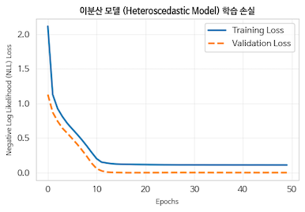

*그림 4-12. 이분산 모델의 NLL 학습 곡선.*

<!-- 슬라이드 218 -->

### 결과: 학습 데이터와 예측

학습에 사용한 데이터는 원점 근처에서 좁고 양쪽 끝으로 갈수록 넓어지는 이분산 구조를 가진다.

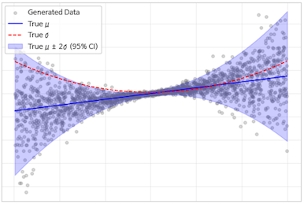

*그림 4-13. Train data — 실제 $\mu$ 와 $\sigma$ 의 구조.*

학습된 모델은 test 데이터에서도 같은 형태의 구조를 복원한다. 예측된 $\sigma$ 는 입력이 원점에서 멀어질수록 커지고, 그에 따라 예측 구간도 넓어진다. 예측은 모델이 내놓은 두 값을 그대로 쪼개어 쓴다.

```python
# 예측
predictions = het_model.predict(X_het_test, verbose=0)
mu_pred_het = predictions[:, 0]
sigma_pred_het = predictions[:, 1]

# 신뢰도 구간: μ ± 2σ
ax.fill_between(
    X_sorted,
    mu_sorted - 2*sigma_sorted,
    mu_sorted + 2*sigma_sorted,
    alpha=0.3, color='blue', label='μ ± 2σ (95% confidence)'
)
```

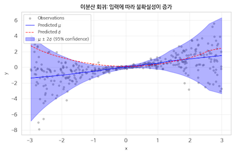

*그림 4-14. Test data — 입력에 따라 불확실성이 증가하는 예측.*

<!-- 슬라이드 219 -->

### 결과: 보정 지표

학습된 모델이 잘 보정되었는지를 네 가지 지표로 확인한다.

- **Coverage**: $x$ 축은 nominal coverage, $y$ 축은 empirical coverage다. 점들이 대각선 **위**에 있으면 구간이 좁은 것이고, 대각선 **아래**에 있으면 구간이 넓은 것이다.
- **Standardized Residuals(표준화 잔차)**: 분포가 $\mathcal{N}(0,1)$ 모양인가를 본다.
- **PIT(Probability Integral Transform) Histogram**: 균등분포인가를 본다. 분산과 평균의 균형을 동시에 확인할 수 있다.
  - U자 형태: 분산을 과소추정하고 있다.
  - $\cap$자 형태: 분산을 과대추정하고 있다.
  - 1 쪽에 치우침: 과소예측한 값이 많다.
  - 0 쪽에 치우침: 과대예측한 값이 많다.
- **Sharpness**: 예측이 날카롭고 좁은가를 본다.

Coverage는 nominal 수준마다 $z$ 값을 구해 구간을 만들고, 그 안에 실제 $y$ 가 들어오는 비율을 세면 된다.

```python
# Nominal Coverage 설정 (예: 10% ~ 90% 신뢰구간)
nominal_coverages = np.linspace(0.1, 0.99, 20)
empirical_coverages = []

for nominal in nominal_coverages:
    # 양측 검정에서의 z-score 계산
    alpha = 1 - nominal
    z_score = stats.norm.ppf(1 - alpha / 2)

    # 예측 구간 (Lower, Upper bound) 계산
    lower_bound = mu_pred - z_score * sigma_pred
    upper_bound = mu_pred + z_score * sigma_pred

    # 실제 값이 예측 구간에 포함되는 비율 계산 (Empirical Coverage)
    in_interval = np.logical_and(y_true >= lower_bound, y_true <= upper_bound)
    empirical_coverages.append(np.mean(in_interval))
```

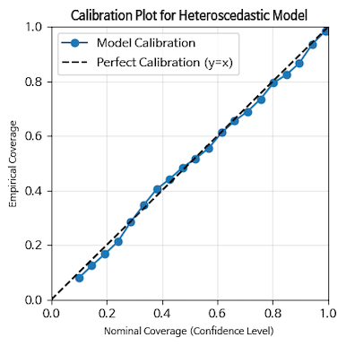

*그림 4-15. 이분산 모델의 coverage 곡선.*

나머지 세 지표는 표준화 잔차와 PIT 값에서 바로 나온다.

```python
# 1. Standardized Residuals 계산
std_residuals = (y_true - mu_pred) / sigma_pred

# 2. PIT (Probability Integral Transform) 계산
# 실제값이 예측 분포(정규분포) 내에서 어디에 위치하는지 누적확률(CDF)로 변환
pit_values = stats.norm.cdf(y_true, loc=mu_pred, scale=sigma_pred)

# (1) Standardized Residuals Histogram + 표준정규분포 곡선
# (2) PIT Histogram + 균등분포 기준선
# (3) Sharpness (Predicted Sigma Distribution)
```

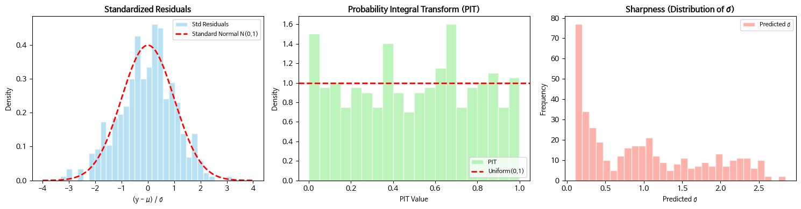

*그림 4-16. 표준화 잔차 · PIT 히스토그램 · Sharpness.*

---

## 4.1.12 불완전한 해법 ②: 분위수 회귀(Quantile Regression)
<!-- 슬라이드 220~222 -->

### 무엇을 예측하는가

분위수 회귀는 입력 $x$ 가 주어졌을 때 **$y$ 의 10%, 50%, 90% 지점이 어디인가**를 직접 예측한다. 분위수 $\tau$ 의 조건부 값을 예측하기 위해 비대칭 손실인 **Pinball Loss** 를 사용하며, **분포 가정 없이 여러 분위수를 동시에 학습**한다. 출력 공간을 분포의 여러 절단면으로 보는 접근이다.

**분위수의 정의**는 다음과 같다. 분위수 $\tau \in (0,1)$ 는 누적확률 기준의 위치를 가리킨다. $\tau = 0.1$ 은 10% 분위수, $\tau = 0.5$ 는 중앙값, $\tau = 0.9$ 는 90% 분위수다. 조건부 분위수 $Q_Y(\tau \mid X=x)$ 는 입력 $x$ 에 대하여 출력 $Y$ 가 그 값 이하일 확률이 $\tau$ 가 되는 지점이다.

$$P\!\left(Y \le Q_Y(\tau \mid X=x) \;\middle|\; X=x\right) = \tau$$

### 어떤 경우에 필요한가

평균만으로는 부족한 상황에서 분위수 회귀가 필요해진다.

- 같은 입력에서도 출력의 퍼짐이 다르다.
- 상위 위험 구간과 하위 안정 구간이 서로 다르다.
- 평균은 같아도 분포의 모양이 다르다.
- 이상치 때문에 평균이 왜곡된다.

실제 문제로 옮기면 다음과 같다.

- **병원 재원일수 예측**: 평균 재원일수보다 상위 90% 환자군의 길어진 체류가 더 중요할 수 있다.
- **매출 예측**: 평균만큼이나 최저 수준이나 상위 피크가 중요하다.
- **수요 예측**: 안전재고 설계에는 상위 분위수가 더 중요하다.
- **부동산 가격**: 평균 가격보다 하위/상위 가격대의 구조가 필요할 수 있다.

이때 분위수 회귀는 평균 하나 대신 **분포의 위치를 여러 층으로 나누어** 제공한다.

### 분위수 회귀의 목표와 Pinball Loss

목표는 평균 $\mu(x)$ 대신 여러 분위수 함수 $q_\tau(x)$ 를 직접 학습하는 것이다.

$$q_\tau(x) \approx Q_Y(\tau \mid X=x)$$

여러 개를 동시에 학습하면, 입력에 따라 출력 분포가 어떻게 변하는지를 분위수 기준으로 확인할 수 있다.

**Pinball Loss(또는 Check Loss)** 는 오차 $u = y - \hat{q}_\tau(x)$ 에 대해 다음과 같이 정의된다.

$$L_\tau(u) = \begin{cases} \tau\,u, & u \ge 0 \\[4pt] (\tau - 1)\,u, & u < 0 \end{cases}$$

간단히 쓰면 다음과 같다.

$$L_\tau(y, \hat{q}) = \max\!\left(\tau(y - \hat{q}),\; (\tau-1)(y - \hat{q})\right)$$

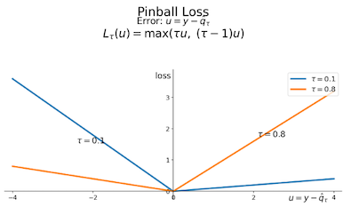

*그림 4-17. $\tau$ 에 따라 기울기가 달라지는 비대칭 손실.*

### 손실 함수 이해

Pinball Loss는 **과소예측과 과대예측을 비대칭적으로 벌점**한다.

- **$\tau = 0.9$ 인 경우** — 상위 90% 분위수를 맞추려는 학습이다.
  - 과소예측은 크게 벌점한다: $0.9(y - \hat{q})$
  - 과대예측은 덜 벌점한다: $-0.1(y - \hat{q})$
  - 결과적으로 **상위 경계선을 잡는 방향**으로 학습된다.
- **$\tau = 0.1$ 인 경우** — 하위 10% 분위수를 맞추려는 학습이다.
  - 과소예측은 덜 벌점한다: $0.1(y - \hat{q})$
  - 과대예측은 크게 벌점한다: $-0.9(y - \hat{q})$
  - 결과적으로 **하위 경계선을 잡는 방향**으로 학습된다.

즉 **$\tau$ 에 따라 서로 다른 손실 함수가 사용된다.**

### 이분산 회귀와 비교한 장점

- 정규분포를 강하게 가정하지 않아도 된다.
- 이상치에 상대적으로 강하다.
- 평균보다 극단값의 영향을 덜 직접적으로 받는다.
- 다양한 의사결정에 맞춤형 예측이 가능하다.
  - 보수적 예측: 하위 분위수
  - 전형적 예측: 중앙값
  - 리스크 대비: 상위 분위수
- 이분산 구조를 자연스럽게 볼 수 있다. 상하 분위수 사이의 간격이 입력에 따라 달라지는 모습이 곧 이분산 구조다.

### 분위수 회귀의 한계

**첫째, Quantile Crossing problem** 이 있다. 여러 분위수를 동시에 학습할 때 발생하는 문제로,

$$q_{0.1}(x) \le q_{0.5}(x) \le q_{0.9}(x)$$

라는 순서를 **보장하지 못한다.** 각 분위수가 독립적으로 학습되며, 분류에서와 같은 "sum to 1" 조건이 없기 때문이다.

두 개의 mode가 있는 분포, 즉 mode A는 작은 값 쪽에 mode B는 큰 값 쪽에 있고

$$p(y \mid x) = \pi_1 p_1(y) + \pi_2 p_2(y)$$

인 경우, 학습이 불안정하면 $q_{0.5}$ 는 한 mode로 끌리고 $q_{0.1}$ 또는 $q_{0.9}$ 가 반대편 mode로 튀는 현상이 발생한다. 그 결과 다음과 같은 역전이 나타난다.

$$q_{0.1}(x) > q_{0.5}(x) \quad \text{또는} \quad q_{0.5}(x) > q_{0.9}(x)$$

**둘째, 분위수는 분포의 경계 위치를 보여줄 뿐 데이터의 구조를 보여주지 않는다.** 동일한 분위수 값을 갖더라도 전혀 다른 분포일 수 있다. 또한 간격이 넓게 나왔을 때 **왜 넓어졌는지, 즉 왜 불확실한지를 설명하지 못한다.**

> **핵심 메시지**
> 분위수 회귀는 데이터 구조를 보는 진단 도구가 아니라, **결과를 요약하는 도구**다.

---

## 4.1.13 분위수 회귀를 직접 만들어 보기
<!-- 슬라이드 223~224 -->

### 실습 4.1.3 — 분위수 회귀(Quantile Regression)

> 노트북: `code/4.1.3.QuantileRegression.ipynb`

이분산 회귀와 동일한 이분산 데이터셋을 만들고, 기본형 분위수 회귀 모델을 설계한다.

- FC Layer 3개로 구성된 모델을 설계한다.
- 분위수의 종류에 따라 필요한 출력 layer를 갖추어야 한다.
- Pinball Loss 함수를 만들고, 분위수 값 $\tau$ 에 따라 서로 다른 형태의 손실을 적용한다.
- 학습 후 test 데이터의 분포를 모델이 어떻게 예측했는지 확인한다.

데이터는 실습 4.1.2와 같은 `generate_heteroscedastic_data()` 를 그대로 쓴다. 같은 데이터에 두 방법을 걸어 보아야 비교가 성립하기 때문이다.

**① 모델 설계**

공통 은닉층 위에 **분위수마다 하나씩 출력 layer**를 둔다. 분위수 목록의 길이가 곧 출력의 개수가 된다.

```python
def build_quantile_model(quantiles=[0.1, 0.5, 0.9], input_dim=1):
    """여러 분위수를 동시에 예측하는 모델"""
    n_quantiles = len(quantiles)
    inputs = keras.Input(shape=(input_dim,))
    hidden = layers.Dense(32, activation='relu')(inputs)
    hidden = layers.Dense(16, activation='relu')(hidden)
    # 각 분위수마다 출력
    outputs = [layers.Dense(1, name=f'q_{int(q*100)}')(hidden) for q in quantiles]
    model = keras.Model(inputs=inputs, outputs=outputs)
    return model, quantiles
```

**② Pinball Loss**

$\tau$ 를 인자로 받아 손실 함수를 만들어 주는 **손실 함수 생성기**를 정의한다. 내부에서 $\max(\tau u,\ (\tau-1)u)$ 를 계산한다. 4.1.12에서 본 정의를 그대로 옮긴 것이다.

```python
def pinball_loss(quantile):
    """Pinball 손실 함수 생성기"""
    def loss(y_true, y_pred):
        residuals = y_true - y_pred
        return tf.reduce_mean(
            tf.maximum(quantile * residuals, (quantile - 1) * residuals) )
    return loss
```

**③ 분위수에 맞는 모델과 손실 만들기, 그리고 학습**

분위수 목록을 정하고, 출력 이름과 짝지어 **분위수마다 서로 다른 손실 함수**를 딕셔너리로 연결한다. 컴파일 시 `loss_dict` 를 그대로 넘기고, target은 분위수 개수만큼 복제해 전달한다.

```python
# 분위수 설정
quantiles = [0.1, 0.5, 0.9]
quant_model, quants = build_quantile_model(quantiles=quantiles)

# 각 분위수마다 다른 손실 함수
loss_dict = {f'q_{int(q*100)}': pinball_loss(q) for q in quantiles}

quant_model.compile( optimizer='adam', loss=loss_dict )

history_quant = quant_model.fit(
    X_het_train, [y_het_train] * len(quantiles),
    epochs=50,   batch_size=32,
    validation_split=0.2,
    verbose=1 )

# 예측
predictions = quant_model.predict(X_het_test, verbose=0)
quant_preds = [pred.flatten() for pred in predictions]
```

<!-- 슬라이드 225 -->

### 결과 분석

**Loss — 50% 분위수의 손실이 큰 이유**를 먼저 짚는다. 50% 분위수의 손실 값이 10%, 90%보다 큰데, **이것은 중앙값 예측이 더 어렵기 때문이 아니다.** $\tau = 0.1$ 과 $\tau = 0.9$ 는 비대칭 가중 손실이고 $\tau = 0.5$ 는 대칭 absolute loss 계열이다. **손실 함수 자체가 다르므로 값을 서로 비교하는 것은 의미가 없다.** 중요한 것은 각 손실이 잘 감소하고 안정적으로 수렴하는지다.

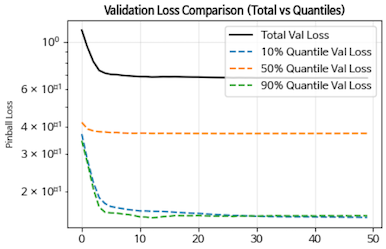

*그림 4-18. 분위수별 검증 손실.*

**Quantile crossing 체크** 결과 $q_{0.1}(x) \le q_{0.5}(x) \le q_{0.9}(x)$ 의 순서가 유지되었으며 큰 문제는 없었다. 확인은 두 쌍의 부등식을 직접 세는 것으로 충분하다.

```python
# 분위수 역전 비율 (Quantile Crossing Rate)
# q10 > q50 이거나 q50 > q90 인 경우 확인
cross_10_50 = q_preds[0] > q_preds[1]
cross_50_90 = q_preds[1] > q_preds[2]
```

학습된 세 분위수 곡선의 모양은 데이터의 구조를 그대로 드러낸다.

- 0 부근에서는 분포가 좁다.
- 양 끝으로 갈수록 분포가 넓어진다.
- 왼쪽에서는 하방 tail이 길다.
- 오른쪽에서는 상방 tail이 길어진다.

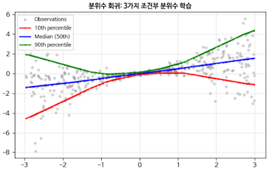

*그림 4-19. 세 개의 조건부 분위수 곡선.*

<!-- 슬라이드 226 -->

### 결과: 보정 지표

이분산 회귀와 동일한 네 가지 지표로 보정을 확인한다.

- **Coverage**: nominal coverage와 empirical coverage를 비교한다. 대각선 위는 구간이 좁은 것, 대각선 아래는 구간이 넓은 것이다.
- **Standardized Residuals(표준화 잔차)**: $\mathcal{N}(0,1)$ 모양인가.
- **PIT Histogram**: 균등분포인가.
- **Sharpness**: 예측이 날카롭고 좁은가.

분위수 회귀에서 coverage는 각 $\tau$ 에 대해 "실제 $y$ 가 예측된 분위수 이하인 비율"로 직접 잰다.

```python
# 분위수별 경험적 커버리지(Empirical Coverage) 계산
for i, q in enumerate(quantiles):
    # 실제 y값이 예측된 분위수보다 작거나 같은 비율 계산
    coverage = np.mean(y_het_test.flatten() <= quant_preds[i])
    actual_coverages.append(coverage)

# 80% 예측 구간 (10% ~ 90% 분위수 사이) 포함 비율 계산
interval_coverage = np.mean((y_het_test.flatten() >= quant_preds[0])
                          & (y_het_test.flatten() <= quant_preds[2]))
```

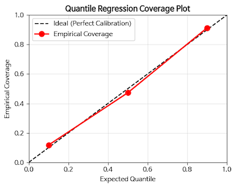

*그림 4-20. 분위수 회귀의 coverage 곡선.*

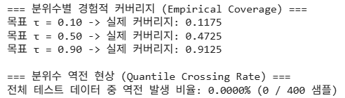

*그림 4-21. 경험적 커버리지와 quantile crossing rate.*

표준화 잔차와 PIT는 분포 가정이 없으므로 가우시안 근사를 한 번 거친다. 중앙값을 평균으로, 80% 구간 폭을 표준편차로 환산해 쓴다. Sharpness는 그 구간 폭 자체의 분포다.

```python
# 가우시안 근사를 이용한 예측 분포의 통계량 계산
# 50% 분위수를 평균으로 근사
pred_mean = quant_preds[1]
# 10%와 90% 분위수 차이를 통해 표준편차 근사 (정규분포에서 80% 구간은 약 2.56 표준편차)
pred_std = (quant_preds[2] - quant_preds[0]) / 2.563

std_residuals = (y_het_test.flatten() - pred_mean) / pred_std
pit_values = stats.norm.cdf(y_het_test.flatten(), loc=pred_mean, scale=pred_std)
interval_widths = quant_preds[2] - quant_preds[0]   # Sharpness
```

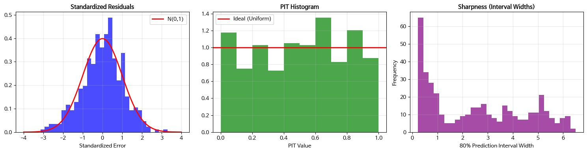

*그림 4-22. 분위수 회귀의 표준화 잔차 · PIT · 구간 폭 분포.*

---

## 4.1.14 심화 과제
<!-- 슬라이드 227~231 -->

### 심화 과제 4-1: 금융 수익률 예측 — 이분산성 구간 vs 분위수 구간 비교

**목적**

합성 금융 수익률 데이터(변동성이 시장 상황에 따라 변하는 데이터)에서 이분산 회귀와 분위수 회귀의 예측 구간을 Coverage, Standardized Residuals(표준화 잔차), PIT Histogram, Sharpness로 정량 비교하고, 어떤 상황에 어느 쪽이 더 적합한지 분석한다.

**데이터**

Heteroscedastic 금융 합성 데이터를 생성한다. 데이터 생성 코드는 실습 4.1.3에 포함되어 있다.

- $X$: 0 ~ 1 범위의, 시장의 변동성을 결정하는 상태 변수
- $Y$: 변동성 함수(일별 수익률)

**수행 단계**

1. **데이터 EDA**: $X$ 별 $y$ 분포를 시각화하고, 노이즈의 비가우시안 특성을 확인한다(scatter, distribution of $y$).
2. **이분산 회귀 학습**: `build_hetero_regressor(input_dim=1)` + `gaussian_nll_loss`
3. **분위수 회귀 학습**: `build_quantile_regressor(input_dim=1, quantiles=[0.1, 0.5, 0.9])` + `pinball_loss`
4. **구간별 성능 비교**: 저변동성($X < 0.3$), 중변동성($0.3 \le X \le 0.7$), 고변동성($X > 0.7$) 세 구간에 대해 두 모델의 성능을 비교한다.
5. **보고서 1page**: 각 단계의 출력(또는 plot)을 설명하고, 결론으로 두 방법의 차이를 비교 설명한다.

**제출**

보고서 PDF 파일과, 과제 코드 및 실행 결과를 포함한 `과제4-1.ipynb` 파일을 제출한다(과제와 무관한 코드는 제거한다).

---

### 심화 과제 4-2: Inverse Problem에서 '평균 해'는 왜 해가 아닌가?

**목적**

역문제(inverse problem)에서 단일 출력 회귀가 왜 구조적으로 실패하는지 이해하고, 이분산 회귀와 분위수 회귀가 이를 "해결"하는 것이 아니라 **"문제의 존재를 드러내는 부분적 계측기"** 임을 해석한다.

**상황 설정**

다음 중 하나의 문제를 선택한다.

- **A. 2-link 로봇 팔 역기구학**: 같은 목표 위치에 대해 elbow-up / elbow-down 두 해가 존재한다.
- **B. 혼합 음원 분리**: 같은 관측 스펙트럼이 여러 악기 조합으로 설명 가능하다.
- **C. 의료 영상 복원**: 동일한 측정값을 여러 조직 배치가 설명 가능하다.

선택한 문제에 대해, 입력 $x$ 에 대해 가능한 정답 $y$ 가 둘 이상 존재한다고 가정한다. 그리고 단일 MSE 회귀, 이분산 회귀, 분위수 회귀($q_{0.1}, q_{0.5}, q_{0.9}$)를 각각 적용했다고 가정하고 결과를 해석한다.

**요구 사항**

1. 왜 MSE 회귀의 최적해가 "가장 그럴듯한 정답"이 아니라 "조건부 평균"이 되며, 그 평균값이 실제 가능한 해가 아닐 수 있는지 설명하라.
2. 이분산 회귀에서 $\sigma(x)$ 가 크게 나오는 구간을 "모델이 못 배웠다"가 아니라 **"같은 입력에 여러 해가 겹친 구조"** 로 해석해야 하는 이유를 설명하라.
3. 분위수 회귀의 $q_{0.1}, q_{0.5}, q_{0.9}$ 가 각각 어떤 정보를 주는지 설명하고, 왜 $q_{0.5}$ 또는 분위수 구간만으로는 개별 해의 위치를 명시할 수 없는지 논증하라.
4. 이 문제를 "단일 출력 모델의 성능 문제"가 아니라 **"출력 공간의 다중해 구조 문제"** 로 진단하려면 어떤 시각화나 지표를 제시해야 하는지 제안하라.

---

### 심화 과제 4-3: 보정된 예측구간은 '좋은 설명'인가, 단지 '넓은 회피'인가?

**목적**

예측 구간의 보정(calibration)이 맞더라도 그것이 곧 데이터 구조를 잘 설명한다는 뜻은 아님을 이해하고, coverage와 interval width를 함께 해석하여 단일 모드 가정의 한계를 비판적으로 분석한다.

**상황 설정**

다음 중 하나의 데이터셋을 선택한다.

- **A.** $x$ 가 커질수록 분산이 커지는 비가우시안 금융 수익률 데이터
- **B.** 환자 상태지표 $x$ 에 따라 예후의 분산이 커지고 극단값이 자주 발생하는 의료 데이터
- **C.** 입력 $x$ 의 일부 구간에서 $y$ 가 $+c$ 또는 $-c$ 두 값으로 갈라지는 합성 다중모드 데이터

선택한 데이터에 대해 이분산 회귀와 분위수 회귀($q_{0.1}, q_{0.5}, q_{0.9}$)를 적용하여 80% 예측구간을 만들었다고 가정한다. 어떤 모델은 coverage가 80%에 가깝지만 interval width가 매우 넓고, 다른 모델은 width는 좁지만 coverage가 부족하다고 가정한다.

**요구 사항**

1. coverage, interval width, coverage gap의 의미를 각각 설명하고, 왜 보정은 반드시 "폭"과 함께 해석해야 하는지 논하라.
2. 이분산 회귀가 가우시안 가정에 의존한다는 점을 설명하고, 비가우시안 데이터에서 coverage가 맞지 않거나 극단값을 놓칠 수 있는 이유를 설명하라.
3. 분위수 회귀가 분포 가정 없이 coverage를 직접 맞출 수 있음에도, 다중모드 데이터에서는 $q_{0.5}$ 나 예측구간이 실제 빈 공간을 포함할 수 있는 이유를 설명하라.
4. "coverage가 맞았다"는 이유만으로 해당 모델이 좋은 구조 해석기라고 결론 내릴 수 없는 이유를, 선택한 데이터셋의 맥락에서 논증하라.

---

### 심화 과제 4-4: 잠재공간의 불확실성과 출력공간의 불확실성은 같은 것인가?

**목적**

AE, VAE, 이분산 회귀를 연결하여 **"불확실성"이라는 말이 입력 표현공간과 출력공간에서 서로 다른 의미를 가진다**는 점을 구분한다. 또한 잠재공간의 퍼짐과 출력 예측의 퍼짐을 같은 개념으로 혼동할 때 어떤 해석 오류가 생기는지 분석한다.

**상황 설정**

한 가지 데이터셋을 선택하여 설명한다.

- **A.** 손글씨 숫자 이미지와 해당 숫자의 굵기/기울기 점수
- **B.** 자동차 이미지와 해당 차량의 가격 또는 연비

같은 데이터셋에 대해 다음 세 모델을 학습했다고 가정한다.

- **AE**: latent vector $z(x)$ 학습
- **VAE**: $\mu_z(x)$, $\sigma_z^2(x)$ 학습
- **이분산 회귀**: $\mu_y(x)$, $\sigma_y^2(x)$ 학습

입력 샘플 중 일부는 시각적으로 애매하고, 일부는 입력은 명확하지만 출력값의 변동성이 크다.

**요구 사항**

1. AE의 잠재벡터 $z(x)$, VAE의 잠재분산 $\sigma_z^2(x)$, 이분산 회귀의 출력분산 $\sigma_y^2(x)$ 가 각각 무엇을 표현하는지 구분하여 설명하라.
2. 어떤 샘플에서는 $\sigma_z^2(x)$ 는 크지만 $\sigma_y^2(x)$ 는 작을 수 있고, 반대로 $\sigma_z^2(x)$ 는 작지만 $\sigma_y^2(x)$ 는 클 수 있다. 이 두 경우를 각각 하나씩 구체적인 예와 함께 설명하라.
3. "입력 표현이 불안정하다"와 "출력 정답이 하나로 정해지지 않는다"가 왜 서로 다른 문제인지 논하라.
4. VAE의 $\sigma_z^2(x)$ 가 큰 샘플과 이분산 회귀의 $\sigma_y^2(x)$ 가 큰 샘플을 비교하여, 각각이 데이터 구조에 대해 어떤 다른 진단 신호를 주는지 설명하라.

#### 예시 풀이 — 선택지 B(자동차 이미지와 해당 차량의 가격 또는 연비)

**1. 세 값이 각각 표현하는 것**

- AE의 $z(x)$: 입력의 **압축된 표현 좌표**
- VAE의 $\sigma_z^2(x)$: **잠재 표현이 얼마나 퍼져 있는가**
- 이분산 회귀의 $\sigma_y^2(x)$: **같은 입력에서 출력값이 얼마나 달라질 수 있는가**

**2. 두 분산이 어긋나는 두 경우**

- $\sigma_z^2(x)$ 는 크지만 $\sigma_y^2(x)$ 는 작은 경우
  - 큰 $\sigma_z^2(x)$: 입력 표현이 불안정하다.
  - 작은 $\sigma_y^2(x)$: 그럼에도 가격은 비교적 결정적이다.
- $\sigma_z^2(x)$ 는 작지만 $\sigma_y^2(x)$ 는 큰 경우
  - 작은 $\sigma_z^2(x)$: 입력 표현은 명확하다.
  - 큰 $\sigma_y^2(x)$: 출력 정답은 하나로 정해지지 않는다.

**3. 두 문제가 서로 다른 이유**

- 입력의 정보 부족 또는 표현 학습의 문제 — **모델이 입력을 어떻게 읽는가**의 문제이며, "입력 이미지가 애매하다"에 해당한다.
- 조건부 출력분포 $P(Y \mid X=x)$ 자체의 문제 — **입력에 대한 출력의 다양성**의 문제이며, "가격이 불확실하다"에 해당한다.

**4. 두 신호가 주는 서로 다른 진단**

- $\sigma_z^2(x)$: 입력을 안정적으로 표현할 수 있는가? 값이 크면 입력이 시각적으로 애매하거나 학습이 불완전하다.
- $\sigma_y^2(x)$: 입력이 주어져도 출력이 하나로 정해지는가? 값이 크면 입력이 같아 보여도 출력값이 넓게 퍼진다.

> **주의사항**
> - VAE의 $\sigma_z^2(x)$ 는 데이터 불확실성 + 인코더 구조 + KL 정규화 + prior와의 타협이 함께 반영된 결과다. 이를 입력의 난이도로 단정할 수 없다.
> - 이분산 회귀의 $\sigma_y^2(x)$ 는 출력 변동성 + 잘못된 학습이 함께 반영된 결과다. 그 값이 곧 진실은 아니다.

---

## 4.1.15 정리
<!-- 슬라이드 193~232 요약 -->

- 단일 출력 회귀는 조건부 분포 $p(y \mid x)$ 가 아니라 **손실 함수가 요구하는 대표값**을 출력한다. MSE는 조건부 평균을, MAE는 조건부 중앙값을, Pinball Loss는 조건부 분위수를, Gaussian NLL은 평균과 분산을 최적해로 갖는다.
- 회귀 모델은 **유일한 정답 · 등분산성 · 단일 모드**라는 세 가지 가정을 암묵적으로 전제하며, 이 중 하나라도 깨지면 점 예측은 실패한다. 세 가지 실패 모드는 각각 Inverse Problem, Heteroscedasticity, Multimodal distribution으로 나타난다.
- 가정의 실패는 손실 값이 아니라 **별도의 진단 metric**으로 감지한다. Learned Local Target Variance, Bin-wise Residual Variance Ratio, $\mathrm{Corr}(\lvert e \rvert, \hat{y})$, Local GMM BIC gap을 RMSE와 짝지어 읽어야 한다.
- 이분산 회귀는 $\sigma(x)$ 를 함께 출력해 퍼짐의 크기를 표현하지만 Gaussian 가정에 묶여 있고, 분위수 회귀는 분포 가정 없이 coverage를 맞추지만 다중 모드에서는 빈 공간을 포함하는 넓은 구간을 내놓는다. **둘 다 불완전한 해법이다.**
- 따라서 모델은 하나의 답을 학습하고, **metric은 그 "하나의 답"이라는 가정 자체가 맞는지를 검증한다.** 보정이 맞았다는 사실은 구조를 설명했다는 뜻이 아니며, coverage는 반드시 interval width와 함께 읽어야 한다.
