# 4.2 확률적 출력(Probabilistic Output)과 MDN

**학습 목표**

- 결정론적 모델과 확률론적 모델의 차이를, 출력이 값인가 분포의 모수인가라는 기준으로 구분할 수 있다.
- MDN(Mixture Density Network)의 출력 $(\pi_k, \mu_k, \sigma_k^2)$ 가 무엇을 의미하는지 설명하고, 출력층을 직접 설계할 수 있다.
- 혼합 분포의 NLL(Negative Log Likelihood) 손실을 유도하고, log-sum-exp 트릭으로 수치적으로 안정하게 구현할 수 있다.
- NLL 최소화가 MLE 및 KL 발산 최소화와 동치임을 설명할 수 있다.
- 학습된 혼합 분포에서 최종 예측값을 얻는 샘플링 전략들을 비교하고, 문제에 맞는 전략을 선택할 수 있다.
- 역문제(inverse problem)와 시퀀스 생성 문제에서 MDN이 왜 필요한지 사례로 설명할 수 있다.

**이 절의 구성**

- 4.2.1 결정론적 출력과 확률론적 출력
- 4.2.2 MDN의 자리 — VAE, 이분산 회귀와의 비교
- 4.2.3 학습 후 예측 — 샘플링 전략
- 4.2.4 GMM과 MDN
- 4.2.5 혼합 모델의 일반화 — MoG와 복합 출력
- 4.2.6 MDN 출력층의 설계
- 4.2.7 역문제(Inverse Problem)와 MDN의 필요성
- 4.2.8 MDN의 기본 구조
- 4.2.9 손실 함수 NLL과 수치 안정성
- 4.2.10 NLL, MLE, KLD의 동치 관계
- 4.2.11 NLL Loss의 직관적 이해와 구현
- 4.2.12 MDN을 직접 학습시키기
- 4.2.13 성분 수 $K$ 의 선택
- 4.2.14 MDN + RNN — 필기체 예측
- 4.2.15 Handwriting Synthesis — Soft Window
- 4.2.16 추가 검토 — 클러스터 구조와 잠재 공간
- 4.2.17 심화 과제
- 4.2.18 정리

> 실습 번호는 강의 슬라이드의 번호를 그대로 쓴다. 소절 번호와는 무관하다.

---

## 4.2.1 결정론적 출력과 확률론적 출력
<!-- 슬라이드 233~234 -->

4장은 모델의 **출력공간(output space)** 을 다룬다. 앞 절에서 다룬 단일출력(deterministic output)에 이어, 이 절은 출력이 하나의 값이 아니라 **분포**인 경우를 다룬다.

### 결정론적 모델 — 하나의 답만 출력한다

전통적 회귀 모델은 입력 $x$ 에 대해 단 하나의 예측값 $\hat{y}$ 를 반환한다. 즉 모델은 입력을 단일 실수값으로 보내는 함수이다.

$$f: x \rightarrow \hat{y} \qquad (\text{단일 실수값})$$

선형 회귀는 이 함수를 일차식으로 두고,

$$\hat{y} = w \ast x + b$$

신경망은 같은 형태의 연산을 비선형 활성함수와 함께 병렬·직렬로 구조화하여 연속적으로 쌓는다.

$$\hat{y} = \sigma(Wx + b)$$

이 구조가 전제하는 것은 **단일 정답 가정**이다. 동일한 $x$ 에 대해 언제나 동일한 출력이 "정답"이라고 본다. 학습이란 그 하나의 정답 함수를 찾아내는 일이 된다.

### 확률론적 모델 — 분포의 모수를 출력한다

확률론적 모델은 값을 내놓는 대신 **출력의 조건부 확률 분포** $p(y \mid x)$ 를 학습한다. 즉 $x$ 가 주어졌을 때 $y$ 가 가질 수 있는 모든 값의 확률을 표현한다. 두 접근의 학습 대상은 다음과 같이 갈린다.

- 결정론적 모델은 함수 $f(x)$ 를 직접 학습한다.
- 확률론적 출력은 조건부 확률분포 **함수의 parameter**(모수)를 학습한다.

그러면 실제 예측값은 어떻게 얻는가. 분포가 곧 출력이므로, 예측값은 그 분포에서의 **샘플링(sampling)** 으로 결정한다.

$$\hat{y} \sim p(y \mid x)$$

이 방식의 장점은 출력의 **불확실성(uncertainty)** 을 명시적으로 표현할 수 있다는 점이다. 분포의 모양 자체가 모델의 확신 정도를 담고 있다.

- $p(y \mid x)$ 가 좁고 뾰족하면 모델이 그 값을 확신하는 것이다.
- 넓거나 여러 봉우리를 가지면 불확실하거나, 여러 가능성이 동시에 존재한다는 뜻이다.

### One to many — 하나의 입력에 여러 정답

많은 실제 문제에서는 다수의 분포가 결합된 출력, 즉 **조건부 다중모드 분포(conditional multimodal distribution)** 가 필요하다. 하나의 입력에 대해 서로 다른 여러 개의 정답이 모두 타당한 경우가 있기 때문이다. 다음 표는 그런 상황의 대표적인 예이다.

| 문제 | 입력 | 출력 | 다중성이 생기는 이유 |
|---|---|---|---|
| 로봇 팔 | 목표 위치 $(p_x, p_y)$ | 두 관절 각도 조합 | 팔꿈치 위/아래 두 자세 모두 가능 |
| 음악 반주 생성 | 멜로디 코드 | 다양한 화음 진행 | 같은 멜로디에 여러 화음이 어울림 |
| 날씨 예측 | 현재 기상 데이터 | 내일 강수량 | 본질적 불확실성 존재 |

이 세 경우 모두, 단일 정답 가정을 고수하는 모델은 여러 정답의 **평균**을 답으로 내놓게 된다. 그리고 그 평균은 어느 정답에도 해당하지 않는 값일 수 있다.

---

## 4.2.2 MDN의 자리 — VAE, 이분산 회귀와의 비교
<!-- 슬라이드 235 -->

**MDN(Mixture Density Network)** 은 출력 데이터의 불확실성을 **다중 모드**로 표현하는 모델이다. 불확실성을 확률 분포로 표현하는 다른 모델들과 나란히 놓으면 MDN의 위치가 분명해진다.

**VAE** 는 *입력* 데이터에 내재된 불확실성을 잠재 변수의 확률 분포 $q(z \mid x)$ 로 표현한다.

$$q_\phi(z \mid x) = \mathcal{N}\!\left(z;\, \mu(x),\, \mathrm{diag}(\sigma^2(x))\right)$$

여기서 $\mu(x)$ 와 $\sigma^2(x)$ 는 입력 $x$ 에 따라 달라지는 잠재 분포의 중심과 퍼짐이다.

**이분산 회귀(heteroscedastic regression)** 는 *출력* 데이터에 내재된 불확실성을 출력 분포의 분산 $\sigma^2(x)$ 로 표현한다. 즉 예측값뿐 아니라 그 예측이 얼마나 흔들리는지도 함께 출력한다.

$$p(y \mid x) = \mathcal{N}\!\left(\mu(x),\, \sigma^2(x)\right)$$

다만 이분산 회귀에서 조건부 분포의 형태는 **항상 단일 가우시안으로 제한**된다. 봉우리가 하나뿐이므로, 앞서 본 로봇 팔처럼 정답이 둘로 갈라지는 상황을 표현할 수 없다.

**MDN** 은 바로 이 제약을 푼다. 입력에 따른 출력 데이터의 불확실성 표현을 **다중 가우시안**으로 확장한다.

$$p(y \mid x) = \sum_{k} \pi_k \, \mathcal{N}\!\left(\mu_k(x),\, \sigma_k^2(x)\right)$$

각 모드마다 가중치·평균·분산의 **3개 parameter** 를 학습한다는 점이 핵심이다. 성분이 $K$ 개면 학습해야 할 출력 모수는 $3K$ 개가 된다.

MDN은 원래 신경망으로 **역문제(Inverse Problem)** 를 해결하는 모델로 제안되었다.

> Christopher M. Bishop, *Mixture Density Networks*, Neural Computing Research Group,
> Dept. of Computer Science and Applied Mathematics, Aston University, February 1994.

구조는 단순하다. 입력 $x$ 가 은닉층을 지나 혼합 모수 $(\pi, \mu, \sigma)$ 로 사상되고, 그 모수들이 하나의 혼합 분포(mixture distribution)를 구성한다.

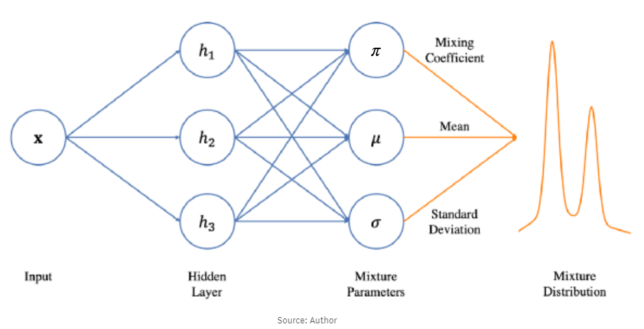

*그림 4-23. MDN의 기본 개념 — 신경망의 출력은 값이 아니라 혼합 분포의 모수이다*

---

## 4.2.3 학습 후 예측 — 샘플링 전략
<!-- 슬라이드 236 -->

MDN이 출력하는 것은 $K$ 개 확률분포의 모수 $\pi_k,\ \mu_k,\ \sigma_k^2$ 이다. 각 항의 의미와 지켜야 할 제약은 다음과 같다.

- $\pi_k$ : $k$ 번째 분포의 가중치이다. 전체 합이 1이어야 한다(sum to 1).
- $\mu_k,\ \sigma_k^2$ : $k$ 번째 분포의 평균과 분산이다. 분산은 항상 **양수를 유지**하도록 주의해야 한다.

모델의 출력이 분포이므로, 그 분포에서 실제 출력 값을 결정하는 **전략**이 따로 필요하다. 혼합 분포는 다음과 같이 두 단계의 확률로 분해된다.

$$p(y \mid x) = \sum_{k} p(k \mid x)\, p(y \mid k, x)$$

이 분해가 그대로 무작위 샘플링의 절차가 된다. 먼저 어떤 중심을 고를지 $\pi$ 확률로 결정하고, 그 다음 선택된 중심 주변에서 값을 샘플링한다.

다음 표는 네 가지 전략과 각각이 적합한 상황을 정리한 것이다.

| 방법 | 수식 | 적합한 상황 |
|---|---|---|
| 무작위 샘플링 | 1) $k \sim \mathrm{Categorical}(\pi)$ : $\pi$ 확률로 성분 선택<br>2) $\hat{y} \sim \mathcal{N}(\mu_k, \sigma_k^2)$ : 선택된 $k$ 분포에서 sampling | 생성 모델, 다양성 표현 |
| 가장 가능성 높은 모드 | $\hat{y} = \mu_{\arg\max_k \pi_k}$ | 결정이 필요한 예측 |
| 상위 $K$ 개 모드 | $\pi_k$ 내림차순 상위 $K$ 개의 $\mu_k$ | 역문제의 여러 후보 제시 |
| 가중 평균 (주의) | $\hat{y} = \sum_k \pi_k \mu_k$ | 단일 값이 필요할 때 (다중모드에는 부적합) |

마지막 전략인 가중 평균은 결과적으로 **MSE 기반 단일 회귀와 동일**해진다. 다중모드 분포에서 이 전략을 쓰면 어느 봉우리에도 속하지 않는 값이 나올 수 있으므로 주의해야 한다.

---

## 4.2.4 GMM과 MDN
<!-- 슬라이드 237 -->

MDN을 이해할 때 가장 자주 비교되는 모델이 **GMM(Gaussian Mixture Model)** 이다. 두 모델 모두 혼합 가우시안을 쓰지만 목적이 다르다.

GMM은 **비지도 밀도 추정** 모델로, 데이터셋의 **정적(static)** 다중 모드 구조를 포착한다. 데이터의 분포 $p(x)$ 를 $K$ 개의 혼합 가우시안으로 추정한다.

$$p(x) = \sum_{k} \pi_k \, \mathcal{N}\!\left(\mu_k,\, \Sigma_k\right)$$

이 모델의 전제는 다음과 같다.

- 데이터 $x$ 는 $K$ 개의 잠재 클러스터 $(z = 1, \dots, K)$ 중 하나에서 생성된다.
- $z$ 는 관측 불가능한 **잠재 변수(latent variable)** 이다.
- 파라미터는 EM 알고리즘으로 추정한다.

**EM(Expectation–Maximization) 알고리즘**은 우도(likelihood)가 증가하는 방향으로 두 단계를 교대로 수행한다.

- **E-step**: 현재 파라미터로 잠재 변수의 기댓값을 계산한다.
- **M-step**: 그 기댓값을 고정한 채, 파라미터를 우도가 최대가 되도록 갱신한다.

MDN과의 결정적인 차이는 여기에 있다. MDN은 **입력에 따라 변하는 출력의 동적(dynamic) 다중 모드 구조**를 포착한다. GMM의 $\pi_k, \mu_k, \Sigma_k$ 가 데이터셋 전체에 대해 고정된 상수인 반면, MDN의 그것들은 모두 $x$ 의 함수이다.

| 비교 항목 | GMM | MDN |
|---|---|---|
| 모델링 대상 | 비조건부 데이터 분포 $p(x)$ | 조건부 출력 분포 $p(y \mid x)$ |
| 학습 방법 | EM 알고리즘 (반복적) | 역전파 (NLL 최소화) |
| 파라미터 | 고정된 $\{\pi_k, \mu_k, \Sigma_k\}$ | $x$ 의 함수 $\{\pi_k(x), \mu_k(x), \Sigma_k(x)\}$ |
| 핵심 특징 | 데이터 클러스터링, 밀도 추정 | 입력마다 달라지는 조건부 분포 출력 |
| 수렴 보장 | log-likelihood 단조 증가 보장 | 로컬 최적해, 수렴 미보장 |

> **핵심 메시지**
> GMM은 "데이터가 몇 덩어리인가"를 묻고, MDN은 "이 입력에서 정답이 몇 갈래인가"를 묻는다.

---

## 4.2.5 혼합 모델의 일반화 — MoG와 복합 출력
<!-- 슬라이드 238 -->

**MoG(Mixture of Gaussian)**, 즉 혼합 가우시안 모델은 더 일반적인 형태로 확장할 수 있다. $P(y)$ 를 혼합가우시안 모델로 가정하고 $K$ 개의 component 를 갖는 모델로 일반화하면, component 의 종류에 따라 다음 형태들이 나온다.

**연속변수(continuous variables) component** 인 경우, 각 성분은 가우시안이다.

$$p(y \mid x) = \sum_{k} \pi_k(x)\, \mathcal{N}\!\left(y \mid \mu_k(x),\, \sigma_k^2(x)\right)$$

**이진변수(Bernoulli) component** 인 경우, 각 성분은 베르누이 분포이다.

$$p(y \mid x) = \mathrm{Bernoulli}\!\left(p(x)\right)$$

두 가지 형식의 출력이 함께 사용되거나, 아예 **복합출력 component** 일 수도 있다. 복합출력이란 두 가지 형식의 **결합 분포의 혼합 모델**을 말한다.

$$p(y \mid x) = \sum_{k=1}^{K} \pi_k(x)\; \underbrace{\mathcal{N}\!\left(y_{\text{cont}} \mid \mu_k(x),\, \sigma_k^2(x)\right)\, \mathrm{Bernoulli}\!\left(y_{\text{bin}} \mid p_k(x)\right)}_{\text{component } k}$$

이 식에서 $\pi_k(x)$ 가 하는 일은 입력에 따라 $k$ 번째 가우시안 component 의 사용 여부를 **gating** 하는 것이다. 결과적으로 입력마다 조건부 출력 분포의 **모드(mode)의 수와 구조가 달라진다.**

복합 출력의 가장 단순한 형태가 **Hurdle 모델** 또는 **Zero-Inflated 모델**이다. 먼저 사건의 발생 여부를 베르누이로 판정하고, 발생한 경우에만 연속 분포에서 값을 생성한다.

$$p(y) = \begin{cases} 1 - p, & y = 0 \quad (\text{사건이 발생하지 않음}) \\[4pt] p \cdot \mathcal{N}\!\left(y \mid \mu, \sigma^2\right), & y > 0 \quad (\text{사건이 발생함}) \end{cases}$$

각 기호의 의미는 다음과 같다.

- $p$ : 거래가 발생할 확률, 청구될 확률, 클릭이 일어날 확률
- $y$ : 금융 거래액, 보험 청구금액, 클릭 후 금액 등

즉 "얼마나 큰가"와 "일어나기는 하는가"를 하나의 분포 안에서 함께 다루는 구조이다.

---

## 4.2.6 MDN 출력층의 설계
<!-- 슬라이드 239 -->

혼합 성분이 3개인 경우를 예로 들면 조건부 출력 분포는 다음과 같이 쓰인다.

$$p(y \mid x) = \sum_{k}^{K} \pi_k(x)\, \mathcal{N}\!\left(y \mid \mu_k(x),\, \sigma_k^2(x)\right), \qquad K = 3$$

여기서 실무적으로 먼저 확인해야 할 것은 **모델의 출력 개수**이다. 성분 하나당 $(\pi, \sigma, \mu)$ 세 개의 모수가 필요하므로, 5개 component 모델이라면 $5 \times 3 = 15$ 개의 출력이 필요하다.

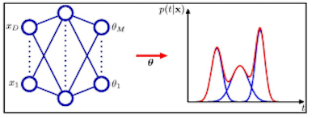

모델의 hidden output 이 다음과 같다고 하자.

$$Z = \tanh\!\left(W_h X + b_h\right)$$

이 $Z$ 값을 각 parameter 에 직접 할당하거나, $k$ 개의 노드를 갖는 FC layer 를 한 번 더 거쳐서 출력한다. 15개 출력을 세 묶음으로 나누어 각각 다른 변환을 적용한다.

$$\pi_k = \frac{\exp(Z_k)}{\sum_{i=0}^{4} \exp(Z_i)}, \qquad \sigma_k = \exp\!\left(Z_{5 \sim 9}\right), \qquad \mu_k = Z_{10 \sim 14}$$

세 변환이 서로 다른 이유는 각 모수가 지켜야 할 제약이 다르기 때문이다.

- $\pi_k$ 는 합이 1인 확률 값이므로 **Softmax** 로 계산한다.
- $\sigma_k$ 는 분산에 해당하므로 **항상 양수**여야 한다. $\tanh$ 의 출력 범위인 $-1 \sim 1$ 을 $\exp(x)$ 또는 $\mathrm{softplus}(x)$ 로 변환하여 양수로 만든다.
- $\mu_k$ 는 부호 제약이 없으므로 변환 없이 그대로 사용한다.

$\exp(x)$ 는 모든 실수를 양수로 보내는 가장 단순한 선택이다.

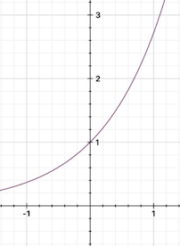

같은 목적으로 softplus 도 자주 쓰인다. $\beta$ 값을 키우면 ReLU에 가까워지고, 작게 하면 완만하게 휘어진다.

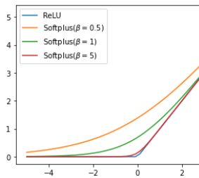

*그림 4-24. 분산을 양수로 유지하기 위한 변환 함수 — exp 와 softplus*

---

## 4.2.7 역문제(Inverse Problem)와 MDN의 필요성
<!-- 슬라이드 240~241 -->

MDN이 왜 필요한지는 **역문제(Inverse Problem)** 를 보면 가장 분명해진다.

첫 번째 예는 로봇 팔의 운동이다. 특정 좌표로 갈 수 있는 조건이 두 개 존재한다. 즉 손끝의 목표 위치 $(x_1, x_2)$ 가 주어졌을 때, 그 위치에 도달하는 관절 각도 조합은 하나가 아니다.

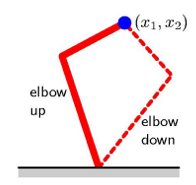

정방향으로 보면 문제는 단순하다. 관절 각도 $\theta_1, \theta_2$ 와 링크 길이 $L_1, L_2$ 가 정해지면 손끝 위치는 유일하게 결정된다.

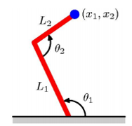

두 번째 예는 헤드폰의 가격대별 판매량 분포이다. 이 분포는 그 자체가 **혼합가우시안(MoG: Mixture of Gaussian) 분포**이다. 다중모드(multimodal)이며 세 개의 피크를 가지므로, 세 개의 혼합가우시안 component 로 표현된다.

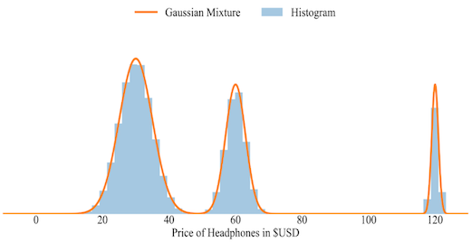

*그림 4-25. 세 개의 모드를 갖는 실제 데이터 — 단일 가우시안으로는 표현할 수 없다*

### 정방향 문제는 회귀로 풀린다

**Forward Problem** 은 MLP regression network 으로도 잘 동작한다. 아래는 하나의 입력에 하나의 출력이 대응하는 학습 데이터이다.

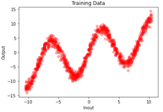

이 데이터에 MLP 회귀를 적용하면 예측 곡선이 데이터의 중심선을 그대로 따라간다.

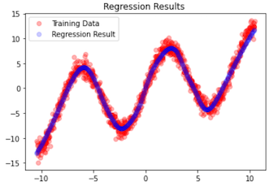

### 역방향 문제는 회귀로 풀리지 않는다

**Inverse Problem** 은 $x$ 축과 $y$ 축이 뒤집힌 문제이다. 축을 뒤집으면 하나의 $x$ 에 세 개의 $y$ 가 대응하는 구간이 생긴다.

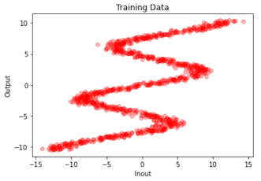

이 데이터에 같은 회귀 모델을 적용하면 해를 찾을 수 없다. 회귀는 각 $x$ 에서 여러 정답의 **평균**을 학습하기 때문에, 예측 곡선이 세 갈래 중 어느 것도 지나지 않고 그 사이의 빈 공간을 통과한다.

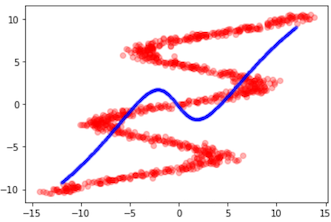

*그림 4-26. 역문제에서 단일 출력 회귀의 실패 — 평균은 어떤 정답도 아니다*

> **핵심 메시지**
> 하나의 입력에 여러 정답이 존재할 때, 단일 출력 회귀가 배우는 것은 정답이 아니라 정답들의 평균이다. 이 평균은 데이터에 존재하지 않는 값일 수 있다.

---

## 4.2.8 MDN의 기본 구조
<!-- 슬라이드 242 -->

MDN을 코드로 옮기면 구조는 앞서 정리한 출력층 설계를 그대로 따른다. 입력을 받아 은닉층 하나를 통과시킨 뒤, 그 은닉 표현에서 세 갈래의 출력 노드를 분기시킨다.

- `mu_layer` : 성분 수 $k$ 만큼의 평균을 출력한다. 별도 변환 없이 Dense 출력을 그대로 쓴다.
- `variance_layer` : 분산 출력 노드이다. Dense 출력에 $\exp$ 를 적용하는 Lambda 층을 붙여 **항상 양수 값**이 되도록 만든다.
- `pi_layer` : 혼합계수 출력 노드이다. **softmax** 활성함수로 합이 1이 되도록(sum to 1) 만든다.

세 출력을 함께 묶어 하나의 모델로 정의하면, 모델의 출력은 값이 아니라 `[pi, mu, var]` 세 벡터의 묶음이 된다. 은닉층의 활성함수로는 출력 범위가 $-1 \sim +1$ 인 $\tanh$ 를 사용한다.

```python
l = 1 # input features
k = 5 # 컴포넌트의 수

def mdn_model(l=1, k=5):
    # Network
    inputs = tf.keras.Input(shape=(l,))
    layer = tf.keras.layers.Dense(50, activation='tanh')(inputs)

    ## mu 산출 노드
    mu = tf.keras.layers.Dense(l * k, name='mu_layer' )(layer)

    # variance(sigma) 산출 노드 (항상 양수 값)
    var_layer = tf.keras.layers.Dense(k)(layer)
    var = tf.keras.layers.Lambda(lambda x: tf.math.exp(x), output_shape=(k,)
                                , name='variance_layer')(var_layer)

    # pi(mixing coefficient) 산출 노드 (sum to 1)
    pi = tf.keras.layers.Dense(k, activation='softmax', name='pi_layer')(layer)

    model = tf.keras.models.Model(inputs, [pi, mu, var])
    return model
```

만들어진 그래프를 그려 보면 하나의 Dense 은닉층에서 세 갈래가 뻗어 나가는 모양이 그대로 확인된다. `k = 5` 이므로 세 출력의 shape이 모두 $(?, 5)$ 이고, 분산 쪽만 Lambda 층을 한 번 더 지난다.

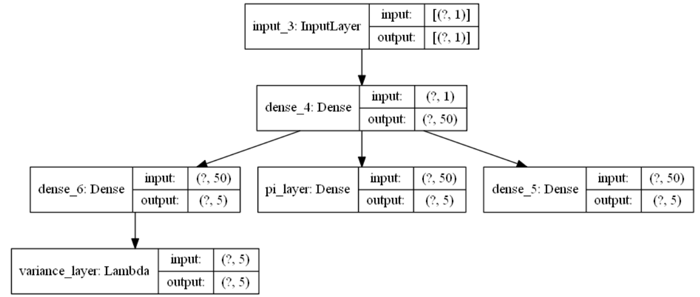

*그림 4-27. MDN 기본 구조 — 은닉층에서 세 종류의 모수 출력으로 분기한다.*

---

## 4.2.9 손실 함수 NLL과 수치 안정성
<!-- 슬라이드 243~244 -->

MDN은 출력이 분포이므로 MSE를 쓸 수 없다. 손실 함수로는 **NLL(Negative Log Likelihood)** 을 사용한다.

### 가능도에서 NLL까지

먼저 데이터 $x_i$ 의 **Likelihood 기여도**를 정의한다. 후보 분포를 하나 놓았을 때 각 데이터 점이 그 분포에서 갖는 밀도값, 즉 분포 곡선까지의 높이가 그 데이터의 기여도이다.


*그림 4-28. 후보 분포에 대한 각 데이터의 Likelihood 기여도. 점선의 높이가 그 데이터가 이 분포를 지지하는 정도다*

**Likelihood(가능도)** 는 모든 데이터의 기여도의 곱이다.

$$\mathcal{L}(\theta \mid x) = P(x \mid \theta) = \prod_{k=1}^{n} P(x_k \mid \theta)$$

곱셈은 다루기 불편하므로 로그를 취해 **Log-Likelihood** 로 바꾼다. 곱이 합으로 바뀐다.

$$\ell(\theta) = \log \mathcal{L}(\theta) = \log P(x \mid \theta) = \sum_{i=1}^{n} \log P(x_i \mid \theta)$$

### MDN에서의 NLL 계산

MDN에서는 데이터 $x_i$ 의 Target $y_i$ 와 모델이 출력한 MoG 분포 사이에서 NLL을 계산한다. 정규분포의 확률밀도함수에서 $x$ 의 기여도는 다음과 같고,

$$p(x \mid \mu, \sigma) = \frac{1}{\sqrt{2\pi\sigma^2}}\exp\!\left(-\frac{(x-\mu)^2}{2\sigma^2}\right)$$

Loss 는 target $y$ 의 기여도로 계산하므로, 최종 손실은 다음과 같이 쓰인다.

$$L_{\text{NLL}} = -\log p(y_i \mid x_i) = -\log \sum_{k} \pi_k\, \mathcal{N}\!\left(y_i \mid \mu_k,\, \sigma_k^2\right)$$

여기서 주목할 점은 다중 모드 분포이기 때문에 **log 안에 sum 이 있다**는 것이다. 단일 가우시안이라면 로그가 지수를 상쇄해 깔끔한 이차식이 되지만, 혼합 분포에서는 그 상쇄가 일어나지 않는다.

### 수치적 문제점 — naive 계산의 위험

이 식을 그대로 계산하면 위험하다.

- $\mathcal{N}(y_i \mid \mu_k, \sigma_k^2)$ 값은 매우 작을 수 있다.
- 따라서 $\pi_k \mathcal{N}$ 을 계산하는 과정에서 **underflow** 가 발생한다.
- underflow 로 0이 된 값에 로그를 취하면 **NaN** 이 발생한다.

이를 피하려면 **Log-Sum-Exp trick** 이 필요하다.

### log-sum-exp 트릭의 적용

출발점은 동일한 NLL 식이다.

$$L_{\text{NLL}} = -\log p(y_i \mid x_i) = -\log \sum^{K} \pi_k\, \mathcal{N}\!\left(y_i \mid \mu_k,\, \sigma_k^2\right)$$

핵심 아이디어는 component 의 확률을 **log 확률로 재정의**한 다음, 그것을 $\exp(\log(p))$ 형태로 되돌려 계산하는 것이다. 각 성분의 로그 기여도를 $a_k$ 로 정의한다.

$$a_k \triangleq \log \pi_k + \log \mathcal{N}\!\left(y_i \mid \mu_k, \sigma_k^2\right)$$

그러면 손실은 다음의 간결한 형태가 된다.

$$L_{\text{NLL}} = -\log \sum_{k} e^{a_k}$$

여기에 log-sum-exp 트릭을 적용한다. 지수 안에서 최댓값 $m$ 을 빼고, 로그 밖에서 다시 $+m$ 해 준다.

$$\log \sum_{k} e^{a_k} = m + \log \sum_{k} e^{a_k - m}, \qquad m = \max_k a_k$$

이렇게 하면 지수의 인자는 항상 $a_k - m \leq 0$ 이므로, $e^{a_k-m} \leq 1$ 이 되어 **overflow 도 underflow 도 없이** 안정적으로 계산할 수 있다. 정리하면 최종 손실 식은 다음과 같다.

$$L_{\text{NLL}} = -\left[\, m + \log \sum_{k} \exp\!\left(\log \pi_k + \log \mathcal{N}(y_i \mid \mu_k, \sigma_k^2) - m\right) \right]$$

---

## 4.2.10 NLL, MLE, KLD의 동치 관계
<!-- 슬라이드 245 -->

NLL 최소화는 임의로 고른 손실 함수가 아니다. **NLL 최소화 $\Leftrightarrow$ MLE $\Leftrightarrow$ KLD 최소화** 라는 논리적 동치 관계가 성립한다.

### NLL 최소화와 MLE

가능도(Likelihood)는 모든 데이터에 대한 조건부 확률의 곱이다.

$$\mathcal{L}(\theta) = \prod_{i=1}^{n} P(y_i \mid x_i;\theta)$$

**MLE(Maximum Likelihood Estimation)** 는 이 값을 최대로 만드는 $\theta$ 를 찾는 것이다.

$$\theta_{\text{MLE}} = \arg\max_{\theta} \prod_{i=1}^{n} P(y_i \mid x_i;\theta)$$

로그를 취하고 표본 수로 나누면 Log Likelihood 가 되고,

$$\log \mathcal{L}(\theta) = \frac{1}{n}\sum_{i} \log P(y_i \mid x_i;\theta)$$

여기에 음의 부호를 붙이면 NLL 이 된다.

$$\mathcal{L}_{\text{NLL}}(\theta) = -\frac{1}{n}\sum_{i} \log P(y_i \mid x_i;\theta)$$

로그는 단조 증가 함수이고 음의 부호는 최대·최소를 뒤집으므로, 다음 동치가 성립한다.

$$\arg\max_{\theta} \prod_{i=1}^{n} P(y_i \mid x_i;\theta) \;\Longleftrightarrow\; \arg\min_{\theta} \mathcal{L}_{\text{NLL}}(\theta)$$

즉 MLE는 관측 데이터의 확률을 최대화하는 것이고, 이는 **Negative Log-Likelihood 를 최소화하는 것과 동치**이다.

### NLL 최소화와 KLD 최소화

**KLD(Kullback–Leibler Divergence)** 는 실제 데이터 분포와 모델 분포 사이의 거리를 재는 양이다.

$$D_{\text{KL}}\!\left(p_{\text{data}}(y \mid x) \,\|\, p_\theta(y \mid x)\right) = \mathbb{E}_{p_{\text{data}}}\!\left[\log \frac{p_{\text{data}}(y \mid x)}{p_\theta(y \mid x)}\right]$$

기댓값을 두 항으로 분리한다.

$$D_{\text{KL}} = \mathbb{E}_{p_{\text{data}}}\!\left[\log p_{\text{data}}(y \mid x)\right] - \mathbb{E}_{p_{\text{data}}}\!\left[\log p_\theta(y \mid x)\right]$$

- **첫째 항(데이터 엔트로피)**: $\mathbb{E}_{p_{\text{data}}}\left[\log p_{\text{data}}(y \mid x)\right] = -H\!\left(p_{\text{data}}(y \mid x)\right)$ 이다. 이 항은 $\theta$ 와 무관하므로 최적화 대상에서 제거된다.
- **둘째 항(모델의 평균 로그우도)**: $\mathbb{E}_{p_{\text{data}}}\left[\log p_\theta(y \mid x)\right]$ 만이 $\theta$ 에 의존한다.

따라서 KLD 최소화는 다음으로 귀결된다.

$$\arg\min_{\theta} D_{\text{KL}} = \arg\min_{\theta} \mathbb{E}_{p_{\text{data}}}\!\left[-\log p_\theta(y \mid x)\right] \;\Longleftrightarrow\; \arg\min_{\theta} \mathcal{L}_{\text{NLL}}(\theta)$$

### 익숙한 손실 함수들의 재해석

이 관계를 알면 우리가 이미 쓰고 있던 손실 함수들이 모두 같은 원리의 특수한 경우임을 알 수 있다.

- **MSE 최소화 = NLL 최소화** — 단일 가우시안이고 분산이 고정된 경우이다.
- **Cross Entropy 최소화 = NLL 최소화 = KLD 최소화**

> **정리**
> MSE, Cross Entropy, NLL, KLD 최소화는 모두 **MLE의 다른 표현**이다. 어떤 분포를 가정하느냐가 달라질 뿐, 하는 일은 "관측된 데이터가 가장 그럴듯해지도록 모수를 조정한다"로 동일하다.

---

## 4.2.11 NLL Loss의 직관적 이해와 구현
<!-- 슬라이드 246~248 -->

### 무엇을 학습하는가

MDN의 예측값은 $k$ 개의 정규분포로 표현된다.

$$p(y \mid x) = \sum_{k} \pi_k(x)\, \mathcal{N}\!\left(y \mid \mu_k(x),\, \sigma_k^2(x)\right)$$

학습 대상은 입력 $x$ 에 대한 $y$ 의 **확률분포** $p(y \mid x)$ 자체이다. 학습 방식은 $k$ 개의 정규분포를 조합해서 최적의 $p(y \mid x)$ 함수를 만드는 것이다. $K = 3$ 이라면, 3개의 정규분포로 $x_1$ 에 대한 $y_1$ 의 확률분포를 표현하게 된다.

아래 그림은 그 구조를 한눈에 보여준다. 왼쪽은 역문제 형태의 학습 데이터이고, 그 위에 세 개의 평균 곡선 $\mu_1, \mu_2, \mu_3$ 가 각각 하나의 가지를 따라간다. 특정 입력 $x_1$ 이나 $x_n$ 에서 수직으로 자르면, 오른쪽처럼 세 개의 봉우리를 갖는 조건부 분포 $p(y_1)$, $p(y_n)$ 이 나온다.

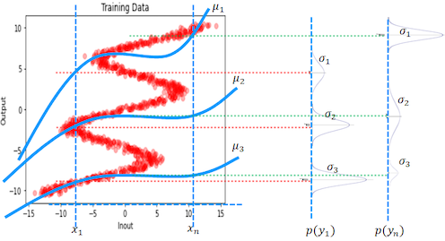

*그림 4-29. 입력마다 달라지는 조건부 혼합 분포 — 같은 모델이 위치에 따라 다른 모양의 분포를 출력한다*

특정 입력 $x_1$ 에서의 출력 분포는 다음과 같이 쓸 수 있다.

$$p(y_1) = \sum_{k=1}^{3} \pi_k(x_1)\, \mathcal{N}\!\left(\mu_k(x_1),\, \sigma_k^2(x_1)\right)$$

그렇다면 $y_1$ 값은 무엇인가. $p(y_1)$ 에서 샘플링해서 얻은 값이다. 확률분포이므로 그 값은 **샘플링할 때마다 다르다.**

### 무엇을 측정하는가

모델의 성능 측정 기준은 $y_{\text{true}}$ 의 분포와 예측된 확률분포 $p(y \mid x)$ 가 **최대한 겹치는 것**이다. 이것이 곧 Maximum Likelihood Estimation 이다. $P(x \mid \mu, \sigma)$ 관점에서 보면, 표본 $x$ 를 가장 잘 표현하는 최적의 $\mu, \sigma$ 를 찾는 일이다.

Cost function 으로는 예측된 확률분포 $p(y \mid x)$ 와 목표값 $y_{\text{true}}$ 사이의 Negative Log Likelihood 를 사용한다.

$$-\log L = -\log\!\left(\sum_{k}^{K} \pi_k(x)\; p\!\left(y_{\text{true}} \mid \mu(x), \sigma(x)\right)\right)$$

여기서 $p(y_{\text{true}} \mid \mu(x), \sigma(x))$ 는 출력 $\mu, \sigma$ 로 정의된 확률분포 $p(y_{\text{pred}})$ 와 정답 $y_{\text{true}}$ 사이의 likelihood 이다. 같은 식이라도 무엇을 변수로 보느냐에 따라 이름이 달라진다는 점에 주의한다.

- **학습 중**: $y$ 는 고정되고 $\mu, \sigma$ 에 대한 함수로 해석하면 **likelihood** 이다.
- **학습 완료 후**: $\mu, \sigma$ 가 고정되고 $y$ 의 함수로 해석하면 **조건부 확률밀도** 이다.

### calc_log_pdf( ) — 로그 확률밀도의 계산

`calc_log_pdf( )` 는 조건부 로그 확률밀도 $p(y_{\text{true}} \mid \mu_x, \sigma_x)$ 를 계산하는 함수이다. Likelihood 기여도는 정규분포의 밀도값 그 자체이다.

$$p\!\left(y_{\text{true}} \mid \mu_x, \sigma_x\right) = \mathcal{N}\!\left(\mu_x, \sigma_x\right)\!\left(y_{\text{true}}\right) = \frac{1}{\sqrt{2\pi\sigma_x^2}}\exp\!\left(-\frac{\left(y_{\text{true}} - \mu_x\right)^2}{2\sigma_x^2}\right)$$

여기에 로그를 취하면 곱과 지수가 모두 합과 곱으로 풀려 세 개의 항이 된다. 이것이 Log Likelihood 기여도이다.

$$\log p\!\left(y_{\text{true}} \mid \mu_x, \sigma_x\right) = -\frac{1}{2}\log(2\pi) - \frac{1}{2}\log\!\left(\sigma_x^2\right) - \frac{1}{2}\frac{\left(y_{\text{true}} - \mu_x\right)^2}{\sigma_x^2}$$

이 함수는 batch 개의 `y_true` 값을 입력받아, 각 `y_true` 에 대한 5개 확률분포의 로그 확률밀도 값을 반환한다. 구현은 위 세 항을 그대로 옮긴 것이다.

```python
## MDN Loss
## y_true를 넣어 추정가우시안분포의 밀도함수 값을 로그 공간에서 계산 (수치 안정성 향상)
@tf.function
def calc_log_pdf(y, mu, var):
    """Calculate component log density"""
    log_2_pi = tf.math.log(2.0 * np.pi)
    log_var = tf.math.log(var)
    variance_penalty = tf.math.square(y - mu) / (2.0 * var)
    # log(N(y|mu,var)) = -0.5 * log(2*pi) - 0.5 * log(var) - (y-mu)^2 / 2*var
    log_pdf = -0.5 * (log_2_pi + log_var) - variance_penalty
    return log_pdf                                   #(n,5)
```

### mdn_loss 함수 구현

앞의 log-sum-exp 트릭을 그대로 코드로 옮기면 `mdn_loss` 가 된다.

$$L_{\text{NLL}} = \text{log-sum-exp trick}\left(-\log \sum_{k} e^{a_k}\right), \qquad a_k \triangleq \log \pi_k + \log \mathcal{N}\!\left(y_i \mid \mu_k, \sigma_k^2\right)$$

$$= -\left[\, m + \log \sum_{k} \exp\!\left(\log \pi_k + \log \mathcal{N}(y_i \mid \mu_k, \sigma_k^2) - m\right)\right]$$

$$= \texttt{tf.reduce\_logsumexp}(a_k)$$

프레임워크가 제공하는 `reduce_logsumexp` 를 쓰면 최댓값 $m$ 을 빼고 더하는 과정을 직접 구현할 필요가 없다. 계산은 텐서 shape 을 따라 다음 네 단계로 진행된다.

- 각 분포와 `y_true` 의 로그 결합확률 밀도를 계산한다 → $(n, 5)$
- 로그 가중치 `log_pi` 를 계산한다 → $(5,)$
- Reduce 하면서 log-sum-exp 트릭을 적용한다 → $(n, 1)$
- 다시 Reduce 하여 스칼라 loss 값을 얻는다 → $(1,)$

```python
@tf.function
## 예측한 밀도함수 N(mu,var)에서 y확률밀도를 계산하고,
## log-sum-exp 트릭을 사용하여 안정적으로 loss 계산
def mdn_loss(y_true, pi, mu, var):
    log_pdf = calc_log_pdf(y_true, mu, var)          #(n,5)
    log_pi = tf.math.log(pi + 1e-10)                 #(5,)
    # log(sum(pi * N)) = log_sum_exp(log(pi) + log(N))
    out = tf.reduce_logsumexp(log_pi + log_pdf, axis=1, keepdims=True) #(n,1)
    return -tf.reduce_mean(out)                      #(1,)
```

구현에서 한 가지 실무적 주의점은 `log_pi` 를 계산할 때 $\pi$ 에 아주 작은 값을 더해 준다는 점이다. softmax 출력이 정확히 0이 되면 로그가 발산하기 때문이다.

---

## 4.2.12 MDN을 직접 학습시키기
<!-- 슬라이드 249 -->

손실 함수까지 갖추었으니 이제 MDN을 실제로 학습시켜 본다. 대상은 4.2.7에서 회귀가 실패했던 바로 그 역문제 데이터다.

### 실습 4.2.1 — MDN 모델 실습

> 노트북: `code/4.2.1.MDN.ipynb`

**목적**: Inverse Problem Dataset 을 만들고, 기본적인 MDN 모델을 설계한다.

**절차**

1. Inverse Problem Dataset 을 만든다.
2. FC Layer 2개로 구성된 모델을 설계한다. Component 수는 $k = 5$ 로 한다.
3. `mdn_loss()` 를 사용해 학습한다.
4. **학습 과정 추적**: 각 component 의 $\pi$, $\mu$, $\sigma$ 함수의 변화를 시각화한다.
5. **학습 중인 모델 성능 확인**: test data 에 대한 모델 출력 $(\pi, \mu, \sigma)$ 분포에서 샘플링하여 시각화한다.
6. Component 수를 늘려서 결과를 비교해 본다.

**① 역문제 데이터 만들기**

정방향 데이터는 $y = 7\sin(0.75x) + 0.5x + \varepsilon$ 로 만든다. 여기서 $x$ 와 $y$ 를 서로 바꾸면 하나의 입력에 여러 출력이 대응하는 역문제 데이터가 된다.

```python
def create_book_example(n=1000):
    # Train 데이터 준비
    x_data = np.float32(np.random.uniform(-10.5, 10.5, (1, n))).T
    r_data = np.float32(np.random.normal(size=(n,1)))
    yn_data = np.float32(np.sin(0.75*x_data)*7.0 + x_data*0.5)
    y_data = np.float32(np.sin(0.75*x_data)*7.0 + x_data*0.5 + r_data*1.0)
    # Test 데이터 준비
    x_test = np.float32(np.arange(-10.5, 10.5, 0.05))
    x_test = x_test.reshape(x_test.size, 1)
    return x_data, y_data, x_test

X, y, x_test = create_book_example(n=1000)

# 축을 뒤집어 역문제로 만든다
flipped_x = y
flipped_y = X
```

<!-- 슬라이드 250 -->

**② Training 방식**

MDN처럼 **모델의 출력이 많고 loss 계산이 복잡한 경우**에는, 프레임워크가 제공하는 자동 학습 루프 대신 학습 단계를 직접 작성하는 방식을 주로 사용한다.

구조는 두 겹의 반복문이다. 바깥 반복은 epoch 을 돌고, 안쪽 반복은 dataset 에서 batch 를 하나씩 꺼내 `train_step` 을 호출한다.

```python
#Training loop 핵심부분
for epoch in range(EPOCHS):
    for train_x, train_y in dataset:                          # data load
        loss = train_step(model, optimizer, train_x, train_y) # Batch 단위 처리
        losses.append(loss)
```

`train_step` 안에서는 GradientTape 로 연산을 추적하면서 모델의 출력 `(pi, mu, var)` 를 얻고, `mdn_loss` 로 손실을 계산하고, 기울기를 구해 optimizer 로 가중치를 갱신한다.

```python
@tf.function
def train_step(model, optimizer, train_x, train_y):
    # GradientTape: Trace operations to compute gradients
    with tf.GradientTape() as tape:
        pi_, mu_, var_ = model(train_x, training=True)                # 모델의 출력을 얻어서
        # calculate loss
        loss = mdn_loss(train_y, pi_, mu_, var_)                      # Loss를 계산하고
    # compute and apply gradients
    gradients = tape.gradient(loss, model.trainable_variables)        # 기울기를 구해서
    optimizer.apply_gradients(zip(gradients, model.trainable_variables))  # 가중치변경
    return loss
```

Data pipeline 은 Dataset API 로 구성한다. 입력과 정답을 텐서 슬라이스로 묶고, shuffle 한 뒤 batch 단위로 나눈다.

```python
# DataSet 준비: Use Dataset API
N = flipped_x.shape[0]
dataset = tf.data.Dataset.from_tensor_slices((flipped_x, flipped_y)).shuffle(N).batch(N)
```

<!-- 슬라이드 251 -->

**③ Sampling — 학습된 확률분포로부터 출력값 찾기**

학습이 끝나면 모델은 값이 아니라 모수를 예측한다. 따라서 최종 출력값을 얻으려면 예측된 모수로 정의되는 확률분포에서 샘플링을 해야 한다. 무작위 샘플링의 절차는 다음 두 단계이다.

1. $k \sim \mathrm{Categorical}(\pi)$ — $\pi$ 확률로 어떤 성분을 쓸지 고른다.
2. $\hat{y} \sim \mathcal{N}\!\left(\mu_k, \sigma_k^2\right)$ — 선택된 $k$ 번째 분포에서 값을 뽑는다.

이 두 단계가 이중 반복문으로 그대로 옮겨진다. 테스트 샘플 420개에 대해 각각 10개씩 샘플링하면 $(420, 10, 1)$ 형태의 결과가 나온다.

```python
## sample_predictions
## l: input feature 수, n:test_sampels, k:컴포넌트
## samples=10 : x_test 하나에 대해 10번 sampling 수행
def sample_predictions(pi_vals, mu_vals, var_vals, samples=10):
    n, k = pi_vals.shape            # (420,5)
    out = np.zeros((n, samples, l)) # (420,10,1)
    for i in range(n):
        for j in range(samples):
            # k ~ Categorical(pi) : pi확률로 component선택
            idx = np.random.choice(range(k), p=pi_vals[i])
            # k component의 분포에서 random sample
            out[i,j] = np.random.normal(mu_vals[i, idx], np.sqrt(var_vals[i, idx]))
    return out
```

예측은 `model.predict` 로 모수를 받은 뒤 이 함수를 통과시키면 된다. 뽑힌 점들을 원본 데이터 위에 겹쳐 그리면, 예측 점들이 세 갈래 가지 위에 골고루 분포하는 것을 확인할 수 있다.

```python
# Prediction으로 확률 parameter 산출
pi_vals, mu_vals, var_vals = model.predict(x_test)   # (420,5) x 3
# 5개 확률분포에서 중요도에 따라 10개 sampling 하기
sampled_predictions = sample_predictions(pi_vals, mu_vals, var_vals, 10)
# sampled_predictions.shape : (420,10,1)

plt.plot(flipped_x, flipped_y, 'ro', label='train')
for i in range(sampled_predictions.shape[1]):        # 10
    plt.plot(x_test, sampled_predictions[:, i], 'b.', alpha=0.3, label='predicted')  # (420,1)
```

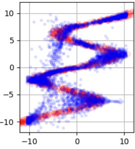

*그림 4-30. 혼합 분포에서의 무작위 샘플링 — 예측 점들이 여러 가지 위에 동시에 놓인다.*

<!-- 슬라이드 252 -->

### 결과: 학습 과정의 관찰

MDN의 학습은 값 하나를 맞히는 과정이 아니라 **분포의 모양이 만들어지는 과정**이다. 따라서 학습 중간 결과로 샘플링 결과와 각 parameter 의 변화를 함께 확인하는 것이 중요하다.

관찰할 것은 네 가지이다. 샘플링 결과, 각 성분의 평균 $\mu(x)$, 혼합계수 $\pi(x)$, 그리고 분산 계수이다. 학습 초반에는 평균 곡선들이 아직 가지를 나누어 갖지 못하고, 혼합계수도 뒤엉켜 있다.

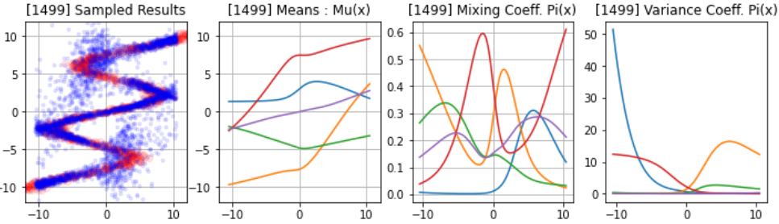

학습이 진행되면 평균 곡선들이 각자 하나의 가지를 맡게 되고, 혼합계수는 구간별로 어느 성분이 활성화되는지를 뚜렷하게 나타내며, 샘플링 결과가 원본 데이터 형태를 잘 재현한다.

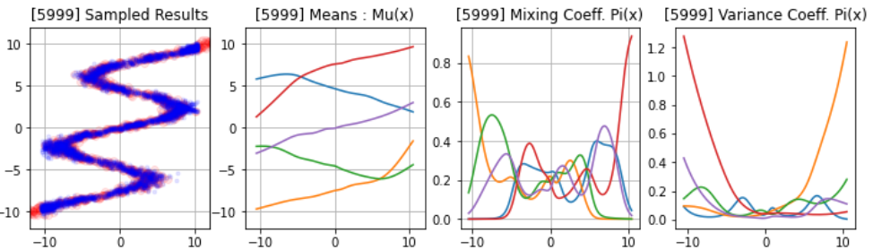

*그림 4-31. 학습 진행에 따른 혼합 모수의 변화.*

<!-- 슬라이드 253 -->

### 결과가 좋지 않은 경우

그러나 종종 좋지 않은 결과가 발생한다. 아래는 같은 설정에서 학습이 잘 되지 않은 경우이다. 샘플링 결과가 데이터의 가운데 영역을 지나치게 넓게 덮고, 특정 구간에서 분산 계수가 비정상적으로 크게 치솟는다. 평균 곡선들도 한 지점에서 급격하게 꺾인다.

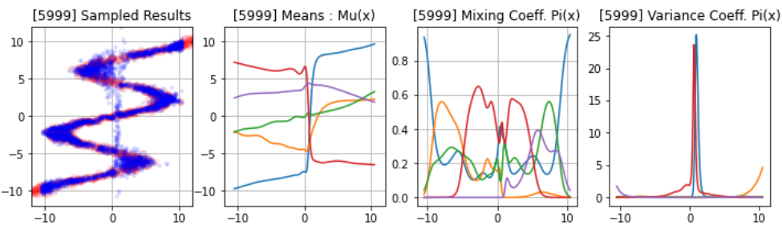

**왜 이런 경우가 발생할까?** MDN의 손실은 로컬 최적해에 빠질 수 있고 수렴이 보장되지 않는다는 점을 앞서 GMM과의 비교에서 확인했다. 성분들이 서로 역할을 나눠 갖지 못하고 한 곳에 몰리거나, 반대로 어떤 성분이 학습에서 사실상 배제되는 일이 생긴다.

가장 직접적인 대응은 **component 수를 늘려서 비교해 보는 것**이다. 성분을 늘리면 평균 곡선의 수가 늘어나 데이터의 각 가지를 나누어 담을 여지가 커지고, 샘플링 결과가 원본 형태에 훨씬 가까워진다.

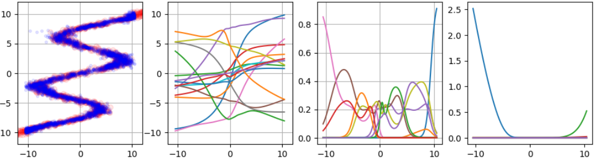

*그림 4-32. component 수를 늘렸을 때의 결과.*

> 관련 노트북: `code/4.2.2.MDN_실습.ipynb` · `code/4.2.3.Technical_MDN.ipynb`

---

## 4.2.13 성분 수 $K$ 의 선택
<!-- 슬라이드 254 -->

그렇다면 $K$ 는 어떻게 정하는가. 고전적인 모델 선택 기준과 딥러닝에서 실제로 쓰는 기준을 비교해 보자.

### AIC / BIC — 이론적으로는 아름답지만

**AIC(Akaike Information Criterion)** 와 **BIC(Bayesian Information Criterion)** 는 이론적으로는 아름답지만, 딥러닝·복잡 모델·유한 데이터 환경에서는 그 가정이 자주 실패한다. 이유는 세 가지이다.

**첫째, 파라미터 수 $k$ 가 DL 모델에서 명확하지 않다.**

- MDN의 가중치 수는 수십만에서 수백만에 이르지만, 실제 자유도는 그보다 훨씬 작다.
- $K$ 값에 따라 AIC/BIC 값이 달라진다.
- MDN에서 "성분 1개당 파라미터 3개"라는 식의 단순 계산은 근사일 뿐이다.
- 결국 이론과 실제 사이에 괴리가 생긴다.

**둘째, 점근적(asymptotic) 가정에 강하게 의존한다.**

- AIC/BIC는 모두 $n \rightarrow \infty$ 에서 유도된 기준이다.
- 데이터가 충분히 많고, 모델이 잘 정의된 통계 모델이며, MLE가 안정적으로 수렴한다는 가정이 필요하다.
- 유한 데이터와 딥러닝의 조합에서는 AIC/BIC의 이론적 근거가 취약해진다.

**셋째, 훈련 데이터의 적합도만 사용한다.** 과적합 여부와 일반화 성능을 평가하지 못한다.

### Validation NLL Loss — DL-MDN에서의 실제 기준

딥러닝 기반 MDN에서는 **Validation NLL Loss** 를 기준으로 삼는다. 교차검증 NLL은 안정적이고, 단순하며, 재현성이 높다. 절차도 명확하다.

- $K = 1, 2, 3, \dots$ 로 값을 바꾸어 각각 학습한다.
- Validation NLL이 가장 낮은 $K$ 를 선택한다.

이 방식이 현업과 논문에서도 가장 흔하게 쓰인다.

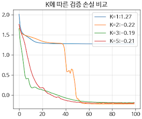

*그림 4-33. $K$ 에 따른 검증 손실 비교 — $K=1$ 은 다중모드를 표현하지 못해 손실이 높은 값에서 멈춘다*

---

## 4.2.14 MDN + RNN — 필기체 예측
<!-- 슬라이드 258~261 -->

MDN은 시퀀스 생성 모델과 결합할 때 특히 강력해진다. 대표적인 적용이 **필기체 생성을 위한 MDN + RNN** 모델이다.

### Deep RNN Architecture

이 구조의 특징은 다음과 같다.

- RNN을 사용하며 하나 이상의 hidden layer 와 **skip connection** 을 함께 쓴다.
- 입력은 한 번에 하나씩 주어진다.
- 출력은 값이 아니라 **예측 값의 확률분포**이다.
- 출력 확률분포에서 샘플링을 하고,
- 그 샘플을 **다음 입력으로 사용**한다.

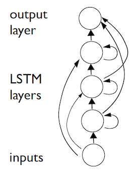

각 층은 LSTM 셀로 구성된다. 게이트 구조가 시퀀스의 장기 의존성을 유지한다.


### Deep RNN prediction architecture

시간축을 펼쳐 보면 구조가 더 분명해진다. 각 시점의 입력 $x_t$ 가 세 층의 은닉 상태를 거쳐 출력 $y_t$ 를 만들고, 그 출력이 다음 시점의 입력에 대한 확률 $\Pr(x_{t+1} \mid y_t)$ 을 정의한다.

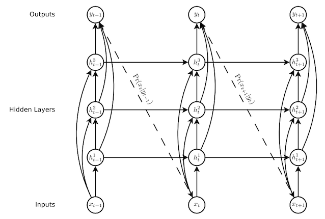

여기서 **Generation 은 출력에서 샘플링되어 다시 입력으로 공급되는 과정**이다. 각 시점의 조건부 확률을 모두 곱하면 시퀀스 $x$ 전체의 확률이 되고, 여기에 음의 로그를 취하면 시퀀스 손실 $L(x)$ 가 된다. 확률이 1에 가까울수록 손실은 0에 가까워지고, 확률이 0에 가까워지면 손실은 무한대로 커진다.

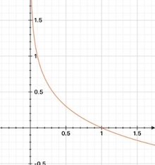

### Handwriting Prediction

필기체 예측에서 입력과 출력은 다음과 같이 정의된다.

- $x_t$ = Pen 위치 $(x_t = x_1, x_2)$ 와 획 상태 $(x_3$ : 획을 끝내면 1$)$

출력 $y_t$ 는 혼합 밀도 함수의 모수 전체이다. $j$ 는 mixture component 의 인덱스이다.

$$y_t = \left(e_t,\; \left\{\pi_t^j,\, \mu_t^j,\, \sigma_t^j,\, \rho_t^j\right\}_{j=1}^{M}\right)$$

각 항의 의미는 다음과 같다.

- $e_t$ : 획 확률 — 획이 여기서 끝날 확률
- $\pi_t^j$ : 혼합 가중치
- $\mu_t^j$ : 평균
- $\sigma_t^j$ : 표준 편차
- $\rho_t^j$ : 상관계수 — 펜의 $x$, $y$ 변위가 서로 연동되므로 2차원 가우시안의 상관을 함께 출력한다

Mixture Density Network 는 이렇게 **혼합밀도 함수의 조합으로 예측**한다. 다음 시점의 조건부 확률은 두 부분으로 구성된다. 다음 펜 변위는 가우시안 혼합으로(Next pen displacement as mixture of Gaussians), 획의 끝은 베르누이로(End of stroke as Bernoulli) 표현된다.

$$\Pr\!\left(x_{t+1} \mid y_t\right) = \sum_{j=1}^{M} \pi_t^j\, \mathcal{N}\!\left(x_{t+1} \mid \mu_t^j, \sigma_t^j, \rho_t^j\right) \times \begin{cases} e_t, & \text{if } (x_{t+1})_3 = 1 \\[2pt] 1 - e_t, & \text{otherwise} \end{cases}$$

이는 앞서 4.2.5에서 본 **복합 출력 component** — 연속 성분과 이진 성분의 결합 분포 — 가 실제 문제에 적용된 형태이다.

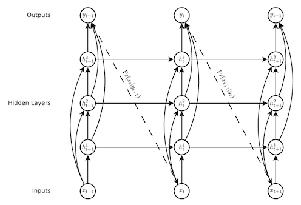

*그림 4-34. MDN + RNN 필기체 예측 모델의 출력 구성*

Mixture Density Network 설명자료: https://goo.gl/dIj5Tx

### Mixture density outputs — 밀도 지도로 본 예측

학습된 모델의 출력을 밀도 지도(density map)로 그리면 MDN이 무엇을 배웠는지 직접 볼 수 있다. 작은 점은 쓰는 도중의 예측치이고, 큰 점은 획의 끝에서 다음 시작점을 예측한 것이다.

아래쪽의 mixture component weight 를 보면 특징이 드러난다. 가장 활동적인 구성 요소가 세 곳에서 단절되며, **획의 끝점 예측은 획 중간의 예측과 다른 혼합 구성 요소를 사용**한다. 즉 모델이 "지금 획을 이어 쓰는 중"과 "지금 획을 끊고 다음으로 건너뛰는 중"을 서로 다른 성분에 나누어 담았다는 뜻이다.

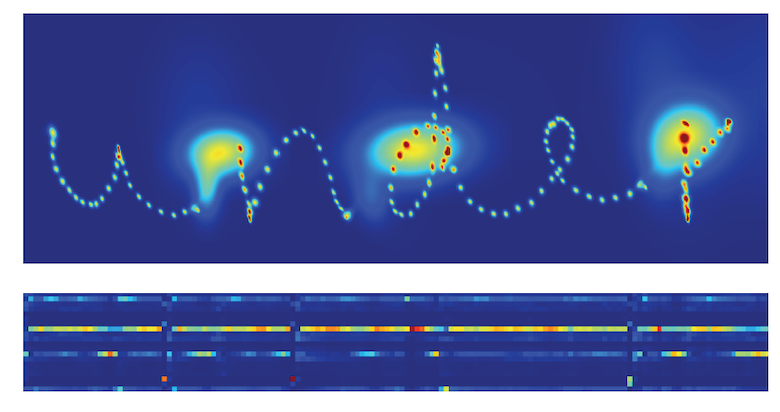

*그림 4-35. 혼합 밀도 출력 — 밝은 영역이 넓을수록 다음 위치에 대한 불확실성이 크다*

---

## 4.2.15 Handwriting Synthesis — Soft Window
<!-- 슬라이드 262~264 -->

### Prediction network 의 한계

앞의 prediction network 만으로는 **원하는 문장을 쓰게 하는 일(synthesis)** 이 불가능하다. 문자의 길이에 따른 필기체의 변화가 너무 크기 때문이다. 실제로 prediction network 가 생성한 결과는 필기처럼 보이지만 읽을 수 있는 단어가 아니다.

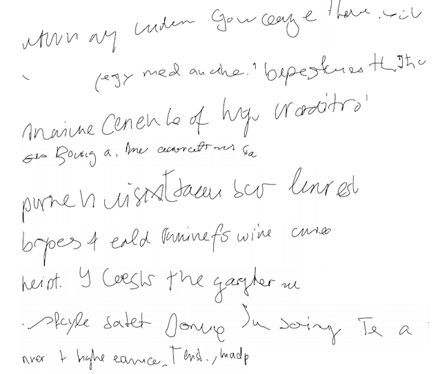

이 문제를 해결하기 위해 **'Soft window' 모델**을 적용한 Handwriting Synthesis network 가 개발되었다.

### Synthesis Network + Heuristics

Soft window 는 쓰려는 문장과 필기 시점을 연결해 주는 장치이다. 길이 $U$ 의 문장 $c$ 와 길이 $T$ 의 시퀀스 $t$ 가 주어질 때, $c$ 에 대한 window $w_t$ 는 각 문자가 적절한 시점 $t$ 에 놓이도록 유도하는 확률분포가 된다.

$$w_t = \sum_{u=1}^{U} \phi(t, u)\, c_u$$

여기서 $\phi(t,u)$ 는 시점 $t$ 에서 $u$ 번째 문자에 얼마만큼의 주의를 둘지를 나타내는 가중치이고, $c_u$ 는 그 문자의 표현이다. 두 시퀀스는 다음과 같이 정의된다.

- Sequence $c$ : $\{c_1, c_2, \dots, c_U\}$ — 쓰려는 문자열
- Sequence $t$ : $\{x_1, x_2, \dots, x_T\}$ — 펜의 궤적

이 window 층은 은닉층 사이에 삽입되어, 각 시점의 은닉 상태가 어느 문자를 참조할지를 결정한다.

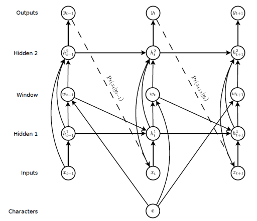

*그림 4-36. Soft window — 은닉층 사이에 삽입된 window 층이 문자열을 참조한다.*

시퀀스가 진행되는 동안의 window 가중치를 그려 보면, 가중치가 왼쪽 아래에서 오른쪽 위로 거의 직선을 따라 이동한다. 이것은 모델이 문자열을 순서대로 하나씩 따라가며 쓰고 있다는 증거이다.

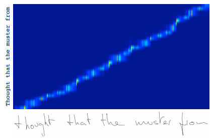

*그림 4-37. Window weights during sequence — 시간이 흐름에 따라 주의가 문자열을 순서대로 훑고 지나간다.*

### 개선된 결과

이 절에서 다룬 내용을 정리하면 다음과 같다.

- LSTM 은 오늘날에도 중요하다. (*LSTM is important in now days*)
- RNN 자체는 결정론적 모델이다. (*RNN is a deterministic model*)
- 그럼에도 불구하고 시퀀스를 생성하는 것이 가능하다. (*However, it is also possible to generate sequences*)
- Synthesis 를 위해서는 heuristic 이 필요하다. (*Heuristics are required for synthesis*)
- 이 방향에는 많은 기회가 남아 있다. (*Has a lot of opportunity*)

> **정리**
> 결정론적 구조인 RNN이 시퀀스를 "생성"할 수 있게 되는 지점은, 출력을 값이 아니라 **분포**로 바꾸고 거기서 샘플링해 다시 입력으로 넣는 순간이다. MDN은 그 분포를 다중 모드로 만들어 준다.

---

## 4.2.16 추가 검토 — 클러스터 구조와 잠재 공간
<!-- 슬라이드 265 -->

MDN의 $\pi(x)$ 변화는 데이터 내부의 **클러스터 경계**와 관련이 있다. 어느 성분이 활성화되는지가 바뀌는 지점은, 데이터가 다른 구조로 넘어가는 지점이기 때문이다. 이 관점은 뒤에서 다룰 다음 주제들과 이어진다.

- GMM 기반 클러스터링과 VAE 잠재 공간에서의 클러스터 구조 분석
- $\pi(x)$ 의 임계 변화 구간과 클러스터 경계의 관계
- 클러스터 할당 불확실성(Hard vs Soft Assignment)의 해석

---

## 4.2.17 심화 과제
<!-- 슬라이드 255~257 -->

### 심화 과제 4-5 — MDN 성능 향상 및 분석

**목적**: $K$ 수와 모델 구조가 미치는 영향을 실험하고, 복잡한 구조에서 MDN의 가능성을 확인한다.

실습 4.2.1의 MDN 코드를 바탕으로 다음 과제들을 수행한다.

**1. Hyperparameter Tuning — $K$ 값 최적화**

- Hidden Layer 를 추가하여 `[128, 64]` 구성으로 학습하고 차이점을 설명하라.
- Hidden Layer 를 추가한 상태에서 Component $k$ 를 `[3, 5, 10, 20]` 으로 변경하여 비교하라.
- NLL Loss 를 기준으로 최적의 조건을 결정하라.

**2. Application to New Data** (실습코드에 포함되어 있음)

- 이중 고리 원형 데이터와 나선형(Spiral) 모양의 Dataset 을 적용하여 모델을 학습하고, 샘플링 결과까지 확인하라.

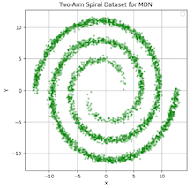

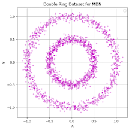

*그림 4-38. 심화 과제에서 사용할 두 개의 데이터셋*

**3. 예측 불확실성 시각화 (Uncertainty Visualization)**

- 과제 2에서 샘플링 점들을 그리는 것에 추가하여,
- 각 Component 의 평균 $\mu$ 와
- 신뢰구간(Confidence Interval) $\mu \pm 2\sigma$ 를
- 음영(shaded region)으로 겹쳐서 시각화하라.

**4. 제출**

- `"과제4-5.ipynb"` 파일로 제출한다. 과제와 무관한 코드는 제거하고, 실행결과와 분석을 포함한다.
- 결과 분석은 노트북 파일에 markdown 으로 작성한다.
- URL을 첨부하지 않는 과제이다.

---

### 심화 과제 4-6 — MDN의 $\pi(x)$ 는 '사건 확률'인가, '모드 존재 신호'인가?

**목적**: MDN 출력 중 혼합 가중치 $\pi(x)$ 를 사건이 일어날 확률로 단순 해석하는 것이 어떤 오류를 낳는지 분석한다. 특히 $\pi$ 가 $x$ 에 따라 변할 때, 이것이 데이터 구조에 대해 무엇을 말하는지와 무엇을 말하지 못하는지를 구분하여 논증한다.

**상황 설정 — 공장 불량 감지 (정상/이상 두 모드)**

- 입력 $x$ = 공정 온도
- MDN 출력: 성분 1 (정상 제품: $\pi_1$, $\mu_1$ = 양품 두께), 성분 2 (불량: $\pi_2$, $\mu_2$ = 불량 두께)
- 저온 구간에서 $\pi_1 \approx 0.9$, 고온 구간에서 $\pi_2 \approx 0.8$ 로 전환된다.

**요구 사항**

1. 선택한 상황에서 $\pi_1(x) = 0.9$ 의 의미를 "사건 발생 확률 90%"로 해석할 때, 어떤 정보가 담겨 있고 어떤 정보가 빠져 있는지 구분하여 설명하라. (힌트: 각 성분의 $\mu$, $\sigma$ 값은 어디에 있는가? $\pi$ 만으로 의사결정이 가능한가?)
2. $x$ 에 따라 $\pi$ 가 변하는 현상을 "모델이 예측 결과를 바꾼다"가 아니라 "데이터의 구조가 $x$ 에 따라 달라진다"로 해석해야 하는 이유를 설명하라.
3. $\pi_1$ 과 $\pi_2$ 가 역전되는 전환 구간($\pi_1 \approx \pi_2$)은 모델이 헷갈린다는 것인가, 아니면 데이터가 두 모드를 동등하게 갖는다는 것인가? 두 해석의 차이를 논하고, 어떤 근거로 구분할 수 있는지 설명하라.
4. $\pi$ 값만으로는 알 수 없는 정보가 무엇인지 나열하고, MDN의 전체 출력 $(\pi, \mu, \sigma)$ 을 함께 봐야 하는 이유를 구체적 예시와 함께 설명하라.

---

### 심화 과제 4-7 — MDN 출력에서 '최종 예측값'은 어떻게 결정해야 하는가?

**목적**: MDN은 $(\pi, \mu, \sigma)$ 로 구성된 혼합 분포를 출력하며, 단일 값을 직접 예측하지 않는다. 이 과제에서는 MDN 출력으로부터 최종 예측값을 결정하는 세 가지 전략(가장 높은 $\pi$ 의 $\mu$ 선택 / 전체 혼합 평균 / 무작위 샘플링)의 차이를 분석하고, 각 전략이 적합한 상황과 그렇지 않은 상황을 논증한다.

**상황 설정 — 주식 수익률 시나리오 예측**

- 입력 $x$ = 전날 시장 지표
- MDN 출력: 성분 1 (상승 시나리오 $\pi = 0.55$, $\mu_1 = +2\%$), 성분 2 (하락 시나리오 $\pi = 0.45$, $\mu_2 = -3\%$)
- 투자자는 하나의 포지션을 취해야 하지만, 리스크 관리를 위해 분포 전체를 알아야 한다.

아래 세 가지 전략을 선택한 문제에 적용했다고 가정하고 답하라.

- **전략 A**: 가장 높은 $\pi$ 를 가진 성분의 $\mu$ 를 최종 예측값으로 사용 (Winner-Take-All)
- **전략 B**: 혼합 평균 $\mathbb{E}[y \mid x] = \sum_k \pi_k \mu_k$ 를 최종 예측값으로 사용
- **전략 C**: $p(y \mid x)$ 에서 무작위 샘플링하여 최종 예측값으로 사용

**요구 사항**

1. 전략 A (Winner-Take-All)가 어떤 상황에서는 적합하고 어떤 상황에서는 실패하는지 설명하라.
2. 전략 B (혼합 평균)가 역설적으로 어떤 모드에도 속하지 않는 값을 예측값으로 내놓을 수 있는 이유를 설명하고, 이것이 단순 회귀와 구조적으로 어떻게 다른지 논하라.
3. 전략 C (무작위 샘플링)가 단일 예측값이 필요한 상황에서 부적합한 이유와, 적합한 상황을 설명하라.
4. 세 전략 중 선택한 문제에 가장 적합한 전략을 고르고, 그 이유를 다음 기준으로 논증하라.
   - 의사결정 목적 (단일 결정 vs 리스크 분산)
   - 오분류 비용 (두 모드를 혼동했을 때의 대가)
   - 분포 전체 정보의 활용 여부

---

## 4.2.18 정리
<!-- 슬라이드 233~265 요약 -->

> **정리**
> - 결정론적 모델은 함수 $f(x)$ 를, 확률론적 모델은 조건부 분포 $p(y \mid x)$ 의 **모수**를 학습한다. 예측값은 그 분포에서 샘플링으로 얻는다.
> - MDN은 조건부 출력 분포를 $K$ 개 가우시안의 혼합 $\sum_k \pi_k(x)\mathcal{N}(y \mid \mu_k(x), \sigma_k^2(x))$ 로 표현한다. 모수가 모두 $x$ 의 함수라는 점이 GMM과의 결정적 차이다.
> - 출력층은 제약에 맞춰 설계한다. $\pi_k$ 는 softmax, $\sigma_k$ 는 $\exp$ 또는 softplus 로 양수화하고, $\mu_k$ 는 그대로 쓴다.
> - 손실은 NLL이며 log 안에 sum 이 있어 underflow 위험이 있다. **log-sum-exp 트릭**이 필수이다. NLL 최소화는 MLE 및 KLD 최소화와 동치이고, MSE와 Cross Entropy도 그 특수한 경우이다.
> - 하나의 입력에 여러 정답이 존재하는 **역문제**에서 단일 출력 회귀는 정답들의 평균을 학습해 실패한다. MDN은 그 갈래를 성분으로 나누어 담는다.
> - $K$ 는 AIC/BIC 대신 **Validation NLL** 로 고른다.
> - 출력을 분포로 바꾸고 거기서 샘플링해 다시 입력으로 넣으면, 결정론적 RNN도 시퀀스를 생성할 수 있다. 필기체 예측·합성이 그 사례이다.
