<!-- ───────────────── 강의 음성 기반 보완 제안 ─────────────────
  이 파일의 제안 21건 (결과해석 6 / 그림해설 14 / 실무맥락 1)

  각 제안은 「+강의」 마커로 감싸여 있다. 마커 줄 끝의 판정을 고친다.
    채택하려면  물음표를  y  로
    기각하려면  물음표를  n  로
    보류하면    그대로 두면 되고 '미검토'로 보고된다

  검토를 마치면 저장소 루트에서  python3 apply_lecture.py  를 실행한다.
  (--dry-run 을 붙이면 고치지 않고 집계만 한다)
  ─────────────────────────────────────────────────────────── -->

# 5.1 오류 구조 (Error Structure)

**학습 목표**

- OLS의 네 가지 가정을 이해하고, 각 가정의 위반이 어떤 오류 패턴으로 나타나는지 진단할 수 있다.
- 잔차 분석 3층위(입력 공간·잠재 공간·출력 공간)를 체계적으로 수행할 수 있다.
- 이분산 오차(Heteroscedastic Error)와 하위그룹 오차(Subgroup Error)를 구분하고 각각에 맞는 처방을 제시할 수 있다.
- 표준화 잔차(Standardized Residual), 레버리지(Leverage), Cook's Distance, DFFITS/DFBETAS로 이상치와 영향점(influential point)을 식별할 수 있다.
- Q-Q Plot, Durbin-Watson, ACF/PACF로 잔차의 정규성·자기상관 구조를 진단할 수 있다.
- 분류 모델의 피어슨 잔차(Pearson Residual)와 이탈도 잔차(Deviance Residual)를 회귀 잔차와 대응시켜 이해할 수 있다.
- 부분 잔차 플롯(Partial Residual Plot)으로 개별 Feature의 부분 잔차를 분리해 시각화할 수 있다.
- 오류 공간 분석 5단계 파이프라인을 실제 데이터에 적용할 수 있다.

**이 절의 구성**

- 5.1.1 오류 공간에서 데이터 구조를 본다
- 5.1.2 선수 개념 (1) — OLS의 네 가지 가정과 딥러닝에서의 의미
- 5.1.3 선수 개념 (2) — p-value와 유의확률
- 5.1.4 통계 검정의 의사결정 흐름
- 5.1.5 검정 통계량과 귀무가설
- 5.1.6 모수 검정과 비모수 검정의 선택
- 5.1.7 오류 공간과 잔차의 상태
- 5.1.8 잔차 분석의 3층위 — 입력·잠재·출력 공간
- 5.1.9 출력 공간의 두 오류 유형 — 이분산 오류와 서브그룹 오류
- 5.1.10 이분산성을 구조 신호로 읽기
- 5.1.11 서브그룹 오류 구조와 DGP 역추론
- 5.1.12 잔차 기본 통계와 이분산성 진단
- 5.1.13 표준화 잔차와 레버리지
- 5.1.14 이상치, 영향력 점, 그리고 Cook's Distance
- 5.1.15 딥러닝에서의 Cook's Distance 근사
- 5.1.16 영향력 점 진단과 서브그룹 복원
- 5.1.17 분류 모델에서의 잔차
- 5.1.18 분류 잔차로 위험한 오류 찾기
- 5.1.19 잠재 공간의 오류 클러스터
- 5.1.20 잠재 공간에서 오류 분포 읽기
- 5.1.21 비시계열 데이터의 독립성 위반과 대응
- 5.1.22 심화 과제
- 5.1.23 정리

> 실습 번호는 강의 슬라이드의 번호를 그대로 쓴다. 소절 번호와는 무관하다.

---

## 5.1.1 오류 공간에서 데이터 구조를 본다
<!-- 슬라이드 268~269 -->

### 오류는 잡음인가 신호인가

모델이 틀리는 샘플, 즉 오류 샘플들은 무작위로 흩어져 있는가, 아니면 구조적 패턴을 갖는가. 이 질문이 오류 공간 분석(Error Space Analysis)의 출발점이다.

이 절에서는 모델의 오류를 **틀린 예측**이 아니라 **숨겨진 데이터 구조의 신호**로 바라본다. 모델이 특정 구간에서 체계적인 오류를 내놓는다면, 그 오류 패턴 자체가 데이터 생성 과정(DGP, Data Generating Process)의 구조를 반영하고 있을 가능성이 높다. 그렇다면 오류는 제거할 잡음이 아니라 분석해야 할 구조다.

> **핵심 메시지**
> 모델이 계측기라면, 오류는 계측기가 포착하지 못한 나머지 구조다.

### 이 주제가 놓인 자리

오류 구조 분석은 앞뒤의 주제들과 맞물려 있다.

- **MDN(Mixture Density Network)** 은 다중 모드 분포를 모델링하는 해법을 제시한다. 즉 **분포를 설계하는 도구**다.
- **오류 구조 분석**은 단일 회귀 모델이 실패하는 구조를 오류 공간에서 역추론한다. 즉 **분포가 필요함을 발견하는 도구**다.
- 이 두 방향이 합쳐질 때 완전한 구조 분석이 된다. 한쪽은 해법을 갖고 있고 다른 한쪽은 문제를 발견한다.
- **혼동 구조 분석**은 클래스 간 오류 패턴을 심화해서 다룬다. 오류 구조 분석이 오류의 발생과 구조를 발견한다면, 혼동 구조 분석은 그 구조가 클래스 경계와 어떻게 맞닿아 있는지를 분석한다.

### 편차와 잔차를 구분한다

용어를 먼저 정리한다. 비슷해 보이지만 기준점이 다르다.

- **편차(Deviation)** 는 관측값과 관측 평균의 차이다. 데이터가 얼마나 퍼져 있는지를 나타낸다.
- **잔차(Residual)** 는 관측값과 모델 예측의 차이다. 모델이 설명하지 못하는 오차를 나타낸다.

그렇다면 오류 구조에서 말하는 오류는 잔차인가. 두 층위의 답이 있다.

- **좁은 의미** — 출력 공간의 잔차 공간을 가리킨다.
- **넓은 의미** — 잔차 분석 3층위(입력 공간·잠재 공간·출력 공간)의 관점에서, 입력·잠재·출력 각 공간에서의 잔차 공간을 모두 가리킨다.

---

## 5.1.2 선수 개념 (1) — OLS의 네 가지 가정과 딥러닝에서의 의미
<!-- 슬라이드 270~271 -->

### OLS란 무엇인가

OLS(Ordinary Least Squares, 최소제곱법)는 선형 회귀의 표준 방법이며 여러 변형이 존재한다. 잔차 제곱합을 최소화하는 파라미터를 추정한다는 점이 핵심이다.

딥러닝 회귀 모델의 MSE 손실 함수는 OLS의 목적함수와 수학적으로 동일하다. 따라서 **OLS의 통계적 진단 도구는 딥러닝 모델에도 직접 적용할 수 있다.** 이것이 통계학의 잔차 진단 도구 전체를 딥러닝 분석에 끌어올 수 있는 근거다.

선형 모형은 다음과 같이 쓴다.

$$y = X\beta + \varepsilon$$

여기서 $X$ 는 입력 행렬, $\beta$ 는 계수 벡터, $\varepsilon$ 은 오차다. OLS 추정량은

$$\hat{\beta} = (X^\top X)^{-1} X^\top y$$

로 계산된다. 이 추정량이 최선의 불편추정량(BLUE, Best Linear Unbiased Estimator — 가장 정밀하고 편향되지 않은 선형 추정량)이 되려면 Gauss-Markov 조건이 성립해야 한다.

### 세 가지 가정, 그리고 하나 더

Gauss-Markov 조건은 세 가지 가정으로 이루어진다. 이 세 가지가 모두 성립할 때 OLS 추정량은 BLUE가 된다. **정규성**은 BLUE 자체에는 불필요하지만, 가설 검정과 신뢰구간의 분포를 다루기 위해 함께 가정한다. 그래서 흔히 3(+1)가지 가정이라고 부른다.

다음 표는 네 가지 가정 각각이 무엇을 요구하고, 위반될 때 어떤 증상이 나타나며, 어떤 도구로 진단하는지를 정리한 것이다.

| 가정 | 내용 | 위반 증상 | 진단 도구 |
|---|---|---|---|
| 선형성 | 입력과 출력 사이 선형 관계 | 잔차 vs 예측값에 곡선 패턴 | 부분 잔차 플롯 |
| 등분산성 | 오차의 분산 $\sigma^2$ 이 일정 | 나팔 모양 잔차, BP 검정 유의 | Breusch-Pagan, Spearman |
| 독립성 | 오차 간 상관 없음 | 잔차 자기상관 패턴 | Durbin-Watson, ACF/PACF |
| 정규성 | 오차 $\varepsilon \sim N(0, \sigma^2)$ | Q-Q Plot 이탈, 분포 왜도/첨도 | Q-Q Plot, Shapiro-Wilk |

### 딥러닝과 OLS 가정의 관계

딥러닝 모델에서 네 가정은 각각 다른 무게를 갖는다.

**선형성 가정의 완화** — 딥러닝은 비선형 모델이므로 선형성 가정은 완화된다. 그러나 나머지 세 가지는 여전히 중요한 가정으로 남는다.

**등분산성 위반** — 오류 크기가 입력의 특정 구간에서 집중된다. 이분산 회귀나 MDN으로 대응하고, 오류 구조 분석 단계에서 진단한다.

**정규성 위반** — 예상보다 극단적인 오류가 자주 발생하고 신뢰구간 추정이 실패한다. Q-Q Plot으로 진단한다.

**독립성 위반** — 시계열이 아닌 경우에는 군집 간 상관, 공간적 상관, 반복측정, 계층적·중첩 구조에서 발생한다. 시계열에서는 잔차 자기상관이 잔존하여 모델이 시간적 패턴을 포착하지 못했음을 알린다. Durbin-Watson과 ACF로 진단한다.

이분산 회귀($\mu$ 와 $\sigma$ 를 동시에 예측하는 모델)가 기본적인 대응 방법을 제시했다면, 오류 구조 분석은 **진단과 역추론에 집중**한다.

---

## 5.1.3 선수 개념 (2) — p-value와 유의확률
<!-- 슬라이드 271~273 -->

### p-value의 정의

p-value(probability-value, 유의확률)는 귀무가설 $H_0$ 조건에서 극단적인 관찰이 발생할 확률이다. 계산 순서는 다음과 같다. 먼저 $t$, $z$ 등의 검정 통계량을 계산하고, 그 통계량의 확률분포에서 확률을 계산한다. p-value는 주어진 검정 통계량을 기준으로 그보다 극단적인 값이 나올 확률이다.

동전 던지기를 예로 든다. 96%의 비율로 앞면이 나왔다고 하자. $H_0$(동전이 정상이다)가 참일 때 이런 극단적인 일이 일어날 확률은 $p = 0.00001\%$ 수준으로 지극히 작다. 그렇다면 동전이 정상적이지 않다고 판단하여 $H_0$ 를 기각한다.

검정 통계량에 따라 좌측 꼬리, 우측 꼬리, 또는 양쪽 꼬리의 확률을 선택하거나, 검정법 안에 이미 선택되어 있다.

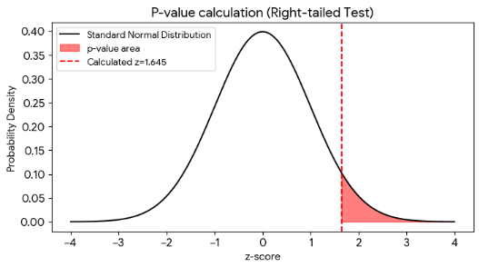

<!-- +강의 id=5.1_오류구조-01 w=w9 ts=[11:23]~[12:20] 유형=그림해설 채택=? -->
이 그림은 p-value가 만들어지는 순서를 그대로 보여준다. 먼저 데이터의 평균과 분산으로 분포 전체를 구성하고, 그 위에 계산된 검정 통계량을 한 점으로 찍는다. 그 점보다 바깥에 남은 붉은 영역의 넓이가 곧 극단적 관찰이 나올 확률이다.
<!-- /+강의 -->

z 통계량은 표본평균과 모평균의 차이를 표준오차로 나눈 값이다.

$$z = \frac{\bar{x} - \mu}{\sigma / \sqrt{n}}$$

### 유의수준 $\alpha$ 와 기각 조건

$\alpha$ 는 유의수준이며 $H_0$ 를 기각하는 기준 확률이다. 통상 $\alpha = 5\% = 0.05$ 를 쓴다.

$p < 0.05$ 라는 것은 $H_0$ 가 참일 때 지금의 관찰이 우연히 발생할 확률이 5% 미만이라는 뜻이다. 즉 우연이 아니며 유의미하다는 뜻이고, 귀무가설 $H_0$ 를 기각한다. 예를 들어 귀무가설이 $H_0$: 등분산일 때 관찰 데이터의 $p < 0.05$ 이면 귀무가설을 기각하므로 이분산이라고 결론 내린다.

### 세 가지 주의 사항

p-value는 흔히 오해되는 지표다. 세 가지를 기억해야 한다.

**첫째, p는 $H_0$ 가 옳을 확률이 아니다.** p는 $H_0$ 하에서 극단적 관찰이 나올 확률이다.

**둘째, 효과가 존재할 때 데이터가 많을수록 p값은 작아진다.** 그 결과 의미 없는 차이가 유의미한 결과로 보고될 수 있다.

**셋째, 통계적 유의성은 효과 크기(Effect Size)와 같지 않다.** 다이어트 효과의 p-value가 0.0001이라도 실제 감량은 0.1kg일 수 있다.

### 표본 크기가 p값에 미치는 영향

두 번째 주의 사항을 동전 던지기로 확인한다. 핵심은 **효과가 존재할 때(= $H_0$ 와 현실 사이에 차이가 있을 때)에만** 표본 크기가 p값을 끌어내린다는 점이다.

**효과가 없는 경우** — $H_0$: 동전이 공정하다(앞면 = 50%)이고 현실도 진짜로 50%인 상황이다.

- 10번 던져 앞면이 6번(60%) 나오면 $p = 0.38$ 이므로 기각하지 못한다. ($n < 30$ 이므로 이항분포에서 직접 계산)
- 10000번 던져 앞면이 5012번(50.1%) 나오면 $p = 0.81$ 이므로 기각하지 못한다. ($n > 30$ 이므로 z-비율 검정으로 근사)
- $N$ 이 커져도 p는 작아지지 않는다. 진짜로 공정하기 때문에 많이 던질수록 오히려 50%에 수렴한다.

**효과가 존재하는 경우** — 살짝 찌그러진 동전이어서 실제 앞면 확률이 51%인 상황이다.

- 10번 던져 앞면이 5번(50%)이면 $p = 1.0$ 으로 감지 자체가 불가능하다.
- 10000번 던져 앞면이 5100번(51%)이면 $p = 0.046$ 으로 유의하다.
- 1000000번 던져 앞면이 510000번(51%)이면 $p \approx 0.0000$ 으로 매우 유의하다.
- 1%의 미세한 차이도 $n$ 이 충분히 크면 감지된다. 그러나 51% 대 50%가 실질적으로 의미 있는 차이인가는 별개의 질문이다.

### p-value와 검정 통계량의 관계

p-value는 검정 통계량에 대한 이상치 확률을 계산한 값이며, 검정 통계량이 곧 $H_0$ 를 결정한다. 절차는 네 단계다.

1. **검정 통계량을 선택한다.** Shapiro-Wilk의 $W$, Levene의 $F$, t-test의 $t$, z-test의 $z$ 등이 있다.
2. **검정 통계량을 선택하면 $H_0$ 가 자동으로 결정된다.** $t$ 를 쓰면 $H_0$ 는 "평균 차이 없음"이고, $F$ 를 쓰면 $H_0$ 는 "분산 동일"이다.
3. **데이터로부터 검정 통계량 값을 계산한다.** 예를 들어 $z = 2.30$ 이 나온다.
4. **해당 확률분포에서 이 값의 확률을 계산한다.** $P(Z \ge 2.30 \mid H_0) = 0.011$(단측)이므로 $p(0.011) < \alpha(0.05)$ 이고 $H_0$ 를 기각한다.

자주 쓰이는 z 값의 임계 확률은 다음과 같다.

| z 값 | 단측 확률 | 양측 확률 |
|---|---|---|
| 1.645 | 5% | 10% |
| 1.96 | 2.5% | 5% |
| 2.576 | 0.5% | 1% |

<!-- +강의 id=5.1_오류구조-02 w=w9 ts=[21:59]~[22:52] 유형=결과해석 채택=? -->
실제로 많이 쓰는 기준은 단측 5%와 양측 5%이며, 표에서 각각 $z = 1.645$ 와 $z = 1.96$ 에 해당한다. 다만 이 임계값은 표본 크기 $n$ 이 달라지면 함께 크게 바뀌므로, $z$ 값만 보지 말고 표본 크기를 같이 확인해야 한다.
<!-- /+강의 -->

---

## 5.1.4 통계 검정의 의사결정 흐름
<!-- 슬라이드 274 -->

검정은 하나만 골라 쓰는 것이 아니라 순서가 있다. 앞 단계의 전제 조건이 충족되어야 다음 단계의 결과를 신뢰할 수 있다.

### 단계 1: 정규성 검정 (Normality Test)

검정법으로는 Shapiro-Wilk(샤피로-윌크), Kolmogorov-Smirnov(콜모고로프-스미르노프), Anderson-Darling(앤더슨-달링)이 있다. 귀무가설은 $H_0$: 데이터가 정규분포를 따른다이다.

- $p \ge 0.05$ 이면 정규로 간주하고 단계 2로 진행한다.
- $p < 0.05$ 이면 정규가 아니므로 비모수 검정으로 전환한다.

### 단계 2: 등분산 검정 (Homogeneity of Variance)

검정법으로는 Levene(레빈), Bartlett(바틀릿), Brown-Forsythe(브라운-포사이스), F-Test가 있다. 귀무가설은 $H_0$: 각 집단의 분산이 동일하다(등분산)이다.

- $p \ge 0.05$ 이면 등분산이므로 t-test 또는 ANOVA를 사용한다.
- $p < 0.05$ 이면 이분산이므로 Welch t-test 또는 Welch ANOVA(웰치 아노바)를 사용한다.

### 단계 3: 본 검정 (Main Test)

**모수 검정(Parametric)** 은 정규성과 등분산이 모두 충족될 때 사용한다. 2집단이면 t-test, 3집단 이상이면 ANOVA를 쓰고, 이분산이면 Welch 보정을 적용한다.

**비모수 검정(Nonparametric)** 은 정규성이 충족되지 않을 때 사용한다. 2집단이면 Mann-Whitney U(맨-위트니 U), 3집단 이상이면 Kruskal-Wallis(크러스칼-왈리스)를 쓰고, 대응 표본이면 Wilcoxon(윌콕슨)을 쓴다.

> **핵심 원칙**
> 각 단계의 전제 조건이 충족되어야 다음 단계의 결과를 신뢰할 수 있다. 검정 통계량이 곧 귀무가설을 결정하고, p-value는 귀무가설 하에서의 이상치 확률이다. 표본 크기, 유의수준 설정, 효과 크기를 함께 고려해야 한다.

---

## 5.1.5 검정 통계량과 귀무가설
<!-- 슬라이드 275~276 -->

검정 통계량을 고르는 일은 귀무가설을 고르는 일과 같다. 다섯 범주로 나누어 정리한다.

### 1. 정규성 검정 — $H_0$: 데이터가 정규분포를 따른다

- **Shapiro-Wilk ($W$)** — 순서통계량과 정규분포 기대값 사이의 선형 상관 비율을 본다. 소표본($n < 50$)에서 가장 강력하다.
- **Kolmogorov-Smirnov ($D$)** — 경험적 CDF와 이론적 CDF 사이의 최대 거리를 본다. 대표본에 적합하다.
- **Anderson-Darling ($A^2$)** — K-S와 유사하되 꼬리(tail)에 가중치를 부여한다. 꼬리 이탈 감지에 강하다.
- **D'Agostino-Pearson ($K^2$)** — 왜도(skewness)와 첨도(kurtosis)를 결합한 카이제곱 통계량이다.

### 2. 등분산 검정 — $H_0$: 각 집단의 분산이 동일하다

- **Levene ($F$/$W$)** — 중앙값 또는 평균으로부터의 편차에 ANOVA를 수행한다. 정규성이 필요 없고 이상치에 강건하다.
- **Bartlett ($\chi^2$)** — 각 집단 분산의 로그 가중합을 카이제곱으로 변환한다. 정규분포 전제가 필요하다.
- **Brown-Forsythe ($F$)** — Levene의 변형으로, 편차를 중앙값 기준으로 계산한다. 이상치에 더 강건하다.
- **F-test ($F$)** — 두 집단 분산의 비율 $s_1^2 / s_2^2$ 를 본다. 2집단에 한정되며 정규성에 매우 민감하다.

**$\chi^2$(카이제곱) 통계량**은 기대빈도와 실제 관측빈도가 얼마나 다른지를 재는 값이다.

$$\chi^2 = \sum \frac{(\text{관측값} - \text{기대빈도})^2}{\text{기대빈도}} = \sum \frac{(O - E)^2}{E}$$

여기서 기대빈도는 $H_0$ 가 참일 때 예상되는 값이다. $H_0$: 주사위가 공정하다(각 면 확률 = 1/6)를 60번 던져 검정해 본다.

| 면 | 1 | 2 | 3 | 4 | 5 | 6 |
|---|---|---|---|---|---|---|
| 관측횟수 $O$ | 8 | 12 | 7 | 15 | 10 | 8 |
| 기대횟수 $E$ | 10 | 10 | 10 | 10 | 10 | 10 |

$$\chi^2 = \frac{(8-10)^2}{10} + \frac{(12-10)^2}{10} + \frac{(7-10)^2}{10} + \frac{(15-10)^2}{10} + \frac{(10-10)^2}{10} + \frac{(8-10)^2}{10}$$

$$= 0.4 + 0.4 + 0.9 + 2.5 + 0.0 + 0.4 = 4.6$$

자유도는 $df = 6 - 1 = 5$ 이고 $P(\chi^2 \ge 4.6 \mid df=5) = 0.47$ 이다. $p(0.47) > \alpha(0.05)$ 이므로 $H_0$ 를 유지하며 공정하다고 간주한다.

### 3. 평균 비교 — $H_0$: 집단 간 평균 차이가 없다

- **z-test ($z$)** — $(\bar{x} - \mu_0) / (\sigma/\sqrt{n})$ 을 계산한다. 모분산을 알 때만 사용한다.
- **t-test ($t$)** — $(\bar{X}_1 - \bar{X}_2) / SE$ 를 계산하며 합동 표준오차를 사용한다. 등분산과 정규성을 전제한다. 유형은 독립표본, 대응표본, 단일표본으로 나뉜다.
- **Welch t-test ($t$)** — 각 집단의 분산을 따로 사용하고 자유도를 조정한다. 이분산일 때 사용한다.
- **ANOVA ($F$)** — 집단 간 분산을 집단 내 분산으로 나눈 분산비를 본다. 3집단 이상에 쓰며 등분산과 정규성을 전제한다.

### 4. 비모수 검정 — $H_0$: 집단 간 분포(순위)에 차이가 없다

- **Mann-Whitney ($U$)** — 두 집단 데이터를 합쳐 순위를 매긴 후 순위합을 비교한다. 독립 t-test의 대안이다.
- **Wilcoxon ($W$)** — 차이값의 부호와 순위를 결합한다. 대응 t-test의 대안이다.
- **Kruskal-Wallis ($H$)** — 전체 데이터의 순위를 기반으로 집단 간 변동을 비교한다. One-way ANOVA의 대안이다.

### 5. 연관성·독립성 검정 — $H_0$: 두 변수는 독립이며 상관이 없다

- **Chi-square ($\chi^2$)** — $(O - E)^2 / E$ 의 합을 본다. 범주형 × 범주형에 쓴다.
- **Fisher Exact ($p$)** — 초기하분포로 정확한 확률을 계산한다. 소표본 $2 \times 2$ 교차표에 쓴다.
- **Pearson ($r \to t$)** — 상관계수 $r$ 을 $t$ 통계량으로 변환한다. 연속형이며 선형관계와 정규성을 전제한다.
- **Spearman ($\rho \to t$)** — 순위 기반 상관계수다. 비모수이며 단조관계를 본다.

**초기하분포(Hypergeometric Distribution)** 는 행 합계와 열 합계가 고정된 상태에서 특정 배치가 나올 확률을 준다. $H_0$: 약물과 치료 결과는 독립이다(약이 효과 없다)를 검정해 본다.

| | 치료됨 | 안됨 | 합계 |
|---|---|---|---|
| 신약 | 4 | 1 | 5 |
| 위약 | 1 | 4 | 5 |
| 합계 | 5 | 5 | 10 |

관찰 결과 신약 그룹에서 5명 중 4명이 치료되어 효과가 있어 보인다. 그러나 $n = 10$ 으로 매우 작아 $\chi^2$ 는 부정확하다. 이는 카드 10장(치료 5장, 미치료 5장)에서 5장을 뽑았을 때 치료 카드가 4장일 확률을 묻는 문제와 같다. $p\text{-value} = P(k \ge 4) = 0.099\,(k=4) + 0.004\,(k=5) = 0.103$ 이다. $p(0.103) > \alpha(0.05)$ 이므로 $H_0$ 를 유지하며, 효과가 있다고 할 수 없다.

---

## 5.1.6 모수 검정과 비모수 검정의 선택
<!-- 슬라이드 277 -->

### 두 계열의 장단점

**모수 검정(Parametric Test)** 은 정규성, 등분산성, 독립성, 연속형 데이터를 전제 조건으로 요구한다. 통계적 검정력(파워)이 높아 적은 표본에서도 차이를 감지할 수 있다는 것이 장점이다. 그러나 전제 조건이 위반되면 결과의 신뢰성이 떨어지고 이상치에 민감하다.

**비모수 검정(Nonparametric Test)** 은 분포 가정이 없으며 순서·순위 데이터에도 쓸 수 있다. 이상치에 강건하고 순서형·범주형 데이터에 적용할 수 있다는 것이 장점이다. 대신 모수 검정에 비해 검정력이 낮고, 대표본이 필요하며, 복잡한 분석에는 제한적이다.

### 대응 관계

두 계열은 다음과 같이 짝을 이룬다.

- 독립 2집단: t-test ↔ Mann-Whitney U
- 대응 2집단: 대응 t-test ↔ Wilcoxon Signed-Rank
- 독립 3집단 이상: One-way ANOVA ↔ Kruskal-Wallis
- 반복측정: 반복측정 ANOVA ↔ Friedman
- 상관분석: Pearson $r$ ↔ Spearman $\rho$

### 선택 기준 요약

- 정규성 검정을 통과하고 등분산도 통과하면 모수 검정을 사용한다.
- 정규성에 실패하면 비모수 검정으로 전환한다.
- 정규성은 통과했으나 등분산에 실패하면 Welch 보정을 적용한다.
- 순서형·범주형 데이터에는 비모수 검정만 가능하다.
- 대표본($n \ge 30$)일 때는 중심극한정리(CLT)에 의해 모수 검정이 가능할 수 있다.

---

## 5.1.7 오류 공간과 잔차의 상태
<!-- 슬라이드 278 -->

### 오류 공간의 정의

오류 공간(Error Space)이란 잔차의 공간적 구조를 말한다. 크기, 방향, 분포, 패턴, 연속성 등이 그 구조를 이루는 요소다.

### 오류의 세 가지 원인

오류에는 세 가지 원인이 있고, 원인에 따라 다른 접근이 필요하다. 모델 편향과 모델 분산은 모델 구조 개선과 학습 방법 개선으로 해결한다. 반면 **구조적 오류는 데이터의 숨겨진 구조에 따라 접근을 결정해야 한다.**

다음 표는 세 오류 유형의 원인, 특성, 처방을 비교한 것이다.

| 오류 유형 | 원인 | 특성 | 처방 |
|---|---|---|---|
| 모델 편향 (Bias) | 모델 복잡도 부족 (Underfitting) | 전체적으로 체계적인 과소 또는 과대 예측 | 모델 구조 개선 |
| 모델 분산 (Variance) | 과적합 (Overfitting) | Training / Validation loss 차이가 너무 큼 | 데이터 정규화, 데이터 증강, 모델 구조·학습 개선 |
| 구조적 오류 (Structural) | 데이터의 복합 구조 | 특정 서브그룹에서 집중적 오류 | DGP 역추론, 모델 분리 |

### 잔차의 특성 — White Noise와 구조적 오류 신호

잔차에서 패턴이 발견되면 그것은 구조적 오류 신호다. 즉 모델이 포착하지 못한 구조가 남아 있다는 뜻이다. 다음 표는 잔차가 보이는 상태별로 그 의미와 다음 단계를 정리한 것이다.

| 잔차 상태 | 의미 | 다음 단계 |
|---|---|---|
| 평균 $\approx 0$, 분산 일정, 자기상관 없음 | White Noise — 모델이 구조를 잘 포착 | 추가 분석 불필요 |
| 분산이 예측값에 따라 변화 | 이분산성 — 노이즈 크기가 구조 의존적 | Breusch-Pagan 검정, 이분산 회귀 |
| 잔차에 뚜렷한 군집 형성 | 서브그룹 오류 — 복수 규칙 존재 | k-means clustering, 잠재 공간 투영 |
| 잔차가 연속된 양/음 부호 유지 | 자기상관 — 시간 패턴 포착 부족 | Durbin-Watson 검정, ACF/PACF 분석 |

여기서 언급되는 두 알고리즘의 성격을 구분해 둔다. **k-means clustering**은 비지도학습으로 $k$ 개 군집을 찾아 레이블을 부여한다. **KNN(k-Nearest Neighbors)** 은 지도학습으로 주어진 레이블을 통해 새 샘플을 예측한다.

---

## 5.1.8 잔차 분석의 3층위 — 입력·잠재·출력 공간
<!-- 슬라이드 279~281 -->

잔차를 어느 공간에서 바라보는가에 따라 드러나는 정보가 다르다. 좁은 의미의 오류 공간은 출력의 잔차 공간이지만, 넓은 의미의 오류 공간은 입력·잠재·출력 공간에서의 잔차 공간을 모두 뜻한다.

### Level 1: 입력 공간에서의 오류 분포

입력 변수 공간(Feature Space)에서 오류 또는 오류 샘플을 시각화한다. 고차원 입력은 PCA나 t-SNE 등으로 2차원에 투영한다.

이 층위에서 발견할 수 있는 것은 세 가지다.

- **특정 입력에서 오류가 집중**되면 해당 구간의 데이터가 부족하거나 특이한 구조가 있다는 뜻이다.
- **오류 샘플이 특정 클러스터를 형성**하면 서브그룹 오류의 초기 신호다.
- **오류 크기가 입력값에 비례**하면 이분산성 진단의 시작점이다.

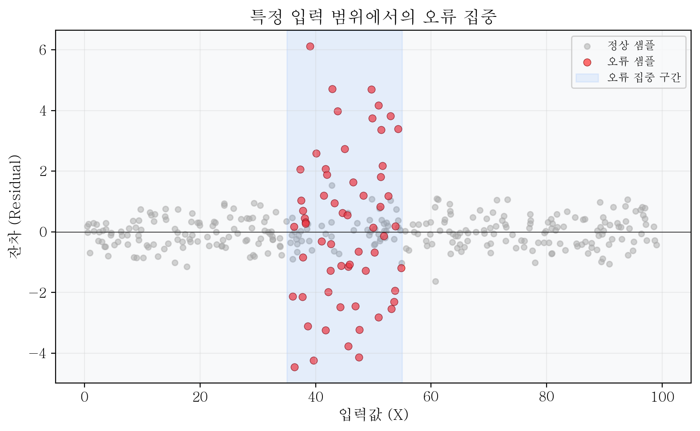

<!-- +강의 id=5.1_오류구조-03 w=w9 ts=[41:36] [42:04] 유형=그림해설 채택=? -->
가로축이 입력값이고 세로축이 잔차다. 대부분의 구간에서 잔차는 노이즈처럼 0 근처에 흩어져 있는데, 중간 구간에서만 오류 샘플의 점이 빽빽하게 찍힌다. 오류가 입력 전체에 고르게 퍼지지 않고 한 영역에 집중되어 있다는 뜻이다.
<!-- /+강의 -->

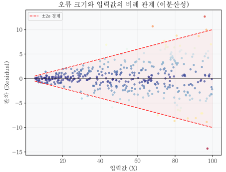

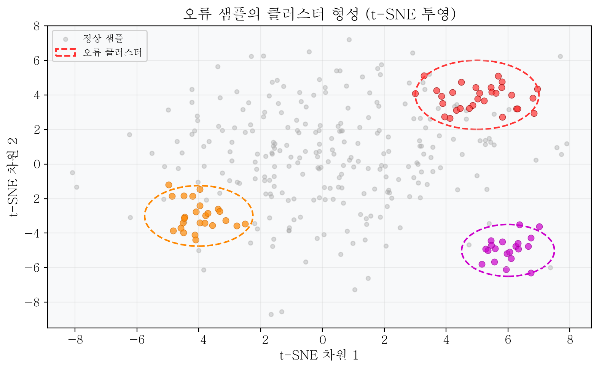

<!-- +강의 id=5.1_오류구조-04 w=w9 ts=[42:37] 유형=그림해설 채택=? -->
고차원 입력을 t-SNE로 다시 매핑하면 넓게 흩어져 있는 오류와 한곳에 뭉쳐 있는 오류가 함께 드러난다. 뭉친 덩어리가 여러 개로 나뉘어 보인다면 데이터에 일반적인 구조와 별도의 특별한 구조가 함께 섞여 있다고 읽는다.
<!-- /+강의 -->

분석 방법은 다음 네 가지를 쓴다.

1. 오류 샘플을 빨간 점으로 표시한 산점도
2. 잔차 크기를 색상 강도로 매핑한 히트맵
3. Feature별 잔차 상자그림(boxplot)
4. 잔차 분포 히스토그램

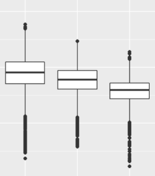

오류 샘플이란 잔차가 큰 샘플이다. 그 기준으로는 잔차 상위 5%~10%, 표준화 잔차(standardized residual) $> 2$, 그리고 피어슨 잔차나 이탈도 잔차 기준 등을 쓴다.

### Level 2: 잠재 공간에서의 오류 샘플 클러스터

AE나 VAE의 잠재 표현 공간에 오류 샘플을 매핑한다. 오류 샘플이 클러스터를 이루는지 확인하면 구조적 오류(서브그룹, 다중 규칙)의 흔적을 찾을 수 있다. 잠재 공간은 입력 공간보다 훨씬 구조화되어 있어 오류 패턴이 더 선명하게 드러날 수 있다.

잠재 공간이 유리한 이유는 세 가지다.

- AE와 VAE가 데이터의 핵심 구조만 보존하고 노이즈를 제거하므로 서브그룹 경계가 더 선명해진다.
- 잠재 벡터 $z$ 는 연속 공간이므로 클러스터 간 거리가 의미 있는 척도가 된다.
- VAE의 경우 $z \sim N(\mu, \sigma^2)$ 사전 분포를 강제하므로, 오류 클러스터가 표준 정규 공간에서 이탈한 형태로 드러난다.

분석 방법은 $z$ 를 t-SNE 또는 UMAP으로 2차원에 투영하고, 오류 샘플과 정상 샘플을 다른 색으로 표시하는 것이다. 이때 AE나 VAE를 별도로 학습할 필요는 없다. **메인 모델의 중간 레이어 활성화를 추출하여 잠재 표현으로 활용**할 수 있다.

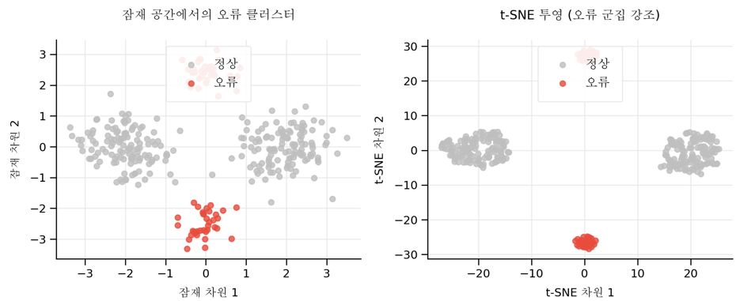

<!-- +강의 id=5.1_오류구조-05 w=w9 ts=[44:00]~[44:53] 유형=그림해설 채택=? -->
잠재 공간에서는 잔차 값을 직접 구하기 어려우므로, 오류 샘플이 놓인 위치를 점으로 찍어 표현한다. 그 점들이 정상 샘플의 덩어리와 뚜렷이 구분되어 보이면, 오류 샘플이 정상 데이터와 구조적으로 다른 특징을 갖는다는 근거가 된다.
<!-- /+강의 -->

### Level 3: 출력 공간에서의 오류 패턴

예측값 $\hat{y}$ 와 실제값 $y$ 의 차이인 잔차가 이루는 분포를 직접 분석한다. 잔차 분포(잔차 vs 예측값, 히스토그램, Q-Q Plot 등)를 직접 점검하여 이분산, 비선형 미포착, 정규성 이탈, 자기상관 등의 오류 유형을 확정한다. 앞선 두 층위에서 발견된 구조적 오류 신호가 어떻게 예측 실패로 연결되는지도 이 층위에서 확인한다.

핵심 시각화는 네 가지다.

- **잔차 vs 예측값 산점도** — 이상적으로는 수평 밴드다. 나팔 모양이면 이분산, 곡선이면 비선형 미포착이다.
- **잔차 히스토그램** — 정규분포 이탈 여부를 본다. 두 봉우리(bimodal)면 서브그룹 신호다.
- **잔차 Q-Q Plot** — 꼬리 부분의 정규성 이탈을 탐지한다.
- **잔차 시계열** — 자기상관 패턴을 시각적으로 확인한다.

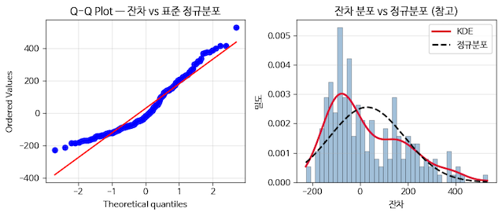

> **정리**
> 세 층위를 동시에 분석한다. 서로 다른 층위에서 동일한 서브그룹이 발견될 때 그 구조에 대한 확신도가 높아진다.

---

## 5.1.9 출력 공간의 두 오류 유형 — 이분산 오류와 서브그룹 오류
<!-- 슬라이드 282 -->

출력 공간에서 가장 중요하게 구분해야 할 두 가지 유형이 있다. 둘은 유사하게 불균등한 분포를 보이지만 원인과 처방이 다르므로 반드시 구분해야 한다.

### Heteroscedastic 오류 (이분산 오류)

분산이 균일하지 않다는 뜻이다. 오류의 크기가 입력값이나 예측값에 따라 **연속적으로** 변한다.

- **연속적 변화** — 특정 입력 구간에서 급격히 점프하지 않고 서서히 분산이 늘거나 준다.
- **단일 규칙 유지** — DGP는 하나이며, 노이즈 크기만 위치에 따라 다르다.

처방은 이분산 회귀 또는 MDN($K \ge 2$ 로 분산 구조를 모델링)이다. 예를 들어 소득-소비 회귀에서 고소득층의 소비 패턴은 저소득층보다 훨씬 다양하므로, 오류 분산이 소득에 따라 증가한다.

### Subgroup 오류 (불연속 구조 오류)

데이터가 복수의 규칙을 따를 때 발생한다. 두 개 이상의 서로 다른 메커니즘으로 데이터가 생성된 경우다.

- **불연속 점프** — 특정 경계에서 오류가 급격히 증가하거나 부호가 뒤집힌다.
- **복수 규칙** — 각 서브그룹마다 완전히 다른 데이터 생성 메커니즘을 갖는다.
- **잠재 공간 군집** — 오류 샘플들이 잠재 공간에서 뭉쳐서 나타난다.

처방은 서브그룹별 모델 분리, 또는 MDN의 혼합 성분으로 각 서브그룹을 모델링하는 것이다.

<!-- +강의 id=5.1_오류구조-06 w=w9 ts=[51:31]~[52:13] 유형=실무맥락 채택=? -->
생성 규칙이 다른 데이터가 섞여 있으면 데이터를 아무리 늘려도 하나의 모델로는 학습이 잘 되지 않고 부분적인 과적합이 반복된다. 모델을 쪼개 서브그룹별로 학습한 뒤 결과를 앙상블하는 편이 나을 수 있다. 논문에는 잘 드러나지 않는 엔지니어링 영역이다.
<!-- /+강의 -->

### 두 유형의 판별 기준

다음 표는 여섯 가지 관점에서 두 오류를 구별하는 기준을 제시한다.

| 판별 기준 | Heteroscedastic 오류 | Subgroup 오류 |
|---|---|---|
| 잔차 분포 모양 | 단일 봉우리, 분산 변화 | 두 개 이상의 봉우리 |
| 잔차 vs 예측값 | 나팔 모양 (연속 변화) | 군집 분리 (불연속 점프) |
| 잠재 공간 오류 투영 | 확산된 분포 | 뚜렷한 클러스터 |
| Breusch-Pagan 검정 | 유의 ($p < 0.05$) | 때로 유의, 때로 비유의 |
| k-means 클러스터 ARI | 낮음 (구조 불명확) | 높음 (서브그룹과 일치) |
| 처방 방향 | 이분산 회귀, MDN $K=2$ | 모델 분리, MDN $K$=서브그룹 수 |

<!-- +강의 id=5.1_오류구조-07 w=w9 ts=[49:21]~[51:04] 유형=결과해석 채택=? -->
이 표를 실제로 꺼내 들게 되는 계기는 학습을 계속해도 오류가 더 줄지 않는 상황이다. 분산이 일정하다면 회귀 모델만으로 충분하므로, 오류가 계속 남는다는 것 자체가 둘 중 어느 유형인지 검정할 이유가 된다. 서브그룹으로 판정되면 모델을 나누어 앙상블하는 길도 열린다.
<!-- /+강의 -->

---

## 5.1.10 이분산성을 구조 신호로 읽기
<!-- 슬라이드 283~284 -->

### 관점의 전환

전통 통계에서 이분산성(Heteroscedasticity)은 OLS 가정 위반으로 처리된다. 그러나 딥러닝 구조 분석에서는 **데이터 생성 과정의 구조적 특성**으로 해석한다. 이것이 이분산 오류를 구조 신호로 보는 이유다.

### 이분산성이 발생하는 두 가지 경우

**첫째, 데이터 생성 과정 자체가 입력에 따라 노이즈 수준이 다른 경우다.** 소득이 높을수록 소비 패턴이 더 다양해져 분산이 커지는 것이 그 예다.

**둘째, 관측되지 않은 외부 요인이 잔차 크기를 변조하는 경우다.** 측정 장비의 정밀도가 입력 영역에 따라 다르거나, 입력값에 비례한 측정 노이즈가 있는 경우가 그 예다.

두 경우 모두 진짜 이분산이다. 반면 **숨겨진 범주형 변수가 서로 다른 회귀 관계를 만들어 내는 경우는 외관상 이분산처럼 보이지만 실은 서브그룹 오류**다.

### 이분산성을 무시하면 생기는 일

이 경우 단일 분산을 가정한 모델로는 구조를 포착할 수 없다. 이분산성을 무시하면 세 가지 문제가 발생한다.

- **고분산 영역에서 잔차가 체계적으로 커진다.** 그 결과 오류 공간에 패턴이 형성된다.
- **신뢰 구간 추정이 왜곡된다.** 단일 $\sigma$ 추정으로는 고분산 영역의 불확실성을 과소평가하고 저분산 영역은 과대평가하는 양방향 왜곡이 일어난다.
- **모델 학습이 고분산 샘플의 노이즈에 끌려다닌다.** 그 결과 저분산 영역에서도 정확도가 떨어진다.

### 이분산성의 세 가지 유형

다음 표는 이분산의 패턴과 대표 사례, 그리고 각각에 맞는 진단 도구를 정리한 것이다.

| 유형 | 패턴 | 대표 사례 | 진단 |
|---|---|---|---|
| 단순 이분산 | $\sigma^2(x) \propto x$ (선형 비례) | 소득-소비 | Spearman $\rho$ 유의 |
| 복합 이분산 | $\sigma^2(x)$ 가 비단조 변화 | 기온-에너지 소비 | BP 검정 + 잔차 산점도 |
| 그룹별 이분산 | 그룹마다 $\sigma^2$ 상이 | 직종별 임금 | 그룹별 Levene 검정 |

<!-- +강의 id=5.1_오류구조-08 w=w9 ts=[54:45]~[55:44] 유형=결과해석 채택=? -->
복합 이분산의 사례인 기온-에너지 소비를 보면, 기온이 일정 수준 위로 올라갈 때와 아래로 떨어질 때 모두 소비가 급증한다. 분산이 한 방향으로만 커지지 않으므로 단조 관계를 보는 Spearman으로는 잡히지 않고 BP 검정과 잔차 산점도가 필요하다.
<!-- /+강의 -->

### 이분산성 진단 절차

진단은 네 단계로 진행한다.

1. **잔차 vs 예측값 산점도**에서 나팔 모양을 확인한다.
2. **$|$잔차$|$ vs 예측값 산점도**에서 Spearman 상관계수를 계산한다.
3. **Breusch-Pagan 검정**에서 $p < 0.05$ 이면 이분산성이 통계적으로 확인된다.
4. **이분산성 유형을 파악한 후 처방을 결정한다.** 이분산 회귀로 갈 것인지 MDN으로 갈 것인지를 정한다.

이분산성이 확인되면 이분산 회귀를 적용하고, 다중 모드가 의심되면 MDN을 적용한다.

실습에서는 다음 네 가지 도구를 순서대로 적용한 뒤 이분산 회귀로 넘어간다.

1. Breusch-Pagan 검정(LM) — 이분산성의 통계적 유의성 검정
2. Spearman 이분산 검정 — 비모수 접근
3. Q-Q Plot — 시각적 진단
4. Shapiro-Wilk — 정규성 통계 검정

---

## 5.1.11 서브그룹 오류 구조와 DGP 역추론
<!-- 슬라이드 285~286 -->

### 숨겨진 집단이 오류 패턴으로 드러나는 방식

서브그룹 오류는 데이터 안에 레이블이 없는 하위 집단이 존재할 때 발생한다. 어떤 단계를 거쳐 오류가 구조화되는지 따라가 본다.

**1단계 — 모델이 전체 데이터에 단일 규칙을 학습한다.** 예를 들어 그룹 A가 $y = 2x + 10$ 을 따르고 그룹 B가 $y = -x + 80$ 을 따르는데 두 그룹이 동일 비율·동일 입력 분포로 혼재한다면, OLS 모델은 두 규칙의 평균에 해당하는 $y \approx 0.5x + 45$ 방향으로 학습한다.

**2단계 — 각 서브그룹에서 체계적 오류가 발생한다.** 각 서브그룹에서 잔차의 부호와 크기가 $x$ 에 따라 체계적으로 변동한다. 그룹 A의 잔차는 $x$ 가 클수록 양의 방향으로, 작을수록 음의 방향으로 이동하고($e_i = 1.5x - 35$), 그룹 B는 반대 방향으로 변동한다. 그 결과 **잔차 부호가 $x$ 에 의해 결정되는 패턴**이 잔차 산점도에 나타나며, 이것이 두 서브그룹을 분리하는 단서가 된다.

**3단계 — 잔차 공간에서 두 그룹이 분리 가능해진다.** 잔차와 입력 변수를 결합한 $(e_i, x_i)$ 벡터로 클러스터링하면 원래 서브그룹이 복원된다. 잔차 부호만으로는 같은 부호를 갖는 다른 그룹을 분리할 수 없으므로 **입력 변수와의 결합이 필요하다.** 이것이 DGP 역추론의 원리다.

### 서브그룹 탐지 전략

- **잔차 vs 예측값** — 양의 잔차 그룹과 음의 잔차 그룹이 분리되는지 확인한다.
- **잔차 + 입력 변수 조합으로 k-means** — 각 클러스터의 평균 잔차와 입력 분포를 비교한다. 입력 변수를 차원 축소한 뒤 잔차와 결합하여 k-means를 적용하거나, 잔차를 먼저 클러스터링하고 그 잔차 클러스터 위에서 입력 변수 분포를 확인한다. 샘플이 적고 Feature가 적으며 수치형과 범주형이 혼합된 타입이라면 Decision Tree를 쓴다.
- **AE / VAE 잠재 공간에 오류 샘플 투영** — 오류 클러스터가 잠재 공간에서 분리되는지 확인한다.
- **오류 클러스터 내 샘플 해석** — 공통 특성을 가진 서브그룹인지 확인한다. Silhouette Score로 품질을 평가한다.

### 서브그룹 발견 후 처방

다음 표는 발견된 구조별로 처방 방향과 연결되는 도구를 정리한 것이다.

| 발견 내용 | 처방 방향 | 연결 도구 |
|---|---|---|
| 잔차 이봉 분포 (bimodal) | 서브그룹별 별도 모델 학습 | MDN $K$=서브그룹 수 |
| 잠재 공간의 명확한 클러스터 | 군집 레이블 추가 후 조건부 모델 | 혼합 전문가 모델(MoE) |
| 특정 Feature 구간에 집중 | 해당 Feature 구간에 추가 Feature 엔지니어링 | Feature 가설 |
| 시간 순서에 따른 패턴 | 드리프트(Drift) 탐지 + 재학습 | Feature 불안정성 분석 |

<!-- +강의 id=5.1_오류구조-09 w=w9 ts=[58:15]~[59:48] 유형=결과해석 채택=? -->
MDN을 서브그룹 수만큼 두는 것은 서브그룹별로 별도 모델을 두는 것과 사실상 같다. 성분마다 평균과 분산을 따로 만들어 내므로 내부에서 서브그룹별 모델이 학습되는 셈이다. 혼합 전문가 모델 역시 LLM 전용 개념이 아니라 딥러닝의 기본 구성이다.
<!-- /+강의 -->

### 잔차 분석의 목적 — DGP 역추론

잔차 분석의 목적은 데이터 생성 과정(DGP, Data Generating Process)을 역추론하는 것이다. 모델이 데이터를 완벽히 설명하지 못하는 방식, 즉 오류 패턴으로부터 DGP의 구조를 추론한다.

다음 표는 잔차 분석의 4단계 절차와 각 단계의 산출물, 의사결정 기준을 정리한 것이다.

| 단계 | 도구 | 산출물 | 의사결정 기준 |
|---|---|---|---|
| 1. 분산 패턴 파악 | 잔차 vs 예측값 산점도 | 이분산/서브그룹 초기 진단 | 나팔 모양 → 이분산, 군집 → 서브그룹 |
| 2. Feature별 잔여 패턴 | 부분 잔차 플롯 (Partial residual plot) | 비선형 관계를 포착하지 못한 Feature 식별 | 패턴 존재 → 해당 Feature 전처리 |
| 3. 정규성 검토 | Q-Q Plot(시각화), Shapiro-Wilk(수치화) | 잔차 분포의 정규성 이탈 정도 | 이탈이 크면 전처리 또는 강건 회귀 |
| 4. 클러스터링 | k-means + ARI (Adjusted Rand Index) | 서브그룹 복원 성공 여부 | ARI > 0.5 (50% 이상 일치) → 서브그룹 구조 신뢰 |

각 단계의 결과가 동일한 서브그룹을 가리킬 때 DGP 역추론의 신뢰도가 높아진다. 반대로 각 단계가 서로 다른 구조를 가리키면 노이즈 또는 측정 오류일 가능성이 커진다.

두 용어를 덧붙인다. **강건 회귀(robust regression)** 는 몇 개의 극단값이 모델을 끌고 가지 못하도록 개선한 회귀이며, Huber 회귀, LAD/Quantile 회귀, RANSAC 등이 있다. **ARI(Adjusted Rand Index)** 는 클러스터링 결과가 레이블과 얼마나 일치하는지를 측정하는 지표로, 모든 데이터쌍 $(i, j)$ 에 대해 같은 군집인지 다른 군집인지를 맞춘 비율을 본다.

> 관련 노트북: `code/5.1.8.파이프라인_통합.ipynb` — 위 4단계를 하나의 절차로 묶어 실행해 볼 수 있다.

---

## 5.1.12 잔차 기본 통계와 이분산성 진단
<!-- 슬라이드 287~295 -->

여기까지가 진단의 틀이다. 이제 그 틀을 데이터에 대어 본다. 두 그룹이 섞여 있지만 그 사실이 모델에게 주어지지 않은 데이터를 만들고, 단일 MLP로 회귀한 뒤 잔차만 들여다본다. 잔차의 기본 통계와 네 개의 진단 그래프에서 무엇이 보이는지, 그리고 그 신호를 통계 검정으로 확정할 수 있는지가 이 소절의 물음이다.

### 실습 5.1.1 — OLS 가정과 출력공간 잔차

> 노트북: `code/5.1.1.OLS가정_잔차기본.ipynb`

잔차의 기본 통계치를 통해 OLS 네 가정의 위반을 진단한다. 절차는 다음과 같다.

- 이후 실습에서 계속 사용할 시나리오 데이터(지역별 소득-소비)를 생성한다.
- Keras Functional API로 점 예측 MLP를 학습하고 잔차를 얻는다.
- 잔차의 기본 통계(평균, 분산, RMSE)를 시각화한다.
- 잔차 4패널을 시각화한다.

**Dataset — 수도권/지방의 소득-소비 합성 데이터**

- 수도권 그룹 A: 가파른 기울기이며 이분산이다. 소득이 클수록 소비의 변동이 커진다.
- 지방 그룹 B: 완만한 기울기이며 등분산이다.

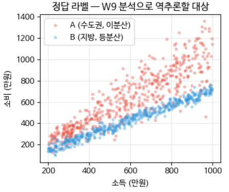

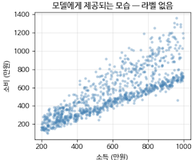

*그림 5-1. 역추론의 대상. 왼쪽의 그룹 구분은 모델에게 주어지지 않는다.*

<!-- +강의 id=5.1_오류구조-10 w=w9 ts=[63:56]~[64:45] 유형=그림해설 채택=? -->
왼쪽 그림에서 수도권 A는 지방 B보다 소득도 소비도 높은 쪽에 놓여 있고, 소득이 커질수록 점이 위아래로 넓게 퍼진다. 지방 B는 소득이 늘어도 퍼짐이 일정하다. 오른쪽처럼 라벨이 지워진 형태가 모델에게 실제로 주어지는 데이터다.
<!-- /+강의 -->

**MLP Regression Model** — 입력 1차원에서 Dense 64, Dense 32를 거쳐 1개의 값을 출력하는 단순한 점 예측 모델이다.

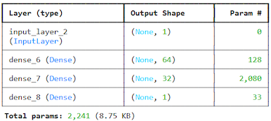

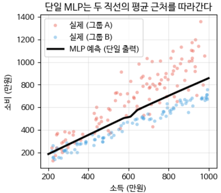

<!-- +강의 id=5.1_오류구조-11 w=w9 ts=[64:45]~[65:31] 유형=그림해설 채택=? -->
점 예측 MLP가 학습하는 것은 결국 조건부 평균 함수다. 두 그룹이 섞여 있다는 사실이 주어지지 않았으므로 예측선은 어느 그룹도 아닌 두 직선의 평균 근처를 지난다. 그 어긋남이 그대로 잔차로 남고, 이후 분석의 재료가 된다.
<!-- /+강의 -->

#### 잔차 기본통계치 분석

평균, 표준편차, RMSE, 잔차 범위를 확인한다.

![잔차 기본 통계 출력 — 잔차 평균 29.08, 표준편차 156.08, RMSE 158.39, 범위 [-226.44, 531.21]과 체계적 편향 가능성을 알리는 자동 진단](images/s288_01.png)

<!-- +강의 id=5.1_오류구조-12 w=w9 ts=[66:17]~[67:04] 유형=결과해석 채택=? -->
잔차 평균 29.08은 0에서 크게 벗어난 값이다. 이상적이라면 잔차는 부호가 무작위로 갈리는 노이즈여서 평균이 0에 놓여야 한다. 표준편차 156.08과 [-226.44, 531.21]이라는 넓은 범위까지 함께 보면, 이 모델에는 체계적 편향이 있어 그대로 쓸 수 없다.
<!-- /+강의 -->

이 값들은 다음 기준으로 읽는다.

- $\bar{e} \approx 0$ 이고 $s^2$ 이 일정하며 자기상관이 없으면 White Noise이며 이상적인 상태다.
- $\bar{e} \ne 0$ 이면 체계적 편향이 있으므로 모델 재설계가 필요하다.
- $s^2$ 이 예측값에 따라 변하면 이분산성이므로 이분산성 진단으로 넘어간다.
- 잔차에 자기상관이 있으면 시간 패턴을 포착하지 못한 것이다.

#### 잔차 진단 그래프

잔차 진단 그래프(residual diagnostic plots)는 네 패널로 구성한다.

- **예측값 vs 잔차** — 등분산성을 확인한다. 예측값에 따라 잔차가 퍼지는지 본다.
- **입력 vs 잔차** — 비선형성을 확인한다. 입력값에 따라 잔차가 체계적으로 편향되는지 본다.
- **잔차 히스토그램 + KDE** — 분포 모양(봉우리 수, 꼬리 모양)을 보고 비정규성을 확인한다.
- **$|$잔차$|$ 정렬** — 큰 잔차의 분포를 보고 이상치 존재를 확인한다.

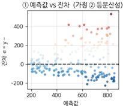
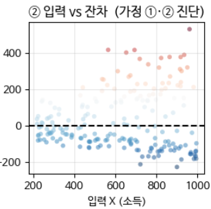

<!-- +강의 id=5.1_오류구조-13 w=w9 ts=[67:04]~[67:50] 유형=그림해설 채택=? -->
두 산점도 모두 오른쪽으로 갈수록 잔차가 위아래로 벌어진다. 예측값을 기준으로 보나 입력 소득을 기준으로 보나 같은 확산이 나타나므로 이 데이터는 이분산성을 갖는다. 벌어진 부채꼴 안에는 위로 커지는 오류와 아래로 내려가는 오류가 두 갈래로 섞여 있다.
<!-- /+강의 -->

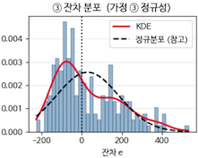 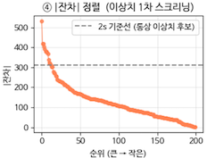

여기서 **KDE(Kernel Density Estimation, 커널 밀도 추정)** 는 데이터의 확률밀도함수(PDF)를 부드럽게 추정하는 비모수 방법이다.

### 실습 5.1.2 — 이분산성 진단

> 노트북: `code/5.1.2.이분산진단.ipynb`

드러난 데이터의 이분산성을 정확하게 진단한다. 앞서 만든 시나리오 데이터(지역별 소득-소비)에 다음 네 도구를 적용한다.

- **Breusch-Pagan 검정(LM)** — 이분산성의 통계적 유의성 검정이며, 등분산 가정에 대한 모수 검정이다.
- **Spearman 검정** — 비모수 검정으로 BP를 보완한다.
- **Q-Q Plot 진단** — 정규성의 시각 진단이다.
- **Shapiro-Wilk** — 정규성의 통계 검정이다.

이분산성에 대한 처방으로는 $\mu$ 와 $\sigma$ 를 동시에 출력하는 이분산 회귀를 적용한다. 마지막으로 같은 도구 셋(BP, Spearman, Q-Q, SW)을 실데이터인 California Housing Data에 적용하고 결과를 분석한다.

#### Breusch-Pagan 검정

절차는 다음과 같다. 먼저 회귀모델을 학습한다. 그 다음 잔차 $e_i$ 와 잔차제곱 $e_i^2$ 을 종속변수로 삼아, 원래의 설명변수(독립변수 또는 그 일부)에 대해 **보조 회귀**를 학습한다. 검정 통계량은 다음과 같다.

$$LM = n \times R^2_{aux} \;\sim\; \chi^2(p)$$

여기서 $R^2_{aux}$ 는 보조회귀의 결정계수이고, $\chi^2(p)$ 의 $p$ 는 보조회귀에 사용된 설명변수의 수다. $R^2_{aux}$ 가 크다는 것은 보조회귀에서 종속변수 $e$ 가 $x$ 로 잘 설명된다는 뜻이며, 곧 이분산 특징을 갖는다는 뜻이다.

**해석** — p-value는 LM 통계량 값 이상(우측 꼬리)의 확률이다. 예컨대 p-value가 0.02로 0.05보다 작으면 등분산성이라는 귀무가설을 기각하므로 이분산성이 통계적으로 유의하다.

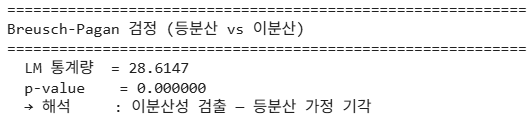

<!-- +강의 id=5.1_오류구조-14 w=w9 ts=[74:56]~[76:29] 유형=결과해석 채택=? -->
LM 통계량 28.6147을 카이제곱 분포에 대응시키면 그보다 큰 값이 나올 확률은 거의 0이다. 유의수준 0.05와 비교하면 등분산 귀무가설은 사실상 완전히 기각된다. 다만 이 통계량은 표본 수의 영향을 받으므로 이 결과 하나만으로 단정하지는 않는다.
<!-- /+강의 -->

여기서 $R^2$ 는 회귀모델이 종속변수의 변동을 얼마나 설명하는지를 나타내는 지표다.

$$R^2 = 1 - \frac{SSE(\text{잔차제곱합})}{TSS(\text{전체변동})} = \frac{SSR(\text{설명된 변동})}{TSS(\text{전체변동})}$$

$R^2 = 0$ 이면 예측이 평균값 수준이고, $R^2 = 1$ 이면 잔차가 0이다.

#### Spearman 상관계수 — 이분산 검정의 비모수 접근

이분산이란 예측값(또는 설명변수)에 따라 오차의 크기(분산)가 변하는 현상이다. 따라서 오차 크기($|e_i|$ 또는 $e_i^2$)가 $\hat{y}_i$ (또는 $x_i$)와 같이 움직이는지를 보면 된다.

비모수 접근은 값이 아니라 **순위(rank)** 로 상관을 계산한다. $|e_i|$ 를 작은 것부터 큰 것까지 순위로 바꾸고 $\hat{y}_i$ 도 순위로 바꾼다. 두 순위가 같이 커지면(단조 증가) $\rho > 0$ 이고, 한쪽이 커질 때 다른 쪽이 작아지면(단조 감소) $\rho < 0$ 이다. 이 방식은 정규성 가정과 선형성 가정에 덜 의존하며 극단값(outlier)에 상대적으로 강건하다.

**해석** — 비단조형(예: U자형) 이분산은 놓칠 수 있다는 한계가 있다.

- $\rho > 0$ 이면 오차가 커지는 방향의 이분산이다.
- $\rho < 0$ 이면 오차가 줄어드는 방향의 이분산이다.
- p-value는 $H_0(\rho = 0)$ 에 대한 값이다. $p = 0.0$ 은 "단조 상관이 없다(등분산)"는 $H_0$ 의 기각을 뜻하므로 이분산이다.

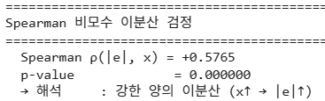

BP와 Spearman은 함께 사용하며 서로 보완 관계다. Spearman은 단조적 이분산을 간단하고 강건하게 체크하고, Breusch-Pagan은 분산이 $X$ 로 설명되는지를 회귀 기반(LM) 모델로 정량화한다.

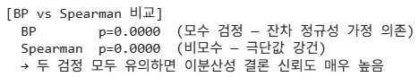

#### Q-Q Plot — 정규성 시각 진단

Q-Q Plot은 잔차의 분위수를 표준 정규분포의 분위수에 대응시킨다. 점들이 직선 위에 놓이면 정규성이 성립한다고 본다.

히스토그램과 함께 사용하는 것이 좋다. 히스토그램은 전체 분포의 모양을 보여 주고, Q-Q Plot은 **꼬리 영역에서 정규분포 이탈에 매우 민감**하기 때문이다.

두 그림은 한 셀에서 나란히 그린다. 왼쪽이 Q-Q Plot, 오른쪽이 히스토그램 + KDE + 정규분포 참고선이다.

```python
fig, axes = plt.subplots(1, 2, figsize=(8, 3.5))

ax = axes[0]
probplot(residuals, dist='norm', plot=ax)
ax.set_title('Q-Q Plot — 잔차 vs 표준 정규분포')
ax.grid(True, alpha=0.3)

ax = axes[1]
ax.hist(residuals, bins=40, density=True, alpha=0.5,
        color='steelblue', edgecolor='black', linewidth=0.4)
xr = np.linspace(residuals.min(), residuals.max(), 300)
kde = gaussian_kde(residuals)
ax.plot(xr, kde(xr), color='crimson', linewidth=2.2, label='KDE')
ax.plot(xr, norm.pdf(xr, residuals.mean(), residuals.std(ddof=1)),
        color='black', linestyle='--', linewidth=1.8, label='정규분포')
ax.set_xlabel('잔차')
ax.set_ylabel('밀도')
ax.set_title('잔차 분포 vs 정규분포 (참고)')
ax.legend()
ax.grid(True, alpha=0.3, axis='y')
```

다음 표는 Q-Q Plot에 나타나는 패턴별로 그것이 의미하는 분포의 성질과 시사하는 DGP 구조를 정리한 것이다.

| Q-Q Plot 패턴 | 의미 | 시사하는 DGP 구조 |
|---|---|---|
| 점들이 직선 위 — 이상적 | 잔차 정규 분포 성립 | 모델이 구조를 잘 포착 |
| 양 끝이 직선에서 멀어짐 (우측 ↑, 좌측 ↓) — Heavy Tail | 꼬리가 두꺼운 분포 (fat tail) | 극단값이 정규분포 예측보다 자주 발생 — $t$ 분포 사용 고려 |
| 양 끝이 직선에 가까워짐 (우측 ↓, 좌측 ↑) — Light Tail | 꼬리가 얇은 분포 | 극단값이 정규분포 예측보다 드물게 발생 — 봉우리형 분포 |
| S자 곡선 (전체적으로 한쪽으로 휨) | 비대칭 분포 (왜도 존재) | 잔차가 오른쪽으로 치우침 — 로그 변환 또는 Box-Cox 고려 |
| 왼쪽 아래로 S자 곡선 | 왼쪽 비대칭 (음의 왜도) | 잔차가 왼쪽으로 치우침 |
| 중간에 계단 패턴 | 이봉 분포 (bimodal) | 서브그룹 오류 — 강한 구조 신호 |

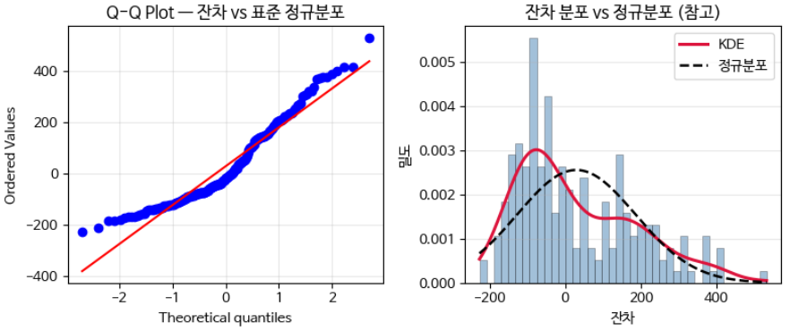

#### Shapiro-Wilk 검정

Shapiro-Wilk 검정($W$)은 회귀 잔차의 정규성을 통계적으로 검증한다.

$$W = \frac{\left(\sum_i a_i x_{(i)}\right)^2}{\sum_i \left(x_i - \bar{x}\right)^2}, \qquad \sum_i \left(x_i - \bar{x}\right)^2 = (n-1)s^2$$

여기서 $x_i$ 는 정규성을 확인하려는 값이며, 잔차를 넣으면 잔차의 정규성을 검정하는 것이 된다. $x_{(i)}$ 는 순서 통계량, $\bar{x}$ 는 표본평균이다.

- **분모**는 전체 변동, 즉 분산의 $n-1$ 배이며 데이터의 퍼짐을 나타낸다.
- **분자**는 정렬된 데이터의 패턴이 정규분포의 정렬 패턴과 얼마나 유사한지를 나타내는 점수다. $a_i$ 는 정규분포에서의 순서 통계량 기대값으로, 공분산에서 계산되는 가중치다.
- 정규에 가까운 모양이면 분자가 커지고 결과적으로 $W$ 가 커진다.

**해석** — $W \to 1$ 이면 데이터 분포의 모양이 정규분포의 모양과 비슷하다는 뜻이다. 샘플 수 $n$ 이 클수록 검정력이 높아져 미세한 이탈도 유의하게 나타날 수 있으므로, 대형 데이터셋에서는 Q-Q Plot의 시각적 판단과 함께 사용해야 한다. p-value는 정규분포에서 $W$ 분포로부터 근사되며, $p = 0.0$ 이면 정규분포 가설이 기각된다.

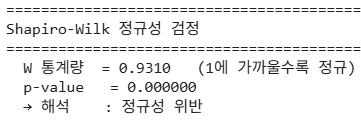

#### 검정 결과 종합 및 처방

세 검정의 결과를 조합해 처방을 결정한다.

1. 이분산과 비정규(특히 bimodal)가 동시에 검출되면 서브그룹을 의심한다.
2. 이분산만 강하면 이분산 회귀로 간다.
3. 비정규만 강하면 잔차 변환 또는 강건 회귀를 검토한다.

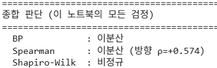

#### 이분산 회귀 적용 및 결과 분석

$\mu$ 와 $\sigma$ 를 함께 출력하는 MLP 이분산 회귀 모델을 사용하고 NLL 손실로 학습한다. 학습 결과는 train NLL $= -0.2109$, val NLL $= -0.1948$ 이다.

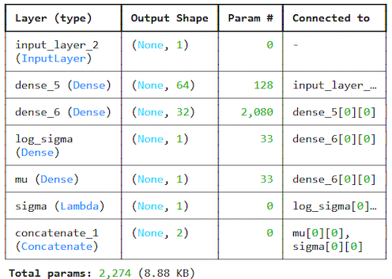

**결과 해석** — 평균과 분산으로 이분산이 표현된다. 그러나 **두 개의 서브그룹 구조는 학습할 수 없다.** 이것이 이분산 회귀의 한계이며 MDN이 필요한 이유다.

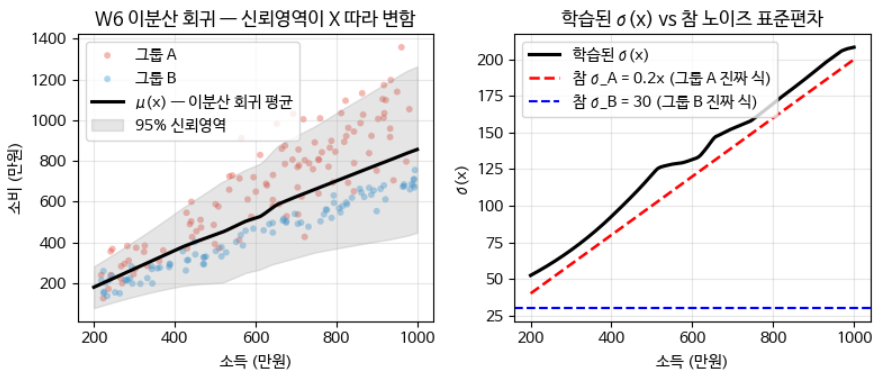

#### California Housing Data 분석

1990년 캘리포니아의 블록 그룹 단위 주택 정보로, 주택 특징(위치, 방 개수, 소득 등)과 주택 가격을 담고 있다. 타겟 변수는 MedHouseVal(블록 그룹 내 주택의 중간 가격, 단위 $100,000)이다. 설명 변수는 다음과 같다.

- **MedInc** — 블록 그룹 내 가구 소득의 중간값
- **HouseAge** — 블록 그룹 내 주택 연령의 중간값
- **AveRooms** — 가구당 평균 방 개수
- **AveBedrms** — 가구당 평균 침실 개수
- **Population** — 블록 그룹 내 전체 인구
- **AveOccup** — 평균 주택 거주자 수(인구 / 가구 수)
- **Latitude** — 위도
- **Longitude** — 경도

분석은 단변수 회귀(MedInc → MedHouseVal)로 단순화하고 데이터를 정규화한 뒤 MLP 회귀 모델을 학습한다. 잔차 통계량은 $\bar{e} = -0.023$, $s = 0.834$ 다.

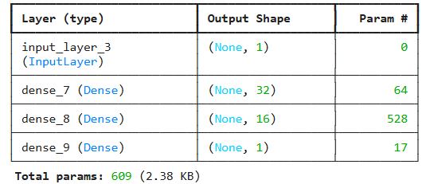

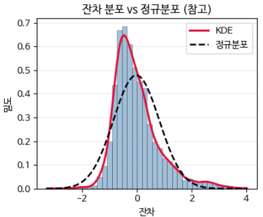

Q-Q Plot에서는 양 끝이 직선에 가까워지므로 Light Tail로 읽는다.

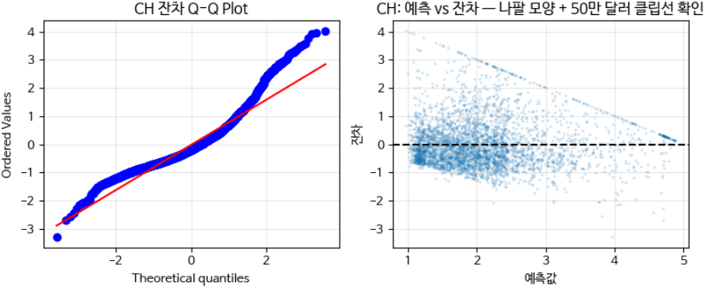

---

## 5.1.13 표준화 잔차와 레버리지
<!-- 슬라이드 296 -->

### 원시 잔차의 한계

원시 잔차 $e_i = y_i - \hat{y}_i$ 는 샘플마다 서로 다른 분산 구간에 놓일 수 있어 직접 비교가 어렵다. 잔차의 분산에 따라 같은 크기의 잔차도 상대적 의미가 달라지며, 분산이 작은 구간에서의 잔차는 상대적으로 더 중요해진다.

또한 극단적인 위치에 있는 샘플, 즉 레버리지가 높은 샘플은 모델이 그 샘플에 과적합하는 경향 때문에 **원시 잔차가 작더라도 영향력이 매우 클 수 있다.**

### 레버리지 $h_{ii}$

레버리지(Leverage) $h_{ii}$ 는 $i$ 번째 정답 $y_i$ 가 자기 자신의 예측 $\hat{y}_i$ 에 얼마나 기여하는가를 나타낸다.

모자 행렬(hat matrix) $H$ 는 $\hat{y} = Hy$ 로 정의되며, 성분으로 쓰면

$$\hat{y}_i = \sum_j h_{ij} y_j$$

이다. 즉 예측값 $\hat{y}_i$ 는 모든 관측치 $y_1, \dots, y_n$ 의 선형결합으로 만들어지고, $h_{ii}$ 는 그 선형결합에서 $y_i$ 자신에게 할당된 가중치, 곧 기여도다.

- $h_{ii} \approx 0$ 이면 $\hat{y}_i$ 는 전체 추세로 결정된다.
- $h_{ii} \approx 1$ 이면 $\hat{y}_i$ 는 $y_i$ 하나로 결정된다. 모델이 그 샘플에 강하게 끌려간다는 뜻이다.
- 레버리지가 크면 잔차가 작아도 모델에 미치는 영향력이 크다.

일반적으로 평균의 2배 이상인 레버리지를 갖는 $y_i$ 는 주의 대상으로 분류한다.

### 표준화 잔차 $r_i$

표준화 잔차(Standardized Residual)는 레버리지를 고려하여 잔차를 정규화한 값이다.

$$r_i = \frac{e_i}{s\sqrt{1 - h_{ii}}}$$

여기서 $s$ 는 잔차의 표준편차다. 이렇게 하면 분산이 서로 다른 샘플들을 동일한 척도에서 비교할 수 있다.

정규성 가정 아래에서 해석은 다음과 같다.

- $|r_i| > 2$ — 잠재적 이상치다. 약 5%의 샘플이 이 범위에 들어올 수 있다.
- $|r_i| > 3$ — 강한 이상치 신호다. 정규분포에서는 0.3% 미만이다.
- $|r_i| > 3$ 인 샘플이 많다면 정규성 가정 자체가 깨진 것이다.

---

## 5.1.14 이상치, 영향력 점, 그리고 Cook's Distance
<!-- 슬라이드 297 -->

### 이상치와 영향력 점은 다르다

**이상치(Outlier)** 는 큰 오류를 발생시키지만 모델 파라미터에는 큰 영향을 주지 않을 수 있다.

**영향력 점(Influential Point)** 은 모델 파라미터에 큰 영향을 준다. 그 샘플 하나만 제거해도 모델의 예측값이 크게 바뀐다.

### Cook's Distance

Cook's Distance는 영향력 점을 정량화하는 지표로, 표준화 잔차(크기)와 레버리지(위치)를 함께 고려한다. $D_i$ 는 $i$ 번째 샘플을 제거했을 때 모든 예측값이 얼마나 변하는지를 하나의 수치로 표현한다.

$$D_i = \frac{e_i^2}{p\,s^2} \times \frac{h_{ii}}{(1 - h_{ii})^2}$$

즉 **잔차의 함수 × 레버리지의 함수**의 형태다. Cook's Distance가 크다는 것은 그 샘플이 모델에 과도한 영향력을 미친다는 뜻이며, 해당 샘플이 이상 데이터이거나 혹은 **데이터의 다른 구조를 나타내는 중요한 샘플**임을 시사한다.

영향력의 해석 기준은 다음과 같다.

- $D_i < 0.5$ — 낮은 영향력이며 정상 샘플이다.
- $0.5 \le D_i < 1$ — 중간 영향력이며 주의를 요한다. 개별 검토가 필요하다.
- $D_i \ge 1$ 또는 $D_i > 4/n$ — 높은 영향력을 갖는 영향력 점이다. 데이터 검증 후 제거하거나 가중치를 조정한다.

이때 데이터 품질 문제(입력 또는 라벨 오류)인지, 진짜로 중요한 희귀 케이스인지를 구분해야 한다.

### 세 유형의 진단과 처방

다음 표는 이상치, 고레버리지, 영향력 점을 구분하고 각각의 진단 도구와 처방을 정리한 것이다.

| 구분 | 특성 | 진단 도구 | 처방 |
|---|---|---|---|
| 이상치 | 큰 잔차 ($\lvert r_i \rvert > 3$) | 표준화 잔차 | 데이터 검토, 강건 회귀 |
| 고레버리지 | 극단 입력 위치 ($h_{ii} > 2p/n$) | 레버리지 플롯 | 추가 데이터 수집 |
| 영향력 점 | 이상치 + 고레버리지 | Cook's Distance | 제거 또는 가중치 축소 |

---

## 5.1.15 딥러닝에서의 Cook's Distance 근사
<!-- 슬라이드 298 -->

딥러닝에서는 모자 행렬 $H$ 를 직접 계산하기 어렵다. 따라서 다섯 가지 근사 방법을 사용한다.

### 마할라노비스 거리 (Mahalanobis Distance)

입력 공간에서는 다음과 같이 계산한다.

$$D^2(x_i) = (x_i - \mu)^\top \Sigma^{-1} (x_i - \mu)$$

여기서 $\Sigma$ 는 공분산이다. 잠재 공간에서도 동일한 형태로 계산한다.

$$D^2(z_i) = (z_i - \mu)^\top \Sigma^{-1} (z_i - \mu)$$

### Influence Function

Koh & Liang(2017)이 제시한 방법으로, 샘플 $i$ 를 $\varepsilon$ 만큼 업샘플링했을 때 모델 파라미터가 어떻게 변하는지를 추정한다. 딥러닝에서 학습 데이터가 예측에 미치는 영향을 추정하는 핵심 도구로 사용된다.

### LOO(Leave-One-Out) 근사

샘플 $i$ 를 제거했을 때 모델 파라미터의 변화를 추정한다.

### 배치별 손실 변화 추적

특정 샘플을 포함하거나 제외했을 때의 검증 손실 변화를 측정하여 영향력을 근사한다.

### Jacobian(감도) 기반 레버리지

입력 $x_i$ 의 변화에 대한 예측값의 변화율을 본다.

$$s_i = \left\lVert \frac{\partial \hat{y}_i}{\partial x_i} \right\rVert$$

$s_i$ 가 크면 국소적으로 불안정한, 즉 영향이 큰 지점으로 해석한다.

---

## 5.1.16 영향력 점 진단과 서브그룹 복원
<!-- 슬라이드 299~309 -->

앞의 세 소절이 정의한 지표 — 표준화 잔차, 레버리지, Cook's Distance, 그리고 딥러닝에서의 근사 — 를 같은 소득-소비 데이터에 적용한다. 먼저 선형 모델로 정확한 값을 구해 기준을 만들고, 같은 데이터에 MLP를 학습시켜 마지막 은닉층 활성화로 근사한 값과 비교한다. 이어서 잔차가 실제로 두 서브그룹을 복원하는지 클러스터링으로 확인한다.

### 실습 5.1.3 — 이상치와 영향력점 분석

> 노트북: `code/5.1.3.이상치_영향력점.ipynb`

도시와 지방의 소득 대비 지출 데이터셋에서 이상치와 영향력점 분석을 진행한다. 세 개념의 기준은 다음과 같다.

- **이상치(Outlier)** — 큰 잔차를 갖는다. 표준화 잔차 $|r_i| > 2$ 또는 $3$ 을 기준으로 삼는다.
- **고레버리지** — 입력 공간의 극단 위치에 있다. $h_{ii} > 2p/n$ 을 기준으로 삼는다.
- **영향력 점** — 큰 잔차와 고레버리지를 함께 갖는다. 제거하면 모델이 크게 변한다. Cook's D, DFFITS, DFBETAS로 판정한다.

**진단 절차**

- 선형 모델로 정확한 Hat Matrix, 표준화 잔차, Cook's D, DFFITS, DFBETAS를 계산한다.
- 임계값을 적용하여 영향력 점을 식별한다.
- MLP 모델에서는 마지막 레이어 활성화로 근사한다.
- 발견된 영향력 점이 그룹 A와 B 중 어느 쪽에서 나오는지 확인하고 DGP를 해석한다.

#### 선형 모델로 직접 계산하기

레버리지 $h_{ii}$ 는 $y_i$ 가 자기 예측 $\hat{y}_i$ 에 얼마나 기여하는가를 나타낸다. $\hat{y}_i = \sum_j h_{ij}y_j$ 이므로 $\hat{y}_i$ 는 관측치 $y_1, \dots, y_n$ 의 선형결합이며 $h_{ii}$ 는 그중 $y_i$ 의 가중치다. 여기서는 모자 행렬 $H$ 를 통째로 만들지 않고 레버리지만 직접 계산한다.

먼저 선형방정식 $y = X\beta + \varepsilon$ 의 해 $\hat\beta = (X^\top X)^{-1}X^\top y$ 를 얻고 $\hat{y}$ 와 $e$ 를 계산한다.

```python
# 선형 회귀 (절편 + x → p=2)
X_design = np.column_stack([np.ones(len(X)), X.flatten()])  # (n, 2)
n, p = X_design.shape
beta = np.linalg.solve(X_design.T @ X_design, X_design.T @ y)
y_hat = X_design @ beta
residuals = y - y_hat
```

레버리지는 다음 식으로 계산하며, Einstein summation을 쓰면 $H$ 전체를 만들지 않고 대각 원소만 얻을 수 있어 메모리를 절약한다.

$$h_{ii} = x_i^\top (X^\top X)^{-1} x_i$$

```python
# Hat matrix H = X(X'X)^-1 X'
XtX_inv = np.linalg.inv(X_design.T @ X_design)  # (p, p)
# 레버리지만 계산하면 H 전체를 안 만들어도 된다 (메모리 절약)
leverage = np.einsum('ij,jk,ik->i', X_design, XtX_inv, X_design)  # h_ii
# X_design(n,p), XtX_inv(p,p), X_design(n,p) => (n,)

s = np.sqrt(np.sum(residuals**2) / (n - p))
std_residuals = residuals / (s * np.sqrt(1.0 - leverage))
```

위 코드의 마지막 두 줄이 표준화 잔차 $r_i = e_i / (s\sqrt{1 - h_{ii}})$ 다. 여기서 $s$ 는 잔차의 표준편차이며, 자유도를 $n - p$ 로 두고 구한다.

#### 임계값 적용과 영향력 점 분류

Cook's Distance는 표준화 잔차(크기)와 레버리지(위치)를 함께 고려하는 영향력 지표이며, $D_i$ 는 $i$ 번째 샘플을 제거했을 때 모든 예측값이 얼마나 변하는지를 하나의 수치로 표현한다.

$$D_i = \frac{e_i^2}{p\,s^2} \times \frac{h_{ii}}{(1-h_{ii})^2}$$

세 임계값을 설정한다. 레버리지는 $h_{ii} > 2p/n$, 이상치는 표준화 잔차 $> 3$, 영향력 점은 $D_i > 4/n$ 이다.

```python
# Cook's Distance
cooks_d = (std_residuals**2 / p) * (leverage / (1.0 - leverage))

# 임계값 설정
h_thresh = 2 * p / n   # Leverage 임계값 : hii > 2p/n
r_thresh = 3.0         # 이상치 임계값   : 표준화잔차 > 3
cook_thresh = 4.0 / n  # 영향력점 임계값

# 분류
is_high_lev = leverage > h_thresh
is_outlier = np.abs(std_residuals) > r_thresh
is_influential = cooks_d > cook_thresh
```

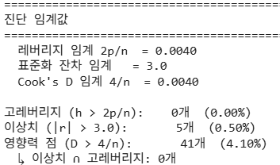

#### 레버리지와 표준화 잔차의 결합 시각화

레버리지를 가로축, 표준화 잔차를 세로축에 놓고 Cook's D를 버블 크기로 표현하면 세 지표를 한 그림에서 읽을 수 있다.

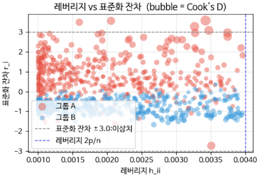

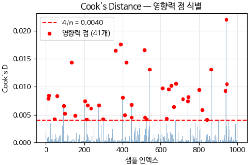

#### DFFITS

DFFITS는 $i$ 번째 샘플 $x_i$ 를 제거했을 때 $\hat{y}_i$ 의 변화를 표준화한 값이며, Cook's Distance를 보완하는 지표다.

$$\mathrm{DFFITS}_i = \frac{\hat{y}_i - \hat{y}_{i(-i)}}{s_{(-i)}\sqrt{h_{ii}}}$$

여기서 $\hat{y}_{i(-i)}$ 는 $i$ 샘플을 제거한 후의 $i$ 번째 예측값이고, $s_{(-i)}$ 는 $i$ 샘플을 제거한 후의 표준편차다. 임계값은 다음과 같다.

$$|\mathrm{DFFITS}| > 2\sqrt{p/n}$$

Cook's Distance와의 관계는 $\mathrm{DFFITS}_i^2 \approx p \times D_i$ 이며, 실질적으로 동일한 정보를 척도만 달리해 담고 있다. 실무에서는 표준화 잔차와 레버리지로 다음과 같이 근사 계산한다.

$$\mathrm{DFFITS}_i \approx r_i \sqrt{\frac{h_{ii}}{1 - h_{ii}}}$$

```python
# DFFITS = (y_hat_i - y_hat_i(-i)) / (s_(-i) * sqrt(h_ii))
# 효율적 공식 (PRESS residual 기반):
#   DFFITS_i = r_i_studentized * sqrt(h_ii / (1-h_ii))
# 여기서 r_i_studentized는 s_(-i) 기반 잔차 (외부화 잔차).
# 간단히 std_residuals와 leverage로 근사:
dffits = std_residuals * np.sqrt(leverage / (1.0 - leverage))
dffits_thresh = 2.0 * np.sqrt(p / n)
```

**결과 해석** — Cook's D로 식별한 영향력 점의 개수와 동일하다.

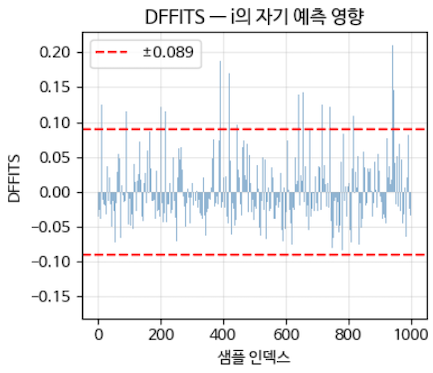

#### DFBETAS

DFBETAS는 $i$ 번째 샘플을 제거했을 때 $j$ 번째 파라미터 $\hat{\beta}_j$ 의 변화를 표준화한 값이며, 역시 Cook's Distance를 보완한다.

$$\mathrm{DFBETAS}_{j,i} = \frac{\hat{\beta}_j - \hat{\beta}_{j(-i)}}{s_{(-i)}\sqrt{c_{jj}}}, \qquad c_{jj} = \left[(X^\top X)^{-1}\right]_{jj}$$

임계값은 $|\mathrm{DFBETAS}| > 2/\sqrt{n}$ 이며,

이를 넘으면 $j$ 번째 파라미터에 높은 영향력이 있다고 본다. 이 지표를 쓰면 **어떤 Feature의 계수가 특정 샘플에 의해 크게 왜곡되는지**를 파악할 수 있다.

```python
# DFBETAS: i 제거 시 β_j 변화 (j=0 절편, j=1 기울기)
# 효율적 공식:
#   DFBETAS_{j,i} = (X'X)^-1[j,:] x_i * e_i / (s_(-i) * (1-h_ii) * sqrt((X'X)^-1[j,j]))
# 여기서는 단순화: s 사용 (s_(-i) 대신)
C_diag = np.diag(XtX_inv)  # 각 파라미터 분산 비례 항
infl_factor = (X_design @ XtX_inv) * (residuals / (s * (1.0 - leverage)))[:, None]  # (n, p)
dfbetas = infl_factor / np.sqrt(C_diag)[None, :]  # (n, p)
dfbetas_thresh = 2.0 / np.sqrt(n)
```

**결과 해석** — 절편에 영향이 큰 샘플이 21개, 기울기에 영향이 큰 샘플이 58개다. 기울기 왜곡과 관련된 샘플이 훨씬 많이 존재한다.

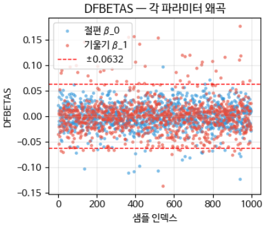

#### 영향력 점 해석하기

영향력 점은 단순한 이상값이 아니라 DGP의 신호일 수 있다. 그룹 A(이분산)의 고소득 영역이 영향력 점의 주된 출처가 될 가능성이 있음을 확인한다. 영향력 점을 실제 데이터 위에 표시해 위치를 본다.

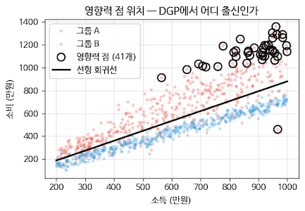

<!-- +강의 id=5.1_오류구조-15 w=w9 ts=[63:56] [64:45] 유형=그림해설 채택=? -->
검은 원이 몰려 있는 고소득·고소비 영역은 소득도 소비도 크면서 넓게 퍼져 있는 그룹이다. 반대편 그룹은 소득이 늘어도 소비의 분산이 일정하게 유지된다. 영향력 점이 한쪽 그룹에서만 나온 것은 두 그룹이 서로 다른 생성 규칙으로 만들어졌기 때문이다.
<!-- /+강의 -->

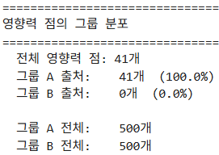

**해석** — 영향력 점이 그룹 A에 집중되어 있으며 고소득 영역에서 큰 잔차가 확인된다. 이때 데이터 품질 문제(입력 또는 라벨 오류)인지, 진짜로 중요한 희귀 케이스인지를 구분해야 한다.

**처방**은 두 방향이다. 첫째, 데이터를 제거하고 라벨을 검토한다. 둘째, 이분산 회귀나 MDN 모델을 적용한다.

#### 딥러닝을 사용한 Cook's Distance 근사

근사의 아이디어는 **마지막 hidden 레이어의 활성화를 새로운 $X$ 로 보고 선형 회귀의 $H$ 공식을 적용하는 것**이다. MLP의 마지막 hidden representation이 곧 딥러닝이 학습한 입력 표현이고, 그 위의 마지막 Dense 층은 선형 회귀와 동일하기 때문이다.

```python
# 메인 시나리오로 MLP 학습
x_mean, x_std = X.mean(), X.std()
y_mean, y_std = y.mean(), y.std()
X_n = (X - x_mean) / x_std
y_n = (y - y_mean) / y_std

inputs = keras.Input(shape=(1,))
x = layers.Dense(32, activation='relu')(inputs)
x = layers.Dense(16, activation='relu')(x)
# L2 정규화를 추가하여 H^T H 역행렬 계산 시 수치적 안정성을 높임
x = layers.Dense(4, activation='relu',
                 kernel_regularizer=keras.regularizers.l2(0.01),
                 name='last_hidden')(x)
out = layers.Dense(1)(x)
mlp = keras.Model(inputs, out)
mlp.compile(optimizer='adam', loss='mse')
history = mlp.fit(X_n, y_n, validation_split=0.2, epochs=80, batch_size=64, verbose=0)
```

```python
# 마지막 hidden 활성화를 X로 사용
hidden_extractor = keras.Model(inputs=mlp.input,
                               outputs=mlp.get_layer('last_hidden').output)
H_feat = hidden_extractor.predict(X_n, verbose=0)
# 절편을 추가하지 않음 (마지막 Dense는 절편을 자체 학습)
y_pred_n = mlp.predict(X_n, verbose=0).flatten()
residuals_dl = (y_n - y_pred_n) * y_std
```

```python
# 근사 H 행렬 (수치 안정성: pinv 사용)
HtH_inv = np.linalg.pinv(H_feat.T @ H_feat)
leverage_dl = np.einsum('ij,jk,ik->i', H_feat, HtH_inv, H_feat)
p_dl = H_feat.shape[1]
s_dl = np.sqrt(np.sum(residuals_dl**2) / (n - p_dl))
std_residuals_dl = residuals_dl / (s_dl * \
                                  np.sqrt(np.maximum(1.0 - leverage_dl, 1e-6)))
cooks_d_dl = (std_residuals_dl**2 / p_dl) * \
             (leverage_dl / np.maximum((1.0 - leverage_dl)**2, 1e-12))
```

#### 결과 분석

두 방식으로 구한 Cook's D를 비교한다. 완벽하게 일치한다면 점들이 대각선 위에 분포할 것이다. 실제로는 완전히 일치하지는 않지만 **영향력 샘플의 순위는 유사하게 나온다.**

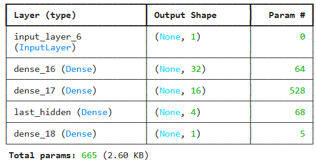

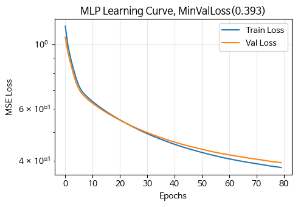

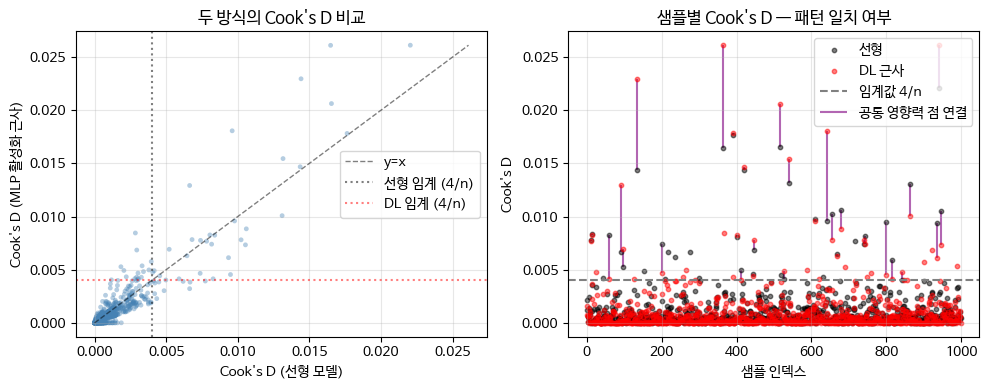

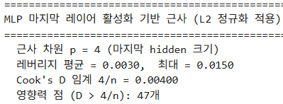

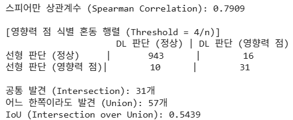

### 실습 5.1.4 — Clustering & MDN

> 노트북: `code/5.1.4.서브그룹복원.ipynb`

같은 소득 대비 지출 데이터셋에서 클러스터를 확인한다.

- 잔차 기반 k-means Clustering에 Silhouette Score 분석과 ARI 분석을 결합한다. ARI는 $k$ 가 달라도 공정한 비교가 가능하며, 정답 레이블과 클러스터링이 부여한 레이블의 분포를 직접 비교한다. 이를 통해 최적의 $k$ 를 선택한다.
- 선택한 $K$ 에 따라 MDN 모델을 설계하고 적용한다.

먼저 MLP 모델을 설계하고 학습 곡선을 확인한다.

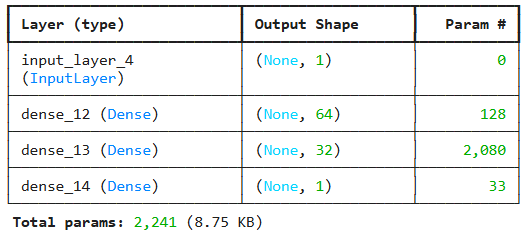

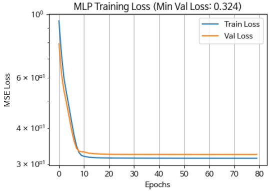

#### 클러스터 확인

잔차를 기반으로 $k = 2, 3, 4, 5$ 에 대해 k-means를 수행하고 Silhouette Score를 확인한다. 클러스터별 중심 값과 경계도 함께 본다.

```python
# 잔차만(1D)으로 KMeans
features = residuals.reshape(-1, 1)

silhouettes = {}
for k in range(2, 6):
    km = KMeans(n_clusters=k, n_init=10, random_state=42)
    labels = km.fit_predict(features)
    s = silhouette_score(features, labels)
    silhouettes[k] = (s, labels, km)
    note = '응집·분리 우수' if s > 0.5 else ('보통' if s > 0.3 else '약함')
    print(f"{k:>3} | {s:>11.4f} | {note}")

best_k = max(silhouettes, key=lambda k: silhouettes[k][0])
best_s, best_labels, best_km = silhouettes[best_k]
```

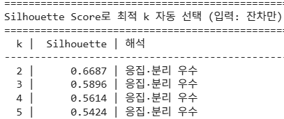

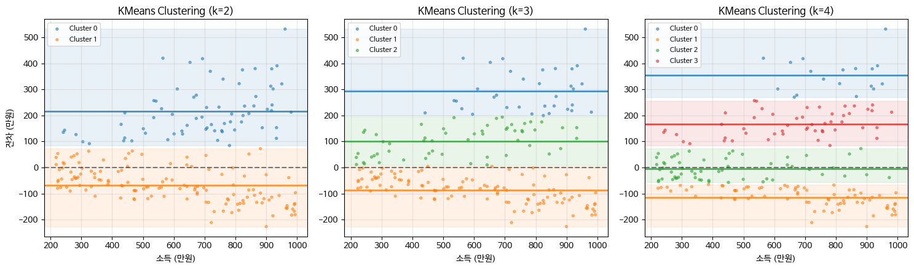

<!-- +강의 id=5.1_오류구조-16 w=w9 ts=[39:18] [57:29] 유형=그림해설 채택=? -->
잔차 축을 따라 수평 띠가 갈라진다는 것은 잔차 자체에 군집이 있다는 뜻이며, 이는 입력 데이터가 하나가 아니라 복수의 규칙으로 생성되었다는 서브그룹 오류의 신호다. 다만 k를 키우면 띠는 계속 잘게 쪼개지므로 규칙이 몇 개인지는 별도의 기준으로 정해야 한다.
<!-- /+강의 -->

#### ARI로 검증하기

**ARI(Adjusted Rand Index)** 는 랜덤 클러스터링의 기대값을 보정한 일치도 지표다. 정답 레이블과 비교하여 분리도를 측정하며, k-means 클러스터와 Silhouette 결과를 검증하는 데 쓴다. 정답 레이블이 없다면 사용할 수 없다는 제약이 있다.

결과는 ARI $= 0.3446$ 으로 약한 일치를 보인다. 구조는 존재하지만 두 그룹의 잔차가 부분적으로 겹친다는 것을 알 수 있다. 이런 경우 NLL, AIC, BIC로 $K$ 를 최종 결정해야 할 수 있다.

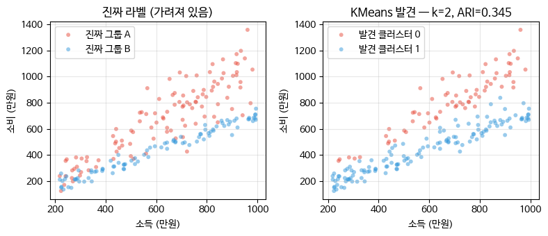

<!-- +강의 id=5.1_오류구조-17 w=w9 ts=[61:34] [62:20] 유형=그림해설 채택=? -->
ARI는 클러스터링 결과가 정답 레이블과 얼마나 일치하는지를 모든 데이터 쌍 단위로 따진다. 같은 그룹인 쌍은 같다고, 다른 그룹인 쌍은 다르다고 두 방향을 모두 맞춰야 값이 오른다. 왼쪽과 오른쪽에서 경계가 어긋난 구간이 남아 있어 0.345에 그친 것이다.
<!-- /+강의 -->

#### MDN 모델 학습 결과

$K = 2$ 로 학습한 MDN에서 각 성분의 평균, 분산, 가중치를 확인한다.

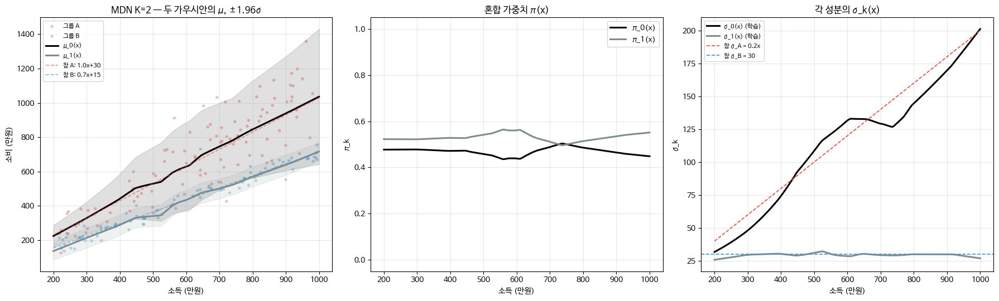

<!-- +강의 id=5.1_오류구조-18 w=w9 ts=[50:16] [58:15] [63:56] 유형=그림해설 채택=? -->
MDN은 K개의 성분마다 평균과 분산을 따로 만들어 내므로 내부적으로 서브그룹별 모델을 학습한 것과 같다. 오른쪽에서 한 성분의 σ는 소득에 비례해 커지고 다른 성분의 σ는 일정하게 유지되는데, 이는 소득이 클수록 소비가 퍼지는 그룹과 분산이 일정한 그룹이라는 두 생성 규칙을 되찾은 결과다.
<!-- /+강의 -->

---

## 5.1.17 분류 모델에서의 잔차
<!-- 슬라이드 310 -->

### 정확도는 오류의 구조를 가린다

성능을 정확도(Accuracy)나 AUC로 요약하는 것은 오류의 구조를 가린다. 분류 모델에서도 잔차에 해당하는 지표를 사용하면 오류 패턴의 구조를 분석할 수 있다.

### 피어슨 잔차 (Pearson Residual)

피어슨 잔차는 분류에서 $y - \hat{y}$ 를 관측의 이론적 표준편차로 나누어 표준화한 잔차다. 회귀의 표준화 잔차에 대응하는 개념이다.

이진 분류(베르누이)에서 관측은 $y_i \in \{0, 1\}$ 이고 예측확률은 $\hat{\pi}_i = P(y_i = 1 \mid x_i)$ 이다. 이때 피어슨 잔차는 다음과 같다.

$$r_i^P = \frac{y_i - \hat{\pi}_i}{\sqrt{\hat{\pi}_i(1 - \hat{\pi}_i)}} = \frac{y_i - \hat{\pi}_i}{s}$$

베르누이 분산이 $\mathrm{Var}(Y_i \mid x_i) = \pi_i(1 - \pi_i)$ 이므로 표준편차는 $\sqrt{\pi_i(1-\pi_i)}$ 다. 즉 예측 오차를 표준편차로 나누는 것으로, 회귀의 표준화 잔차와 완전히 동일한 개념이다.

해석은 절대값이 클수록 오차가 크다는 것이며, $r_i^P > 0$ 이면 과소예측, $r_i^P < 0$ 이면 과대예측이다.

### 이탈도 잔차 (Deviance Residual)

이탈도 잔차는 로그 가능도(Log-likelihood)를 기반으로, 각 샘플이 모델을 얼마나 망치고 있는지를 수치화한다.

이탈도(Deviance) $D$ 는 모델의 로그 가능도가 포화모델 대비 얼마나 손해인지를 2배 스케일로 나타낸 값이다.

$$D = -2\left(\log L(\text{모델}) - \log L(\text{포화모델})\right)$$

이는 NLL 기반 손실과 거의 같은 방향의 값이다. 이 이탈도를 샘플별로 나눈 것이 이탈도 잔차이며, 각 샘플의 이탈도 기여분을 제곱근으로 표준화한다. 이진 $y$ 에 대해 정리하면 다음과 같다.

$$d_i = \operatorname{sign}(y_i - \hat{\pi}_i)\sqrt{-2\left[y_i \log \hat{\pi}_i + (1 - y_i)\log(1 - \hat{\pi}_i)\right]}$$

상수항은 상쇄된다. BCE(Binary Cross Entropy)와 비교하면 다음 관계가 성립한다.

$$d_i = \operatorname{sign}(y_i - \hat{\pi}_i)\sqrt{2\,\mathrm{BCE}}$$

즉 $\sqrt{2\,\mathrm{BCE}}$ 에 샘플별 오차 방향을 붙인 것이 이탈도 잔차이며, 이 형태가 진단에 쓰기 좋은 형태다.

---

## 5.1.18 분류 잔차로 위험한 오류 찾기
<!-- 슬라이드 311~315 -->

피어슨 잔차와 이탈도 잔차를 실제 분류기에 적용해 본다. 정확도 한 줄로는 보이지 않던 것이 잔차 분포에서는 어떻게 드러나는지, 그리고 이탈도가 큰 샘플들이 실제로 어떤 이미지인지를 눈으로 확인한다.

### 실습 5.1.7 — 분류 모델의 잔차 분석

> 노트북: `code/5.1.7.분류잔차.ipynb`

이진 분류에서 잔차의 분포와 특징을 검토한다.

**MNIST의 4와 9를 분류하는 모델**을 학습하고 다음을 수행한다.

- 피어슨 잔차 $r_i^P$ 와 이탈도 잔차 $d_i$ 를 구한다.
- 피어슨 잔차의 분포를 시각화한다.
- 이탈도 잔차를 Q-Q Plot으로 시각화한다.
- 피어슨 잔차 대 예측확률을 시각화한다.
- 결과를 해석한다.

**위험한 샘플을 확인한다.** 이탈도 잔차가 큰 샘플들을 관찰하여 어떤 특징을 가지고 있는지 확인한다. 그리고 이탈도 잔차가 큰 샘플을 제거하면 성능에 직접적인 개선이 있을지 생각해 본다.

**10진 분류에서도 잔차를 분석한다.** 클래스별 피어슨 잔차를 분석하여 어떤 클래스의 잔차 평균이 큰지 확인하고, 이탈도 잔차를 분석하여 어떤 클래스에 위험한 오류가 집중되는지 확인한다.

#### 데이터와 모델 준비

MNIST에서 레이블이 4 또는 9인 이미지 데이터 `x49` 와 레이블 `y49` 를 준비한다. `y49` 는 '9'를 1, '4'를 0으로 둔다.

```python
m_tr = (y_tr == 4) | (y_tr == 9)
m_te = (y_te == 4) | (y_te == 9)
X49_tr = X_tr[m_tr]; X49_te = X_te[m_te]
y49_tr = (y_tr[m_tr] == 9).astype('int32')
y49_te = (y_te[m_te] == 9).astype('int32')
```

분류 모델은 784차원 입력에 Dense 128과 Dense 32를 쌓고 sigmoid 출력을 하나 두는 구조다.

```python
inp = keras.Input(shape=(784,))
h = layers.Dense(128, activation='relu')(inp)
h = layers.Dense(32, activation='relu')(h)
out = layers.Dense(1, activation='sigmoid')(h)
clf2 = keras.Model(inp, out)

clf2.compile(optimizer='adam', loss='binary_crossentropy',
             metrics=['accuracy'])
history_clf2 = clf2.fit(X49_tr, y49_tr, validation_split=0.1,
                        epochs=10, batch_size=64, verbose=0)
```

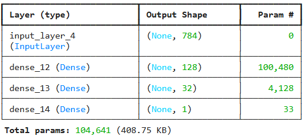

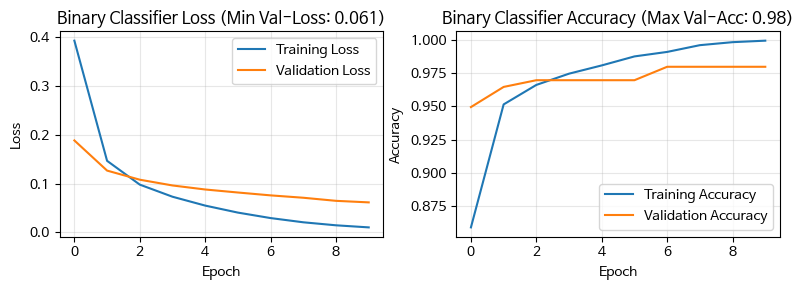

#### 피어슨 잔차와 이탈도 잔차 구하기

예측확률을 얻은 뒤 수치 안정성을 위해 클리핑하고, 두 잔차를 계산한다.

$$r_i^P = \frac{y_i - \hat{\pi}_i}{\sqrt{\hat{\pi}_i(1 - \hat{\pi}_i)}}$$

$$d_i = \operatorname{sign}(y_i - \hat{\pi}_i)\sqrt{-2\left[y_i \log \hat{\pi}_i + (1 - y_i)\log(1 - \hat{\pi}_i)\right]}$$

전체 이탈도는 $\sum_i d_i^2 = 2 \times \mathrm{NLL}$ 이며, NLL은 BCE의 합에 음의 부호를 붙인 값이다.

```python
pi_hat = clf2.predict(X49_te, verbose=0).flatten()
pi_hat = np.clip(pi_hat, 1e-6, 1 - 1e-6)  # 수치 안정성

# 피어슨 잔차
pearson_r = (y49_te - pi_hat) / np.sqrt(pi_hat * (1 - pi_hat))
# 이탈도 잔차
deviance_r = np.sign(y49_te - pi_hat) * np.sqrt(
    -2 * (y49_te * np.log(pi_hat) + (1 - y49_te) * np.log(1 - pi_hat)) )
# 전체 이탈도 = 2 × NLL
total_deviance = (deviance_r**2).sum()
nll = -np.mean(y49_te * np.log(pi_hat) + (1 - y49_te) * np.log(1 - pi_hat))
```

세 가지 시각화를 그린다.

- **피어슨 잔차 분포 히스토그램과 KDE** — 표준정규분포 대비 꼬리가 두껍게 나타난다.
- **이탈도 잔차 Q-Q Plot** — Heavy Tail이 관찰된다. 상단의 급격한 상승은 9를 4로 자신 있게 예측한 케이스가 훨씬 많다는 뜻이고, 하단의 하락은 4를 9로 예측한 케이스도 꽤 있다는 뜻이다.
- **피어슨 잔차 대 예측 확률** — 좌측 상단, 즉 실제로는 9($y = 1$)인데 예측확률이 0에 가까운 영역에 잔차 175~200대의 극단값이 존재한다. 이들이 Q-Q Plot 우측의 heavy tail을 만드는 주범이며, 거의 100% 확률로 4라고 예측했지만 실제로는 9인 표본이 몇 개 발견된다.

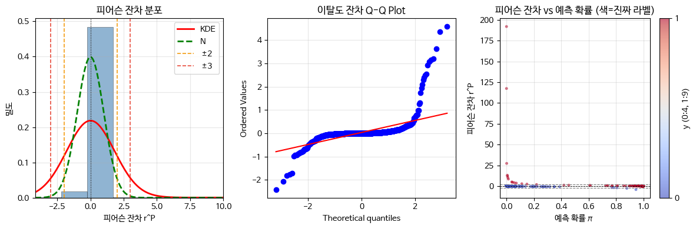

#### 임계값 진단과 위험한 오류 관찰

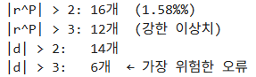

$|d| > 2$ 인 가장 위험한 오류 12개를 그려 보면 세 부류로 나뉜다.

- **진짜 애매한 글씨** — 모델의 잘못이 아니며 어쩔 수 없는 경우다.
- **명백한 라벨 오류** — 데이터셋 클리닝의 대상이다.
- **희귀한 스타일(회전, 두께 이상 등)** — 데이터 증강으로 접근한다.

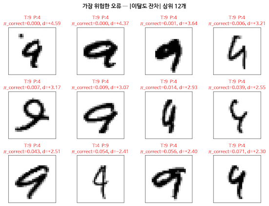

#### 10 클래스 분류에서의 잔차

클래스별 피어슨 잔차와 이탈도 잔차를 비교하여 두 질문에 답한다. 첫째, 어느 클래스가 체계적으로 과대 또는 과소 예측되는가. 2번과 8번 클래스에서 집중적으로 과대 예측이 나타난다.
둘째, 어느 클래스에 위험한 샘플이 집중되고 있는가. 특정 클래스의 분류가 어렵다는 것, 즉 시각적 모호성이 크다는 것을 확인할 수 있다.

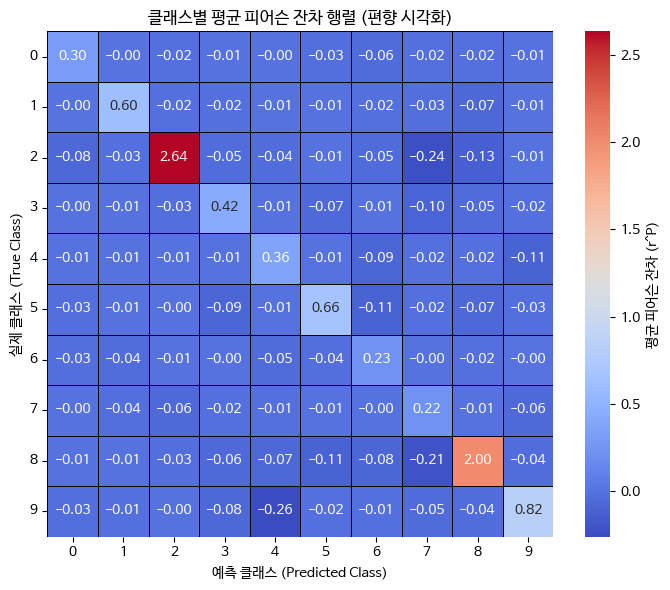

 

**다중 클래스의 피어슨 잔차**는 다중 분류를 $K$ 개의 베르누이 문제로 분해하여 정의한다. 각 클래스에서 이항 분산 $\sqrt{\hat{\pi}(1 - \hat{\pi})}$ 를 동일하게 정의하면 피어슨 잔차를 그대로 확장해 적용할 수 있다.

---

## 5.1.19 잠재 공간의 오류 클러스터
<!-- 슬라이드 316 -->

### 잠재 공간 오류 투영의 3단계

**1단계 — 잠재 표현을 준비한다.** 두 가지 방법이 있으며, 아래 절차는 (a)를 기준으로 하지만 (b)에도 동일하게 적용할 수 있다.

- (a) 전체 데이터에 별도의 AE/VAE를 학습한다.
- (b) 메인 모델의 중간 레이어 활성화를 사용한다.

**2단계 — 분류 또는 회귀 모델을 학습하고 오류 샘플을 추출한다.** 오류 샘플의 기준은 $|$잔차$|$ > 임계값이거나 오분류된 샘플이다.

**3단계 — 오류 샘플의 잠재 벡터 $z$ 를 t-SNE 또는 2차원 $z_\mu$ 로 시각화한다.**

### 세 가지 구조의 분포 패턴과 해석

다음 표는 잠재 공간에서 관찰되는 세 가지 오류 분포 패턴과 각각의 의미, 처방을 정리한 것이다.

| 구조 | 잠재 공간 패턴 | 의미 | 처방 |
|---|---|---|---|
| 오류 클러스터 (Error Cluster) | 오류 샘플이 특정 영역에 밀집 | 학습이 어려운 데이터 유형 — 서브그룹 신호 | 해당 클러스터 전용 모델 또는 데이터 보강 |
| 경계 오류 (Boundary Error) | 오류가 클래스 경계 부근에 집중 | 표현 분리 실패 — 혼동 구조로 연결 | 임베딩 개선, 마진 확대 |
| 산재 오류 (Scattered Error) | 오류가 공간 전체에 균등 분포 | 라벨 노이즈 또는 극단 샘플 | 데이터 정제, 노이즈 레이블 탐지 |

예를 들어 MNIST에서 4와 9를 혼동하는 오류 샘플들이 잠재 공간의 특정 영역에 밀집한다고 하자. 그 영역의 샘플들을 살펴보면 폐곡선의 유무가 모호한 글씨체임을 발견하게 된다. 그렇다면 해당 유형의 데이터를 추가로 수집하거나 전용 분류 모델을 적용하는 처방으로 이어진다.

잠재 공간의 오류 클러스터가 경계 오류 패턴을 보이면 혼동 구조 분석으로 연결된다. **오류 구조 분석은 오류가 어디에 있는가를 다루고, 혼동 구조 분석은 오류가 클래스 경계와 어떻게 맞닿아 있는가를 다룬다.**

> 관련 노트북: `code/5.1.5.잠재공간_오류투영.ipynb` — 회귀 모델의 오류 샘플을 잠재 공간에 투영하는 절차를 다룬다.

---

## 5.1.20 잠재 공간에서 오류 분포 읽기
<!-- 슬라이드 317~321 -->

앞 소절의 세 패턴 — 오류 클러스터, 경계 오류, 산재 오류 — 이 실제 데이터에서 어떻게 나타나는지를 확인한다. 입력 공간과 잠재 공간의 t-SNE를 나란히 놓고, 거리와 확신도를 정량화한 뒤, 오류 샘플만 다시 군집화해 체계적 오류가 있는지 본다.

### 실습 5.1.9 — 잠재공간 오류분포

> 노트북: `code/5.1.9.잠재공간_오류분포.ipynb`

MNIST 분류에서 오류가 발생하는 형태를 잠재공간을 통해 분석한다.

**작은 딥러닝 모델을 학습하고 오분류된 데이터를 확인한다.**

- 모델의 구조와 학습 결과를 확인한다.
- 오분류된 test image를 시각화하여 확인하고, 모델이 문제인지 판단해 본다.
- 입력 공간에서 t-SNE로 시각화하여 오분류 데이터가 어디에 위치하는지 확인한다.

**Embedding Vector를 추출한다.**

- 마지막 은닉층에서 잠재공간 Embedding vector를 추출하는 모델을 만든다.
- Test image의 Embedding vector를 t-SNE에 투영한다.
- 잠재공간에서 보이는 오분류 분포가 입력공간에서와 어떻게 달라졌는지 확인한다.

**분포 패턴에 따른 해석을 적용한다.** 오류 클러스터인지(오류 샘플들이 군집을 형성하는가), 경계 오류인지(클래스의 경계에 위치하는가), 산재 오류인지(클래스 내부에 무작위로 흩어져 있는가)를 판정한다.

**분포 패턴을 체계적으로 분석하는 방법을 적용한다.**

- **거리 분포 정량화** — 정상 표본과 오분류 표본이 다른 클래스 클러스터와 얼마나 가까운지 분포를 비교한다.
- **Confidence vs 거리 산점도** — 모델이 거리에 비례하여 적절한 확신도를 갖는지 시각화한다.
- **국소 이웃 분석(Local Neighborhood Analysis)** — 다른 클래스에 깊이 빠져 있는지, 경계에 있는지 확인한다.
- **체계적 오류 군집화(Error Sub-clustering)** — 오류 샘플을 다시 클러스터링하고 고유한 특성이 있는지 확인한다.

#### 모델 학습과 오분류 확인


#### 입력 공간과 잠재 공간의 t-SNE 비교

입력 공간에서 t-SNE를 그려 오분류 데이터의 위치를 확인한 뒤, 마지막 은닉층에서 뽑은 Embedding vector를 t-SNE에 투영하여 입력 공간에서의 투영과 비교한다. 이때 오류의 형태를 경계 오류(Boundary Errors), 산재한 오류(Scattered Errors), 오류 클러스터(Error Clusters)로 분류한다.


<!-- +강의 id=5.1_오류구조-19 w=w9 ts=[41:04] [42:37] 유형=그림해설 채택=? -->
입력 공간에서는 샘플 자체에 점을 찍는 방식과 잔차 값을 그리는 방식이 모두 가능한데, 여기서는 오분류 샘플의 위치를 점으로 찍었다. 이 단계의 목적은 오류가 특정 영역에 뭉쳐 있는지 전체에 흩어져 있는지를 보는 것이며, 흩어져 있다면 원본 입력만으로는 오류가 공유하는 구조가 드러나지 않은 것이다.
<!-- /+강의 -->


<!-- +강의 id=5.1_오류구조-20 w=w9 ts=[44:27] [44:53] [45:16] 유형=그림해설 채택=? -->
임베딩은 마지막 은닉층의 출력을 샘플마다 벡터로 뽑아낸 것이며, 이를 t-SNE에 투영하면 입력 공간에서보다 군집이 훨씬 또렷하게 갈라진다. 이때 오분류 점이 정상 점과 구분되는 자리에 놓이는지가 관건이고, 구분된다면 정상과 오류가 구조적으로 서로 다른 특징을 갖는다고 볼 수 있다.
<!-- /+강의 -->

#### 거리 분포 정량화

정상 표본과 오분류 표본이 다른 클래스 클러스터와 얼마나 가까운지 그 분포를 비교한다. 이어서 다른 클래스와 가까운 데이터, 즉 두 클래스 중간에 있는 데이터를 시각화하여 확인한다.


#### Confidence vs 거리 산점도

모델이 거리에 비례하여 적절한 확신도를 갖는지 시각화한다. 가로축의 경계 거리는 다른 클래스까지의 거리에서 실제 클래스까지의 거리를 뺀 값이므로, 음수이면 다른 클래스에 더 가깝고 양수이면 자기 클래스에 더 가깝다는 뜻이다.

**음수 영역에 있으면서 확률이 높다면 모델이 과대 확신하고 있다는 뜻이다.**


#### 국소 이웃 분석과 체계적 오류 군집화

**국소 이웃 분석(Local Neighborhood Analysis)** 은 오류 샘플이 다른 클래스에 깊이 빠져 있는지, 아니면 경계에 있는지를 확인한다. 오류 샘플과 가까운 샘플들의 클래스가 모두 동일하다면 그 오류는 다른 클래스 깊숙이 들어가 있는 것이고, 여러 클래스가 섞여 있다면 클래스들의 경계에 있는 것이다.

**체계적 오류 군집화(Error Sub-clustering)** 는 오분류된 샘플들만 모아서 다시 K-Means 클러스터링을 수행한다. 특정한 필기 스타일이나 노이즈 패턴을 가진 데이터들을 일관되게 틀리고 있다면 그것은 체계적 오류이며, 오분류 샘플들끼리도 잠재 공간에서 군집을 형성한다. 이는 시각적 검증과 통계적 검증을 함께 거쳐 확인한다.

마지막으로 군집별 세부 특징, 즉 클래스 분포와 확신도를 분석한다.


<!-- +강의 id=5.1_오류구조-21 w=w9 ts=[58:15] [59:02] 유형=그림해설 채택=? -->
군집을 나누는 것으로 끝내지 않고 그 안의 샘플들이 공통 특성을 가진 서브그룹인지 아니면 그저 모델이 헷갈린 샘플들이 모인 것인지를 판정해야 한다. 실제 클래스와 예측 클래스가 한쪽으로 쏠리고 확신도까지 높은 Cluster 1은 앞쪽, 곧 공통 특성을 가진 서브그룹에 해당한다.
<!-- /+강의 -->


---

## 5.1.21 비시계열 데이터의 독립성 위반과 대응
<!-- 슬라이드 322~323 -->

독립성 가정의 위반은 시계열에서만 일어나지 않는다. 비시계열 데이터에서도 네 가지 상황에서 오류의 비독립성이 발생하며, 각각 검출 방법과 대응 알고리즘이 다르다. 목표는 **오류의 비독립성을 모델이 흡수하도록 보완하는 것**이다.

### 군집 데이터

학교 내 학생, 병원 내 환자처럼 그룹 내 관측치가 서로 상관되는 경우다.

**검출 방법**

- **ICC (Intraclass Correlation Coefficient)** — 그룹 내 관측치 간 상관 정도를 측정한다. ICC가 0에 가까우면 군집 효과가 미미하고, 0.05 이상이면 군집 구조를 고려해야 한다.
- **LR Test (Likelihood Ratio Test)** — 일반 회귀와 혼합모형을 비교하여 군집 효과의 유의성을 검정한다.

**대응 알고리즘**

- **다수준 모형 (Multilevel / Mixed-Effects Model)** — 랜덤 절편과 랜덤 기울기를 추가하여 그룹 간 변동을 명시적으로 모델링한다. 예를 들어 `lme4::lmer()` 를 쓴다.
- **GEE (Generalized Estimating Equations)** — 모집단 평균 효과에 초점을 두며 작업 상관 구조(working correlation)를 지정한다.
- **Cluster-Robust Standard Errors** — 기존 회귀는 그대로 유지하되 표준오차만 군집 보정한다. Huber-White sandwich estimator를 쓴다.

### 공간 데이터

지리적으로 인접한 관측치 간에 공간적 자기상관이 있는 경우다.

**검출 방법**

- **Moran's I** — 가장 널리 쓰이는 공간 자기상관 통계량이다. $\pm 1$ 에 가까우면 양 또는 음의 공간 상관이고, 0이면 무작위다.
- **Geary's C** — Moran's I와 유사하나 국소적 차이에 더 민감하다. 값이 1보다 작으면 양의 상관이다.
- **LISA (Local Indicators of Spatial Association)** — 국소 핫스팟과 콜드스팟을 탐지한다.

**대응 알고리즘**

- **SAR (Spatial Autoregressive Model)** — 종속변수의 공간 시차를 포함한다(spatial lag model).
- **SEM (Spatial Error Model)** — 오차항의 공간 상관을 모형에 반영한다.
- **GWR (Geographically Weighted Regression)** — 각 위치마다 국소 회귀계수를 추정하여 공간적 이질성을 포착한다.

### 반복 측정

동일 대상에 대해 여러 번 측정한 경우(종단 연구 등)에 오류 간 비독립성이 생긴다. 반복측정과 시계열은 구분해야 한다. **반복측정**은 시간이 범주형 조건이거나, 측정 간격이 불규칙하거나, 전후 비교 또는 그룹 간 궤적을 보는 경우다. **시계열**은 시간이 등간격의 연속 축인 경우다.

**검출 방법**

- **Mauchly's Sphericity Test** — 반복 측정 ANOVA에서 구형성 가정(분산-공분산 동일성)을 검정한다. $p < 0.05$ 이면 구형성 위반이다.
- **잔차 자기상관 플롯** — 개인 내 잔차의 시간적 패턴을 시각적으로 확인한다.
- **Durbin-Watson** — 반복 측정이 등간격 시간이면 적용할 수 있다.

**대응 알고리즘**

- **혼합효과 모형 (Mixed-Effects Model)** — 개인별 랜덤 효과를 추가하고, 잔차의 상관 구조(AR(1), compound symmetry 등)를 명시적으로 지정한다.
- **Greenhouse-Geisser / Huynh-Feldt 보정** — 구형성 위반 시 자유도를 보정하여 F-검정을 조정한다.
- **GEE** — 반복 측정 간 작업 상관 구조를 지정하여 모집단 수준의 추론을 한다.

### 계층적·중첩 구조

다수준 데이터에서 같은 상위 단위에 속한 관측치끼리 유사한 경우다.

**검출 방법**

- **ICC (각 수준별)** — 수준별 분산 비율을 확인한다. 예를 들어 학생-학급-학교 3수준에서 각 수준의 ICC를 본다.
- **Design Effect (DEFF)** — $\mathrm{DEFF} = 1 + (\bar{m} - 1)\times \mathrm{ICC}$ 로 계산하며, 여기서 $\bar{m}$ 은 평균 군집 크기다. DEFF > 2이면 다수준 분석이 필요하다.
- **LR Test** — 수준을 추가했을 때 모형 적합도가 유의하게 개선되는지 비교한다.

**대응 알고리즘**

- **다수준 모형 (HLM, Hierarchical Linear Model)** — 2수준, 3수준 등 계층구조에 맞춰 랜덤 효과를 중첩 배치한다.
- **Bayesian Hierarchical Model** — 사전 분포를 통해 수준 간 정보를 공유하는 부분 풀링을 수행한다. 소표본 군집에 유리하다.
- **교차분류 모형 (Cross-Classified Model)** — 계층이 완전 중첩이 아닐 때 적용한다. 예를 들어 학생이 학교와 지역에 동시에 속하는 경우다.

> 관련 노트북: `code/5.1.6.시계열잔차_자기상관.ipynb` — 등간격 시계열에서 Durbin-Watson과 ACF/PACF로 잔차 자기상관을 진단하는 절차를 다룬다.

---

## 5.1.22 심화 과제
<!-- 슬라이드 324~325 -->

### 심화 과제 5-1 — 잔차가 White Noise이면 분석을 멈춰도 되는가?

**목적**

출력 공간에서 잔차가 White Noise 조건을 만족하더라도, 그것이 모델이 데이터 구조를 완전히 포착했다는 뜻은 아님을 이해한다. 잔차 분석 3층위의 필요성과, 각 층위가 서로 다른 정보를 드러낸다는 점을 논증한다.

**상황 설정**

회귀 모델을 학습한 후 출력 공간(층위 3)에서 잔차를 분석했다. 결과는 다음과 같다.

- 잔차 평균 $\approx 0$
- 잔차 대 예측값 산점도에서 뚜렷한 나팔 모양 없음
- Breusch-Pagan 검정: $p = 0.31$ (이분산성 기각 불가)
- Durbin-Watson: $d = 1.97$ (자기상관 없음)

출력 공간의 White Noise 세 조건을 모두 충족한 것으로 보인다. 그러나 추가로 잠재 공간(층위 2)을 분석하자, 오류 샘플들이 t-SNE 투영에서 두 개의 뚜렷한 클러스터로 분리되었다.

**요구 사항**

1. 출력 공간의 잔차가 White Noise 조건을 충족한다는 것이 "모델이 데이터 구조를 완전히 포착했다"는 의미와 같은지 설명하라. White Noise의 세 조건(평균 0, 등분산, 비상관)이 보장하는 것과 보장하지 못하는 것을 각각 명시하라.
2. 출력 공간에서는 White Noise이면서 잠재 공간에서는 오류 클러스터가 존재하는 상황이 어떻게 가능한지 설명하라. (힌트: 두 서브그룹의 잔차가 서로 상쇄될 수 있는가?)
3. 잔차 분석을 출력 공간(층위 3)에서만 수행하는 것과 입력·잠재·출력 공간 3층위를 모두 수행하는 것의 차이를 설명하고, 이 상황에서 층위 2가 발견한 클러스터가 어떤 구조를 시사하는지 해석하라.
4. 이 모델을 실무에 그대로 배포할 경우 어떤 문제가 발생할 수 있는지, 그리고 잠재 공간의 클러스터 발견 후 취해야 할 다음 분석 단계를 제안하라.

### 심화 과제 5-2 — Cook's Distance가 높은 샘플은 제거해야 하는가?

**목적**

Cook's Distance가 높은 샘플(영향력 점)을 무조건 이상치로 간주하고 제거하는 것이 왜 잘못된 결론인지 이해한다. 영향력 점이 오히려 DGP의 중요한 구조를 담고 있을 수 있으며, 제거 여부가 분석 목적에 따라 달라짐을 논증한다.

**상황 설정**

주택 가격 $y$ 를 면적 $x_1$ 과 방 수 $x_2$ 로 예측하는 회귀 모델을 학습했다. 전체 300개 샘플 중 5개 샘플에서 $D_i > 1$ 이 관측되었다. 해당 5개 샘플의 특성은 다음과 같다.

- 표준화 잔차 $|r_i| > 3$ (강한 이상치 신호)
- 레버리지 $h_{ii} > 0.3$ (고레버리지, 극단적인 면적·방 수 조합)
- 실제로는 초대형 펜트하우스(300㎡ 이상, 방 10개 이상)에 해당

이 5개 샘플을 제거하고 모델을 재학습하자 훈련 세트 RMSE가 15% 감소했다.

**요구 사항**

1. Cook's Distance는 잔차 크기와 레버리지 두 요소로 구성된다. 이 상황에서 5개 샘플의 Cook's Distance가 높은 이유를 두 요소 각각의 관점에서 설명하고, "영향력 점"과 "단순 이상치"의 차이를 서술하라.
2. 5개 샘플을 제거했을 때 RMSE가 개선된 것이 "모델이 좋아졌다"는 뜻인가? 제거 전후로 모델의 적용 범위, 즉 초대형 주택에 대한 예측 능력이 어떻게 달라지는지 논하라.
3. 이 5개 샘플이 DGP의 구조를 드러내는 신호일 수 있는 이유를 설명하라. 영향력 점을 "제거해야 할 오류"가 아니라 "데이터 구조의 단서"로 해석하면 어떤 분석 방향이 가능한가?
4. Cook's Distance가 높은 샘플에 대해 제거·유지·별도 모델이라는 세 가지 선택지가 각각 적합한 상황을 제시하고, 이 주택 가격 문제에서는 어떤 선택이 가장 적절한지 분석 목적(전체 시장 예측 대 고가 주택 전문 모델)에 따라 논증하라.

---

## 5.1.23 정리
<!-- 슬라이드 268~325 요약 -->

> **정리**
> 오류는 제거할 잡음이 아니라 분석해야 할 구조다. 모델이 계측기라면 오류는 계측기가 놓친 나머지 구조이며, 그 패턴은 데이터 생성 과정을 역추론하는 단서가 된다.
> OLS의 네 가정(선형성·등분산성·독립성·정규성)은 딥러닝에서도 유효한 진단 틀이다. MSE 손실이 OLS의 목적함수와 동일하므로 통계학의 잔차 진단 도구가 그대로 적용된다.
> 잔차는 출력 공간만이 아니라 입력·잠재·출력 3층위에서 함께 보아야 한다. 출력 공간이 White Noise여도 잠재 공간에 오류 클러스터가 남아 있을 수 있다.
> 이분산 오류와 서브그룹 오류는 겉모습이 비슷하지만 원인과 처방이 다르다. 전자는 연속적 분산 변화이므로 이분산 회귀나 MDN으로, 후자는 불연속적 복수 규칙이므로 모델 분리나 서브그룹 수만큼의 혼합 성분으로 대응한다.
> 표준화 잔차·레버리지·Cook's Distance·DFFITS·DFBETAS는 이상치와 영향력 점을 구분해 준다. 영향력 점은 제거 대상이 아니라 데이터 구조의 단서일 수 있으며, 딥러닝에서는 마지막 은닉층 활성화를 새로운 $X$ 로 삼아 근사한다.
> 분류 모델에서는 피어슨 잔차와 이탈도 잔차가 회귀 잔차의 자리를 대신하고, 잠재 공간의 오류 분포는 오류 클러스터·경계 오류·산재 오류 세 패턴으로 읽는다.
