# 5.2 혼동 구조 (Confusion Structure)

**학습 목표**

- 정확도 하나로는 드러나지 않는 정보가 무엇인지 설명하고, 혼동행렬을 평가 도구와 데이터 구조 지도라는 두 관점에서 읽어낼 수 있다.
- 행 정규화·열 정규화·전체 정규화의 수식과 해석을 구분하고, Precision·Recall·F1·MCC가 혼동행렬의 어느 원소에서 나오는지 유도할 수 있다.
- 체계적 혼동을 대칭성·국소성·일관성·원인의 네 축으로 분류하고, 축마다 다른 처방을 연결할 수 있다.
- 라벨 노이즈와 경계 모호성을 네 가지 진단으로 구분하고, Hard·Label Smoothing·Confusion-aware Soft·KD Soft 라벨이 각각 어떤 가정을 완화하는지 비교할 수 있다.
- 혼동행렬에서 유사도 행렬과 덴드로그램을 도출하여 클래스 간 잠재적 계층 구조를 추정할 수 있다.
- Calibration의 세 가지 강도를 구분하고 ECE·MCE·Brier·NLL로 보정 상태를 측정하며, Reliability Diagram의 전형 패턴을 진단할 수 있다.
- 딥러닝 과신의 원인을 네 가지로 분해하고, Label Smoothing과 Temperature Scaling으로 출력 확률을 보정할 수 있다.

**이 절의 구성**

- 5.2.1 혼동은 모델의 결함인가, 데이터의 신호인가
- 5.2.2 혼동행렬의 두 가지 읽기 — 평가 도구와 데이터 구조 지도
- 5.2.3 세 가지 정규화 — 행, 열, 전체
- 5.2.4 혼동행렬에서 나오는 요약 지표 — Precision, Recall, F1, MCC
- 5.2.5 혼동행렬을 직접 읽는다 (실습 5.2.1)
- 5.2.6 체계적 혼동을 읽는 네 개의 축
- 5.2.7 국소 혼동의 처방 — 보조 분류기와 계층적 분류
- 5.2.8 부분적 과적합
- 5.2.9 네 축으로 혼동을 분류한다 (실습 5.2.2)
- 5.2.10 라벨 노이즈와 경계 모호성의 진단
- 5.2.11 두 원인을 데이터에서 갈라낸다 (실습 5.2.2 이어서)
- 5.2.12 라벨 표현 방식과 정보 손실
- 5.2.13 손실함수의 묵시적 가정
- 5.2.14 라벨 표현과 손실의 비교 (실습 5.2.3)
- 5.2.15 혼동행렬에서 유사도 행렬로
- 5.2.16 계층적 클러스터링과 덴드로그램
- 5.2.17 유사도에서 덴드로그램까지 (실습 5.2.4)
- 5.2.18 Calibration — 세 가지 강도와 측정 지표
- 5.2.19 보정 상태를 측정한다 (실습 5.2.5)
- 5.2.20 Reliability Diagram
- 5.2.21 과신을 눈으로 확인한다 (실습 5.2.6)
- 5.2.22 과신의 원인
- 5.2.23 학습 시 보정과 사후 보정 (실습 5.2.7)
- 5.2.24 심화 과제
- 5.2.25 정리

> 실습 번호는 강의 슬라이드의 번호를 그대로 쓴다. 소절 번호와는 무관하다.

---

## 5.2.1 혼동은 모델의 결함인가, 데이터의 신호인가
<!-- 슬라이드 326~328 -->

### 정확도 한 숫자가 알려주지 못하는 것

분류 문제에서 오류는 **혼동(confusion)** 의 형태로 나타난다. 어떤 클래스가 다른 클래스로 잘못 예측되는 사건이다. 5.1에서 오류 구조(error structure)를 다루었다면, 여기서는 오류가 일어난 **클래스 사이의 관계**와, 모델이 출력한 **확률의 보정 문제**를 함께 검토한다.

출발점은 분류 모델의 학습 결과를 요약하는 가장 흔한 숫자, 정확도(accuracy)다. 정확도는 전체 샘플 중 맞힌 비율 하나로 성능을 압축한다. 압축의 대가로 잃어버리는 정보가 있다. 정확도 한 숫자는 **어떤 클래스를 어떤 클래스와 헷갈렸는지** 알려주지 않는다. 또한 그 헷갈림이 **일관된 패턴인지 우연한 노이즈인지**도 알려주지 않는다. **혼동행렬(confusion matrix)** 은 정확히 그 잃어버린 정보를 다시 모아놓은 도구다.

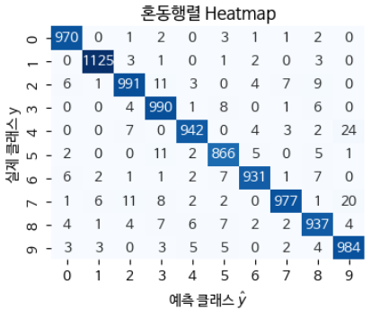

*그림 5-1. 혼동행렬 히트맵. 행은 실제 클래스 $y$, 열은 예측 클래스 $\hat{y}$ 다.*

### 혼동행렬은 모델의 부족함을 비추는 거울인가

혼동행렬을 보는 가장 익숙한 방식은 이것을 모델의 결함을 진단하는 거울로 여기는 것이다. 이 관점에서 보면, 모델이 4를 9로 자주 헷갈린다는 사실은 4에 대한 분류기 성능이 낮다는 뜻이고, 따라서 더 큰 모델이나 더 많은 데이터가 필요하다는 결론으로 이어진다.

이 관점은 편리하지만 한 가지 전제를 몰래 깔고 있다. **오류의 책임을 모두 모델에게 돌린다**는 전제다. 라벨은 옳고, 데이터는 충분히 구분 가능하며, 다만 모델이 아직 그것을 배우지 못했을 뿐이라는 가정이다.

> **핵심 주장**
> 체계적인 혼동 패턴은 모델의 결함뿐 아니라 **데이터 자체의 구조**를 반영한다.
> 라벨 경계의 모호성, 클래스 간의 연속성, 형태적 유사성이 혼동으로 드러난다.

이 관점을 받아들이면 혼동행렬의 성격이 달라진다. 혼동행렬은 모델의 점수표가 아니라 **데이터 구조 지도**가 된다. 이 절에서는 혼동행렬을 데이터의 구조적 신호를 구분하는 도구로 사용하는 방법을 다루고, 더해서 모델의 출력이 더 정확한 확률이 되도록 **출력을 보정하는 방법**까지 다룬다.

### 혼동을 보는 세 가지 관점

같은 혼동 데이터를 놓고도 관점에 따라 전혀 다른 처방이 나온다. 세 관점을 나란히 놓으면 그 차이가 분명해진다.

| 관점 | 혼동의 의미 | 권장하는 처방 |
|---|---|---|
| 전통적 (모델 중심) | 모델이 학습을 충분히 하지 못한 것. 오류는 모델의 책임 | 더 큰 네트워크, 더 많은 학습, 더 강한 정규화 |
| 구조적 (데이터 중심) | 라벨 경계가 본질적으로 모호하거나 클래스가 연속적임 | 라벨 체계 재설계, Soft Label, 계층적 분류, Ordinal 손실 |
| 확률적 (출력 중심) | Softmax 출력이 실제 불확실성을 잘못 표현(Calibration 부재) | Label Smoothing, Temperature Scaling, Reliability Diagram 검증 |

실무에서는 세 처방을 동시에 시도해 보고 어느 것이 가장 효과적인지 판단한다. 세 관점 중 어느 하나가 항상 옳은 것은 아니기 때문이다. 다만 이 절에서는 두 번째와 세 번째 관점, 즉 **데이터 구조**와 **출력 보정**이라는 관점에 집중한다. 첫 번째 관점은 이미 충분히 익숙하고, 나머지 둘이 데이터 분석가에게 더 많은 것을 알려주기 때문이다.

> **핵심 메시지**
> 정확도는 **정답의 비율**이고, 혼동행렬은 **오답의 구조**다.
> 오류 구조에 이어 혼동 구조를 분석하여, 데이터의 구조를 찾는 방법과 예측 확률을 보정하는 방법을 학습한다.

---

## 5.2.2 혼동행렬의 두 가지 읽기 — 평가 도구와 데이터 구조 지도
<!-- 슬라이드 329 -->

같은 $K \times K$ 혼동행렬 $C$ 라도, 그것을 어떻게 읽느냐에 따라 전혀 다른 결론에 도달한다. 여기서는 두 가지 읽기를 나란히 놓는다.

### (A) 평가 도구로서의 혼동행렬

정확도만 보면 **클래스 불균형**에 약하다. 양성 1%, 음성 99%인 데이터에서는 "항상 음성"이라고 답하는 무지한 모델조차 99% 정확도를 얻는다. 이 모델은 양성을 단 한 건도 잡아내지 못하지만, 정확도라는 지표만으로는 그 사실이 드러나지 않는다.

혼동행렬은 성능을 클래스별로 분해하여 이 함정을 드러낸다. **대각선의 큰 값**은 무엇을 잘 맞혔는지를 보여주고, **비대각선의 값**은 어디서 틀렸는지를 보여준다. 정밀도(precision), 재현율(recall), F1, MCC 같은 지표는 모두 혼동행렬의 원소들로부터 계산된다.

평가 도구로서 혼동행렬의 역할은 하나로 요약된다. **이 모델이 클래스별로 얼마나 잘 작동하는가**를 보는 도구다.

### (B) 데이터 구조 지도로서의 혼동행렬

같은 행렬을 다른 각도에서 읽으면, **어느 클래스 쌍이 얼마나 가까운지**를 볼 수 있다. 비대각선 원소 $C[i,j]$ 가 크다는 것은 단순히 모델이 못한다는 뜻만은 아니다. 클래스 $i$ 와 $j$ 가 **입력 표현 공간에서 가깝다**는 신호일 수 있다.

특히 혼동이 대칭적일 때, 즉

$$C[i,j] \approx C[j,i]$$

일 때 그 대칭성은 "$i$ 가 $j$ 같고 $j$ 도 $i$ 같다"는 **양방향 유사성**을 나타낸다. 두 클래스가 서로를 향해 비슷한 빈도로 새어 나가고 있다는 뜻이다.

반대로 혼동이 비대칭적일 때는 한 클래스가 다른 클래스로 **흡수되는 구조**를 시사한다. 예를 들어 다수 클래스가 소수 클래스를 잠식하는 상황이 여기에 해당한다. 대칭성 하나만으로도 데이터에 대해 서로 다른 두 가지 이야기를 읽어낼 수 있다.

---

## 5.2.3 세 가지 정규화 — 행, 열, 전체
<!-- 슬라이드 330 -->

혼동행렬의 원소는 개수(count)다. 개수를 그대로 보면 클래스 크기에 압도되므로, 보통 세 가지 방향 중 하나로 정규화하여 본다. **정규화 방향을 고르는 일은 질문을 고르는 일**이다.

### 행 정규화 — 이 클래스는 모델에게 어떻게 보였나

행 정규화는 실제 클래스가 $i$ 인 샘플들을 한 줄로 모아 놓고, 그 샘플들이 어디로 예측되었는지의 비율을 본다. 클래스별 **놓침(miss)** 을 보고 싶을 때 쓴다. 질병 환자를 얼마나 놓치는지 확인하는 상황이 전형적이다.

### 열 정규화 — 모델이 본 것은 실제로 무엇이었나

열 정규화는 모델이 $j$ 라고 예측한 샘플들을 한 줄로 모아 놓고, 그중 실제 정답이 무엇이었는지의 비율을 본다. **예측의 신뢰성**을 보고 싶을 때 쓴다. 스팸이라고 판정한 메일이 진짜 스팸인지 확인하는 상황이 전형적이다.

### 전체 정규화 — 전체 중에서 이 오류가 차지하는 몫

전체 정규화는 전체 데이터 중에서 실제가 $i$ 이고 예측이 $j$ 인 샘플의 비율을 본다. 행 정규화와 열 정규화는 조건부 확률이므로 **클래스 크기 정보가 일부 사라진다**. 클래스 A는 샘플이 10개, 클래스 B는 샘플이 1,000개인 상황에서 두 클래스의 행 정규화 값이 같더라도, 실제로 얼마나 많은 샘플이 틀렸는지는 잘 보이지 않는다.

전체 정규화는 결합 확률이므로 **어떤 오류가 전체적으로 얼마나 큰 문제인지**를 보여준다. 클래스 불균형 상황에서 실제 영향도를 판단할 때 필요하다.

세 정규화를 수식과 해석으로 정리하면 다음과 같다. 행은 실제(True), 열은 예측(Pred)이다.

| 정규화 방향 | 수식 | 해석 | 주된 사용처 |
|---|---|---|---|
| 행 정규화 | $\dfrac{C[i,j]}{\sum_j C[i,j]}$ | $P(\hat{y}=j \mid y=i)$ : 실제 $i$ 인 샘플이 $j$ 로 예측될 확률 | 재현율(Recall), 클래스별 놓치지 않음 |
| 열 정규화 | $\dfrac{C[i,j]}{\sum_i C[i,j]}$ | $P(y=i \mid \hat{y}=j)$ : 모델이 $j$ 로 예측한 것 중 실제 $i$ 인 비율 | 정밀도(Precision), 예측 신뢰성 / 헛짚지 않음 |
| 전체 정규화 | $\dfrac{C[i,j]}{N}$ | 결합 확률 $P(y=i,\ \hat{y}=j)$ | 전체 비율 비교, 클래스 불균형 진단 |

---

## 5.2.4 혼동행렬에서 나오는 요약 지표 — Precision, Recall, F1, MCC
<!-- 슬라이드 331 -->

세 가지 정규화는 그 자체로 이미 익숙한 지표들과 대응된다. 정규화 방향과 지표의 대응을 명시적으로 연결해 두면, 지표를 외우지 않고 행렬에서 직접 읽어낼 수 있다.

### Recall — 행 정규화의 대각 값

행 정규화 혼동행렬은 $P(\hat{y}=j \mid y=i)$ 를 담는다. 실제 $i$ 인 샘플이 $j$ 로 예측될 확률이다. 여기서 대각 원소 $C[i,i]$ 는 곧

$$\mathrm{Recall}(i) = \frac{TP_i}{TP_i + FN_i}$$

와 같다. 진짜 $i$ 인 것 중에서 $i$ 로 맞힌 비율, 즉 **놓치지 않음**의 정도다.

### Precision — 열 정규화의 대각 값

열 정규화 혼동행렬은 $P(y=i \mid \hat{y}=j)$ 를 담는다. $j$ 로 예측된 샘플이 실제로 $i$ 일 확률이다. 여기서 대각 원소 $C[i,i]$ 는 곧

$$\mathrm{Precision}(i) = \frac{TP_i}{TP_i + FP_i}$$

와 같다. $i$ 라고 예측한 것 중 정답이 $i$ 인 비율, 즉 **헛짚지 않음**의 정도다.

### F1 — 두 방향의 조화평균

Recall과 Precision은 서로 다른 방향의 실수를 잰다. 둘을 하나로 묶을 때는 조화평균을 쓴다.

$$F1(i) = \frac{2 P_i R_i}{P_i + R_i}$$

조화평균은 두 값 중 낮은 쪽에 강하게 끌려가므로, 한쪽만 높고 다른 쪽이 낮은 모델에 관대하지 않다.

### MCC — 2×2 혼동행렬을 하나의 상관계수로

**MCC(Matthews Correlation Coefficient)** 는 이진 분류에서 클래스 불균형에 특히 강건한 단일 지표다.

$$\mathrm{MCC} = \frac{TP \cdot TN - FP \cdot FN}{\sqrt{(TP+FP)(TP+FN)(TN+FP)(TN+FN)}}$$

분자의 의미를 읽으면 이 지표의 성격이 보인다. 잘 맞춘 조합($TP \cdot TN$)이 많을수록 값이 커지고, 이는 맞는 방향의 상관을 뜻한다. 반대로 양쪽 방향의 오류($FP \cdot FN$)가 많을수록 값이 작아지고, 이는 틀린 방향의 상관을 뜻한다. 결과적으로 MCC는 **이진 분류의 2×2 혼동행렬을 하나의 균형 잡힌 상관계수처럼 요약**한다.

클래스 불균형 상황에서 MCC는 정확도보다 훨씬 유용하다. 양성이 드문 데이터에서는 "항상 음성"이라고 답하는 모델도 높은 정확도를 얻지만, 그 모델의 양성 클래스 행 정규화 대각 값(Recall)은 0에 가깝고, 열 정규화 관점의 Precision과 F1도 낮아진다. MCC는 다수 클래스 정답($TN$)만 높다고 큰 값을 주지 않고, 소수 클래스의 놓침($FN$)과 오탐($FP$)까지 함께 반영한다. 그래서 클래스 불균형에 강건한 단일 지표로 자주 사용된다.

Precision, Recall, F1, MCC는 모두 서로 다른 지표처럼 보이지만, 결국은 **혼동행렬 기반의 요약 metric**이라는 하나의 가족에 속한다.

---

## 5.2.5 혼동행렬을 직접 읽는다
<!-- 슬라이드 332~336 -->

여기까지가 혼동행렬을 읽는 도구다. 정규화 세 방향과 요약 지표 네 개를 실제 데이터에 대어 본다. 첫 실습의 목적은 성능이 아니라 **정확도 한 숫자가 무엇을 감추는지를 수치로 확인하는 것**이다.

### 실습 5.2.1 — 혼동행렬과 관련 metric

> 노트북: `code/5.2.1.혼동행렬_기본.ipynb`

**목표** — 혼동행렬의 기본 특성을 확인한다. 다루는 내용은 다음과 같다.

- 정확도의 한계 — 클래스 불균형(Class Imbalance)의 경우와, 같은 정확도에 대한 두 가지 해석 가능성
- MNIST 분류기 학습
- 혼동행렬을 통한 모델 성능 검토 — 전체 데이터에 대한 정확도(Accuracy)와 특정 클래스에 대한 정밀도(Precision) 확인, 혼동행렬 표현, 행/열/전체 정규화를 적용한 혼동행렬의 특성 확인
- Precision·Recall·F1·MCC — 혼동행렬을 기반으로 Precision·Recall·F1을 계산하고, 특정 클래스 두 개에 대해 MCC를 계산

**정확도의 한계 — 99% 정확도의 함정**

양성 1%, 음성 99%인 데이터, 예를 들어 희귀병 진단 데이터를 생각한다. 항상 음성이라고 답하는 모델은 99% 정확도를 얻지만 양성을 한 건도 잡지 못한다. 이 상황에서는 Precision과 MCC를 동시에 보아야 한다.

990(음성) 대 10(양성)의 데이터에서 무조건 0(음성)을 출력하는 모델을 만들어 확인한다.

```python
# 시나리오 1 — 양성 1%, 음성 99%
N = 1000
y_s1 = np.zeros(N, dtype=int)
y_s1[:10] = 1               # 양성 10건 (1%)
np.random.shuffle(y_s1)

y_pred_s1 = np.zeros(N, dtype=int)   # 무지한 모델 — 항상 음성

TP = int(((y_pred_s1 == 1) & (y_s1 == 1)).sum())
FN = int(((y_pred_s1 == 0) & (y_s1 == 1)).sum())
FP = int(((y_pred_s1 == 1) & (y_s1 == 0)).sum())
TN = int(((y_pred_s1 == 0) & (y_s1 == 0)).sum())

acc  = (y_pred_s1 == y_s1).mean()
prec = TP / (TP + FP) if TP + FP > 0 else float('nan')
rec  = TP / (TP + FN) if TP + FN > 0 else float('nan')

mcc_num = TP*TN - FP*FN
mcc_den = np.sqrt(max((TP+FP)*(TP+FN)*(TN+FP)*(TN+FN), 1e-12))
mcc = mcc_num / mcc_den
```

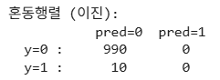

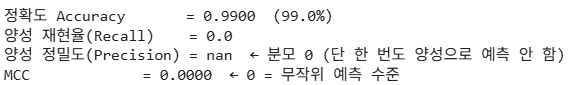

Precision의 분모가 0이 되어 nan이 나오는 것은 모델이 단 한 번도 양성으로 예측하지 않았기 때문이고, MCC가 0이라는 것은 무작위 예측 수준이라는 뜻이다. 정확도 99%는 클래스 불균형이 만든 환상이고, 그 환상을 깨는 것이 MCC다.

다음으로 Accuracy가 비슷한 두 모델 A와 B를 비교하여 Recall에서 드러나는 차이를 본다.

- A 모델 — Accuracy 95% 수준. 모든 클래스에 대해 5% 오류가 고르게 분포한다.
- B 모델 — Accuracy 94% 수준. 일부 클래스의 오류가 30%이고 나머지 클래스는 오류가 0%다.

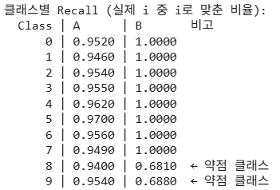

전체 정확도는 A가 0.9538, B가 0.9369로 큰 차이가 없다. 그러나 클래스별 Recall을 보면 B에는 8과 9라는 두 개의 명백한 약점 클래스가 존재한다. 클래스 8은 0.6810, 클래스 9는 0.6880이다. 정확도 한 숫자가 감추고 있던 것이 바로 이 구조다.

**MNIST 분류 모델**

적당히 오류를 갖도록 설계한 MNIST 분류 모델을 학습시켜 Accuracy와 Recall을 비교하고 혼동행렬을 확인한다.

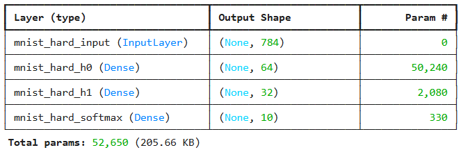

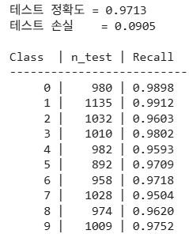

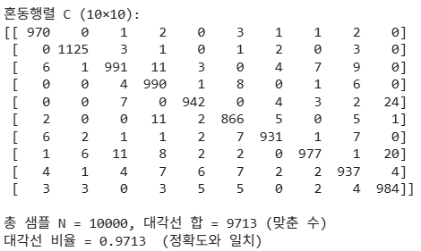

테스트 정확도는 0.9713, 테스트 손실은 0.0905다. 혼동행렬의 **대각선 합 9713을 전체 10,000으로 나눈 값이 곧 정확도**라는 사실을 여기서 직접 확인할 수 있다. 정확도는 혼동행렬에서 대각선만 읽은 값이고, 나머지 정보는 비대각선에 남아 있다.

**행/열/전체 정규화 혼동행렬**

같은 혼동행렬을 세 방향으로 정규화하여 비교한다.

```python
row_sum = cm.sum(axis=1, keepdims=True)
col_sum = cm.sum(axis=0, keepdims=True)
cm_row   = cm / np.where(row_sum == 0, 1, row_sum)   # P(ŷ=j | y=i)
cm_col   = cm / np.where(col_sum == 0, 1, col_sum)   # P(y=i | ŷ=j)
cm_joint = cm / cm.sum()                             # P(y=i, ŷ=j)
```

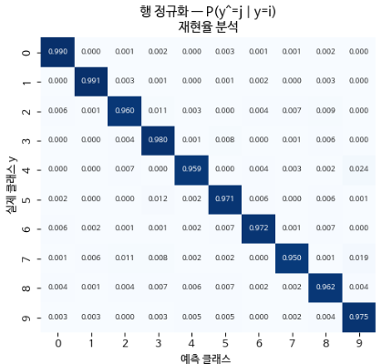

행 정규화에서는 행의 합이 1이다. 행 4의 9 칸이 크면 실제 4가 9로 잘못 예측되는 비율이 높다는 뜻이며, 이는 곧 **재현율이 낮다**는 의미다.

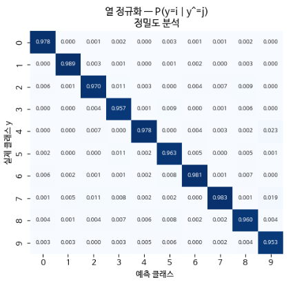

열 정규화에서는 열의 합이 1이다. 열 9의 4 칸이 크면 9라고 예측한 것 중 실제 4가 많다는 뜻이며, 이는 곧 **정밀도가 낮다**는 의미다.

전체 정규화는 결합 확률이므로 클래스 빈도가 다르면 큰 클래스의 영향이 강하게 드러난다. 다만 MNIST는 클래스 분포가 거의 균등하므로 이 효과가 두드러지지 않는다.

두 그림을 함께 읽으면 클래스별 성격이 드러난다. **4와 7은 Recall은 낮으나 Precision은 높은 편**이고, **9는 Recall은 높은 편이나 Precision이 낮다.** 4와 7이 9로 새어 나가고, 그 결과 9라는 예측 바구니에 다른 클래스가 섞여 들어간 구조다.

**네 가지 metric으로의 분해**

혼동행렬에서 Precision·Recall·F1·MCC를 분해하여 계산한다. 필요한 것은 혼동행렬 하나뿐이다.

```python
for i in range(10):
    TP_i = cm[i, i]
    FN_i = cm[i, :].sum() - TP_i
    FP_i = cm[:, i].sum() - TP_i
    prec_i = TP_i / (TP_i + FP_i + 1e-12)
    rec_i  = TP_i / (TP_i + FN_i + 1e-12)
    f1_i   = 2 * prec_i * rec_i / (prec_i + rec_i + 1e-12)
```

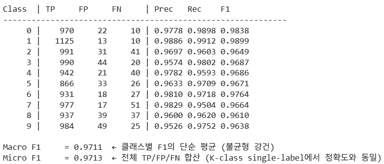

Macro F1은 클래스별 F1의 단순 평균이라 불균형에 강건하고, Micro F1은 전체 TP/FP/FN을 합산한 값이라 다중 클래스 단일 라벨 문제에서는 정확도와 같아진다. 가장 낮은 F1은 클래스 8의 0.9610이다. 클래스 8의 분리력이 가장 약하다는 뜻이고, 다음 처방 후보는 **클래스 8과 가장 헷갈리는 짝을 식별하는 것**이다. 그 작업이 뒤의 덴드로그램 실습이다.

여기서 확인할 점은 **어떤 클래스의 Recall이 낮다는 사실이 곧바로 그 클래스의 Precision이 낮다는 결론으로 이어지지 않는다**는 것이다. 두 지표는 서로 다른 방향의 실수를 재기 때문이다. 그래서 F1으로 균형을 잡아야 한다.

마지막으로 4와 9 두 클래스만 뽑아 이진 분류로 보고 Recall, Precision, F1, MCC를 계산한다.

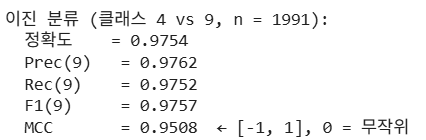

MCC의 범위는 $[-1, 1]$ 이며 0이 무작위 수준이다. 여기서 0.9508은 두 클래스가 상당히 잘 분리되었음을 뜻한다. 읽는 규칙은 단순하다. **정확도와 MCC가 가까우면 균형 잡힌 모델**이고, **정확도는 높은데 MCC가 낮으면 한쪽 클래스에 쏠린 모델**이다. 앞의 990:10 시나리오가 후자의 극단이었다.

---

## 5.2.6 체계적 혼동을 읽는 네 개의 축
<!-- 슬라이드 337~339 -->

혼동행렬에서 오류를 읽어낼 때, 오류의 성격을 네 개의 축으로 분류하면 처방이 달라진다. 네 축은 대칭성, 국소성, 일관성, 그리고 원인이다.

### 1) 대칭(Symmetric) vs 비대칭(Asymmetric)

**대칭 혼동**은 $C[i,j] \approx C[j,i]$ 인 경우다. 양방향으로 비슷한 빈도의 오류가 일어난다. 이는 라벨 자체가 모호하거나, 두 클래스가 입력 공간에서 겹쳐 있다는 신호다. MNIST의 4↔9 쌍이 전형적인 대칭 혼동이다.

**비대칭 혼동**은 $C[i,j] \gg C[j,i]$ 인 경우다. $i$ 는 $j$ 로 자주 예측되지만, $j$ 는 $i$ 로 거의 예측되지 않는다. 흔히 다수 클래스가 소수 클래스를 잠식할 때, 즉 두 클래스가 부분집합 같은 관계에 있을 때 나타난다. 또는 한 클래스의 결정 경계가 다른 쪽보다 좁게 학습된 결과일 수 있다. 클래스 불균형이 있는데 손실 가중치(loss weight)를 설정하지 않으면 이런 일이 생긴다. 소수 클래스의 영역은 **들어가기는 어렵고 나오기는 쉬운 구조**가 된다.

### 2) 국소(Local) vs 광역(Global)

**국소 혼동**은 소수의 클래스 쌍에 혼동이 집중된 경우다. MNIST 분류에서 4↔9, 3↔8 두 쌍이 전체 오류의 70%를 차지하는 상황이 여기에 해당한다. 이때는 그 쌍을 겨냥한 **표적 처방**이 효과적이다. 해당 쌍에 대한 데이터 보강, 보조 분류기, 계층적 분류가 모두 여기에 속한다.

**광역 혼동**은 모든 클래스 쌍에 비교적 고르게 혼동이 퍼진 경우다. 해결이 쉽지 않다. 모델이 전반적으로 과소적합(underfitting)이거나, 입력 표현 또는 타깃 자체가 부적절할 가능성이 크다. 이때는 표적 처방이 통하지 않으므로 표현 학습 자체를 점검해야 한다. 오토인코더 잠재공간을 살펴보는 것이 한 방법이고, 그와 함께 더 강한 백본, 더 풍부한 데이터가 필요할 수 있다.

### 3) 일관(Consistent) vs 비일관(Inconsistent)

세 번째 축은 학습 진행에 따른 변화를 본다.

**일관 혼동**은 학습이 진행되어도 특정 쌍의 혼동 비율이 거의 줄지 않는 경우다. 더 학습해도 풀 수 없는 영역이 있다는 뜻이며, 데이터 자체에 **라벨 경계의 모호성이 내재**함을 시사한다.

**비일관 혼동**은 초기화 시드(seed)나 데이터 셔플링(run)에 따라 패턴이 달라지는 경우다. 원인은 여러 가지다.

- **단순한 학습 부족** — 모델이 작거나 학습 속도가 느리다.
- **미니배치 노이즈** — 배치 단위가 작아서 배치마다 데이터의 통계적 특성 변동이 크다.
- **부분적 과적합** — 특정 혼동 쌍이 사라졌다가 다른 쌍이 새로 생기고, 시드마다 혼동행렬이 다르지만 학습 성능은 모두 높다. 특정 층이나 노드, 헤드를 제거하면 검증 성능이 오히려 좋아지기도 한다. 지름길(shortcut)을 제거하는 증강을 넣으면 혼동 패턴이 더 안정된다.

두 경우를 어떻게 구분할 수 있을까. 학습 도중 에폭마다 혼동행렬을 기록하여 추세를 분석하면 된다. 어느 쌍이 초기부터 계속 줄지 않는다면 일관 혼동이고, 실행(run)마다 특성이 변동한다면 비일관 혼동이다. 이렇게 **"풀 수 있는 혼동"과 "풀 수 없는 혼동"을 구분**하는 것이 진단의 핵심이다.

> **Shortcut(지름길)이란**
> 데이터 안에 있는, 쉽지만 본질적이지 않은 예측 단서를 모델이 이용하는 현상이다.
> - 사람 얼굴을 구분할 때 안경 유무로 분류한다.
> - 자동차와 비행기를 분류할 때 배경 하단의 검은색(아스팔트)을 보고 분류한다.
> - 의료 영상에서 병원별 장비 artifact로 질병을 판정한다.
> - 스팸 분류에서 내용보다 발신 도메인 패턴에 의존한다.

### 4) 라벨 노이즈(Label Noise) vs 경계 모호성(Boundary Ambiguity)

네 번째 축은 원인을 묻는다. 같은 혼동이라도 그 원인이 **누구의 잘못이냐**에 따라 정반대의 처방이 필요하다.

**라벨 노이즈**는 라벨이 틀려서 발생하는 혼동이다. 같은 입력에 대해 어노테이터마다 다른 라벨을 다는 상황이 대표적이다. 처방은 데이터 정제와 라벨 재검수다. 또는 노이즈에 강한 손실 함수가 필요하다. Bootstrapping Loss나 Generalized Cross-Entropy가 그런 손실이다.

**경계 모호성**은 라벨은 모두 옳지만, 입력 공간에서 두 클래스 영역이 정말로 겹쳐 있는 경우다. 의료에서 Stage II와 Stage III의 경계, 감성 분석에서 "중립"과 "약한 긍정"의 경계가 여기에 해당한다. 이때 필요한 것은 더 정교한 라벨링이 아니라 **라벨 체계 자체의 재설계**다. 연속형 라벨, 순서형 라벨, 다중 라벨이 대안이 된다.

> **Bootstrapping Loss**
> 모델의 예측을 섞어서 새 타깃으로 사용한다. 새 타깃
> $$\tilde{y} = \beta\, y_{\text{true}} + (1-\beta)\, y_{\text{pred}}$$
> 을 만들어 학습함으로써, 잘못된 정답을 강제하는 압력을 완화한다.

> **Generalized Cross-Entropy (GCE)**
> $$L_q = \frac{1 - p_y^{\,q}}{q}$$
> $q \to 0$ 이면 CE에 가까워지고, 노이즈 샘플에서 매우 큰 그래디언트가 발생한다.
> $q \to 1$ 이면 MAE에 가까워지고, 그래디언트가 약해져 학습이 잘 안 되는 경우가 생긴다.

### 네 축을 표로 정리하면

네 축을 함께 놓으면 혼동의 원인을 **모델, 데이터, 라벨**의 세 층으로 분류할 수 있게 된다.

| 축 | 축의 양 끝 | 구분 신호 | 처방 |
|---|---|---|---|
| 대칭성 | 대칭 ↔ 비대칭 | $C[i,j]$ 와 $C[j,i]$ 비교 | 비대칭이면 클래스 불균형 점검 |
| 국소성 | 국소 ↔ 광역 | 상위 $K$ 개 쌍이 차지하는 비율 | 광역이면 표현 학습 점검 |
| 일관성 | 일관 ↔ 비일관 | 에폭별 혼동 변화 | 비일관이면 원인별 처방 |
| 원인 | 노이즈 ↔ 경계 | 잠재공간 분리도 + 라벨 검수 | 경계 모호성이면 라벨 체계 재설계 |

---

## 5.2.7 국소 혼동의 처방 — 보조 분류기와 계층적 분류
<!-- 슬라이드 340~341 -->

혼동이 소수의 클래스 쌍에 집중되어 있을 때, 즉 국소 혼동일 때 쓸 수 있는 두 가지 접근이 있다.

### 보조 분류기 (auxiliary classifier)

특정 클래스 쌍에서 오류가 많을 때, 그 부분만 전문적으로 구분하는 작은 추가 분류기를 붙인다. 역할 분담은 다음과 같다.

- **주 분류기** — 전체 문제를 대략적으로 분류한다.
- **보조 분류기** — 특히 자주 헷갈리는 일부 클래스만 정밀하게 재판단한다.

왜 필요한가. MNIST에서 대부분의 숫자는 잘 맞히지만 4와 9, 3과 8만 오류가 높다고 하자. 이때 전체 모델을 키우는 것은 낭비다. 주 모델이 4 또는 9로 분류했을 때, 4와 9를 구분하는 2클래스 보조 분류기를 하나 더 두는 편이 효율적이다.

**후처리 방식**은 주 분류기의 결과를 받아 조건부로 개입한다. 주 분류기의 예측 결과가 특정 혼동 그룹에 들어가거나, 두 클래스의 확률이 비슷하면, 해당 그룹 전용 보조 분류기가 다시 판정한다. 주 모델이 4 또는 9로 예측했거나 두 확률이 비슷하면 4 vs 9 전용 보조 분류기로 재분류하는 식이다.

**병렬 방식**은 분류 이외의 타깃을 갖는 보조 분류기를 두어, 보조 신호가 표현 학습을 더 잘 되도록 유도한다. 주 분류기와 보조 분류기를 동시에 학습한다. 주 출력은 10클래스 분류이고, 보조 출력은 4 또는 9를 고위험군 클래스로 분류하는 식이다. 이때 보조 신호가 학습을 도와줄 수 있다.

**장점**은 특정 혼동 쌍에 대해 정밀한 개선이 가능하다는 점이다. 전체 모델을 과도하게 복잡하게 만들지 않아도 된다. 혼동행렬에서 국소 혼동이 뚜렷할 때 효과적이다.

**단점**은 시스템이 복잡해진다는 점이다. 어느 경우에 보조 분류기를 호출할지 설계해야 하고, 클래스 쌍이 많아지면 관리가 어려워진다.

### 계층적 분류 (hierarchical classification)

클래스를 처음부터 평면적으로 한 번에 분류하지 않고, **큰 범주에서 작은 범주로 단계적으로** 분류하는 방식이다.

- 1차 분류기 : 포유류 / 조류 / 어류
- 2차 분류기 : 포유류 → 개 / 고양이 / 말
- 3차 분류기 : 개 → 리트리버 / 푸들 / 진돗개

혼동행렬과의 연결은 자연스럽다. 혼동행렬에서 어떤 클래스들이 서로 비슷한 그룹을 이룬다면, 먼저 큰 그룹을 분류하고 그룹 내부에서 세부 클래스를 분류하면 된다. MNIST에서는 형태 유사성을 기준으로 직선 중심 숫자와 곡선 중심 숫자를 나누고, 하위 단계에서 각 그룹 내부의 세부 숫자를 구분할 수 있다. 이 구조에서 최종 클래스 확률은 상위 노드 선택 확률들의 곱으로 분해된다.

**장점**은 클래스가 많을 때 효율적이라는 점이다. 비슷한 클래스끼리 묶이므로 해석 가능성이 증가한다. 상위 그룹과 하위 그룹의 구조가 실제 데이터와 맞으면 성능이 개선될 수 있다. 오류가 나더라도 가까운 그룹 내부의 오류로 제한될 수 있다.

**단점**은 오류 전파(error propagation)다. 상위 단계에서 틀리면 하위 단계는 전부 잘못된다. 트리 구조를 잘못 설계하면 오히려 성능이 떨어진다. 실제 계층 구조가 없는 문제에 억지로 적용하면 비효율적이다.

---

## 5.2.8 부분적 과적합
<!-- 슬라이드 342 -->

앞서 비일관 혼동의 원인 중 하나로 **부분적 과적합(partial overfitting)** 을 들었다. 이것은 모델 전체가 과적합되는 것이 아니라, 모델의 일부만 과적합되는 현상이다. 두 수준에서 관찰된다.

**층(layer) 수준** — 특정 층이 지나치게 훈련 데이터 전용의 표현을 만들고, 그 이후 층이 그 표현에 의존하게 된다. 중간층이 배경 텍스처를 강하게 인코딩하고, 이후 층이 클래스보다 그 특유의 패턴에 적응하는 경우가 예다.

**노드(node) 수준** — 몇몇 뉴런이나 채널만 큰 가중치를 가지면서 특정 샘플의 노이즈를 암기한다. 특정 채널 하나가 자주 나온 워터마크를 감지하거나, 특정 은닉 유닛이 특정 샘플군을 조회 테이블(lookup)처럼 기억하는 경우가 예다.

왜 특정 층이나 노드에서만 이런 일이 생기는가. 원인은 여러 갈래다.

**(A) 표현 용량의 지역적 과잉** — 어떤 층이나 일부 노드가 데이터에 비해 필요 이상의 자유도를 가질 수 있다. 완전연결 층, 잔차 블록(residual block), 어텐션 헤드의 일부가 과용량인 경우다. 이때 그 부분은 일반 규칙을 학습하는 대신 **예외 케이스 암기 저장소**처럼 작동한다.

**(B) 입력 특성의 국소적 shortcut** — 학습이 쉬운 단서가 있으면 일부 노드가 그 단서만 전담하게 된다. 배경색, 촬영 장비의 차이, 라벨링 방식의 흔적, 특정 클래스에만 붙은 artifact가 그런 단서다.

**(C) Gradient 집중** — 역전파에서 특정 노드나 채널, 헤드에 그래디언트가 집중되면 파라미터 학습이 불균형해진다. 일부만 계속 강화되는 소수 노드 독점 현상이다. 초기화 방식, 잔차 경로 구조, 옵티마이저의 특성이 원인이 되며, gradient clipping이나 warmup 학습률 스케줄러로 완화한다.

**(D) 데이터 불균형과 희소 서브그룹** — 소수 클래스 또는 희귀 패턴 전용으로 발달하는 경우다. 샘플 수가 적으면 희귀 샘플의 세부 노이즈까지 기억하게 된다.

**(E) 깊은 층일수록 표본 특이적 분리** — 과적합은 종종 후반부, 분류기 헤드 근처, 마지막 투영(projection) 층에서 더 잘 발생한다. 그 지점에서 훈련셋에 맞는 결정 경계를 과도하게 세밀화하기 때문이다.

**(F) BatchNorm과 normalization 통계의 왜곡** — 특정 채널이 BatchNorm의 평균·분산 통계와 강하게 결합되는 경우다. 배치 크기가 작을 때, 도메인 shift가 있을 때, 특정 채널의 활성값 분포가 매우 치우쳐 있을 때 두드러진다.

**(G) Dominant node** — 특정 노드의 활성값이나 가중치 노름이 상대적으로 지나치게 큰 경우다.

---

## 5.2.9 네 축으로 혼동을 분류한다
<!-- 슬라이드 343~344 -->

네 축은 개념이지만 측정할 수 있는 양이기도 하다. 대칭도와 상위 1쌍 비중을 숫자로 뽑아 보면, 같은 "오류율"이라도 그 안의 구조가 다르다는 것이 드러난다.

### 실습 5.2.2 — 혼동 분류의 4가지 축

> 노트북: `code/5.2.2.혼동분류학_4축.ipynb`

**목표** — 혼동행렬의 특성을 네 가지 축을 기준으로 분류하고 대응책을 점검한다. 축은 대칭성($C[i,j] \approx C[j,i]$), 국소성(소수 쌍에 집중), 일관성(에폭별 변화), 원인(노이즈 vs 경계)이다.

특성이 다른 4개 클래스 합성 데이터를 만들어 분석한다. 4클래스 분류 모델을 학습시키고 혼동행렬을 시각화한 뒤, 정확도·대칭도·상위 1쌍 비중·전체 오류율을 비교한다.

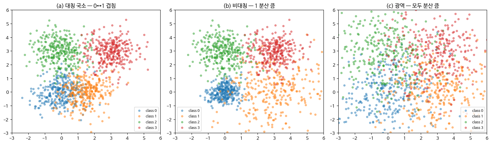

대칭도는 비대각선 쌍의 차이 $|C[i,j]-C[j,i]|$ 합을 그 쌍의 총합으로 나눈 뒤 1에서 뺀 값이고(1이면 완전 대칭), 국소성은 상위 1쌍이 전체 비대각선 오류에서 차지하는 비중이다.

```python
def diagnose_4axis(cm):
    K = cm.shape[0]
    diag = np.trace(cm); total = cm.sum()
    off = total - diag

    # 대칭성 — 비대각선 쌍의 |C[i,j] − C[j,i]| 를 쌍 합계로 정규화
    sym_score = 0; sym_total = 0
    for i in range(K):
        for j in range(i+1, K):
            sym_score += abs(cm[i,j] - cm[j,i])
            sym_total += cm[i,j] + cm[j,i]
    sym = 1 - sym_score / max(sym_total, 1)   # 1 = 완전 대칭

    # 국소성 — 상위 1쌍이 비대각선의 몇 %를 차지하는가
    pair_sums = sorted((cm[i,j] + cm[j,i]
                        for i in range(K) for j in range(i+1, K)), reverse=True)
    local_score = pair_sums[0] / off if off > 0 else 0

    return sym, local_score, off / total
```

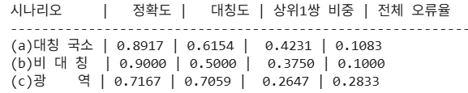

지표를 읽으면 다음과 같이 해석된다.

- **(a)** 대칭도가 약간 높고(0.6154) 상위 1쌍의 비중이 셋 중 가장 크다(0.4231) → 대칭성이 보인다.
- **(b)** 정확도가 가장 높고(0.9000) 대칭도는 가장 낮다(0.5000) → 비대칭성이 보인다.
- **(c)** 상위 1쌍의 비중이 가장 낮고(0.2647) 정확도가 낮으며(0.7167) 대칭도가 높다(0.7059). 양방향으로 많이 틀린다 → 학습이 어렵다.

혼동행렬을 직접 보면 각 시나리오의 구조가 더 분명해진다.

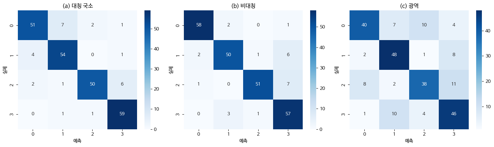

**(a) 대칭 국소 — 0↔1 겹침.** 정확도는 약 89.2%다($51+54+50+59 = 214$ / 240). 출력 분포를 보면 0 → 1이 7건, 1 → 0이 4건으로 합 11건이고, 2 → 3이 6건, 3 → 2가 1건으로 합 7건이다. 오답이 특정 쌍(0↔1, 2↔3)에 집중되어 있고 약간의 대칭성이 있다. 특정 클래스만 집중적으로 헷갈리는 전형적인 **국소(Local) 패턴**이다.

**(b) 비대칭 — 클래스 1의 분산이 큼.** 정확도는 약 90.0%로 셋 중 가장 높다($58+50+51+57 = 216$ / 240). 출력 분포를 보면 1 → 3이 6건, 2 → 3이 7건이다. 오답의 방향이 3 쪽으로 치우쳐 있다. 3으로 잘못 예측한 것이 14건인 데 비해 0으로 잘못 예측한 것은 3건, 1은 5건, 2는 2건이다. 클래스 1이나 2의 데이터 분포가 3의 영역을 침범하고 있는 **비대칭(Asymmetric) 구조**다.

**(c) 광역.** 정확도는 약 71.7%다($40+48+38+46 = 172$ / 240). 출력 분포를 보면 전체적으로 큰 오답이 퍼져 있다. 대각선 외의 거의 모든 칸에 7, 8, 10, 11과 같은 높은 오답 숫자가 골고루 흩어져 있다. 모델이 전반적으로 특징을 잘 잡아내지 못해 모든 클래스에 대해 방향성 없이 헷갈리는 **광역(Global) 패턴**이다.

---

## 5.2.10 라벨 노이즈와 경계 모호성의 진단
<!-- 슬라이드 345 -->

혼동의 네 번째 축에서 보았듯, 라벨 노이즈와 경계 모호성은 같은 현상처럼 보이지만 처방이 정반대다. 라벨 노이즈는 **데이터 생성 과정에서 라벨이 잘못 부여된 것**이고, 경계 모호성은 **라벨은 옳지만 두 클래스 영역이 본질적으로 연속적인 것**이다. 원인을 구분하기 위해 네 가지 진단을 사용한다.

### (1) 잠재공간 분리도

모델의 마지막 은닉층 표현, 즉 잠재공간에서 두 클래스의 분포를 확인한다.

- **라벨 노이즈** — 클래스 분포는 잘 분리된 군집을 이루고 있는데, 그 군집 안에 다른 클래스 라벨이 섞여 있다.
- **경계 모호성** — 클래스 분포가 자연스럽게 겹쳐 있고, 겹친 영역에서 라벨이 일관성 없이 분포한다.

군집이 깨끗한데 라벨만 튀는가, 아니면 군집 자체가 이어져 있는가가 갈림길이다.

### (2) 라벨 일관성 (Inter-annotator Agreement)

서로 다른 어노테이터, 또는 시간차를 두고 라벨링한 결과의 일치도를 본다.

- **라벨 노이즈** — 어떤 부분의 입력은 일치하고, 어떤 부분만 불일치한다.
- **경계 모호성** — 일치도가 전반적으로 매우 낮게 나타난다.

### (3) 혼동의 비대칭성

- **라벨 노이즈** — 노이즈가 클래스별로 다르면(class-conditional noise) 비대칭이 두드러진다.
- **경계 모호성** — 본질적으로 양방향이므로 대부분 대칭성을 가진다.

### (4) 혼동의 일관성 (epochs)

모델이 더 학습할수록 어떻게 되는지를 본다.

- **라벨 노이즈** — 학습할수록 노이즈 라벨까지 외워서 학습 정확도는 올라가지만 검증 정확도는 정체한다. 두 곡선이 벌어진다.
- **경계 모호성** — 일정 수준에서 학습과 검증이 함께 정체한다. 풀 수 없는 한계이기 때문이다.

### 진단 workflow

네 가지 진단을 실제 작업 순서로 옮기면 다음과 같다.

1. 학습이 끝난 모델의 검증 데이터로 혼동행렬을 작성하여 **큰 혼동 쌍 후보**를 식별한다.
2. 후보 쌍의 잠재공간 분포를 시각화한다(t-SNE, UMAP). 군집 내부가 섞인 것인지, 군집이 겹치면서 섞인 것인지를 구분한다.
3. 후보 쌍에서 작은 표본을 뽑아 라벨을 재검수한다. 필요하면 다른 어노테이터를 투입한다.
4. 결과에 따라 **데이터 정제** 또는 **라벨 체계 재설계** 중 하나를 선택한다.

---

## 5.2.11 두 원인을 데이터에서 갈라낸다
<!-- 슬라이드 346~347 -->

앞의 네 가지 진단 중 (1) 잠재공간 분리도와 (4) 혼동의 일관성을 실제 데이터로 확인한다. 라벨 노이즈 데이터와 경계 모호성 데이터를 각각 만들어 두 신호가 어떻게 갈라지는지 본다.

### 실습 5.2.2 — 혼동 분류의 4가지 축 (이어서)

> 노트북: `code/5.2.2.혼동분류학_4축.ipynb`

라벨 노이즈와 경계 모호성을 구분하기 위한 데이터셋을 생성한다. 그리고 마지막 은닉층에서 임베딩 벡터를 추출하여 2차원 PCA로 투영하는 **잠재공간 검증**을 수행한다.

```python
def get_trained_embeddings(X, y, epochs=100, seed=SEED):
    inp = keras.Input(shape=(X.shape[1],))
    x   = layers.Dense(128, activation='relu')(inp)
    x   = layers.Dense(64,  activation='relu')(x)
    emb = layers.Dense(8,   activation='relu')(x)   # 마지막 은닉층 = Embedding
    out = layers.Dense(4,   activation='softmax')(emb)

    m = keras.Model(inp, out)
    m.compile(optimizer=keras.optimizers.Adam(1e-3),
              loss=keras.losses.SparseCategoricalCrossentropy(),
              metrics=['accuracy'])
    m.fit(X, y, epochs=epochs, batch_size=32, verbose=0)

    embed_model = keras.Model(inputs=inp, outputs=emb)
    return embed_model.predict(X, verbose=0)

emb_noise = get_trained_embeddings(X_noise, y_noise)   # 라벨 노이즈 5%
emb_amb   = get_trained_embeddings(X_amb,   y_amb)     # 경계 모호성

pca = PCA(n_components=2, random_state=SEED)
emb_noise_2d = pca.fit_transform(emb_noise)
emb_amb_2d   = pca.fit_transform(emb_amb)
```

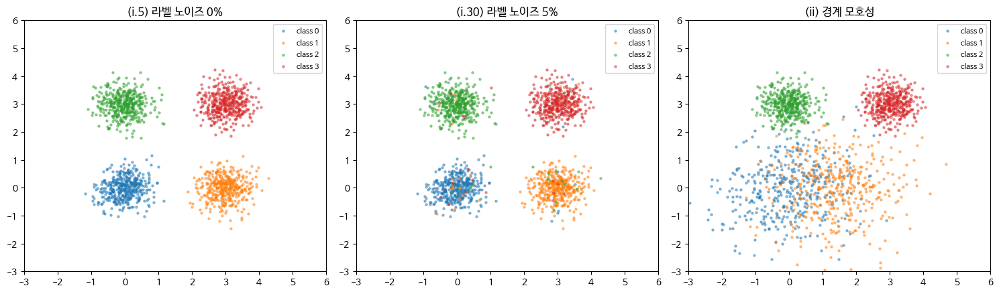

라벨 노이즈 데이터에서는 네 군집이 깨끗하게 분리되어 있고 그 안에 다른 색 점이 섞여 있다. 반면 경계 모호성 데이터에서는 클래스 0과 1의 영역 자체가 넓게 겹쳐 있다.

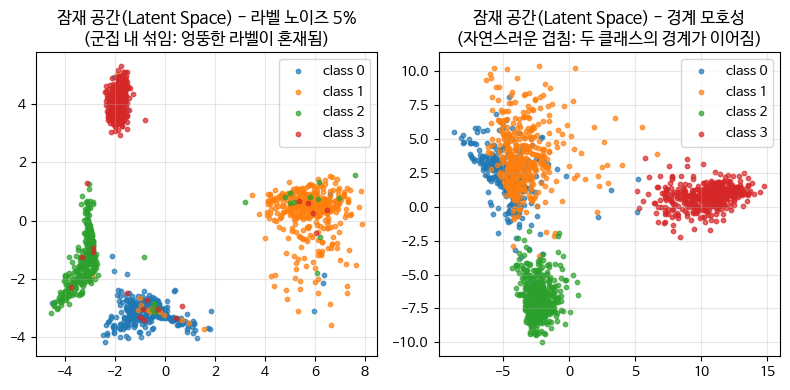

잠재공간에서의 차이가 진단의 핵심이다. 라벨 노이즈는 **잘 뭉친 군집 안에 다른 라벨이 섞인 모습**이고, 경계 모호성은 **군집끼리 자연스럽게 이어지며 겹친 모습**이다.

**혼동의 일관성 — 과적합이 가능한가**

학습 곡선을 통해서도 두 원인을 구분할 수 있다. 라벨 노이즈는 모델이 오류를 학습하기 때문에 학습 곡선과 검증 곡선이 벌어진다. 경계 모호성은 근본적인 문제이므로 학습과 검증이 함께 정체한다.

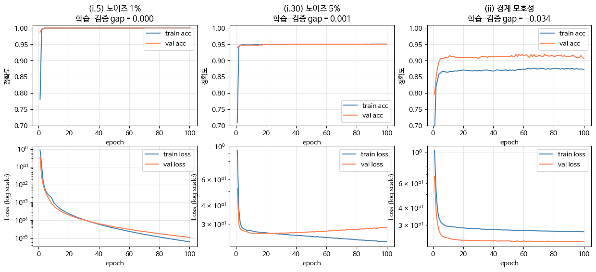

여기서 한 가지 의문이 생긴다. 경계 모호성 데이터를 학습할 때 검증 정확도와 검증 손실이 모두 학습 쪽보다 좋게 나오는 이유는 무엇인가. 원인은 표본 분할의 분산이다. 0과 1이 차지하는 겹침 영역의 표본 수가 전체의 10~20% 정도이고 학습/검증 분할이 8:2라면, 분할의 분산이 충분히 커서 5%p 정도의 차이는 자주 발생한다. 결국 학습셋과 검증셋의 클래스 비율이 살짝 다르고, 어려운 샘플이 학습셋에 더 많이 들어가면 학습 정확도가 오히려 낮게 나올 수 있다. 데이터 수가 적을 때 자주 발생하므로, 시드를 바꾸어 가며 변동성을 확인해야 한다.

---

## 5.2.12 라벨 표현 방식과 정보 손실
<!-- 슬라이드 348~349 -->

혼동의 원인이 경계 모호성이나 클래스 간 구조에 있다면, 처방은 모델이 아니라 **라벨 쪽**에 있다. 라벨을 어떻게 표현할 것인가라는 질문이다.

### (A) Hard Label의 묵시적 가정

Hard 라벨은 원-핫 인코딩이다.

$$y_i = \delta(i = c) \qquad (\text{정답은 } 1, \text{나머지는 } 0)$$

이 단순한 표현은 세 가지 주장을 묵시적으로 하고 있다.

**(1) 정답 클래스는 100% 확실하다.** 어떤 모호함도 허용하지 않는다. → 라벨이 본질적으로 모호한 경우(경계 모호성)에는 부정확한 가정이다.

**(2) 모든 오답 클래스는 동등하게 틀렸다.** 4를 9로 예측한 것과 4를 0으로 예측한 것은 같은 비용, 같은 수준의 오류다. → 클래스 간 의미적 거리가 다른 경우(예: Stage 분류)에는 부정확한 가정이다.

**(3) 클래스들은 서로 무관한 카테고리다.** 클래스 간 거리, 순서, 유사성 정보가 전혀 없다. → 클래스 사이에 실제로 구조(형태 유사성 같은)가 있을 때 그 정보를 버린다.

이후의 라벨 표현들은 이 세 가정을 하나씩 완화해 나가는 시도로 읽을 수 있다.

### (B) Label Smoothing — 가정 (1)의 완화

Label Smoothing은 정답이 100%라는 주장을 누그러뜨린다. 정답 클래스의 라벨을 $1$ 에서 $1-\varepsilon$ 으로 낮추고, 오답 라벨을 $0$ 에서 $\varepsilon/(K-1)$ 로 올린다.

$$y_c = 1 - \varepsilon, \qquad y_j = \frac{\varepsilon}{K-1} \quad (j \neq c)$$

효과는 과신(실제보다 너무 높은 확률)의 감소이고, calibration의 개선이다. 즉 확신도(confidence)와 정확도(accuracy) 사이의 차이가 줄어든다.

그러나 Label Smoothing은 가정 (2)와 (3)을 풀지 못한다. 모든 오답에 동일한 $\varepsilon/(K-1)$ 을 나누어 주므로, **모호함의 방향**을 표현하지 못한다.

### (C) Confusion-aware Soft Label — 가정 (2), (3)의 완화

가정 (2)와 (3)을 해결하려면 라벨이 **클래스 간 관계 정보**를 담아야 한다. 혼동행렬에서 추정한 유사도 행렬(similarity matrix) $S$ 를 이용하여 라벨을 다시 정의한다.

$$y_c = 1 - \varepsilon, \qquad y_j = \varepsilon \cdot \frac{S[c,j]}{\sum_{j \neq c} S[c,j]} \quad (j \neq c)$$

여기서 유사도 행렬은 혼동행렬로부터 만든다. 가장 단순한 형태는 양방향 혼동의 평균이다.

$$S[i,j] = \frac{C[i,j] + C[j,i]}{2}$$

유사도 행렬 $S[c,j]$ 는 비슷한 클래스에 $\varepsilon$ 을 더 많이 할당하는 역할을 한다. 더 큰 타깃은 더 큰 페널티, 곧 더 큰 손실을 뜻한다. 정답이 4일 때 0보다 9에 더 큰 값을 할당하므로, 모델은 "4를 9로 헷갈리는 것은 어느 정도 자연스럽다"는 정보를 라벨에서 직접 받는다.

유사도 행렬은 혼동행렬 외에도 표현 거리(representation distance), 의미적 유사도(semantic similarity), 계층·온톨로지(hierarchy/ontology) 등을 기반으로 계산할 수 있다.

### (D) Knowledge Distillation Soft Label — 교사가 알려준 라벨

**KD(Knowledge Distillation)** 는 큰 교사(teacher) 모델의 softmax 출력을 학생(student) 모델의 라벨로 사용한다. 교사 모델의 출력은 이미 클래스 간 관계를 담고 있으므로, 가정 (3)을 훨씬 풍부하고 정확하게 표현한다.

이때 출력의 부드러움 정도는 **Temperature-scaled Softmax** 의 온도 $T$ 로 제어한다.

$$q_i^{(T)} = \frac{\exp(z_i / T)}{\sum_k \exp(z_k / T)}$$

$T$ 가 커질수록 분포가 평평해지고 클래스 간 관계 정보가 더 잘 드러난다. 다만 KD는 주로 모델 압축에서 쓰이며, **교사 모델의 출력이 진실이라는 가정**이 포함되어 있다는 점에 주의해야 한다.

### 네 가지 라벨 표현의 비교

Hard에서 KD Soft까지의 라벨 표현은 연속적인 표현 개선의 스펙트럼을 이룬다. 표현이 풍부할수록 정보가 많아지지만, **그 정보의 신뢰성도 함께 검토해야 한다.**

| 라벨 표현 | 정답 클래스 | 오답 클래스 분포 | 표현하는 정보 |
|---|---|---|---|
| Hard (One-hot) | $1.0$ | $0.0$ (모두 동일) | 정답 클래스만 |
| Label Smoothing | $1-\varepsilon$ | $\varepsilon/(K-1)$ (균등) | 정답이 100%는 아님 |
| Confusion-aware | $1-\varepsilon$ | $\varepsilon \cdot S[c,j]$ (유사도 비례) | 정답 + 클래스 간 유사도 |
| Knowledge Distillation Soft | $p_T(c)$ | $p_T(j)$ (교사 출력) | 정답 + 풍부한 관계 + 교사의 확신도 |

---

## 5.2.13 손실함수의 묵시적 가정
<!-- 슬라이드 350 -->

라벨만 가정을 갖는 것이 아니다. **손실 함수도 라벨에 대한 묵시적 가정을 갖는다.**

### Cross-Entropy (CE)

$$\mathcal{L}_{CE} = -\sum_i y_i \log \hat{y}_i$$

CE는 라벨을 분포로 보고 예측 분포와의 KL 거리를 최소화한다. Hard 라벨과 함께 쓰는 CE는 앞서의 가정 (1), (2), (3)을 그대로 받아들인다. Smooth 라벨과 함께 쓰는 CE는 가정 (1)만 완화한 것이다.

### Focal Loss

$$\mathcal{L}_{\text{Focal}} = -(1 - \hat{y}_i)^\gamma \log \hat{y}_i$$

클래스 불균형 문제에서 효과적인 손실이다. 모델이 이미 잘 맞히는 샘플, 즉 $\hat{y}_i$ 가 큰 샘플에는 $(1-\hat{y}_i)^\gamma$ 가 작아지므로 가중치를 낮추고, 어려운 샘플에 집중한다. 여기에 깔린 주장은 "라벨이 모두 동등하게 중요한 것이 아니라 **어려운 샘플이 더 중요하다**"이다.

### Ordinal Loss / Class-distance Loss

라벨이 순서형이거나 거리 구조를 가질 때 적합한 손실이다. 오답 클래스에 대해 라벨 사이의 **거리를 반영한 페널티**를 준다. Stage II가 정답일 때, Stage III로 예측한 오차는 Stage IV로 예측한 오차보다 더 작은 손실을 받는다. 여기에 깔린 주장은 "**오답들도 동등하게 틀린 것이 아니다**"이다.

데이터에 경계 모호성이나 순서 구조가 있다면, 라벨 표현(Smooth / Confusion-aware)과 손실 함수(Focal / Ordinal)를 **함께 재설계**해야 한다. 둘 중 하나만 바꾸면 나머지 하나가 여전히 잘못된 가정을 강제한다.

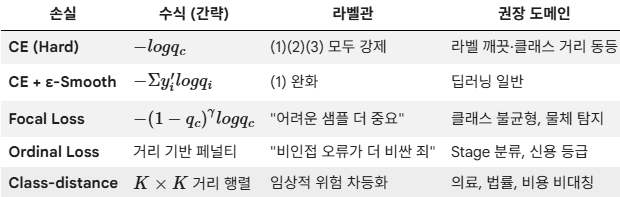

*그림 5-2. 손실 함수별 묵시적 라벨관. 각 손실이 어떤 도메인 가정에 맞는지 함께 정리되어 있다.*

표의 마지막 열이 실무의 지도다. Hard CE는 라벨이 깨끗하고 클래스 간 거리가 동등한 문제에, ε-Smooth CE는 딥러닝 일반에, Focal Loss는 클래스 불균형과 물체 탐지에, Ordinal Loss는 Stage 분류나 신용 등급에, Class-distance Loss는 의료·법률처럼 **비용이 비대칭인 도메인**에 맞는다.

---

## 5.2.14 라벨 표현과 손실의 비교
<!-- 슬라이드 351~353 -->

네 가지 라벨과 세 가지 손실이 각각 무엇을 가정하는지는 앞에서 정리했다. 이제 같은 정답에 대해 그 가정들이 **숫자로 어떻게 갈라지는지**를 본다.

### 실습 5.2.3 — 라벨 표현과 손실

> 노트북: `code/5.2.3.라벨표현_손실.ipynb`

**목표** — 네 가지 라벨 표현(Hard / Smooth / Confusion-aware / KD)과 세 가지 손실 함수(CE / Focal / Ordinal)를 비교한다.

$\varepsilon = 0.1$, 가상의 유사도 행렬, $T = 2$ 를 두고 각 라벨이 어떤 분포를 갖는지 시각화한다.

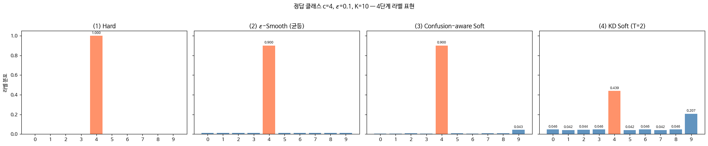

세 번째와 네 번째 그림이 핵심이다. Confusion-aware Soft Label은 오답 중에서도 **9에만 유독 큰 값**을 준다. 4와 9가 닮았다는 정보가 라벨에 직접 들어간 것이다. KD Soft는 여기서 더 나아가 정답 클래스의 값 자체를 낮추고 클래스 간 관계를 훨씬 풍부하게 표현한다.

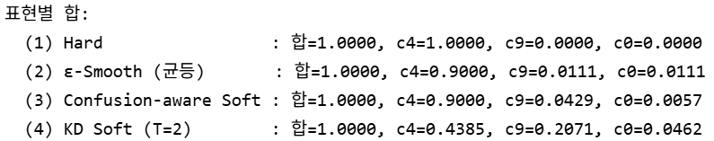

네 표현 모두 합은 1이다. 달라지는 것은 **오답에 나누어 준 $\varepsilon$ 의 분배 방식**뿐이다. ε-Smooth는 9번과 0번에 똑같이 0.0111을 주지만, Confusion-aware는 9번에 0.0429를, 0번에는 0.0057만 준다. 여덟 배 가까운 차이가 "4는 9와 닮았다"는 정보다.

Temperature-scaled Softmax를 사용할 때 CE 식은 다음과 같이 분해된다.

$$\mathrm{CE}(p, q) = H(p) + D_{KL}(p \,\|\, q)$$

Hard Label일 때는 $H(p) = 0$ 이므로 CE가 곧 KL이다. Soft Label에서는 $H(p) > 0$ 이지만, 이 값은 라벨이 정해지면 고정되는 상수이므로 **학습과는 무관**하다. 즉 어떤 라벨 표현을 쓰더라도 최적화의 대상은 KL 항이다.

$\varepsilon = 0.1$, 가상 유사도 행렬, $T = 2$ 조건에서 실제로 $H(p)$, $D_{KL}(p\|q)$, CE 값을 계산해 본다.

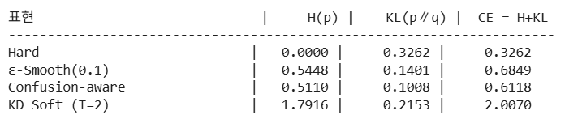

Hard에서 KD Soft로 갈수록 $H(p)$ 가 커지고, 그만큼 CE의 절댓값도 커진다. 그러나 그 증가분은 상수이므로 학습 신호에는 영향을 주지 않는다.

**Label Smoothing 강도에 따른 비교**

MNIST를 $\varepsilon \in \{0.0,\ 0.05,\ 0.1,\ 0.2\}$ 로 학습시켜 정확도, 평균 확신도, ECE를 비교한다.

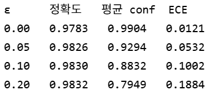

$\varepsilon = 0.2$ 에서 세 지표가 각각 극단으로 간다.

- **정확도 최고** — 불확실성을 라벨에 포함하면 학습이 잘 된다.
- **평균 확신도 최저** — 출력에도 불확실성이 반영된다.
- **ECE 최고** — 이 결과는 해석에 주의가 필요하다. 평가에 사용하는 정답 라벨이 원-핫이기 때문에, 모델의 낮은 확신도가 **과소확신으로 평가되어** ECE가 커진 것이다.

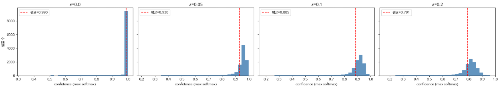

히스토그램을 보면 $\varepsilon$ 이 커질수록 확신도 분포가 왼쪽으로 이동하며 1.0에 몰려 있던 봉우리가 흩어지는 것을 확인할 수 있다.

**CE / Focal / Ordinal Loss 비교**

세 가지 시나리오에서 각 손실 함수의 값을 비교한다. 정답은 4이고, 세 개의 예측 분포를 만든다.

```python
K = 10  # 시나리오 — q1 (정답 명확), q2 (애매), q3 (잘못된 확신)
q1 = np.full(K, 0.01); q1[4] = 0.91
q2 = np.full(K, 0.05); q2[4] = 0.5; q2[9] = 0.4; q2 /= q2.sum()
q3 = np.full(K, 0.01); q3[0] = 0.91      # 4 대신 0 으로 강한 확신 — 비인접 오류
```

- $q_1$ — 정답이 명확하다. 클래스 4에 0.91을 준다.
- $q_2$ — 애매하다. 클래스 4에 0.5, 오답인 클래스 9에 0.4를 준다.
- $q_3$ — 잘못된 확신이다. 4 대신 0에 0.91을 준다. 순서상 멀리 떨어진 비인접 오류다.

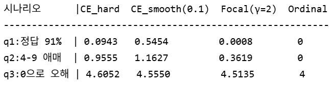

여기서 주의할 점이 있다. **서로 다른 손실 함수의 절댓값을 직접 비교하는 것은 큰 의미가 없다.** 의미는 각 손실 함수가 어떤 종류의 오류에 더 민감하게 반응하는가, 즉 어디에 페널티를 주는가 하는 성향을 파악하는 데 있다.

- **Focal Loss — 쉬운 것은 무시한다.** $q_1$ 에서 CE_hard는 0.09의 손실을 주지만, Focal은 0.0008로 거의 0으로 만들어 버린다. 이미 잘 맞히는 쉬운 문제는 학습 신호에서 배제된다.
- **CE_smooth — 과잉 확신을 경계한다.** $q_2$ 에서 오답인 9번 클래스에 40%의 확신을 가졌을 때, CE_hard보다 더 큰 1.16의 페널티를 준다. 오답에 과하게 확신을 가지면 더 강하게 벌한다.
- **Ordinal Loss — 비인접 오류를 벌한다.** $q_3$ 에서 CE나 Focal은 단순히 "틀렸다"를 계산한 값을 내놓는다. 반면 Ordinal Loss는 $|0 - 4| = 4$ 라는 값으로 **순서를 얼마나 틀렸는지의 거리**를 페널티로 부여한다.

실제로 사용하는 Ordinal Loss는 다양한 변형이 존재하며, 여기 예제는 아주 간략화된 형태다.

---

## 5.2.15 혼동행렬에서 유사도 행렬로
<!-- 슬라이드 354, 356 -->

Confusion-aware Soft Label에서 유사도 행렬 $S$ 를 잠깐 사용했다. 이제 그 $S$ 를 제대로 만드는 방법을 다룬다. 목표는 **혼동행렬 → 클래스 유사도 → 클래스 계층 구조 발견**이라는 절차를 완성하는 것이다. $K$ 개의 클래스가 평면적으로 주어져 있어도, 실제로는 클래스 간에 계층 관계가 숨어 있을 수 있기 때문이다.

### 쌍별 혼동 점수를 유사도 행렬로 변환하기

가장 단순한 유사도 정량화는 클래스 $i$ 와 $j$ 의 양방향 혼동의 합을, 두 클래스와 관련된 전체 샘플 수로 나눈 비율이다.

이렇게 얻은 값으로 채운 $K \times K$ 대칭 행렬 $S$(대각선은 0)가 **클래스 간 유사도 행렬**이다. $S$ 가 0에 가까우면 두 클래스가 잘 구분되는 것이고, 1에 가까우면 거의 구분되지 않는 것이다.

혼동행렬을 덴드로그램으로 보내려면 이 $S$ 를 먼저 만들어야 한다. 유사도를 정의하는 방법은 하나가 아니며, 각각 다른 것을 본다.

### (1) Pairwise Confusion Score — 직접 혼동량

$$S^{\text{pair}}_{ij} = \frac{C[i,j] + C[j,i]}{n_i + n_j}$$

혼동행렬에 직접 등장한 양방향 혼동의 비율이다. 계산이 단순하고 해석이 직관적이라 **1차 진단**에 적합하다. 단, 두 클래스가 각각 다른 클래스로 빠지는 패턴의 유사성은 보지 못한다.

### (2) Jaccard 유사도 — 결정 영역의 겹침

$$J(i,j) = \frac{|E_i \cap E_j|}{|E_i \cup E_j|}, \qquad E_i,\ E_j : \text{모델이 } i \text{ 또는 } j \text{ 와 헷갈린 샘플 집합}$$

두 클래스가 **같은 입력을 두고 경쟁한 영역**의 크기를 계산한다. 모델이 학습한 결정 경계를 분석하는 척도이므로, 모델의 행동에 기반한다. 다만 살짝 헷갈렸는지 완전히 헷갈렸는지의 정도는 반영하지 못한다.

### (3) KL Divergence — 오류 분포 패턴의 비교

$$KL(p_i \,\|\, p_j) = \sum_k p_i(k) \log \frac{p_i(k)}{p_j(k)}$$

여기서 $p_i$ 는 클래스 $i$ 가 어느 클래스로 빠지는지의 분포다. 이 척도는 $i$ 의 오류 분포와 $j$ 의 오류 분포가 얼마나 다른가를 잰다. 그래서 $i$ 와 $j$ 가 서로 직접 혼동되지 않더라도, 둘 다 $k$ 로 잘 빠진다면 비슷한 클래스로 묶을 수 있다. 이것이 **간접 유사성**이다. KL은 비대칭이므로 보통 대칭화한 JS divergence를 사용한다.

> **권장 운용 순서**
> Pairwise로 큰 그림을 잡고 → Jaccard로 결정 영역을 확인한 뒤 → KL로 숨은 패턴 그룹을 발굴한다.

---

## 5.2.16 계층적 클러스터링과 덴드로그램
<!-- 슬라이드 355, 357 -->

### 거리 행렬과 linkage

유사도 행렬 $S$ 로부터 거리 행렬을 만든다.

$$D_{ij} = 1 - S_{ij}$$

여기에 계층적 클러스터링을 적용하면 트리 구조의 **덴드로그램(dendrogram)** 을 얻을 수 있다. 클러스터를 묶어 나갈 때 두 클러스터 사이의 거리를 어떻게 정의하느냐에 따라 세 가지 linkage가 있다.

**Ward linkage (분산 최소 연결)** — "Ward"는 고안자의 이름이다. 두 클러스터 $A$ 와 $B$ 를 합쳤을 때 클러스터 내부 분산이 얼마나 늘어나는가를 거리로 삼는다.

$$d(A, B) = \frac{|A|\,|B|}{|A| + |B|} \cdot \left\lVert \bar{a} - \bar{b} \right\rVert^2$$

- $|A|, |B|$ : 두 클러스터의 크기(샘플 수)
- $\bar{a}, \bar{b}$ : 두 클러스터의 중심점
- $\lVert \bar{a} - \bar{b} \rVert^2$ : 두 중심 사이의 유클리드 거리의 제곱
- $\dfrac{|A||B|}{|A|+|B|}$ : 두 클러스터 크기의 조화평균의 절반, 즉 가중치

**Complete linkage (최장 연결)** — $A$ 와 $B$ 에서 가장 먼 점 사이의 거리를 사용한다.

$$d(A, B) = \max_{a \in A,\, b \in B} d(a, b)$$

두 클러스터가 합쳐지려면 가장 먼 구성원끼리도 가까워야 한다는 기준이다. 그 결과 컴팩트하고 비슷한 크기의 클러스터가 만들어진다. 단점은 하나의 이상치(outlier)가 클러스터를 늦게 합치게 만든다는 점이다.

**Average linkage (평균 연결)** — $A$ 와 $B$ 에 속한 모든 점 쌍의 거리 평균을 쓴다.

$$d(A, B) = \frac{1}{|A|\,|B|} \sum_{a \in A,\, b \in B} d(a, b)$$

가장 균형 잡힌 방식이다. 이상치에 덜 민감하고 클러스터 모양에 큰 편향이 없다. 혼동행렬 클러스터링에서 무난한 기본 선택이다.

어느 linkage를 쓰든 절차는 같다. **가장 가까운 두 클러스터를 반복해서 병합**하면서, 병합된 두 클러스터의 ID, 그때의 거리, 새 클러스터의 크기를 기록한다. 이 기록을 트리로 시각화한 것이 덴드로그램이다.

### 덴드로그램을 읽는 법

덴드로그램에서 읽어야 할 것은 세 가지다.

- **잎(leaf) 노드들이 묶이는 순서** — 일찍 묶일수록 두 클래스가 가깝다.
- **묶이는 높이(height)** — 그 단계에서의 두 클러스터 간 거리다.
- **자른 높이에 따른 클러스터 수** — 임계값을 정하면 몇 개 그룹으로 볼지가 결정된다.

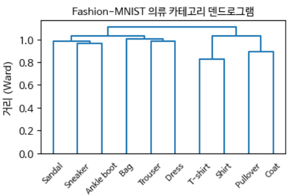

*그림 5-3. 혼동 기반 덴드로그램. 잎이 묶이는 높이가 클래스 간 거리를 나타낸다.*

### 덴드로그램이 알려주는 데이터의 분류 체계

MNIST 같은 평면적 라벨 체계에서도, 혼동 기반 덴드로그램은 클래스들이 **형태 유사성이라는 잠재적 차원에서 계층 구조를 가짐**을 보여준다. $\{4,9\}$, $\{3,8\}$, $\{1,7\}$ 이 빨리 묶이는 것은 이 쌍들이 형태적으로 닮았기 때문이다.

여기서 나오는 실용적 함의는 네 가지다.

- **계층적 분류기 설계** — 먼저 큰 그룹(직선 중심 vs 곡선 중심)을 분류하고, 그룹 내에서 세부 분류를 수행할 수 있다. 일부 도메인에서는 정확도와 해석성을 동시에 개선한다.
- **Soft Label 설계** — Confusion-aware Soft Label을 덴드로그램의 거리에 비례하도록 설계할 수 있다.
- **Fine-grained 라벨 체계 설계** — 어떤 클래스를 세분해야 하는지, 어떤 클래스를 합쳐도 되는지 판단하는 근거가 된다.
- **표현 학습의 검증** — 아래에서 다룬다.

### 잠재공간의 클러스터 구조 vs 혼동 덴드로그램

또 다른 적용이 있다. 잠재공간에서 얻은 클러스터 구조와 혼동에서 얻은 덴드로그램을 비교하는 것이다. 두 구조가 일치하는지 확인하는 일은 **데이터 구조 검증의 강력한 도구**가 된다.

잠재공간 구조와 혼동 구조가 일치한다면, 표현 학습이 라벨이 이미 알고 있던 구조를 발견했다는 뜻이다. 두 구조가 다르다면, 표현이 라벨 외의 정보를 더 보고 있거나(잠재공간이 더 풍부함), 반대로 덜 보고 있다는(잠재공간이 부족함) 신호로 해석한다.

이 방법의 가치는 분명하다. **별도의 메타데이터 없이도 클래스 간의 자연스러운 그룹과 거리 구조를 데이터로부터 추정**할 수 있다.

---

## 5.2.17 유사도에서 덴드로그램까지
<!-- 슬라이드 358~360 -->

유사도 세 가지와 linkage 세 가지를 정의했으니, 실제 혼동행렬 하나를 넣어 트리가 무엇을 그려 내는지 확인한다.

### 실습 5.2.4 — 유사도와 덴드로그램

> 노트북: `code/5.2.4.유사도_덴드로그램.ipynb`

**목표** — MNIST 분류 모델을 학습시킨 뒤 혼동행렬 → 유사도 행렬 → 거리 행렬 → 덴드로그램의 절차를 따라간다. 그 과정에서 세 가지 유사도(Pairwise / Jaccard / KL)를 비교한다.

세 유사도는 같은 혼동행렬 `cm` 하나에서 만들어진다.

```python
def pairwise_confusion(cm):
    """Pairwise Confusion Score — 양방향 혼동을 두 클래스 관련 샘플 수로 정규화."""
    K = cm.shape[0]; sim = np.zeros((K, K))
    for i in range(K):
        for j in range(i+1, K):
            num   = cm[i, j] + cm[j, i]
            denom = cm[i, i] + cm[j, j] + cm[i, j] + cm[j, i]
            sim[i, j] = sim[j, i] = num / (denom + EPS)
    return sim

def jaccard_confusion(cm):
    """Jaccard-style — 결정 영역의 겹침."""
    K = cm.shape[0]; sim = np.zeros((K, K))
    row_sum = cm.sum(axis=1); col_sum = cm.sum(axis=0)
    for i in range(K):
        for j in range(i+1, K):
            num   = cm[i, j] + cm[j, i]
            denom = row_sum[i] + col_sum[j] - cm[i, j] + EPS
            sim[i, j] = sim[j, i] = num / denom
    return sim

def kl_distance(cm):
    """행 분포 사이의 대칭 KL — 오류 패턴의 유사성."""
    K = cm.shape[0]
    Pr = (cm + EPS) / (cm.sum(axis=1, keepdims=True) + EPS)
    D = np.zeros((K, K))
    for i in range(K):
        for j in range(i+1, K):
            kl_ij = float(np.sum(Pr[i] * np.log(Pr[i] / Pr[j])))
            kl_ji = float(np.sum(Pr[j] * np.log(Pr[j] / Pr[i])))
            D[i, j] = D[j, i] = 0.5 * (kl_ij + kl_ji)
    return D
```

![Pairwise Confusion Score로 만든 유사도 행렬 히트맵 — 값 범위 [0,1]](images/s358_01.png)

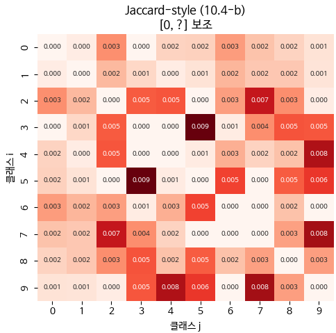

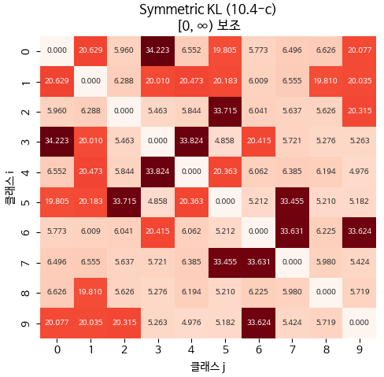

세 행렬은 같은 혼동행렬에서 나왔지만 강조하는 관계가 다르다. Pairwise는 직접 혼동을, Jaccard는 결정 영역의 경쟁을, KL은 오류 분포 패턴의 유사성을 강조한다.

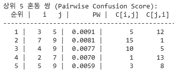

Pairwise 기준으로는 (3, 5) 쌍이 점수 0.0091로 가장 헷갈린다. 3을 5로 예측한 것이 5회, 5를 3으로 예측한 것이 12회다. 양방향 혼동이지만 한쪽이 두 배 이상 크므로 완전한 대칭은 아니다. 2위부터는 (7, 9) 0.0081, (4, 9) 0.0077, (2, 7) 0.0070, (5, 9) 0.0059로, **상위 다섯 쌍이 모두 형태적으로 닮은 숫자 쌍**이다.

**유사도 행렬에서 덴드로그램까지**

유사도 행렬을 거리 행렬로 바꾸고 Ward linkage로 계층 클러스터링을 수행한다.

```python
# Pairwise → 거리, Ward linkage 계층 클러스터링
D = 1.0 - S_pw
np.fill_diagonal(D, 0.0)
D = (D + D.T) / 2   # 강제 대칭 (수치 오차 방지)

# scipy 는 condensed distance vector 형식 요구
condensed = squareform(D, checks=False)
Z = linkage(condensed, method='ward')

dendrogram(Z, labels=class_names, ax=ax,
           leaf_rotation=0,
           color_threshold=0.7 * float(np.max(Z[:, 2])))
```

거리 행렬을 만들 때 두 가지 처리가 필요하다. 대각선을 0으로 채우는 것과, $D = (D + D^\top)/2$ 로 강제 대칭화하여 수치 오차를 없애는 것이다. `scipy` 는 condensed distance vector 형식을 요구하므로 `squareform` 으로 변환한 뒤 `linkage` 를 호출한다.

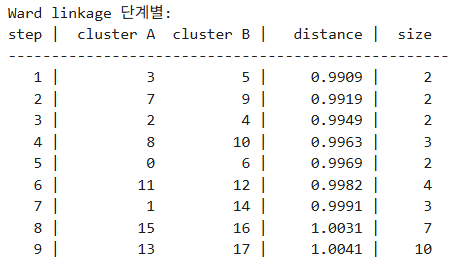

병합 기록에서 ID가 10 이상인 항목은 병합으로 새로 만들어진 클러스터를 뜻하고, Size는 기본 클러스터 몇 개가 결합되었는지를 뜻한다.

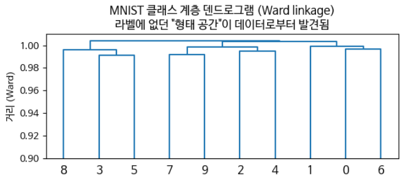

현재 실행 결과에서는 $\{3, 5\}$, $\{7, 9\}$, $\{2, 4\}$, $\{0, 6\}$ 등의 형태 유사 쌍이 가장 먼저 묶인다. 그중 $(3, 5)$ 가 가장 가깝다.

**MNIST와 Fashion-MNIST 덴드로그램 비교**

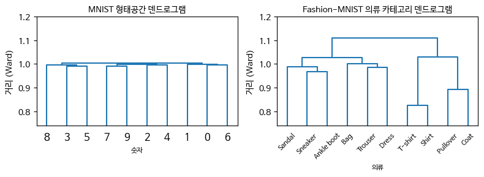

두 데이터셋의 덴드로그램은 서로 다른 종류의 구조를 드러낸다. MNIST는 **형태 유사성 그룹**을 만들고, Fashion-MNIST는 **의류 카테고리 그룹**을 만든다. Fashion-MNIST에서는 $\{$T-shirt, Shirt$\}$, $\{$Pullover, Coat$\}$, $\{$Sneaker, Ankle boot$\}$, $\{$Trouser, Dress$\}$ 처럼 유사 카테고리가 묶인다.

한 가지 눈에 띄는 점은 Fashion-MNIST 덴드로그램에서 마지막 루트의 높이가 1.0을 넘는다는 것이다. 이는 Ward linkage의 거리 계산 방식, 즉 그룹 내 분산 증가량으로 거리를 표현하는 방식 때문이다. 마지막 루트에서 하나로 합치려 할 때 두 그룹 간의 이질성이 크므로 분산이 폭발적으로 증가하고, 누적된 분산 증가량이 $D = 1 - S$ 의 기본 최댓값인 1.0을 뚫고 약 1.09 이상으로 높게 나타난다.

---

## 5.2.18 Calibration — 세 가지 강도와 측정 지표
<!-- 슬라이드 361, 363 -->

분류 모델은 $K$ 개의 softmax 확률을 출력한다. 그런데 이 출력값은 실제 확률과 다르다. 0.9를 출력했다고 해서 그런 예측이 실제로 90% 맞는다는 보장이 없다. **Calibration(보정)** 은 출력이 실제 정답 비율에 맞게 잘 맞추어져 있는지를 측정하는 개념이다. 잘 보정될수록 그 차이는 0에 가까워진다.

Calibration에는 강도가 다른 세 가지 기준이 있다.

### Strict Calibration — 가장 엄격한 기준

$$q_i(x) = P(y = i \mid x) \qquad \forall\, i,\ x$$

모든 입력 $x$ 에 대해, 모델의 출력 분포 $q$ 가 진짜 조건부 분포 $P$ 와 일치하는 경우다. 이는 곧 완벽한 모델을 의미한다.

문제는 이 기준이 **검증 불가능**하다는 점이다. 정답 $P(y \mid x)$ 를 알 수 없기 때문이다. 따라서 Strict Calibration은 학술적 기준선 역할만 한다.

### Marginal Calibration — 실무의 기준

$$P\!\left(\hat{y} = y \;\middle|\; \max_i q_i = p \right) = p$$

왼쪽은 실제 정답률이고, 오른쪽 $p$ 는 모델이 말한 확신도다. 모델이 "90% 확신한다"고 말한 샘플들만 모았을 때 실제로 90%가 맞으면 이 조건이 성립한다.

실무에서는 $p$ 가 연속값이므로 구간(bin)으로 근사한다. 그렇게 근사한 것이 **ECE(Expected Calibration Error)** 다.

### Class-wise Calibration — 클래스별 정밀 진단

각 클래스별로 calibration을 따로 따진다. 의료나 법률처럼 실무 임계 응용에서는 Marginal Calibration만으로는 부족하다. **희소하지만 중요한 클래스**의 신뢰도를 별도로 검증할 필요가 있기 때문이다. 의료에서 희귀 질환, 법률에서 중대 위반 분류가 그런 클래스다.

### 강도의 위계

세 기준 사이에는 다음 위계가 있다.

$$\text{Strict} \implies \text{Class-wise} \implies \text{Marginal}$$

위가 성립하면 아래도 성립하지만, 역은 성립하지 않는다. 그래서 실무 적용 순서는 자연스럽게 정해진다. **Marginal calibration으로 1차 진단**을 하고, 문제가 보이면 **Class-wise calibration으로 2차 정밀 진단**을 한다.

### 보정 상태를 재는 지표들

**ECE (Expected Calibration Error)** — 확신도를 $M$ 개 구간으로 나눈 뒤, 각 구간의 평균 예측 확률과 실제 정확도의 차이를 샘플 수로 가중 평균한 값이다.

$$\mathrm{ECE} = \sum_{m=1}^{M} \frac{|B_m|}{N} \left| \mathrm{acc}(B_m) - \mathrm{conf}(B_m) \right|$$

0에 가까울수록 예측 확률의 신뢰도가 높다. 다만 **평균의 함정**이 있다. 어떤 그룹에서의 과신과 다른 그룹에서의 과소신뢰가 상쇄되면 ECE가 0이 되어 버린다.

**MCE (Maximum Calibration Error)** — $M$ 개 구간 중에서 예측 확률과 실제 정확도의 차이가 가장 큰 구간의 차이 값이다.

$$\mathrm{MCE} = \max_{m \in \{1,\dots,M\}} \left| \mathrm{acc}(B_m) - \mathrm{conf}(B_m) \right|$$

평균이 아니라 최악을 보므로, 의료 진단이나 자율주행처럼 **최악의 오작동을 방지해야 하는 도메인**에서 중요하다.

**Adaptive ECE** — 구간을 확신도 값으로 균등 분할하지 않고, 각 구간에 들어가는 **샘플 수가 같아지도록** 분할한다. 딥러닝 모델처럼 확신도가 0.99 근처에 몰려 있는 경우에 유용하다.

**Class-wise ECE** — 클래스 $k$ 별로 확신도 값을 $M$ 개 영역으로 분할하여, 평균 확신도와 실제 정답 비율을 비교한다.

$$\mathrm{ECE}^{\text{class-wise}}_k = \sum_{m=1}^{M} \frac{|B_{k,m}|}{N} \left| \mathrm{acc}_k(B_{k,m}) - \mathrm{conf}_k(B_{k,m}) \right|$$

- $B_{k,m}$ : 클래스 $k$ 의 $m$ 번째 bin
- $\mathrm{acc}_k(B_{k,m})$ : 해당 bin에서 실제로 클래스 $k$ 가 정답인 비율(정답은 원-핫으로 가정)
- $\mathrm{conf}_k(B_{k,m})$ : 해당 bin에서 모델이 클래스 $k$ 라고 예측한 평균 확률
- $N$ : 전체 샘플 수

이 지표는 클래스별 calibration 문제, 즉 과신과 과소신뢰를 세밀하게 진단할 수 있게 한다. 클래스별 막대가 들쭉날쭉하다면 어떤 클래스는 보정이 약하고 다른 클래스는 충분히 보정되었다는 뜻이며, 임계 도메인에서는 이 수준의 진단이 필요하다. 나아가

$$\Delta_m^k = \mathrm{acc}_k(B_{k,m}) - \mathrm{conf}_k(B_{k,m})$$

의 **부호**를 보면 과신($\Delta > 0$)인지 과소신뢰($\Delta < 0$)인지를 평가할 수 있다.

**Brier Score** — 모든 클래스의 확신도와 정답 사이의 평균제곱오차(MSE)다. 각 클래스별 MSE를 전체 평균하므로 클래스별 확인도 가능하다.

$$\mathrm{Brier} = \frac{1}{N} \sum_{n=1}^{N} \sum_{k=1}^{K} \left( q_k(x_n) - y_k(x_n) \right)^2$$

**NLL (Negative Log-Likelihood)** — 정답 클래스 확신도의 음의 로그를 평균한 값이다.

$$\mathrm{NLL} = -\frac{1}{N} \sum_{n=1}^{N} \log q_{y_n}(x_n)$$

로그가 0 근처에서 급격히 발산하므로 **낮은 확신도에 민감**하다. 즉 과소신뢰를 강하게 벌한다.

---

## 5.2.19 보정 상태를 측정한다
<!-- 슬라이드 362~363 -->

지표의 정의는 앞에서 세웠다. 이제 학습이 끝난 MNIST 모델 하나를 놓고 다섯 지표가 각각 무엇을 말하는지, 그리고 **왜 서로 다른 이야기를 하는지**를 본다.

### 실습 5.2.5 — Accuracy Calibration

> 노트북: `code/5.2.5.Calibration_정의_메트릭.ipynb`

**목표** — MNIST 분류 모델을 학습한 뒤 모델의 Accuracy와 Confidence의 유사도를 분석한다. 다루는 지표는 다음과 같다.

- **Marginal Calibration (ECE)** — 확신도를 $n$ 개 영역으로 분할하여 평균 확신도와 평균 정확도를 비교한다.
- **MCE (Maximum Calibration Error)** — $n$ 개 구간에서 확신도와 정답률의 차이 중 가장 큰 값을 보아 최대 불일치를 확인한다.
- **Adaptive ECE** — 각 영역의 샘플 수(count)가 동일하도록 $n$ 개로 분할한다. 딥러닝 모델처럼 확신도가 0.99 근처에 몰린 경우에 유용하다.
- **Brier Score** — 모든 클래스의 확신도와 정답 간의 MSE다. 각 클래스별 MSE를 전체 평균하므로 클래스별 확인도 가능하다.
- **NLL** — 정답 클래스 확신도의 음의 로그 평균이다. 낮은 확신도에 민감하여 과소신뢰를 강하게 평가한다.

ECE는 확신도를 등간격 bin으로 나눈 뒤, bin마다 정확도와 평균 확신도의 차이를 샘플 수로 가중 평균한 값이다.

```python
def compute_ece(y_true, probs, n_bins=15):
    conf = probs.max(axis=1)
    pred = probs.argmax(axis=1)
    n = len(y_true)
    bins = np.linspace(0.0, 1.0, n_bins + 1)
    ece = 0.0
    for lo, hi in zip(bins[:-1], bins[1:]):
        mask = (conf >= lo) & (conf < hi) if hi < 1.0 else (conf >= lo) & (conf <= hi)
        if mask.sum() == 0:
            continue
        a = (pred[mask] == y_true[mask]).mean()
        c = conf[mask].mean()
        ece += (mask.sum() / n) * abs(a - c)
    return float(ece)
```

Adaptive ECE는 등간격 대신 **분위수로** bin을 나눈다. MCE는 같은 bin에서 가중 평균 대신 최댓값을 취한다. Brier와 NLL은 bin을 쓰지 않고 확률 자체를 본다.

```python
def compute_adaptive_ece(y_true, probs, n_bins=15):
    conf = probs.max(axis=1)
    n = len(y_true)
    sorted_conf = np.sort(conf)
    bins = sorted_conf[np.linspace(0, n - 1, n_bins + 1).astype(int)]
    bins[0] = 0.0; bins[-1] = 1.0 + 1e-9
    ...   # 이후 계산은 compute_ece 와 같다

def compute_brier(y_true, probs):
    one_hot = np.zeros_like(probs)
    one_hot[np.arange(len(y_true)), y_true] = 1.0
    return float(np.mean(np.sum((probs - one_hot) ** 2, axis=1)))

def compute_nll(y_true, probs, eps=1e-12):
    p_true = probs[np.arange(len(y_true)), y_true]
    return float(-np.mean(np.log(np.clip(p_true, eps, 1.0))))
```

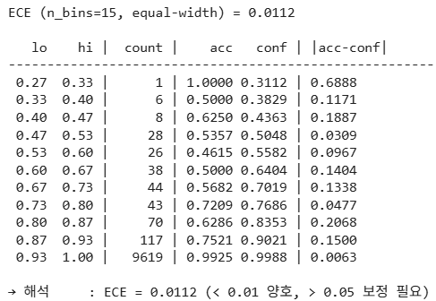

bin 표를 그대로 읽으면 문제가 보인다. 마지막 bin에 10,000개 중 9,619개가 몰려 있고 그 bin의 $|{\rm acc}-{\rm conf}|$ 는 0.0063에 불과하다. 반면 샘플이 한 개뿐인 bin의 차이는 0.6888이다. 가중 평균은 앞의 값에 압도된다.

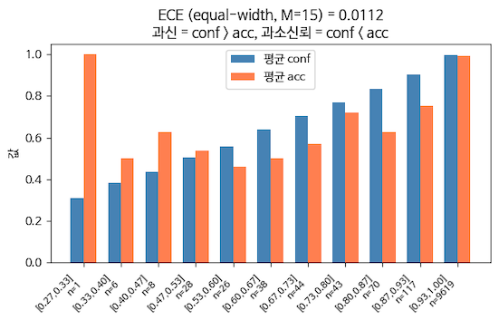

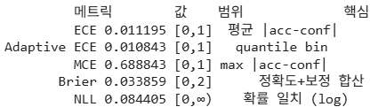

지표를 나란히 놓으면 각각이 무엇을 보는지가 분명해진다. ECE는 평균적인 $|{\rm acc} - {\rm conf}|$ 를, Adaptive ECE는 분위수 기반 bin에서의 같은 값을, MCE는 그 최댓값을 본다. Brier는 정확도와 보정을 합산한 성격이고, NLL은 확률의 일치도를 로그 척도로 본다. 여기서 ECE는 0.011로 매우 작은데 MCE는 0.689로 매우 크다. **평균은 좋아 보이지만 어딘가에 심각하게 어긋난 구간이 있다**는 뜻이다.

**Class-wise ECE**

클래스별 확신도 값을 $n$ 개 영역으로 분할하여 평균 확신도와 정답 비율을 비교한다.

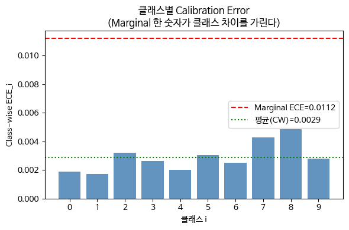

Marginal ECE는 0.0112인데 클래스별 ECE의 평균은 0.0029다. **한 숫자로 요약한 Marginal ECE가 클래스 차이를 가리고 있다**는 뜻이다. 클래스 7과 8이 상대적으로 큰 값을, 클래스 0과 1이 작은 값을 갖는다.

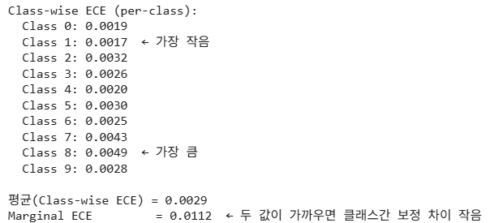

막대가 들쭉날쭉하다는 것은 어떤 클래스는 보정이 약하고 다른 클래스는 충분히 보정되었다는 뜻이다. 임계 도메인에서는 이 수준의 진단이 필요하다. $\Delta_m^k$ 의 부호를 보면 클래스별로 과신인지 과소신뢰인지도 판별할 수 있다.

---

## 5.2.20 Reliability Diagram
<!-- 슬라이드 364 -->

Marginal calibration을 눈으로 확인하는 도구가 **Reliability Diagram**이다. 앞서 정의한 $\Delta_m^k = \mathrm{acc}_k(B_{k,m}) - \mathrm{conf}_k(B_{k,m})$ 를 클래스 $k$ 별로 계산하여 그리면 Class-wise Reliability Diagram이 되고, 클래스를 무시하고 전체로 계산하면 일반 Reliability Diagram이 된다.

그리는 방식은 단순하다. bin별로 확신도와 정확도를 대응시켜, X축에 confidence를, Y축에 accuracy를 놓는다. 완벽하게 보정된 모델이라면 점들이 대각선 위에 놓인다.

### Reliability Diagram의 다섯 가지 형태

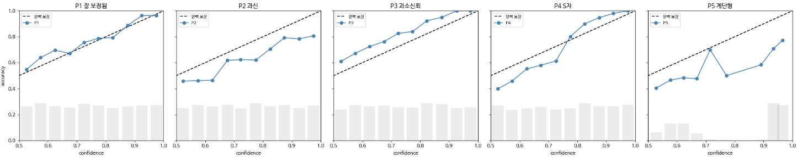

*그림 5-4. Reliability Diagram의 전형 패턴. 점선이 완벽 보정선이고, 회색 막대는 bin별 샘플 수다.*

- **잘 보정됨** — 점들이 대각선을 따라간다.
- **과신** — 확신도 0.9일 때 정확도가 0.7이라면, 점이 **대각선 아래**에 놓인다. 모델이 자기 실력보다 자신 있게 말하는 상태다.
- **과소신뢰** — 점이 **대각선 위**에 놓인다. 모델이 실제보다 겸손하게 말하는 상태다.
- **S형** — 사후 보정이 과도하게 적용된 경우로 가장 흔하다. Temperature Scaling의 $T$ 를 너무 크게 잡으면 저신뢰 구간은 여전히 과신인데 고신뢰 구간은 과소신뢰로 뒤집힌다.
- **계단형** — 특정 확신도 값(예: 0.99 근처)에 샘플이 몰려 있고 다른 구간은 비어 있는 경우다. 모델이 **확신과 비확신 두 모드**를 주로 출력한다는 뜻이며, Label Smoothing이나 Temperature Scaling이 필요하다.

---

## 5.2.21 과신을 눈으로 확인한다
<!-- 슬라이드 365~367 -->

Reliability Diagram의 다섯 패턴 중 실제 MNIST 모델이 어느 것에 해당하는지 확인한다. 여기서 **지표 하나와 그림 하나가 정반대 이야기를 하는 장면**을 만나게 된다.

### 실습 5.2.6 — Reliability Diagram

> 노트북: `code/5.2.6.Reliability_과신원인.ipynb`

**목표** — MNIST 분류 모델을 학습한 뒤 모델의 과신·과소 평가 경향을 시각화하고 해석한다.

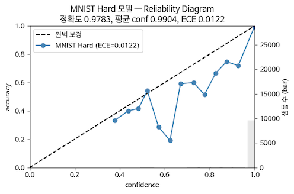

**지표와 그래프의 1차 해석**

- 정확도 97.83%로 매우 우수하다.
- 평균 확신도 99.04%로 매우 자신 있다.
- ECE 0.0122(1.22%)로 잘 보정된 것처럼 보인다.
- 그러나 그래프는 대각선 아래에 있다. **심각한 과신**이다.

지표와 그림이 서로 다른 이야기를 한다. 어느 쪽이 맞는가.

**그래프의 상세 해석**

샘플이 확신도 1.0에 거의 다 몰려 있다. y축의 샘플 수를 보면 확신도가 1.0에 가까운 bin에 테스트 데이터 10,000개가 사실상 전부 들어가 있다. 그리고 그 지점에서는 확신도와 정확도가 거의 동일하다.

문제는 ECE의 계산 방식이다. ECE는 bin별 오차를 **샘플 수로 가중 평균**한다. 가중치가 확신도 1.0인 bin에 쏠려 있으므로, 소수 영역의 심각한 miscalibration이 평균에 묻혀 보이지 않는다. ECE 0.0122라는 숫자는 그렇게 만들어진 것이다.

구간별로 나누어 보면 실제 상태가 드러난다.

- **0.4 ~ 0.5** — 대각선과 거의 일치한다.
- **0.55 ~ 0.85** — 대각선보다 한참 아래에 있다. 간격이 0.1에서 0.4에 이르는 심각한 과신이다.
- **0.6 부근** — 큰 낙차가 발생한다. 정확도가 0.2 수준으로 떨어져 거의 무작위 추측 수준이다.
- **0.95 ~ 1.0** — 대각선 위로 복귀하여 일치한다.

종합하면 이 모델은 **확신할 때만 잘 맞고, 망설일 때는 무작위보다 못 맞히는 모델**이다.

**Class-wise Reliability Diagram**

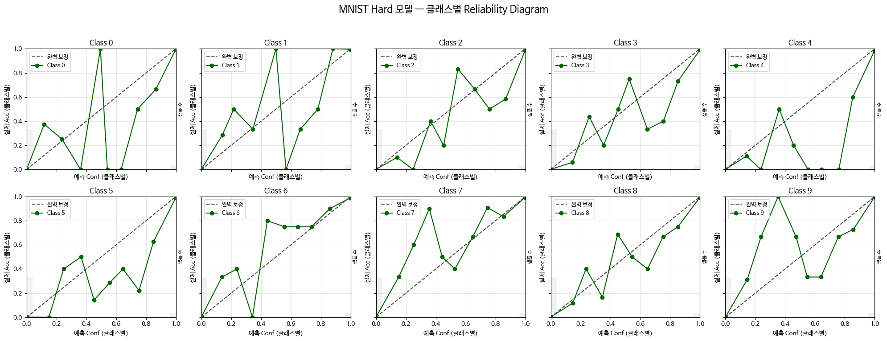

낮은 확신도 구간에서 변동성이 매우 크다. 클래스별로 나누어 읽으면 세 그룹이 보인다.

- **6, 7** — 상대적으로 잘 보정되어 있고 큰 이상치가 없다. MNIST에서 본래 분리력이 좋은 클래스다.
- **2, 3, 8** — 중간 정도로 보정되어 있다. 대각선 주변에서 진동하지만 평균적으로는 따라간다.
- **0, 1, 4, 9** — 고변동·노이즈가 큰 그룹이다. 한 bin이 1이나 0으로 튀는데, 이는 그 bin에 샘플이 한두 개만 있을 가능성을 시사한다.

결과적으로 **중간 신뢰 구간의 진단이 불가능**한 상태다. 대응 방법은 Adaptive ECE를 적용하여 bin별 샘플 수를 균등하게 만드는 것이다.

**Adaptive ECE 적용 비교**

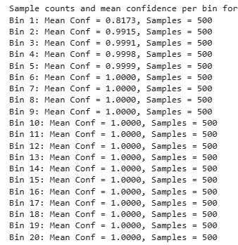

Adaptive 분할은 bin마다 샘플 수를 500개로 맞춘다. 그런데 6번 bin부터 20번 bin까지 평균 확신도가 모두 1.0000이다. 대부분의 확신도 값이 1 부근에 몰려 있음을 다시 확인할 수 있다.

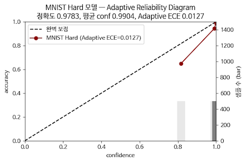

Adaptive 방식의 효과는 결국 **극소수 샘플이 들어 있는 bin을 무시하는 것**이다. 확신도가 한쪽에 몰려 있으면 분위수 기반 분할은 그 밀집 구간만 잘게 나누게 되므로, 희소 구간의 튀는 값이 사라진다.

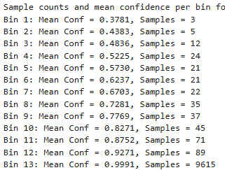

등간격 분할과 비교하면 차이가 분명하다. 등간격에서는 첫 bin에 3개, 두 번째 bin에 5개밖에 없고 마지막 bin 하나에 9,615개가 들어간다. 샘플 서너 개짜리 bin의 정확도는 0 또는 1로 튈 수밖에 없고, 그 값이 Class-wise Reliability Diagram의 이상치로 나타났던 것이다.

---

## 5.2.22 과신의 원인
<!-- 슬라이드 368~369 -->

Reliability Diagram에서 가장 자주 관찰되는 패턴은 과신이다. 딥러닝 모델은 왜 과신하는가. 원인은 네 갈래로 정리된다.

### (원인 1) NLL의 무한 보상 구조

Cross-Entropy 손실은 비선형이다. 확신을 더 키우는 방향으로 **끝없이 보상**한다. 정답 확률이 이미 0.99라도 0.999로 올리면 손실이 더 줄어들기 때문에, 학습이 길어질수록 모델은 logit을 키우고 softmax 출력은 1에 점점 가까워진다.

### (원인 2) 깊은 네트워크의 logit 폭주

softmax 직전 logit $z$ 의 절댓값이 학습이 진행되며 커진다. logit 값의 노름이 $\alpha$ 배 커지면 softmax에서 $T = 1/\alpha$ 를 적용한 것과 같은 효과가 되어 분포가 더 첨예해진다. 따라서 Weight Decay나 Logit Norm 같은 정규화가 필요하다.

### (원인 3) BatchNorm과 Dropout의 부조화

BatchNorm은 학습 시와 추론 시에 서로 다른 통계를 사용하므로 미세하게 어긋난다. Dropout도 추론 시에는 꺼지면서 학습 시의 분포와 다르게 동작한다. 두 효과가 쌓이면 추론 시 logit의 분산이 학습 시보다 커지는 경향이 발생하고, 이것이 과신을 유발한다. 처방은 Weight Decay 강화, Logit Norm(2022), 그리고 사후 Temperature Scaling이다. 이 중 사후 Temperature Scaling이 가장 효율적이다.

### (원인 4) 학습과 검증 분포의 차이

모델은 학습 분포에서 익숙한 패턴으로 강하게 매칭하려 시도한다. 그래서 분포 밖의 샘플에 대해서도 매우 큰 확신도를 출력한다. **모르는 것을 모른다고 표현하지 못하는** 경향이다.

### 그 밖의 원인 — 닫힌 세계 가정과 OOD

Softmax에는 **닫힌 세계 가정(closed-world assumption)** 이 전제되어 있다. Softmax는 입력이 $K$ 개 클래스 중 하나라는 가정 하에 작동하므로, 분포 밖 입력(OOD, Out Of Distribution)에 대해서도 $K$ 개 중 하나에 매칭한다. 그 결과 OOD 입력에 대해 확신도 0.99가 나올 수 있다. 이는 확신이 아니라 **출력 형식이 강제한 결과**다.

따라서 OOD는 별도로 점검해야 한다. Calibration으로는 확인할 수 없다. OOD 검출 시스템을 따로 구축해야 하며, Energy Score, Mahalanobis Distance, MSP(Maximum Softmax Probability) thresholding, ODIN, GradNorm 등이 그 방법이다.

### 네 원인은 서로를 강화한다

네 가지 원인은 독립적이지 않고 서로 강화 작용을 한다. 연쇄는 다음과 같이 이어진다.

원인 1(NLL 압력)이 logit을 계속 키우고 → 원인 2(Logit 폭주)로 softmax가 첨예해지며 → 원인 3(BN/Dropout 괴리)으로 추론 시 평균화가 사라져 극단적인 확신도가 출력되고 → 원인 4(OOD)에서 잘못된 패턴에도 극단적 확신도가 적용된다.

### 실습 5.2.6 — logit 값의 변화 (이어서)

> 노트북: `code/5.2.6.Reliability_과신원인.ipynb`

앞의 네 원인 중 (1)과 (2)는 logit을 직접 뽑아 보면 눈으로 확인된다. softmax 직전 층의 출력을 꺼내 분포를 그린다.

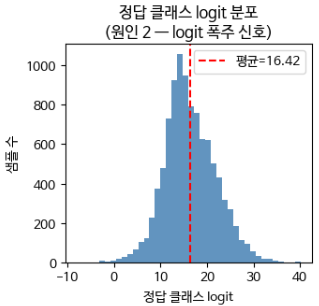

NLL의 무한 보상 구조를 확인한다. 1위 클래스와 2위 클래스의 logit 차이는 평균 14.222다. logit이 14 차이면 확률로는 약 120만 배 차이가 난다. 모델이 정답을 맞히는 것에 만족하지 않고, NLL 오차를 0으로 만들기 위해 **2등과의 격차를 끝없이 벌려 놓은** 것이다.

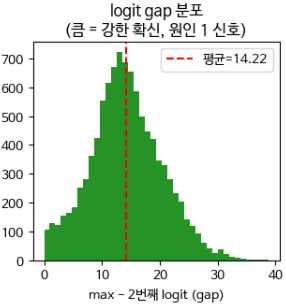

logit 값이 3에서 5 정도만 되어도 90% 이상의 확신도가 나온다. 그런데 정답 클래스 logit의 평균이 16 이상이라는 것은 이 값이 비정상적으로 커졌다는, 즉 **폭주**했다는 의미다.

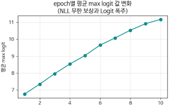

학습이 진행되는 동안 logit 값은 계속 증가한다. 그리고 이 증가는 과적합과 연결된다. logit 값을 키우려면 가중치를 키워야 하고, 가중치의 증가는 과적합으로 이어지기 때문이다.

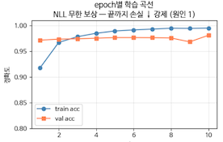

---

## 5.2.23 학습 시 보정과 사후 보정
<!-- 슬라이드 370~371 -->

### 학습 시 보정 vs 사후 보정

보정 방법은 언제 개입하느냐에 따라 두 갈래로 나뉜다.

- **Temperature Scaling** — 사후 보정(post-hoc calibration)이다. 재학습이 필요 없고 **모델 정확도를 보존**한다. logit을 $T$ 로 나누기만 하므로 argmax가 바뀌지 않기 때문이다.
- **Label Smoothing** — 학습 시 보정이다. 정확도가 낮아질 수 있다. 다만 애매한 데이터가 많은 경우에는 오히려 성능이 향상되기도 한다.

Temperature Scaling에서 최적의 $T$ 는 재학습 없이 찾을 수 있다. 학습이 끝난 뒤 테스트 데이터에 대해 softmax 이전 층의 출력, 즉 logit 값을 추출한다. 이 logit을 Temperature-scaled Softmax에 통과시켜 새로운 확신도를 얻는다. 그리고 검증 데이터에서 $T$ 를 $\log 0.5$ 부터 $\log 10$ 까지 그리드 샘플링하여 **NLL을 최소화하는 값**을 찾으면 된다.

### 실습 5.2.7 — 사후 보정

> 노트북: `code/5.2.7.사후보정_Temperature.ipynb`

**목표** — Label Smoothing과 Temperature Scaling을 각각, 그리고 함께 적용하여 보정 효과를 비교한다. 두 가지를 확인한다.

- Label Smoothing은 logit 폭주를 줄여 준다.
- Temperature Scaling은 재학습 없이 최적의 $T$ 값을 찾을 수 있다.

위의 절차를 그대로 코드로 옮긴다. 먼저 두 모델의 logit 범위를 비교하면 Label Smoothing의 효과가 곧바로 드러난다. Hard 모델($\varepsilon = 0.0$)의 검증 logit 최댓값은 $[2.88,\ 38.52]$ 범위에 걸쳐 있는 반면, Label Smoothing 모델($\varepsilon = 0.1$)은 $[0.65,\ 6.33]$ 에 머문다. **Label Smoothing이 logit 폭주를 실제로 억제한다**는 정량적 근거다.

Temperature Scaling 자체는 한 줄이고, 최적 $T$ 는 검증셋 NLL의 argmin으로 찾는다.

```python
def apply_temperature(logits, T):
    z = logits / T
    z = z - z.max(axis=1, keepdims=True)
    e = np.exp(z)
    return e / e.sum(axis=1, keepdims=True)

def temperature_scale(logits_val, y_val, bounds=(0.05, 10.0), n_grid=200):
    Ts = np.exp(np.linspace(np.log(bounds[0]), np.log(bounds[1]), n_grid))
    best_T, best_nll = 1.0, float('inf')
    for T in Ts:
        nll = compute_nll(y_val, apply_temperature(logits_val, T))
        if nll < best_nll:
            best_nll, best_T = nll, float(T)
    return best_T
```

$T$ 는 파라미터가 하나뿐이라 그리드 탐색으로도 안정적으로 찾을 수 있고, logit을 상수로 나누기만 하므로 argmax가 바뀌지 않는다.

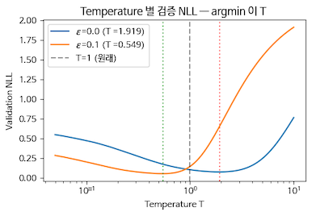

두 곡선의 최적점이 T=1을 기준으로 반대편에 있다는 점이 흥미롭다. Label Smoothing을 쓰지 않은 모델($\varepsilon = 0.0$)은 과신 상태이므로 $T > 1$ 로 분포를 눅여야 하고, Label Smoothing을 강하게 쓴 모델($\varepsilon = 0.1$)은 이미 확신도가 낮아진 상태이므로 오히려 $T < 1$ 로 분포를 다시 세워야 한다.

**Label Smoothing과 Temperature Scaling의 결합 효과**

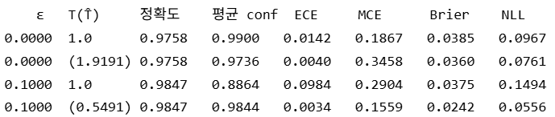

네 조합의 지표를 비교하면 **Label Smoothing과 Temperature Scaling을 함께 적용한 경우**가 가장 좋다. 정확도는 0.9847로 유지되면서 ECE는 0.0142에서 0.0034로, MCE는 0.1867에서 0.1559로, Brier는 0.0385에서 0.0242로, NLL은 0.0967에서 0.0556으로 모두 개선된다. Temperature Scaling이 정확도를 바꾸지 않는다는 성질도 표에서 확인된다. $\varepsilon$ 이 같으면 $T$ 를 바꾸어도 정확도는 그대로다.

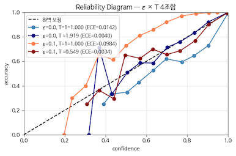

Reliability Diagram으로 비교하면, Temperature Scaling만 사용한 경우도 전체적으로 좋지만 낮은 확신도 구간에서 변동성이 남는다. Label Smoothing과 Temperature Scaling을 함께 쓰면 그 **변동성이 감소**한다.

---

## 5.2.24 심화 과제
<!-- 슬라이드 373~374 -->

### 심화 과제 5-3 — 라벨 표현은 어디까지 풍부해져야 하는가

Hard → Label Smoothing → Confusion-aware → KD로 이어지는 라벨 표현의 스펙트럼에서 어디까지 나아가야 하는가를 묻는 과제다.

**목적**

라벨 표현(Hard, Label Smoothing, Confusion-aware Soft, KD Soft)이 각각 어떤 가정을 받아들이거나 완화하는지 이해하고, 도메인 특성에 따라 적절한 라벨 표현을 선택하는 능력을 기른다.

**상황 설정**

순서형 4단계 분류기(Stage I / II / III / IV)를 학습한 상황이다.

- Hard CE 모델의 결과는 정확도 73%다. 인접 Stage 간 혼동(예: Stage II ↔ III)이 전체 오류의 36%로 가장 크다. 반면 Stage I → Stage IV 같은 비인접 오분류는 3.4%로 작은 편이다.
- 네 가지 라벨 표현을 비교했다.
  - (a) Hard
  - (b) Label Smoothing ($\varepsilon = 0.1$, 균등 분배)
  - (c) Confusion-aware Soft (혼동행렬에서 얻은 유사도 분포로 $\varepsilon$ 을 분배)
  - (d) KD Soft (큰 교사 모델의 softmax 출력을 라벨로 사용)
- 비인접 오분류율은 (a) 3.4%, (b) 2.8%, (c) 0.9%, (d) 1.1%로 측정되었다.

**요구 사항**

1. 네 라벨 표현이 라벨에 대한 어떤 가정(결정성, 클래스 등거리, 라벨 자기신뢰)을 받아들이거나 완화하는지 비교하라.
2. (b) Label Smoothing과 (c) Confusion-aware Soft 사이에서 비인접 오분류율이 크게 줄어든 이유를, $\varepsilon$ 이 분배되는 분포(균등 vs 유사도 기반)의 차이로 설명하라.
3. (d) KD Soft는 수치상 우수하지만 임계 도메인(의료·법률 등)에 그대로 채택하기 어렵다. 그 이유를 두 가지 이상 제시하라.
4. 순서형 라벨 구조를 가진 본 도메인에 (a)~(d) 중 어느 라벨 표현이 적합한지 선택하고 그 근거를 제시하라.

---

### 심화 과제 5-4 — S자 패턴의 원인은 모델인가, 사후 보정인가, 손실 설계인가

**목적**

Reliability Diagram의 다섯 가지 전형 패턴 중 S자(P4) 패턴을 구조적으로 분해해 읽을 수 있게 한다. S자 패턴이 나타나는 여러 원인(Temperature 교정, 비대칭 손실, 출력 floor 등)을 구분해 진단하고 처방을 결정하는 능력을 기른다.

**상황 설정**

12클래스 이미지 분류기(ResNet-50)에서 학습 직후 Reliability Diagram은 P2, 즉 단조 과신 패턴이었고 ECE는 0.14였다.

- 사후 Temperature Scaling을 적용했다.
  - $T = 1.5$ : 거의 P1(잘 보정됨)
  - $T = 2.5$ : S자(P4) 패턴. 저신뢰 구간은 여전히 과신인데, 고신뢰 구간은 과소신뢰로 변형되었다.
- 모델의 특징 — 손실은 Focal Loss($\gamma = 2$)이고, 출력 확률에 $\max(q, 0.5)$ floor를 적용했다.
- 점검 결과 — 학습과 테스트의 분포 차이는 작아 shift 가능성이 낮다. 앙상블은 사용하지 않은 단일 모델이다.

**요구 사항**

1. $T$ 를 최적 값보다 키울 때 Reliability Diagram이 P1에서 S자(P4)로 변형되는 메커니즘을 Temperature Scaling의 작동 방식으로 설명하라.
2. Focal Loss가 단독으로도 S자 패턴을 만들 수 있는 이유를, $(1 - q_c)^\gamma$ 가중이 고신뢰 영역과 저신뢰 영역에 서로 다르게 작용하는 방식으로 설명하라.
3. 출력에 $\max(q, 0.5)$ floor가 적용된다는 사실이 저신뢰 구간의 Reliability Diagram을 어떻게 왜곡하는지 설명하라.
4. 본 상황에서 S자 패턴의 가장 유력한 원인을 하나 선택하고 처방을 제시하라. 주어진 정보는 shift가 낮다는 점, 앙상블을 쓰지 않았다는 점, Focal Loss를 사용했다는 점, floor를 강제했다는 점, 그리고 $T = 2.5$ 라는 점이다.

---

## 5.2.25 정리
<!-- 슬라이드 372 -->

혼동 구조를 다루는 절차 전체를 하나의 흐름으로 정리하면 다음과 같다.

**혼동행렬 → 유사도 행렬 $S$ 변환.** 권장 운용 순서는 Pairwise → Jaccard → KL이다.

- **Pairwise** — 양방향 혼동 비율이다. 직접 혼동을 보며 1차 진단에 적합하다.
- **Jaccard** — 결정 영역의 겹침이다. 두 클래스가 경쟁한 입력 공간의 크기를 본다.
- **KL Divergence** — 오류 분포 패턴의 비교다. 간접 유사성을 포착하며 JS로 대칭화하여 쓴다.

**유사도 행렬 $S$ → 덴드로그램(계층적 군집화).**

- **Ward linkage** — 합칠 때 내부 분산의 증가를 최소화한다. 균일한 크기의 클러스터가 나온다.
- **Complete linkage** — 가장 먼 점 간의 거리를 쓴다. 컴팩트한 클러스터가 나오지만 이상치에 취약하다.
- **Average linkage** — 모든 점 쌍 거리의 평균이다. 가장 균형적이다.

**덴드로그램의 실용적 함의.**

- **계층적 분류기 설계** — 큰 그룹을 먼저 분류한 뒤 세부를 분류하여 정확도와 해석성을 함께 얻는다.
- **Confusion-aware Soft Label** — 덴드로그램의 거리에 비례하는 소프트 라벨을 설계한다.
- **Fine-grained 라벨 체계** — 클래스를 세분할지 합병할지 판단하는 근거가 된다.

**잠재공간 구조와 혼동 덴드로그램의 비교.** 두 구조가 일치하면 표현 학습이 라벨 구조를 발견한 것이고, 불일치하면 잠재공간이 라벨보다 더 많은 정보 또는 더 적은 정보를 담고 있다는 신호다. 별도의 메타데이터 없이 클래스 간의 자연스러운 그룹과 거리 구조를 데이터로부터 추정할 수 있다는 점이 이 접근의 가치다.

**Calibration(신뢰도 보정).** 모델의 출력이 실제와 불일치하면 과신 또는 과소신뢰 상태다.

- **검출** — Reliability Diagram과 ECE(Expected Calibration Error)로 가중 평균 편차를 본다.
- **보정 방법** — Temperature Scaling, Platt Scaling, Isotonic Regression이 있다.

> **정리**
> - 정확도는 정답의 비율이고 혼동행렬은 **오답의 구조**다. 정확도 한 숫자는 어떤 클래스를 어떤 클래스와 헷갈렸는지, 그 헷갈림이 패턴인지 노이즈인지 알려주지 않는다.
> - 혼동행렬은 두 가지로 읽힌다. **평가 도구**로 읽으면 클래스별 성능이 보이고, **데이터 구조 지도**로 읽으면 클래스 사이의 거리가 보인다. 후자의 관점에서 체계적 혼동은 모델의 결함이 아니라 데이터의 신호다.
> - 행 정규화는 Recall을, 열 정규화는 Precision을, 전체 정규화는 결합 확률을 준다. **정규화 방향을 고르는 일은 질문을 고르는 일**이다.
> - 혼동은 대칭성·국소성·일관성·원인의 네 축으로 분류된다. 국소 혼동에는 보조 분류기와 계층적 분류가, 광역 혼동에는 표현 학습의 점검이 필요하다. 라벨 노이즈와 경계 모호성은 잠재공간 분리도·라벨 일관성·비대칭성·에폭별 일관성으로 구분한다.
> - Hard 라벨은 정답의 확실성, 오답의 등거리성, 클래스의 무관성이라는 세 가정을 강제한다. Label Smoothing은 첫 가정만, Confusion-aware Soft와 KD Soft는 나머지 가정까지 완화한다. 라벨을 바꿀 때는 손실 함수도 함께 재설계해야 한다.
> - 혼동행렬에서 유사도 행렬과 덴드로그램을 만들면, 평면적 라벨 체계 뒤에 숨은 **클래스 간 계층 구조**를 별도의 메타데이터 없이 데이터로부터 추정할 수 있다.
> - Softmax 출력은 확률이 아니다. ECE·MCE·Brier·NLL과 Reliability Diagram으로 그 어긋남을 재고, Label Smoothing(학습 시)과 Temperature Scaling(사후)으로 보정한다. Temperature Scaling은 정확도를 보존한다.
> - 과신은 NLL의 무한 보상, logit 폭주, BatchNorm·Dropout의 부조화, 분포 차이가 서로를 강화한 결과다. 그리고 Softmax의 닫힌 세계 가정 때문에 **OOD는 calibration으로 잡히지 않는다.** 별도의 검출 체계가 필요하다.
