# 6.1 피처 가설 (Feature Hypothesis)

**학습 목표**

- Feature를 바라보는 세 가지 관점(객관·도구·가설)을 구분하고, 왜 이 장에서 세 번째 관점을 택하는지 설명할 수 있다.
- 변수 선택·함수 형태·변수 조합이라는 세 차원에서 Feature가 어떤 묵시적 주장을 담고 있는지 형식적으로 기술할 수 있다.
- Feature Engineering을 4축(수동성·도메인 의존성·선형성·해석 가능성)으로 분류하고, Kernel 변환이 어떤 가설을 어떤 가설로 교체하는 도구인지 설명할 수 있다.
- Permutation Importance·SHAP·Mutual Information의 정의와 성질을 비교하고, 세 지표가 서로 다른 순위를 내놓는다는 사실이 무엇을 뜻하는지 해석할 수 있다.
- 딥러닝의 자동 Feature 학습이 가설을 없애는 것이 아니라 아키텍처·손실·데이터로 옮겨 놓는 것임을 논증할 수 있다.
- Feature 선택이 클래스 계층 구조와 사회적 결과까지 좌우함을 설명하고, 실무에서 가설을 명시·검증하는 절차를 제안할 수 있다.

**이 절의 구성**

- 6.1.1 이 절이 겨누는 지점
- 6.1.2 Feature는 객관 속성인가, 가설인가
- 6.1.3 무엇이 가설성을 띠는가: 변수, 함수 형태, 조합
- 6.1.4 Feature Engineering의 4축 분류
- 6.1.5 Kernel 변환: 비선형 가설의 제안
- 6.1.6 같은 데이터, 다른 Feature Set, 다른 결론
- 6.1.7 Feature 중요도의 정량화: Permutation · SHAP · Mutual Information
- 6.1.8 딥러닝의 자동 Feature 학습은 가설이 없는가
- 6.1.9 Feature 선택은 클래스 계층까지 바꾼다
- 6.1.10 Feature 가설의 윤리적 함의
- 6.1.11 누구의 가설인가: Feature 선택의 책임 주체
- 6.1.12 정리

> 실습 번호는 강의 슬라이드의 번호를 그대로 쓴다. 소절 번호와는 무관하다.

---

## 6.1.1 이 절이 겨누는 지점
<!-- 슬라이드 377 -->

5.2에서 우리는 클래스 사이의 유사도와 그 유사도가 만들어 내는 계층 구조를 다루었다. 그런데 그 유사도와 계층 구조 자체가, 데이터를 어떤 Feature로 표현했는지에 종속된다. 즉 데이터 분석의 결론은 언제나 **Feature 선택이라는 가설 위에 서 있다.** 이 절의 목표는 이 문장을 확인하는 것이다.

논의는 네 부분으로 나누어 진행한다.

- **Part A — 가설로서의 Feature: 인식론적 토대.** Feature는 객관적 속성이 아니라 데이터를 바라보는 가설, 곧 렌즈다. 함수 형태로 변수를 정의하는 행위 자체가 이미 가설이다. $x$ 를 쓸지 $x^2$ 을 쓸지 $\log x$ 를 쓸지는 서로 다른 가설을 결정하는 일이다.
- **Part B — Feature 가설의 생성과 변환.** Feature 가설은 4축 분류(수동성, 도메인, 선형성, 해석성)를 따라 다양하게 생성된다. Kernel 변환은 "선형 분리 불가"라는 가설을 "적절한 변환 후에는 선형 분리 가능"이라는 새 가설로 교체하는 도구다. 같은 데이터, 같은 모델이라도 Feature Set이 달라지면 성능과 결론이 달라지며, 이것이 가설 종속성의 증거가 된다.
- **Part C — Feature 가설의 평가.** Feature 중요도는 어떤 metric(Permutation·SHAP·MI)을 쓰느냐에 따라 다른 순위를 보인다. Metric 사이의 불일치 자체가 Feature 가설의 종속성을 드러내는 증거다. 딥러닝의 Feature 학습 역시 가설 없는 발견이 아니라 아키텍처·손실·데이터로 옮겨진 **학습된 가설**이다.
- **Part D — Feature 가설의 함의: 무엇을 좌우하는가.** Feature 가설은 5.2에서 발견한 클래스 계층 구조까지 좌우한다. 가설 없는 발견은 없다. Feature 선택은 데이터 과학자·도메인 전문가·모델·기관이라는 네 주체의 공동 가설이며, 따라서 윤리적 결정이다. 실무에서는 Feature 명세, 대체 Set 비교, Counterfactual 검토를 통해 이 가설을 명시하고 검증해야 한다.

---

**⟨ Part A ⟩ 가설로서의 Feature — 인식론적 토대**

> 핵심 질문은 하나다. Feature는 객관 속성인가, 가설인가?
> Feature는 데이터가 본래 갖고 있는 속성이 아니라 데이터를 바라보는 가설, 곧 렌즈다.
> 함수 형태로 변수를 정의하는 행위 자체가 이미 가설이다.

## 6.1.2 Feature는 객관 속성인가, 가설인가
<!-- 슬라이드 378 -->

### 핵심 질문

데이터 분석을 시작할 때 우리는 자연스럽게 "어떤 변수를 쓸 것인가"를 결정한다. "나이", "소득", "키", "픽셀 강도" 같은 이름을 고르고, 이 변수들을 마치 데이터에 이미 존재하는 객관적 속성인 듯 다룬다. 그러나 한 걸음만 물러서면 질문이 생긴다. 주택 데이터에서 "면적"은 정말 객관적인가? 아니면 "부동산 가치를 결정하는 중요한 차원은 공간의 크기다"라는 **가설**인가?

이 절은 후자의 입장을 검토한다. Feature란 데이터를 어떻게 바라볼 것인가에 관한 우리의 선택, 곧 가설이다. 이 관점에서 보면 Feature Engineering은 데이터에서 변수를 추출하는 기술이 아니라 **세상을 바라보는 관점을 만드는 일**이다.

### 세 가지 관점의 비교

Feature의 정체를 규정하는 방식은 크게 세 가지로 나뉜다. 세 관점을 정리하면 다음과 같다.

| 관점 | Feature의 정체 | 함의 |
|---|---|---|
| 객관(Naive Realism) | 데이터가 본래 가진 측정 가능한 속성 | Feature는 "발견하는 것". 도메인과 무관하며 보편적이다 |
| 도구(Pragmatist) | 예측 성능을 높이기 위한 입력 형태 | Feature는 "선택하는 것". 예측 목표에 종속된다 |
| 가설(Constructivist) | 분석가가 어떻게 보는가에 관한 결정 | Feature는 "제안하는 것". 가설 검증의 대상이다 |

세 관점은 서로 배타적이지 않다. 같은 "면적" 변수에 대해 (1) 측정 가능한 객관적 양이라는 서술과 (2) 가격 예측에 유용한 입력이라는 서술과 (3) 공간의 크기가 가치를 결정한다는 가설이라는 서술이 동시에 성립한다.

우리는 이 가운데 세 번째 관점에 집중하여, Feature 선택이 어떻게 모델과 결론과 해석 모두를 좌우하는지 검토한다. Feature가 가설이라면, 그 가설을 다른 가설로 교체했을 때 같은 데이터에서 다른 결론이 나와야 한다. 이것이 이 절 전체를 관통하는 검증 전략이다.

> **핵심 주장**
> Feature는 발견하는 객관적 속성이 아니라 제안하는 가설이다. 따라서 그 가설을 다른 가설로 교체하면 같은 데이터에서 다른 결론이 나온다.

---

## 6.1.3 무엇이 가설성을 띠는가: 변수, 함수 형태, 조합
<!-- 슬라이드 379~380 -->

### 함수 형태의 선택도 가설이다

Feature가 가설이라고 했을 때, 정확히 무엇이 가설성을 띠는가? 변수 자체의 선택만이 아니다. 같은 변수를 두고 **어떤 함수 형태(transformation)를 쓸지**도 가설이다. "나이"를 쓸지, "나이²"을 쓸지, "log(나이)"를 쓸지에 따라 학습되는 모델이 본질적으로 달라지기 때문이다.

Feature 변환의 일반 형식을 적어 보면 이 점이 분명해진다. 모델 $f$ 를

$$f(x) = g\big(\varphi(x)\big)$$

로 분해한다. 여기서 각 요소의 역할은 다음과 같다.

- $\varphi : \mathbb{R}^d \to \mathbb{R}^{d'}$ — Feature 변환. 새로운 가설의 표현이다.
- $g : \mathbb{R}^{d'} \to \mathbb{R}$ — 변환 후 공간에서 동작하는 함수, 곧 예측 모델이다.

$\varphi$ 를 고정하면 $g$ 가 학습할 수 있는 함수의 가족이 결정된다. 다시 말해 $\varphi$ 는 "이 문제는 어떤 표현으로 풀려야 한다"는 **묵시적 가설**이다. 몇 가지 예를 보면 각 변환이 어떤 주장을 담고 있는지 드러난다.

- $\varphi = \text{identity}$ (원본 그대로) — 원본 변수의 조합만으로 충분하다는 가설.
- $\varphi = \text{polynomial}$ — 비선형 곡선 관계가 중요하다는 가설.
- $\varphi = \log$ — 비율적 효과가 중요하다는 가설.

### 같은 변수, 다른 함수 형태 — 세 가지 가설의 비교

"나이"와 "의료 비용"의 관계를 선형 회귀로 모델링하는 상황을 놓고 $\varphi$ 의 선택이 어떤 가설이 되는지 보자.

- **가설 1** : $\text{cost} = \beta_0 + \beta_1 \cdot \text{age}$ — 나이가 늘면 비용이 $\beta_1$ 만큼 일정하게 증가한다.
- **가설 2** : $\text{cost} = \beta_0 + \beta_1 \cdot \text{age}^2$ — 나이의 제곱적 효과가 있어 고령에서 증가가 가속된다.
- **가설 3** : $\text{cost} = \beta_0 + \beta_1 \cdot \log(\text{age})$ — 비율적 효과가 있어 젊은 시기에 차이가 크고 고령에서는 오히려 둔화된다.

세 모델은 동일한 데이터를 사용하지만, 도출되는 추정 비용의 성격은 매우 다르다. 그리고 어느 가설이 옳은가는 **데이터로 검증할 일이지 Feature 선택만으로 정해질 수 없다.** 그렇다면 검증은 무엇으로 하는가? 이것이 Part C에서 다룰 문제다. 여기서 얻는 결론은 하나다. Feature Engineering은 가설을 명시하고 검증하는 행위다.

### 가설이 만들어지는 세 차원

앞의 예는 단일 변수의 함수 형태만을 다루었지만, 일반적으로 Feature 가설은 세 차원에서 만들어진다.

1. 어떤 원본 변수를 사용할지
2. 그 변수를 어떻게 변환할지
3. 변수들을 어떻게 조합할지(상호작용 항)

각 차원이 어떤 묵시적 주장을 담는지 정리하면 다음과 같다.

| 차원 | 예시 | 묵시적 주장 |
|---|---|---|
| 변수 선택 | {면적} vs {면적, 방수} vs {면적, 방수, 위치} | 어떤 차원이 결과에 중요한가 |
| 함수 형태 | $x,\; x^2,\; \log x,\; \exp(-x)$ | 변수의 영향이 선형·곡선·포화 중 어느 형태인가 |
| 변수 조합 | $x_1,\; x_1 \cdot x_2,\; x_1 / x_2$ | 변수 간 상호작용이 있는가, 있다면 어떤 형태인가 |

"Feature는 가설"이라는 명제는 따라서 다음을 요구한다. 데이터 분석가의 작업, 즉 변수 선택과 변환과 조합이 모두 **검증 가능한 주장**이라는 인식론적 자세를 갖추어야 한다는 것이다. 이어지는 Part B에서는 그런 가설을 어떻게 생성하는지, Part C에서는 어떻게 평가하는지, Part D에서는 그 작업이 어떤 함의를 갖는지 살펴본다.

### 인식론적 자세란 무엇인가

인식론(epistemology)은 지식의 본질·출처·한계·타당성을 탐구하는 분야다. 던지는 질문은 단순하다. 우리는 무엇을, 어떻게, 어디까지 알 수 있는가?

데이터 분석에서 요구되는 인식론적 자세는 네 가지로 정리된다.

- **비판적 성찰** — 정보와 지식의 근거를 따져 본다.
- **불확실성 인정** — 정보와 지식이 완전하지 않을 수 있음을 인식한다.
- **지식의 한계 인식** — 방법론·도구·관점이 세상을 보여주는 방식에 한계가 있음을 인식한다.
- **가정에 대한 의문** — 전제나 가정을 의심하고 검토한다.

이 자세를 받아들이면 결론은 자연스럽게 따라온다. Feature Engineering은 과학적 가설 검증 과정과 같은 구조를 따라야 한다.

---

**⟨ Part B ⟩ Feature 가설의 생성과 변환**

> Feature 가설은 4축 분류(수동성, 도메인, 선형성, 해석성)를 따라 다양하게 생성된다.
> Kernel 변환은 "선형 분리 불가"를 "적절한 변환 후에는 선형 분리 가능"이라는 새 가설로 교체하는 도구다.
> 같은 데이터, 같은 모델이라도 Feature Set이 달라지면 성능과 결론이 다르다. 이것이 가설 종속성의 증거다.

## 6.1.4 Feature Engineering의 4축 분류
<!-- 슬라이드 381~382 -->

### 전통적인 분류에서 4축 분류로

Feature Engineering(FE)을 분류하는 전통적인 방식은 세 갈래였다. 도메인 전문가의 수동 설계(Manual), 통계적 탐색에 기반한 자동화(Automated), 그리고 신경망의 표현 학습(Learned)이다. 이 절에서는 이를 네 개의 축으로 다시 나눈다. 각 축은 서로 독립적이므로, 하나의 Feature는 네 축에서 각각 어느 쪽인지로 위치가 정해진다.

**수동(Manual) vs 자동(Automated/Learned).** 수동 FE는 도메인 전문가가 데이터를 해석하여 변수를 직접 설계하는 방식이다. 해석 가능성과 도메인 적합성이 장점이지만, 결과가 전문가의 가용성에 종속된다는 단점이 있다. 자동 FE는 알고리즘이 데이터에서 잠재적으로 유용한 변수를 발견하고 생성하는 방식이다. Polynomial Feature의 자동 생성, AutoFeat 같은 도구, 그리고 신경망의 은닉층 학습이 여기에 속한다.

**도메인 의존(Domain-Specific) vs 도메인 무관(Domain-Agnostic).** 도메인 의존 변환은 "BMI", "심박변이도"처럼 특정 도메인 안에서만 의미를 갖는 변환이다. 도메인 무관 변환은 제곱항, 로그 변환, PCA처럼 어느 데이터에나 적용할 수 있는 변환이다. 자동화하기는 쉽지만 의미 해석이 약하다는 대가를 치른다.

**선형(Linear) vs 비선형(Nonlinear) 변환.** 선형 변환에는 PCA, 표준화, 단순 가중 평균 등이 있다. 정보 손실은 있지만 해석이 명확하다. 비선형 변환에는 Kernel 변환, 다항식 항, 신경망의 은닉층이 모두 포함되며, 원본에 없던 새로운 차원을 생성한다.

**해석 가능(Interpretable) vs 블랙박스(Black-box).** 해석 가능한 Feature는 변수의 의미와 영향을 사후에 설명할 수 있다. 블랙박스 Feature는 변수 자체의 의미를 해석하기 어렵다. 신경망의 중간층과 잠재 표현이 대표적이며, 이 경우 그 Feature가 유효한지에 대한 답도 모호해진다.

### 4축 조합이 곧 가설 공간

Feature Engineering은 이렇게 네 축(수동성·도메인 의존성·선형성·해석 가능성)으로 분해되는 **도구 계열**이다. 그리고 각 조합은 서로 다른 가설 공간을 탐색한다. 대표적인 조합을 구체적인 Feature와 함께 비교하면 다음과 같다.

| 4축 조합 예시 | 구체적 Feature | 강점 · 약점 |
|---|---|---|
| Manual · 도메인의존 · 비선형 · 해석가능 | BMI = kg / m² | 도메인 적합성과 해석성이 높다 / 전문가의 시간이 든다 |
| Automated · 도메인무관 · 비선형 · 해석가능 | Polynomial(x, degree=3) | 자동 생성이 가능하고 해석도 일부 된다 / 차원이 폭발한다 |
| Automated · 도메인무관 · 선형 · 해석가능 | PCA의 첫 3 주성분 | 차원 축소에 강하다 / 비선형 구조를 포착하지 못한다 |
| Learned · 도메인무관 · 비선형 · 블랙박스 | CNN 마지막 은닉층 활성화 | 성능이 높다 / 해석이 어렵다 |

---

## 6.1.5 Kernel 변환: 비선형 가설의 제안
<!-- 슬라이드 383~385 -->

### 어떤 가설을 어떤 가설로 바꾸는가

Kernel 변환은 4축 분류에서 비선형 가설에 해당하는 중요한 예시다. 그 아이디어는 명확하다. 선형으로 분리할 수 없는 데이터를 고차원 공간으로 매핑하면 선형 분리가 가능해진다는 것이다. 가설의 언어로 옮기면, "이 데이터는 선형 분리가 불가능하다"는 가설을 "**적절한 변환 후에는 선형 모델로 충분하다**"는 가설로 교체하는 시도다.

### Kernel Trick: 고차원 계산의 폭주를 우회한다

문제는 계산이다. 비선형 변환 $\varphi(x)$ 를 명시적으로 계산하면, 고차원 벡터의 차원이 늘어남에 따라 메모리와 계산량이 폭주한다. Kernel Trick은 이 폭주를 우회한다.

$$K(x, x') = \langle \varphi(x),\, \varphi(x') \rangle$$

이 식은 두 점 $x, x'$ 를 $\varphi$ 로 변환한 뒤의 내적을, 명시적인 $\varphi$ 없이 직접 계산하겠다는 뜻이다. 이것이 가능한 이유는 선형 SVM과 회귀의 결정 함수가 보통 **내적의 합**으로 표현되기 때문이다. 즉 $\langle \varphi(x), \varphi(x') \rangle$ 만 알면 충분하다. 따라서 $\varphi$ 가 무한 차원이더라도 $K$ 가 닫힌 형태(closed-form)로 주어지면 계산이 가능하다.

다만 $K$ 가 아무 함수나 될 수는 없다. 두 조건을 만족해야 한다.

- **대칭성** : $K(x, x') = K(x', x)$. 두 점 사이의 유사도는 순서와 무관해야 한다.
- **양의 정부호(positive semi-definite, PSD)** : 고차원 공간의 $\varphi(x)$ 가 실제로 존재함을 보장하는 조건이다.

PSD가 깨지면 Kernel Trick이 성립하지 않는다. 대응되는 $\varphi$ 가 존재하지 않으므로 문제가 볼록(convex)이 아니게 되고, 결과적으로 풀 수 없는 문제가 된다.

### Kernel Family

대표적인 커널은 세 가지다.

**Polynomial Kernel**

$$K_{\text{poly}}(x, x') = \left(x^\top x' + c\right)^d$$

여기서 $d$ 는 다항식의 차수이고 $c$ 는 1차 항과 고차 항의 가중치를 조절하는 상수다. $d=2$ 로 두면 모든 2차 항을 자동으로 생성하는 셈이 된다.

**Radial Basis Function (RBF, Gaussian) Kernel**

$$K_{\text{rbf}}(x, x') = \exp\left(-\gamma \lVert x - x' \rVert^2\right)$$

SVM은 이 RBF 공간에서 두 클래스를 나누는 초평면(hyperplane) 가운데 마진이 최대인 것을 찾는다. $\gamma$ 는 가우시안 폭의 역수이므로, $\gamma$ 가 크면 한 점의 영향이 좁은 영역에 머물고 $\gamma$ 가 작으면 영향이 전 영역으로 퍼진다.

**Sigmoid Kernel**

$$K_{\text{sig}}(x, x') = \tanh\left(\alpha\, x^\top x' + \beta\right)$$

이 커널은 신경망의 한 은닉층과 등가이며, 역사적으로 신경망과 SVM을 이어 준 연결고리였다. 여기 쓰인 $\tanh$ 는

$$\tanh(t) = 2\sigma(2t) - 1$$

로 sigmoid의 출력 영역을 $(-1, +1)$ 로 확장한 것이므로 역사적으로 sigmoid 계열로 분류한다.

### XOR 문제: Kernel이 가설을 어떻게 바꾸는가

Kernel이 가설을 교체한다는 말의 뜻은 XOR 데이터에서 가장 선명하게 드러난다. $x_1 > 0.5$ 와 $x_2 > 0.5$ 의 배타적 논리합으로 레이블을 정의한 XOR 데이터는 2차원 공간에서 선형 분리가 불가능하다. 즉 "선형 분리 가능"이라는 가설로는 이 문제를 풀 수 없다.

그런데 변환

$$\varphi(x) = (x_1,\; x_2,\; x_1 \cdot x_2)$$

로 3차원으로 확장하면, 새로 생긴 차원 $x_1 x_2$ 가 두 클래스를 가르는 분리 신호가 된다. Polynomial Kernel을 $d = 2,\, c = 1$ 로 두면 포함되는 항이 $x_1^2,\, x_2^2,\, x_1 x_2,\, x_1,\, x_2,\, 1$ 이므로 이 문제를 해결할 수 있다. RBF Kernel로 무한 차원 공간에 매핑하는 경우에도, 충분히 큰 $\gamma$ 를 잡으면 분리가 가능하다.

### 실습 6.1.3 — Kernel과 XOR

> 노트북: `code/6.1.3.Kernel_XOR.ipynb`

XOR 데이터에서 Feature 가설의 교체가 결정 경계를 어떻게 바꾸는지 직접 확인한다. 먼저 네 사분면에 균등하게 분포하는 XOR 데이터를 만든다. (0,0)·(1,1) 쪽이 클래스 0, (0,1)·(1,0) 쪽이 클래스 1이다.

```python
def generate_xor_data(n_samples=400, seed=42, noise=0.08):
    """XOR 데이터 — 4 사분면 균등 분포 + 약간의 노이즈."""
    rng = np.random.default_rng(seed)
    n_quad = n_samples // 4
    centers = np.array([[0.25, 0.25], [0.75, 0.75], [0.25, 0.75], [0.75, 0.25]])
    labels = np.array([0, 0, 1, 1])
    X_list, y_list = [], []
    for c, lab in zip(centers, labels):
        X_q = rng.normal(c, noise, size=(n_quad, 2))
        X_list.append(X_q); y_list.append(np.full(n_quad, lab))
    X = np.concatenate(X_list); y = np.concatenate(y_list)
    perm = rng.permutation(len(y))
    return X[perm], y[perm]

X, y = generate_xor_data(n_samples=400, seed=SEED)
```

같은 SVM 계열 분류기를 쓰면서 Feature 가설만 네 가지로 바꾼다. 선형 커널, 교차항 $x_1 x_2$ 를 추가하는 파이프라인, 2차 다항 커널, 그리고 $\gamma = 10$ 의 RBF 커널이다.

```python
from sklearn.pipeline import Pipeline
from sklearn.preprocessing import FunctionTransformer
from sklearn.svm import SVC  # SVM Classifier

def add_cross_term(X):  # x1 * x2 교차항 특성 추가
    return np.c_[X, X[:, 0] * X[:, 1]]

models = {
    'Linear':          SVC(kernel='linear', random_state=SEED),
    'Linear + x₁x₂':   Pipeline([('add_feat', FunctionTransformer(add_cross_term)),
                                 ('svm', SVC(kernel='linear', random_state=SEED))]),
    'Polynomial(d=2)': SVC(kernel='poly', degree=2, coef0=1, random_state=SEED),
    'RBF(γ=10)':       SVC(kernel='rbf', gamma=10, random_state=SEED), }

for name, m in models.items():
    m.fit(X, y)
    print(f"  {name:18s} 정확도 = {m.score(X, y):.4f}")
```

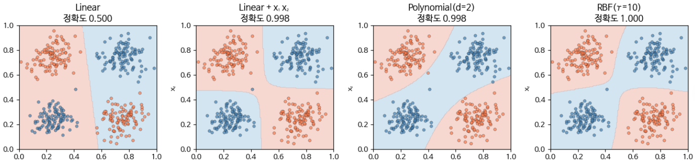

*그림 6-1. 같은 데이터, 다른 Feature 가설. 선형 모델의 실패는 모델의 실패가 아니라 "원본 좌표로 충분하다"는 가설의 실패다.*

확인할 지점은 두 가지다. 첫째, 선형 커널의 정확도가 0.5에 머무는 것은 모델의 한계가 아니라 "원본 좌표로 충분하다"는 가설의 한계라는 점이다. 둘째, 교차항 하나를 추가한 것만으로 정확도가 0.998까지 오른다는 점이다.

이 원리는 XOR에만 국한되지 않는다. 모든 비선형 분류 문제에서 같은 원리가 작동한다. 그러므로 **Kernel의 선택은 "이 문제는 어떤 비선형 구조를 가진다"는 가설의 명시적 제안**이다.

### RBF Kernel은 무한 차원의 Polynomial Kernel이다

RBF Kernel이 무한 차원 매핑이라는 말은 비유가 아니다. RBF는 Polynomial Kernel을 무한 차원으로 확장한 것이며, 모든 Polynomial Kernel의 가중 합으로 분해된다. 지수를 분리해 보면

$$K_{\text{rbf}}(x, x') = \exp\left(-\gamma \lVert x - x' \rVert^2\right) = \exp\left(-\gamma \lVert x \rVert^2\right)\cdot \exp\left(-\gamma \lVert x' \rVert^2\right)\cdot \exp\left(2\gamma\, x^\top x'\right)$$

가 되고, 마지막 항을 급수로 전개하면

$$\exp\left(2\gamma\, x^\top x'\right) = \sum_{k=0}^{\infty} \frac{(2\gamma)^k}{k!} \left(x^\top x'\right)^k$$

가 된다. 즉 $k$ 차 다항식 커널 $\left(x^\top x'\right)^k$ 이 계수 $\dfrac{(2\gamma)^k}{k!}$ 로 가중되어 모두 더해진 형태다. 이 계수가 곧 **Polynomial 가중치**이며, 고차항을 얼마나 반영할지를 $\gamma$ 가 결정한다는 뜻이다.

이어서 실습 6.1.3에서는 RBF의 $\gamma$ 를 0.5, 5, 50, 500으로 바꾸어 가며 결정 경계가 어떻게 국소화되는지 관찰한다.

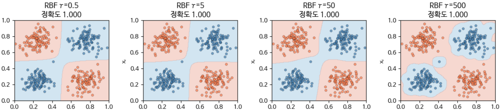

*그림 6-2. γ는 고차항의 가중치를 조절한다. γ가 작으면 완만한 경계, γ가 크면 국소적으로 복잡한 경계가 만들어진다.*

---

## 6.1.6 같은 데이터, 다른 Feature Set, 다른 결론
<!-- 슬라이드 386~388 -->

### 비교의 설계

Feature가 가설이라는 주장을 검증하려면, 같은 데이터에 다른 Feature Set을 적용했을 때 결론(성능·중요도·해석)이 어떻게 달라지는지를 직접 비교해야 한다. 여기서는 주택 가격 예측을 위한 합성 데이터를 놓고 세 가지 Feature Set의 결과를 비교한다. 모델은 Random Forest 회귀로 고정하고, 검증은 5-fold cross-validation으로 통일한다. 즉 **모델과 검증 절차를 고정하고 Feature 가설만 바꾼다.**

세 Feature Set이 담고 있는 묵시적 가설은 다음과 같다.

| Feature Set | 구성 | 묵시적 가설 |
|---|---|---|
| Original | 면적, 방수, 위치지수 (원본 3개) | 원본 변수 조합만으로 충분히 예측 가능하다 |
| Engineered | Original + 면적/방수 비율 + 위치² + log(면적) | 비선형 항과 상호작용 항이 가격을 좌우한다 |
| Reduced | PCA 첫 2 주성분 | 주된 변동 방향 2개로 가격을 설명할 수 있다 |

실제 구현에서 Engineered Set은 원본 세 변수에 `area/rooms`, `location²`, `log(area)`, 그리고 `area × location` 상호작용 항까지 더한 7차원이고, Reduced Set은 표준화 후 PCA로 뽑은 2개의 변동 방향이다.

### 실습 6.1.4 — Feature Set 비교

> 노트북: `code/6.1.4.세_FeatureSet_비교.ipynb`

- **Dataset** : `area`, `location`, `rooms` → `price`
- **Model** : Random Forest 회귀
- **검증** : K-fold cross-validation (5-fold)

먼저 원본 변수와 타깃의 관계를 눈으로 확인한다.

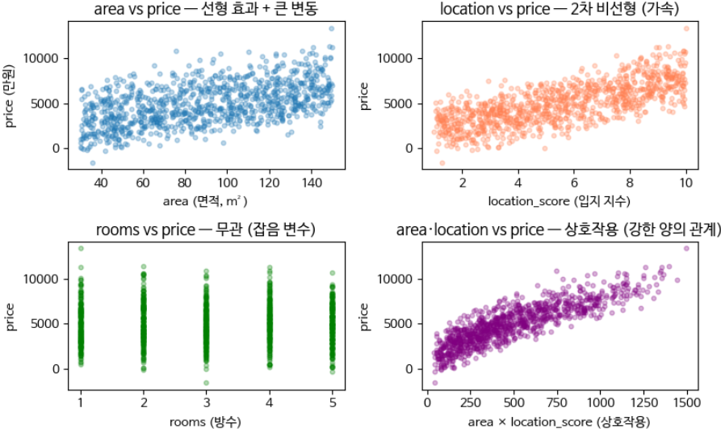

*그림 6-3. 원본 변수와 가격의 관계. `rooms` 는 사실상 잡음이고, 비선형 효과와 상호작용 효과가 눈으로도 확인된다.*

세 Feature Set은 다음과 같이 구성한다. Engineered Set(FE A)은 원본에 `area/rooms`, `location²`, `log(area)`, `area × location` 을 더하고, Reduced Set(FE B)은 표준화 후 PCA로 변동 방향 2개만 남긴다. "변동 방향 2개로 충분한가?"를 묻는 가설이다.

```python
def make_feature_sets(X, y, seed=SEED):
    """3가지 Feature Set 생성."""
    X_orig = X[['area', 'rooms', 'location_score']].values.astype(float)
    orig_names = ['area', 'rooms', 'location_score']

    # Engineered — 비선형 + 상호작용 항 추가
    eng = X.copy()
    eng['area_per_rooms'] = eng['area'] / np.maximum(eng['rooms'], 1)
    eng['location_sq'] = eng['location_score'] ** 2
    eng['log_area'] = np.log(eng['area'])
    eng['area_x_location'] = eng['area'] * eng['location_score']
    eng_names = ['area', 'rooms', 'location_score',
                 'area_per_rooms', 'location_sq', 'log_area', 'area_x_location']
    X_eng = eng[eng_names].values

    # Reduced — 표준화 후 PCA 2 차원
    scaler = StandardScaler()
    X_orig_scaled = scaler.fit_transform(X_orig)
    pca = PCA(n_components=2, random_state=seed)
    X_red = pca.fit_transform(X_orig_scaled)
    red_names = ['PC1', 'PC2']

    return {
        'Original (3-dim)': (X_orig, orig_names),
        'Engineered (7-dim)': (X_eng, eng_names),
        'Reduced (PCA 2-dim)': (X_red, red_names),
    }, pca
```

세 Set 모두 같은 Random Forest 회귀 모델과 같은 5-fold 분할로 평가한다.

```python
model = RandomForestRegressor(n_estimators=100, random_state=seed, n_jobs=-1)
r2_scores = cross_val_score(model, X_set, y, cv=kf, scoring='r2', n_jobs=1)
rmse_scores = -cross_val_score(model, X_set, y, cv=kf,
                               scoring='neg_root_mean_squared_error', n_jobs=1)
```

### 결과: 25.7%p의 성능 차이

5-fold cross-validation으로 일반화 성능을 추정한 결과는 다음과 같다.

| Feature Set | 테스트 R² | 테스트 RMSE | 관측 |
|---|---|---|---|
| Original (3-dim) | 0.7701 | 1071 | 기본 성능 |
| Engineered (7-dim) | 0.7722 | 1063 | 비선형 항이 위치–면적 상호작용을 포착한다 |
| Reduced (2-dim PCA) | 0.5155 | 1558 | 차원 축소 과정에서 일부 정보가 손실된다 |

가장 좋은 Set과 가장 나쁜 Set 사이의 R² 차이는

$$\max R^2 - \min R^2 = 0.2567 \;(\text{25.7\%p})$$

에 이른다.

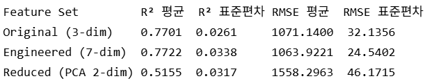

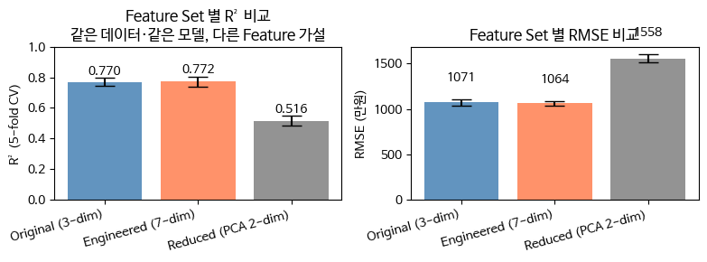

*그림 6-4. 같은 원시 데이터, 같은 모델, 같은 검증 방식. 달라진 것은 Feature 가설 하나뿐이다.*

### 해석

결과의 의미는 분명하다. 같은 원시 데이터와 같은 모델, 같은 검증 방식을 사용하더라도 Feature가 달라지면 **성능도 달라지고 중요도 순위도 달라진다.** 데이터를 어떻게 보느냐(FE)가 결론을 바꾼 것이다.

이것은 "Feature는 결론을 좌우하는 가설"이라는 주장의 정량적 입증이다. 표준편차가 0.03 안팎인 상황에서 0.2567의 격차가 났다는 사실은, 이 차이가 실험적 잡음이 아니라 가설의 차이에서 온 것임을 말해 준다.

---

**⟨ Part C ⟩ Feature 가설의 평가**

> Part B에서 만든 Feature 가설들을 어떻게 정량적으로 비교할 것인가?
> Permutation Importance · SHAP · Mutual Information 세 가지 중요도 metric을 비교한다.
> 그리고 딥러닝에서 Feature를 학습하는 것이 "가설 없는 Feature"라는 통념을 비판적으로 검토한다.

## 6.1.7 Feature 중요도의 정량화: Permutation · SHAP · Mutual Information
<!-- 슬라이드 389~393 -->

### 평가의 문제

Feature 가설을 만들었으면 그 Feature가 예측에 얼마나 기여하는지를 정량화해야 한다. 그것이 가설 검증의 최소 조건이다.

### Permutation Importance: 모델 기반 변동성 측정

Permutation Importance(PI)의 발상은 단순하다. 어떤 Feature를 무작위로 섞어서 그 Feature의 정보가 모델 입력에서 사라지게 만든 뒤, 성능이 얼마나 변하는지를 본다.

$$PI(j) = \mathbb{E}\left[L\left(y,\, f(x_{\text{perm}_j})\right)\right] - \mathbb{E}\left[L\left(y,\, f(x)\right)\right]$$

여기서 $x_{\text{perm}_j}$ 는 데이터셋의 $j$ 번째 Feature 열만 무작위로 섞은 입력이고, $L$ 은 손실 함수(MSE, NLL 등)다.

해석은 다음과 같다.

- $PI(j) > 0$ : $j$ 번째 Feature를 섞었더니 성능이 하락했다. 곧 $j$ 는 중요하다.
- $PI(j) \approx 0$ : 섞어도 영향이 없다. 곧 $j$ 는 모델의 예측에 기여하지 않는다.

주의할 점은 PI가 **모델과 데이터와 손실함수에 종속적**이라는 사실이다. 같은 Feature라도 다른 모델에서는 다른 PI 값을 갖는다. 장점은 어떤 모델에도 적용할 수 있고 해석이 직관적이라는 것이며, 단점은 Feature 사이의 상관관계를 무시한다는 것과 계산 비용이 든다는 것이다.

### 실습 6.1.5 — Feature 중요도 평가

> 노트북: `code/6.1.5.중요도_3메트릭.ipynb`

- **Dataset** : 실습 6.1.4와 동일한 주택 가격 합성 데이터 (`area`, `location`, `rooms` → `price`)
- **Model** : Random Forest Regressor
- **대상 Feature Set** : Engineered Set 7개 Feature

세 지표를 같은 모델·같은 데이터 위에서 계산하여 순위가 일치하는지 확인하는 것이 이 실습의 목적이다. 먼저 Permutation Importance를 $R = 30$ 회 반복으로 구하고, 표본 표준편차에서 표준오차 $SE = \sigma/\sqrt{R}$ 를 얻는다.

```python
from sklearn.inspection import permutation_importance
# R=30 반복 + 표준오차
R = 30
perm_result = permutation_importance(model, X_test, y_test, n_repeats=R,
                                     random_state=SEED, n_jobs=-1, scoring='r2')

pi_mean = perm_result.importances_mean    # (d,)
pi_std = perm_result.importances_std      # (d,) — 표본 표준편차
pi_se = pi_std / np.sqrt(R)               # 표준오차
```

Engineered Set 7개 Feature에 대한 결과를 보면, 상호작용 항 `area*location` 이 압도적으로 큰 값을 가진다.

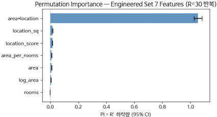

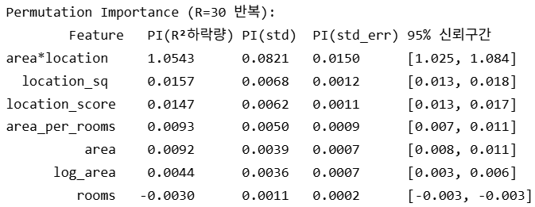

1위와 2위의 PI 차이는 1.0386이고 결합 표준오차(SE)는 0.0150이다. 차이가 $2 \cdot SE$ 보다 훨씬 크므로 이 순위는 통계적으로 의미가 있다고 판단할 수 있다.

### SHAP: 게임 이론에 기반한 기여도 분해

SHAP(SHapley Additive exPlanations)은 협력 게임 이론(Cooperative Game Theory)의 Shapley 값을 기계학습에 적용한 것이다. 핵심 성질은 **하나의 예측을 각 Feature의 기여도 합으로 정확히 분해할 수 있다**는 점이다.

Feature $j$ 의 기여도는 $j$ 가 포함될 수 있는 모든 부분집합에 대해, 그 부분집합에 $j$ 를 추가했을 때 예측이 얼마나 변하는지를 평균한 값으로 정의된다. 이 정의는 효율성·대칭성·null player·선형성이라는 네 가지 공리를 만족하는 **유일한 분해**라는 점에서 이론적 근거가 강하다.

PI와의 차이는 관측의 단위에 있다. PI는 데이터셋 전체에 대한 평균, 즉 global 지표다. SHAP은 개별 예측을 분해하는 local 지표이며, 이를 평균하면 global 중요도가 된다. 성질 자체는 PI와 유사하지만 Feature 사이의 상관관계가 더 정교하게 처리된다.

정확한 SHAP 계산은 $2^d$ 개의 부분집합을 모두 평가해야 하므로 현실적이지 않다. 실습 6.1.5에서는 `TreeExplainer` 를 쓰되 테스트 샘플 200개를 무작위 추출하여 근사한다.

```python
import shap
explainer = shap.TreeExplainer(model)
# 테스트 샘플 일부 (시간 절약)
sample_size = min(200, len(X_test))
rng = np.random.default_rng(SEED)
idx = rng.choice(len(X_test), size=sample_size, replace=False)
shap_vals = explainer.shap_values(X_test[idx])
shap_values_mean = np.abs(shap_vals).mean(axis=0)   # mean |SHAP|
```

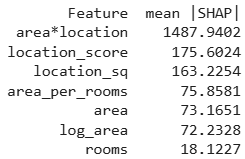

### Mutual Information: 정보이론적 종속성

상호정보량(Mutual Information, MI)은 모델을 거치지 않고 데이터의 분포만으로 계산하는 지표다.

$$I(X_j; Y) = \sum_{x, y} p(x, y)\,\log\!\left(\frac{p(x, y)}{p(x)\, p(y)}\right)$$

여기서 $X_j$ 는 $j$ 번째 Feature이고 $Y$ 는 타깃 변수다. 해석은 다음과 같다.

- $I = 0$ : $X_j$ 와 $Y$ 가 독립이다. 두 변수는 정보를 공유하지 않는다.
- $I > 0$ : $X_j$ 가 $Y$ 에 관한 정보를 많이 갖고 있다.

MI는 모델과 무관하게 데이터 분포만으로 계산되며, 비선형 종속성까지 포착한다는 장점이 있다. 반면 연속 변수에서는 확률 추정이 어렵고, 다변량 상호작용을 보지 못한다는 단점이 있다. 실습 6.1.5에서는 학습 데이터만으로 계산한다.

```python
from sklearn.feature_selection import mutual_info_regression
# Mutual Information — 학습 데이터로 계산
mi_scores = mutual_info_regression(X_train, y_train, random_state=SEED)
```

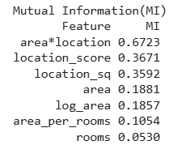

### 세 metric은 같은 답을 내놓는가

세 지표는 단위가 다르므로 각각의 최댓값이 1이 되도록 정규화한 뒤 순위를 나란히 놓는다.

```python
# 세 메트릭 정규화 (max=1) 후 한 표
comp = pd.DataFrame({
    'Feature': feature_names,
    'PI (정규화)': pi_mean / pi_mean.max(),
    'SHAP (정규화)': shap_values_mean / shap_values_mean.max(),
    'MI (정규화)': mi_scores / mi_scores.max(),
})
comp['PI 순위'] = comp['PI (정규화)'].rank(ascending=False).astype(int)
comp['SHAP 순위'] = comp['SHAP (정규화)'].rank(ascending=False).astype(int)
comp['MI 순위'] = comp['MI (정규화)'].rank(ascending=False).astype(int)
```

이렇게 놓고 보면 순위가 서로 어긋난다는 사실이 드러난다.

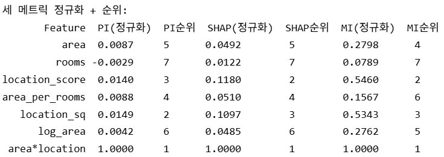

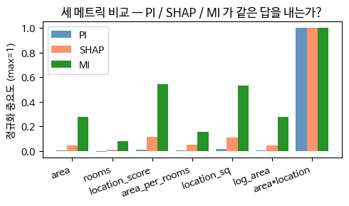

*그림 6-5. 세 metric의 불일치. 무엇을 "중요하다"고 부를 것인지조차 metric이라는 가설에 종속된다.*

세 지표를 실무에서 쓰는 방식은 목적에 따라 갈린다.

- **Mutual Information** — 학습 이전 단계에서 Feature를 필터링할 때 쓴다.
- **Permutation Importance** — 학습된 모델의 global 중요도를 확인할 때 쓴다.
- **SHAP** — 임상이나 법률처럼 개별 예측에 대한 설명이 중요한 도메인에서 세부 특성을 확인할 때 쓴다.

세 metric의 성질을 정리하면 다음과 같다.

| 메트릭 | 모델 의존 여부 | Local vs Global | 강점 | 약점 |
|---|---|---|---|---|
| Permutation | Yes (학습된 모델 필요) | Global | 직관적이며 모델 종류를 가리지 않는다 | Feature 간 상관을 무시한다 |
| SHAP | Yes (예측마다 계산) | Local + Global 모두 가능 | 이론적으로 엄밀하고 개별 예측을 설명한다 | 계산 비용이 크고 근사가 필요하다 |
| Mutual Info | No (데이터만으로 계산) | Global | 비선형 종속성을 포착하고 모델과 무관하다 | 다변량 상호작용을 보지 못한다 |

> **핵심 메시지**
> 세 metric은 종종 서로 다른 순위를 내놓는다. 이 불일치는 측정의 결함이 아니라, Feature 중요도라는 개념 자체가 metric이라는 또 하나의 가설에 종속되어 있다는 신호다.

---

## 6.1.8 딥러닝의 자동 Feature 학습은 가설이 없는가
<!-- 슬라이드 394~395 -->

> 관련 노트북: `code/6.1.7.학습된_Feature_AE.ipynb`

### 자동 Feature 학습이라는 기대

Feature가 가설이라면, 그 가설을 데이터 자체가 "발견"하게 할 수는 없을까? 이 물음에 대한 응답이 딥러닝의 자동 Feature 학습이다. CNN의 convolution layer, AE의 잠재 표현, Transformer의 attention이 모두 여기에 해당하며, 이들은 수동 Feature Engineering으로부터의 자유를 표방한다. 그런데 정말로 가설이 사라진 것인가?

### 신경망의 각 층은 학습된 Feature다

심층 신경망(Deep Neural Network, DNN)은 입력 $x$ 에 여러 층의 변환을 가한 뒤 예측을 출력한다. 그리고 **신경망의 모든 층의 출력은 그 자체로 학습된 Feature**다.

$$f_\theta(x) = g_L\big(g_{L-1}(\cdots g_1(x) \cdots)\big) = g_L(h_{L-1})$$

- $h_L = g_L(h_{L-1})$ : $L$ 번째 층의 표현, 곧 학습된 Feature다.
- $\theta = \{W_1, b_1, \ldots, W_L, b_L\}$ : 학습 파라미터다.

여기서 마지막 은닉층의 표현

$$h_{L-1} = \varphi_\theta(x)$$

가 바로 학습된 Feature 표현이다. 이것은 수동 Feature Engineering에서의 $\varphi(x)$ 와 **정확히 같은 자리**를 차지한다. 다만 사람이 손으로 정한 것이 아니라 손실과 데이터와 구조가 학습을 통해 결정한 비선형 다항식일 뿐이다. AE의 잠재 표현도 같은 종류다. 레이블 없이 학습된다는 점만 다르다.

결론은 이렇게 정리된다. 자동 학습은 $\varphi$ 가 없는 것이 아니라 **$\varphi$ 를 데이터로부터 학습하는 것**이다.

### 가설 없는 Feature는 가능한가

딥러닝 학습이 수동 Feature Engineering으로부터의 자유라는 주장은 부분적으로만 참이다. 왜 부분적인가를 세 지점에서 확인할 수 있다.

**1. 모델 아키텍처가 가설이다.** 아키텍처는 "어떤 구조의 추상화가 필요한가"에 대한 답이다.

- Convolution — 위치 불변성과 국소성이 있다는 가설.
- Transformer — 멀리 떨어진 토큰 사이에 의존성이 있다는 가설.
- AE — 데이터를 저차원 표현으로 압축할 수 있다는 가설.

같은 데이터에 다른 아키텍처를 적용하면 다른 Feature가 학습된다.

**2. 손실 함수가 가설이다.** 손실 함수는 "무엇을 맞추는 것이 목표인가"에 대한 답이다.

- MSE는 평균에 의존한다.
- Cross-Entropy는 레이블이 범주형이라고 전제한다.
- MDN은 출력 분포가 혼합이라는 가설을 담는다.

손실을 바꾸면 학습된 Feature 자체가 달라진다.

**3. 데이터 큐레이션이 가설이다.** 데이터 구성은 "어떤 데이터가 필요한가"에 대한 답이다. 어떤 샘플을 학습에 포함할지, 어떤 레이블을 사용할지, 어떤 augmentation을 적용할지가 모두 여기에 속한다. ImageNet에서 학습한 Feature는 ImageNet의 편향을 그대로 흡수한다.

> **핵심 주장**
> 딥러닝은 Feature 가설을 없애는 것이 아니라, 아키텍처·손실·데이터를 통해 더 깊은 층으로 옮겨 놓는 것이다.

AE의 잠재 표현 역시 레이블 없이 학습된 Feature일 뿐, 가설 없이 학습된 Feature는 아니다. 이 관점에서 보면 모델을 튜닝한다는 것은 곧 **가설을 튜닝하는 일**이다.

---

**⟨ Part D ⟩ Feature 가설의 함의 — 무엇을 좌우하는가**

> MNIST의 클래스 계층 구조가 Feature의 종류(픽셀, edge, 학습된 표현)에 따라 달라짐을 확인한다.
> 그리고 Feature 선택의 책임 주체(데이터 과학자·도메인 전문가·모델·기관)가 지는 윤리적 책임을 정리한다.

## 6.1.9 Feature 선택은 클래스 계층까지 바꾼다
<!-- 슬라이드 396~399 -->

### 종속성은 성능에만 국한되지 않는다

Feature 가설의 종속성은 모델 성능에만 나타나는 것이 아니다. 클래스 사이의 유사도 구조조차 Feature 선택에 종속된다.

5.2에서 우리는 MNIST의 혼동행렬로부터 클래스 간 Pairwise Confusion 점수를 추출하고, 그 점수를 이용해 {4, 9}, {3, 8}, {1, 7} 같은 "형태 그룹"이 자연스럽게 묶이는 덴드로그램을 얻었다. 그리고 이를 "레이블에는 없던 형태 공간을 데이터로부터 발견한 것"이라고 해석했다. 이것이 그 논의의 핵심 통찰이었다.

그러나 그 "발견된 형태 공간"은 사실 우리가 입력 Feature로 **픽셀 강도를 선택한 결과**다. 같은 MNIST에 다른 Feature 표현을 적용하여 학습하면, 다른 혼동 패턴이 생기고 다른 덴드로그램이 만들어진다.

### Pairwise Confusion의 Feature 종속성

이 점을 식으로 쓰면 종속성이 명시적으로 드러난다.

$$\mathrm{Confusion}(i, j;\, \varphi) = \frac{C_\varphi[i, j] + C_\varphi[j, i]}{C_\varphi[i, i] + C_\varphi[j, j] + C_\varphi[i, j] + C_\varphi[j, i]}$$

여기서 $C_\varphi$ 는 Feature 변환 $\varphi$ 로 학습된 모델 $f_\varphi = g(\varphi(x))$ 의 혼동행렬이다. 5.2의 논의에서는 $\varphi = \text{identity}$ (픽셀 그대로)를 암묵적으로 가정하고 있었다. 다른 $\varphi$ 를 쓰면 다른 $C_\varphi$ 가 나오고, 따라서 다른 $\mathrm{Confusion}(i, j)$ 가 나오며, 결국 다른 덴드로그램이 만들어진다.

> **핵심 주장**
> Confusion Matrix가 그려 내는 "형태 공간"은 $\varphi$ 에 종속된다.

### 세 가지 표현으로 확인한다

이 주장을 확인하기 위해 MNIST를 세 가지 표현으로 분류하고 각각의 혼동행렬에서 덴드로그램을 얻는다.

- **Pixel** — 이미지를 flatten하여 784개의 픽셀을 그대로 Random Forest Classifier에 넣는다.
- **HOG** — Histogram of Oriented Gradients로 얻은 특징을 같은 분류기에 넣는다. HOG는 7×7 픽셀 묶음 하나를 Cell로 삼고, Cell 안 픽셀들의 gradient 방향을 0°~180° 범위에서 20° 간격의 9개 구간으로 나누어 히스토그램을 만든다. 이어 2×2 Cell을 하나의 Block으로 묶어 히스토그램을 합치고 L2-Hys로 정규화한 뒤, 모든 Block의 벡터를 이어 붙여 324차원 Feature 벡터를 만든다. HOG가 담고 있는 가설은 명시적이다. **"이미지의 본질은 픽셀 밝기가 아니라 Edge 구조다."**
- **AE 잠재 표현** — Autoencoder를 학습시켜 얻은 잠재 표현, 곧 학습된 Feature를 같은 분류기에 넣는다.

AE는 784차원 입력을 128 → 64 → 16차원으로 압축한 뒤 다시 64 → 128 → 784로 복원하는 구조로, 전체 파라미터는 220,320개다.

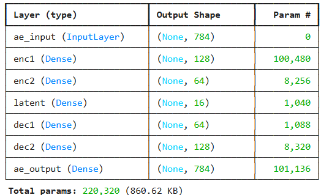

### 실습 6.1.8 — Dendrogram의 Feature 종속성 확인

> 노트북: `code/6.1.8.덴드로그램_Feature종속성.ipynb`

세 표현 모두 같은 Random Forest Classifier와 같은 혼동행렬 절차를 쓴다. 달라지는 것은 입력 Feature뿐이다.

**(1) Pixel.** 이미지를 flatten하여 784개 픽셀을 직접 분류한다.

```python
# Random Forest 분류기
clf_pixel = RandomForestClassifier(n_estimators=50, random_state=SEED, n_jobs=-1)
clf_pixel.fit(X_tr_pixel, y_tr)
acc_pixel = clf_pixel.score(X_te_pixel, y_te)
cm_pixel = confusion_matrix(y_te, clf_pixel.predict(X_te_pixel), labels=range(10))
```

**(2) HOG.** `skimage.feature.hog` 로 각 이미지에서 방향 9개, Cell 7×7, Block 2×2, L2-Hys 정규화 조건의 HOG Feature를 뽑는다.

```python
from skimage.feature import hog
def hog_features(images):
    """각 이미지의 HOG 추출."""
    feats = []
    for img in images:
        f = hog(img, orientations=9, pixels_per_cell=(7, 7),
                cells_per_block=(2, 2), block_norm='L2-Hys', feature_vector=True)
        feats.append(f)
    return np.array(feats)
```

뽑은 HOG 벡터로 같은 분류기를 학습시켜 혼동행렬을 얻는다.

```python
X_tr_hog = hog_features(x_tr_img)
X_te_hog = hog_features(x_te_img)
clf_hog = RandomForestClassifier(n_estimators=50, random_state=SEED, n_jobs=-1)
clf_hog.fit(X_tr_hog, y_tr)
acc_hog = clf_hog.score(X_te_hog, y_te)
cm_hog = confusion_matrix(y_te, clf_hog.predict(X_te_hog), labels=range(10))
```

**(3) AE 잠재 표현.** 16차원 잠재층을 갖는 Autoencoder를 학습한다.

```python
LATENT_DIM = 16

inp = keras.Input(shape=(784,), name='ae_input')
h = layers.Dense(128, activation='relu', name='enc1')(inp)
h = layers.Dense(64, activation='relu', name='enc2')(h)
z = layers.Dense(LATENT_DIM, activation='relu', name='latent')(h)
h = layers.Dense(64, activation='relu', name='dec1')(z)
h = layers.Dense(128, activation='relu', name='dec2')(h)
out = layers.Dense(784, activation='sigmoid', name='ae_output')(h)
ae = keras.Model(inp, out, name='ae')
ae.compile(optimizer='adam', loss='mse')
```

학습이 끝나면 `latent` 층의 출력을 꺼내 인코더 모델을 만들고, 그 잠재 표현으로 같은 분류기를 학습시켜 혼동행렬을 얻는다.

```python
# AE 잠재 표현 추출 -> RandomForestClassifier fit -> confusion_matrix
encoder = keras.Model(ae.input, ae.get_layer('latent').output, name='encoder')
X_tr_ae = encoder.predict(X_tr_pixel, verbose=0)
X_te_ae = encoder.predict(X_te_pixel, verbose=0)
clf_ae = RandomForestClassifier(n_estimators=50, random_state=SEED, n_jobs=-1)
clf_ae.fit(X_tr_ae, y_tr)
cm_ae = confusion_matrix(y_te, clf_ae.predict(X_te_ae), labels=range(10))
```

세 혼동행렬에서 각각 Pairwise Confusion 점수를 계산하고 Ward 연결법으로 덴드로그램을 그린다. 마지막으로 세 덴드로그램의 상위 5개 혼동 쌍을 비교하여, 표현과 무관하게 유지되는 '강건한 쌍'과 특정 표현에서만 나타나는 '가공물' 쌍을 분리한다.

### 결과: 표현이 바뀌면 형태 공간이 바뀐다

세 표현으로 각각 얻은 덴드로그램을 나란히 놓고 상위 5개 혼동 쌍을 비교한다.

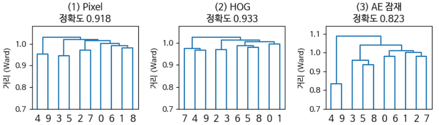

*그림 6-6. 같은 MNIST, 다른 Feature. "데이터로부터 발견한 형태 공간"은 표현마다 다른 모습을 갖는다.*

비교 결과는 다음과 같이 정리된다.

- **세 표현에서 공통으로 상위 5쌍에 드는 강건한 쌍** : 3 ↔ 5, 4 ↔ 9
- **두 표현에서만 상위 5쌍인 것** : 7 ↔ 9
- **픽셀에서만 상위 5쌍** : (2, 7), (5, 6), (5, 9)
- **HOG(및 대체 표현)에서만 상위 5쌍** : (2, 3), (3, 9)
- **AE에서만 상위 5쌍** : (5, 8), (8, 9)

해석은 두 갈래다. '강건한 쌍'은 어떤 Feature에서도 가까운, 보편적인 유사 쌍이다. 반면 '하나에서만 상위'인 쌍은 그 Feature가 만들어 낸 **가공물**이며, 곧 가설 종속적인 결과다.

### Feature 가설의 함의 정리

이상의 결과에서 세 가지 함의가 나온다.

1. 혼동 구조를 통해 발견된 구조는, 다시 정의하면 **"이 Feature 선택 하에서 발견된 구조"** 다.
2. Feature를 다르게 선택한 도메인 전문가는, 같은 데이터에서 **다른 클래스 관계**를 보고 있다.
3. Confusion-aware Soft Label 같은 방법은 사용한 Feature에 종속된다. 따라서 Feature가 바뀌면 Soft Label도 다시 정의해야 한다.

---

## 6.1.10 Feature 가설의 윤리적 함의
<!-- 슬라이드 400 -->

### Feature 선택은 윤리적 행위다

Feature 선택이 결론을 좌우한다면, 그 선택은 기술적 결정에 그치지 않는다. 세 가지 지점에서 윤리적 성격이 드러난다.

**1. 암묵적 차별 — Feature 선택의 결과는 "의도"와 다를 수 있다.** "우편번호"처럼 외관상 중립적인 Feature가 실제로는 인종·소득과 강하게 상관되는 경우가 있다. 이런 Feature를 사용하면 특정 집단에 대한 간접 차별이 만들어질 수 있다.

**2. 측정의 편향 — 어떤 변수를 측정할지 자체가 가치 판단이다.** 의료 분야에서 "통증 점수"보다 "검사 수치"를 Feature로 선호하면, 측정하기 어려운 증상을 가진 환자는 시스템 안에서 보이지 않게 된다.

**3. 자동화의 가치 함의 — "자동 Feature 학습은 객관적이다"라는 미신.** 앞서 확인했듯 자동 학습 역시 아키텍처·손실·데이터라는 가설 위에서 작동한다. 그 가설을 명시하고 검증할 책임은 여전히 인간에게 있다.

### 가설을 명시하고 검토하는 절차

Feature 가설이 이런 결과를 낳는다면, 실무에서는 그 가설을 문서화하고 검증하는 절차를 표준으로 삼아야 한다.

- **Feature 명세서** — Feature 선택이 담고 있는 가설을 문서로 남긴다. 도메인 전문가, 법무, 윤리 담당자가 함께 검토한다.
- **대체 Feature Set 비교** — 최소 두 개의 Feature Set으로 모델을 학습하고 결론이 안정적인지 검증한다. 이 절차를 모든 프로젝트에서 표준화한다.
- **Counterfactual 검토** — 인종·성별 같은 민감 Feature를 제외했을 때 어떤 결과가 나오는지 명시적으로 확인한다.
- **도메인–자동 통합** — 도메인 전문가가 만든 수동 Feature와 학습된 Feature를 함께 사용하고, 둘이 일치하는 지점과 불일치하는 지점을 분석한다.

---

## 6.1.11 누구의 가설인가: Feature 선택의 책임 주체
<!-- 슬라이드 401 -->

Feature가 가설이라면, 그 가설은 누구의 가설인가?

데이터 분석은 자주 "객관적 사실의 발견"으로 표현된다. 그러나 Feature 선택이 가설이라는 사실은, 분석에 분석자의 관점이 **본질적으로** 들어 있음을 뜻한다.

그리고 그 관점은 결과를 통해 사람들의 삶에 닿는다. 선택 주체가 만든 Feature 가설이 모델의 출력이 되고, 그 출력이 누가 어떤 의료 진단을 받을지, 어떤 신용 등급을 받을지, 어떤 이력서가 추천될지를 결정한다. "객관적 알고리즘"의 뒤에는 분석가의 가치 판단이 있다.

Feature 선택에 관여하는 주체와 그 각각의 리스크를 정리하면 다음과 같다.

| 주체 | 전형적 결정 | 리스크 |
|---|---|---|
| 데이터 과학자 | 변환의 종류, 차원, 정규화, 결측 처리 | 도메인 지식의 부재로 무의미한 변환을 추가하거나 자동화에 과도하게 의존한다 |
| 도메인 전문가 | 원본 변수의 정의, 의미 있는 조합, 변환 형태 | 전문성 편향에 갇혀 새로운 패턴을 발견할 기회를 놓친다 |
| 모델 (학습된) | Convolution·attention을 통한 Feature 자동 추출 | 학습 데이터의 편향을 그대로 흡수하며 해석이 어렵다 |
| 사용자·기관 (정책) | 어떤 변수를 사용 가능·금지로 둘지 (예: 인종, 성별) | 법적·윤리적 제약과 사회적 책임이 따른다 |

Feature 선택은 이 네 주체의 **공동 가설**이며, 그렇기 때문에 어느 한 사람의 기술적 판단으로 환원되지 않는다.

---

## 6.1.12 정리
<!-- 슬라이드 402 -->

> **정리**
> 데이터 분석의 모든 결론은 Feature 가설 위에 존재한다.
>
> - **Feature는 객관 속성이 아니라 가설이다.** 그 가설은 변수 선택, 함수 형태, 변수 조합이라는 세 차원에서 만들어진다.
> - **Feature Engineering의 도구는 4축으로 분류된다.** 수동성, 도메인 의존성, 선형성, 해석 가능성이며, 각 조합은 서로 다른 가설 공간을 탐색한다.
> - **Kernel은 비선형 가설의 제안이다.** 선형 모델의 한계를 변환으로 극복하되, 어떤 커널을 쓸지는 곧 어떤 비선형 구조를 가정할지의 선택이다.
> - **같은 데이터라도 Feature Set이 다르면 다른 결론이 나온다.** 모델과 검증을 고정한 채 Feature만 바꾸어도 R²가 0.2567만큼 벌어졌다.
> - **중요도 metric에는 자기 종속성이 있다.** Permutation, SHAP, Mutual Information은 서로 다른 순위를 내놓으며, 그 불일치가 가설 종속성의 신호다.
> - **학습된 Feature는 학습된 가설이다.** 딥러닝은 가설을 없앤 것이 아니라 아키텍처·손실·데이터로 옮겨 놓았을 뿐이다.
> - **5.2에서 발견한 구조조차 Feature에 종속된다.** 가설 없는 발견은 없다.
> - **Feature의 선택은 윤리적 행위다.** 데이터 과학자·도메인 전문가·모델·기관이 함께 책임지는 공동의 결정이 필요하다.
