# 6.2 피처 불안정성 (Feature Instability)

**학습 목표**

- Feature 불안정성을 정의하고, 그것이 Feature 가설 종속성과 어떤 관계에 있는지 구분하여 설명할 수 있다.
- 불안정성의 세 가지 원인(다중공선성, 샘플 부족, 모델 구조 민감도)을 메커니즘·진단 신호·처방의 형태로 진단하고 서로 구분할 수 있다.
- Bootstrap으로 Feature 중요도의 분포를 얻고, 변동 계수(CV)와 신뢰구간(CI)으로 안정성을 정량화할 수 있다.
- VIF, Condition Number, Tolerance를 계산하고 정해진 순서에 따라 다중공선성을 진단할 수 있다.
- Simpson's Paradox가 성립하는 조건을 FWL 정리로 설명하고, Kendall's τ와 Spearman ρ로 Permutation Importance 순위의 변동성을 측정할 수 있다.
- Feature Stability Index, Bootstrap 신뢰구간, 순위 거리를 통합하여 신뢰할 수 있는 Feature 분석 보고서를 작성할 수 있다.

**이 절의 구성**

- 6.2.1 이 절이 겨누는 지점
- 6.2.2 Feature 불안정성이란 무엇인가
- 6.2.3 원인 (A) 다중공선성
- 6.2.4 원인 (B) 샘플 크기 부족
- 6.2.5 원인 (C) 모델 구조 민감도
- 6.2.6 신경망의 구조적 불안정성과 그 대책
- 6.2.7 Bootstrap 기반 안정성 측정
- 6.2.8 Feature 중요도의 Bootstrap 안정성: CV와 신뢰구간
- 6.2.9 Bootstrap의 딥러닝 일반화: 데이터·가중치·초기화
- 6.2.10 다중공선성 정량 지표: VIF · Condition Number · Tolerance
- 6.2.11 딥러닝에서의 적용과 Feature Stability Index
- 6.2.12 Simpson's Paradox: Feature 추가로 결론이 역전된다
- 6.2.13 회귀계수 부호 역전의 조건과 FWL 정리
- 6.2.14 순위 안정성 측정: Kendall's τ와 Spearman ρ
- 6.2.15 순위 안정성 보고 형식
- 6.2.16 FSI: 가설 종속성 지표 3종의 통합
- 6.2.17 신뢰할 수 있는 Feature 분석 보고 형식
- 6.2.18 딥러닝 모델을 쓸 때 추가로 보고할 항목
- 6.2.19 정리

> 실습 번호는 강의 슬라이드의 번호를 그대로 쓴다. 소절 번호와는 무관하다.

---

## 6.2.1 이 절이 겨누는 지점
<!-- 슬라이드 403~405 -->

### 6.1에서 6.2로

6.1은 **Feature 가설**을 주장했다. Feature는 객관적인 데이터 속성이 아니라 데이터를 바라보는 가설이라는 것이다. 이를 뒷받침하기 위해 같은 데이터에 세 가지 Feature Set을 적용했을 때 모델 성능과 중요도 순위 같은 결론이 달라진다는 것을 확인했고, Feature 중요도를 평가하는 도구로 Permutation Importance, SHAP, Mutual Information을 살펴보았다.

6.2는 여기서 한 걸음 더 나아간다. 가설을 바꾸었을 때 결론의 변화가 **얼마나, 어떤 방식으로** 일어나는지를 정량화하여 입증한다. 나아가 가설이 결론을 좌우한다는 사실을 측정하고 보고하는 방법까지 다룬다.

이 절의 목표는 네 가지다.

- **불안정성 원인 진단** — 다중공선성, 샘플 부족, 모델 민감도를 진단하고 서로 구분한다.
- **안정성 측정** — Bootstrap 기반 측정과 다중공선성 지표(VIF, Condition Number, Tolerance)를 계산한다.
- **결론 역전의 입증** — Simpson's Paradox 같은 역전 현상을 정량적으로 입증하고, Permutation Importance 순위의 변동성을 측정한다.
- **가설 종속성 지표의 통합 보고** — Feature 안정성 점수, Bootstrap 신뢰구간, 순위 거리를 묶어 통합 보고서를 작성한다.

논의는 네 부분으로 진행한다.

- **Part A** — Feature 불안정성이란 무엇이며 왜 생기는가. 불안정성의 정의와 Feature 가설과의 경계를 구분하고, 세 가지 원인(다중공선성, 샘플 부족, 모델 민감도)을 메커니즘·진단 신호·처방으로 정리한다.
- **Part B** — 불안정성을 어떻게 수치로 측정할 것인가. Bootstrap 기반 안정성 측정과 다중공선성 정량 지표(VIF, Condition Number, Tolerance)를 다룬다.
- **Part C** — 불안정성으로 결과가 역전되는 현상. Simpson's Paradox에서 회귀계수의 부호가 뒤집히는 조건과, Kendall's τ·Spearman ρ를 사용한 순위 변동성 측정을 다룬다.
- **Part D** — Part A·B·C의 도구를 종합하여 신뢰성 있는 결론을 만드는 방법. 가설 종속성의 정량 지표 3종(Feature Stability Index, Bootstrap CI, 순위 거리)을 통합하고, 안정한 결론을 보고하는 형식(안정성 점수 + 신뢰구간 + 시드 다양성 + 한계 명시)을 정한다.

---

**⟨ Part A ⟩ Feature 불안정성의 의미와 원인**

> Feature 불안정성이란 무엇이며 왜 생기는가?
> 먼저 불안정성의 정의를 세우고 Feature 가설과의 경계를 구분한다.
> 이어서 세 가지 원인(다중공선성, 샘플 부족, 모델 구조 민감도)을 각각 메커니즘 · 진단 신호 · 처방의 형태로 정리한다.

## 6.2.2 Feature 불안정성이란 무엇인가
<!-- 슬라이드 405 -->

### 정의와 경계

> **정의 — Feature 불안정성**
> 데이터의 작은 변동에서 Feature 중요도나 회귀계수 같은 결론에 큰 변동이 발생하는 현상.

이 정의에서 곧바로 해석 규칙이 따라 나온다. 중요도가 안정적이라면 그 Feature는 데이터의 구조를 반영하는 신호일 가능성이 높다. 반대로 중요도가 불안정하다면 그 결과는 특정 샘플에 과적합된 산물일 가능성이 높다.

### 불안정성이 드러나는 세 가지 모습

Feature 불안정성은 Feature 가설 종속성이 극단적으로 드러난 결과다. 세 가지 모습으로 나타난다.

**(1) 데이터 교란(perturbation) 시 PI 순위가 변동한다.** 같은 모델과 같은 평가 절차를 유지한 채 Bootstrap을 100회 실시했을 때, Feature 중요도의 순위가 계속 변동하는 경우다. 6.1에서 관찰한 것이 **가설을 바꿨을 때의 변동**이었다면, 여기서 보는 것은 **같은 가설 안에서의 변동**이다.

**(2) 모델을 재학습하면 회귀계수의 부호가 역전된다.** 다중공선성이 있는 Feature를 포함한 회귀 모델은 부트스트랩 표본마다 계수의 부호가 달라질 수 있다. 어떤 Feature가 양의 효과를 갖는다는 결론이 시드만 바꿔도 부정되는 것이다.

**(3) 부분 집단을 추가하면 결론이 역전된다.** Simpson's Paradox가 여기에 해당한다. 전체 데이터에서 관찰되는 추세가 부분 집단에서는 정반대로 나타나는 현상이다. Feature 하나를 추가했더니 결론이 뒤집힌다면, 그것은 가설 종속성의 가장 강력한 증거가 된다.

> **핵심 주장**
> Feature 불안정성은 모델의 결함이 아니라, 가설 종속성이 남기는 측정 가능한 신호다.

---

## 6.2.3 원인 (A) 다중공선성
<!-- 슬라이드 406 -->

### 메커니즘

**다중공선성(Multicollinearity)** 은 Feature 사이의 상관에서 비롯된다. 두 Feature가 서로 높은 상관관계를 가지면 회귀 모델은 두 Feature 가운데 어디에 가중치를 줄지를 사실상 임의로 결정한다. 그리고 학습 샘플이 바뀌면 그 선택이 뒤집힌다. 그 결과로 나타나는 것이 **회귀계수 분산의 폭주**이며, 이것은 다중공선성의 수학적 귀결이다.

OLS 회귀계수 $\hat\beta$ 의 분산은 다음과 같이 주어진다.

$$\mathrm{Var}(\hat{\beta}_j) = \sigma^2 \cdot \left[\left(X^\top X\right)^{-1}\right]_{jj}$$

Feature $j$ 가 다른 Feature들과 강하게 상관되면 $X^\top X$ 는 거의 특이행렬(singular matrix)이 된다. 특이행렬에는 역행렬이 존재하지 않으므로 $\hat\beta$ 를 계산할 수 없고, 거의 특이행렬인 경우에는 역행렬의 원소 값이 폭발하여 분산이 사실상 무한대로 커진다.

따라서 다중공선성은 **같은 데이터에서도 추정값이 무한히 흔들릴 수 있는 구조적 취약성**이다. 이 취약성은 Feature들이 같은 방향을 가리키는 기하학적 구조에서 나오는 것이므로, 데이터를 더 모은다고 개선되지 않는다는 점에 주의해야 한다.

### 상관의 정도에 따른 사례

- **키(cm) vs 키(inch)** — 완벽히 상관한다($r = 1.0$). 한 Feature가 가중치 1을 갖고 다른 쪽이 0을 가질 확률이 50:50이다.
- **나이 vs 근무 연수** — 직장인 데이터에서 대체로 $r \approx 0.85$ 다. 두 Feature의 중요도는 각각 불안정하지만, 두 Feature를 합산한 중요도는 안정적이다.
- **면적 vs 방수** — 대체로 $r \approx 0.6 \sim 0.7$ 이다.

여기서 쓰는 기호를 구분해 둘 필요가 있다. $r$ (Pearson's correlation coefficient)은 표본에서 얻은 상관계수이고, $\rho$ 는 모집단의 상관계수, 곧 이론적인 정답이다. $r$ 은 $\rho$ 의 추정치이지만 관행적으로 $\rho$ 로 표기하는 경우가 많다.


이 사례들에서 상관은 우연이 아니라 대상의 성질에서 나온다. 집이 커지면 방의 수도 함께 늘어나기 때문에 면적과 방 수는 상관이 높게 나오는 것이다. 이렇게 상관이 높은 Feature를 여럿 나란히 입력에 넣으면 각 Feature의 중요도가 불안정하게 흔들린다.


### 진단 신호와 처방

**진단 신호**

- VIF가 5(또는 10)를 넘는다.
- Condition Number가 30을 넘는다.
- Bootstrap을 돌렸을 때 회귀계수의 부호가 변동한다.
- 한 Feature를 제거했을 때 다른 Feature의 계수가 크게 변한다.

**처방**

- 상관된 Feature 가운데 더 의미 있는 것을 남긴다.
- 주성분 분석으로 직교화한다.
- Ridge(L2) 정규화로 분산을 제어한다. L1(Lasso)은 계수를 0으로 만드는 방식의 제어이므로 성격이 다르다.


두 정규화가 상관된 Feature를 다루는 방식은 대조적이다. Ridge는 상관이 높은 Feature들에 가중치를 나누어 배분해 어느 한쪽으로 쏠리지 않게 하고, Lasso는 둘 가운데 한쪽만 갖도록 눌러 선택이 왔다 갔다 하지 못하게 한다. 어느 쪽이든 상관이 큰 Feature 때문에 학습이 방해받는 것을 덜어 준다.


---

## 6.2.4 원인 (B) 샘플 크기 부족
<!-- 슬라이드 407 -->

### 메커니즘

데이터가 부족하면 각 샘플이 모델 파라미터에 미치는 영향이 커진다. 100개 샘플 가운데 이상치 1개는 전체의 1%를 차지하며, 이 하나가 Feature 중요도를 통째로 바꿀 수 있다.

Bootstrap 반복은 이 취약성을 드러낸다. 복원 추출을 반복하면 매 반복에서 원본 샘플의 약 37%가 제외되거나 중복 추출된다($e^{-1} \approx 0.368$). 즉 반복마다 학습 데이터의 분포가 조금씩 달라진다. 안정적인 Feature는 이 변동과 무관하게 중요도를 유지하지만, 불안정한 Feature는 Bootstrap 표본에 따라 크게 흔들린다.


이 흔들림의 실체는 이상치의 포함 여부다. 복원 추출을 반복하면 이상치가 어떤 표본에는 들어가고 어떤 표본에는 빠지며, 불안정한 Feature의 중요도는 그때마다 크게 움직인다. 그래서 Bootstrap PI의 변동이 크다는 관찰은 표본이 상대적으로 적거나 이상치의 영향이 크다는 두 가지 해석으로 이어진다.


### out-of-bag 확률의 유도

37%라는 숫자는 다음과 같이 얻어진다. 샘플 크기가 $n$ 일 때, 한 번의 복원 추출에서 특정 샘플 $i$ 가 뽑히지 않을 확률은 $\left(1 - \frac{1}{n}\right)$ 이다. 이것을 $n$ 번 반복하면 샘플 $i$ 가 한 번도 뽑히지 않을 확률은

$$\left(1 - \frac{1}{n}\right)^{n}$$

이 되고, $n \to \infty$ 극한을 취하면

$$\lim_{n \to \infty}\left(1 - \frac{1}{n}\right)^{n} = e^{-1} \approx 0.368$$

이다. 참고로 **Subsampling** 은 비복원 추출이므로 중복 샘플이 생기지 않으며, 이 계산이 적용되지 않는다.


두 방법이 갈리는 지점은 중복의 허용 여부다. Bootstrap은 복원 추출이어서 같은 샘플이 여러 번 다시 뽑히고, 그 중복만큼 다른 샘플이 표본에서 밀려난다. 앞의 36.8%는 이 밀려남을 계산한 값이다. Sub-sampling은 중복 샘플이 생기지 않는 경우를 가리키므로 이런 밀려남 자체가 없다. 


### 진단 신호와 처방

**진단 신호**

- Bootstrap PI의 변동 계수(Coefficient of Variation, CV)가 0.5를 넘는다.
- Feature 중요도의 표준오차가 평균값에 근접한다. 평균이 0.3인데 표준오차가 0.25라면 평균의 83%에 이르므로 불안정하다고 판단한다.
- 5-fold cross-validation의 fold별 순위가 서로 일치하지 않는다.

**처방**

데이터를 더 모으는 것이 근본적인 해법이지만 현실에서는 불가능한 경우가 많다. 그럴 때 취할 수 있는 조치는 다음과 같다.

- Bootstrap 신뢰구간을 반드시 함께 보고한다.
- 단일 시드의 결과만 사용하는 것을 금지한다.
- Cross-validation의 폴드별 결과를 평균과 표준오차의 형태로 보고한다.
- 복잡한 딥러닝 모델 대신 단순한 모델(예: LASSO 회귀)을 쓰면 불안정성이 줄어든다.


Cross-validation과 Bootstrap은 절차가 다르다. Cross-validation은 데이터셋을 여러 폴드로 나눈 뒤 검증에 쓰는 구간을 옮겨 가며 학습하고, Bootstrap은 복원 추출로 표본 자체를 매번 새로 만든다.

그러나 폴드별 결과의 평균과 표준오차를 읽는 일은 Bootstrap 표본에서 평균과 표준오차를 읽는 일과 거의 같은 것을 재는 셈이다. 그래서 폴드마다 PI 순위가 뒤바뀌는 신호와 Bootstrap마다 PI가 흔들리는 신호는 같은 방향으로 해석한다.

딥러닝 모델을 써야 하는 상황이라면 순서가 있다. 샘플이 부족할수록 과적합이 쉽게 생기므로 먼저 모델을 단순화하고, 그다음 L1·L2 정규화를 걸어 파라미터의 불안정성을 줄인다. 이 두 단계가 샘플이 부족한 상황에서 파라미터를 안정시키는 기본 조치다.


---

## 6.2.5 원인 (C) 모델 구조 민감도
<!-- 슬라이드 408, 412~414 -->

### 결정론적 학습과 확률론적 학습

세 번째 원인은 모델 구조 자체가 갖는 민감도다. 학습이 결정론적인가 확률론적인가에 따라 민감도가 달라진다.

**의사결정 트리 계열 (Random Forest, Gradient Boosting).** 각 분기점에서 가장 좋은 Feature를 선택할 때, 여러 Feature의 점수가 거의 비슷하면 그 가운데 하나를 임의로 고르게 된다. 그래서 같은 데이터와 같은 시드에서도 미세한 수치 차이가 분기 결정을 뒤집고, 그 결과 트리 구조 전체가 흔들린다.

**선형 모델.** 닫힌 형태(closed-form)의 해나 볼록 최적화로 학습되므로 결정론적이고 안정적이다. 다만 다중공선성에는 오히려 더 취약하다(원인 A).

**딥러닝.** 무작위 초기화와 미니배치 순서의 변화 때문에 학습할 때마다 다른 가중치 분포가 만들어진다. 여러 개의 좋은 해 가운데 하나가 선택되는 구조다.


여기서 말하는 구조는 데이터의 구조를 가리킨다. 모델마다 특성은 다르지만 어느 모델이든 특정한 데이터 구조에 민감하며, 그 민감함이 학습을 결정론적으로 하는지 확률론적으로 하는지에 따라 다른 방식으로 드러난다.

모델이 데이터의 특성을 충분히 담을 만큼 크면 좋은 해는 하나가 아니다. 초기값이 무작위로 정해지는 조건과 학습 순서가 무작위로 바뀌는 조건이 겹치면서, 학습은 여러 개의 좋은 해 가운데 하나를 고르는 과정이 된다.

시드를 바꾸었을 때 성능과 Feature 중요도가 함께 변동하는 이유가 여기에 있다. 딥러닝 모델을 여러 번 학습시켜 전체 성능의 평균으로 평가하는 관행도 이 특성에서 나온 것이다. 한 번의 학습 결과는 여러 해 가운데 하나를 본 것에 지나지 않기 때문이다.


### 진단 신호와 처방

**진단 신호**는 단순하다. 시드만 바꿔도 모델 성능과 Feature 중요도가 크게 변동한다면 구조 민감도를 의심한다. 5회 이상 반복 학습했을 때 표준편차가 평균의 10%를 넘으면 신호로 본다.

**처방**은 다중 시드로 학습한 뒤 결과를 평균하는 것, Ensemble을 구성하는 것, 그리고 Random Forest나 Gradient Boosting에서 `n_estimators`(트리 수)를 늘리는 것이다.

모델별 민감도를 정리하면 다음과 같다.

| 모델 종류 | 구조 민감도 | 주된 원인 | 안정성 향상 도구 |
|---|---|---|---|
| 선형 회귀 (OLS) | 낮음 | 결정론적 closed-form | Ridge · Elastic Net 정규화 |
| LASSO | 중간 | λ 선택에 따라 sparse 패턴이 변동 | Stability Selection (반복 LASSO + 선택 빈도) |
| Random Forest | 높음 | 분기의 임의성과 Bagging | Feature 중요도 평균 + n_estimators를 충분히 크게 |
| Gradient Boosting | 중간 | 순차 학습이라 어느 정도 안정적 | 조기 종료, learning rate 조정 |
| 신경망 (MLP/CNN) | 매우 높음 | 초기화 · SGD · 정규화 | 다중 시드 학습 평균 · Ensemble · Dropout |

이 표의 민감도 등급은 모델의 우열을 매긴 것이 아니다. 민감도가 낮은 선형 회귀도 전처리를 제대로 하지 못하면 다중공선성 때문에 더 큰 문제를 겪고, 민감도가 매우 높은 신경망도 시드와 학습을 제어하면 안정된 결과를 얻는다. 신경망에서는 배치 정규화 층을 두는 것도 안정화 수단이 된다.


트리 수를 늘리는 것이 안정화로 이어지는 이유는 상쇄에 있다. 트리마다 분기 구조가 달라지는데, 트리가 많아지면 서로 다른 구조들이 서로를 상쇄해 전체 결과가 안정된다. 신경망 쪽에서 학습률을 조정하거나 조기 종료를 두는 것도 같은 목적의 제어다. 안정성을 높이는 방법이 모델마다 다른 것은 민감해지는 원인이 다르기 때문이다.


### 실습 6.2.1 — Feature 불안정성의 세 가지 원인 확인

> 노트북: `code/6.2.1.불안정성_3원인.ipynb`

불안정성의 세 원인을 하나씩 인공 실험으로 재현하고, 각 원인이 남기는 신호를 확인한다.

**1) 원인 A : 다중공선성 — 시드별 회귀계수 부호 역전 검증.** 먼저 $x_1$ 과 $x_2$ 의 상관이 $\rho = 0.98$ 로 매우 강하고 $x_3$ 는 독립인 데이터를 생성한다. 진짜 모델에서 $y$ 에 영향을 주는 것은 $x_1$ 과 $x_3$ 뿐이며 $x_2$ 의 계수는 0이다.

```python
# 강한 다중공선성 데이터 — x1, x2 거의 같음 (ρ=0.98)
def make_collinear(n=500, rho=0.98, seed=42):
    rng = np.random.default_rng(seed)
    x1 = rng.normal(size=n)
    x2 = rho * x1 + np.sqrt(1 - rho**2) * rng.normal(size=n)
    x3 = rng.normal(size=n)
    y = 1.0 * x1 + 0.0 * x2 + 0.5 * x3 + rng.normal(0, 0.5, size=n)   # 진짜 모델: x1만 영향
    return np.column_stack([x1, x2, x3]), y
```

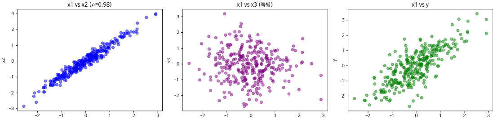

시드를 10개로 바꾸어 가며 데이터를 생성하고 각각 선형 회귀를 적합시킨 뒤 $\beta_1, \beta_2, \beta_3$ 의 변화를 관찰한다.

```python
# 10 개 시드에서 회귀계수 추출
coefs = []
for seed_b in range(10):
    Xb, yb = make_collinear(n=500, rho=0.98, seed=seed_b+1)
    m = LinearRegression().fit(Xb, yb)
    coefs.append(m.coef_)
coefs = np.array(coefs)

print(f"β1 부호 변화: {np.sum(coefs[:,0] > 0)} 양수, {np.sum(coefs[:,0] < 0)} 음수")
print(f"β2 부호 변화: {np.sum(coefs[:,1] > 0)} 양수, {np.sum(coefs[:,1] < 0)} 음수")
```

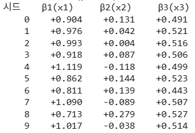

$x_3$ 의 계수는 시드와 무관하게 0.5 부근에서 안정적인 반면, 상관이 강한 $x_2$ 의 계수는 부호까지 반전된다. 다중공선성이 있는 Feature에서만 부호 역전이 나타난다는 사실을 확인할 수 있다.

같은 환경에서 Permutation Importance의 변동 계수도 계산한다.

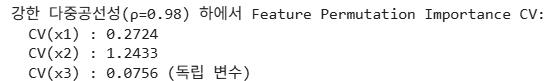

기준에 비추어 보면 $x_2$ 의 CV는 1.24로 0.5를 크게 넘으므로 "매우 불안정"에 해당하며, 결론을 단정해서 보고해서는 안 되는 상태다. $0.3 \le CV < 0.5$ 구간이라면 다중공선성과 이상치를 점검해야 한다.

**2) 원인 B : 샘플 크기.** 주택(housing) 데이터셋을 $n = 50, 100, 500, 1000$ 의 네 가지 크기로 생성하고, 각 크기에서 PI의 변동 계수를 비교한다. 모델은 Random Forest Regressor를 쓰고, 시드를 바꾸어 10회 학습한 뒤 Feature별 CV를 비교한다.

```python
def generate_housing(n_samples, seed=42):
    rng = np.random.default_rng(seed)
    area = rng.uniform(30, 150, size=n_samples)
    rooms = rng.integers(1, 6, size=n_samples)
    location = rng.uniform(1, 10, size=n_samples)
    price = 30*area + 50*location**2 + 8*(area*location)/10 + rng.normal(0, 1000, size=n_samples)
    return np.column_stack([area, rooms, location]), price

# n=50, 100, 500, 1000 에서 PI 변동성 (10 시드)
results = {}
for n_size in [50, 100, 500, 1000]:
    pi_per_seed = []
    for seed_b in range(10):
        X_n, y_n = generate_housing(n_size, seed=seed_b)
        m = RandomForestRegressor(n_estimators=50, random_state=seed_b, n_jobs=-1).fit(X_n, y_n)
        perm = permutation_importance(m, X_n, y_n, n_repeats=3, random_state=seed_b,
                                      n_jobs=-1, scoring='r2')
        pi_per_seed.append(perm.importances_mean)
    pi_per_seed = np.array(pi_per_seed)
    cv = pi_per_seed.std(axis=0) / np.maximum(np.abs(pi_per_seed.mean(axis=0)), 1e-8)
    results[n_size] = (pi_per_seed.mean(axis=0), pi_per_seed.std(axis=0), cv)
```

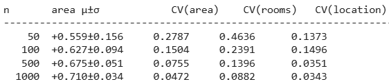

$n$ 이 작을수록 PI의 평균은 낮아지고 표준편차는 커져서 변동 계수가 상대적으로 커진다. 즉 샘플이 작으면 PI 자체의 가치가 떨어진다.

**3) 원인 C : 모델 구조 민감도.** 동일한 housing 데이터에 세 가지 모델을 적용하여 CV를 비교한다. Linear Regression, Random Forest(n_estimators=50), Random Forest(n_estimators=200)이다.

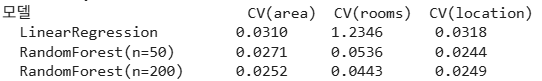

관찰되는 바는 다음과 같다. Linear Regression은 닫힌 형태의 해를 갖기 때문에 시드와 무관하며 시드 민감도라는 의미에서의 CV는 거의 0이다(표에서 rooms의 CV가 큰 것은 다중공선성에 따른 별개의 문제다). Random Forest는 트리 수가 50일 때 분기의 임의성 때문에 CV가 크고, 200으로 늘리면 평균 효과로 CV가 감소한다. 따라서 트리 모델을 쓸 때에는 `n_estimators` 를 충분히 크게 잡고 다중 시드의 결과를 평균하면 CV가 줄어든다. 일반적으로 50 정도면 충분한 경우도 있으므로, CV의 감소 폭을 보면서 트리 수를 결정한다.

참고로 Random Forest의 학습은 두 가지 무작위성을 결합한 앙상블 방법이다.

- **Bootstrap Sampling** — 원본 데이터에서 복원 추출로 부분집합을 $B$ 개 만들고, 각 부분집합으로 결정 트리 1개를 독립적으로 학습한다. 최종 예측은 $B$ 개 트리의 평균(회귀) 또는 다수결(분류)이다.
- **Feature 무작위 분할 (Random Subspace)** — 각 트리의 각 노드에서 전체 feature 가운데 일부($\sqrt{p}$ 개)를 선택하고, 그중에서 최적 분할 기준(불순도 또는 분산 감소)을 고른다. 분할 기준으로 많이 사용된 feature일수록 중요도가 높게 나온다.

---

## 6.2.6 신경망의 구조적 불안정성과 그 대책
<!-- 슬라이드 409 -->

### 왜 신경망이 가장 불안정한가

앞의 표에서 신경망의 구조 민감도가 "매우 높음"으로 표시된 데에는 이유가 있다. 신경망의 최적화 문제가 본질적으로 **비볼록(non-convex)** 이어서 여러 개의 해를 갖기 때문이다. 이 성질을 손실 지형(loss landscape)의 다중 최소값 문제라고 부른다.

같은 데이터를 학습하더라도 초기화 시드, 미니배치의 순서, 드롭아웃 마스크가 달라지면 SGD는 매번 다른 최소값으로 수렴한다. 그 결과 학습된 가중치의 분포, 내부 표현, Feature 활용도가 모두 다르게 나타난다.

이것은 데이터 분석에서 만날 수 있는 가장 강한 불안정성의 사례다. Autoencoder와 VAE에서 잠재 공간 $z$ 의 좌표가 갖는 의미가 학습할 때마다 달라지는 것도 같은 원인에서 온다. $z_1$ 이 한 번은 크기를 담고 다음 학습에서는 색상을 담는 **회전·반전 모호성(rotation/reflection ambiguity)** 이 여기서 발생한다. 딥러닝 모델이 학습하는 표현은 그 자체로 측정 가능한 불안정성을 갖는다는 뜻이다.


미니배치는 매번 전체 데이터셋을 섞어서 만들기 때문에, 배치의 순서뿐 아니라 한 배치에 함께 들어가는 데이터의 조합까지 학습할 때마다 달라진다. 초기화의 무작위성 위에 이 조합의 무작위성이 겹치면서, 같은 데이터로도 매번 다른 파라미터를 갖는 모델이 만들어진다.


### 세 가지 대책

**Deep Ensemble.** 서로 다른 시드로 $M$ 개(보통 5~10개)의 신경망을 독립적으로 학습시킨 뒤, 예측과 Feature 중요도를 평균하여 보고한다. Deep Ensemble의 분산은 한 모델의 분산 대비 $1/\sqrt{M}$ 로 줄어드는 것이 보장된다.

**MC Dropout (Monte Carlo Dropout).** 추론 시에도 Dropout을 켜 둔 채 $T$ 회 forward pass를 반복하여, 재학습 없이 예측 분포를 근사한다. 비용이 Deep Ensemble에 비해 크게 낮다는 것이 장점이다.

**Snapshot Ensemble.** 단일 학습 런 안에서 Cyclical Learning Rate를 사용해 여러 개의 극소 손실 체크포인트를 저장하고, 그것으로 Ensemble을 구성한다. 재학습 비용을 $1/M$ 로 줄이지만, 체크포인트 사이의 상관이 높아 독립성은 Deep Ensemble보다 낮다.

> **정리 — Part A**
> - Feature 불안정성은 가설 종속성의 정량 신호이지 모델의 결함이 아니다.
> - 6.1이 "Feature가 가설임"을 주장했다면, 6.2는 "가설이 결론을 좌우함"을 정량적으로 입증한다.
> - 불안정성의 세 원인은 다중공선성, 샘플 부족, 모델 구조 민감도이며 세 차원을 모두 점검해야 한다.

---

**⟨ Part B ⟩ 정량화 도구를 사용한 안정성 측정**

> 불안정성을 어떻게 수치로 측정할 것인가?
> Bootstrap으로 추정량의 분포를 경험적으로 얻어 결과의 변동성을 재고,
> VIF · Condition Number · Tolerance로 입력 데이터의 다중공선성을 정량화한다.

## 6.2.7 Bootstrap 기반 안정성 측정
<!-- 슬라이드 410 -->

### Bootstrap이 하는 일

통계학에서 추정량의 분산은 보통 분포 가정(예: 정규성) 아래에서 분석적으로 유도한다. Bootstrap은 그 가정 없이, 데이터를 복원 추출하여 가상의 데이터셋(부트스트랩 표본)을 만들고 추정량의 분포를 **경험적으로** 구하는 방법이다. 이 분포를 Permutation Importance, SHAP, 회귀계수에 적용하면 변동성을 시각화하고 정량화할 수 있다.

Bootstrap이 서 있는 가정은 하나다. 원본 데이터가 모집단의 표본 분포에 근사한다는 것이다.

### 안정성 측정 절차

1. 원본 데이터 $X = (x_1, \ldots, x_n)$ 에서 복원 추출로 같은 크기 $n$ 의 새 표본 $X^{*(b)}$ 를 $B$ 개 준비한다.
2. 각 $X^{*(b)}$ 로 모델을 학습하고 관심 통계량 $\hat{\theta}^{(b)}$ (예: Feature $j$ 의 PI 값)를 계산한다.
3. 1·2 단계를 $B$ 번 반복한다. 일반적으로 $B = 100 \sim 1000$ 을 쓴다.
4. 얻어진 $B$ 개의 $\hat{\theta}^{(b)}$ 로 표본 분포를 산출한다. 평균, 표준편차, 신뢰구간을 여기서 구한다.


이 절차가 겨누는 것은 분포 그 자체가 아니라 그 분포가 알려 주는 신호다. Bootstrap을 반복했을 때 특정 Feature의 중요도가 계속 바뀐다면, 그 데이터와 모델이 서로 잘 맞지 않는다는 뜻이다. 그 데이터로 분석을 그대로 밀고 나갈 때 어떤 문제가 생길 수 있는지를 측정 단계에서 미리 확인하는 셈이다.


### 통계적 보장과 한계

Bootstrap에는 점근적 보장이 있다. 원본 데이터가 모집단의 임의 추출이라면, 부트스트랩 분포는 $n \to \infty$ 일 때 추정량의 진짜 표본 분포로 수렴한다. 다만 작은 표본($n < 50$)에서는 정확도가 떨어지므로 결과 해석에 신중해야 한다.

복원 추출의 직관도 함께 기억해 둘 필요가 있다. $n$ 개 샘플에서 $n$ 번 복원 추출을 하면 특정 샘플이 한 번도 뽑히지 않을 확률이 약 0.368이다. 즉 매 부트스트랩 표본은 평균적으로 원본의 63.2%만 포함한다. 뒤집어 말하면 나머지 out-of-bag 샘플을 검증용으로 활용할 수 있다는 뜻이고, Random Forest의 OOB 점수가 바로 이것이다.

---

## 6.2.8 Feature 중요도의 Bootstrap 안정성: CV와 신뢰구간
<!-- 슬라이드 411, 415 -->

### 변동 계수의 정의

Feature $j$ 의 중요도 $PI_j$ 에 Bootstrap을 적용하면 $B$ 개의 $PI_j^{(b)}$ 값을 얻는다. 여기서 $PI_j^{(b)}$ 는 Feature $j$ 에 대해 $b$ 번째 부트스트랩 표본에서 계산한 Permutation Importance다. 이 값들로부터 평균과 표준편차, 그리고 변동 계수(Coefficient of Variation, CV)를 계산한다.

$$\mu_j = \frac{1}{B}\sum_{b=1}^{B} PI_j^{(b)}$$

$$\sigma_j = \sqrt{\frac{1}{B-1}\sum_{b=1}^{B}\left(PI_j^{(b)} - \mu_j\right)^2}$$

$$CV_j = \frac{\sigma_j}{\mu_j}$$

$B$ 의 권장 값은 목적에 따라 다르다. 변동성만 추정할 목적이면 100 정도로 충분하고, 신뢰구간까지 보고하려면 1000 이상이 필요하다.

### 평가 기준

95% Bootstrap 신뢰구간은 백분위(percentile) 방식으로 구한다.

$$\left[\,Q_{2.5}\!\left(PI_j^{(b)}\right),\; Q_{97.5}\!\left(PI_j^{(b)}\right)\right]$$

변동 계수의 값에 따른 해석 기준은 다음과 같다.

| $CV_j$ 구간 | 판정 | 보고 지침 |
|---|---|---|
| $CV_j < 0.1$ | 매우 안정 | Feature 중요도를 신뢰하고 그대로 보고할 수 있다 |
| $0.1 \le CV_j < 0.3$ | 보통 안정 | 신뢰구간과 함께 보고한다 |
| $0.3 \le CV_j < 0.5$ | 불안정 | 다중공선성과 이상치를 점검해야 한다 |
| $CV_j \ge 0.5$ | 매우 불안정 | 결론을 단정하여 보고해서는 안 된다 |

이 구간들은 CV가 1이 되는 지점을 기준으로 삼으면 읽기 쉽다. 표준편차가 평균과 같아진 상태가 CV = 1이므로, 표는 결국 표준편차가 평균보다 얼마나 작은지를 등급으로 나눈 것이다. 0.5는 그 절반에 해당하는 선이다.

### 실습 6.2.2 — Bootstrap 효과 측정: PI, CI, CV

> 노트북: `code/6.2.2.Bootstrap_PI.ipynb`

**Bootstrap 샘플링 확률 시뮬레이션.** 1000개 샘플에서 100번 부트스트랩을 수행하여, 원본에서 실제로 추출된 데이터의 비율을 측정한다. 이론값 63.2%에 수렴하는지 확인하는 것이 목적이다.

**Feature 변동성 확인.** housing 데이터 1000 샘플을 생성하고 $B = 200$ 으로 Bootstrap하여 Feature의 변동성을 확인한다. PI와 CV를 비교하고, 신뢰구간(PI_median, PI_q2.5, PI_q97.5)을 확인한 뒤 박스플롯으로 직관적으로 비교한다.

![Bootstrap PI 결과 — location_score median 1.2836에 CI [1.1916, 1.3791]·CV 0.038(매우 안정), area median 0.7423에 CI [0.6874, 0.8251]·CV 0.050(매우 안정), rooms median 0.0391에 CI [0.0315, 0.0506]·CV 0.136(보통)](images/s415_02.png)

200회를 반복했는데도 location_score와 area의 중요도는 거의 변하지 않았다. 반면 rooms는 CV가 0.1을 넘어 상대적으로 변동이 큰 편이다. 다만 점검을 시작해야 하는 선은 0.3이므로, 세 Feature 모두 아직은 중요도를 그대로 읽어도 되는 상태다.

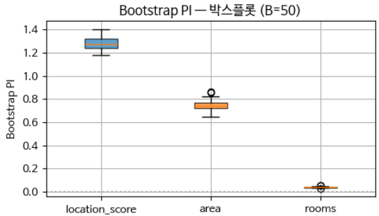

표만으로는 신뢰구간이 눈에 들어오지 않아 같은 결과를 박스플롯으로 다시 그린 것이다. 상자의 위치는 Feature 중요도의 크기를, 상자의 폭은 95% 수준에서의 변동폭을 나타낸다. 수염 바깥으로 이상치도 몇 개 보인다. 중요도와 변동폭을 한 화면에서 함께 읽는 것이 이 그림의 쓰임이다.

분석 자료에는 PI, CV, CI가 모두 포함되어야 한다.

**CV와 CI는 무엇이 다른가.** CV는 상대적인 흔들림, 곧 안정성을 나타낸다. CI는 여기에 PI의 절대적인 크기 정보를 보탠다. 두 지표를 함께 봐야 하는 이유를 예로 들면 다음과 같다.

- $CV = 0.05$, $CI = [0.001, 0.002]$ — 안정적이지만 중요하지 않은 Feature다.
- $CV = 0.2$, $CI = [1.5, 2.5]$ — 변동성은 있지만 중요한 변수다.
- $CI$ 가 0보다 작은 구간에 걸쳐 있다면 — 기여를 전혀 못 하거나 오히려 방해가 될 수 있다.

또 CV는 분포가 정규분포처럼 대칭이라는 가정 위에 서 있다. 따라서 중앙값(median)과 하한·상한 사이의 간격을 함께 보면서 분포의 치우침을 파악해야 한다.

---

## 6.2.9 Bootstrap의 딥러닝 일반화: 데이터·가중치·초기화
<!-- 슬라이드 416 -->

### 세 개의 재샘플링 축

앞서 살펴본 Deep Ensemble, MC Dropout, Snapshot Ensemble은 서로 별개의 기법처럼 보이지만, **Bootstrap의 딥러닝 환경 변종**으로 통합할 수 있다. Bootstrap이 학습 데이터를 복원 추출로 재샘플링하는 것이라면, 딥러닝에서는 가중치와 초기화의 차원에서도 재샘플링이 가능하기 때문이다. 그리고 세 축은 서로 다른 불확실성의 원천을 측정한다.

| 재샘플링 축 | 기법 | 측정하는 불확실성 | 비용 · 구현 |
|---|---|---|---|
| 데이터 | Bootstrap | 데이터 추정 분산, 표본 변동 | $B$ 개 복원 표본마다 모델을 재학습한다. 모델 종류와 무관하다 |
| 가중치 | MC Dropout ($T$ 회 forward) | 가중치에 대한 불확실성 (Epistemic) | 재학습이 불필요하다. Dropout이 있는 구조에 한정된다 |
| 초기화 | Deep Ensemble ($M$ 개 시드) | 손실 지형의 다중 최소값 (Epistemic) | $M$ 번 독립 학습이 필요하며 시간 비용이 크다 |

여기서 **Epistemic 불확실성**은 데이터 수집과 모델에서 비롯되어 원리적으로 줄일 수 있는 불확실성이고, **Aleatoric 불확실성**은 현상 자체에 내재하여 튜닝으로 줄일 수 없는 불확실성이다.


두 불확실성을 나누는 기준은 줄일 수 있는가에 있다. 가중치와 손실 지형 쪽에서 재는 불확실성은 데이터를 잘 모으거나 모델을 잘 조정하면 개선되므로 Epistemic에 속한다. 반면 Aleatoric 불확실성은 데이터가 본래 갖고 있는 것이어서, 재샘플링을 아무리 반복해도 튜닝으로는 줄어들지 않는다.


### 실무 권장

세 축은 배타적이지 않고 결합할 수 있다. Bootstrap × Deep Ensemble을 함께 쓰면 데이터와 초기화 양쪽의 불확실성을 동시에 측정할 수 있으며, 비용과 시간은 $B \times M$ 에 비례한다.

- 데이터 양이 충분하다면 가중치와 초기화 쪽 재샘플링을 중심에 둔다.
- 데이터가 부족하다면 Bootstrap을 중심에 둔다.

이 절 뒤쪽 실습에서는 Deep Ensemble을 Bootstrap PI 안에서 적용한 경우($B = 50 \times M = 10$)를 정량적으로 검증한다.

---

## 6.2.10 다중공선성 정량 지표: VIF · Condition Number · Tolerance
<!-- 슬라이드 417~418, 420~421 -->

Bootstrap이 **결과의 변동성**을 측정하는 도구라면, 다중공선성 정량 지표는 **입력 데이터의 구조적 취약성**을 측정하는 도구다. 두 측정은 서로를 대체하지 않는다.


안정성을 측정하는 작업은 두 갈래로 나뉜다. 하나는 Bootstrap을 기반으로 Feature가 모델 안에서 얼마나 안정적으로 결과를 만드는지 재는 것이고, 다른 하나는 Feature들이 서로 얼마나 상관되어 있는지 재는 것이다. 뒤쪽에 쓰는 지표가 VIF, Condition Number, Tolerance 세 가지다.


### Variance Inflation Factor (VIF)

VIF는 한 Feature가 다른 Feature들로 얼마나 설명되는지를 측정한다. 계산 방식은 다음과 같다. Feature $j$ 를 종속변수로 두고 나머지 Feature들을 독립변수로 하는 보조 회귀를 수행하여 결정계수 $R_j^2$ 를 구한 뒤,

$$VIF_j = \frac{1}{1 - R_j^2}$$

로 정의한다. 여기서 $R_j^2$ 는 Feature $j$ 가 다른 Feature들로 얼마나 설명되는지를 나타내는 값이다. 그 역수 관계에 있는 지표가 Tolerance다.

$$Tolerance_j = 1 - R_j^2 = \frac{1}{VIF_j}$$

$R_j^2$ 값에 따른 VIF와 해석은 다음과 같다.

| $R_j^2$ | $VIF_j$ | 해석 |
|---|---|---|
| 0 | 1.0 | 다중공선성이 없다 |
| 0.8 | 5.0 | 보통 수준이며 주의가 필요하다 |
| 0.9 | 10.0 | 강한 다중공선성이다 |
| 0.99 | 100 | 매우 심각하며 회귀계수 추정을 신뢰할 수 없다 |

### VIF의 직관적 해석

VIF는 이름 그대로 **분산 팽창 계수**다. $R_j^2 = 0$ 이면 Feature $j$ 가 다른 Feature들과 완전히 직교하여 상관이 0이므로, $\mathrm{Var}(\hat\beta_j)$ 가 최소값을 갖는다. $VIF_j$ 는 실제 $\mathrm{Var}(\hat\beta_j)$ 가 그 최소값의 몇 배인가를 나타낸다.

따라서 $VIF_j = 10$ 이라면 회귀계수의 표준오차가 직교 상태보다 $\sqrt{10} \approx 3.16$ 배 크다는 뜻이 된다. Tolerance를 기준으로 말하면 $Tolerance < 0.1$ 이 $VIF > 10$ 과 같은 조건이며, 사회과학 분야에서는 주로 Tolerance 쪽 표기를 쓴다.


이 배수는 $R_j^2$ 값으로 바로 읽힌다. $R_j^2 = 0$ 이면 분산이 최소값 그대로여서 1배이고, $R_j^2 = 0.99$ 이면 분산이 최소값의 100배가 된다. 표기 관행도 분야에 따라 갈려서, 공학 분야에서는 VIF를 주로 쓰고 사회과학 분야에서는 Tolerance를 주로 쓴다.  


### Condition Number

VIF가 Feature 하나하나의 다중공선성을 재는 지표라면, Condition Number $\kappa(X)$ 는 **Feature 행렬 $X$ 전체에 대한 종합 지표**다.

$$\kappa(X) = \frac{\sigma_{\max}(X)}{\sigma_{\min}(X)}$$

즉 $X$ 의 최대 특이값과 최소 특이값의 비율이다. 데이터가 한 방향으로 쏠려 있으면(곧 다중공선성이 있으면) $\sigma_{\min}$ 이 0에 가까워지고 $\kappa$ 가 폭주한다. 원래는 역행렬을 구할 때 얼마나 안정적인가를 수치화한 수치선형대수의 지표이며, OLS 회귀 모델의 안정성을 하나의 숫자로 요약해 준다.

| $\kappa$ 범위 | 판정 |
|---|---|
| $\kappa < 10$ | 안정 |
| $10 \le \kappa < 30$ | 보통 |
| $\kappa \ge 30$ | 강한 다중공선성 |
| $\kappa \ge 100$ | 매우 심각 |

이 판정의 쓸모는 계산 시점에 있다. $\kappa$ 는 모델을 학습시키기 전에 Feature 행렬만으로 곧바로 얻어지므로, 데이터셋을 받자마자 Feature들이 서로 다른 방향을 향하고 있는지를 숫자 하나로 개략 확인하는 첫 점검 도구가 된다.


$\kappa$ 가 무엇에 둔감한지도 함께 알아 둘 필요가 있다. Feature가 다섯 개인데 그 가운데 두 개만 상관이 크다면, 그 두 Feature의 VIF는 크게 치솟지만 $\kappa$ 는 그만큼 크게 오르지 않는다. $\kappa$ 는 데이터셋 전체를 숫자 하나로 요약하므로, 일부 쌍에만 있는 상관은 그 숫자에 잘 드러나지 않는다.  


### 진단 순서

이 지표들은 정해진 순서로 쓸 때 효과적이다.

1. $\kappa(X)$ 로 전체를 진단한다. 숫자 하나로 상태를 파악한다.
2. $VIF_j$ 로 어느 Feature가 문제인지 식별한다. $VIF \ge 10$ 인 것을 후보로 삼는다.
3. 상관 행렬 $r_{ij}$ 로 어느 쌍이 결합되어 있는지 확인한다. $|r| \ge 0.8$ 이 기준이다.
4. Bootstrap CV로 결과의 변동성을 측정한다. $CV \ge 0.3$ 이면 Feature를 재설계한다.

의료 데이터를 예로 들면 이 순서는 다음과 같이 진행된다.

- **1단계** : $\kappa(X) = 45$ 로 강한 다중공선성이 의심된다.
- **2단계** : VIF를 계산하니 수축기 혈압 12, 이완기 혈압 11, 평균 혈압 58로 나타난다.
- **3단계** : 상관 행렬을 보니 세 변수 사이의 상관이 모두 $r > 0.85$ 다.
- **4단계** : 처방으로 평균 혈압을 제거하거나, 세 변수를 하나의 주성분으로 변환한다.

> 관련 노트북: `code/6.2.8.의료_종합사례.ipynb`


세 변수를 하나로 묶는 판단에는 이유가 있다. 평균 혈압이 높으면 수축기 혈압도 이완기 혈압도 함께 높으므로, 세 값은 사실상 같은 현상을 세 번 측정한 것이다. 이럴 때는 어느 하나를 남기기보다 세 변수를 묶어 주성분 하나로 뽑아 쓰는 편이 학습을 안정시킨다.


### 실습 6.2.3 — 다중공선성 진단: VIF와 Condition Number

> 노트북: `code/6.2.3.VIF_Condition.ipynb`

**세 가지 인공 데이터.** (500, 5) 크기의 데이터를 세 벌 만든다. $x_1$ 과 $x_2$ 의 상관만 다르게 하여 (a) 직교 $\rho = 0$, (b) 약한 상관 $\rho = 0.5$, (c) 강한 상관 $\rho = 0.95$ 로 둔다. 판정 기준은 $VIF_j \ge 10.0$ 이면 강한 다중공선성, $10 \le \kappa < 30$ 이면 보통이다.

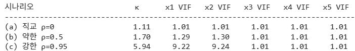

직교인 경우 VIF는 1.0 부근이고 $\kappa$ 도 1에 가까워 안정적이다. 약한 상관에서는 VIF가 1.3 안팎, $\kappa$ 는 1.7로 여전히 안정적이다. 강한 상관에서는 VIF가 10에 육박할 만큼 폭주하고 $\kappa$ 도 커지지만, $\kappa$ 자체는 아직 10 미만이라 대체로 안정 범위에 머문다. 개별 Feature의 문제를 $\kappa$ 하나로는 잡아내기 어렵다는 점을 보여 주는 대목이다.

상관 행렬을 시각화하면 문제가 되는 쌍이 어디인지 바로 드러난다.

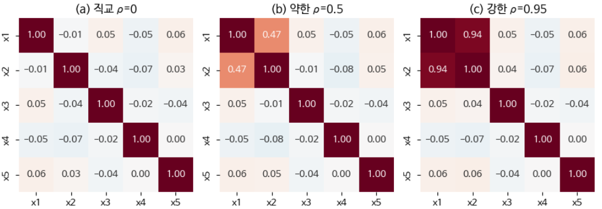

**Housing Dataset 진단.** 같은 절차를 주택 데이터에 적용한다.

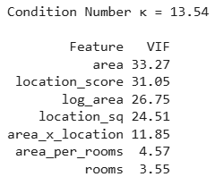

$\kappa = 13.5$ 로 보통 수준이지만, VIF가 10 이상인 Feature가 `area`, `location_score`, `log_area`, `location_sq`, `area_x_location` 으로 다섯 개나 된다. 강한 상관을 갖는 변수를 제거하거나 결합해야 한다는 신호다. 변수 사이의 상관계수를 확인하고, 고상관 피처를 제거한 뒤 다시 진단한다.

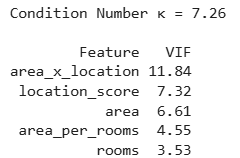

제거할 Feature를 임의로 고른 것은 아니다. area와 log_area처럼 같은 원천에서 파생된 Feature는 상관이 이 정도로 커지면 로그나 제곱근 변환본을 따로 남겨 둘 이유가 없다. 굳이 함께 써야 한다면 주성분으로 결합해 넣는 편이 학습이 더 안정적이다.

---

## 6.2.11 딥러닝에서의 적용과 Feature Stability Index
<!-- 슬라이드 419, 421 -->

### 딥러닝에서는 역할이 달라진다

지금까지의 지표를 딥러닝에 그대로 옮길 수는 없다. $\kappa$ 와 VIF의 역할은 줄어들고 Bootstrap의 역할이 커진다.

**Condition Number $\kappa$.** 딥러닝에서는 주로 입력 전처리 진단에 간접적으로 쓴다. 학습 전에 Feature 행렬 $X$ 의 $\kappa$ 를 확인하여 스케일링이 필요한지 판단하는 용도다. $\kappa$ 가 크면 gradient의 방향이 왜곡되어 학습이 불안정해지므로, 표준화한 뒤 다시 확인하는 것이 실무 관행이다. 최근 연구에서는 가중치 행렬의 Condition Number를 정보 인코딩의 유의성을 재는 프록시로 사용하기도 한다.

**VIF와 상관 행렬.** 전처리 단계의 진단으로 사용한다. 딥러닝은 비선형 학습을 통해 다중공선성을 어느 정도 처리할 수 있지만, 고도로 상관된 Feature는 여전히 중복성과 계산 비용 증가를 유발한다. 그래서 딥러닝에서도 입력 단계에서 VIF와 상관 행렬로 중복 Feature를 제거한 뒤 학습하는 것이 일반적이다. 모델 내부의 진단이 아니라 **데이터 품질 진단**의 역할을 맡는 셈이다.

**Bootstrap.** 다중공선성 진단보다는 안정성 측정의 목적으로 더 적극적으로 사용한다. 서로 다른 초기화로 $N$ 개 모델을 학습하여 예측 분산을 재는 Deep Ensemble, 가중치 분포를 추정하는 MC Dropout, 그리고 SHAP과 Permutation Importance의 Bootstrap 신뢰구간으로 Feature 안정성을 재는 방식이 모두 여기에 속한다. 이 흐름의 종착점이 다음에 정의할 FSI다.

### FSI의 구성

**FSI(Feature Stability Index)** 는 Bootstrap으로 얻은 PI의 안정성을 0에서 1 사이의 값으로 요약한 지표다. 세 구성 요소의 가중 합으로 정의된다.

- **val_stab (가중치 0.4)** — PI 값의 변동성. $1 - CV$ 로 계산하며($CV = \text{std}/|\text{mean}|$), PI 값 자체가 얼마나 흔들리는지를 본다.
- **ci_norm (가중치 0.3)** — 신뢰구간 폭의 정규화. $1 - (\text{95\% CI 폭} / |\text{mean}|)$ 로 계산하며, 신뢰구간이 얼마나 좁은지를 본다.
- **τ_local (가중치 0.3)** — 순위 안정성. Bootstrap 반복에서 그 Feature의 순위가 얼마나 벗어나는지를 본다.

해석 기준은 다음과 같다. 0.8을 넘으면 매우 안정, 0.6~0.8이면 보통, 0.4~0.6이면 불안정, 0.4 미만이면 매우 불안정이다.

> **정리 — Part B**
> - Bootstrap은 데이터 자체로부터 추정량의 분포를 얻는 비모수 도구다. CV와 CI를 함께 보고하는 것이 표준이다.
> - VIF, Condition Number, Tolerance는 입력 데이터의 다중공선성을 측정하는 지표다.
> - 진단 순서는 Condition Number $\kappa$ → VIF → 상관 행렬 → Bootstrap CV 이다.

---

**⟨ Part C ⟩ 결론 역전의 정량 입증**

> Part B가 결과의 **변동**을 측정하는 방법이었다면, Part C는 결과가 **역전**되는 현상을 다룬다.
> 두 가지 도구를 사용한다. 하나는 부분 집단을 무시했을 때 회귀계수의 부호가 뒤집히는 조건을 설명하는 Simpson's Paradox이고,
> 다른 하나는 Kendall's τ와 Spearman ρ를 사용한 PI 순위 변동 측정이다.

## 6.2.12 Simpson's Paradox: Feature 추가로 결론이 역전된다
<!-- 슬라이드 422 -->

### 역설의 구조

**Simpson's Paradox** 는 전체 데이터에서 관찰되는 추세가 부분 집단(subgroup)에서는 정반대로 나타나는 통계적 역설이다. Feature 선택, 특히 그룹 변수를 포함할지 말지에 따라 결론이 통째로 뒤집힐 수 있음을 확인할 수 있는 사례다.

고전적인 사례는 1973년 UC Berkeley의 대학원 입학 통계다. 전체로 보면 남성 합격률이 44%, 여성 합격률이 35%로 남성이 높았다. 그런데 학과별로 나누어 보면 6개 학과 가운데 4개에서 여성의 합격률이 더 높았다.

어떻게 이런 역전이 가능한가? 여성 지원자들이 합격률이 낮은 학과(인문·사회)에 몰렸기 때문에 전체 여성 합격률이 떨어졌고, 남성 지원자들이 합격률이 높은 학과(공학·수학)에 몰렸기 때문에 전체 남성 합격률이 올라간 것이다. 학과라는 Feature를 제외하면 성별이 합격에 부정적으로 작용하는 것처럼 보이지만, 학과를 포함하면 결론이 달라진다.

---

## 6.2.13 회귀계수 부호 역전의 조건과 FWL 정리
<!-- 슬라이드 423~424 -->

이 현상을 회귀의 언어로 옮겨 보자. 단순 회귀는

$$y = \alpha + \beta x + \varepsilon$$

이고 다중 회귀는

$$y = \alpha' + \beta' x + \gamma z + \varepsilon$$

이다. 역전 조건은 두 계수의 부호가 다른 것, 곧 $\mathrm{sign}(\beta) \neq \mathrm{sign}(\beta')$ 이다.

여기서 프리시–워–로벨(Frisch–Waugh–Lovell, FWL) 정리가 $\beta'$ 의 정체를 알려 준다.

$$\beta' = \frac{\mathrm{Cov}\left(x_{\perp z},\, y_{\perp z}\right)}{\mathrm{Var}\left(x_{\perp z}\right)}$$

여기서 $x_{\perp z}$ 는 $x$ 를 $z$ 에 회귀한 뒤 남은 잔차, 곧 $z$ 의 영향을 제거한 $x$ 다. 구체적으로 $x$ 를 $z$ 에 회귀하면 $x = a + b z + e_x$ 가 되고, 그 잔차 $e_x$ 가 $x_{\perp z}$ 다. 벡터공간의 언어로는 $z$ 성분을 제거하는 것이 기하학적으로 수직·직교화에 해당하므로 $\perp$ (perpendicular) 기호를 쓴다.

역전이 일어나는 상황은 다음 두 조건이 함께 성립할 때다.

- $z$ 가 $x$ 와 강하게 상관되어 있다(혼란 변수).
- $z$ 가 $y$ 에 대해 $x$ 와 반대 방향의 효과를 갖는다.

이때 $x \to y$ 관계를 부분 집단으로 나누어 보면, $z$ 가 흡수하고 있던 효과가 드러난다. 흔히 드는 예가 "약($x$)을 많이 먹을수록 건강($y$)이 나빠진다"는 관찰이다. 여기에는 중증도($z$)라는 혼란 변수가 숨어 있다. 즉 $z$ 를 무시한 단순 회귀는 $z$ 의 효과가 $x$ 에 흡수되어 만들어진 **가짜 패턴**이다.

> **핵심 메시지**
> Simpson's Paradox는 Feature 선택의 가설성을 가장 극단적으로 보여 주는 사례다. 변수 하나를 넣고 빼는 결정이 결론의 부호를 통째로 바꾼다.

### FWL 정리가 갖는 의미

FWL 정리는 다중회귀분석이 다른 교란 요인(통제 변수)을 통제한 상태에서 특정 변수의 순수한 효과를 어떻게 추출하는지, 그 직교화 과정을 수학적으로 완전하게 표현한다. 세 가지 의미가 있다.

**통제(Control)의 수학적 본질.** 회귀분석에서 "다른 변수를 통제한다"는 개념을 수학적으로 정의해 준다. FWL이 말하는 통제란 관심 변수와 종속변수 양쪽에서 통제 변수의 선형적 영향을 제거하고 순수한 관계(잔차)만 남기는 작업이다. 이 작업의 비선형 확장이 다항식 항, 스플라인, 커널 방법 등이다.

**인과추론의 직교화.** 데이터 과학과 인과추론에서 편향 제거(debiasing) 알고리즘의 이론적 근거가 된다.

**부분회귀 플롯.** 다중 회귀에서 관심 독립변수(예: 수업 시간)가 종속변수(예: 성취도)에 미치는 순수한 영향을, 통제 변수(예: 수준)의 효과를 제거한 뒤 시각화하는 도구다. FWL 정리를 활용한 이 부분 회귀 플롯(Added Variable Plot)으로 Simpson's Paradox를 극복한 결과를 만들어 낼 수 있다. 구체적인 확인은 실습 6.2.4에서 한다.

### 실습 6.2.4 — Simpson's Paradox와 FWL을 활용한 부분 회귀 플롯

> 노트북: `code/6.2.4.Simpson_역전.ipynb`

**데이터.** 합성 교육 데이터를 사용한다. 초급·중급·고급 세 그룹이 있고, 그룹별로 수업시간과 성취도의 관계가 정의되어 있다.

**단순 회귀.** 그룹 변수를 무시하고 $y = \beta_0 + \beta x$ 를 적합하면 음의 효과가 나타난다.

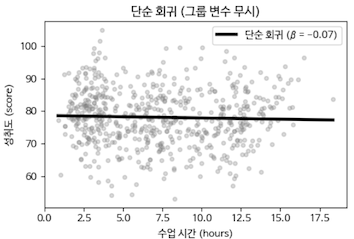

**다중 회귀.** 그룹(level)을 one-hot으로 넣어 $y = \beta_0' + \beta' \cdot \text{hours} + \gamma \cdot \text{level}$ 을 적합하면 부호가 역전되어 양의 효과가 된다. 이때 기울기는 세 그룹에서 같고 절편만 달라지므로 평행선의 형태가 된다.

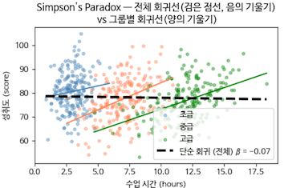

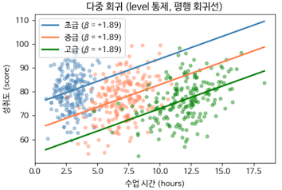

**그룹별 회귀.** 각 그룹 안에서 회귀선을 따로 그리면 모두 양의 효과가 확인된다. 산점도에 그룹별 색을 입히고 두 회귀선을 함께 그려 대비를 시각화한다.

**부분 회귀 플롯.** 세 그룹을 통제변수로 하여 순차적으로 영향을 제거하고, 수업시간과 성취도의 순수한 관계를 확인한다. 절차는 세 단계다.

1. `hours` 에서 `level` 의 영향을 제거한 잔차를 계산한다.
2. `score` 에서 `level` 의 영향을 제거한 잔차를 계산한다.
3. 두 잔차 사이의 산점도와 회귀선을 시각화한다.

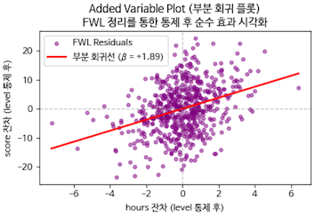

이 부분 회귀선의 기울기가 다중 회귀 계수와 정확히 같다는 점을 확인한다. FWL 정리가 말하는 "통제"의 의미가 여기서 그림으로 확인된다.

---

## 6.2.14 순위 안정성 측정: Kendall's τ와 Spearman ρ
<!-- 슬라이드 425~427 -->

### 순위는 값보다 먼저 흔들린다

가장 중요한 Feature를 보고하려는데 그 순위가 Bootstrap마다 바뀐다면 어떻게 해야 하는가? 앞에서는 Bootstrap으로 Feature 중요도 **값**의 변동성을 측정했다. 이제 중요도 **순위**의 일치도를 측정하여 순위 안정성을 확인한다.

두 순위 리스트 $r^{(a)}, r^{(b)}$ 사이의 거리를 재는 표준 측도가 두 개 있다.


순위를 따로 재는 이유는 그것이 결론 역전과 이어져 있기 때문이다. 학습할 때마다 순위는 조금씩 바뀌고, 그 변동이 극단으로 가면 결과 자체가 뒤집힌다. 값의 변동만 보아서는 이 역전의 위험이 드러나지 않는다.


### Kendall's τ (켄달 타우)

일치쌍의 수에서 불일치쌍의 수를 빼서 일치도를 직접 측정한다.

$$\tau = \frac{(\text{concordant 쌍 수}) - (\text{discordant 쌍 수})}{n(n-1)/2}$$

- **Concordant 쌍** : $\left(r_i^{(a)} - r_j^{(a)}\right)$ 와 $\left(r_i^{(b)} - r_j^{(b)}\right)$ 의 부호가 같은 쌍.
- **Discordant 쌍** : 두 값의 부호가 다른 쌍.

값의 범위는 $[-1, 1]$ 이며, $+1$ 은 완전 일치, $0$ 은 무작위, $-1$ 은 완전 역순을 뜻한다.

### Spearman ρ (순위 상관 계수)

순위 사이의 상관을 계산하여 일치도를 측정한다.

$$\rho = \mathrm{Pearson}\left(r^{(a)},\, r^{(b)}\right) = 1 - \frac{6 \sum_i d_i^2}{n\left(n^2 - 1\right)}, \qquad d_i = r_i^{(a)} - r_i^{(b)}$$

범위는 마찬가지로 $[-1, 1]$ 이고 $+1$ 이 완전 일치다.

### Bootstrap 순위 안정성

이 두 측도를 Bootstrap에 적용하면 순위 안정성 점수가 정의된다.

$$\mathrm{Stability}_\tau = \mathbb{E}_b\left[\tau\left(r^{(o)},\, r^{(b)}\right)\right]$$

여기서 $r^{(o)}$ 는 원본 데이터에서 얻은 PI 순위이고 $r^{(b)}$ 는 $b$ 번째 부트스트랩 표본에서 얻은 순위다. 모든 $b$ 에 대한 $\tau$ 의 평균이 곧 안정성 점수다.

| $\mathrm{Stability}_\tau$ | 판정 | 보고 지침 |
|---|---|---|
| $> 0.9$ | 순위가 매우 안정적이다 | "가장 중요한 5개"라는 보고를 신뢰할 수 있다 |
| $0.7 \sim 0.9$ | 보통이다 | Top-3는 신뢰할 수 있으나 4·5위는 변동 가능하다 |
| $0.5 \sim 0.7$ | 불안정하다 | 개별 순위 대신 "중요 그룹" 단위로 보고한다 |
| $< 0.5$ | 매우 불안정하다 | Feature 중요도 자체를 다시 검토해야 한다 |

### 실습 6.2.5 — Kendall τ, Spearman ρ, Top-N agreement

> 노트북: `code/6.2.5.Kendall_TopN.ipynb`

**두 지표의 특성 비교.** 먼저 가상의 순위 데이터로 두 일치도 지표의 성격을 비교한다. 7개 Feature에 대해 원본 순위, 동일한 순위, 2위와 3위만 뒤바뀐 순위, 완전 역순인 순위를 만든다.

```python
# 7 Feature 가상 순위
rank_a = np.array([0, 1, 2, 3, 4, 5, 6])   # 원본
rank_b = np.array([0, 1, 2, 3, 4, 5, 6])   # 동일
rank_c = np.array([0, 2, 1, 3, 4, 5, 6])   # 2위·3위 바뀜
rank_d = np.array([6, 5, 4, 3, 2, 1, 0])   # 완전 역순

cases = [('완전 일치', rank_b), ('1쌍 바뀜', rank_c), ('완전 역순', rank_d)]
for name, r in cases:
    tau, _ = kendalltau(rank_a, r)
    rho, _ = spearmanr(rank_a, r)
    print(f"{name:12s}  {tau:+.4f}    {rho:+.4f}")
```

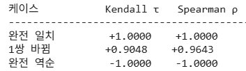

한 쌍만 뒤바뀐 경우에 Kendall τ가 0.9048, Spearman ρ가 0.9643으로 나타난다. 같은 변동에 대해 τ가 더 보수적인 값을 준다는 것을 확인할 수 있다.

**Bootstrap 순위 안정성 측정.** housing 데이터 1000 샘플에서 Bootstrap을 50회 수행하여(매 표본이 원본의 약 63.21%를 포함한다) 순위 변동을 측정한다. Kendall τ, Spearman ρ, 그리고 그 평균인 $\mathrm{Stability}_\tau$ 와 $\mathrm{Stability}_\rho$ 를 계산한다.

먼저 Engineered Feature 7개를 만들고 전체 데이터에 Random Forest를 적합하여 비교의 기준이 될 원본 PI와 그 순위를 구한다.

```python
X_raw, y = generate_housing_data(1000, SEED)      # area, rooms, location_score
eng = X_raw.copy()
eng['area_per_rooms'] = eng['area'] / np.maximum(eng['rooms'], 1)
eng['location_sq'] = eng['location_score']**2
eng['log_area'] = np.log(eng['area'])
eng['area_x_location'] = eng['area'] * eng['location_score']
fnames = ['area','rooms','location_score','area_per_rooms',
          'location_sq','log_area','area_x_location']
X = eng[fnames].values

# 원본 PI
model_full = RandomForestRegressor(n_estimators=100, random_state=SEED, n_jobs=-1).fit(X, y)
perm_full = permutation_importance(model_full, X, y, n_repeats=10, random_state=SEED,
                                   n_jobs=-1, scoring='r2')
pi_full = perm_full.importances_mean
rank_full = np.argsort(-pi_full)
```

이어 Bootstrap 표본 50개에서 각각 순위를 뽑고, 그 순위와 원본 순위 사이의 τ·ρ를 반복 계산한 뒤 평균하여 $\mathrm{Stability}_\tau$ 와 $\mathrm{Stability}_\rho$ 를 얻는다.

```python
# Bootstrap 순위 추출
B = 50
rng = np.random.default_rng(SEED)
n = len(y)
y_arr = y.values

rank_matrix = np.zeros((B, X.shape[1]), dtype=int)   # 각 부트스트랩의 순위 리스트
for b in range(B):
    idx = rng.integers(0, n, size=n)
    Xb, yb = X[idx], y_arr[idx]
    model = RandomForestRegressor(n_estimators=50, random_state=b, n_jobs=-1).fit(Xb, yb)
    perm = permutation_importance(model, Xb, yb, n_repeats=3, random_state=b,
                                  n_jobs=-1, scoring='r2')
    rank_matrix[b] = np.argsort(-perm.importances_mean)

def positional_rank(order):
    """argsort 결과를 각 Feature 의 순위(0부터)로 바꾼다."""
    p = np.zeros(len(order), dtype=int)
    for r, j in enumerate(order):
        p[j] = r
    return p

rank_full_pos = positional_rank(rank_full)
tau_list, rho_list = [], []
for b in range(B):
    rb_pos = positional_rank(rank_matrix[b])
    tau, _ = kendalltau(rank_full_pos, rb_pos)
    rho, _ = spearmanr(rank_full_pos, rb_pos)
    tau_list.append(tau); rho_list.append(rho)

stability_tau = float(np.mean(tau_list))
stability_rho = float(np.mean(rho_list))
```

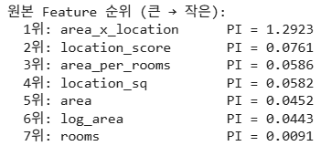

1위의 PI가 1.29인 데 비해 2위부터 6위까지는 0.04~0.08 구간에 촘촘히 몰려 있다. 값의 차이가 작은 구간에서 순위가 흔들릴 것을 예상할 수 있다.

**Top-N agreement.** 상위 N개의 **구성원**이 일치하는 비율을 확인한다. 순위의 일치가 아니라 집합의 일치라는 점에 주의한다. 원본의 Top-N과 부트스트랩의 Top-N을 비교한다.

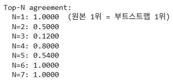


해석은 다음과 같다. N=3의 일치율이 0.12에 불과하다는 것은 상위 3개의 구성이 계속 바뀐다는 뜻이며, 아래 순위에서 올라오는 Feature가 있다는 뜻이다. 1위와 7위는 순위가 변하지 않는 부동의 요인이다. N=2와 N=3의 일치율이 낮다가 N=4에서 80%로 오르는 것은 2~4위끼리 순위가 뒤바뀐다는 의미다. N=5의 일치율이 낮다가 N=6에서 100%가 되는 것은 5~6위끼리 순위가 뒤바뀐다는 의미다.

N=6의 일치율이 1.0이라는 것의 뜻을 정확히 새길 필요가 있다. 이는 상위 6개 변수의 **멤버 구성**이 100% 같다는 뜻, 곧 7위인 `rooms` 가 6위 안으로 들어오는 일이 한 번도 없었다는 뜻이다. 순위가 바뀌지 않는다는 뜻이 아니라, 1~6위 변수들끼리 그 안에서만 순위가 바뀐다는 뜻이다.

**결론과 보고.** 이런 상황에서는 순위를 개별적으로 나열하지 말고 순위 그룹(Tier)으로 묶어 보고한다.

- **[Tier 1] 핵심 요인 (1위)** : `area_x_location`
- **[Tier 2] 주요 요인 (2~4위)** : `location_score`, `area_per_rooms`, `location_sq`
- **[Tier 3] 보조 요인 (5~6위)** : `area`, `log_area`
- **[Tier 4] 영향력 미미 (7위)** : `rooms`

정리하면, 2순위는 매번 바뀌고 2·3순위의 변동이 크며 4순위의 변동은 상대적으로 작다.

---

## 6.2.15 순위 안정성 보고 형식
<!-- 슬라이드 428 -->

### 함께 제시해야 하는 네 가지

Bootstrap PI 결과를 보고할 때는 다음 네 가지 정보를 함께 제시하는 것이 표준이다.

1. **Feature별 PI 중앙값** — Bootstrap 분포를 기준으로 한 median.
2. **Feature별 95% 신뢰구간** — 백분위(percentile) 방식으로 구한 CI.
3. **순위 안정성 점수** — $\mathrm{Stability}_\tau$.
4. **Top-N agreement** — 상위 N개 Feature가 Bootstrap 반복에서 일치하는 비율.

이 가운데 Top-N agreement는 보조 지표다. 상위 5개 Feature가 모든 Bootstrap 반복에서 동일하게 유지되는 비율을 계산하며, 90% 이상이면 "상위 5개"라는 보고를 신뢰할 수 있다고 본다.

주택 데이터에 대한 실제 보고를 예로 들면 다음과 같은 형태가 된다. 값과 신뢰구간과 CV를 함께 적고,

![Bootstrap PI 보고 예시 — location_score는 median 1.2836, 95% CI [1.1916, 1.3791], CV 0.038로 매우 안정, area는 median 0.7423, CI [0.6874, 0.8251], CV 0.050으로 매우 안정, rooms는 median 0.0391, CI [0.0315, 0.0506], CV 0.136으로 보통](images/s428_02.png)

CV를 보면 location_score와 area는 0.05 이하로, 200회를 반복하는 동안 중요도가 사실상 변하지 않았다. 반면 rooms는 0.136으로 셋 중 변동이 가장 크다. CV는 0.1 이하일 때 좋다고 보고, 0.3을 넘으면 그때부터 Feature를 다시 고민해야 한다.

순위 쪽 지표를 함께 붙인다.


> **정리 — Part C**
> - Simpson's Paradox — Feature, 특히 그룹 변수를 추가하면 회귀계수의 부호가 통째로 역전될 수 있다.
> - 진짜 결론은 통계가 아니라 인과 구조와 도메인 지식이 결정한다.
> - Kendall's τ와 Spearman ρ는 Bootstrap PI 순위의 안정성을 정량화한다. $\mathrm{Stability}_\tau > 0.9$ 이면 안정으로 판단한다.

---

**⟨ Part D ⟩ Feature 가설 종속성 보고 형식**

> Part A·B·C의 도구를 어떻게 종합하여 신뢰할 수 있는 결론으로 보고할 것인가?
> 답은 두 갈래다. 하나는 가설 종속성 지표 3종을 하나로 묶은 **FSI(Feature Stability Index, Feature 가설 안정성 지표)** 이고,
> 다른 하나는 FSI에 신뢰구간과 시드 다양성과 한계 명시를 더한 보고 형식이다.

## 6.2.16 FSI: 가설 종속성 지표 3종의 통합
<!-- 슬라이드 429~430 -->

> 관련 노트북: `code/6.2.6.FSI_보고형식.ipynb`

### 정의

개별 지표들을 종합하여 단일한 값으로 보는 보고 형식이 필요하다. Feature $j$ 에 대한 종합 안정성 지표는 다음과 같이 정의한다.

$$FSI_j = w_1 \cdot \left(1 - CV_{j,\text{clipped}}\right) + w_2 \cdot CI_{\text{width,norm}} + w_3 \cdot \mathrm{Stability}_{\tau,\text{local},j}$$

각 항의 뜻은 다음과 같다.

- $CV_{j,\text{clipped}} = \min(CV_j,\, 1.0)$ — 변동 계수를 0에서 1 사이로 절단한 값이다.
- $CI_{\text{width,norm}} = 1 - \dfrac{Q_{97.5} - Q_{2.5}}{|\mu|}$ — 신뢰구간 폭을 평균 크기로 정규화하여 뒤집은 값이다. 신뢰구간이 좁을수록 커진다.
- $\mathrm{Stability}_{\tau,\text{local},j}$ — Feature $j$ 가 상위에 머무는 빈도에 평균 Kendall τ를 곱한 값이다.
- 가중치는 도메인에 따라 조정하되 기본값은 $w_1 = 0.4$, $w_2 = 0.3$, $w_3 = 0.3$ 으로 둔다.

### 해석

FSI의 범위는 $[0, 1]$ 이며 1이 매우 안정, 0이 매우 불안정을 뜻한다.

| FSI 값 | 판정 | 보고 지침 |
|---|---|---|
| $FSI > 0.8$ | 매우 안정 | Feature에 대한 결론을 단정하여 보고할 수 있다 |
| $0.6 \le FSI < 0.8$ | 보통 | 신뢰구간과 함께 보고한다 |
| $0.4 \le FSI < 0.6$ | 불안정 | 잠정적 결과임을 명시한다 |
| $FSI < 0.4$ | 매우 불안정 | Feature 자체 또는 모델·데이터를 재검토한다 |

한 가지 주의가 필요하다. FSI는 종합 지표이므로 통합 과정에서 진단 정보가 손실된다. 따라서 개별 CV, CI, τ도 반드시 함께 보고해야 한다. 예를 들어 $FSI = 0.7$ 인 Feature가 있을 때, CV가 매우 작고 CI도 좁은데 τ만 낮다면 그것은 **값은 안정적이지만 순위가 흔들리는 Feature**다. 이런 Feature를 Top-N 목록에 넣어 보고할 때는 주의해야 한다.

### 네 지표의 역할 비교

FSI는 의사결정용 종합 지표이고, 진단을 위해서는 CV·CI·τ 세 요소를 모두 확인해야 한다. 가중치 $w_1, w_2, w_3$ 는 도메인의 우선순위, 즉 "값의 안정성"을 중시할지 "순위의 안정성"을 중시할지를 반영하여 조정해 사용한다.

| 지표 | 측정 대상 | 강점 | 약점 |
|---|---|---|---|
| CV (Coefficient of Variation) | 값의 변동성 | 직관적이며 숫자 하나로 요약된다 | PI가 0에 가까운 Feature에서 값이 폭주한다 |
| 신뢰구간 (Bootstrap CI) | 값의 범위 | 통계적 추론의 표준이다 | 폭이 클 때 해석이 모호해진다 |
| Kendall's τ | 순위 일치도 | 쌍별 비교라서 robust하다 | 값 자체의 정보가 손실된다 |
| FSI (통합) | 종합 안정성 | 의사결정용 단일 점수를 준다 | 가중치 선택에 임의성이 있다 |

표에서 CV와 신뢰구간을 나란히 둔 이유가 여기에 있다. CV는 상대적인 변동성이라서 그 Feature가 실제로 얼마나 중요한지, 즉 PI의 절대 크기는 보여 주지 못한다. 따라서 CV로 안정성을 판단하고 CI로 값의 크기와 변동 폭을 함께 확인해야 하며, CV만 쓰는 보고는 성립하지 않는다.

---

## 6.2.17 신뢰할 수 있는 Feature 분석 보고 형식
<!-- 슬라이드 431, 433~435 -->

> 관련 노트북: `code/6.2.6.FSI_보고형식.ipynb`

### 이해관계자를 위한 보고서의 다섯 요소

Feature 분석 결과를 보고할 때는 다음 다섯 가지를 갖춘다.

1. **Feature 중요도 PI 표** — Median + 95% CI + FSI. 평균 같은 단일 값만으로 보고하지 않는다.
2. **순위 안정성** — $\mathrm{Stability}_\tau$ + Top-N agreement. 가장 중요한 Feature를 몇 개 보고할 것인지에 반드시 필요하다.
3. **다중공선성 진단** — VIF 표 + Condition Number. 회귀 모델일 때는 필수다.
4. **Simpson's Paradox 점검 결과** — 잠재적인 그룹 변수를 식별하고, 그것을 추가했을 때 결론이 변하는지 확인한다.
5. **재현성 정보** — Bootstrap $B$, 시드 다양성(시드 수), 모델 종류, 데이터 버전.

### 좋은 보고의 예

주택 데이터를 예로 들면 보고문은 다음과 같은 형태가 된다.

- Feature 중요도 PI 분석 : Bootstrap $B = 200$, 시드 10개의 평균 결과.
- Condition Number $\kappa = 18$ (보통 수준이며 다중공선성의 경계에 있다).
- Simpson's Paradox 점검 : 잠재 그룹 변수(지역)를 추가하면 면적 계수의 부호는 유지되지만 위치 계수의 크기가 30% 감소한다. 일부 효과가 "지역" 변수로 흡수된 것이다.
- 결론 : 면적은 신뢰할 수 있는 가장 중요한 Feature다. 방수와 위치는 다중공선성 때문에 순위가 흔들리지만 둘 중 하나는 반드시 필요하다(그룹 단위의 결론).
- 재현성 정보 : Bootstrap $B = 200$, 시드 [42, 0, 1, 2, …, 9], scikit-learn 1.3, Python 3.11.

이때 Feature 표는 다음과 같은 형태로 제시한다.

| Feature | PI Median | CI (PI 95%) | FSI | 비고 |
|---|---|---|---|---|
| 면적 | 0.45 | [0.38, 0.52] | 0.91 | VIF=2.1, 모든 Bootstrap에서 1위 |
| 방수 | 0.23 | [0.05, 0.41] | 0.62 | VIF=4.8, 60%만 2위 — 위치와 경쟁한다 |
| 위치 | 0.18 | [0.02, 0.35] | 0.58 | VIF=4.5, 40%에서 2위로 부상한다 |

> **핵심 메시지**
> 가설 종속성을 받아들이는 분석 보고서란, 곧 가설 종속성을 드러내는 보고 형식을 갖춘 보고서다.

### 실습 6.2.7 — Housing Data 종합 분석

> 노트북: `code/6.2.7.W11_주택_통합분석.ipynb`

앞의 도구를 모두 모아 하나의 데이터셋에 적용한다.

**데이터.** $X$ 의 형태는 (1000, 7)이고 Feature는 `area`, `rooms`, `location_score`, `area_per_rooms`, `location_sq`, `log_area`, `area_x_location` 이며 타깃은 `price` 다.

**1단계 — 다중공선성 진단.** VIF와 Condition Number $\kappa$ 를 계산한다.

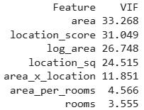

VIF가 10 이상인 Feature가 5개이고 $\kappa = 13.5$ 로 보통 수준이다. 즉 전체 지표는 경계선에 있지만 개별 Feature 여럿이 다른 Feature들과 강하게 상관되어 있다. VIF가 큰 Feature를 제거하거나 결합해야 한다.

**2단계 — Bootstrap PI 측정.** $B = 100$ 으로 Random Forest Regressor를 반복 학습하며 PI의 중앙값, 95% 신뢰구간, 변동 계수를 계산한다.

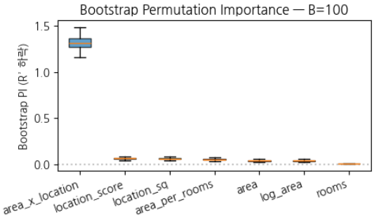

![Bootstrap PI 수치표 — area_x_location median 1.3088에 CI [1.1910, 1.4360]·CV 0.0531, location_score 0.0646에 CI [0.0466, 0.0803]·CV 0.1403, 이하 location_sq·area_per_rooms·area·log_area·rooms 순으로 CV가 0.15~0.20 구간에 분포한다](images/s433_03.png)

**3단계 — 순위 안정성과 FSI.** Kendall's τ와 Top-3 agreement를 계산한다. N=3의 일치율이 낮고, 아래 순위에서 올라오는 Feature가 상당히 있다. 이어 CV·CI·τ를 통합한 Feature Stability Index를 계산한다.

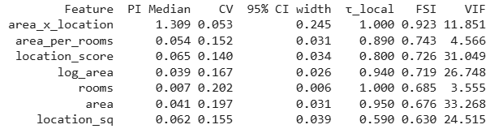

FSI 기준으로는 0.4 미만인 Feature가 없으므로 불안정한 Feature는 없다고 판정된다.

**4단계 — Random Forest와 Linear Regression의 안정성 비교.** 같은 데이터에서 두 모델의 안정성을 비교한다.

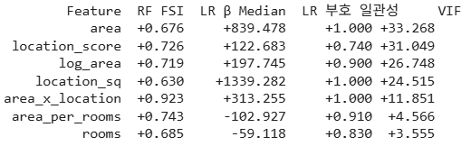

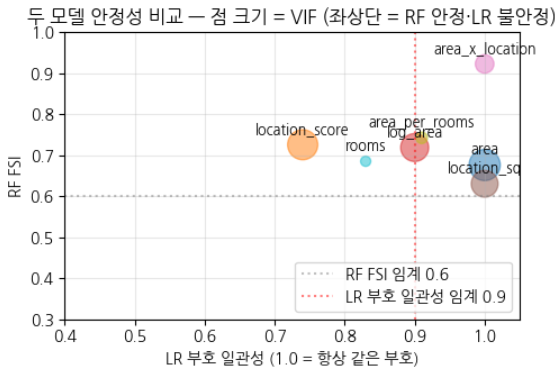

해석하면, 일부 Feature에서 Linear Regression의 계수 부호가 흔들린다. 그리고 이 흔들림은 VIF 수치와 반드시 대응하지는 않는다. 반면 RF의 FSI는 대체로 양호하다. 즉 **Linear Regression이 다중공선성의 영향을 훨씬 많이 받는다.**

**5단계 — Deep Ensemble을 포함한 비교.** Deep Ensemble($M = 10$, $B = 200$)의 Feature 안정성을 확인하고 PI의 변화를 비교한다. RF의 FSI, MLP Ensemble의 PI 중앙값, LR의 부호 일관성, VIF를 나란히 놓는다.

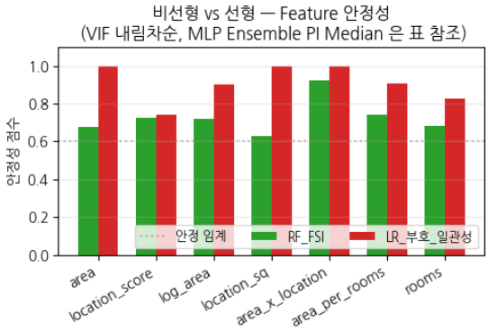

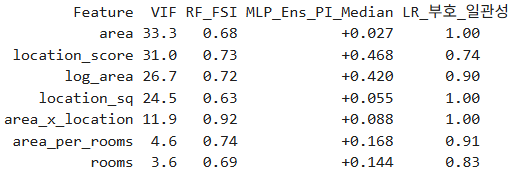

진단 결과 RF_FSI의 평균은 0.73이고 LR 부호 일관성의 평균은 0.91이다. 해석하면 RF와 MLP Ensemble 같은 비선형 모델은 다중공선성에 둔감하여 안정적이고, 부호 일관성이 0.9 미만으로 떨어지는 불안정 Feature는 LR 모델에 한정된다.

따라서 보고 형식은 이렇게 정한다. 중요도는 비선형 모델(RF, MLP)의 결과를 메인으로 삼고, LR의 부호 일관성은 다중공선성에 대한 참고 지표로 남긴다.

---

## 6.2.18 딥러닝 모델을 쓸 때 추가로 보고할 항목
<!-- 슬라이드 432, 436~437 -->

### 딥러닝 모델을 쓸 때 추가로 보고할 여섯 항목

신경망이나 Deep Ensemble을 사용했다면 결과의 재현과 검증에 필요한 항목 여섯 개를 추가로 보고해야 한다.

- **M (Ensemble size)** — 독립적으로 학습한 신경망의 개수. $M \ge 5$ 를 권장하며 분산이 $1/\sqrt{M}$ 로 감소한다.
- **T (MC Dropout 샘플 수)** — MC Dropout을 사용할 때의 forward pass 횟수. $T = 50 \sim 200$ 을 쓴다.
- **초기화 시드 리스트** — 재현성 검증에 필수다(예: [0, 1, …, 9]).
- **학습 환경** — GPU/CPU 종류, 정밀도(fp32/fp16), 배치 크기, optimizer, learning rate.
- **학습 epoch** — early stopping 기준을 포함한다. 수렴 시점이 다르면 PI 결과도 달라진다.
- **Framework와 버전** — PyTorch/TensorFlow 버전, cuDNN·cuBLAS 버전. 수치 재현성의 1차 결정 요인이다.

### 실습 6.2.9 — 신경망 학습의 구조적 불안정성 검토

> 노트북: `code/6.2.9.신경망_불안정성.ipynb`

housing 데이터셋에서 신경망의 구조적 불안정성을 네 가지 방식으로 비교한다. 시드를 바꾼 단일 MLP, Deep Ensemble(M=20), MC Dropout(비율 0.2), 그리고 Snapshot Ensemble이다.

**단일 MLP의 시드 민감도.** 시드를 바꾸면 Feature의 PI 값이 달라진다.

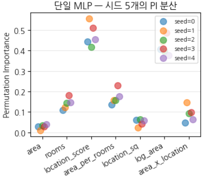

시드가 바뀌면 초기 가중치와 학습 순서가 함께 바뀌고, 신경망은 비슷하게 좋은 여러 해 가운데 하나를 고르게 된다. 그림의 흩어짐은 그 선택의 차이가 Feature 중요도로 드러난 것이다. 다섯 번 이상 학습했는데도 이 정도의 변동이 남는다면 모델에 문제가 있다고 판단한다.

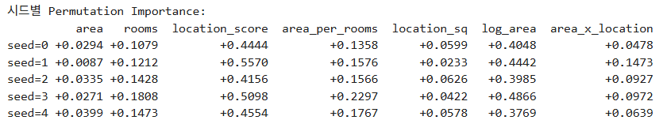

**Deep Ensemble의 분산 감소 검증.** $M = 1, 2, 5, 10, 20$ 으로 바꾸어 가며 PI를 계산하고, 그 PI 값을 Bootstrap($B = 300$)으로 다시 흔들어 변동성을 확인한다. 단일 모델 대비 얼마나 안정적인지를 PI의 표준편차로 확인한다.

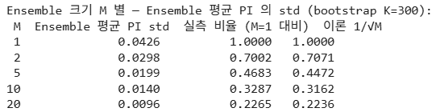

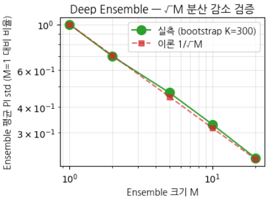

실측값과 이론값 $1/\sqrt{M}$ 이 거의 일치한다. Deep Ensemble의 분산 감소가 이론대로 작동함을 정량적으로 확인한 것이다.

**MC Dropout (Gal & Ghahramani, 2016).** Dropout을 추론 시에도 켜 둔 채 $K = 20$ 번 forward pass를 수행하여, 단일 모델만으로 ensemble 효과를 얻는다.

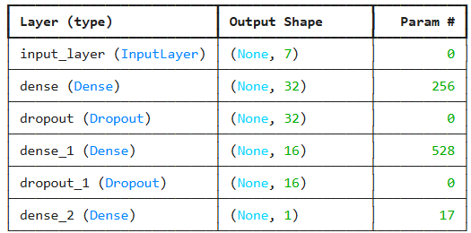

**Snapshot Ensemble.** Cyclical Learning Rate로 $M$ 개의 snapshot 모델을 만든다(Huang, 2017). 각 cycle이 끝날 때의 가중치를 저장하여 $M$ 개 모델의 ensemble을 구성한다.

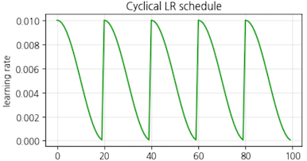

Snapshot Ensemble은 학습을 한 번만 돌리고도 앙상블 효과를 얻는 손쉬운 방법으로 알려져 있으나, 실제로는 기대만큼 잘 동작하지 않는다. 비슷한 크기의 손실 최솟값을 여럿 갖는 특별한 데이터셋에서만 효과를 보는 편이므로 기본 선택지로 삼기는 어렵다.

**모델 비교.** 네 방법의 Feature 중요도 변동성과 학습 비용을 함께 비교한다.

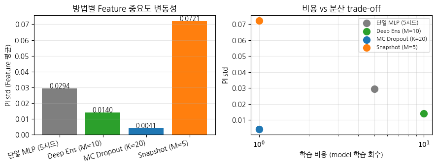

MC Dropout이 가장 낮은 변동성을 가장 낮은 비용으로 달성하고, Deep Ensemble이 그다음이며, Snapshot Ensemble은 체크포인트 사이의 상관이 높아 변동성이 오히려 크게 나타난다. 앞서 정리한 세 대책의 성질이 수치로 확인되는 지점이다.

> **정리 — Part D**
> - 단일 점추정 결과를 그대로 인용하는 것은 금지한다. 항상 분포·신뢰구간·안정성과 함께 보고한다.
> - FSI는 CV, CI, τ를 통합한 의사결정용 단일 점수다. 진단할 때는 항상 세 구성 요소를 모두 확인한다.
> - 신뢰할 수 있는 Feature 분석 보고의 다섯 요소는 PI Median+CI+FSI / $\mathrm{Stability}_\tau$+Top-N / VIF+$\kappa$ / Simpson 점검 / 재현성 정보다.

---

## 6.2.19 정리
<!-- 슬라이드 438 -->

> **정리**
> 6.1이 "Feature는 객관적 데이터 속성이 아니라 데이터를 바라보는 가설"이라고 주장했다면, 6.2는 그 가설의 변경에 따른 결론의 변화가 얼마나, 어떤 방식으로 일어나는지를 정량화하여 입증했다. 나아가 가설이 결론을 좌우한다는 사실을 측정하고 신뢰할 수 있게 보고하는 방법을 다루었다.
>
> **Part A** — Feature 불안정성은 가설 종속성의 정량 신호이지 모델의 결함이 아니다. 불안정성의 세 원인은 다중공선성, 샘플 부족, 모델 구조 민감도이며 세 차원을 모두 점검해야 한다.
>
> **Part B** — Bootstrap은 데이터 자체로부터 추정량의 분포를 얻는 비모수 도구이며, CV와 CI를 함께 보고하는 것이 표준이다. VIF, Condition Number, Tolerance는 입력 데이터의 다중공선성을 측정하는 지표이고, 진단 순서는 $\kappa$ → VIF → 상관 행렬 → Bootstrap CV 이다.
>
> **Part C** — Simpson's Paradox에서 보듯 Feature, 특히 그룹 변수를 추가하면 회귀계수의 부호가 통째로 역전될 수 있다. 진짜 결론은 통계가 아니라 인과 구조와 도메인 지식이 결정한다. Kendall's τ와 Spearman ρ는 Bootstrap PI 순위의 안정성을 정량화하며 $\mathrm{Stability}_\tau > 0.9$ 이면 안정으로 본다.
>
> **Part D** — FSI는 CV, CI, τ를 통합한 의사결정용 단일 점수이며, 진단할 때는 항상 세 구성 요소를 모두 확인해야 한다. 신뢰할 수 있는 Feature 분석 보고의 다섯 요소는 PI Median+CI+FSI, $\mathrm{Stability}_\tau$+Top-N, VIF+$\kappa$, Simpson 점검, 재현성 정보다.
