# 7.1 Attribution (기여도 배분)

**학습 목표**

- Attribution(기여도 배분)의 정의를 말하고, Saliency Map에서 Integrated Gradients에 이르는 다섯 세대의 진화가 무엇을 보완해 왔는지 설명할 수 있다.
- 국소 민감도·공정 분배·글로벌 패턴이라는 세 가지 질문 유형을 구분하고, 주어진 상황에 맞는 Attribution 도구를 선택할 수 있다.
- Gradient가 측정하는 것이 Feature의 객관적 중요도가 아니라 모델에 **강제된 의존 구조**임을 논증하고, Attribution 결과를 오독 없이 보고하는 문장을 쓸 수 있다.
- Integrated Gradients의 경로 적분식과 완전성·구현 불변성 공리, Shapley value의 정의식과 네 공리를 각각 유도의 맥락 속에서 설명할 수 있다.
- SHAP Family(KernelSHAP·Sampling·Tree·DeepSHAP·CausalSHAP)를 모델 타입과 Feature 상관 구조에 따라 선택하고, 관찰 방식과 중재 방식의 차이를 설명할 수 있다.
- Kendall $\bar{\tau}$ 와 Sanity Check로 Attribution 결과의 신뢰성을 검증하고, Spurious Correlation에 의존하는 모델을 진단할 수 있다.
- Pearl의 인과 사다리 위에서 Attribution과 Counterfactual Explanation이 각각 어느 단계에 놓이는지 판별하고, Attribution을 인과적으로 읽을 때 생기는 오류를 지적할 수 있다.

**이 절의 구성**

*⟨ Part A ⟩ Attribution 이란 무엇인가, 정의와 의존구조 관점*

- 7.1.1 Attribution의 정의와 다섯 세대
- 7.1.2 Attribution이 답하는 세 가지 질문
- 7.1.3 Gradient는 Feature 중요도가 아니다
- 7.1.4 Gradient × Input과 1차 근사의 한계 — 실습 7.1.1
- 7.1.5 Attribution 결과를 보고하는 언어

*⟨ Part B ⟩ Attribution 노이즈 저감 도구 : IG, SmoothGrad, SHAP*

- 7.1.6 Integrated Gradients: 경로 적분과 두 공리
- 7.1.7 공리 만족이 왜 중요한가: 규제와 의미 있는 설명
- 7.1.8 Baseline 선택과 Riemann 근사 — 실습 7.1.2
- 7.1.9 SmoothGrad와 네 번째 재샘플링 축 — 실습 7.1.3
- 7.1.10 SHAP: Shapley value의 기계학습 응용
- 7.1.11 관찰이냐 중재냐: Shapley 계산 방식의 분기
- 7.1.12 SHAP Family의 비교와 선택 — 실습 7.1.7

*⟨ Part C ⟩ Attribution 신뢰성 검증 : 방법 간 일치도와 Sanity Check*

- 7.1.13 Attribution 방법 간 일치도: Kendall τ̄ — 실습 7.1.4
- 7.1.14 Sanity Check: 모델 무작위화와 라벨 무작위화 — 실습 7.1.5

*⟨ Part D ⟩ Spurious Correlation 탐지와 학습된 표현의 의미*

- 7.1.15 Spurious Correlation: 가짜 상관에 의존하는 모델
- 7.1.16 Spurious 탐지 워크플로우와 실증 사례 — 실습 7.1.6
- 7.1.17 TCAV: 학습된 표현이 인코딩한 개념 — 실습 7.1.8 (개념 정렬도)

*⟨ Part E ⟩ Attribution 의 한계와 인과 추론 입문*

- 7.1.18 Counterfactual Explanation: 바꾸면 어떻게 되는가
- 7.1.19 DiCE: 실행 가능한 반사실 생성 — 실습 7.1.9
- 7.1.20 Causal vs Associational: Pearl의 인과 사다리(The Causal Hierarchy)
- 7.1.21 정리

> 실습 번호는 강의 슬라이드의 번호를 그대로 쓴다. 소절 번호와는 무관하다.

---

**⟨ Part A ⟩ Attribution 이란 무엇인가 — 정의와 의존구조 관점**

> Attribution의 정의와 역사를 Saliency Map에서 Integrated Gradients까지 훑는다.
> 6.2가 가설 변경에 따른 결론 변화를 정량화하는 작업이었다면, 7.1은 그 다음 질문을 던진다.
> Feature 기여도가 데이터의 인과적 본질을 설명하는가?

## 7.1.1 Attribution의 정의와 다섯 세대
<!-- 슬라이드 444~445 -->

### 6.2에서 7.1로

6.2는 가설을 변경했을 때 결론이 얼마나, 어떤 방식으로 바뀌는지를 정량화하여 입증하는 작업이었다. 7.1은 그 다음 질문을 던진다. **Feature의 기여도가 데이터의 인과적 본질을 설명하는가?** 이 질문은 이 절 전체를 관통한다. 기여도 분석은 모델이 무엇에 의존하는지를 매우 정밀하게 보여주지만, 그 정밀함이 곧 인과적 진실을 뜻하지는 않는다.

이 절의 앞부분(Part A)에서는 Attribution이 무엇인지를 정의와 의존구조의 관점에서 다룬다. 정의와 역사, 즉 Saliency Map에서 Integrated Gradients까지의 흐름이 출발점이다.


### 결정의 근거를 왜 드러내야 하는가

모델의 결정 근거를 드러내야 하는 첫 번째 이유는 신뢰다. 모델이 어떤 출력을 만들어 냈을 때 왜 그런 결론이 나왔는지 말할 수 있어야 한다. 의료·법률·금융처럼 결정이 사람에게 직접 영향을 주는 영역에서는 모델을 배포하기 전에 이 설명이 가능한지가 조건으로 걸린다. 그리고 7.1이 하는 일은 기여도가 인과적 본질을 설명하지 못한다는 것을 확인하는 데서 끝나지 않는다. 설명하지 못하더라도 이 도구들은 여전히 쓰이며, 어디까지 쓸 수 있고 어디부터 쓸 수 없는지를 그어 두는 것이 이 절의 목적이다.

### 설명가능성의 세 축에서 Attribution의 자리

모델을 들여다보는 방법은 하나가 아니다. 첫째는 입력과 출력의 관계를 각 Feature에 분배해 보는 것이며, 이것이 7.1에서 다루는 Attribution이다. 둘째는 모델 내부의 요소들이 서로 어떻게 참조하는지를 보는 것이다. Self-Attention을 중심으로 한 구조에서 Attention을 읽어 요소 사이의 의존 분포를 확인하는 방식이며 7.2에서 다룬다. 셋째는 가중치와 활성값의 분포를 보고 모델이 데이터를 어떤 표현으로 압축했는지를 확인하는 것으로, 특정 성격의 뉴런에 가중치가 몰려 있는지 같은 것을 보며 7.3에서 다룬다.

### 축이 서로 어긋날 때

세 축은 보는 대상이 다르므로 결과가 언제나 같은 방향을 가리키지는 않는다. 결과가 어긋나면 모델 해석에 모순이 생기고, 그때는 학습이 잘못되었는지 데이터가 잘못되었는지 해석이 잘못되었는지를 따로 검증해야 한다. 여기에서도 같은 구분이 되풀이된다. Attention은 중요도처럼 보이지만 실제로 보여 주는 것은 의존 분포다. 의존한다는 것은 서로 얽혀 있다는 뜻이지 중요하다는 뜻이 아니다.


### Attribution의 정의

> **정의 — Attribution (기여도 배분)**
> 모델 $f$ 가 입력 $x$ 에 대해 $f(x)$ 를 출력할 때, 각 Feature $x_j$ 가 그 출력에 대해 갖는 기여도를 측정하는 도구들의 총칭.

정의 자체는 단순하다. 어려운 것은 "기여도"라는 말이 무엇을 뜻하는지가 도구마다 다르다는 점이며, 이 절의 상당 부분이 그 차이를 다룬다.

### 다섯 세대의 진화

Attribution 도구는 한 방향으로 진화해 왔다. 그 방향은 Attribution의 **안정성·공정성·공리(axiom) 만족도를 강화**하는 쪽이다. 1세대 Vanilla Gradient가 안고 있던 노이즈와 포화 문제를 2세대에서 4세대까지가 서로 다른 우회로로 보완했고, 5세대 Integrated Gradients에 와서 처음으로 완전성과 구현 불변성이라는 두 공리를 동시에 만족하게 되었다.

다음 표는 각 세대가 붙잡은 핵심 아이디어와 그 대가로 남긴 한계를 정리한 것이다.

| 세대 | 방법 | 핵심 아이디어 | 주요 한계 |
|---|---|---|---|
| 1세대 | Saliency Map (Vanilla Gradient) — Simonyan 2013 | $\partial f / \partial x_j$ 로 픽셀 민감도 측정 | Gradient 포화, 노이즈 |
| 2세대 | Grad-CAM (CAM 일반화) — Selvaraju 2017 | 마지막 conv layer 기울기 평균을 공간 가중치로 사용 | 분류 문제·CNN 한정 |
| 3세대 | LIME (Local Surrogate) — Ribeiro 2016 | 한 입력 주변에서 모델을 선형 회귀로 근사 | 근사 품질, perturbation 비용 |
| 4세대 | SHAP (Shapley value) — Lundberg 2017 | 게임이론 Shapley 분해로 공정하게 분배 | 지수 시간 비용, 근사 필요 |
| 5세대 | Integrated Gradients (IG) — Sundararajan 2017 | baseline에서 $x$ 까지의 경로 적분으로 공리 만족 | baseline 선택에 민감 |
| 보강 | SmoothGrad · Expected Gradients — Smilkov 2017 · Erion 2021 | 입력에 노이즈를 더한 뒤 평균화 | perturbation 분포 가정 |

### 세대별 학술 맥락

같은 표를 시간 순으로 다시 읽으면, 각 세대가 어떤 문제 때문에 등장했고 어떤 후속 연구를 낳았는지가 드러난다.

**1세대 — Vanilla Gradient (2013).** AlexNet 이후 CNN의 내부 표현 학습이 도대체 무엇인지를 확인하려는 연구에서 출발했다. $\partial f / \partial x_j$ 를 단순히 가시화하는 Saliency Map을 제안했으며, 입력 노이즈에 매우 민감하다는 약점을 그대로 안고 있었다.

**2세대 — Grad-CAM (2017).** 픽셀 단위의 민감도 대신 마지막 conv layer의 공간 가중치라는 **더 거친 단위로 후퇴**하는 선택을 했다. 거칠어진 만큼 안정적이지만, 분류 문제와 CNN 구조에 한정되며 회귀·NLP·Transformer에는 직접 적용하기 어렵다.

**3세대 — LIME (2016).** Gradient 기반 방법이 요구하는 모델 내부 접근을 아예 우회했다. 입력 $x_0$ 주변의 값과 출력의 관계를 선형 회귀로 근사하는 방식이다. 모델 내부를 몰라도 쓸 수 있다는 장점이 있지만 instability 문제와 reproducibility 이슈가 남는다.

**4세대 — SHAP (2017).** 게임이론의 Shapley value를 처음으로 체계적으로 적용했다. **공정 분배**라는 이론적 정당성, 즉 efficiency·symmetry·dummy·additivity의 네 공리를 근거로 삼는다. 학계의 표준 도구로 자리 잡아 2024년까지 25,000회 이상 인용되었다. 다만 정확한 Shapley 계산은 지수 시간 $O(2^d)$ 를 필요로 하며, 그래서 KernelSHAP·TreeSHAP·DeepSHAP 등 근사 기법으로 발전했다.

**5세대 — Integrated Gradients (2017).** SHAP와 같은 해에 ICML에서 발표된 또 하나의 공리 기반 방법이다. SHAP의 지수 시간 문제를 우회하되, baseline에서 입력으로 이어지는 **경로 적분**이라는 전혀 다른 접근을 택했다. $x_0$ 가 픽셀 값이라면 0에서 $x_0$ 값까지의 gradient를 누적하며, 이 누적 과정이 ReLU처럼 미분이 불가능하거나 포화되는 함수의 영향을 제거한다. 완전성과 구현 불변성 두 공리를 동시에 만족하는 첫 딥러닝 Attribution으로 인정받는다. 후속 연구로는 baseline 선택의 민감성을 다룬 Sturmfels 2020, Expected Gradients를 제안한 Erion 2021 등이 있다. IG는 SHAP와 함께 의료·금융 규제 요구에 부합하는 표준 도구로 쓰인다.


### Attribution 연구가 시작된 자리

2012년 AlexNet 이전에는 신경망을 두 층 이상 쌓는 것 자체가 어려웠다. 모델이 복잡하지 않았으므로 각 Feature의 기여도를 따로 분석할 이유도 크지 않았다. 딥러닝 이후 모델이 사람이 따라갈 수 없을 만큼 복잡해지면서, 내부를 직접 열어 보는 대신 입력과 출력의 관계만으로 각 Feature가 출력에 얼마나 관여하는지를 재려는 요구가 생겼다. Attribution이라는 연구 분야는 그 요구에서 만들어졌다.

첫 도구가 재는 것은 민감도다. 출력을 입력으로 미분하여 입력이 바뀔 때 출력이 얼마나 바뀌는지를 보며, 이미지라면 특정 픽셀에 출력이 얼마나 민감하게 반응하는지를 본다. saliency에 정확히 대응하는 우리말이 없어 이 절에서는 민감도로 옮긴다. 중요한 연구는 2017년 무렵 대부분 정리되었고, Expected Gradients처럼 그 뒤에 나온 연구들은 이 위에 얹힌 것이다.


---

## 7.1.2 Attribution이 답하는 세 가지 질문
<!-- 슬라이드 446 -->

### 도구마다 다른 질문에 답한다

Attribution 도구들은 겉보기에 모두 "어떤 Feature가 중요한가"에 답하는 것처럼 보이지만, 실제로는 **서로 다른 질문**에 답하고 있다. 이 구분 없이 결과를 나란히 놓고 비교하면 잘못된 결론이 나온다. 따라서 먼저 어떤 질문에서 어떤 답을 얻을 것인지를 결정하고, 그 질문에 맞는 도구를 선택해야 한다.

다음 표는 세 가지 질문 유형과 각각의 대표 도구, 그리고 그 도구가 실제로 쓰이는 영역을 정리한 것이다.

| 질문 유형 | 질문 내용 | 대표 도구 | 쓰임 영역 |
|---|---|---|---|
| 국소 민감도 | 이 입력의 변화에 모델이 얼마나 민감한가? (점) | Vanilla Gradient, SmoothGrad | 단일 샘플 디버깅 |
| 공정 분배 | 이 예측에 각 Feature는 얼마나 기여했는가? (누적) | SHAP, IG (공리 만족) | 투명성 보고, 규제 대응 |
| 글로벌 패턴 | 모델이 데이터셋의 어떤 Feature에 의존하는가? | PI, Global SHAP, TCAV | Feature Engineering |

### 질문을 섞으면 생기는 혼란

의료 모델을 예로 들면 두 결과의 성격 차이가 분명해진다. IG로 계산했을 때 혈압이 가장 중요하다는 결과가 나왔다면, 그것은 **한 환자에 대한 국소 설명**이다. 반면 PI(Permutation Importance)로 계산했을 때 평균적으로 혈압이 가장 중요하다는 결과가 나왔다면, 그것은 **데이터셋 전체의 패턴**이다.

두 결과는 성격이 다른 답이므로, 하나의 보고서에 구분 없이 섞어 놓으면 읽는 사람에게 혼란을 준다. 어떤 환자를 두고 하는 이야기인지, 아니면 모델 전체의 경향을 두고 하는 이야기인지가 문장마다 명시되어야 한다.


### 질문을 먼저 정한다

도구를 고르기 전에 어떤 질문에 답할 것인지를 먼저 정해야 한다. 세 질문은 답의 단위가 서로 다르다. 국소 민감도는 하나의 샘플에 대한 이야기이고, 공정 분배는 그 출력을 Feature들이 나누어 갖는 이야기이며, 글로벌 패턴은 데이터셋 전체에서 모델이 어디에 기대고 있는지에 대한 이야기다. 쓰이는 자리도 그만큼 다르다. 국소 민감도는 한 샘플을 두고 모델을 디버깅할 때, 공정 분배는 투명성 보고와 규제 대응에 제출할 때, 글로벌 패턴은 전처리 단계에서 어떤 Feature를 남기고 버릴지 판단할 때 쓴다. 도구를 고르는 일과 그 결과를 어떤 문장으로 옮길지 정하는 일은 사실상 같은 작업이다.


---

## 7.1.3 Gradient는 Feature 중요도가 아니다
<!-- 슬라이드 447 -->

### 오래된 오해

"Gradient가 큰 Feature는 중요하다"는 문장은 흔하고 오래된 오해다. 이 문장이 왜 부정확한지는 두 가지 측면에서 드러난다.

### 측면 1: Gradient가 측정하는 것은 모델의 학습된 의존성이다

$\partial f / \partial x_j$ 는 입력 $x_j$ 의 변화에 따르는 모델 출력 $f(x)$ 의 변화량이다. 이 값이 알려 주는 것은 **이 모델이 $x_j$ 에 얼마나 의존하도록 학습되었는지**이며, $x_j$ 가 데이터에서 본질적으로 중요한지는 애초에 질문하지 않는다.

이 사실은 Feature 가설이라는 명제를 다른 각도에서 다시 보게 만든다. 같은 데이터라도 다른 Feature Set을 사용하여 학습하면 모델이 의존하는 Feature가 달라진다. 즉, 모델이 그 Feature에 강하게 의존한다는 사실(Gradient가 큰 Feature라는 사실)은, **데이터 자체가 그 Feature를 통해 인과적으로 결정된다는 증거가 아니다.**


### Feature 가설에서 의존성으로

6.1은 Feature가 데이터의 객관적 속성이 아니라 데이터를 보는 하나의 가설이라고 정의했다. Feature를 설정하는 행위 자체가 가설을 세우는 일이며, 6.2는 그 가설을 바꾸었을 때 결론이 얼마나 흔들리는지를 정량화하는 작업이었다. 7.1은 그 위에서 다음 질문으로 넘어간다. 그렇게 측정한 기여도가 인과적 의미를 갖는가. 이 절이 하는 일은 그것이 인과적인 것이 아님을 확인하는 과정이다.

### 중요도와 기여도와 의존도

중요도와 기여도는 같은 말이 아니다. 중요도는 그 Feature가 데이터에서 차지하는 자리에 대한 주장이고, 기여도는 이 모델의 이 출력이 각 Feature에 얼마씩 배분되는지에 대한 계산이다. Gradient가 주는 값은 둘 중 어느 쪽도 아니며, 이 모델이 그 Feature에 얼마나 의존하도록 학습되었는지를 알려 주는 신호에 가깝다. 그래서 이 절의 뒤로 갈수록 기여도라는 말보다 의존도라는 말이 정확해진다.

두 말이 섞이면 보고가 흔들린다. 중요하다고 쓰면 읽는 사람은 데이터에 대한 주장으로 받아들이고, 의존한다고 쓰면 모델에 대한 보고로 받아들인다. 같은 수치를 두고도 문장이 달라지면 결론의 무게가 달라진다.

### 인과로 넘어가지 않기

가장 흔한 오류는 의존성에서 인과성으로 한 걸음 더 나가는 것이다. 모델이 혈압에 강하게 의존하도록 학습되었다는 사실은, 혈압이 바뀌면 결과가 달라진다는 사실과 다르다. 모델은 후자를 추론하도록 학습된 적이 없다. Gradient가 큰 Feature를 인과적으로 연결된 Feature로 읽는 순간, 측정하지 않은 것을 보고하는 셈이 된다.


### 측면 2: 강제된 의존 구조라는 재해석

Gradient로 측정된 Attribution을 정확하게 해석하면 다음 문장이 된다.

> **핵심 메시지**
> 이 모델은 이 샘플에 대해 이 Feature에 의존하도록 **강제 학습되었다.**

그렇다면 무엇이 그렇게 강제했는가. 강제의 출처는 두 곳이다.

- 학습 데이터의 통계적 패턴
- 모델 구조가 갖는 inductive bias — 가중치 초기화, optimizer, 정규화 등

따라서 Attribution은 모델 결정의 설명이 아니라, **모델이 학습으로 만들어 낸 의존 구조의 지도**다. 같은 데이터와 같은 입력을 쓰더라도 모델 구조가 다르면 의존 구조가 달라진다. 같은 데이터에 다른 모델을 학습시켰을 때 서로 다른 Attribution이 나오는 사례는 보충교재 13.3 사례 1에서 다룬다.


### 같은 구조에서도 달라진다

강제의 출처 가운데 두 번째, 즉 모델 구조는 생각보다 넓은 범위를 가리킨다. 가중치 초기화, optimizer의 선택, loss 함수, 중간에 정규화 layer를 두는지 여부가 모두 여기에 들어간다. 초기화가 달라지면 학습이 지나가는 경로가 달라지고, 경로가 달라지면 도달하는 의존 구조도 달라진다. 그래서 같은 데이터와 같은 모델 구조를 쓰더라도 seed가 바뀌면 Gradient는 매번 조금씩 다른 값을 준다.

Attribution이 모델 결정의 설명이 아니라 학습된 의존 구조의 지도라는 말은 이런 뜻이다. 지도가 가리키는 것은 데이터의 성질이 아니라 이번 학습이 도달한 지점이다. 따라서 두 번의 학습에서 서로 다른 Attribution이 나왔다고 해서 둘 중 하나가 틀린 것은 아니다. 서로 다른 의존 구조를 각각 정확히 보고한 것이다.


---

## 7.1.4 Gradient × Input과 1차 근사의 한계
<!-- 슬라이드 448~451 -->

### 민감도에서 기여도로

Vanilla Gradient는 민감도를 측정한다. 여기에 입력의 실제 값을 곱하면 기여도에 가까워진다. 이것이 Gradient × Input이다.

$$gi_j(x) = \frac{\partial f}{\partial x_j}(x)\cdot x_j$$

곱셈이 하는 일은 분명하다. Gradient가 크더라도 그 입력값들의 range가 작으면 실제 기여도는 낮아진다. 즉 이 변환은 Feature가 baseline $=0$ 대비 출력에 실제로 얼마나 보탰는지를 나타내는 **1차 근사 기여도**를 준다.


곱셈을 한 번 거쳤을 뿐이므로 이 값은 여전히 1차식이다. baseline에서 입력까지 가는 동안 기울기가 달라진다면 그 변화는 이 값 안에 들어오지 않는다. 이어지는 세 가지 한계는 모두 이 1차성에서 나오며, Integrated Gradients가 하는 일도 결국 이 한 번의 곱셈을 경로 전체의 누적으로 바꾸는 것이다.


### 세 가지 한계

Gradient × Input에는 세 가지 한계가 있고, 이 한계들을 해결하는 것이 곧 Integrated Gradients다.

**1) 데이터가 있는 지점의 국소 1차 근사일 뿐이다.** 함수는 비선형이고 데이터는 제한적이므로, 이 근사는 baseline에서 입력까지의 경로 전체를 반영하지 못한다. 즉 완전성 공리를 만족하지 않는다. 게다가 모델의 복잡도에 따라 overfitting된 구간(기울기가 지나치게 큰 구간)이나 기울기가 사실상 없는 구간이 만들어질 수 있다.

**2) Baseline이 암묵적으로 0에 고정된다.** 0이 아무런 의미도 갖지 않는 Feature, 예컨대 정규화된 Feature에서는 이 고정이 해석을 왜곡한다.

**3) 포화(saturation) 문제가 있다.** ReLU 등으로 gradient가 포화되어 0이 되면 기여가 통째로 사라진다. 활성 함수는 어떤 형태이든 포화 구간을 가지며, 설령 포화가 없더라도 데이터셋 자체가 값의 한계를 갖기 때문에 학습된 결과 역시 한계 구간을 갖는다. 최종적으로 학습된 함수가 특정 피처에 대해 한계를 설정하는 셈이다.

데이터셋의 특정 피처에 대해 `min-2 ~ max+2` 구간으로 범위를 넓혀 Gradient의 변화를 그려 보면 이 현상이 눈에 보인다. 왼쪽은 출력 곡선이고 오른쪽은 그 곡선의 기울기다. 출력 곡선만 보아서는 포화 영역이 드러나지 않지만, 기울기를 그리면 양 끝이 평평해지는 포화 구간이 분명하게 나타난다.

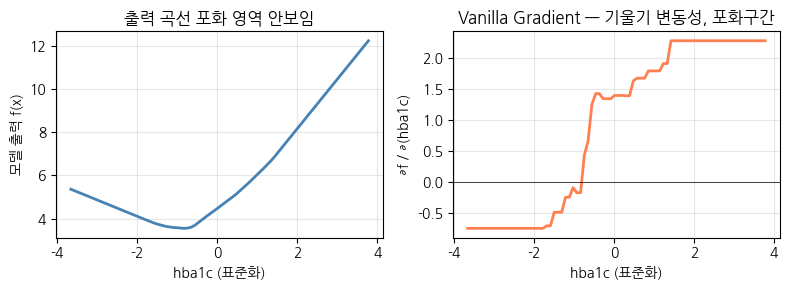

*그림 7-1. 출력 곡선에서는 보이지 않는 포화 영역이 Gradient에서는 드러난다.*

오른쪽 기울기 그래프에서 눈여겨볼 것은 평평한 양 끝만이 아니다. 중간 구간에서도 기울기가 부호를 뒤집으며 역방향으로 움직여, 일관된 민감도라고 부를 만한 값이 없다. 양 끝의 평평한 구간은 학습 데이터가 존재하지 않는 범위이며, 학습되지 않은 영역의 값이 들어가면 포화된 결과가 나온다.


국소 1차 근사의 위험은 그 점이 함수의 어디에 놓였는지에 따라 값이 크게 달라진다는 데 있다. 데이터가 적으면 학습된 함수는 국소적으로 복잡해지고, 입력을 조금만 옆으로 옮겨도 전혀 다른 기울기가 나온다. 한 점에서 잰 민감도를 그 Feature의 성질로 읽을 수 없는 이유가 여기에 있다.


### 실습 7.1.1 — Vanilla Gradient

> 노트북: `code/7.1.1.Vanilla_Gradient.ipynb`

**목적.** 합성 의료 데이터를 생성하고 MLP 모델을 학습한 뒤, Vanilla Gradient와 Gradient × Input 기법으로 Attribution을 계산한다.

**데이터 구성.** 크기는 $(500, 7)$ 이며 피처는 모두 표준화(StandardScaling)되어 있다.

- **Age** — 40~80
- **BMI** (체질량 지수) — 18~38
- **Sbp** (수축기 혈압) — 100~180
- **Glucose** (혈당) — 80~220
- **Hba1c** (당화혈색소) — 5.0~11.0. 위험도 예측에 가장 큰 영향(가중치 0.60)을 미치도록 설계된 핵심 피처다.
- **Smoke** (흡연 여부) — 0 또는 1. 타겟 변수에 미미한 영향만 주도록 설계된 spurious 피처다.
- **Noise** — 임의의 노이즈이며 타겟과 무관한 random 변수다.
- **Target $y$** (합병증 위험도) — 0~10. 위 피처들의 선형 결합에 Noise를 더해 생성한다.

**모델.** 입력 7차원, 은닉층 32와 16, 출력 1의 작은 MLP를 쓴다.

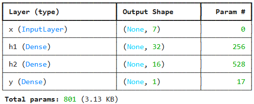

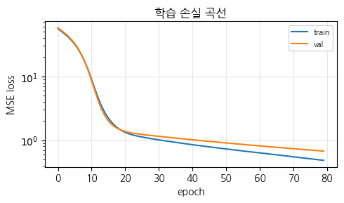

학습 손실과 검증 손실이 함께 내려가며 벌어지지 않는다. 즉 이 모델은 아직 과적합에 이르지 않았고 학습이 계속 진행되고 있는 상태이며, 뒤에서 계산하는 Attribution은 그렇게 학습된 시점의 모델을 대상으로 측정한 값이다.

**Vanilla Gradient.** 정의는 다음과 같다.

$$g_j(x) = \frac{\partial f}{\partial x_j}(x)$$

출력 $f$ 를 입력 피처로 편미분하여 그 피처에 대한 민감도를 측정한다. 절차는 학습된 모델에 test data를 넣어 예측값을 얻고, 모든 예측값을 모든 test data로 편미분한 뒤 피처별로 절댓값 평균을 구하는 것이다. 이 절댓값 평균은 데이터셋 전체로 볼 때의 민감도이므로 **전역 설명**에 해당한다.

구현은 `tf.GradientTape` 로 직접 한다.

```python
def vanilla_gradient(model, x_batch):
    """∂f/∂xⱼ — 입력 각 차원에 대한 모델 출력의 partial gradient."""
    x_tf = tf.convert_to_tensor(x_batch, dtype=tf.float32)
    with tf.GradientTape() as tape:
        tape.watch(x_tf)
        y_pred = model(x_tf, training=False)
    grads = tape.gradient(y_pred, x_tf)
    return grads.numpy()

# 전체 테스트 세트에 대해 Vanilla Gradient 산출
vg = vanilla_gradient(model, X_test)
mean_abs = np.abs(vg).mean(axis=0)
```

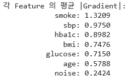

가장 민감하게 나온 피처는 smoke다. 타겟에 미미한 영향만 주도록 설계한 피처가 맨 앞에 오는 셈이다. 이 값은 현재 학습된 모델이 테스트 데이터에서 갖는 민감도일 뿐이어서 그대로 기여도로 읽을 수 없고, 그래서 다음 단계에서 입력값을 곱해 기여도로 바꾼다.

**Gradient × Input.** 민감도에 입력의 실제 값을 곱해 기여도로 바꾼다.

$$gi_j(x) = \frac{\partial f}{\partial x_j}(x)\cdot x_j$$

여기서 기여도는 $x_j$ 값이 baseline $=0$ 대비 갖는 기여도를 뜻한다. Gradient의 부호를 쓰지 않는 경우와 비교해 보면, 샘플에 따라 음의 기여도의 크기도 중요하다는 점이 드러난다. 이 실습에서는 개별 샘플에 대한 기여도 분석을 수행한다.

```python
def grad_x_input(model, x_batch):
    """giⱼ(x) = (∂f / ∂xⱼ)(x) · xⱼ — IG 의 1-step 근사 (baseline=0)."""
    grads = vanilla_gradient(model, x_batch)
    return grads * x_batch

gi = grad_x_input(model, X_test)

# 1 샘플로 보존성 검사 — 1-step 근사이므로 완전성 공리는 만족하지 않는다
x_sample = X_test[:1]
f_x = model.predict(x_sample, verbose=0)[0, 0]
f_zero = model.predict(np.zeros_like(x_sample), verbose=0)[0, 0]
sum_gi = grad_x_input(model, x_sample).sum()
```

부호를 살린 평균과 절댓값 평균을 각각 구해 두 방법을 나란히 놓는다.

```python
mean_vg = vg.mean(axis=0)
mean_gi = gi.mean(axis=0)
abs_vg = np.abs(vg).mean(axis=0)
abs_gi = np.abs(gi).mean(axis=0)
```

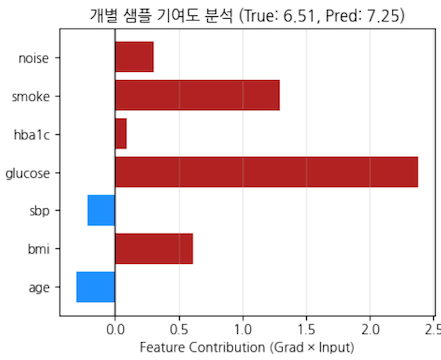

앞의 그림이 데이터셋 전체의 평균이라면 이 그림은 한 사람의 이야기이며, 둘은 전혀 다른 모양이 된다. age의 막대가 음수인 것은 이 환자가 상대적으로 젊어 합병증 위험도를 낮추는 방향으로 작용했다는 뜻이다. 개별 샘플에서는 이렇게 기여가 양과 음으로 갈린다.

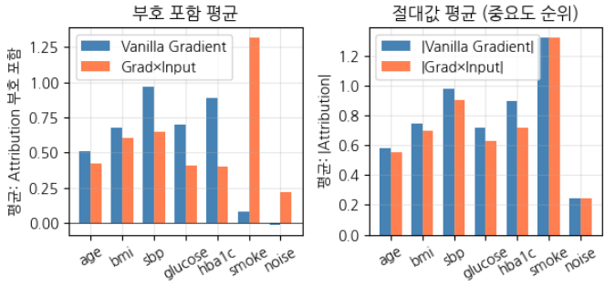

*그림 7-2. 부호를 살릴 때와 절댓값만 볼 때 Attribution의 인상은 달라진다.*

부호를 살린 평균에서는 한 피처의 양의 기여와 음의 기여가 서로 상쇄되어, 실제로는 크게 관여한 피처가 작게 보일 수 있다. 데이터셋 전체를 한 값으로 요약할 때 절댓값 평균을 기본으로 삼는 이유가 여기에 있다. 부호는 개별 샘플을 들여다볼 때 살린다.

---

## 7.1.5 Attribution 결과를 보고하는 언어
<!-- 슬라이드 452 -->

### 세 가지 문장, 세 가지 무게

Attribution 결과를 보고할 때 쓰는 문장은 미세한 차이로 완전히 다른 주장이 된다.

- **"이 Feature가 가장 중요하다."** 인과적 주장으로 들리며, Attribution이 감당할 수 있는 범위를 넘어섰다.
- **"모델이 이 Feature에 가장 의존한다."** 정확한 문장이지만, 듣는 사람이 그 함의를 이해하기 어렵다.
- **"이 모델 구조와 이 학습 데이터의 조합에서, 모델이 이 Feature에 가장 강하게 의존하도록 학습되었다."** 가장 정확한 표현이다. 모델과 데이터에 대한 의존성이 문장 안에 명시되어 있다.

미세한 문구 차이가 실무에서는 큰 결과 차이를 만든다. "혈압이 중요하다"는 문장은 곧바로 "혈압을 모니터링하면 결과가 좋아진다"는 인과적 추론으로 넘어간다. 반면 세 번째 표현은 듣는 사람에게 인과적 추론을 강요하지 않는다.

> **정리 — Part A**
> Attribution은 국소 민감도, 공정 분배, 글로벌 패턴이라는 세 가지 질문에 답하는 도구군이며, Saliency → Grad-CAM → LIME → SHAP → IG로 진화해 왔다.
> Gradient가 측정하는 것은 모델의 학습된 의존성이지 Feature의 객관적 중요도가 아니다.
> Attribution은 모델 구조와 학습 데이터의 조합이 만들어 낸 **강제된 의존 구조의 지도**이며, "중요도"라는 표현은 인과적 오독을 유발한다.

---

**⟨ Part B ⟩ Attribution 노이즈 저감 도구 — IG · SmoothGrad · SHAP**

> Vanilla Gradient의 편미분은 ReLU의 포화 영역에서 0에 수렴한다.
> Integrated Gradients는 이 포화 문제를 경로 적분으로 해결하고, SmoothGrad는 입력 노이즈 평균으로,
> SHAP은 게임이론의 공정 분배로 각각 Attribution의 안정성을 끌어올린다.

## 7.1.6 Integrated Gradients: 경로 적분과 두 공리
<!-- 슬라이드 453 -->

Part B에서는 Attribution의 노이즈를 줄이는 도구들, 즉 IG·SmoothGrad·SHAP을 다룬다. 세 도구는 서로 다른 방향에서 1세대의 약점을 공략한다.

### 포화 문제를 어떻게 우회할 것인가

Vanilla Gradient의 가장 뚜렷한 문제는 $\partial f / \partial x_j$ 가 ReLU의 포화 영역에서 0으로 수렴한다는 점이다. 어떤 Feature의 Gradient가 0이 되면 그것은 "이 Feature는 중요하지 않다"는 신호로 읽힌다. 그러나 실제로는 그 Feature가 이미 충분히 커서 출력이 더 이상 반응하지 않는 것일 수도 있다. Integrated Gradients는 이 포화 문제를 **경로 적분**으로 해결한다.


포화가 미치는 범위는 Gradient 하나에 그치지 않는다. Gradient가 0이 되면 Gradient × Input에서도 그 Feature의 기여도가 0이 된다. 입력값이 아무리 커도 곱해지는 쪽이 0이기 때문이다. 포화를 그대로 두면 Attribution은 틀린 값을 내는 것이 아니라, 그 Feature의 몫을 아예 없는 것으로 보고하게 된다.


### 경로 적분

아이디어는 baseline에서 입력값으로 이어지는 직선 경로 위에서 Feature $j$ 의 출력 기여를 적분으로 통합하는 것이다.

$$IG_j(x) = \left(x_j - x'_j\right)\int_{0}^{1} \frac{\partial f}{\partial x_j}\!\left(x' + \alpha\,(x - x')\right)\, d\alpha$$

식의 각 기호는 다음을 뜻한다.

- $x$ : 입력 벡터
- $x'$ : baseline. 보통 영 벡터 또는 데이터셋 평균을 쓴다.
- $\alpha \in [0, 1]$ : baseline에서 $x$ 까지 이어지는 직선 경로상의 위치 모수
- $\partial f / \partial x_j$ : 모델 출력에 대한 Feature $j$ 의 편미분

핵심은 이 값이 **한 지점의 미분이 아니라 경로 전체에서 미분의 평균**이라는 점이다. 한 지점에서 포화되어 있더라도 경로의 다른 구간에서 기울기가 살아 있으면 그 기여가 적분에 반영된다. 실제 계산에서는 이 적분을 50~100 step의 Riemann sum으로 근사한다(Sundararajan 2017 권장).

### IG가 만족하는 두 공리

**완전성 공리(Completeness axiom).**

$$\sum_{j=1}^{d} IG_j(x) = f(x) - f(x')$$

모든 Feature의 Attribution 합이 모델 출력의 baseline 대비 변화량과 정확히 같다는 뜻이다. 기여도의 합이 출력 차이와 일치한다는 점에서 회계의 차변·대변 일치와 같은 성질이다. SHAP도 이 공리를 만족하는데, Shapley value의 efficiency property가 바로 그것이다.

**구현 불변성(Implementation Invariance).** 함수가 같으면 가중치나 활성 함수의 표현이 달라져도 Attribution이 같다. 같은 입출력 관계를 갖는 두 네트워크가 내부 구현만 다를 때, 두 네트워크의 Attribution은 동일해야 한다는 요구다.


### 왜 구현 불변성이 필요한가

모델이 만들어 내는 최종 출력 함수는 하나지만, 그 함수를 만드는 내부의 조합은 하나가 아니다. 서로 다른 가중치와 활성값의 조합이 같은 입출력 관계를 만들어 낼 수 있다. 구현 불변성은 그런 경우에도 Attribution이 같아야 한다는 요구다.

이 공리가 깨지면 입출력 관계는 그대로인데 내부 구현을 바꾸었다는 이유만으로 기여도가 달라진다. 그렇게 얻은 설명은 모델이 무엇에 의존하는지가 아니라 어떻게 구현되었는지를 보고하는 셈이 된다. 같은 함수를 여러 방식으로 표현할 수 있는 딥러닝에서 이 조건은 완전성 공리와 같은 무게를 갖는다.


---

## 7.1.7 공리 만족이 왜 중요한가: 규제와 의미 있는 설명
<!-- 슬라이드 454 -->

### 완전성 공리와 규제 요구

공리 만족은 학술적 취향의 문제가 아니다. 의료와 금융 규제는 각 Feature의 기여도 합이 모델 출력 변화량과 일치할 것을 보장하도록 요구한다. 이것은 회계에서 차변과 대변이 맞아야 하는 것과 같은 투명성 보장 조건이다.

만약 완전성 공리를 만족하지 않는다면 어떤 일이 벌어지는가. 특정 Feature들이 출력의 70%를 설명하고 나머지 30%는 설명 불가능한 상태로 남는다. 법적으로 완전한 설명이 요구되는 경우에는 이런 결과를 제출할 수 없다. 그래서 IG와 SHAP 이외의 도구는 보조적으로만 사용할 수 있다.

관련 규제는 다음과 같다.

- **GDPR Article 22 (EU 일반 개인정보보호법).** 자동화 결정 금지 원칙에 따라 자동화된 처리만으로 대출 거절, 보험료 산정, 채용 탈락을 결정할 수 없다. 또한 자동 결정에 대해 **의미 있는 논리적 정보**를 받을 권리가 있다.
- **미국 ECOA (Equal Credit Opportunity Act).** 불리한 조치 통지 의무를 규정한다. 어떤 이유로 거절되었는지 구체적인 항목을 나열할 것을 요구한다.

### 의미 있는 설명: Attribution을 Counterfactual로 통역하기

문제는 공리를 만족하는 Attribution조차 규제가 요구하는 "의미 있는 설명"이 되기에는 부족하다는 점이다.

IG나 SHAP 방식의 답은 이런 형태다. "신용점수 기여 50%, 소득 기여 30%." 이 답은 추상적이다. 기여도 50%가 무엇을 의미하는지 알 수 없고, 신용점수를 얼마나 올려야 하는지도 알 수 없다. 무엇을 바꿔야 하는가에 대한 답이 없다.

Counterfactual 방식(Wachter 2017)의 답은 다르다. "신용점수가 720 이상이었다면 승인되었을 것이다." 직관적이고 행동 가능하다. 구체적인 목표값을 제시하므로 무엇을 해야 하는지 알게 된다.

> **정의 — Counterfactual(반사실적) 방식**
> "만약 ~하지 않았다면 어떤 결과가 일어났을까?"를 묻는 방법론. 실제로 발생한 사실과 반대되는 가상의 상황을 상상하거나 분석하며, 인과관계 추론·데이터 분석·인공지능 설명에서 핵심적으로 사용된다.

Counterfactual은 이 절의 뒷부분(7.1.18 이후)에서 본격적으로 다룬다.


여기서 통역이라는 말이 정확하다. Attribution의 답이 틀린 것이 아니라, 사람이 행동으로 옮길 수 없는 언어로 쓰여 있을 뿐이다. 같은 결과를 반사실의 형식으로 바꾸어 말해 주지 않으면 설명을 받은 사람은 무엇을 해야 하는지 알 수 없다.


---

## 7.1.8 Baseline 선택과 Riemann 근사
<!-- 슬라이드 455~458 -->

### Baseline이 IG의 성능을 좌우한다

IG의 성능은 baseline $x'$ 를 어떻게 잡느냐에 좌우된다. Baseline은 **실제 입력에서 가장 가까운, 의미 없는 점**이어야 한다. 의미가 다른 데이터 분포에 있는 점을 선택하면 적분 경로 자체가 무의미해진다.

Baseline의 종류와 각각의 성질은 다음과 같다.

| Baseline 종류 | 정의 | 장점 | 단점 |
|---|---|---|---|
| 영 벡터 | $x' = (0, 0, \ldots, 0)$ | 직관적이고 계산이 간단하다 | 정규화되지 않은 Feature에서 의미가 왜곡된다 |
| 데이터셋 평균 | $x' = \mathrm{mean}(X_{\text{train}})$ | 분포의 중심에 놓인다 | 범주형 Feature에 부적합하다 |
| 반대 클래스 샘플 | $x' =$ 다른 클래스의 평균 | 대조적 해석이 가능하다 | 다중 클래스에서 모호해진다 |
| 다중 baseline 평균 | $x'_1, x'_2, \ldots$ 의 평균 | 단일 baseline 민감도를 완화한다 | 계산 비용이 증가한다 |

어느 baseline도 정답이 아니라는 것이 이 표의 결론이다. 데이터셋 평균은 분포가 두 개의 클러스터로 갈라져 있으면 어느 쪽에도 속하지 않는 점이 되어 기준 구실을 못 하고, 반대 클래스 샘플은 클래스가 늘어날수록 무엇을 기준으로 삼을지가 모호해진다.

### 다중 Baseline

Sturmfels 2020은 baseline을 결정하는 방법을 제시했다. 요지는 단일 baseline보다 **다중 baseline 평균 IG**의 결과 안정성이 높다는 것이다. 데이터셋에서 무작위로 5~10개의 baseline을 뽑고 각각의 IG를 계산한 뒤 평균하면, baseline 선택에 따른 결과 변동이 $\sqrt{M}$ 만큼 감소한다. 이는 Bootstrap의 원리와 동일하다.

### Riemann 근사

경로 적분은 해석적으로 풀 수 없으므로 수치 근사를 쓴다.

$$IG_j(x) \approx \left(x_j - x'_j\right)\cdot \frac{1}{m}\sum_{k=1}^{m} \frac{\partial f}{\partial x_j}\!\left(x' + \frac{k}{m}\,(x - x')\right)$$

baseline $x'$ 에서 입력 $x$ 까지의 직선 경로를 $m$ 개의 작은 구간으로 잘게 나누고, 각 점에서 gradient를 구해 평균하는 방식이다.

그렇다면 몇 등분해야 하는가. 기본값은 50~100이다. 실무에서는 다음 세 가지 기준으로 결정한다.

1. 보통 gradient의 변화가 평탄해질 때까지 $m$ 을 증가시킨다.
2. 완전성 공리로 자가 검증한다. $\sum_j IG_j$ 와 $f(x) - f(x')$ 의 상대 오차가 5% 미만이면 충분하다.
3. $M$ 개의 baseline을 평균하면 비용은 $O(M \cdot m)$ 이 된다. $M = 10$ 이 기본값이다.


Riemann 근사는 적분을 합으로 바꾸는 일반적인 방법이며, 경로 위에서 기울기의 기댓값을 구하는 일을 표본 평균으로 대신하는 것과 같다. 그래서 $m$ 을 늘리는 일은 표본을 늘리는 일이고, 상대 오차는 $m$ 이 커질수록 완만하게 줄어든다.  


### 실습 7.1.2 — Integrated Gradients

> 노트북: `code/7.1.2.Integrated_Gradients.ipynb`

**목적.** 실습 7.1.1과 동일한 합성 의료 데이터를 생성하고 MLP 모델을 학습한 뒤, Integrated Gradients로 Attribution을 계산하여 Vanilla Gradient와 비교한다.

**수식.** IG는 Riemann 근사로 계산한다.

$$IG_j(x) = \left(x_j - x'_j\right)\int_{0}^{1} \frac{\partial f}{\partial x_j}\!\left(x' + \alpha(x - x')\right) d\alpha$$

$$IG_j(x) \approx \left(x_j - x'_j\right)\cdot \frac{1}{m}\sum_{k=1}^{m}\frac{\partial f}{\partial x_j}\!\left(x' + \frac{k}{m}(x - x')\right)$$

baseline에서 입력까지 $m$ 개의 보간점을 만들고, 각 점의 gradient를 평균한 뒤 $(x - x')$ 를 곱한다.

```python
def integrated_gradients(model, x, baseline, m_steps=50):
    """단일 baseline IG — Riemann 합 근사.
    x        : (D,) 입력
    baseline : (D,) 시작점 x'
    m_steps  : Riemann step (Sundararajan 2017 권장 50~100)
    """
    x = np.asarray(x, dtype=np.float32)
    baseline = np.asarray(baseline, dtype=np.float32)
    # 경로상 m 개 점: x' + (k/m)(x - x')
    alphas = np.linspace(0.0, 1.0, m_steps + 1, dtype=np.float32)[1:]
    interpolated = baseline[None, :] + alphas[:, None] * (x - baseline)[None, :]
    interpolated = tf.convert_to_tensor(interpolated)
    with tf.GradientTape() as tape:
        tape.watch(interpolated)
        out = model(interpolated, training=False)
    grads = tape.gradient(out, interpolated).numpy()   # (m, D)
    # Riemann sum
    avg_grad = grads.mean(axis=0)                      # (D,)
    ig = (x - baseline) * avg_grad
    return ig

# 단일 baseline (영 벡터) IG 산출 — 테스트 첫 샘플
x_sample = X_test[0]
baseline_zero = np.zeros_like(x_sample)
ig_single = integrated_gradients(model, x_sample, baseline_zero, m_steps=50)
```

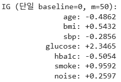

**오차 검증.** 개별 IG의 합 $\sum_j IG_j$ 가 $f(x) - f(\text{baseline})$ 과 5% 이내에서 일치하는지를 확인한다. 경로 분해 수를 $m \in \{10, 25, 50, 100, 200\}$ 으로 바꾸어 가며 오차를 비교하면, $m$ 이 커질수록 상대 오차가 단조롭게 줄어드는 것을 볼 수 있다.

```python
f_x = model.predict(x_sample[None, :], verbose=0)[0, 0]
f_baseline = model.predict(baseline_zero[None, :], verbose=0)[0, 0]
delta = f_x - f_baseline

errs, m_list = [], [10, 25, 50, 100, 200]
for m in m_list:
    ig_m = integrated_gradients(model, x_sample, baseline_zero, m_steps=m)
    errs.append(abs(ig_m.sum() - delta) / (abs(delta) + 1e-9))
```

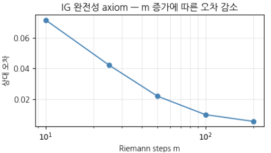

**다중 Baseline 적용.** 데이터셋에서 무작위로 5개를 뽑아 baseline으로 삼고, 각 baseline에서 출발하는 경로를 $m = 50$ 으로 분해하여 IG를 계산한 뒤 평균한다.

```python
def multi_baseline_ig(model, x, baseline_pool, m_steps=50, n_baselines=5, rng=None):
    """M 개 baseline 의 IG 를 평균."""
    if rng is None:
        rng = np.random.default_rng(0)
    idx = rng.choice(len(baseline_pool), n_baselines, replace=False)
    igs = np.stack([integrated_gradients(model, x, baseline_pool[i], m_steps) for i in idx])
    return igs.mean(axis=0), igs

# baseline pool = 학습 데이터 일부
baseline_pool = X_train[:50]
rng = np.random.default_rng(SEED)
ig_multi, igs = multi_baseline_ig(model, x_sample, baseline_pool,
                                  m_steps=50, n_baselines=5, rng=rng)
```

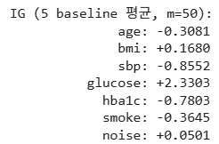

**변동성 분석.** 같은 샘플에 baseline을 무작위로 10개 적용하여, baseline이 바뀔 때 피처 기여도가 얼마나 흔들리는지를 본다.

```python
single_results = np.stack([integrated_gradients(model, x_sample, baseline_pool[i], m_steps=50)
                           for i in range(10)])
multi_results = np.stack([multi_baseline_ig(model, x_sample, baseline_pool, 50, 5,
                                            rng=np.random.default_rng(s))[0]
                          for s in range(10)])
var_single = single_results.std(axis=0).mean()
var_multi = multi_results.std(axis=0).mean()
```

**순위 변동성.** Vanilla Gradient와 IG의 피처 기여도 순위 변동성을 Spearman $\rho$ 로 비교한다. 20개 샘플의 피처 순위 변동성을 측정하면 전체적으로 순위 일치도가 약간 있는 정도, 즉 $-0.2 \sim 0.6$ 범위에 머문다. 그런데 평균으로 비교하면 두 방법이 비슷해 보인다. 개별 샘플 단위에서는 크게 다른데도 평균에서는 차이가 가려지는 것이다.

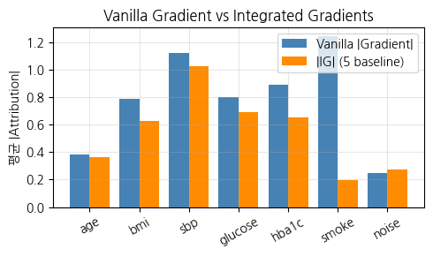

*그림 7-3. 평균만 보면 두 방법은 비슷해 보이지만, spurious 피처인 smoke에서 차이가 크게 벌어진다.*


변동성 분석의 결과는 baseline 개수의 효과를 그대로 보여 준다. 영 벡터 하나만 baseline으로 두고 10회 반복하면 피처 기여도의 표준편차가 0.5 수준이고, baseline을 5개로 늘려 평균하면 0.23 수준으로 내려간다. 다중 baseline이 변동을 $\sqrt{M}$ 만큼 줄인다는 앞의 논의가 실제 값에서도 확인되는 셈이다.  


---

## 7.1.9 SmoothGrad와 네 번째 재샘플링 축
<!-- 슬라이드 459~461 -->

### 노이즈를 더해서 노이즈를 줄인다

SmoothGrad(Smilkov 2017)는 입력 $x$ 주변에서 무작위 perturbation을 $T$ 번 가하고 각각의 Gradient를 평균한다. 입력 공간에 노이즈를 더한 뒤 평균화함으로써 Vanilla Gradient의 노이즈를 줄이는 것이다.

$$\mathrm{SmoothGrad}_j(x) = \frac{1}{T}\sum_{t=1}^{T} \frac{\partial f}{\partial x_j}\!\left(x + \varepsilon_t\right), \qquad \varepsilon_t \sim \mathcal{N}\!\left(0, \sigma^2 I\right)$$

$\sigma$ 의 선택에는 균형이 필요하다. 너무 작으면 평활 효과가 미미하고, 너무 크면 다른 클래스의 영역을 침범한다. 계산 비용은 Vanilla Gradient의 $T$ 배이며, 실무 기본값은 $T = 50 \sim 100$, $\sigma = 0.1 \sim 0.3 \times x_{\text{std}}$ 이다.


수식을 읽을 때 주의할 곳이 하나 있다. 편미분 기호 뒤에 붙은 괄호는 곱셈이 아니라 그 편미분을 평가할 입력값을 가리킨다. 즉 노이즈가 더해진 $x + \varepsilon_t$ 에서 기울기를 구한다는 뜻이다. 노이즈를 더하는 대상은 입력이고, 평균을 내는 대상은 그 입력들에서 얻은 기울기다.  


### 네 번째 재샘플링 축 — 입력값

SmoothGrad는 6.2에서 다룬 재샘플링 논의의 연장선에 있다. 6.2에서 다룬 재샘플링 축은 세 가지였다.

- **Bootstrap** — 데이터를 재샘플링한다.
- **MC Dropout** — 가중치를 재샘플링한다.
- **Deep Ensemble** — 초기화를 재샘플링한다.

여기에 **입력값**이라는 네 번째 축이 더해진다. 네 축은 각각 서로 다른 불확실성을 측정하며, 공통적으로 여러 표본을 평균화하여 불확실성을 줄인다는 구조를 갖는다. 그리고 여러 축을 결합하면 더 안정적인 Attribution을 얻을 수 있다. Deep Ensemble × SmoothGrad, Bootstrap × Deep Ensemble 같은 조합이 그 예다.

### 무작위 Perturbation과 Random Noise

용어를 하나 정리해 둔다. 무작위 perturbation과 random noise는 동일한 작위의 다른 이름이다.

- **무작위 Perturbation** : 무작위성을 **의도적으로** 가하는 교란
- **Random Noise** : 무작위성에 의한, **의도하지 않은** 신호 오염

### 도구 선택 기준

지금까지 등장한 도구들을 상황별로 정리하면 다음과 같다.

| 상황 | 권장 도구 | 근거 |
|---|---|---|
| 단일 입력 디버깅, 빠른 점검 | Vanilla Gradient + 시각화 | 계산 비용이 최소다 |
| 프로덕션 보고용 Attribution | IG (50~100 step, 5~10 baseline) | 공리 보장 + baseline 평균화 |
| 노이즈가 큰 입력 (이미지·시계열) | SmoothGrad ($T=50$) | 입력 노이즈 효과가 크다 |
| 다중 모델 일관성 확인 | 여러 Attribution 도구 + Kendall $\bar{\tau}$ (7.1.13) | 방법 간 일치도 측정 |
| 규제·감사 (공리 보장) | IG 또는 SHAP | 완전성·구현 불변성 |

### 실습 7.1.3 — SmoothGrad : 표준 도구의 하나

> 노트북: `code/7.1.3.SmoothGrad.ipynb`

**목적.** 실습 7.1.1과 동일한 합성 의료 데이터를 생성하고 MLP 모델을 학습한 뒤, 샘플에 노이즈를 추가하고 Vanilla Gradient를 $T$ 회 평균한다. 단일 샘플에 SmoothGrad를 적용한다.

$$\mathrm{SmoothGrad}_j(x) = \frac{1}{T}\sum_{t=1}^{T}\frac{\partial f}{\partial x_j}\!\left(x + \varepsilon_t\right), \qquad \varepsilon_t \sim \mathcal{N}\!\left(0, \sigma^2 I\right)$$

입력에 정규 노이즈를 $T$ 개 더해 배치로 만들고, 각 perturbation의 gradient를 구해 평균한다.

```python
# SmoothGradⱼ(x) = (1/T) Σₜ (∂f/∂xⱼ)(x + εₜ), εₜ ~ N(0, σ² I)
def smoothgrad(model, x, sigma=0.2, T=50, seed=0):
    rng = np.random.default_rng(seed)
    x_arr = np.asarray(x, dtype=np.float32)
    noise = rng.normal(0, sigma, size=(T,) + x_arr.shape).astype(np.float32)
    x_pert = x_arr[None, :] + noise
    x_tf = tf.convert_to_tensor(x_pert)
    with tf.GradientTape() as tape:
        tape.watch(x_tf)
        out = model(x_tf, training=False)
    grads = tape.gradient(out, x_tf).numpy()
    return grads.mean(axis=0)

# 단일 입력에서 SmoothGrad 산출
x_sample = X_test[0]
sg_default = smoothgrad(model, x_sample, sigma=0.2, T=50, seed=SEED)
```

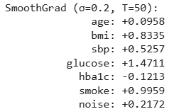

**분산 변화 비교.** $\sigma \in \{0, 0.05, 0.1, 0.2, 0.3\}$ 으로 노이즈 크기를 바꾸어 Attribution이 어떻게 달라지는지 본다. $\sigma = 0$ 인 경우가 곧 Vanilla Gradient다.

```python
sigmas = [0.0, 0.05, 0.1, 0.2, 0.3, 0.5]
sg_by_sigma = {s: smoothgrad(model, x_sample, sigma=s, T=100, seed=SEED) for s in sigmas}
```

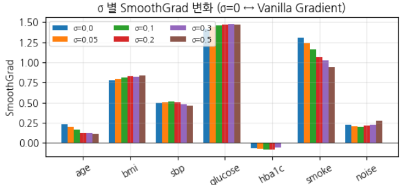

**시행 횟수 비교.** $\sigma = 0.2$ 로 고정하고 $T \in \{1, 5, 10, 30, 100\}$ 으로 시행 횟수를 늘려 가며 분산이 감소하는지 확인한다. 실측 표준편차가 이론적인 $1/\sqrt{T}$ 곡선을 따라 감소하는 것을 볼 수 있으며, 이는 Bootstrap의 원리와 동일하다.

```python
T_list = [1, 5, 10, 30, 100, 300]
# 같은 (x, σ) 에서 다른 seed 로 N_repeat 회 SmoothGrad 산출 → std 측정
N_repeat = 8
stds_by_T = []
for T_val in T_list:
    reps = np.stack([smoothgrad(model, x_sample, sigma=0.2, T=T_val, seed=s)
                     for s in range(N_repeat)])
    stds_by_T.append(reps.std(axis=0).mean())

theoretical = stds_by_T[0] * np.sqrt(T_list[0]) / np.sqrt(np.array(T_list))
```

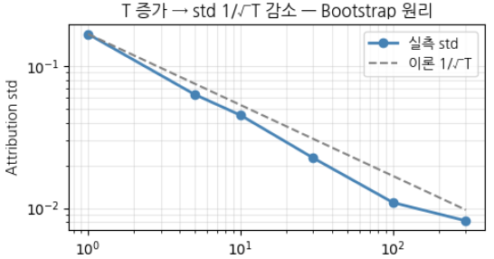

*그림 7-4. 재샘플링 축 하나를 더해도 불확실성은 같은 법칙으로 줄어든다.*

가로축의 시작점인 $T=1$ 은 노이즈를 한 번만 더한 것이므로 Vanilla Gradient와 같다. 거기서 $T$ 를 100까지 늘리면 표준편차가 약 93% 줄어든다. 이론값과 실측을 겹쳐 그린 것은 식으로 아는 감소 법칙이 실제 모델에서도 그대로 나타나는지 확인하기 위해서다.

---

## 7.1.10 SHAP: Shapley value의 기계학습 응용
<!-- 슬라이드 462 -->

### 한계 기여도를 모든 순서로 평균한다

SHAP(Lundberg & Lee 2017)은 게임이론의 Shapley value를 기계학습에 응용한 것이다. Shapley value는 Feature $j$ 의 한계 기여도를 **모든 가능한 순서로 평균**한 값이다. 직관적으로 쓰면 다음과 같다.

$$\phi_j = \left(j\text{가 들어간 조합의 출력 평균}\right) - \left(j\text{가 들어가지 않은 조합의 출력 평균}\right)$$

정식으로는 다음과 같이 정의된다.

$$\phi_j(v) = \sum_{S \subseteq N \setminus \{j\}} \frac{|S|!\,\bigl(|N| - |S| - 1\bigr)!}{|N|!}\,\Bigl(v\bigl(S \cup \{j\}\bigr) - v(S)\Bigr)$$

각 기호는 다음을 뜻한다.

- $N$ : 모든 Feature의 집합이며 $d$ 는 Feature의 차원이다. 합은 $N$ 의 부분집합 위에서 이루어진다.
- $S$ : $j$ 를 제외한 나머지 Feature들의 부분집합
- $v(S)$ : Feature $j$ 를 제외한 상태에서의 모델 출력, 즉 조건부 기대값
- $\dfrac{|S|!\,(|N| - |S| - 1)!}{|N|!}$ : Shapley 가중치. 순열 평균에서 유도된다.

### 비용과 본질적 어려움

계산 비용은 $2^d$ 개 부분집합의 평가다. $d = 20$ 이면 약 100만 개의 조합을 평가해야 한다.

더 본질적인 어려움은 조건부 기대값

$$v(S) = \mathbb{E}\bigl[\,f(x) \mid x_S\,\bigr]$$

를 어떻게 평가하느냐에 있다. Feature 사이의 상관을 어떤 방식으로 처리하느냐가 SHAP 변종들을 가른다.

Shapley value가 전제하는 조건은 참가자들이 서로 독립이라는 것이다. 네 사람이 벌인 게임의 수익을 나누듯 공정 분배는 각자의 몫이 얽혀 있지 않을 때 성립한다. 체중이 오르면 혈압도 오르는 식으로 Feature가 얽혀 있으면 한쪽이 움직일 때 다른 쪽도 따라 움직여 기여를 분리할 수 없다.

그럼에도 Shapley value는 efficiency·symmetry·dummy·additivity 공리를 **모두 만족하는 유일한 해법**이라는 강력한 지위를 갖는다.

### "?"를 어떻게 채울 것인가

정확한 Shapley 계산은 지나치게 복잡하다. 모든 부분집합 $2^d$ 를 평가해야 하므로 $d > 10$ 만 되어도 비현실적이다. 그래서 SHAP Family라 불리는 다섯 종류의 근사 방법이 등장했다.

문제의 구조를 네 개의 Feature로 구체화해 보자. $x_4$ 의 기여도는 "$x_4$ 가 들어갈 때의 출력(A)"에서 "$x_4$ 가 들어가지 않을 때의 출력(B)"을 뺀 값이다. 전체 집합은 $\{(x_1, ?, ?, ?), (x_1, x_2, ?, ?), \ldots, (?, ?, ?, x_4)\}$ 처럼 구성되고, 이 가운데 $x_4$ 가 포함된 부분집합이 (A)에 해당한다. 예를 들어 $x_4$ 가 있는 조합의 하나는 $(x_1, x_2, ?, x_4)$ 이고, 없는 조합의 하나는 $(x_1, x_2, ?, ?)$ 이다.

여기서 남는 질문이 하나 있다. **"?"를 어떻게 채울 것인가.** SHAP Family는 이 질문에 대한 서로 다른 대답들이다.

### 네 공리가 Attribution에서 갖는 의미

- **Efficiency** : 모든 Feature 기여도의 합이 모델 출력의 변화량과 같다.
- **Symmetry** : 동일하게 기여한 Feature는 동일한 Attribution을 받는다.
- **Dummy** : 예측에 아무 영향도 주지 않는 Feature의 Attribution은 0이다.
- **Additivity** : 두 독립 모델의 Attribution을 따로 계산해도 합산할 수 있다.


네 공리를 동시에 만족하는 해가 Shapley value 하나뿐이라는 점이 SHAP의 근거이지만, 그 대가는 조합의 수다. Feature가 늘어나면 평가해야 할 조합이 함께 늘어난다. 이어지는 SHAP Family는 공리를 다시 세우기 위한 것이 아니라 이 비용을 감당하기 위한 근사들이다.
 

---

## 7.1.11 관찰이냐 중재냐: Shapley 계산 방식의 분기
<!-- 슬라이드 463 -->

### 문제 설정

"?"를 채우는 방식의 차이를 인과 구조가 있는 사례로 살펴본다. 체중 $W$, 혈압 $X$, 합병증 $Y$ 사이에 $W \rightarrow X \rightarrow Y$ 라는 인과 관계가 있다고 하자. 모델 $f(W, X)$ 가 $Y$ 를 예측하고, 환자는 $W = 80\,\mathrm{kg}$, $X = 140\,\mathrm{mmHg}$ 이다. 목표는 모델의 출력인 합병증 지수 $Y$ 에서 환자의 혈압 $X$ 가 갖는 기여도 $\phi_j$ 를 계산하는 것이다.

기본 골격은 언제나 같다. $X$ 의 기여도는 $X$ 가 들어간 조합의 출력 평균(A)에서 $X$ 가 들어가지 않은 조합의 출력 평균(B)을 뺀 값이다. 차이는 "?"를 채우는 분포에서 발생한다.


### 독립이면 문제가 없다

물음표를 채우는 방식이 문제가 되는 것은 Feature들이 서로 얽혀 있을 때뿐이다. Feature가 완전히 독립이라면 어느 분포에서 값을 뽑아 넣어도 다른 Feature의 기여가 딸려 들어오지 않으므로 세 방식이 같은 답을 준다.

그러나 실제 데이터에서 Feature가 독립인 경우는 드물다. 체중이 늘면 혈압이 오르고 혈압이 오르면 합병증 가능성이 높아지는 식으로 값들이 사슬처럼 연결되어 있다. 이런 구조에서는 물음표를 무엇으로 채우느냐가 곧 기여도의 값을 바꾼다. 그래서 계산 방식이 Observation과 Intervention 두 갈래로 갈리고, 그 안에서 KernelSHAP과 Conditional KernelSHAP, CausalSHAP이라는 세 가지 처리가 나온다.


### Observation(관찰) 방식

**KernelSHAP**은 다음과 같이 계산한다.

$$\phi_X = \mathrm{mean}\bigl(f(?, X),\, f(W, X)\bigr) - \mathrm{mean}\bigl(f(W, ?),\, f(?, ?)\bigr)$$

여기서 "?"는 해당 피처에서 **무작위로 추출**한 값이다. 문제는 $(?, ?)$ 에서 현실에 존재하지 않는 조합, 예컨대 $W = 20$ 이면서 $X = 150$ 같은 입력이 들어온다는 점이다. 존재하지 않는 입력이 모델에 들어가 결과에 왜곡을 일으킨다.

**Conditional KernelSHAP**은 같은 형태의 식을 쓰되 "?"를 조건부로 추출한다. $(?, X{=}140)$, $(W{=}80, ?)$ 처럼 나머지 값에 조건을 걸어 뽑는다. 현실적인 입력이 만들어진다는 장점이 있지만, 이번에는 $X$ 의 기여도에 $W$ 의 기여도가 섞여 들어간다.


섞여 들어가는 경로는 이렇다. 조건부로 뽑으면 체중이 80kg인 사람들의 실제 혈압 분포에서 값이 나오므로 현실에 없는 조합은 사라진다. 그런데 그 분포 자체가 이미 체중의 정보를 담고 있다. 혈압의 기여도를 구했다고 생각한 값 안에 체중의 기여도가 함께 들어가는 것이며, 현실성을 얻은 대가로 분리를 잃는 셈이다.


### Intervention(중재) 방식

**CausalSHAP**은 "?"를 $do(X)$ 분포에서 추출한다. 식의 형태는 같지만 추출 방식이 인과 그래프를 따른다.

- $f(?, X)$ 에서 $? = do(X)$ 일 때, 자식 쪽으로 들어오는 화살표 $W \rightarrow X$ 를 제거하고 무작위로 추출한다. 이 부분은 KernelSHAP과 동일하다.
- $f(W, ?)$ 에서 $? = do(W)$ 일 때, 부모 쪽으로 나가는 화살표는 유지하므로 $W = 80$ 을 그대로 둔다. 이 부분은 conditional 방식과 동일한 $(W{=}80, ?)$ 가 된다.

따라서 CausalSHAP을 쓰려면 먼저 물어야 할 질문이 하나 있다. **causal DAG를 제공할 수 있는가.** 그리고 제공할 수 있더라도, 단순한 구조에서는 이점이 없다. 숨은 공통 원인, 즉 교란변수가 있을 때에만 의미 있는 차이가 나타난다.

---

## 7.1.12 SHAP Family의 비교와 선택
<!-- 슬라이드 464~469 -->

### 다섯 변종의 성질

각 변종은 "?"를 채우는 방식과 계산 전략이 다르며, 그 결과 적용 영역도 갈린다.

| Family | 계산 비용 | 핵심 가정 | 주 적용 영역 |
|---|---|---|---|
| KernelSHAP — Lundberg 2017 | $O(2^d)$ 근사 (가중 LIME) | Feature 독립 가정 (marginal expectation) | model-agnostic 일반 사용, 모든 black-box |
| Sampling SHAP — Štrumbelj 2014 | $O(T \cdot d)$, $T$ 는 샘플 수 | 순열 무작위 샘플링 | 고차원 black-box, 근사 정확도가 필요한 경우 |
| TreeSHAP — Lundberg 2018 | $O(T \cdot L \cdot D^2)$ ($T$ 트리·$L$ 잎·$D$ 깊이) | 트리 구조 전용 — 오차 없이 빠르다 | XGBoost · LightGBM · RF — 정확 계산 가능 |
| DeepSHAP — Lundberg 2017 | $O(\text{forward} + \text{backward})$ | DeepLIFT의 추론 룰 + Shapley 분배 | Deep neural network — gradient 활용 |
| CausalSHAP — Heskes 2020 · Frye 2020 | $O(2^d)$ (causal 그래프 필요) | 사용자가 제공한 causal DAG를 사용 | 인과 그래프가 있는 경우 — 상관과 인과의 구분 |

KernelSHAP의 독립 가정은 실제 데이터에서 거의 지켜지지 않는다. 대부분의 데이터는 Feature끼리 어떤 식으로든 정보가 얽혀 있어 값이 왜곡되므로, KernelSHAP의 결과는 홀로 쓰지 말고 다른 변종과 대조해 검증해야 한다. CausalSHAP이 요구하는 것도 인과 그래프다.


여기서 말하는 인과 그래프는 상관 그래프와 다르다. 변수들이 함께 움직인다는 사실을 그린 것이 아니라 어느 쪽이 어느 쪽을 만드는지를 그려야 하며, 도메인 지식 없이 데이터만으로 이것을 세우기는 어렵다. CausalSHAP을 선택지에 올리기가 쉽지 않은 이유가 여기에 있다.


### 상황별 선택 가이드

| 상황 | 권장 변종 | 근거 |
|---|---|---|
| XGBoost · LightGBM · RF 모델 | TreeSHAP | 트리 구조 전용 정확 Shapley — 근사 오차가 없고 속도가 가장 빠르다 |
| Deep neural network (CV · NLP) | DeepSHAP 또는 IG | DeepSHAP은 빠르고, IG는 공리 보장 + baseline 평균화가 가능하다 |
| 수십 개 Feature의 black-box (regression · CatBoost · 외부 API) | KernelSHAP (작은 $d$) 또는 Sampling (큰 $d$) | model-agnostic 일반 도구 |
| Feature 간 상관이 강한 경우 (의료 · 금융) | conditional KernelSHAP | 상관 무시 가정을 회피한다 |
| 인과 그래프를 보유한 경우 (도메인 전문가 협업) | CausalSHAP | Pearl 사다리 ② 단계 영역까지 설명 가능하다 |

### 실습 7.1.7 — SHAP Family 비교

> 노트북: `code/7.1.7.SHAP_family.ipynb`

**목적.** Housing Dataset을 생성하고 Random Forest와 MLP 모델을 학습한 뒤, TreeSHAP · KernelSHAP · DeepSHAP · IG를 비교한다.

**Feature 상관 확인.** 먼저 KernelSHAP을 적용할 수 있는 조건인지, 즉 Feature 독립 가정이 성립하는지를 상관 행렬로 확인한다.

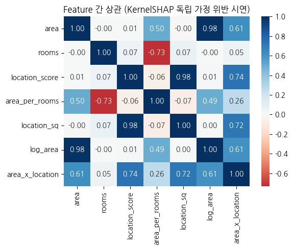

**Random Forest Regressor + TreeSHAP.** 트리 모델에는 오차 없는 정확한 Shapley 계산이 가능하다.

```python
rf = RandomForestRegressor(n_estimators=100, max_depth=8, random_state=SEED)
rf.fit(X_train, y_train)
print(f'RF R² (test) = {rf.score(X_test, y_test):.3f}')

# TreeSHAP — 정확 Shapley
import shap
explainer_tree = shap.TreeExplainer(rf)
shap_tree = explainer_tree.shap_values(X_test[:30])
tree_imp = np.abs(shap_tree).mean(axis=0)
```

결과는 **Magnitude of Impact**로 해석한다. 값의 단위가 집값과 동일하므로, `area_x_location: 1223.18` 은 그 피처가 평균 집값에서 1223.18만큼 증가시켰다는 뜻이다.

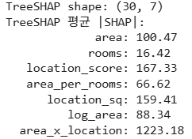

여기서 각 피처의 값이 차지하는 비중을 백분율로 환산하면 글로벌 변수 기여도, 즉 Feature Importance가 된다.

```python
tree_imp_series = pd.Series(tree_imp, index=feature_names)
tree_imp_percent = (tree_imp_series / tree_imp_series.sum()) * 100
tree_imp_sorted = tree_imp_percent.sort_values(ascending=False)
```

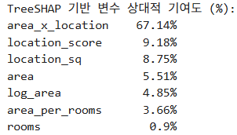

**KernelSHAP.** KernelSHAP은 Feature 독립을 가정한다. `shap.sample()`을 쓰는 이유는 세 가지다.

1. **결측치 시뮬레이션(Feature Hiding)** — 특정 변수가 없는 경우를 처리하기 위해 무작위 샘플링으로 대체값을 준비한다.
2. **베이스라인(기준점) 설정** — 평균적인 예측값, 즉 기대값(Expected Value)을 계산할 기준을 잡는다. SHAP 값은 전체 평균 예측값에서 각 변수가 얼마나 값을 더하고 뺐는지를 설명한다.
3. **연산량 최적화(Sampling)** — 모든 변수의 조합을 탐색하므로 연산 비용이 매우 높다. 데이터의 분포를 대략적으로 대표할 수 있는 50개만 샘플링하여 정확도와 계산 속도의 타협점을 찾는다.

```python
# KernelSHAP — RF 모델에도 적용 (model-agnostic 검증용)
background = shap.sample(X_train, 50, random_state=SEED)
explainer_kernel = shap.KernelExplainer(rf.predict, background)
shap_kernel = explainer_kernel.shap_values(X_test[:15],
                                           nsamples=100, silent=True)
kernel_imp = np.abs(shap_kernel).mean(axis=0)
```

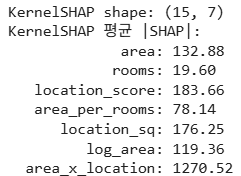

**DeepSHAP.** MLP 모델에 적용한다. `shap.DeepExplainer()`는 Keras와 호환성 문제가 있어, Keras 모델은 IG로 실행하고 PyTorch 모델은 DeepSHAP으로 실행하여 비교한다. 두 프레임워크에서 동일한 구조를 만들고 학습 커브를 확인한 뒤 비교로 넘어간다.

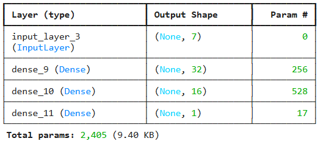

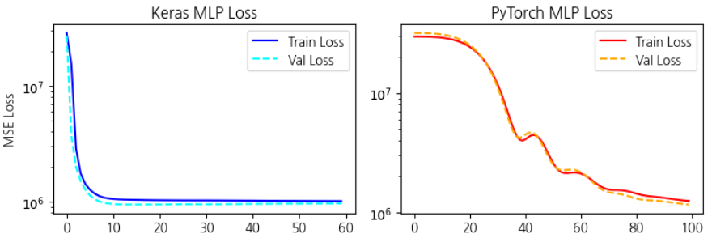

```python
# 백그라운드 데이터 설정 (100개 텐서)
background_pt = X_train_pt[:100]
explainer_pt = shap.DeepExplainer(pt_model, background_pt)
# SHAP 값 계산 (test 데이터 15개)
shap_values_pt = explainer_pt.shap_values(X_test_pt[:15])

# 리스트 형태 반환을 고려하여 배열로 변환 후 형태 맞추기
if isinstance(shap_values_pt, list):
    pt_shap_arr = np.array(shap_values_pt[0])
else:
    pt_shap_arr = np.array(shap_values_pt)
pt_shap_arr = pt_shap_arr.squeeze()          # (15, 7, 1) -> (15, 7)

# 각 피처별 평균 |SHAP| 계산
pt_imp = np.abs(pt_shap_arr).mean(axis=0)
```

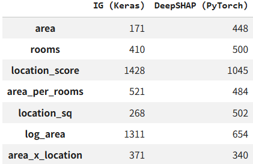

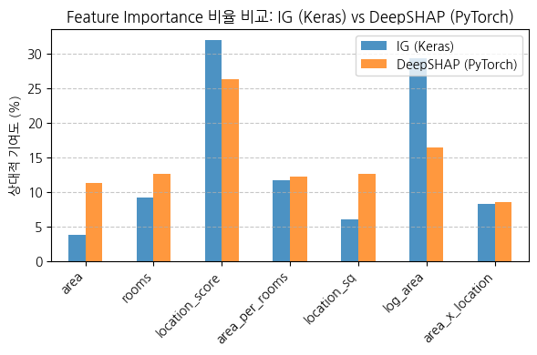

**SHAP Family 간 Kendall $\tau$ 비교.** 각 모델이 중요하게 보는 피처가 얼마나 유사한지를 순위 상관으로 측정한다.

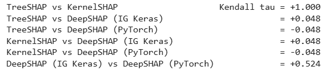

결과는 세 갈래로 읽는다.

1. **TreeSHAP vs KernelSHAP (Kendall $\tau = +1.0$).** RF 모델에 대해 두 설명 도구가 완전히 동일한 피처 기여도 순위를 도출했다. 다만 강한 상관관계($r = +0.981$)를 앞서 확인했으므로, KernelSHAP의 기여도 **값 자체**는 왜곡을 의심해야 한다.
2. **트리 모델(Tree/Kernel) vs 신경망 모델(DeepSHAP) (Kendall $\tau \approx \pm 0.048$).** 상관계수가 거의 0이다. RF와 MLP 모델이 중요하게 생각하는 변수의 우선순위가 완전히 다르다는 뜻이다. SHAP은 데이터 자체가 아니라 **모델의 학습 결과**를 설명하는 도구이므로, 구조가 다르면 기여도 순위도 다르다.
3. **DeepSHAP IG (Keras) vs DeepSHAP (PyTorch) (Kendall $\tau = +0.524$).** Keras에서 IG로 계산한 결과와 PyTorch에서 DeepSHAP으로 계산한 결과 사이에는 절반 정도의 양의 상관이 있다. IG는 경로를 적분으로 근사하는 방식이고 DeepSHAP은 역전파를 이용해 기여도를 분배하는 방식이므로, 이 차이는 계산 방식의 차이에서 온다. 확인을 위해 PyTorch 모델에도 IG를 적용해 비교한다.

> **핵심 메시지**
> Attribution 도구는 데이터 자체가 아니라 **모델의 학습 결과**를 설명하는 도구다. 도구들 사이의 차이는 충실도, 즉 완전성 공리를 만족하는지 여부에서 온다.

> **정리 — Part B**
> **Integrated Gradients(IG)** 는 경로 적분으로 Vanilla Gradient의 포화 문제를 해결하고, 완전성과 구현 불변성 두 공리를 동시에 만족한다. baseline 선택과 평균화가 IG 결과의 안정성을 크게 좌우하므로 다중 baseline 평균이 표준이다.
> **SmoothGrad** 는 입력 노이즈 perturbation을 $T$ 회 평균한다.
> **SHAP Family**(KernelSHAP · Sampling · Tree · DeepSHAP · CausalSHAP)는 모델 타입(트리 · DNN · black-box)과 Feature 상관 구조, 인과 그래프 보유 여부에 따라 선택한다. KernelSHAP의 Feature 독립 가정은 의료와 금융에서 특히 함정이 된다.

---

**⟨ Part C ⟩ Attribution 신뢰성 검증 — 방법 간 일치도와 Sanity Check**

> Attribution 결과의 신뢰성은 어떻게 검증할까?
> 여러 방법이 같은 순위를 내는지를 Kendall $\bar{\tau}$ 로 재고,
> 모델과 라벨을 무작위화하는 Sanity Check로 도구 자체를 진단한다.

## 7.1.13 Attribution 방법 간 일치도: Kendall τ̄
<!-- 슬라이드 470~473 -->

Part C의 질문은 하나다. **Attribution 결과의 신뢰성은 어떻게 검증할까.** 검증의 축은 두 개이며, 하나는 방법 간 일치도이고 다른 하나는 Sanity Check다.

### 여러 방법이 같은 답을 내는가

같은 신경망의 Feature 기여도를 측정하는 Attribution 방법은 여럿이다. Gradient(Saliency), Integrated Gradients, SmoothGrad, SHAP, CAM/Grad-CAM, LIME이 모두 후보다. 이 방법들이 중요한 Feature의 **순위**에 얼마나 일치하는지를 정량적으로 측정하는 것이 첫 번째 검증이다.


### 값이 아니라 순위를 비교하는 이유

도구마다 내놓는 값의 단위와 스케일이 다르다. TreeSHAP과 KernelSHAP은 예측 대상과 같은 단위의 값을 주므로, 상대 기여도로 읽으려면 전체 합으로 한 번 정규화해야 한다. Gradient 계열은 애초에 다른 스케일의 값을 준다. PI처럼 작은 값이 몰려 있는 도구에서는 값을 나란히 놓아도 어느 Feature가 앞인지 읽히지 않는다.

그래서 비교의 대상은 값이 아니라 순위가 된다. Kendall $\tau$ 는 두 순위에서 쌍이 얼마나 같은 방향으로 놓였는지를 재는 통계량이므로, 스케일이 서로 다른 도구들을 같은 자리에 놓고 비교할 수 있게 해 준다. 여러 도구가 같은 순위를 낸다면 그 순위는 특정 방법론의 산물이 아니라는 뜻이 되고, 그때 비로소 Attribution 결과를 해석의 근거로 쓸 수 있다. ⚠확인


### 측정 절차 네 단계

1. 하나의 신경망 모델과 하나의 데이터셋에서 $K$ 가지 Attribution 방법을 각각 계산하여 $K \times d$ 크기의 순위 행렬 $R$ 을 만든다.
2. 쌍별 Kendall $\tau$ 를 계산한다. 즉 모든 $a, b$ 에 대해 $\tau(R_a, R_b)$ 를 구하고, 그 평균을 $\bar{\tau}$ 로 정의한다.
3. $\bar{\tau} > 0.7$ 이면 방법 간 일치도가 높다고 보고, Attribution 해석을 신뢰할 수 있다.
4. $\bar{\tau} < 0.4$ 이면 방법마다 다른 Feature를 강조하고 있다는 뜻이므로, Attribution 자체의 가설 종속성을 의심해야 한다. 이 경우 Sanity Check로 진단을 이어 간다.

### Sanity Check가 등장한 배경

Adebayo 2018의 「Sanity Checks for Saliency Maps」는 이 분야의 기준을 바꾼 연구다. 일부 Attribution 방법, 구체적으로 Guided Backprop과 Deconvolution 계열은 **모델과 라벨이 무작위로 바뀌어도 시각적으로 거의 같은 saliency(민감도) map을 산출했다.** 이 발견 이후 새로운 기준이 확립되었다. 새로 제안되는 Attribution 방법은 Sanity Check를 통과해야 한다.

### 실습 7.1.4 — Attribution 방법 간 일치도 측정 : Kendall τ̄ + Top-N agreement

> 노트북: `code/7.1.4.Kendall_Attribution_Agreement.ipynb`

**목적.** Housing Dataset을 생성하고 MLP 모델을 학습한 뒤, 여섯 가지 Attribution을 측정하여 순위 일치도(Kendall $\bar{\tau}$)와 상위 $N$ 개의 일치도(Top-N agreement)를 측정한다.

**여섯 가지 Attribution.** Vanilla Gradient, IG, SmoothGrad, PI, KernelSHAP, LIME을 쓴다. 이 가운데 앞의 세 실습에서 다루지 않은 두 가지를 정리해 둔다.

**PI (Permutation Importance).** 한 Feature의 값을 무작위로 섞어 넣고 성능이 얼마나 변하는지를 확인한다. 전역 기여도를 재는 도구이며, 직관적이고 사용하기 편하다는 장점이 있다. 반면 Feature 사이에 상관이 있으면 취약하고, 비현실적인 입력 조합이 만들어지면서 왜곡이 발생한다.

**LIME.** 한 입력 Feature 주변을 선형 모델로 근사하여 국소적인 Feature 의존도를 측정한다. 구체적으로는 입력 데이터에서 무작위로 Feature를 골라 평균값을 대입하는 방식으로 Feature를 "끄고", 출력의 변화를 관찰한다. 이때 거리는 제거한 Feature의 **개수**로 정의한다. Feature의 위치가 아니라 꺼진 숫자만 보는 것이다. 그렇게 만든 데이터를 선형 모델에 넣어, 현재 Feature를 켰을 때 출력이 얼마나 증가하는지를 기여도로 계산한다.

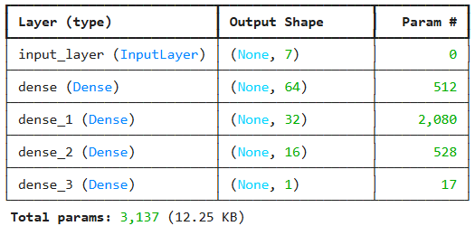

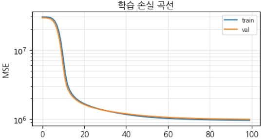

여섯 방법 가운데 PI는 한 피처의 값만 셔플하여 MSE 증가량을 측정하고, 이를 `n_repeats` 회 반복하여 평균한다.

```python
def permutation_importance_attr(model, X, y, n_repeats=5, rng=None):
    if rng is None: rng = np.random.default_rng(0)
    y_pred_base = model.predict(X, verbose=0).flatten()
    mse_base = np.mean((y - y_pred_base)**2)
    importances = np.zeros(X.shape[1])
    for j in range(X.shape[1]):
        diffs = []
        for _ in range(n_repeats):
            X_perm = X.copy()
            X_perm[:, j] = rng.permutation(X_perm[:, j])
            y_perm = model.predict(X_perm, verbose=0).flatten()
            diffs.append(np.mean((y - y_perm)**2) - mse_base)
        importances[j] = np.mean(diffs)
    return importances
```

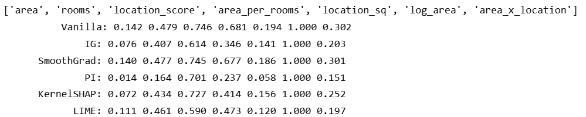

**결과 읽기.** 여섯 방법의 순위를 행렬로 놓고 비교하면, 3위와 4위 자리에서만 위치 변동이 일어난다. 즉 대부분의 순위는 방법과 무관하게 유지된다.

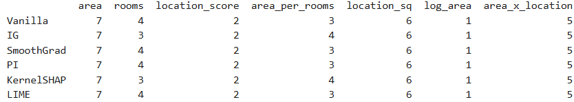

**계열 내 일치도와 계열 간 일치도.** Kendall $\bar{\tau}$ 는 $[-1, +1]$ 범위를 가지며, 여기에 Top-3 Agreement와 Top-5 Agreement를 함께 본다. 그리고 같은 계열 안에서의 $\tau$ 와 서로 다른 계열 사이의 $\tau$ 를 나누어 비교한다. 계열 간 $\tau$ 가 계열 내 $\tau$ 보다 크거나 같다면, 결과가 방법론에 영향을 받지 않는다는 뜻이다.

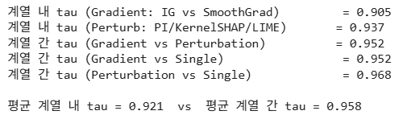

여기서 계열은 계산 방식을 뜻한다. Gradient로 접근하는 방식, 입력에 노이즈를 넣는 방식, 샘플링으로 접근하는 방식으로 나뉘며 SmoothGrad와 PI는 노이즈를 넣는 쪽에 속한다. 계열 간 τ가 더 높다는 것은 Feature 순위가 접근 방식에 좌우되지 않았다는 뜻이다.

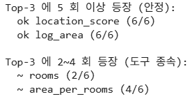

Top-3 Agreement는 82% 수준에 그친다. 3위 자리에 4위 Feature가 가끔 들어오기 때문이다. 반면 Top-5 Agreement는 100%다. 3위와 4위가 서로 바뀌어도 다섯 자리 안에는 여섯 방법 모두 같은 Feature가 들어오기 때문이다.

---

## 7.1.14 Sanity Check: 모델 무작위화와 라벨 무작위화
<!-- 슬라이드 474~478 -->

### 학습을 지워도 그림이 같다

Adebayo 2018이 보여 준 현상은 다음과 같다. 상위 레이어부터 순차적으로 parameter를 초기화해 나가도 여러 도구가 시각적으로 거의 같은 saliency map을 산출한다. 모델이 학습한 것이 지워지고 있는데도 설명 그림이 변하지 않는다면, 그 그림은 모델이 학습한 Feature의 기여도를 측정하고 있지 않다는 뜻이다. Attribution의 존재 이유가 무너지는 것이다.

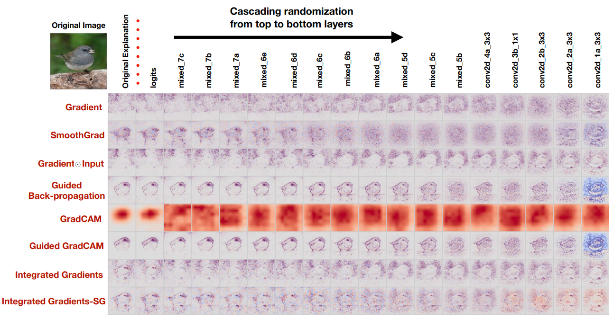

*그림 7-5. 상위 레이어부터 점진적으로 무작위화해도 일부 도구의 설명 그림은 변하지 않는다.*

각 행이 하나의 Attribution 도구이고, 오른쪽으로 갈수록 상위 layer부터 순서대로 초기화가 진행된 상태다. 오른쪽 끝은 학습된 정보가 거의 다 날아간 모델인데, 그런 모델에서도 픽셀 민감도의 패턴은 그대로 남아 있다.

### 여덟 도구의 검사 결과

Adebayo 2018은 당시 인기 있던 여덟 개 Attribution 도구를 대상으로 두 가지 sanity check, 즉 모델 무작위화와 라벨 무작위화를 수행했다. 핵심 발견은 Guided Backprop과 Deconvolution이 모델과 라벨이 무작위로 바뀌어도 시각적으로 거의 동일한 saliency map을 산출한다는 점이었다. 이는 두 도구가 모델이 학습한 패턴이 아니라 **입력 이미지의 edge 검출에 가까운 신호**를 보여주고 있었다는 것을 뜻한다. 이후 학계에서 두 도구는 표준 보고에서 제외되었고, IG · SmoothGrad · SHAP이 표준 도구로 정착했다.

다음은 그 검사 결과를 그대로 옮긴 것이다.

| Attribution 도구 | 발표 연도 | 모델 무작위화 통과 | 라벨 무작위화 통과 | Adebayo 권장도 |
|---|---|---|---|---|
| Vanilla Gradient (Saliency) | 2013 | △ (입력 의존이 큼) | ○ 부분 통과 | 보조 도구 (디버깅용) |
| Gradient × Input | 2014 | △ | ○ | 보조 도구 |
| Integrated Gradients (IG) | 2017 | ○ | ○ | ★★★ 표준 (공리 만족) |
| SmoothGrad | 2017 | ○ | ○ | ★★★ 표준 (Vanilla 안정화) |
| Grad-CAM (CNN) | 2017 | ○ | ○ | ★★ CNN 한정 |
| LIME | 2016 | ○ | ○ | ★★ 일반 모델 적용 |
| SHAP (KernelSHAP) | 2017 | ○ | ○ | ★★★ 공리 만족 (Shapley) |
| Guided Backprop | 2014 | ✗ | ✗ | 사용 금지 — edge detector화 |
| Deconvolution | 2014 | ✗ | ✗ | 사용 금지 |

### 언제 Sanity Check가 필요한가

두 가지 상황에서 표준 검사를 통과해야 한다.

- Attribution 방법 간 일치도 Kendall $\bar{\tau}$ 가 기준을 통과하지 못할 때
- 일치도가 높더라도, 그것이 진짜로 모델이 학습한 패턴인지 확인이 필요할 때

### 검사 1: 모델 무작위화 (Model Randomization Test)

1. 학습된 모델 $f$ 의 Attribution map $A_f(x)$ 를 산출한다.
2. 모델 $f$ 의 가중치를 layer 단위로 점진적으로 무작위화하여 $f_{\text{random}}$ 을 생성한다.
3. $A_{f_{\text{random}}}(x)$ 를 산출한다.
4. $A_f$ 와 $A_{f_{\text{random}}}$ 의 시각적·정량적 유사도를 비교한다. SSIM이나 Pearson 상관을 쓴다.

좋은 Attribution 도구라면 모델이 학습한 것을 반영하므로, 무작위 가중치 모델의 결과와 크게 달라야 한다. 두 결과가 거의 같다면 그 도구는 모델의 학습과 무관한 신호, 즉 edge 같은 것을 보여주고 있는 것이다.

### 검사 2: 라벨 무작위화 (Label Randomization Test)

1. 같은 학습 데이터로 두 가지 모델을 학습한다. (a)는 진짜 라벨을 쓰고, (b)는 무작위로 셔플된 라벨을 쓴다.
2. 두 모델 각각의 Attribution $A_a$, $A_b$ 를 산출한다.
3. 두 Attribution의 유사도를 비교한다.

라벨이 무작위라면 모델이 학습한 것은 우연한 패턴에 불과하다. 그런데도 두 결과가 거의 같다면, 그 Attribution 도구는 모델의 학습 결과를 반영하지 못하고 있는 것이다.

### 실습 7.1.5 — Sanity Check

> 노트북: `code/7.1.5.Sanity_Check.ipynb`

**목적.** 합성 의료 데이터를 생성하고 모델을 준비·학습한 뒤, 모델 무작위화 검사와 라벨 무작위화 검사를 수행한다.

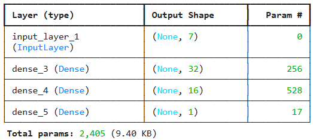

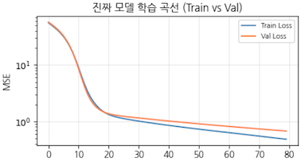

**Model Randomization Test.** 파라미터를 무작위로 바꾼 모델에서 IG Attribution을 측정하고, 정상적으로 학습된 모델에서 측정한 IG와 순위 일치도를 비교한다. 이 실습에서는 Pearson $r$ 이 위험한 값으로 나왔다(p는 p-value를 뜻한다). 즉 무작위 모델과 학습 모델의 Attribution이 생각보다 비슷하게 나온 것이다.

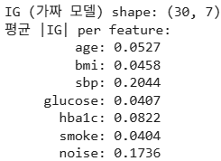

여기서 볼 것은 값의 크기가 아니라 순위다. 무작위 모델의 기여도는 전체적으로 작지만 그 안에도 Feature 사이의 순위가 있고, 그 순위는 학습된 모델과 크게 다르지 않았다. Pearson r 이 역순으로 0.67 수준이라는 것은 의미 있는 순서가 남아 있다는 뜻이다.

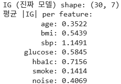

**Label Randomization Test.** Target 값을 셔플하여 학습시킨 뒤 IG Attribution을 측정하고, 정상 모델의 Attribution 순위와 일치도를 비교한다.

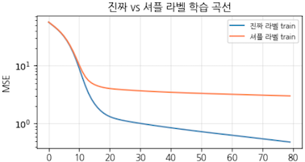

*그림 7-6. 라벨을 셔플하면 모델은 학습할 것이 없다. 이때도 Attribution이 같다면 그 도구를 신뢰할 수 없다.*

셔플 라벨 모델의 손실도 처음에는 조금 내려간다. 이것은 학습이 진행되는 것이 아니라 출력을 평균값 근처로 내보내도록 맞춰지는 구간이다. 그 뒤로는 배울 것이 없어 정체하는 반면, 진짜 라벨 모델은 계속 손실이 내려간다.

### Pearson r 대신 Kendall τ

실습 7.1.5에서 확인되듯이 IG는 sanity check를 통과하는 표준 도구임에도, 검사 1의 Pearson $r$ 에서는 경계에 걸리는 값이 나오기도 한다. 이때 두 통계량의 성격 차이를 이해할 필요가 있다.

- **Pearson $r$** : 순위의 상관도를 보되 값의 크기 순서에 민감하다.
- **Kendall $\tau$** : 순위쌍의 일치도를 본다. 순위 쌍이 맞는지에 민감하며, Attribution 진단에서는 이 정보가 더 가치 있다.

Sanity check의 표준 도구는 IG, SmoothGrad, SHAP 세 가지다.

> **정리 — Part C**
> **Kendall $\bar{\tau}$** 는 여러 Attribution 방법의 순위 일치도를 측정한다. $\bar{\tau} > 0.7$ 이면 신뢰할 수 있고, $\bar{\tau} < 0.4$ 이면 의심해야 한다.
> **Sanity Check** 는 모델과 라벨을 무작위화하여 Attribution의 음성 통제를 수행한다.
> 표준 도구는 IG, SmoothGrad, SHAP이며 CNN에는 Grad-CAM, 일반 모델에는 LIME이 더해진다.

---

**⟨ Part D ⟩ Spurious Correlation 탐지와 학습된 표현의 의미**

> Attribution 도구로 모델의 의존 구조를 진단해 보자.
> Spurious Correlation — 가짜 상관에 의존하는 모델을 탐지하기.
> TCAV(Concept Activation Vector) — 학습된 표현이 어떤 개념을 인코딩하는지 확인하기.

## 7.1.15 Spurious Correlation: 가짜 상관에 의존하는 모델
<!-- 슬라이드 479 -->

Part D는 Attribution 도구로 모델의 의존 구조를 직접 진단하는 작업이다. 두 갈래로 나뉜다. 하나는 가짜 상관에 의존하는 모델을 탐지하는 **Spurious Correlation** 진단이고, 다른 하나는 학습된 표현이 어떤 개념을 인코딩하는지 확인하는 **TCAV**다.


### 쉬운 신호를 먼저 쓴다

가짜 상관에 의존하는 학습은 shortcut이라고도 부른다. 모델은 라벨을 맞히는 데 더 쉬운 신호가 있으면 그것을 쓴다. 진짜로 보아야 할 부분이 어렵고 곁에 놓인 신호가 쉬우면, 모델은 어려운 쪽을 배우지 않고 쉬운 쪽으로 답을 맞춘다. 원래 존재하지 않는 관계를 학습한다는 말은 그런 뜻이다. 그리고 이렇게 학습된 모델도 검증 정확도는 높게 나오기 때문에, 성능 지표만으로는 문제가 드러나지 않는다.


### 모델은 진짜 원인이 아닌 것을 배운다

모델은 진짜 원인이 아닌 상관 변수에 의존하는 법을 학습하는 경우가 많다. ImageNet 학습에서 모델이 늑대와 개를 구분할 때 배경의 눈(snow)에 의존할 수 있다는 것이 고전적인 예다. Attribution 분석은 이런 의존을 탐지할 수 있는 도구다.

### 세 조건이 동시에 충족될 때

Spurious Correlation은 다음 세 조건이 동시에 충족될 때 발생한다.

1. 학습 데이터에서 가짜 Feature(배경색, 이미지 워터마크 등)와 레이블의 상관이 높다.
2. 모델 용량이 충분해서 가짜 Feature까지 충분히 학습할 수 있다.
3. 검증 데이터도 같은 상관 구조를 갖는다. 그렇지 않다면 검증 정확도가 떨어져 탐지가 가능하다.

세 번째 조건이 특히 중요하다. 이 조건 때문에 **검증 정확도로는 Spurious 의존을 탐지하기 어렵다.** 학습 데이터와 검증 데이터가 같은 상관 구조를 가지면 두 집합 모두에서 높은 성능이 나오기 때문이다. 반면 Attribution 분석은 모델 내부의 의존 구조를 직접 들여다보고, 모델이 가짜 Feature에 의존한다는 사실을 정량적으로 찾아낼 수 있다.

---

## 7.1.16 Spurious 탐지 워크플로우와 실증 사례
<!-- 슬라이드 480~483 -->

### Attribution 기반 탐지 워크플로우

1. **가설 수립** — 도메인 지식으로 가짜 Feature 후보를 사전에 식별한다. 배경색, 측정 장비 ID, 데이터 수집 기간 등이 후보가 된다.
2. **모델 학습** — 표준 절차로 모델을 학습하고 검증 정확도를 측정한다. 이 단계에서는 높은 정확도가 나오는 것이 일반적이다.
3. **Attribution 산출** — IG 또는 SHAP으로 입력별 Attribution map을 생성한다.
4. **가짜 Feature 의존도 측정** — (가짜 Feature 영역의 Attribution 합) / (전체 Attribution 합)을 계산한다. 이 비율이 0.3 이상이면 Spurious를 의심한다.
5. **OOD 검증** — 가짜 Feature가 있으면서 라벨이 다른 OOD(out-of-distribution) 데이터에서 성능을 측정한다. 성능이 크게 떨어지면 Spurious로 확정한다.

### Spurious 탐지 지표

Sagawa 2020은 Worst-group Accuracy와 Group Robustness Gap을 지표로 제시했다. 폐 X-ray 데이터에서 병원 ID가 A, B, C 세 개의 group을 이룬다고 하자. $\mathrm{Acc}(A) = 0.95$, $\mathrm{Acc}(B) = 0.92$, $\mathrm{Acc}(C) = 0.70$ 이라면 $\mathrm{Acc}_{\text{worst}} = 0.70$ 이고 Gap은 $0.25$ 다. 평균 정확도가 아무리 높아도 최악 그룹의 정확도가 낮으면 그 모델은 특정 그룹에서 실패하고 있는 것이다.

### 실증 사례

Spurious 의존이 실제 모델 배포에서 발견된 대표 사례가 세 건 있다. 모두 검증 정확도는 높았지만 OOD에서 실패했고, 모두 Attribution 분석으로 사전에 진단할 수 있었던 사례들이다.

**사례 1) Zech 2018 — 폐 X-ray 폐렴 진단 모델의 장비 brand 의존.** Zech 등은 폐 X-ray로 폐렴을 진단하는 CNN 모델을 분석했다. 모델의 검증 정확도는 95%였지만, Attribution 분석에서 모델이 **장비 brand 마크**에 의존하고 있음이 확인되었다. 원인은 폐렴 환자가 특정 병원, 특정 장비로 더 많이 촬영되었다는 데이터 수집 구조에 있었다. 모델은 "이 장비 = 폐렴 가능성 높음"이라는 가짜 상관을 학습한 것이다. 다른 병원의 X-ray에 적용하면 정확도가 70%대로 급락했다. 대응책은 사전에 가짜 Feature 후보를 식별하고, 데이터 수집 단계에서 마크를 제거하거나 다중 병원 데이터를 수집하는 것이다.

**사례 2) DeGrave 2021 — COVID-19 흉부 영상 모델의 shortcut learning.** DeGrave 등은 COVID-19 흉부 X-ray 진단을 위해 학습된 여러 모델에 sanity check를 수행했다. 대부분의 모델이 폐 병변이 아니라 이미지의 R/L 마커 위치, 환자 자세, 이미지 외곽의 텍스트 메타데이터 같은 **shortcut feature**에 의존하고 있었다. 원인은 COVID-19 데이터셋에서 양성(응급실에서 누워서 촬영)과 음성(외래에서 서서 촬영)의 촬영 자세가 통계적으로 달랐다는 데 있다. 모델은 "누워서 촬영 = COVID"를 학습했고, 검증 데이터도 같은 분포였기 때문에 정확도가 높게 나왔다. 대응책은 다양한 촬영 자세와 다중 기관 데이터를 확보하고, GroupDRO로 학습하며, Attribution으로 사전 검증하는 것이다. 여기서 GroupDRO(Group Distributionally Robust Optimization)는 학습 스텝에서 자주 나오지 않는 데이터 그룹, 즉 음성이면서 누워서 촬영한 경우나 양성이면서 서서 촬영한 경우에 가중치를 높이는 방법이다.

**사례 3) Caruana 2015 — 중환자실 폐렴 사망 위험 모델의 천식 환자 역설.** Caruana 등은 중환자실 폐렴 사망 위험 예측 모델을 분석했다. 데이터에서 "천식 병력 있음"이 "사망 위험 낮음"과 강하게 상관되어 있었다. 원인은 처치 속도였다. 천식 환자는 폐렴이 발견되면 더 빠르고 집중적인 치료를 받으며, 그 결과 사망률이 낮아진다. 즉 모델은 **"치료 우선순위"라는 숨겨진 변수**를 학습한 것이다. 이 사례는 spurious correlation이 단지 데이터 편향이 아니라 시스템·전처리·선택의 흔적일 수 있음을 보여 준다.

### 공통 교훈

1. 검증 정확도만으로는 Spurious 의존을 잡을 수 없다.
2. Attribution map의 가짜 Feature 영역 의존도와 OOD 검증이 필수 도구다.
3. 의료·자율주행·금융처럼 안전이 critical한 영역에서는 배포 전 Spurious 진단이 의무여야 한다.


이 진단이 표준 절차로 자리 잡은 것은 비교적 최근이다. 몇 년 전까지도 검증 정확도만 확인하고 배포하는 경우가 흔했다. 지금은 가짜 Feature 후보를 미리 세우고, Attribution map으로 모델이 그 영역을 보고 있는지 확인하고, 상관 구조가 깨진 데이터셋으로 다시 검증하는 절차가 기본으로 쓰인다.


### 실습 7.1.6 — Spurious Correlation

> 노트북: `code/7.1.6.Spurious_Correlation.ipynb`

**목적.** 배경색이 라벨과 상관되도록 설계한 합성 이미지 데이터에서 모델이 가짜 Feature에 의존하도록 유도하고, 그 의존을 Attribution으로 진단한다.

**데이터.** 진짜 신호는 이미지 중앙부의 색 차이다. 중앙부 RGB가 $[0.55, 0.45, 0.45]$ 인지 $[0.45, 0.45, 0.55]$ 인지가 라벨을 결정한다. 여기에 배경색을 라벨과 상관시켜 모델이 배경을 학습하도록 유도한다. OOD 데이터에서는 배경색을 무작위로 바꾼다.

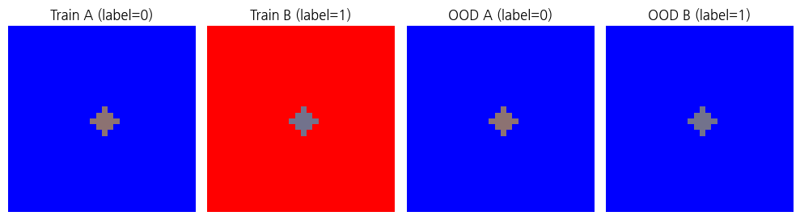

중앙부의 두 색은 RGB 값이 조금 다를 뿐이어서 눈으로는 거의 구별되지 않는다. 반면 배경색 차이는 한눈에 들어온다. 모델이 쉬운 쪽을 보도록 일부러 유도한 설계다. OOD에서는 배경색을 무작위로 넣어 같은 라벨에 두 배경이 모두 섞이게 했다.

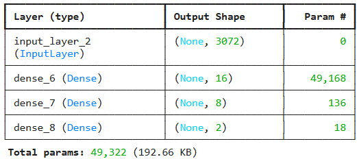

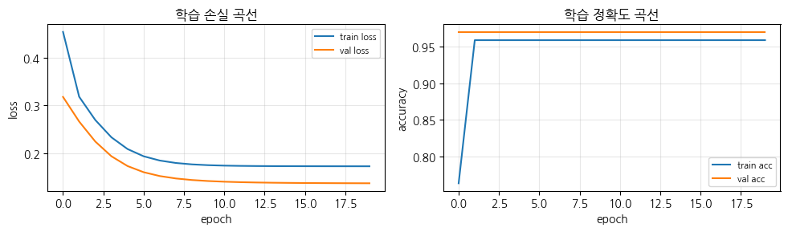

**Test와 OOD 평가 비교.** OOD 정확도는 무작위 수준으로 떨어진다. 성능이 급격하게 하락하는 것이다.

**IG로 영역별 기여도 산출.** 픽셀별로 Attribution을 계산한 뒤, 영역별 IG 합을 전체 IG 합으로 나눈 비율을 확인한다.

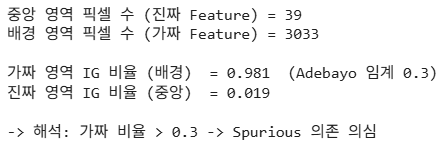

이미지에서는 픽셀 하나하나가 Feature이므로, 픽셀별로 Attribution을 구한 뒤 영역 단위로 합산해 비율을 낸다. 앞의 OOD 성능 급락이 첫 번째 신호였다면, 이 비율은 모델이 실제로 배경을 보고 있었다는 것을 확인해 주는 두 번째 신호다.

**픽셀별 IG 히트맵.** 시각화해 보면 모델이 이미지의 모든 곳을 보고 있음이 드러난다.

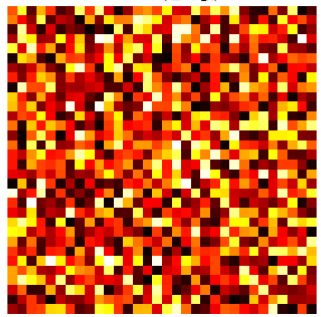

**Worst-group Accuracy와 Group Robustness Gap.** 그룹별 정확도를 나누어 보면, 배경색이 학습 때와 반대인 그룹의 정확도가 0으로 떨어진다.

![OOD 그룹별 정확도 — (label, bg_is_red) 조합에서 [0 0]과 [1 1]은 정확도 1.000, [0 1]과 [1 0]은 0.000이며 Worst-group accuracy 0.000, Robustness Gap 1.000](images/s483_04.png)

*그림 7-7. 평균 정확도가 아니라 최악 그룹 정확도를 보아야 가짜 의존이 드러난다.*

갭이 크다는 것은 그룹을 나눈 변수에 라벨 말고 다른 정보가 실려 있다는 신호다. [0 1]과 [1 0]은 학습 때 본 적이 없는 라벨과 배경색의 조합인데, 그 두 그룹에서 정확도가 0이다. 배경색이라는 그룹 변수 하나가 예측을 전부 결정하고 있는 것이다.

---

## 7.1.17 TCAV: 학습된 표현이 인코딩한 개념
<!-- 슬라이드 484~487 -->

### 중간 layer는 어떤 개념을 담고 있는가

Attribution이 입력 Feature의 기여도를 묻는다면, TCAV는 모델의 **내부 표현**을 묻는다. 정확히는 중간 layer의 activation이 인간이 해석할 수 있는(human-interpretable) 개념을 인코딩하고 있는지를 측정한다. Kim et al. (2018)의 TCAV(Testing with Concept Activation Vectors)가 이 분야의 표준 도구다.

### 두 질문의 차이

- **Attribution** : 한 예측에 어떤 Feature가 기여했는가?
- **TCAV** : 전체 클래스 예측이 어떤 "개념"에 의해 영향을 받는가?

여기서 개념이란 줄무늬, 빨간색, 날개처럼 사람이 이름을 붙일 수 있는 시각적·의미적 단위를 말한다.

### 절차

1. 한 개념을 대표하는 양성·음성 이미지 셋을 준비한다. 예컨대 줄무늬가 있는 이미지와 없는 이미지를 모은다.
2. 신경망의 중간 layer activation 위에서 두 클래스를 구분하는 선형 분류기를 학습한다. 그 분류기의 normal vector가 곧 "줄무늬 방향"의 Concept Activation Vector(CAV)가 된다.
3. 한 클래스 예측의 gradient가 그 CAV와 정렬되는 정도를 측정한다. 이것이 TCAV score다.


여기서 중간 layer의 activation은 latent vector 또는 representation vector라고도 부른다. 절차의 요지는 개념을 그 공간 안의 한 방향으로 바꾸어 놓는 데 있다. 개념이 방향으로 표현되고 나면, 예측의 gradient가 그 방향과 이루는 정렬 정도를 재는 것만으로 개념이 예측에 관여했는지를 수치로 말할 수 있다.

이 절차의 3단계는 **클래스 예측 헤드가 있을 때** 성립한다. 개념이 예측을 얼마나 밀었는지를 재는 것이므로, 밀 대상인 예측이 있어야 한다. 뒤의 실습 7.1.8은 대상이 Auto-Encoder여서 그 헤드가 없다. 그래서 3단계 대신 **CAV 자체의 성분**을 본다. 개념 방향이 어느 잠재 차원에 얼마나 실려 있는지를 재는 것이며, 이 값을 여기서는 **개념 정렬도(concept alignment)** 라고 부른다. 원형 TCAV score와는 재는 대상이 다르다.


### 실습 7.1.8 — MNIST Auto-Encoder 개념 정렬도 측정

> 노트북: `code/7.1.8.TCAV_MNIST_AE.ipynb`

**목적.** MNIST Auto-Encoder를 학습뒤, Encoder의 출력이 개념을 인코딩한 수준을 TCAV의 방식으로 측정한다. 여기서 개념은 0~9의 숫자다. 앞에서 말했듯 Auto-Encoder에는 클래스 예측 헤드가 없으므로, 재는 값은 원형 TCAV score가 아니라 **개념 정렬도** 다.

**절차.**

1. 학습된 모델에서 train data의 Encoder 출력, 즉 Latent Vector를 수집한다.
2. Latent Vector를 Logistic Regressor로 학습한다. 이때 True는 정답 숫자, False는 다른 숫자다.
3. 개념과 latent dimension 사이의 정렬 수준, 즉 그 차원이 개념을 인코딩한 정도를 Regressor의 weight에서 추출한다.

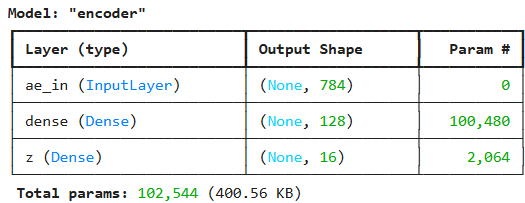

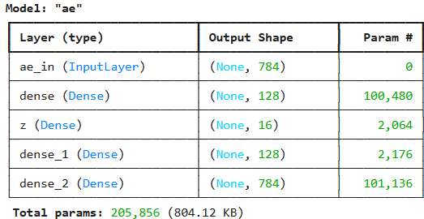

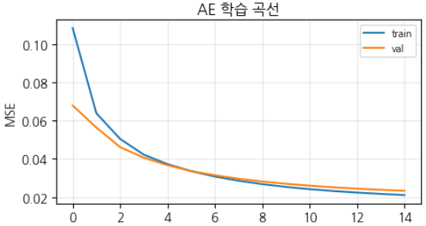

한 개념에 대해 양성 80개·음성 80개를 뽑아 로지스틱 회귀를 한 번만 학습하고, 계수의 절댓값을 정규화하여 16개 $z$ 차원의 개념 정렬도를 한꺼번에 반환한다. 함수와 변수 이름에 남은 `tcav_` 는 노트북과 맞추기 위한 것이며, 재는 값은 개념 정렬도다.

```python
from sklearn.linear_model import LogisticRegression

# 개념 = 0~9 숫자. 각 개념에 대해 양성 = 그 숫자, 음성 = 나머지
# 특정 개념에 대해 16개 전체 z 차원의 개념 정렬도를 한 번에 반환
def tcav_scores_for_concept(z_features, y_labels, concept_class,
                            n_pos=80, n_neg=80, rng=None):
    if rng is None: rng = np.random.default_rng(0)
    pos_idx = np.where(y_labels == concept_class)[0]
    neg_idx = np.where(y_labels != concept_class)[0]
    if len(pos_idx) < n_pos or len(neg_idx) < n_neg:
        return np.full(z_features.shape[1], np.nan)   # nan array
    pos_sel = rng.choice(pos_idx, n_pos, replace=False)
    neg_sel = rng.choice(neg_idx, n_neg, replace=False)

    # 선형 분류기 학습 (개념당 한 번만 수행)
    Xc = np.concatenate([z_features[pos_sel], z_features[neg_sel]])
    yc = np.concatenate([np.ones(n_pos), np.zeros(n_neg)])
    clf = LogisticRegression(max_iter=200, random_state=0).fit(Xc, yc)

    # normalized weight — 전체 z 차원의 절대 기여도를 배열로 반환
    w = clf.coef_[0]
    w_norm = np.abs(w) / (np.abs(w).sum() + 1e-12)
    return w_norm
```

이 함수를 10개 개념에 대해 반복하면 $10 \times 16$ 의 개념 정렬도 행렬이 채워진다.

```python
# 10 개념 × 16 z 차원 매트릭스
tcav_matrix = np.zeros((10, Z_DIM))
for c in range(10):
    tcav_matrix[c, :] = tcav_scores_for_concept(z_tr, y_tr, c,
                                                rng=np.random.default_rng(SEED))
```

**결과.** 개념과 z 차원의 정렬 수준이 0.15를 넘으면 강한 정렬로 본다.

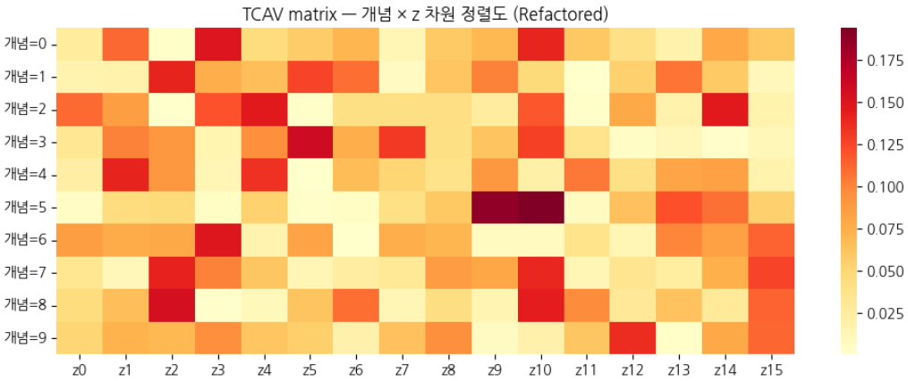

**개념 축의 확인.** 강한 정렬을 갖는 z 차원의 값을 바꾸어 디코딩하면, 그 차원이 실제로 어떤 시각적 변화를 만들어 내는지를 개념과 대조하여 확인할 수 있다.

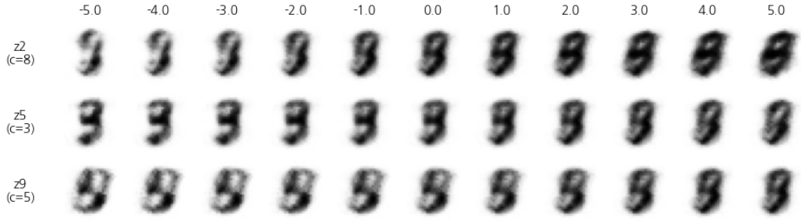

*그림 7-8. 개념 정렬도가 높은 차원을 흔들면 그 개념에 해당하는 시각적 변화가 나타난다.*

한 차원의 효과만 보기 위해 나머지 차원은 모두 평균값으로 채우고 대상 차원 하나만 −5에서 +5까지 움직여 Decoder에 넣는다. 그 결과 z2는 8에 가까운 형태로, z5는 3에 가까운 형태로 변해 간다. 정렬도가 가리킨 개념과 실제 변화가 맞는지를 이렇게 대조한다.

> **정리 — Part D**
> **Spurious Correlation 탐지** 는 검증 정확도로는 잡을 수 없고, Attribution 분석과 OOD 검증으로만 사전 진단할 수 있다.
> **TCAV** 는 신경망 중간 layer가 사람이 해석 가능한 개념을 인코딩하는 정도를 측정하며, MIG와 함께 표현 학습을 해석하는 도구다.
> 두 도구를 통해 Attribution은 단순한 예측 분배를 넘어, 학습된 의존과 표현의 **의미**까지 진단할 수 있게 된다.

---

**⟨ Part E ⟩ Attribution 의 한계와 인과 추론 입문**

> Attribution 도구들이 모두 안정성·신뢰성 검사를 통과해도 한계는 남는다.
> Counterfactual Explanations — 실제로 바꾸면 어떻게 되는가를 묻기.
> Causal vs Associational — Attribution이 도달할 수 없는 영역.

## 7.1.18 Counterfactual Explanation: 바꾸면 어떻게 되는가
<!-- 슬라이드 488~489 -->

Part E는 Attribution의 한계와 인과 추론 입문을 다룬다. Attribution 도구들이 모두 안정성과 신뢰성 검사를 통과하더라도 여전히 남는 한계가 있다. 그 한계를 두 방향에서 본다. 하나는 "실제로 바꾸면 어떻게 되는가"를 묻는 Counterfactual Explanation이고, 다른 하나는 Attribution이 도달할 수 없는 영역인 Causal과 Associational의 구분이다.

### 두 도구가 하는 일

- **Attribution 도구** : 모델이 예측 출력을 만들 때 어떤 Feature에 의존했는가를 찾는다.
- **Counterfactual Explanation** : Feature 값을 바꾸면 예측 결과가 어떻게 바뀌는가를 찾는다.

의사결정자, 즉 임상의·법관·금융 심사관이 실제로 원하는 것은 두 번째다.


### 분석이냐 예측이냐

두 도구의 차이는 시간의 방향으로도 정리된다. Attribution은 이미 나온 출력을 두고 무엇에 의존했는지를 따지므로 과거에 대한 분석이다. Counterfactual Explanation은 조건을 바꾸었을 때 결과가 어떻게 달라지는지를 묻는 것이므로, 아직 취하지 않은 행동에 대한 예측이다.

의사결정자가 던지는 질문은 언제나 뒤쪽이다. 무엇을 바꾸면 어떻게 되는가. 그래서 같은 모델을 두고도 두 도구는 서로 다른 보고서를 만들며, 어느 쪽을 요구받았는지에 따라 준비해야 할 것이 달라진다.


### Wachter et al. 2017의 정의

> **정의 — Counterfactual Explanation**
> 결과를 뒤집는 **최소 변경**. 이 입력을 가능한 한 작은 변경으로 원하는 결과로 만들려면 어떤 Feature를 얼마나 바꿔야 하는가?

$$x_{cf} = \arg\min_{x'} \; d(x, x') \quad \text{subject to} \quad f(x') = y_{\text{target}}$$

- $x$ : 원래 입력. 예컨대 대출이 거절된 신청자의 정보다.
- $x'$ : 가상으로 변경된 입력
- $y_{\text{target}}$ : 원하는 예측 결과. 예컨대 대출 승인이다.
- $d(x, x')$ : 거리 함수. L1 norm처럼 변경된 Feature의 수와 변경 폭을 함께 재는 함수를 쓴다.

이 형식은 인과적 질문에 가깝다. "내가 무엇을 바꾸면 결과가 바뀌나"를 직접 묻기 때문이다.

한계도 분명하다. 최소 거리 해 $x_{cf}$ 가 언제나 현실적으로 가능한 것은 아니다. 나이를 줄이라는 답이 나올 수 있다. 더 근본적으로는, 이 변경이 어디까지나 **모델이 학습한 의존성을 따르는 변경**이지 진짜 인과적 변경은 아니라는 점이다. 이 한계를 개선한 후속 연구가 Actionable Counterfactual(Mothilal 2020)이며, 변경 가능한 Feature만 사용하는 방식이다.

### Attribution이 답하지 못하는 것

Attribution은 Feature의 기여도를 보여 주지만, 그 Feature를 바꾸면 어떻게 될지는 보여 주지 못한다. 의료 모델의 IG가 알려 주는 것은 "혈압이 가장 중요하다"는 사실이다. 그러나 임상의가 알고 싶은 것은 "이 환자의 혈압을 5 낮추면 위험도가 얼마나 줄어드는가"다. Counterfactual이 답하려는 질문이 바로 이것이다.

### 대출 거절 설명과 GDPR Article 22

유럽 GDPR(General Data Protection Regulation) Article 22는 자동화된 의사결정만으로 개인에게 법적·중대 영향을 주는 결정을 내릴 수 없다고 규정한다. 그리고 Recital 71은 "논리에 대한 의미 있는 설명(meaningful information about the logic involved)"을 받을 권리를 명시한다.

Wachter et al. (2017)은 GDPR의 설명 권리에 가장 부합하는 형식이 Counterfactual이라고 주장한다. Attribution(IG · SHAP)의 답은 "신용점수 기여도 50%, 소득 기여도 30%…"처럼 추상적이 된다. 반면 Counterfactual의 답은 "신용점수가 720 이상이거나, 또는 소득이 월 350만원 이상이면 승인되었을 것이다"가 된다. 이것은 행동 가능한 정보이며, 무엇을 바꾸면 결과가 바뀔지 알 수 있게 한다. Wachter는 이것이 "의미 있는 설명"의 실질 요건이라고 주장한다.

---

## 7.1.19 DiCE: 실행 가능한 반사실 생성
<!-- 슬라이드 490~494 -->

### 최소 거리 해를 넘어서

DiCE(Diverse Counterfactual Explanations, Mothilal 2020)는 Actionable Counterfactual을 자동으로 생성하는 표준 라이브러리다. 단순한 최소 거리 해를 넘어 **실행 가능성 · 다양성 · 근접성** 기준을 만족하는 $N$ 개의 counterfactual을 산출한다.

### 절차

1. **변경 가능 Feature 정의** — 바꿀 수 있는 것과 바꿀 수 없는 것(나이·성별 등)을 구분한다.
2. **거리 함수 선택** —
   $$d(x, x') = \sum_j w_j \left| x_j - x'_j \right|$$
3. **다양성 손실 $\lambda_d \cdot L_{div}$** — $N$ 개의 답이 서로 멀어지도록 한다. DPP를 쓴다.
4. **근접성 손실 $\lambda_p \cdot L_{prox}$** — 답이 현실 분포 안에 있도록 한다.
5. **최적화 Loss 함수** —
   $$L = L_{cf} + \lambda_d \cdot L_{div} + \lambda_p \cdot L_{prox}$$

세 손실의 역할은 각각 다음과 같다.

- $L_{cf}$ (counterfactual 손실) : 결과를 뒤집자.
- $L_{div}$ (다양성 손실) : $N$ 개의 답을 서로 떨어뜨리자.
- $L_{prox}$ (근접성·현실성 손실) : 현실적인 답을 찾자.

### 해석을 지원하는 도구와 행동을 지원하는 도구

두 접근의 성격은 이렇게 대비된다. Attribution 분석은 **해석을 지원하는 접근**이고, Counterfactual Explanation은 **행동을 지원하는 접근**이다.

### 실습 7.1.9 — Counterfactual : DiCE 적용

> 노트북: `code/7.1.9.Counterfactual_DiCE.ipynb`

**목적.** 신용정보 Dataset을 생성하고 대출 심사 모델을 학습한 뒤, 거절된 대출 정보에서 어떤 조건을 바꾸면 승인 확률이 높아지는지 기준을 제시한다.

**데이터.** 크기는 $(400, 5)$ 이고 평균 승인율은 0.608이다.

- `credit_score` : 450 ~ 850
- `monthly_income` : 200 ~ 800
- `age` : 20 ~ 70
- `debt_ratio` : 0.1 ~ 0.9
- `employment_years` : 0 ~ 30

승인 확률은 다음과 같이 생성한다.

```python
승인 확률 = sigmoid(0.01*credit + 0.005*income - 3*debt_ratio + 0.05*employment - 5)
```

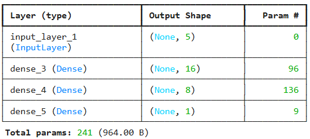

이 모델은 승인 여부가 아니라 승인 확률을 맞추도록 학습한다. 다섯 가지 조건이 주어졌을 때 그 조건의 승인 확률을 재현하는 것이 목표다. 테스트 정확도는 74% 수준이며, 튜닝을 마친 모델이 아니라 counterfactual 생성 절차를 보기 위해 준비한 모델이다.

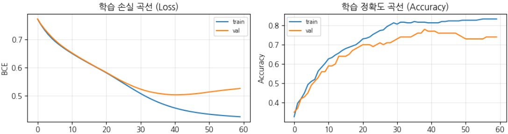

**Counterfactual 구현 — gradient descent 최소화.** Counterfactual은 "만약 $X$ 라는 조건이 조금 달랐다면 결과 $Y$ 가 어떻게 바뀌었을까"를 묻는다. 여기서는 대출 심사 거절 상황에서 최소한으로 조건을 바꾸어 목표 확률(예: 80%)의 승인을 받을 수 있는 조건을 찾는다. 방법은 gradient descent로, 손실이 작아지는 방향으로 입력 Feature의 업데이트를 누적한다. 이때 학습률, `lambda_prox`, 반복 횟수를 조정한다.

**Loss 설계.**

```python
loss = loss_cf + lambda_prox * loss_prox
```

- `loss_cf` (예측 달성 손실) : `(pred - y_target)**2`. 가상의 데이터 `x_cf` 에 대한 예측값과 원하는 목표값(`y_target=0.8`)의 차이다.
- `loss_prox` (근접성·Proximity 손실) : `tf.reduce_sum(tf.abs(x_cf - x_orig_tf))`. 원본 데이터와의 거리를 최소화하여, 가장 조금만 바꾸어 목표를 달성하도록 강제한다.
- `lambda_prox` : 원본 데이터와 얼마나 비슷하게 유지할지를 조절하는 강도다.

**현실적인 조언 제약 (Actionable Constraint).** 세 번째 항목인 `age` 는 바꿀 수 없다. Gradient를 계산한 뒤 바꿀 수 없는 특성의 기울기를 0으로 만든다.

두 손실과 actionable 마스크를 합쳐 하나의 함수로 쓰면 다음과 같다.

```python
ACTIONABLE = [True, True, False, True, True]   # age 는 불변

# 단일 counterfactual 산출 — L_cf + lambda * L_proximity
def counterfactual(model, x_orig, y_target, actionable_mask, n_steps=300, lr=0.05,
                   lambda_prox=0.5, init_seed=0, noise_std=0.01):
    rng = np.random.default_rng(init_seed)
    x_orig_tf = tf.constant(x_orig.reshape(1, -1), dtype=tf.float32)
    # 초기화: 원본 + 작은 perturbation
    x_cf = tf.Variable(x_orig_tf + rng.normal(0, noise_std, x_orig_tf.shape).astype(np.float32))
    actionable_tf = tf.constant(np.array(actionable_mask, dtype=np.float32).reshape(1, -1))
    opt = keras.optimizers.Adam(learning_rate=lr)
    for step in range(n_steps):
        with tf.GradientTape() as tape:
            pred = model(x_cf, training=False)
            # 손실 1: 예측이 y_target 에 도달
            loss_cf = (pred - y_target) ** 2
            # 손실 2: 원본 근접 (L1)
            loss_prox = tf.reduce_sum(tf.abs(x_cf - x_orig_tf))
            loss = loss_cf + lambda_prox * loss_prox
        grads = tape.gradient(loss, [x_cf])
        # actionable 만 업데이트
        grads = [g * actionable_tf for g in grads]
        opt.apply_gradients(zip(grads, [x_cf]))
        x_cf.assign(x_cf * actionable_tf + x_orig_tf * (1.0 - actionable_tf))
    return x_cf.numpy().flatten()
```

**다양한 대안 제시 (Diversity).** 가상 데이터 `x_cf` 는 원본 데이터에 작은 노이즈를 더해서 시작한다. 노이즈를 만드는 seed를 `[0, 1, 2]` 로 다르게 설정하여 함수를 여러 번 실행하면 서로 다른 대안을 얻는다. 소득을 조금 더 올리는 방법(Counterfactual 1), 신용 점수를 크게 올리는 방법(Counterfactual 2) 등이 그렇게 나온다.

```python
# 테스트 세트에서 예측 확률이 50% (0.5) 이상인 첫 샘플 찾기
preds = model.predict(X_test, verbose=0).flatten()
target_idx = np.where(preds >= 0.5)[0][0]
x_denied = X_test[target_idx]
pred_denied = preds[target_idx]

# 3 개 다양한 counterfactual (서로 다른 init seed)
cfs = []
for seed in [0, 1, 2]:
    cf = counterfactual(model, x_denied, y_target=0.75, actionable_mask=ACTIONABLE,
                        n_steps=1500, lr=0.1, lambda_prox=0.001,
                        init_seed=seed, noise_std=0.01)
    cfs.append(cf)
```

**결과.** 테스트 세트에서 거절된 첫 샘플의 현재 승인 확률은 68.1%였다. 서로 다른 seed로 세 개의 counterfactual을 생성하면, Feature 중 변동 요소를 선택할 수 있고 변동의 범위와 방향도 선택할 수 있음을 확인하게 된다.

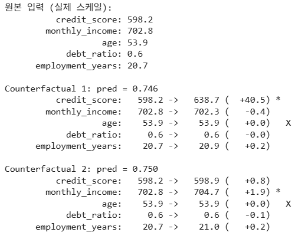

*그림 7-9. 같은 목표라도 바꿀 수 있는 조합은 여럿이다. age는 제약에 의해 고정된다.*

한 가지 주의할 점이 있다. Optimizer의 momentum 때문에 나이 같은 변경 불가 항목에서도 의도치 않은 변경이 발생할 수 있으므로, 업데이트 후 그 값을 원본으로 되돌려 다시 제거해 주어야 한다.


### 세 개의 튜닝 지점

이 절차에서 답의 성격을 결정하는 값은 세 개다. Learning Rate는 입력 Feature를 한 번에 얼마나 움직일지를 정하고, 근접성 손실의 가중치는 원본에서 벗어나는 것을 얼마나 강하게 억제할지를 정하며, 반복 횟수는 업데이트를 몇 번 누적할지를 정한다. 모델을 학습시킬 때의 이터레이션 스텝과 하는 일이 같다. 세 값이 함께 답이 원본에서 얼마나 멀리 갈지를 결정하므로, 하나씩 바꾸어 가며 결과를 확인한다.

### 다양성은 시작점에서 나온다

여러 대안은 시작점을 흔들어서 얻는다. 원본 입력 벡터에 seed마다 다른 노이즈를 더해 조금씩 다른 지점에서 출발시키면, 같은 목표 확률에 도달하는 서로 다른 경로가 나온다. 한 seed에서는 소득을 올리는 답이 나오고 다른 seed에서는 신용점수를 올리는 답이 나오는 식이며, seed를 늘릴수록 선택지가 늘어난다.

### 결과를 읽고 통제하는 법

세 seed가 내놓은 답은 서로 다른 축을 건드린다. 한 답은 신용점수를 598에서 638로 올려 승인 확률 74.6%에 이르고, 다른 답은 신용점수를 거의 그대로 둔 채 월 소득을 조금 올린다. 소득이 조금만 늘어도 확률이 크게 오르는 것으로 보아 이 모델은 소득에 크게 의존하도록 학습되었다고 읽을 수 있다. ⚠확인

그런데 결과에는 여러 Feature가 동시에 바뀌거나 값이 오히려 낮아지는 방향으로 움직이는 답도 섞여 있다. 이런 답은 조언으로 쓸 수 없다. 통제는 actionable 마스크로 한다. 신용점수 하나만 열어 두면 신용점수만으로 목표를 달성하는 조건이 나오고, 소득만 열어 두면 소득 축의 답이 나온다. 변동의 방향과 범위에도 제약을 걸면 값이 거꾸로 가는 답을 막을 수 있다. 여기에서 얻은 결과는 절차를 보이기 위한 것이므로 그런 통제를 적용하지 않은 상태다.


---

## 7.1.20 Causal vs Associational: Pearl의 인과 사다리(The Causal Hierarchy)
<!-- 슬라이드 495~496 -->

### Counterfactual도 모델 위의 이야기다

Counterfactual조차 모델이 학습한 의존성 위에서 정의된 것일 뿐이며, 사실이 아닐 수 있다. 모델이 가짜 상관에 의존하고 있다면 counterfactual도 그 가짜 상관을 따라 만들어진다. 예컨대 모델이 "우편번호(부유층 거주지) → 대출 승인"으로 학습했다면, counterfactual은 이사를 가라는 답을 내놓을 것이다.

진짜 인과적 질문, 즉 **현실에서 이 Feature를 바꾸면 결과가 바뀌는가**에는 여전히 답하지 못한다.

### Pearl의 인과 사다리(The Causal Hierarchy)

Judea Pearl(2009)은 수학적 인과추론(Causal Inference)의 3단계 framework를 정립했다. Attribution(IG, SHAP, LIME)의 역할은 이 사다리의 **① Association 단계에 속하는 기여도 분석 도구**다. 인과적 책임을 따지는 인과 귀속(causal attribution)과는 구별되며, Attribution은 모델의 특성을 보고할 뿐이다.

② Intervention과 ③ Counterfactual 단계의 질문에 답하려면 별도의 인과 추론 도구가 필요하다. RCT(Randomized Controlled Trial), 인과 그래프(Causal Diagram, do-calculus), counterfactual reasoning(CATE · ATE 추정) 등이 그것이다.

Attribution의 결과를 "인과적 의존성"으로 해석하면, Intervention 단계의 결정(예컨대 "혈압을 낮추자")에 그대로 적용되어 오류를 발생시킨다.

| 단계 | 질문 유형 | 예시 | 앎의 방식 |
|---|---|---|---|
| ① Association (연관) | $P(Y \mid X)$ : $X$ 를 관찰하면 $Y$ 는? | 이 환자의 혈압이 높을 때 합병증 확률은? | 관찰로 안다 |
| ② Intervention (개입) | $P(Y \mid do(X))$ : $X$ 를 강제로 바꾸면 $Y$ 는? | 혈압을 약으로 낮추면 합병증 확률 변화는? | 행동으로 안다 |
| ③ Counterfactual (반사실) | $P(Y_x \mid X', Y')$ : 실제로는 $X'$ 였지만 $X$ 였다면 $Y$ 는? | 이 환자가 약을 안 먹었더라면 결과는? | 상상으로 안다 |

표의 ③ Counterfactual은 인과 추론의 수학적 단계를 가리키는 것이며, 앞에서 다룬 Counterfactual Explanation과 같은 말이 아니다. 또 ③은 실제로 일어나지 않은 조건을 다루므로 관찰 데이터가 아예 없다. 인과 정보를 따로 가지고 있어야만 추론할 수 있는 단계다.


### Attribution과 인과 귀속

Attribution은 우리말로 귀속이나 배분으로도 옮긴다. 이 절에서는 앞부분에서 기여도 배분으로 부르다가 뒤로 갈수록 의존도로 불렀다. 어느 쪽으로 부르든 인과적 책임을 따지는 인과 귀속과는 다른 개념이다.

지금까지 다룬 도구들은 모두 사다리의 첫 단계 안에 있으며, 관찰을 통해 확률을 추정하는 일을 서로 다른 방식으로 정밀하게 수행한 것에 지나지 않는다. 그 위로 올라가려면 도구 자체를 바꾸어야 한다. Attribution 결과를 인과적으로 읽는 순간, 그것은 도구가 보장하지 않는 주장이 된다.


### 당뇨 합병증 위험과 혈압

세 단계를 하나의 의료 사례로 이어서 보면 차이가 선명해진다.

**1) Association — 관찰 단계.** 당뇨 환자 1,000명의 데이터에서 고혈압 환자가 합병증을 더 많이 겪는지를 본다. 즉 $P(\text{합병증} \mid \text{혈압} = \text{높음})$ 을 추정한다. 도구는 회귀·분류 모델에 IG/SHAP Attribution을 결합한 것이다. 결과는 "혈압이 합병증에 가장 큰 기여를 한다($IG = 0.45$)"로 나온다. 한계는 분명하다. 고혈압 환자는 노인이거나 비만이거나 운동이 부족할 수 있으며, 이런 교란변수가 함께 있을 수 있다. 관찰된 상관만 보고할 수 있을 뿐이다.

**2) Intervention — 중재 단계.** 이 환자에게 약으로 혈압을 낮추면 합병증 확률이 어떻게 변할지를 묻는다. 즉 $P(\text{합병증} \mid do(\text{혈압} = \text{낮음}))$ 을 추정한다. 도구는 이상적으로는 RCT이고, 관찰 데이터만 있다면 do-calculus와 인과 그래프다. 가설적인 RCT 결과로 혈압 약 처방군의 합병증이 5%, 대조군이 12%라면 7%p의 절대 감소다. 중요한 것은 **Attribution이 "혈압을 낮추면 합병증이 7%p 줄어든다"는 인과 결론을 보장하지 않는다**는 점이다.

**3) Counterfactual — 반사실 단계.** 환자 A는 혈압 약을 먹었고 합병증이 없었다. 약을 안 먹었다면 합병증이 있었을까? 즉 $P(\text{합병증}_A = Y \mid \text{실제 합병증}_A = N,\ \text{약}_A = \text{Yes})$ 를 추정한다. 도구는 Structural Causal Model(SCM)과 counterfactual inference, 즉 Pearl의 3단계 abduction-action-prediction이다. 환자 A의 잠재 변수(유전·생활습관 등)를 SCM으로 추론하고 약을 뺀 채 시뮬레이션하면, 가설적 SCM 아래에서 합병증 발생 확률 65%라는 값을 얻는다.

Attribution은 이렇게 **가지 않은 길을 추론하는 영역**에는 도달하지 못한다. 그리고 앞서 다룬 Counterfactual Explanation조차 모델 위에서 이루어지는 가상 변경이므로, 사다리의 ③단계가 아니라 ②단계의 부분 근사 정도에 해당한다.

> **정리 — Part E**
> **Counterfactual Explanation** 은 "이 Feature를 바꾸면 결과가 어떻게 바뀌나"에 대한 행동 가능한 답이다.
> **Causal vs Associational** — Attribution은 Association 단계에 있다. Intervention과 Counterfactual 질문에는 RCT와 인과 추론 도구가 별도로 필요하다.
> Attribution 결과를 인과적으로 읽는 것은 위험하며, 그 역할을 **의존 구조 진단**으로 제한해야 한다.

---

## 7.1.21 정리
<!-- 슬라이드 497 -->

이 절 전체를 다섯 개의 논지로 압축한다.

**Attribution의 지형.** Attribution 기여도 배분은 국소 민감도, 공정 분배, 글로벌 패턴이라는 세 가지 질문에 답하는 도구군이며, Saliency → Grad-CAM → LIME → SHAP → IG의 순서로 발전해 왔다. 그리고 Gradient가 측정하는 것은 모델의 학습된 의존성이지 Feature의 객관적 중요도가 아니다.

**노이즈 저감 도구.** Integrated Gradients는 경로 적분으로 포화 문제를 해결하며 완전성과 구현 불변성 두 공리를 동시에 만족한다. 다중 baseline의 선택과 평균화가 IG 결과의 안정성을 좌우한다. SmoothGrad는 입력 노이즈 perturbation을 $T$ 회 평균한다. SHAP Family(KernelSHAP · Sampling · Tree · DeepSHAP · CausalSHAP)는 모델 타입(트리 · DNN · black-box)과 Feature 상관, 인과 그래프 보유 여부에 따라 선택한다.

**신뢰성 검증.** Kendall $\bar{\tau}$ 는 여러 Attribution 방법의 순위 일치도를 재며, $\bar{\tau} > 0.7$ 이면 신뢰하고 $\bar{\tau} < 0.4$ 이면 의심한다. Sanity Check는 모델과 라벨을 무작위화하여 Attribution의 음성 통제를 수행한다. 이 두 검사를 통과한 표준 도구는 IG, SmoothGrad, SHAP이며 CNN에는 Grad-CAM, 일반 모델에는 LIME이 더해진다.

**진단 도구로서의 Attribution.** Spurious Correlation 탐지는 검증 정확도로는 잡을 수 없고 Attribution과 OOD 검증으로만 사전 진단할 수 있다. TCAV는 신경망 중간 layer가 사람이 해석 가능한 개념을 인코딩하는 정도를 측정하며, MIG와 함께 표현 학습을 해석하는 도구다. 이로써 Attribution은 단순한 예측 분배를 넘어 학습된 의존과 표현의 의미까지 진단할 수 있게 된다.

**한계와 인과.** Counterfactual Explanation은 "이 Feature를 바꾸면 결과가 어떻게 바뀌나"에 대한 행동 가능한 답이다. 그러나 Attribution은 Pearl의 인과 사다리에서 Association 단계에 머문다. Intervention과 Counterfactual 질문에는 RCT와 인과 추론 도구가 별도로 필요하다. Attribution 결과를 인과적으로 읽는 것은 위험하며, 그 역할을 **의존 구조 진단**으로 제한해야 한다.
