<!-- ───────────────── 강의 음성 기반 보완 제안 ─────────────────
  이 파일의 제안 11건 (결과해석 5 / 그림해설 6)

  각 제안은 「+강의」 마커로 감싸여 있다. 마커 줄 끝의 판정을 고친다.
    채택하려면  물음표를  y  로
    기각하려면  물음표를  n  로
    보류하면    그대로 두면 되고 '미검토'로 보고된다

  검토를 마치면 저장소 루트에서  python3 apply_lecture.py  를 실행한다.
  (--dry-run 을 붙이면 고치지 않고 집계만 한다)
  ─────────────────────────────────────────────────────────── -->

# 7.2 Attention

**학습 목표**

- Attention score, Attention distribution, Context Vector의 세 단계를 구분하고 각 단계가 무엇을 계산하는지 수식으로 설명할 수 있다.
- Scaled Dot-Product Attention의 각 항이 왜 필요한지 설명하고, $1/\sqrt{d_k}$ 스케일링이 없을 때 무엇이 무너지는지 논증할 수 있다.
- Attention weight가 중요도가 아니라 Query에 조건부인 의존 관계의 분포임을 설명하고, Attribution과의 차이를 표로 정리할 수 있다.
- Self-Attention 행렬을 소프트 인접 행렬로 읽어 Feature 간 방향성 있는 의존 구조를 해석할 수 있다.
- Multi-Head의 역할 분화가 최적화의 부산물임을 이해하고, 엔트로피와 시드 안정성으로 Head 수를 진단할 수 있다.
- 중요도(Importance) · Attribution · Attention 세 도구가 서로 다른 질문에 답한다는 점을 구분하고, 불일치를 발견의 단서로 다룰 수 있다.

**이 절의 구성**

- 7.2.1 Attention의 세 단계
- 7.2.2 Attention의 일반 구성과 score 계산 방식의 분화
- 7.2.3 Scaled Dot-Product Attention과 Attention Head
- 7.2.4 Self-Attention과 병렬 연산
- 7.2.5 Attention ≠ 중요도 — 의존 관계 분포로의 재정의
- 7.2.6 Attention은 설명인가
- 7.2.7 Q·K·V의 기하학과 스케일링의 이유
- 7.2.8 온도, 동적 라우팅, 커널 스무딩
- 7.2.9 Self-Attention과 정형 데이터 — 소프트 인접 행렬
- 7.2.10 계산 복잡도와 효율적 Attention Family
- 7.2.11 정형 데이터 Transformer의 분화
- 7.2.12 Multi-Head Attention과 Head의 역할 분화
- 7.2.13 Head 수 H의 선택과 다층 관계 분석
- 7.2.14 세 가지 의존 관점 비교
- 7.2.15 정리

> 실습 번호는 강의 슬라이드의 번호를 그대로 쓴다. 소절 번호와는 무관하다.
> 이 절에서는 특히 주의가 필요하다. 소절 7.2.2·7.2.3과 실습 7.2.2·7.2.3은 숫자만 같을 뿐 서로 다른 대상을 가리킨다.
> 실습 7.2.2는 Self-Attention(소절 7.2.11 안), 실습 7.2.3은 Multi-Head Self-Attention(소절 7.2.13 안)이다.

---

## 7.2.1 Attention의 세 단계
<!-- 슬라이드 501 -->

이 절이 다루는 주장은 한 문장으로 요약된다.

> **핵심 주장**
> Attention의 본질은 **의존 관계의 분포**다. Attention은 중요도가 아니다.

이 주장을 이해하려면 먼저 Attention이 실제로 무엇을 계산하는지 단계별로 따라가야 한다. Attention은 세 개의 계산 단계로 이루어진다.

### Attention score

첫 단계는 점수를 매기는 일이다. 인코더(Encoder)의 hidden state와 디코더(Decoder)의 hidden state를 가져와 **내적(dot product)** 을 취하면 스칼라 점수 하나가 나온다. 디코더의 현재 상태 $s_t$ 를 인코더의 각 hidden state $h_1, \dots, h_N$ 과 짝지어 계산하면 점수 벡터가 만들어진다.

$$e^t = \left[\, s_t^\top h_1,\; s_t^\top h_2,\; \dots,\; s_t^\top h_N \,\right] \in \mathbb{R}^N$$

이 점수는 "지금 디코더가 놓인 상태에서 인코더의 어느 위치가 얼마나 잘 맞아떨어지는가"를 수치로 나타낸 것이다. 아직 확률은 아니고, 크기 비교만 가능한 원점수다.

### Attention distribution

두 번째 단계는 점수를 확률로 바꾸는 일이다. 원점수 벡터에 softmax를 적용한다.

$$\alpha^t = \mathrm{softmax}\!\left(e^t\right) \in \mathbb{R}^N$$

이렇게 얻은 $\alpha^t$ 가 **Attention distribution**, 곧 **Attention weight** 다. 이 분포는 현재 디코더 상태에서 볼 때 어떤 입력 단어가 연관되어 있는지를 나타내는 확률 분포다. 합이 1이 되도록 정규화되어 있으므로 각 성분은 "전체 중 몇 할을 이 위치에 배분했는가"라는 상대적 의미를 갖는다. 이 상대성이 뒤에서 다룰 오독의 근원이 된다.

### Context Vector

세 번째 단계는 실제로 정보를 가져오는 일이다. 인코더의 hidden state들을 Attention distribution으로 가중합한다.

$$a_t = \sum_{i=1}^{N} \alpha_i^t\, h_i \in \mathbb{R}^{d_1}$$

이 $a_t$ 를 **Context Vector** 라 부르고, Attention 계층의 출력이라는 뜻에서 **Attention output** 이라고도 한다. 계산이 끝나면 Context Vector는 디코더 상태와 결합(concatenate)되어 다음 출력을 만드는 데 쓰인다.

Seq2Seq 모델에 Attention을 결합한 구조에서 이 세 단계는 아래에서 위로 쌓인 세 층으로 나타난다. 맨 아래에 인코더 RNN의 hidden state들이 있고, 그 위에 dot-product로 만든 Attention score들이 놓이며, 다시 그 위에 softmax를 통과한 Attention distribution이 막대 그래프로 그려진다. 최상단의 Attention output이 디코더 상태와 합쳐져 다음 단어를 내놓는다.

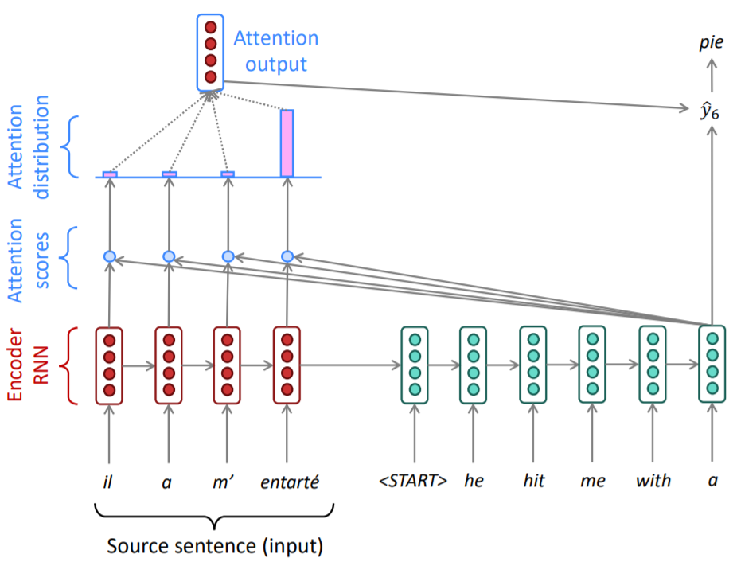

*그림 7-1. Attention의 세 단계. score → distribution → context vector 순으로 정보가 좁혀진다.*

<!-- +강의 id=7.2_Attention-01 w=w15a ts=[07:59] [08:45] [09:31] 유형=그림해설 채택=? -->
이 구조에 Attention 층이 붙은 이유는 성능이었다. 인코더의 마지막 내부 상태 하나에 문장 전체를 담아 디코더에 넘기면 정보가 지나치게 압축되어, 문장이 길어질수록 번역이 무너졌다. Attention은 디코더가 인코더의 각 위치를 직접 되돌아보게 하여 그 병목을 푼 장치다.
<!-- /+강의 -->

---

## 7.2.2 Attention의 일반 구성과 score 계산 방식의 분화
<!-- 슬라이드 502 -->

### 세 가지 구성 요소로 본 Attention

앞의 세 단계는 특정 모델에 국한된 절차가 아니라 Attention이라는 기법 전체의 골격이다. 이를 일반적인 기호로 다시 쓰면 다음과 같다.

값들의 집합 $\{h_1, \dots, h_N\} \in \mathbb{R}^{d_1}$ 과 query $s \in \mathbb{R}^{d_2}$ 가 주어져 있다고 하자. 여기서 $h$ 는 인코더 상태, $s$ 는 디코더 상태에 해당한다. 이때 Attention은 어떤 변형이든 항상 다음 세 요소로 구성된다.

1. **Attention scores** : $e = f_{\mathrm{att}}(h, s) \in \mathbb{R}^N$
2. **Attention distribution** : $\alpha = \mathrm{softmax}(e) \in \mathbb{R}^N$ (= attention weight)
3. **Attention output** : $a = \sum_{i=1}^{N} \alpha_i h_i \in \mathbb{R}^{d_1}$ (= context vector)

두 번째와 세 번째는 어떤 변형에서도 동일하다. softmax로 정규화하고 그 가중치로 값들을 섞는다는 절차는 바뀌지 않는다. 따라서 **Attention의 여러 변형이 서로 다른 것은 오직 첫 번째, 즉 score $e$ 를 얻는 방법뿐이다.**

### score 함수의 계열

score 함수 $f_{\mathrm{att}}$ 를 어떻게 정의하느냐에 따라 여러 계열이 갈라진다. 코사인 유사도를 그대로 쓰는 content-base attention, 두 벡터를 이어 붙인 뒤 비선형 변환을 거치는 **additive(concat) attention**, 학습 가능한 행렬을 사이에 끼워 넣는 general 계열, 그리고 순수한 내적을 쓰는 **dot-product(multiplicative)** 계열이 있다. 마지막으로 내적을 차원의 제곱근으로 나눈 **scaled dot-product** 가 있다.

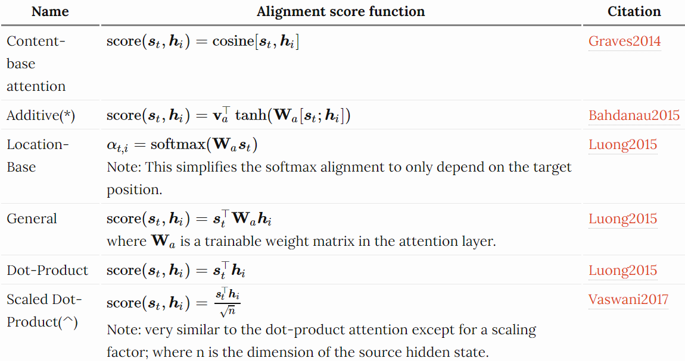

*그림 7-2. score 함수 계열 비교. 변형들은 이 값을 얻는 방법이 다를 뿐, 이후 softmax와 가중합 절차는 공통이다.*

이 계열 정리는 Lilian Weng의 정리 글(`https://lilianweng.github.io/lil-log/2018/06/24/attention-attention.html`)에 실린 표를 따른 것이다.
<!-- 원문 표기 오류 정정: 원문 URL 은 `lil-log/218/06/24/` 로 연도가 한 자 빠져 있어 열리지 않는 링크였다 -->

---

## 7.2.3 Scaled Dot-Product Attention과 Attention Head
<!-- 슬라이드 503~504 -->

### Attention의 일반화

"Attention Is All You Need"(Vaswani, 2017)는 위 계열들을 하나의 표준 형태로 일반화했다. 이 형태를 **Scaled dot-product Attention** 이라 하고, 기호로는 $\mathrm{Attention}(Q, \{K:V\})$ 로 쓴다. 여기서 $\{K:V\}$ 는 **딕셔너리(dictionary)** 로 이해하면 된다. Key는 Value를 찾기 위해 참조하는 색인이고, Value는 실제로 꺼내 올 내용이다. Query는 그 딕셔너리에 던지는 질의다.

여기서 왼쪽의 Bahdanau(Additive) Attention과 오른쪽의 Scaled dot-product Attention을 나란히 놓고 보면, 앞 소절에서 말한 "score를 얻는 방법만 다르다"는 명제가 구조로 드러난다. Additive 계열은 $U_a$, $W_a$ 로 Key와 Query를 각각 변환한 뒤 더하고 $\tanh$ 를 거쳐 $V_a$ 와 곱해 score를 만드는 반면, Scaled dot-product는 MatMul → Scale → (Mask) → SoftMax → MatMul 이라는 훨씬 단순한 연산 열로 같은 일을 한다.

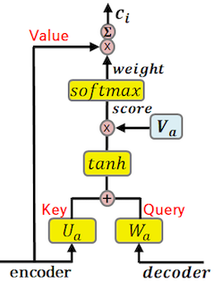

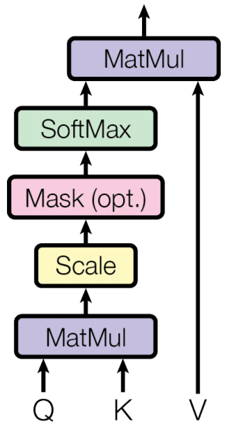

<!-- +강의 id=7.2_Attention-02 w=w15a ts=[13:08] [13:33] [14:04] 유형=그림해설 채택=? -->
두 그림의 차이는 학습되는 자리가 있느냐에 있다. score 식에 weight 행렬이 놓여 있다는 것은 그 자리에 layer가 있다는 뜻이며, score를 학습으로 결정하겠다는 선언이다. 반면 dot-product 계열은 그런 layer 없이 연산만으로 score를 얻는다.
<!-- /+강의 -->

### Attention Head — 학습 가능한 형태로 만들기

Scaled dot-product Attention 자체에는 학습할 파라미터가 없다. 내적과 softmax와 가중합만으로 이루어져 있기 때문이다. 그래서 학습이 가능하려면 **연산 바깥에 linear layer를 두어야 한다.**

같은 원천 값(source value)을 서로 다른 세 개의 선형 계층에 통과시켜, 하나는 Query의 역할을, 하나는 Key의 역할을, 하나는 Value의 역할을 하도록 **선형 투영(linear projection)** 을 학습시킨다. 이렇게 Query Layer · Key Layer · Value Layer와 Scaled dot-product Attention을 한 덩어리로 묶은 단위를 **Attention Head**, 또는 **Single-Head Attention Layer** 라고 부른다. 학습되는 것은 Attention 연산이 아니라 이 세 투영 행렬이다.

### 수식으로 읽는 Scaled Dot-Product Attention

표준 형태는 다음과 같다.

$$\mathrm{Attention}\left(Q, \{K:V\}\right) = \mathrm{softmax}\!\left(\frac{QK^\top}{\sqrt{d_k}}\right) V$$

이 식은 "$Q$ 에 연관된 정보 $V$ 를 전달한다"는 목적을 네 단계로 쪼갠 것이다.

- $V$ 와 짝지어진 $K$ 와 $Q$ 의 유사도를 구한다 — $QK^\top$
- 값이 너무 커지지 않도록 나눈다 — $QK^\top / \sqrt{d_k}$
- 유사도(score)를 확률로 변환한다 — $\mathrm{softmax}\left(QK^\top/\sqrt{d_k}\right)$, 이것이 Attention Weight다
- 그 결과를 $V$ 와 곱한다 — $\mathrm{softmax}\left(QK^\top/\sqrt{d_k}\right)V$

최종적으로 얻는 것은 **$Q$ 와의 연관 정도에 따라 변환된 $V$** 다.

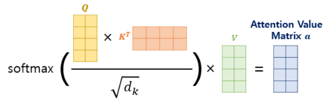

### Attention의 일반 정의

이제 Attention을 모델 구조와 무관하게 정의할 수 있다.

> **정의 — Attention**
> query와 (key, value) 쌍들의 집합이 있을 때, query와 각 key의 유사도로 가중치를 정하고 그 가중치로 value들의 weighted sum을 계산하는 기술.

바꾸어 말하면 Attention은 **Query에 따라 임의의 표현 집합(key, value 쌍)에 대한 고정 길이 표현을 얻는 방법**이다. 집합의 크기가 얼마이든 출력은 항상 하나의 벡터이므로, Attention은 일종의 **선택적 요약** 장치라고 볼 수 있다. 무엇을 선택할지가 Query에 따라 달라진다는 점이 핵심이다.

---

## 7.2.4 Self-Attention과 병렬 연산
<!-- 슬라이드 505~506 -->

### Q, K, V를 같은 입력에서 만든다

**Self-Attention** 은 Q, K, V를 모두 같은 입력에서 전달받는 구조다. 원래 정의에서 출발하면 단계적으로 이해할 수 있다. Key가 따로 없으면 Value를 Key로 쓰고, Query도 따로 없으면 $Q = K = V$ 가 된다. Self-Attention은 이 극단, 즉 K, Q, V가 모두 같은 원천 시퀀스(same source sequence)에서 오는 경우다.

물론 완전히 같은 벡터가 세 자리에 그대로 들어가는 것은 아니다. 같은 원천에서 출발하되 각각 다른 **layer를 통하여 전달**된다. 학습 가능한 파라미터는 이 입력 쪽 layer들에 있다.

이 구조가 하는 일은 **입력 시퀀스 내에서의 관계를 학습**하는 것이다. 외부의 다른 시퀀스를 참조하는 것이 아니라 자기 안을 들여다본다는 뜻에서 **Intra-Attention** 이라고도 부른다.

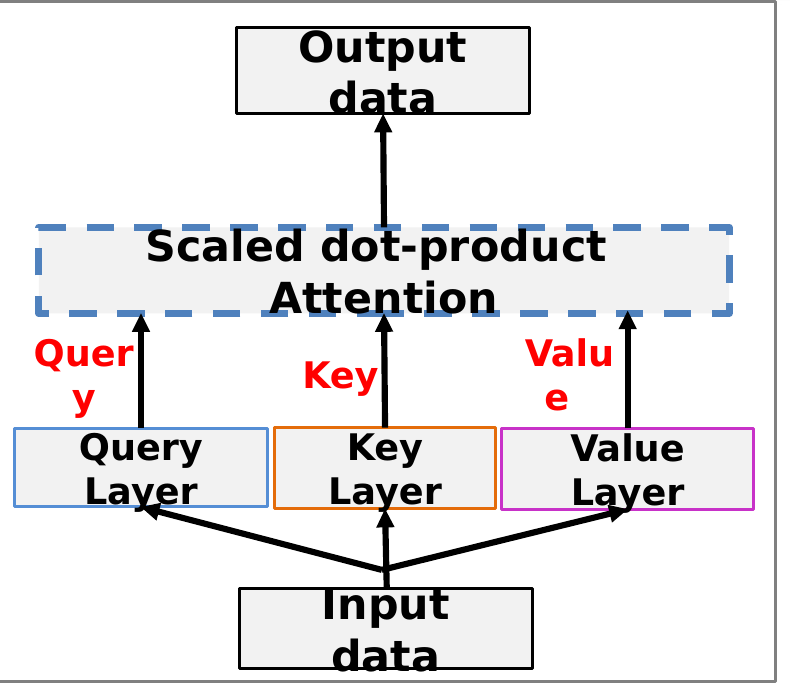

Self-Attention이 잡아내는 관계는 문장 안에서 어느 단어가 어느 단어에 걸리는지로 시각화된다. 아래 두 그림은 같은 문장 안의 토큰들이 서로를 참조하는 강도를 호(arc)와 색으로 표시한 것이다. 특히 대명사 "it"이 문맥에 따라 "animal"을 가리키기도 하고 "street"을 가리키기도 하는 모습은 Self-Attention이 시퀀스 내부의 의존 관계를 붙잡고 있다는 점을 보여 준다.

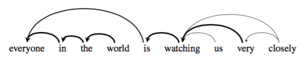

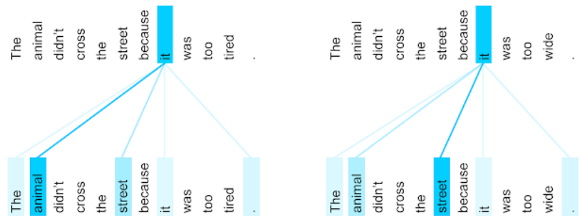

<!-- +강의 id=7.2_Attention-03 w=w15a ts=[20:23] [20:57] [21:36] 유형=그림해설 채택=? -->
Transformer 이전의 언어 모델이 가장 취약했던 지점이 대명사였다. 대명사가 무엇을 가리키는지는 문장 전체를 보아야 정해지므로, 관계를 학습하지 않는 모델은 이를 잘 처리하지 못했다. 구조가 거의 같은 두 문장에서 참조 대상이 갈리는 이 그림이 그 차이를 보여 준다.
<!-- /+강의 -->

### 병렬 처리와 KV Cache

Self-Attention에는 RNN에 없는 계산상의 성질이 있다. RNN은 $h_1$ 을 만들어야 $h_2$ 를 만들 수 있지만, Self-Attention은 $h_2$ 와 $h_3$ 를 **동시에 처리**할 수 있다. 각 위치의 계산이 이전 위치의 계산 결과를 기다리지 않기 때문이다. 즉 병렬 처리가 가능하다.

이 장점에는 대가가 따른다. 순서를 밟아 계산하지 않으므로 **순서 자체가 의미를 갖지 못한다.** 그래서 순서 정보를 별도로 추가해 주어야 한다.

또 하나의 실무적 성질은 **KV Cache** 다. 새로운 입력 $x_n$ 이 추가될 때 이전 시퀀스의 key와 value가 다시 필요하다. 이미 계산해 둔 key와 value를 저장해 두고 재사용하면 중복 계산을 피할 수 있다.

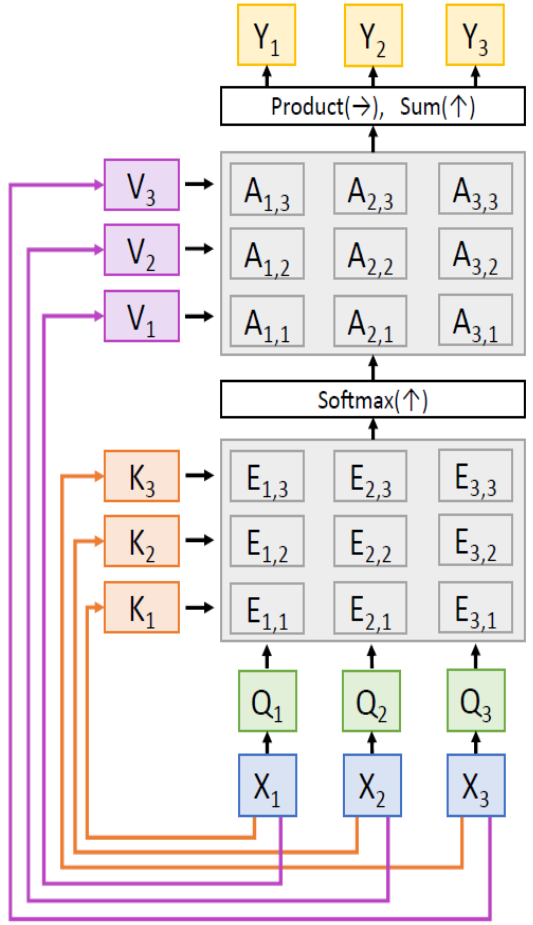

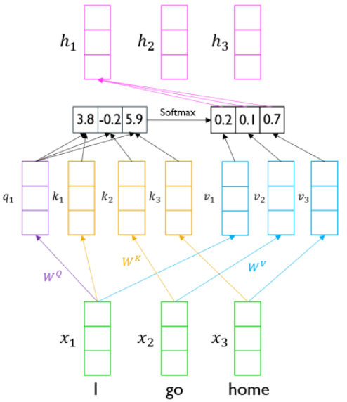

<!-- +강의 id=7.2_Attention-04 w=w15a ts=[25:17] [25:40] [26:10] 유형=그림해설 채택=? -->
한 번 만든 key와 value는 다음 입력을 처리할 때 그대로 다시 쓰이므로 새로 계산하지 않는다. 다만 저장해야 할 양이 토큰 수에 비례해 늘어나기 때문에, 시퀀스가 길어진 모델에서는 이 캐시가 차지하는 메모리 자체가 부담이 된다.
<!-- /+강의 -->

---

## 7.2.5 Attention ≠ 중요도 — 의존 관계 분포로의 재정의
<!-- 슬라이드 507 -->

### Attention weight가 실제로 재는 것

여기서 이 절의 중심 주장에 도달한다. Attention weight $A_{ij}$ 는 scaled attention score에 softmax를 적용한 값, 즉 $\mathrm{softmax}\left(QK^\top/\sqrt{d_k}\right)$ 의 한 성분이다. 이 값이 뜻하는 것은 **요소 $i$ 와 요소 $j$ 간의 관계 강도**, 정확히는 **$i$ 가 $j$ 를 참조하는 강도**다. 그 요소 자체의 중요도가 아니다.

관계의 강도는 요소 $i$ 의 Query와 요소 $j$ 의 Key 사이의 유사도로 계산된다. 따라서 $A_{ij}$ 는 중요도 점수가 아니라 **Query에 조건부인 의존 관계의 분포**다. 같은 요소 $j$ 라도 어떤 Query를 두고 보느냐에 따라 다른 값을 받는다.

한 걸음 더 나아가면, 이 수치는 객관적 사실이 아니라 **모델이 학습한 관점**이다. 이는 Attribution을 "강제된 의존 구조"로 보는 것과 같은 인식론적 위치에 있다. 모델이 그렇게 참조하도록 학습되었다는 사실을 말할 뿐, 세계가 그런 구조를 갖는다는 것을 말하지 않는다.

### 제로섬 정규화가 무너뜨리는 것

Attention weight $A_{ij}$ 는 두 벡터의 내적을 softmax로 정규화한 값이다. softmax는 **합이 1이 되도록 강제**한다. 이 제로섬 정규화가 바로 "Attention weight는 절대적 중요도"라는 해석을 무너뜨리는 원인이다. 어느 한 요소의 값이 올라가면 다른 요소의 값이 반드시 내려간다. 절대적 크기가 아니라 배분의 문제이기 때문이다.

여기서 실무적으로 자주 저지르는 실수가 하나 나온다. **두 개의 입력 샘플(예컨대 서로 다른 두 문장)에서 같은 요소가 받은 Attention을 직접 비교하는 것은 위험하다.** 분모, 즉 다른 요소·토큰들의 점수가 서로 다르기 때문이다. 같은 0.3이라도 경쟁자가 셋일 때의 0.3과 서른일 때의 0.3은 같은 의미가 아니다.

### Q·K·V의 기하학적 의미

세 벡터가 각각 무엇을 담는지 직관적으로 정리하면 다음과 같다.

- **Q(Query)** : 내가 지금 찾는 것의 방향에 대한 고차원 벡터 표현이다.
- **K(Key)** : "나는 이런 질문에 답할 수 있다"는 자기 설명 벡터다.
- **V(Value)** : 실제로 전달할 내용 벡터다.

Q와 K의 내적이 클수록 두 벡터의 방향이 맞아떨어지는 것이고, 그 정도에 비례해 V를 섞어 가져온다. 찾는 방향과 답할 수 있는 방향이 일치할 때 내용이 흘러간다는 그림이다.

### Attribution과 Attention의 차이

두 도구가 어떻게 다른지 다섯 축으로 비교하면 다음과 같다.

| 차이점 | Attribution | Attention |
|---|---|---|
| 연결 방향 | 입력 Feature → 출력 (외부) | 요소 $i$ ↔ 요소 $j$ (내부 상호) |
| 산출물 | Feature별 기여도 벡터 | $N \times N$ 관계 행렬 (행마다 분포) |
| 조건성 | 출력값 1개를 분해 | Query마다 다른 분포 |
| 정규화 | 합 = 출력 변화 (IG의 완전성) | 합 = 1 (제로섬 softmax) |
| 흔한 오독 | 기여도 = 인과 중요도 | weight = 절대 중요도 |

기계 번역 모델의 Attention 행렬을 실제로 그려 보면 이 성질이 눈에 들어온다. 행은 출력 토큰, 열은 입력 토큰이고, 각 행이 하나의 분포를 이룬다. 밝은 칸은 그 출력 토큰을 만들 때 어느 입력 토큰을 많이 참조했는지를 보여 준다.

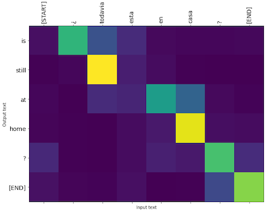

<!-- +강의 id=7.2_Attention-05 w=w15a ts=[30:30] [31:17] 유형=그림해설 채택=? -->
행을 따라 읽으면 출력 토큰 하나가 입력의 어디를 보고 결정되었는지가 드러난다. 한 칸만 뚜렷하게 밝은 행도 있지만, 옅은 값이 네 칸 남짓에 퍼져 있는 행도 있다. 그런 출력 토큰은 입력 단어 하나가 아니라 여러 단어를 함께 보고 만들어진 것이다.
<!-- /+강의 -->

---

## 7.2.6 Attention은 설명인가
<!-- 슬라이드 508 -->

### 두 논문이 벌인 논쟁

Attention 시각화가 널리 쓰이면서 그것을 모델의 설명으로 받아들여도 되는가에 대한 논쟁이 벌어졌다.

**"Attention is not Explanation"(Jain & Wallace, 2019)** 은 부정적인 답을 내놓았다. 같은 예측을 유지하면서도 Attention 분포를 크게 바꾼 **적대적 attention(adversarial attention)** 을 구성할 수 있다는 것이다. 즉 Attention은 예측과 일관되지 않을 수 있으므로 신뢰할 수 있는 설명이 아니라는 주장이다.

**"Attention is not not Explanation"(Wiegreffe & Pinter, 2019)** 은 반박했다. 설명이라는 말의 정의를 명확히 하면, Attention은 일정한 조건 아래에서 타당한 설명을 제공한다는 것이다.

### 논쟁이 남긴 결론

이 논쟁의 귀결은 어느 한쪽의 승리가 아니라 **이분법의 폐기**, 즉 개념의 분화였다. 정리하면 다음과 같다.

> **핵심 메시지**
> Attention은 **그럴듯한(plausible)** 설명을 제공하지만, 인과를 설명하는 **충실한(faithful)** 설명은 아니다.

적대적 attention이 보여 준 것을 다시 짚어 보자. Jain과 Wallace의 연구는 모델의 예측을 고정한 채 Attention 분포만 크게 다른 대체 분포를 제시했다. 이는 "모델이 단어 A에 집중해서 그렇게 예측했다"는 설명과 "단어 B에 집중해서 그렇게 예측했다"는 설명이 **양립할 수 있음**을 보인 것이다. 두 설명이 동시에 성립한다면, Attention 시각화만으로 특정 Feature를 지목하는 주장은 취약하다.

그렇다면 Attention을 어떻게 써야 하는가. **Attention은 가설 생성에 쓴다.** 그리고 그 가설은 perturbation, Attribution, 도메인 지식으로 교차 검증해야 한다.

### Attention 해석의 세 가지 함정

실무에서 반복되는 오독은 세 가지로 정리된다.

- **절대 중요도 오독** : 제로섬 정규화를 무시하고 weight 값을 절대적 중요도로 읽는 것.
- **인과 오독** : 참조를 원인으로 읽는 것. 참조는 원인이 아니다.
- **안정성 무시** : 시드와 입력에 따라 분포가 흔들린다는 사실을 무시하는 것.

---

## 7.2.7 Q·K·V의 기하학과 스케일링의 이유
<!-- 슬라이드 509 -->

> 관련 노트북: `code/7.2.1.Scaled_Dot_Product_Attention.ipynb`

Scaled Dot-Product Attention은 앞서 말한 Q·K·V의 기하학적 의미를 하나의 연산으로 압축한 것이다. 이 소절에서는 그 압축을 풀어 본다.

### 내적이 재는 것

기하학적으로 Attention은 Q와 K의 유사도에 비례해 V를 섞어 가져오는 일이다. 전체 출력은 Attention weight 행렬로 Value를 가중 평균한 것이다.

내적을 성분으로 풀어 쓰면 그 의미가 드러난다.

$$q_i \cdot k_j = \sum_{m=1}^{d_k} q_{i,m}\, k_{j,m} = \left\| q_i \right\| \left\| k_j \right\| \cos\theta$$

즉 내적은 **두 벡터의 정렬도(방향 일치)에 크기를 곱한 값**이다. 방향이 맞고 동시에 크기가 강한 Key에 높은 weight가 할당된다.

여기서 투영 행렬 $W_Q$ 와 $W_K$ 의 역할이 분명해진다. 투영은 과제에 유의미한 방향으로 좌표를 바꾸는 일이며, 그 결과 모델은 **과제에 적합한 유사도**를 학습하게 된다. 유사도의 정의 자체가 학습 대상이라는 뜻이다.

### 표준 형태의 기호 정리

$$\mathrm{Attention}(Q, K, V) = \mathrm{softmax}\!\left(\frac{QK^\top}{\sqrt{d_k}}\right) V, \qquad Q \in \mathbb{R}^{N \times d_k},\; K \in \mathbb{R}^{N \times d_k},\; V \in \mathbb{R}^{N \times d_v}$$
<!-- 원문 표기 혼용: 요소 개수를 슬라이드 510 은 $n$, 512·513 은 $N$ 으로 썼다. 절 전체를 $N$ 으로 통일했다 -->

여기서 $N$ 은 요소의 개수다. 각 항의 의미는 다음과 같다.

- $QK^\top \in \mathbb{R}^{N \times N}$ : 모든 요소 쌍의 내적(유사도) 행렬이다.
- $\mathrm{softmax}$ : 각 행을 합이 1인 분포로 정규화한다. 따라서 **행 $i$ 는 요소 $i$ 의 의존 분포**다.
- $q_i = x_i W_Q$ : 요소 $i$ 의 Query. 학습된 투영으로 만든다.
- $k_j = x_j W_K$ : 요소 $j$ 의 Key. 학습된 투영으로 만든다.
- $v_j = x_j W_V$ : 요소 $j$ 의 Value. 학습된 투영으로 만든 전달 내용이다.
- $d_k$ : Key의 차원이며 정규화 스케일로 쓰인다.
- $d_v$ : Value의 차원이며 Attention 출력의 차원이 된다.
- $A_{ij}$ : 요소 $i$ 가 $j$ 에 두는 weight. 행 합은 1이다.

### $1/\sqrt{d_k}$ 가 필요한 이유

스케일링은 장식이 아니라 학습을 가능하게 하는 조건이다. $d_k$ 가 커지면 내적 $q_i \cdot k_j$ 는 $d_k$ 개 항의 합이므로 그 **분산이 $d_k$ 에 비례해 커진다.** 분산이 커지면 softmax의 입력 크기가 커지고, 그 결과 분포가 한 요소에 과도하게 쏠린다. 극단적으로는 한 성분이 1로 포화되어 학습이 되지 않는다. 다양한 관계를 표현하는 능력도 함께 사라진다.

구체적으로 $d_k = 64$ 인 경우, 정규화가 없으면 내적의 표준편차가 $\sqrt{64} = 8$ 이 된다. 여기에 $1/\sqrt{d_k}$ 를 곱하면 $8/\sqrt{64} \approx 1$ 로 되돌아온다. 이렇게 크기를 차원과 무관하게 유지해 주면 softmax가 부드러운 분포를 출력하고 기울기도 유지된다.

### Masking

Masking은 특정 쌍의 점수를 $-\infty$ 로 설정해 softmax 결과가 0이 되도록 만드는 조작이다. 쓰임은 두 가지다. 하나는 시점 $t$ 이후의 쌍을 가리는 **시간 인과적 디코딩**이고, 다른 하나는 **패딩 무시**다.

용어에 주의가 필요하다. 여기서 "시간 인과적"이라는 말은 원인과 결과라는 의미의 인과가 아니라, **시간 축에서 미래에 놓인 값**을 보지 않는다는 뜻이다.

---

## 7.2.8 온도, 동적 라우팅, 커널 스무딩
<!-- 슬라이드 510 -->

### 집중도 조절 — Softmax Temperature

Attention 분포가 얼마나 날카로운지는 **온도(temperature)** $T$ 로 조절할 수 있다. 점수를 $T$ 로 나눈 뒤 softmax에 넣는다.

$$p_i = \frac{\exp\!\left(z_i / T\right)}{\sum_j \exp\!\left(z_j / T\right)}$$

이는 softmax의 입력인 scaled score를 $T$ 로 한 번 더 나누어 넣는 것과 같다. 효과는 다음과 같이 갈린다.

- $T < 1$ : 집중도가 높아진다. 분포가 뾰족해지고 소수의 관계만 살아남는다.
- $T > 1$ : 분포가 평탄해지고 여러 관계를 함께 표현한다.

### 관점 1 — Attention은 동적 정보 라우팅이다

Attention을 정보의 배선으로 보는 관점이 있다. Query로 "필요한 정보가 어디에 있는가"를 묻고, 관련된 요소의 Value를 가중치만큼 가져온다. 배선이 고정되어 있지 않고 **Query에 따라 달라진다**는 점에서 이는 동적인 연결이다.

### 관점 2 — Attention은 kernel smoothing이다

또 하나의 관점은 전통적인 비모수 회귀와의 대응이다. 커널 스무딩(kernel smoothing)은 주변 데이터의 가중 평균으로 새로운 지점의 값을 예측하는 고전적 방법이다.

$$f(x) = \sum_i \frac{K(x, x_i)}{\sum_j K(x, x_j)}\, y_i \qquad \Longleftrightarrow \qquad \mathrm{attention}(q, K, V) = \sum_i \frac{K(q, k_i)}{\sum_j K(q, k_j)}\, v_i$$

두 식은 형태가 같다. 여기서

$$\frac{K(x, x_i)}{\sum_j K(x, x_j)}$$

가 바로 Attention weight에 해당한다. Attention은 Q와 가장 유사한 K들을 찾아, 그에 대응하는 V들을 커널 스무딩하여 출력하는 것이다.

다만 결정적인 차이가 하나 있다. 전통적인 커널 스무딩은 **고정된 유사도**를 쓴다. 반면 Attention의 $QK^\top$ 는 **데이터로부터 학습된 유사도**다. 가중 평균이라는 틀은 같지만 유사도 자체가 적응적이라는 점이 다르다.

---

## 7.2.9 Self-Attention과 정형 데이터 — 소프트 인접 행렬
<!-- 슬라이드 511 -->

### 전체 요소 간 관계의 학습

Self-Attention은 Q·K·V를 같은 입력에서 생성하기 때문에, 시퀀스 내 **모든 요소 쌍의 의존 관계를 한 번에** 학습한다. 이것이 Transformer(Vaswani, 2017)가 **장거리 의존성(long-range dependency)** 을 잡아내는 핵심이다.

RNN처럼 정보를 한 칸씩 전달하지 않고 $N \times N$ 행렬에서 모든 쌍을 직접 연결한다. 대가로 계산량은 $O(N^2)$ 이 되지만, 두 요소 사이의 경로 길이가 $O(1)$ 로 짧아지므로 기울기 전달이 안정적이다.

### 정형 데이터에 Self-Attention을 적용하면

정형 데이터(tabular data)에 이 구조를 적용하는 발상은 간단하다. $N$ 개의 Feature를 길이 $N$ 의 시퀀스로 보면, Self-Attention은 $N \times N$ Attention 행렬을 출력한다.

이 행렬의 $[i, j]$ 성분은 **Feature $i$ 를 처리할 때 Feature $j$ 를 얼마나 참조했는가**를 의미한다. 즉 Feature 간 상호작용 구조가 학습된 weight의 형태로 나타난다.

한 가지 조정이 필요하다. 정형 데이터에는 순서가 없으므로 positional encoding을 생략하고, 대신 **Feature 식별 임베딩**으로 대체한다. TabTransformer와 FT-Transformer 계열이 이 방식을 쓴다.

### 소프트 인접 행렬로 읽기

Self-Attention 행렬을 상관행렬과 비교하면 무엇이 새로운지 분명해진다.

**상관행렬**은 선형이고 대칭이다. 두 변수가 같이 증가하거나 같이 감소하는 정도만 담는다.

**Attention 행렬**은 네 가지 성질을 더 갖는다.

- **비대칭** : $i \to j$ 와 $j \to i$ 가 다르다.
- **비선형** : softmax를 거친다.
- **학습** : 투영 행렬을 통해 유사도 자체를 배운다.
- **다중** : Multi-Head와 Multi-Layer로 여러 겹의 관계를 담는다.

비대칭성은 특히 중요하다. 나이를 처리할 때 소득을 많이 참조하더라도, 소득을 처리할 때는 나이를 별로 참조하지 않을 수 있다. 상관행렬은 이 방향성을 표현하지 못한다. 따라서 Attention 행렬은 Feature들을 노드로 보는 **방향성 있는 가중 그래프**로 읽어야 한다.

여기서 학습이라는 성질을 다시 강조할 필요가 있다. 이 그래프는 객관적 사실이 아니라 **모델이 학습한 관점의 관계**다.

그래프 이론에서 **인접 행렬(adjacency matrix)** 은 $N$ 개 노드 간의 연결을 $[0, 1]$ 값의 $N \times N$ 행렬로 표현한 것이다. Attention 행렬은 연결 여부가 0과 1이 아니라 0에서 1 사이의 연속적인 연결 강도로 표현되므로 **소프트 인접 행렬(soft adjacency matrix)** 이라 부른다.

> **정리 — Self-Attention 행렬의 정체**
> Self-Attention의 $N \times N$ 행렬은 소프트 인접 행렬에 비선형·비대칭·학습·다중 헤드/레이어가 더해진 것이다. 상관행렬이 담지 못하는 방향성 있는 의존 구조를 담는다.

이 행렬을 실제 정형 데이터에서 수치로 확인하는 것이 **실습 7.2.2** 다. 거기서 행 합이 1인 참조 분포, 허브 Feature, 비대칭성을 직접 읽고, 대칭 구조를 전제하는 Feature interaction 측정과 무엇이 다른지도 함께 비교한다.

---

## 7.2.10 계산 복잡도와 효율적 Attention Family
<!-- 슬라이드 512 -->

Self-Attention의 대가는 계산량이다. 시퀀스 길이 $N$ 에 대해 시간과 메모리가 모두 $O(N^2)$ 이다. 모든 쌍을 계산하기 때문이다.

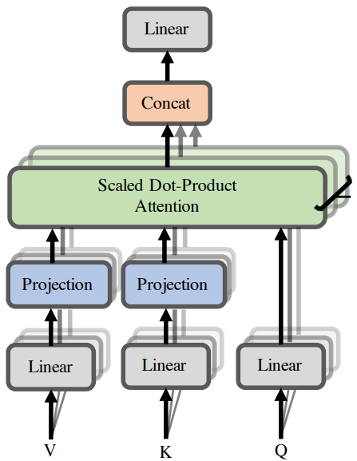

이 비용을 줄이려는 시도가 **효율적 Attention Family** 를 이룬다. 접근은 크게 두 갈래다.

**첫째, sparse attention 계열.** Longformer, BigBird, LongNet이 여기에 속한다. 출발점은 "모든 쌍을 다 볼 필요는 없다"는 가정이다. 참조 길이를 줄여 계산량을 낮춘다. 아래 네 그림은 전체 쌍을 다 보는 full attention 대신 어떤 패턴만 남길 수 있는지를 보여 준다. 대각선 주변만 보는 슬라이딩 윈도, 소수의 위치를 모두와 연결하는 전역 패턴, 무작위로 고른 쌍만 보는 패턴, 그리고 이들을 겹쳐 만든 결합 패턴이 있다.

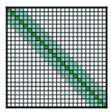
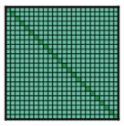
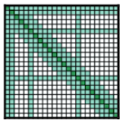
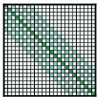

*그림 7-3. Full Attention과 Sparse Attention. 모든 쌍을 계산하는 대신 일부 패턴만 남긴다.*

<!-- +강의 id=7.2_Attention-06 w=w15a ts=[50:24] [51:09] 유형=그림해설 채택=? -->
슬라이딩 윈도에는 한두 칸씩 건너뛰며 같은 계산량으로 더 멀리 보는 dilated 변형도 있다. 전역 패턴에서 모두와 이어지는 자리는 제목처럼 멀리 떨어져 있어도 늘 참조되어야 하는 토큰이 맡는다. 곧 전역 토큰과 지역 토큰을 나누어 배치하는 설계다.
<!-- /+강의 -->

**둘째, low-rank 근사 계열.** Linformer가 여기에 속한다. 출발점은 "의미는 소수에 집중되어 있다"는 가정이다. 투영을 추가해 저계수 행렬로 근사함으로써 연산을 줄인다.

---

## 7.2.11 정형 데이터 Transformer의 분화
<!-- 슬라이드 513~517 -->

### 위치가 아니라 정체성을 부호화한다

정형 데이터에 Transformer를 쓸 때 첫 번째로 처리해야 할 문제는 위치 인코딩이다. Feature에는 순서가 없다. 그래서 TabTransformer와 FT-Transformer는 NLP에서 쓰는 positional encoding 대신, 각 Feature에 **고유한 학습 가능한 column embedding** 을 더한다. 부호화하는 대상이 위치가 아니라 **Feature의 정체성**이라는 점이 다르다.

### Attention을 풍부하게 만드는 방향

정형 데이터용 Transformer는 두 방향으로 분화했다. 첫 번째는 Attention 자체를 풍부하게 만드는 방향이다.

- **SAINT** : inter-sample attention을 도입해 열 간 관계뿐 아니라 행 간 관계까지 포착한다.
- **TabNet** : 샘플별로 $T$ 번의 sparse attention mask(sparsemax)를 찾고, 그것을 누적하여 출력한다.
- **T2G-Former** : Feature 관계를 그래프로 조직해 이질적 Feature 간 상호작용을 촉진한다.

T2G-Former가 쓰는 세 용어는 다음과 같이 풀 수 있다.

- **이질적(heterogeneous)** : 나이(연속), 성별(범주), 소득(연속), 우편번호(숫자형 범주), 혈액형(범주)처럼 성격이 다른 Feature들이 섞여 있는 상태를 말한다.
- **상호작용(interaction)** : 묶여야 의미가 생기는 Feature들을 먼저 묶어 그래프 구조를 만든다는 뜻이다.
- **촉진(promote)** : 모든 쌍을 똑같이 $N \times N$ 으로 연결하는 대신, 관계가 있는 쌍을 묶어서 연결한다는 뜻이다.

### Attention을 넘어서는 방향

두 번째는 Attention 자체를 대체하려는 방향이다.

- **TabPFN(Tabular Prior-data Fitted Network)** : 정형 데이터를 위한 Foundation Model로, in-context learning 방식으로 작동한다.
- **Mamba(Selective SSM, State Space Model)** : Attention의 역할을 selective 메커니즘으로 대체하며 $O(N)$ 복잡도를 갖는다.

### 실습 7.2.2 — Self-Attention

> 노트북: `code/7.2.2.Self_Attention_Tabular.ipynb`

**목적** : Self-Attention 모델을 학습하여 Feature attention 행렬을 시각화하고, 그 행렬을 데이터 구조의 관점에서 읽는다.

**데이터** : Housing Dataset $(1000, 7)$ 을 생성한다. 7개의 Feature는 `area`, `rooms`, `location_score` 와 여기서 파생시킨 `area_per_rooms`, `location_sq`, `log_area`, `area_x_location` 이다.

```python
def generate_housing_data(n_samples=1000, seed=42, sigma=1000):
    rng = np.random.default_rng(seed)
    area = rng.uniform(30, 150, size=n_samples)
    rooms = rng.integers(1, 6, size=n_samples)
    location_score = rng.uniform(1, 10, size=n_samples)
    price = (30*area + 50*location_score**2 + 8*(area*location_score)/10
             + rng.normal(0, sigma, size=n_samples))
    df = pd.DataFrame({
        'area': area, 'rooms': rooms, 'location_score': location_score,
        'area_per_rooms': area/rooms, 'location_sq': location_score**2,
        'log_area': np.log(area), 'area_x_location': area*location_score})
    return df, pd.Series(price)
```

**모델 구성** : 정형 데이터를 시퀀스로 다루기 위해 다음 순서로 쌓는다.

- **Reshape(7, 1)** : 7개의 Feature를 길이 7의 시퀀스, 각 위치에 1개 Feature가 있는 형태로 바꾼다.
- **Embedding layer** : position code를 학습한다. 정형 데이터에는 순서가 없으므로 이 임베딩은 Feature의 정체성을 담는 역할을 한다.
- **MHA layer** : `key_dim` 은 head의 입력 차원이자 선형 투영의 차원이다.
- **model + attn_model** : Attention score를 추출하기 위해 별도의 모델을 하나 더 둔다.

```python
keras.utils.set_random_seed(SEED)

D_MODEL, NF = 16, len(FEATS)
inp = keras.Input(shape=(NF,), name='feat')
x = layers.Reshape((NF, 1))(inp)
x = layers.Dense(D_MODEL, name='val_proj')(x)   # D_model dim으로 투영
# Lambda 레이어로 Input과 연결하여 Keras 그래프가 추적할 수 있도록 함
pos = layers.Lambda(lambda _: tf.range(NF))(inp)
x = x + layers.Embedding(input_dim=NF, output_dim=D_MODEL, name='pos_emb')(pos)
mha = layers.MultiHeadAttention(num_heads=1, key_dim=D_MODEL, name='self_attn')
attn_out, attn_scores = mha(x, x, return_attention_scores=True)
x = layers.GlobalAveragePooling1D()(attn_out)
x = layers.Dense(32, activation='relu')(x)
out = layers.Dense(1)(x)
model = keras.Model(inp, out)
attn_model = keras.Model(inp, attn_scores)   # attention 추출용

model.summary(line_length=80)
```

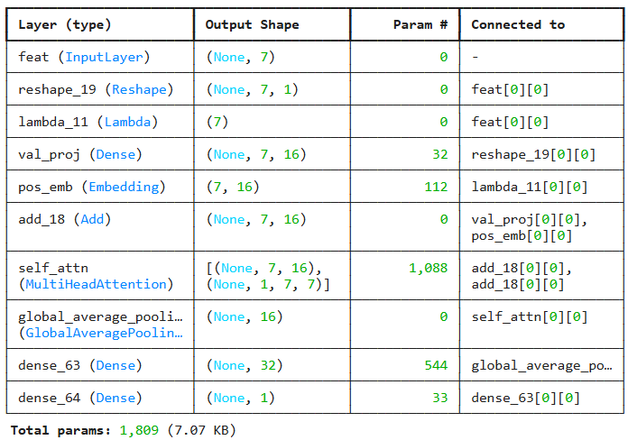

**Attention matrix 읽는 법** : 학습이 끝나면 $7 \times 7$ 행렬을 얻는다. 이 행렬은 다음 네 가지 관점으로 읽는다.

- **행 $i$** = Feature $i$ 의 참조 분포이며 합은 1이다.
- **대각 성분 $A_{ii}$ 가 크다** = 자기 집중이며, 그 Feature가 독립적임을 뜻한다. 작으면 다른 Feature에 의존한다는 뜻이다.
- **열 합이 큰 $j$** = 허브 Feature다. 많은 Feature가 그것을 참조한다.
- **$A_{ij} \neq A_{ji}$** = 방향성 있는 의존이다. 상관행렬에는 없는 정보다.

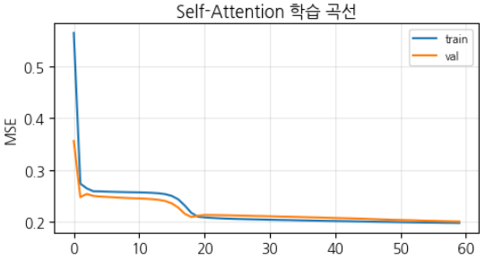

<!-- +강의 id=7.2_Attention-07 w=w15a ts=[62:19] 유형=결과해석 채택=? -->
두 곡선이 함께 내려가 아직 과적합 구간에 들어서지 않은 상태다. 이때 검증 MSE는 0.2 부근이고 결정계수는 0.8 수준이다. 뒤에서 읽을 Attention 행렬은 이 정도로 학습된 모델에서 뽑아낸 값이다.
<!-- /+강의 -->

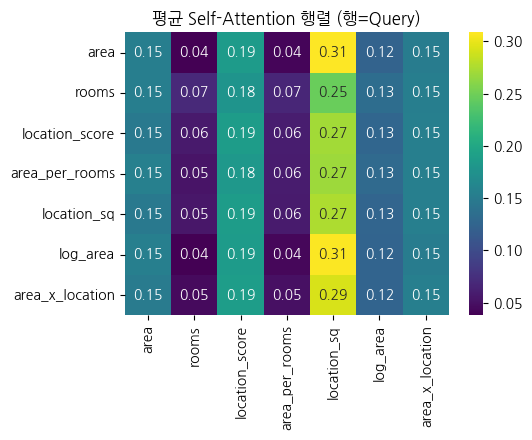

*그림 7-4. 정형 데이터의 Self-Attention 행렬. 열 방향으로 값이 몰린 Feature가 허브 역할을 한다.*

<!-- +강의 id=7.2_Attention-08 w=w15a ts=[63:06] [63:52] [64:39] 유형=결과해석 채택=? -->
대각이 큰 `location_sq` 는 자기 자신을 강하게 참조하면서 열 방향으로도 값을 많이 받아 허브 노릇을 한다. 반대로 `area` 는 대각이 작아 다른 Feature에 기댄다. `area` 가 `location_sq` 를 참조하는 강도는 0.31이지만 반대 방향은 훨씬 작다.
<!-- /+강의 -->

### 실습 7.2.2 (이어서) — Feature interaction과의 비교

**Feature interaction(상호작용)** 은 둘 이상의 Feature가 함께 작용해야 의미가 생기는 관계를 가리키는 추상적 개념이다. 이를 측정하는 주요 기법으로는 H-statistic(Friedman, 2008)과 SHAP interaction value가 있는데, 두 기법 모두 **대칭 구조**를 갖는다. 반면 Self-Attention은 **비대칭 구조**이므로 Feature interaction에 방향성이 더해진 정보를 준다. 앞서 7.2.9에서 소프트 인접 행렬의 비대칭성을 짚어 둔 대목이 여기에 대응한다.

Random Forest로 interaction을 측정해 비교해 본다. 측정 방식은 두 Feature를 동시에 섞을 때의 오차 증가가 각각 섞을 때의 합을 얼마나 넘는지를 재는 것이다. 이 초과분이 **비가산적 상호작용(super-additivity)** 이다. 동시에 섞은 효과가 각각 섞은 효과의 합보다 크면 그 차이가 상호작용의 크기가 된다. 이는 H-statistic 계열의 비가산성 측정 방식이며, Permutation Importance에 기반한 interaction 측정이다.

```python
iu = np.triu_indices(NF, k=1)           # 상삼각 추출(i<j)

def perm_err(cols):
    Xp = Xte.copy()
    for c in cols: Xp[:,c] = rngp.permutation(Xp[:,c])
    return np.mean((rf.predict(Xp) - yte)**2)

rf = RandomForestRegressor(n_estimators=120, random_state=SEED).fit(Xtr, ytr)
base = np.mean((rf.predict(Xte) - yte)**2)
rngp = np.random.default_rng(SEED)
single = {i: perm_err([i]) - base for i in range(NF)}
inter = np.zeros((NF,NF))
for i,j in zip(*iu):
    inter[i,j] = inter[j,i] = perm_err([i,j]) - single[i] - single[j] - base
rf_pairs = sorted([(FEATS[i],FEATS[j],inter[i,j]) for i,j in zip(*iu)],
                  key=lambda t:-t[2])
rf_top = rf_pairs[0]
```

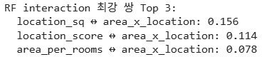

**Self-Attention에서 interaction 추출** : $A_{ij}$ 와 $A_{ji}$ 의 평균을 취하면 대칭적인 값 하나를 얻는다. 이 값을 흔히 interaction처럼 쓰지만, 정확히 말하면 이것은 **Self-Attention 기반의 참조 강도(association)** 다.

```python
A = attn_model.predict(Xs, verbose=0)   # (n, heads=1, NF, NF)
A_mean = A[:,0].mean(axis=0)            # 평균 attention (NF,NF)
A_sym = (A_mean + A_mean.T) / 2         # Asym -> sym
np.fill_diagonal(A_sym, 0.0)            # 대각 제거
iu = np.triu_indices(NF, k=1)           # 상삼각 추출(i<j)
# 쌍별 강도 추출
pair_strength = [(FEATS[i], FEATS[j], A_sym[i,j]) for i,j in zip(*iu)]
pair_strength.sort(key=lambda t: -t[2])
```

- 엄밀하게는 interaction, 즉 비가산 상호작용이 아니다. 다만 느슨한 정의에서 interaction이라는 말로 쓰는 경우가 많다.
- 참조 강도가 강하다고 해서 상호작용이 높다는 보장은 없다.
- 따라서 **Attention은 RF interaction의 대체가 아니라 보완**이다.

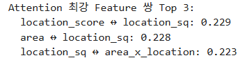

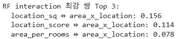

<!-- +강의 id=7.2_Attention-09 w=w15a ts=[67:48] [69:20] [70:09] 유형=결과해석 채택=? -->
두 목록의 상위 쌍은 일치하지 않는다. Random Forest 쪽은 `area_x_location` 과 `location_sq` 의 조합이 앞에 오고, Attention 쪽은 `location_sq` 중심의 쌍이 앞에 온다. 모델이 바뀌면 순위도 값도 바뀌므로 대체가 아니라 참고로 읽어야 한다.
<!-- /+강의 -->

마지막으로 같은 데이터에 **MLP 모델을 학습시켜 성능을 비교**한다. 파라미터 수를 비슷한 규모로 맞추어 두 구조를 견준다.

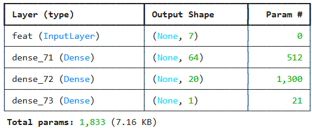

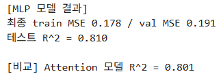

<!-- +강의 id=7.2_Attention-10 w=w15a ts=[70:49] [71:13] 유형=결과해석 채택=? -->
Self-Attention 모델의 결정계수는 0.8 수준인데, 파라미터 수를 맞춘 MLP 쪽이 오히려 조금 더 높게 나온다. Attention을 넣는다고 성능이 저절로 좋아지지는 않으며, 구조에 맞는 추가 튜닝이 있어야 이점이 나타난다.
<!-- /+강의 -->

---

## 7.2.12 Multi-Head Attention과 Head의 역할 분화
<!-- 슬라이드 518~519 -->

### 여러 관계 유형을 동시에

**Multi-Head Attention** 은 $H$ 개의 독립적인 Attention을 병렬로 실행하는 구조다. 목적은 데이터가 가진 **여러 관계 유형을 동시에 학습**하는 것이다.

형태 변환의 흐름은 다음과 같다. 입력이 $(\text{seq}, X_{\dim})$ 으로 들어오면, 이를 $H$ 개로 쪼개어 $(h, \text{seq}, X_{\dim}/h)$ 형태로 만든 뒤 각 head에서 Scaled Dot-Product Attention을 수행하고, 결과를 concat하여 다시 $(\text{seq}, X_{\dim})$ 으로 되돌린다.

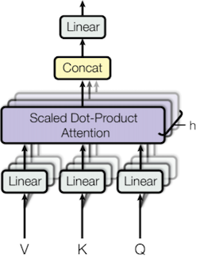

Head가 여럿일 때 무엇이 달라지는지는 같은 문장을 서로 다른 head로 시각화해 보면 드러난다. 같은 층, 같은 대명사에 대해서도 head마다 서로 다른 토큰에 강하게 연결된다.

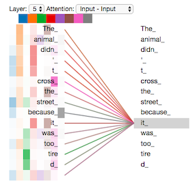

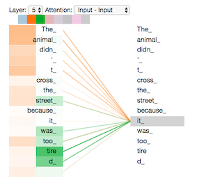

### 역할 분화는 어떻게 일어나는가

Head들이 서로 다른 일을 맡게 되는 과정에는 명시적인 강제가 없다. 메커니즘은 다음과 같다.

각 Head는 **랜덤 초기화**되어 서로 다른 출발점에서 시작한다. 각자의 투영 행렬 $W_{Q_h}$, $W_{K_h}$, $W_{V_h}$ 가 독립적으로 갱신되며, 손실을 줄이는 과정에서 **서로 다른 관계 패턴을 맡는 것이 평균적으로 유리**하기 때문에 자연스럽게 분화가 일어난다. 어떤 Head는 인접한 Feature 쌍을 맡고, 어떤 Head는 멀리 떨어진 쌍의 관계를 맡는 식이다.

여기에 중요한 단서가 붙는다. **이 분화는 보장된 것이 아니라 경향일 뿐이다.** 실제로는 비슷한 일을 하는 중복 Head가 다수 남는 경우가 많다. 이는 Deep Ensemble(딥 앙상블)에서 개별 모델이 분화하는 것과 같은 원리이며, 결국 **다양성은 강제가 아니라 최적화의 부산물**이다.

### Head 중복성에 대한 연구

이 경향은 여러 연구에서 정량적으로 확인되었다.

- **Clark et al. (2019)** : 일부 Head가 목적어·한정사 등 특정 문법 관계에 일관되게 정렬됨을 보였다. 해석 가능한 Head가 실제로 존재한다는 확인이다.
- **Voita et al. (2019)** : 다수의 Head가 중복되어 있으며, pruning으로 상당수를 제거해도 성능이 거의 유지됨을 보였다. 소수의 특화 Head와 다수의 잉여 Head가 공존하는 구조다.
- **Michel et al. (2019)** : 추론 시 대부분의 Head를 제거해도 되는 층이 많다는 것을 정량화하여 Head 중복성을 확인했다.

종합하면 Head 분화는 단순하지 않다. **소수의 의미 있는 Head와 다수의 잉여 Head**가 섞여 있으므로, Head 시각화를 볼 때는 선택적 해석이 필요하다. 모든 Head의 그림을 동등하게 취급하면 안 된다.

### 분화 성능을 SVD로 측정하기

분화가 잘 되었는지는 정량적으로 잴 수 있다. 분화가 잘 되면 각 Head가 사용하는 부분공간이 서로 다른 방향, 거의 직교에 가까운 방향으로 벌어진다. 반대로 **잉여 Head는 매우 낮은 Effective Rank** 를 보인다.

측정 방법은 각 Head의 $W_{Q_h}\left(W_{K_h}\right)^\top$ 에 **특이값 분해(Singular Value Decomposition, SVD)** 를 적용하여 Effective Rank, 곧 실제로 사용된 차원 수를 구하는 것이다. Effective Rank의 정의와 해석은 7.3에서 자세히 다룬다.

---

## 7.2.13 Head 수 H의 선택과 다층 관계 분석
<!-- 슬라이드 520~523 -->

### 트레이드오프

Head 수 $H$ 를 정하는 문제는 관계 유형의 해상도와 Head당 차원 $d_h = d/H$ 사이의 트레이드오프다. Head가 많으면 다양한 관계를 분리해 담을 수 있지만, 각 Head의 차원이 작아져 표현력이 약해진다. 반대도 마찬가지다.

경험적인 출발점으로, Feature가 7개에서 30개 정도인 정형 데이터에서는 $H = 2 \sim 8$ 범위를 쓴다. 과도한 $H$ 는 잉여 Head만 늘린다.

### 적절한 H를 진단하는 절차

과잉 Head는 Attention 해석을 방해한다. 관계 표현이 여러 Head에 분산되어 어느 것도 뚜렷하지 않게 되기 때문이다. 진단은 네 단계로 한다.

1. **엔트로피로 1차 거르기** : Attention 분포가 균일한, 즉 엔트로피가 높은 Head를 제외한다.
2. **$\tau$ 로 2차 검증** : 집중된(엔트로피가 낮은) Head라도, 시드 간 Kendall $\tau$ 가 낮으면 우연이므로 제외한다.
3. **둘 다 통과한 Head만 채택** : 집중되어 있으면서 재현도 되는 Head만 데이터 구조의 신호로 받아들인다.
4. **$H$ 조정** : 잉여 Head, 곧 균일하거나 불안정한 Head가 다수라면 $H$ 를 줄여야 한다.

두 지표의 의미를 다시 정리하면 다음과 같다.

- **Attention 엔트로피가 높다** : 분포가 균일하다는 뜻이며, 특별한 attention이 없다는 신호다.
- **시드 안정성 Kendall $\tau$ 가 낮다** : 시드에 따라 참조 강도 쌍의 순위가 바뀐다는 뜻이며, 관계 표현이 여러 head에 분산되어 있다는 신호다.

### Multi-Head, Multi-Layer를 통과한 관계 분석

실제 Transformer는 Head가 여럿일 뿐 아니라 층도 여럿이다. 여러 층을 통과한 뒤의 관계를 입력까지 되짚으려는 방법이 두 가지 있다.

**Attention Rollout(Abnar & Zuidema, 2020)** 은 층별 Attention 행렬을 곱해 입력까지의 누적 경로를 근사한다. 다만 Multi-Head의 Attention 행렬을 평균으로 처리하기 때문에 개별 Head의 관계가 흐릿해진다는 한계가 있다.

**"Transformer Interpretability Beyond Attention Visualization"(Chefer et al., 2021)** 은 Attention에 gradient를 결합해 Head별 기여를 가중한다. 이 방식은 Head 분화 정보를 남길 수 있다.

여기까지의 진단 절차를 실제 모델에 적용해 보는 것이 **실습 7.2.3** 이다. 같은 데이터를 $H = 4$ 와 $H = 2$ 로 학습해 Head별 엔트로피와 최강 참조 쌍을 비교하고, 잉여 Head가 있을 때 $H$ 를 줄이라는 지침이 실제로 성립하는지 확인한다.

### 실습 7.2.3 — Multi-Head Self-Attention

> 노트북: `code/7.2.3.MultiHead_Differentiation.ipynb`

**목적** : Multi-Head Self-Attention 모델을 학습하고 Head 수의 적절성을 검토한다.

**데이터** : 앞과 같은 Housing Dataset $(1000, 7)$ 을 사용한다.

**출력 형태** : MHA 층은 두 개의 텐서를 반환한다. 하나는 `(bs, features, d_model)` 형태의 출력이고, 다른 하나는 `(bs, head, features, features)` 형태의 attention score다. Head 수를 바꾸어도 **모델 크기는 동일하게** 유지되도록 맞춘다. Head가 늘면 Head당 차원이 줄기 때문이다.

```python
D_MODEL, H = 16, 4          # Head = 4
key_dim = int(D_MODEL/H)    # head별 입력 dim
keras.utils.set_random_seed(SEED)
inp = keras.Input(shape=(NF,))
x = layers.Reshape((NF,1))(inp)
x = layers.Dense(D_MODEL)(x)
pos = layers.Lambda(lambda _: tf.range(NF))(inp)
pos_emb = layers.Embedding(input_dim=NF, output_dim=D_MODEL, name='pos_emb')(pos)
x = x + pos_emb
mha = layers.MultiHeadAttention(num_heads=H, key_dim=key_dim, name='mha')
attn_out, attn_scores = mha(x, x, return_attention_scores=True)
g = layers.GlobalAveragePooling1D()(attn_out)
g = layers.Dense(32, activation='relu')(g)
out = layers.Dense(1)(g)
model = keras.Model(inp, out); attn_model = keras.Model(inp, attn_scores)
model.summary(line_length=75)
```

**H = 4 결과 해석** : Head별 Attention 행렬을 시각화하고, 각 Head의 최강 참조 쌍과 엔트로피를 확인한다.

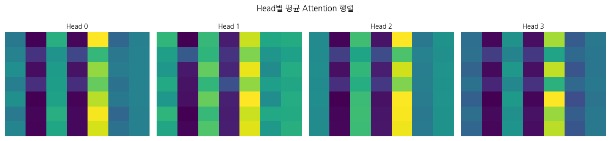

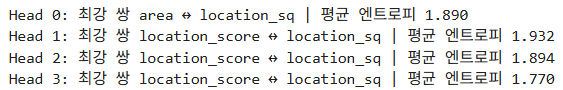

<!-- +강의 id=7.2_Attention-11 w=w15a ts=[81:01] [84:00] 유형=결과해석 채택=? -->
성능만 보면 Head를 넷으로 늘린 효과는 거의 없다. 검증 MSE는 0.199로 단일 Head 모델의 0.2와 사실상 같고 결정계수도 미세하게 오르는 데 그친다. 아래에서 읽는 중복과 분화는 성능의 차이가 아니라 관계를 나누어 담는 방식의 차이다.
<!-- /+강의 -->

관찰된 내용은 다음과 같다.

- **Head별 최강 쌍** : Head 0은 `area` ↔ `location_sq` 에, Head 1·2·3은 `location_score` ↔ `location_sq` 에 가장 강하게 집중한다. 고유한 최강 쌍은 2종뿐이다.
- **엔트로피 범위와 최댓값 비교** : Feature가 7개이므로 최대 엔트로피는 $\ln 7 \approx 1.946$ 이다. Head의 평균 엔트로피는 1.770에서 1.932 사이에 분포한다.
- **중복(Redundancy)** : 4개 Head 중 3개가 동일한 Feature 쌍에 집중하고 있으므로 중복이 존재한다.
- **분화(Differentiation)** : 측정된 엔트로피가 최댓값에 가깝다는 것은 각 Head가 여러 Feature의 정보를 **넓게(broad)** 탐색하고 있음을 뜻한다. 동시에 Head마다 집중도의 차이(엔트로피 폭 0.161)가 존재하므로, 서로 다른 관점으로 정보를 처리하는 분화도 있다.

결론은 일부 중복된 관계를 학습하고 있다는 것이며, 따라서 **Head 수를 줄여서 비교해 볼 필요**가 있다. 앞 소절의 진단 절차에서 말한 4단계, 곧 잉여 Head가 다수라면 $H$ 를 줄이라는 지침이 그대로 적용되는 자리다.

**H = 2 결과 해석** : Head를 둘로 줄여 같은 분석을 반복한다.

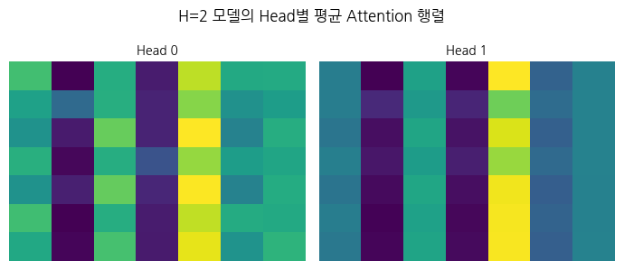

- **성능** : 성능 하락이 거의 없다.
- **집중 쌍** : H=4 모델에서는 Head 3개가 `location_score` ↔ `location_sq` 에 집중하는 중복이 있었다. H=2 모델에서는 두 Head 모두 같은 쌍에 집중한다.
- **역할 분화** : 엔트로피 폭으로 분화를 확인할 수 있다. Head 0의 평균 엔트로피는 1.927로 최댓값 1.946에 근접하며, 전반적인 정보를 **넓게(broad)** 탐색하는 역할을 맡는다. Head 1의 평균 엔트로피는 1.792로 상대적으로 **좁게(sharp)** 핵심 정보에 집중하는 역할을 맡는다.

정리하면, 중복이 있던 H=4를 버리고 더 적은 Head 수인 H=2를 쓰면서 서로 다른 집중 방식(broad와 sharp)으로 효율적인 분화를 얻은 것이다.

---

## 7.2.14 세 가지 의존 관점 비교
<!-- 슬라이드 524 -->

Feature 간 의존을 보는 도구는 하나가 아니다. 7장에서 다루는 세 가지 관점 — 중요도(Importance), Attribution, Attention — 은 서로 다른 질문에 답한다.

| 도구 | 질문 | 단위 | 방향성 | 한계 |
|---|---|---|---|---|
| PI · SHAP | Feature 제거 시 성능이 어떻게 변하는가 | Feature 1개 | 입력 → 성능 | 상관 · 가설 종속 |
| Attribution | Feature 제거 시 출력이 어떻게 변하는가 | 입력 → 출력 1쌍 | 입력 → 출력 | 모델 · baseline 종속 |
| Attention | 요소가 요소를 얼마나 참조하는가 | 요소 ↔ 요소 쌍 | 비대칭 $i \to j$ | weight ≠ 중요도 · 설명 논쟁 |

세 도구가 서로 다른 Feature를 지목하는 일은 흔하다. 이때 하나를 골라 나머지를 버리는 것은 잘못된 대응이다.

> **핵심 메시지**
> 세 도구의 불일치 자체가 모델과 데이터 구조에 대한 발견이다.

그리고 설명 논쟁이 남긴 실무 지침을 다시 확인해 둔다. **Attention 시각화는 가설일 뿐 증명이 아니다.** 단독으로 쓰지 말고 반드시 교차 검증해야 한다.

---

## 7.2.15 정리
<!-- 슬라이드 524 -->

> **정리 — 7.2 Attention**
>
> - **Attention ≠ 중요도** : Attention weight는 요소 $i$ 가 요소 $j$ 를 참조하는 강도, 즉 의존 관계의 강도다. 이 강도는 $i$ 의 Query와 $j$ 의 Key의 유사도로 산출한 뒤 softmax를 통해 제로섬으로 정규화된다.
> - **Dot-Product와 $1/\sqrt{d_k}$ 스케일링** : 내적의 분산을 차원과 무관하게 유지해 softmax 포화와 기울기 소실을 방어한다.
> - **Self-Attention 행렬 $N \times N$** : Feature 쌍의 참조 관계를 담은 소프트 인접 행렬이다. RF interaction(H-statistic·SHAP)이 측정하는 비가산적 상호작용과는 다르다. 비대칭이며, 사후 추정이 아니라 학습에 내재한다는 점이 RF와 다르다. 비선형성 자체는 트리 기반 RF도 가지고 있다.
> - **Multi-Head 분화** : 강제된 것이 아니라 최적화의 부산물이다. 중복 Head가 다수일 수 있으며, 투영 행렬의 SVD로 정량화하여 튜닝할 수 있다.
> - **Attention is (not) Explanation 논쟁** : Attention 시각화는 가설이지 설명의 증명이 아니다. 반드시 다른 도구와 교차 검증한다.
