<!-- ───────────────── 강의 음성 기반 보완 제안 ─────────────────
  이 파일의 제안 16건 (개념보강 2 / 결과해석 3 / 그림해설 11)

  각 제안은 「+강의」 마커로 감싸여 있다. 마커 줄 끝의 판정을 고친다.
    채택하려면  물음표를  y  로
    기각하려면  물음표를  n  로
    보류하면    그대로 두면 되고 '미검토'로 보고된다

  검토를 마치면 저장소 루트에서  python3 apply_lecture.py  를 실행한다.
  (--dry-run 을 붙이면 고치지 않고 집계만 한다)
  ─────────────────────────────────────────────────────────── -->

# 7.3 Parameter 분포 분석

**학습 목표**

- Parameter 분포 분석이 왜 Explainability에 속하는지 설명하고, 출력 해석의 신뢰성과 어떻게 연결되는지 논증할 수 있다.
- Weight 행렬에 SVD를 적용해 Stable Rank와 Effective Rank를 계산하고, 그 값을 데이터의 내재 차원과 대응시켜 해석할 수 있다.
- 특이값 스펙트럼의 형태(급감형·멱법칙형·평탄형·붕괴형)와 Condition number를 읽어 학습 상태를 진단할 수 있다.
- Dead Neuron 비율의 정의와 Dying ReLU 메커니즘을 설명하고, 활성함수·정규화·초기화로 처방을 제시할 수 있다.
- layer별 erank를 깊이 순으로 나열해 압축 깔때기와 표현 병목을 진단하고, 그 값을 근거로 모델 구조를 경량화할 수 있다.
- Lottery Ticket Hypothesis와 IMP 절차를 설명하고, 모델의 의미가 소수 연결에 집중된다는 주장을 Parameter 분포 관점에서 해석할 수 있다.
- 내부 지표들이 시드에 흔들린다는 점을 인식하고, 안정성 framework로 검증한 뒤에만 해석에 쓸 수 있다.

**이 절의 구성**

- 7.3.1 왜 Parameter 분포가 Explainability에 속하는가
- 7.3.2 Weight 분포 — SVD와 Effective Rank
- 7.3.3 특이값 스펙트럼의 형태 — Heavy-Tailed Self-Regularization
- 7.3.4 Condition number와 Rank Collapse *(실습 7.3.1)*
- 7.3.5 Activation 분포와 Dead Neuron
- 7.3.6 활성함수와 정규화, 그리고 Activation Histogram
- 7.3.7 Layer-wise Rank와 Activation Entropy *(실습 7.3.2 · 실습 7.3.4)*
- 7.3.8 Pruning
- 7.3.9 Lottery Ticket Hypothesis
- 7.3.10 구조적 pruning과 Double Descent *(실습 7.3.5)*
- 7.3.11 안정성 framework와 역추론의 지도
- 7.3.12 정리

> 실습 번호는 강의 슬라이드의 번호를 그대로 쓴다. 소절 번호와는 무관하다.

---

## 7.3.1 왜 Parameter 분포가 Explainability에 속하는가
<!-- 슬라이드 525~526 -->

이 절이 던지는 질문은 하나다.

> **핵심 질문**
> 학습이 끝난 모델의 Parameter 분포에는 데이터의 어떤 구조가 압축되어 남는가?

### Weight와 Activation 분포는 무엇의 흔적인가

모델의 Weight 분포와 Activation 분포는 **모델이 데이터 구조를 어떻게 압축(인코딩)했는가의 정량적 흔적**이다. 학습은 데이터의 구조를 파라미터라는 형태로 눌러 담는 과정이므로, 눌러 담긴 결과를 펼쳐 보면 원래 구조의 자취가 남아 있다.

이것이 Explainability에 속하는 이유는 다음과 같다. 모델의 출력을 해석할 때는 모델 내부가 무엇을 학습했는지를 **함께** 확인하는 편이 안전하다. Parameter 분포는 출력 해석의 신뢰성을 뒷받침하는 점검 절차이며, 그런 의미에서 설명 가능성의 한 축을 이룬다.

반대 방향으로 말하면 더 분명해진다. **잘못 학습된 모델, 예컨대 Dead Neuron이 다수인 모델의 Attribution과 Attention은 신뢰하기 어렵다.** 7.1과 7.2에서 만든 설명은 모델이 정상적으로 학습되었다는 전제 위에서만 유효하다. 그 전제를 확인하는 일이 이 절의 몫이다.

### 데이터에 몇 차원의 구조가 있는가

Parameter 분포가 답할 수 있는 대표적 질문은 차원에 관한 것이다. 데이터의 **내재 차원(intrinsic dimension)**, 선형 투영으로 잡은 PCA의 주성분 수, 잠재공간의 차원 수는 모두 같은 질문의 다른 표현이다.

Weight에서 관찰되는 **Low-Rank(저계수) 패턴**은 이 질문에 대한 모델 쪽의 답이다. 모델이 데이터 구조를 표현하는 데 실제로 몇 개의 유효 차원(effective dimension)을 썼는지 추적할 수 있다.

### 어떤 정보를 읽어 낼까

이 절에서 다룰 네 가지 도구와 각각이 답하는 질문은 다음과 같다.

- **Effective Rank** : 모델이 실제로 사용한 차원 수를 확인한다. 데이터 내재 차원의 흔적이다.
- **Dead Neuron** : 모델이 버린 용량을 확인한다.
- **Activation entropy** : 표현의 집중(특화-낮은H)/분산(다양성-높은H)을 확인한다.

- **Lottery Ticket** : 핵심 연결이 어디인지를 확인한다.

---

## 7.3.2 Weight 분포 — SVD와 Effective Rank
<!-- 슬라이드 527 -->

### Weight에 SVD를 적용한다

Weight 행렬 $W \in \mathbb{R}^{d_{\mathrm{out}} \times d_{\mathrm{in}}}$ 에 **특이값 분해(Singular Value Decomposition, SVD)** 를 적용하면 다음과 같이 분해된다.

$$W = U \Sigma V^\top$$

여기서 얻어지는 특이값들 $\sigma_1 \geq \sigma_2 \geq \dots$ 의 분포가 **모델이 몇 차원을 사용하도록 학습되었는지의 신호**가 된다. 이를 실질 차원이라 부른다.

단, 이 값은 절대적인 수치가 아니다. 정규화의 강도와 수렴 정도에 따라 달라지기 때문이다. 상대 비교로 쓰는 것이 안전하다.

읽는 법의 핵심은 간단하다. **상위 몇 개의 특이값이 나머지를 압도한다면, 그 layer는 실질적으로 저차원 부분공간만 사용하고 있는 것이다.** 이는 PCA에서 특이값(분산)으로 데이터의 차원을 살펴본 것과 동일한 방식을, 대상만 학습된 weight로 바꾸어 적용한 것이다.

### 실질 차원을 재는 두 지표

**Stable Rank(안정 계수)** 는 가장 단순한 지표다.

$$\mathrm{srank}(W) = \frac{\|W\|_F^2}{\|W\|_2^2} = \frac{\sum_i \sigma_i^2}{\sigma_1^2}$$

여기서 $\|W\|_F^2$ 는 프로베니우스 놈의 제곱이고 $\|W\|_2^2$ 는 스펙트럴 놈의 제곱이다. 즉 전체 에너지를 가장 큰 방향의 에너지로 나눈 값이다.

**Effective Rank(유효 계수, Roy & Vetterli, 2007)** 는 특이값을 정규화한 분포의 엔트로피를 지수화한 것으로, 분포 전체의 균형을 더 잘 표현한다.

$$\mathrm{erank}(W) = \exp\!\left(H(p)\right)$$

여기서 각 항은 다음과 같이 정의된다.

$$p_i = \frac{\sigma_i}{\sum_j \sigma_j}, \qquad H(p) = -\sum_i p_i \ln p_i$$

즉 $p_i$ 는 각 특이값의 비율이고 $H(p)$ 는 그 비율 분포의 엔트로피다. 이 정의에서 두 극단이 바로 나온다.

- **강한 Low-Rank** : 특이값이 하나에 집중되어 한 방향만 쓰는 경우다. $H(p)$ 가 작아지므로 $\mathrm{erank} \approx 1$ 이 된다.
- **Full-Rank** : 특이값이 고르게 분산된 경우다. $H(p)$ 가 커지므로 $\mathrm{erank} \approx d$ 가 되며, 여기서 $d = \min(\text{w.shape})$ 다.

### erank를 해석하는 기준

erank 값 하나만으로는 좋고 나쁨을 말할 수 없다. 비교 대상이 필요하며, 그 대상이 데이터의 내재 차원이다.

데이터 자체의 누적 분산 비율(CVR)이 95%에 도달하는 차원 수를 $k_{95} = K$ 라고 측정했다고 하자. 이때 첫 인코더 layer의 erank도 $K$ 부근의 값이 되는 것이 자연스럽다. 두 값의 관계에서 두 가지 판단이 나온다.

- $\mathrm{erank} \approx k_{95}$ : 모델이 데이터의 내재 차원을 정확히 포착한 것이다.
- $\mathrm{erank} \gg k_{95}$ : 필요 이상으로 많은 차원에 정보를 분산시킨 신호이며, **과파라미터화(over-parameterization)** 를 의심할 수 있다.

---

## 7.3.3 특이값 스펙트럼의 형태 — Heavy-Tailed Self-Regularization
<!-- 슬라이드 528 -->

### 스펙트럼의 꼬리가 말해 주는 것

Effective Rank가 "몇 차원을 썼는가"를 하나의 숫자로 요약한다면, 특이값 분포의 **형태** 는 그보다 풍부한 정보를 담는다.

Martin과 Mahoney(2021)의 **Heavy-Tailed Self-Regularization** 이론은 특이값 분포와 학습 품질의 관계를 다룬다. 이 이론은 잘 학습되고 일반화가 좋은 layer의 특이값 분포가 **멱법칙(power-law)의 무거운 꼬리**를 띤다고 보고한다.

꼬리의 두께는 **꼬리 지수(tail index)** $\alpha$ 로 잰다.

$$p(\sigma) \propto \sigma^{-\alpha}$$

$\alpha$ 값에 따른 진단은 다음과 같다.

- $\alpha < 2$ : 꼬리가 두껍고 분포가 평탄하다. 학습이 부족한 것은 아닌지 검토해야 한다.
- $\alpha \approx 2 \sim 4$ : 균형 잡힌 상태다. 학습과 일반화가 모두 좋다.
- $\alpha > 6$ : 꼬리가 얇고 분포가 좁다. 과적합이나 붕괴를 검토해야 한다.

이 진단의 실용적 가치는 **검증 데이터 없이 학습 품질을 진단**할 수 있다는 데 있다. 별도의 검증 집합을 소모하지 않고 weight만 들여다보아 상태를 짐작할 수 있다.

### 학습은 왜 Low-Rank를 선호하는가

특이값이 저차원에 집중되는 경향은 우연이 아니다. 해석을 위해 단순화한 **깊은 선형망(deep linear network)** 으로 분석하면 그 이유가 드러난다.

학습은 **큰 특이값 방향을 먼저, 그리고 빠르게 학습하고 작은 방향은 늦게 학습한다.** 이 자체가 일종의 **암묵적 정규화(implicit regularization)** 로 작동한다. 여기에 Early stopping이나 Weight decay 같은 조건이 붙으면 작은 특이값이 억제되어 Effective Rank가 낮아진다.

주의할 점은 인과의 방향이다. 학습이 Low-Rank를 **강제하는 것이 아니다.** 데이터가 저차원 구조를 가질 때 erank가 그 내재 차원 부근으로 학습되는 것이다.

### erank/neuron 비율로 보는 차원 활용도

layer 간 비교를 위해서는 erank를 뉴런 수로 나눈 비율을 쓴다. 여기서 뉴런 수는 $\min(\text{w.shape})$ 이다.

- $< 0.2$ : 강한 Low-Rank다. layer를 축소할 여지가 있다.
- $0.2 \sim 0.6$ : 적정 범위다.
- $0.8 <$ : 거의 Full-Rank다. 과파라미터화이거나 데이터가 실제로 고차원임을 의심한다.

이 비율에도 제한이 있다. 정규화 강도와 학습 수렴도에 민감하므로 **절대적인 임계값이 아니다.** 같은 모델의 layer 간 비교, 또는 시드 간 비교 지표로 쓰는 것이 안전하다.

---

## 7.3.4 Condition number와 Rank Collapse
<!-- 슬라이드 529~533 -->

### Condition number $\kappa$

특이값의 비율 중 가장 극단적인 것만 뽑아낸 지표가 **Condition number** 다.

$$\kappa(W) = \frac{\sigma_{\max}}{\sigma_{\min}}$$

이는 데이터의 다중공선성을 진단할 때 쓰는 Condition number와 동일한 접근이다. 데이터 쪽에서 $\kappa$ 가 크다는 것은 feature의 특이값 비율이 크다는 뜻이고, feature 방향이 한쪽으로 몰려 있다는 뜻이며, 결국 다중공선성으로 인해 학습이 불안정해진다.

Weight 쪽에서도 해석은 평행하다. $\kappa$ 가 크면 Weight가 특정 방향으로 몰려 그 방향에 민감해진다. 그 결과 입력의 작은 변화가 출력에서 증폭되어 **불안정**해진다.

### Self-Attention에서의 Rank Collapse

Condition number가 극단으로 치달으면 **Rank Collapse(계수 붕괴)** 가 된다. Transformer 쪽에 이 현상의 유명한 사례가 있다.

Dong et al.(2021)은 skip connection과 FFN 없이 Self-Attention만 깊게 쌓으면, 출력이 **이중 지수적($2^{2^n}$)** 으로 rank-1로 붕괴한다는 것을 증명했다. rank-1로 붕괴한다는 것은 모든 토큰이 같은 벡터를 갖게 된다는 뜻이다.

이 결과가 시사하는 바는 분명하다. **모델의 구조 설계 자체가 Parameter 표현력을 보전하는 조건이며, 그 보전 여부를 erank로 확인할 수 있다.**

### 특이값 스펙트럼 읽기 — 예시

구체적인 수치로 읽는 연습을 해 보자. 256차원 layer의 정렬된 특이값이 처음 약 50개에서 급감하고 그 이후 완만한 꼬리를 보인다고 하자. 대표값은 $\sigma_1 = 12.0$, $\sigma_{50} = 0.8$, $\sigma_{256} = 0.02$ 이다.

여기서 $\mathrm{erank} \approx 48$ 이고 $k_{95} \approx 50$ 이라면, 모델이 데이터의 내재 차원을 정확히 잡은 것이다. 명목상으로는 256차원이지만 실질적으로는 약 48차원만 사용하고 있다는 뜻이다. 참고로 $k_{95}$ 는 PCA의 누적 분산률 CVR이 처음으로 0.95에 도달하는 $k$ 값이다.

### 네 가지 스펙트럼 형태

스펙트럼의 모양은 네 가지 유형으로 분류해 읽을 수 있다.

| 스펙트럼 형태 | 해석 | 판정 |
|---|---|---|
| 급감 후 0 근처의 꼬리 | 강한 Low-Rank | 좋은 압축, $\mathrm{erank} \ll d$ |
| 완만한 멱법칙 꼬리 | heavy-tailed 자기정규화 | 좋은 일반화 (Martin·Mahoney) |
| 거의 평탄 | 미학습 또는 무작위 | 구조 없음, $\mathrm{erank} \approx d$ |
| 단일 특이값이 지배 | Rank Collapse | 위험, $\mathrm{erank} \approx 1$ |

<!-- +강의 id=7.3_Parameter분석-01 w=w15b ts=[21:25] [22:13] [22:58] 유형=결과해석 채택=? -->
급감 뒤 0 근처의 꼬리는 압축이 잘된 것일 수도 있고 layer가 필요 이상으로 큰 것일 수도 있어 양쪽으로 읽힌다. 거의 평탄한 경우도 마찬가지다. 데이터의 내재 차원이 layer의 차원과 비슷할 만큼 정보량이 많은 것인지, 아니면 학습이 진행되지 않은 것인지를 함께 따져야 한다.
<!-- /+강의 -->

### 실습 7.3.1 — Weight, SVD, Effective Rank 분석

> 노트북: `code/7.3.1.Weight_SVD_Effective_Rank.ipynb`

**목적** : MNIST로 오토인코더를 학습하고 layer별 weight에 SVD를 적용해 특이값을 분석한다. 여기까지 정의한 erank, erank/neuron, $\kappa(W)$, Tail Index $\alpha$ 네 지표를 한 모델에서 동시에 재고, 그 값들이 서로 어긋나는 지점을 찾아 진단으로 연결한다.

**모델 구조** : 인코더와 디코더가 비대칭인 구조로 만든다. 이 비대칭이 뒤에서 진단의 대상이 된다.

```python
Z_DIM = 32
keras.utils.set_random_seed(SEED)
inp = keras.Input(shape=(784,))
h = layers.Dense(128, activation='relu', name='enc1')(inp)
h = layers.Dense(128, activation='relu', name='enc2')(h)
z = layers.Dense(Z_DIM, activation='linear', name='z')(h)
h = layers.Dense(128, activation='relu', name='dec2')(z)
h2 = layers.Dense(128, activation='relu', name='dec1')(z)
out = layers.Dense(784, activation='sigmoid')(h2)
ae = keras.Model(inp, out)
encoder = keras.Model(inp, z)
ae.summary(line_length=60)

ae.compile(optimizer=keras.optimizers.Adam(2e-3), loss='mse')
hist = ae.fit(X_tr, X_tr, validation_data=(X_te, X_te),
              epochs=20, batch_size=64, verbose=0)
```

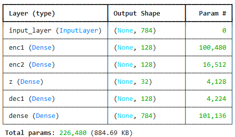

<!-- +강의 id=7.3_Parameter분석-02 w=w15b ts=[23:44] [24:31] 유형=그림해설 채택=? -->
이 실습은 MNIST에서 3,000장만 추려 학습한 모델이다. summary에서 보이듯 인코더는 128과 128을 거쳐 32로 좁아지지만, 디코더는 128 하나만 거쳐 784로 되돌아간다. 디코더 쪽 층이 한 단 적은 이 비대칭은 문제가 어떤 모습으로 드러나는지 보려고 일부러 만든 것이다.
<!-- /+강의 -->

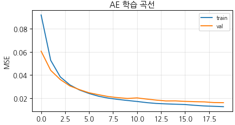

**데이터 쪽 기준값** : 먼저 데이터 자체의 특이값, erank, CVR 기준의 $k_{95}$ 를 구해 둔다. 특이값의 제곱이 곧 분산이자 에너지이므로, 누적 에너지 비율로 $k_{95}$ 를 정의한다.

```python
def effective_rank(s):
    s = s[s > 1e-12]; p = s / s.sum()
    return float(np.exp(-(p*np.log(p)).sum()))   # 특이값 분포 엔트로피의 지수

def k_energy(s, frac=0.95):
    e = np.cumsum(s**2) / np.sum(s**2)
    return int(np.searchsorted(e, frac) + 1)

# 데이터 자체의 내재 차원
s_data = np.linalg.svd(X_tr - X_tr.mean(0), compute_uv=False)
print(f'입력 데이터 effective rank {effective_rank(s_data):.1f}, k95={k_energy(s_data)}')
```

**잠재 표현 z의 사용 차원** : 인코더 출력의 정보량을 확인한다. `Z.shape` 는 `(train_sample, 32)` 이며, 이 행렬의 특이값 분포와 erank, $k_{95}$ 를 구한다. 명목 32차원 중 실제로 몇 차원이 쓰이는지를 보는 것이다.

```python
Z = encoder.predict(X_tr, verbose=0)
s_z = np.linalg.svd(Z - Z.mean(0), compute_uv=False)
z_er, z_k95 = effective_rank(s_z), k_energy(s_z)
print(f'잠재 z: 할당 차원 {Z_DIM} / effective rank {z_er:.2f} / k95 {z_k95}')
```

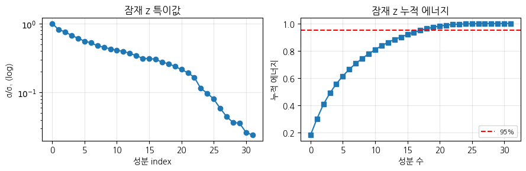

**Layer별 W의 특이값 분석** : 각 layer에 대해 erank, erank/neuron, $\kappa(W)$, Tail Index $\alpha$, 히스토그램을 모아 표로 만든다. Tail Index는 Hill Estimator로 추정한다.

```python
def get_tail_index(s, frac=0.2):
    """Hill Estimator를 사용한 고윳값 분포의 Tail Index (alpha) 계산"""
    evals = s**2
    k = max(int(len(evals) * frac), 3)      # 상위 frac 비율을 꼬리로 간주
    tail_evals = evals[:k]
    if tail_evals[-1] <= 1e-12:
        return np.nan
    sum_log = np.sum(np.log(tail_evals / tail_evals[-1]))
    return 1 + k / sum_log if sum_log > 0 else np.nan

for layer in [l for l in ae.layers if isinstance(l, layers.Dense)]:
    w = layer.get_weights()[0]
    s = np.linalg.svd(w, compute_uv=False)
    er = effective_rank(s)
    er_per_neuron = er / min(w.shape)
    kappa = s[0] / s[-1] if s[-1] > 1e-12 else np.inf
    alpha = get_tail_index(s)
    print(f'{layer.name:<12} | {str(w.shape):<15} | {er:<8.1f} | '
          f'{er_per_neuron:<12.3f} | {kappa:<10.1f} | {alpha:<13.2f}')
```

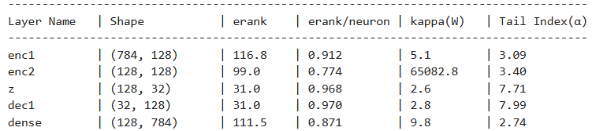

<!-- +강의 id=7.3_Parameter분석-03 w=w15b ts=[29:08] [30:40] [32:18] 유형=그림해설 채택=? -->
표를 읽을 때는 각 layer의 erank 상한이 노드 수가 아니라 weight shape의 작은 쪽이라는 점을 먼저 본다. z 다음의 128 노드 layer는 입력이 32차원이므로 상한이 32다. erank 116, 99, 31, 31, 111도 그 상한에 견주어 읽어야 한다.
<!-- /+강의 -->

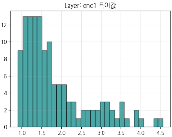

<!-- +강의 id=7.3_Parameter분석-04 w=w15b ts=[31:32] [30:40] 유형=그림해설 채택=? -->
enc1의 특이값은 0.8보다 큰 값에서 시작해 0에 붙은 값 없이 이어진다. 128개의 방향이 모두 일정 크기 이상을 유지하고 있다는 뜻이며, erank 116과 비율 0.91도 같은 이야기를 한다. 뒤에 나올 enc2와 견주어 볼 기준선이 되는 모양이다.
<!-- /+강의 -->

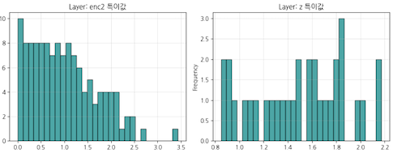

<!-- +강의 id=7.3_Parameter분석-05 w=w15b ts=[31:32] [30:40] 유형=그림해설 채택=? -->
enc2의 히스토그램만 0에서 시작한다. 다른 layer가 0.8 이상에서 시작하는 것과 달리 enc2에는 0에 가까운 특이값이 여럿 몰려 있다. 이 layer가 주어진 차원을 다 쓰지 못한다는 뜻이다. 반면 z는 32개 중 31개를 쓰고 있어 같은 그림 안에서 대비를 이룬다.
<!-- /+강의 -->

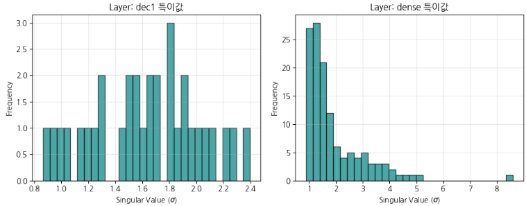

<!-- +강의 id=7.3_Parameter분석-06 w=w15b ts=[35:22] [36:07] 유형=그림해설 채택=? -->
dec1은 주어진 32차원을 거의 그대로 써서 각 방향이 서로 직교에 가까운 좌표계를 이룬다. 반면 마지막 dense는 128차원 중 111차원만 쓰고, 특이값이 완만히 줄다가 끝에서 하나가 아래로 떨어져 나온다. 차원이 조금 남는다는 신호다.
<!-- /+강의 -->

결과 해석은 세 지표로 나누어 진행한다.

- **erank / 뉴런 수 (차원 활용도)** : `enc1`, `z`, `dec1`, `dense` 등은 0.87 ~ 0.97 수준으로, 뉴런을 비교적 꽉 채워 유효하게 활용하고 있다. 반면 `enc2` 는 0.774로 다소 낮고 erank 자체도 낮다.
- **$\kappa(W)$ (행렬 안정성과 특이값 붕괴)** : 대부분의 layer는 $\kappa$ 가 2에서 10 사이로 안정적이다. 그런데 `enc2` 는 $\kappa$ 가 65,082에 이르고 최소 특이값이 0에 가까워진다. 이는 행렬의 특정 차원이 붕괴했음을 뜻하며, 여유 차원의 일부를 사용하지 않은 것으로 보인다.
- **Tail Index $\alpha$ (정보 집중도)** : `enc1`, `enc2`, `dense` 는 2.7 ~ 3.4로 heavy-tail 특성을 보인다. `z` 와 `dec1` 은 7.7 ~ 8.0 수준인데, 이는 좁은 차원(32)을 통과하면서 허용된 차원을 균등하게 나누어 쓰고 있음을 뜻한다.

종합하면 **자원이 비대칭으로 배분되어 있다.** `enc2` 는 남고 `dec1` 은 부족하다.

**enc2의 $\kappa(W)$ 급증 원인 분석** : 특이값 분포와 dead ratio를 비교해 원인을 좁힌다. `enc2` 에서 0에 가까운 특이값이 확인된다.

```python
dense_layers = [l for l in ae.layers if isinstance(l, layers.Dense)]
fig, ax = plt.subplots(figsize=(6, 3.5))

for layer in dense_layers:
    w = layer.get_weights()[0]
    s = np.linalg.svd(w, compute_uv=False)
    # 뉴런별 Weight L2 Norm 이 0에 가까우면 Dead Neuron
    neuron_norms = np.linalg.norm(w, axis=0)
    dead_ratio = (np.sum(neuron_norms < 1e-4) / len(neuron_norms)) * 100
    print(f'{layer.name:<12} | {len(neuron_norms):<15} | {dead_ratio:.2f}%')
    ax.plot(s, marker='.', alpha=0.8, label=f'{layer.name} (kappa: {s[0]/(s[-1]+1e-12):.1e})')
ax.set_yscale('log')
```

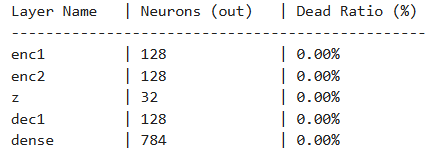

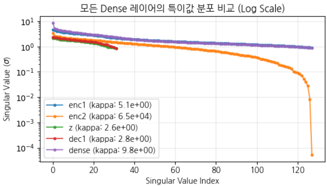

*그림 7-7. 특이값 스펙트럼의 비교. 한 layer만 꼬리에서 무너지면 그 layer의 차원 일부가 붕괴한 것이다.*

두 결과를 겹쳐 보면 원인이 좁혀진다. Dead Neuron 비율은 모든 layer에서 0%이므로, `enc2` 의 $\kappa$ 급증은 뉴런이 죽어서 생긴 것이 아니라 **행렬의 특정 방향이 붕괴한** 결과다.

대응 방법은 세 가지다.

1. **구조적 개선** : 대칭형 구조로 바꾸고, Normalization과 Skip-Connection을 사용한다.
2. **정규화 기법 적용** : Weight Decay와 L2 정규화를 적용한다.
3. **Low-Rank 행렬 분해(Factorization)** : 작고 의미 없는 특이값이 존재하므로, 해당 차원을 잘라내면 손실 없이 경량화할 수 있다.

---

## 7.3.5 Activation 분포와 Dead Neuron
<!-- 슬라이드 534 -->

### 정적인 Weight, 동적인 Activation

Weight가 학습이 끝난 뒤 고정된 **정적** 대상이라면, Activation은 데이터가 흐를 때 나타나는 **동적 반응**이다. 같은 모델이라도 어떤 데이터를 넣느냐에 따라 Activation 분포는 달라진다. 그래서 Activation 분석은 Weight 분석이 잡지 못하는 것을 잡는다.

ReLU 계열에서 특히 중요한 현상이 하나 있다. **어떤 뉴런의 출력이 모든 입력에 대해 0** 인 경우다. 이 뉴런은 어떤 데이터에도 반응하지 않으므로 **Dead Neuron** 이라 부른다. layer별 Dead Neuron 비율은 **모델이 용량의 일부를 포기했다는 신호**다.

### Dead Neuron Ratio

정의는 다음과 같다.

$$\mathrm{DeadRatio}_\ell = \frac{1}{N_\ell} \sum_{n} \mathbb{1}\!\left[\; \max_{x \in X} a_n(x) = 0 \;\right]$$

각 기호의 의미는 다음과 같다.

- $N_\ell$ : layer $\ell$ 의 뉴런 수
- $a_n(x)$ : 입력 $x$ 에 대한 뉴런 $n$ 의 활성값
- 지시함수 안의 조건 : 검증 집합 전체를 통틀어 **한 번도 켜지지 않는** 뉴런인지 여부

즉 DeadRatio는 검증 집합 전체에서 한 번도 활성화되지 않은 뉴런의 비율이다. **DeadRatio가 높은 layer는 learning rate가 과도했거나 초기화가 나빴다는 흔적**을 남기고 있는 것이다.

### Dying ReLU 메커니즘

Dead Neuron이 생기는 과정은 다음과 같이 진행된다.

큰 learning rate 또는 큰 음의 편향 때문에 뉴런의 출력이 항상 음수가 된다. 그러면 ReLU를 통과한 출력이 0으로 고정된다. 여기서 결정적인 문제가 생긴다. **ReLU의 기울기가 0이므로 그 뉴런의 parameter는 영구히 갱신되지 않는다.** 한 번 죽은 뉴런은 부활하지 못한다.

처방은 네 가지다.

- learning rate를 낮춘다.
- LeakyReLU나 GELU처럼 음수 구간에도 기울기가 있는 활성함수를 사용한다.
- 적절한 초기화, 예컨대 He 초기화를 적용한다.
- BatchNorm이나 LayerNorm을 사용해 출력 분포를 양수 구간으로 정규화한다.

### Activation 분포가 보여 주는 데이터 구조

Dead Neuron 진단을 넘어, Activation 분포의 모양 자체가 데이터 구조에 대한 단서가 된다.

- **활성값이 이봉형(bimodal)** : 데이터에 서브그룹이 있을 가능성을 시사한다.
- **우측으로 길게 치우친(skewed) 형태** : 큰 값들이 존재한다는 뜻이며, 소수의 강한 패턴이 지배하고 있음을 시사한다.
- **특정 클래스에만 강하게 활성화** : 그 뉴런이 **개념 탐지기**로 특화되었음을 시사한다. TCAV의 개념 정렬과 같은 관점에서 읽을 수 있다.

---

## 7.3.6 활성함수와 정규화, 그리고 Activation Histogram
<!-- 슬라이드 535 -->

### 처방 1 — 활성함수

Dead Neuron 처방이 왜 작동하는지 메커니즘 수준에서 정리한다.

- **LeakyReLU** : 음수 구간에 작은 기울기를 두어 **부활 경로**를 남긴다. 기울기가 0이 아니므로 갱신이 계속된다.
- **GELU · SiLU(Swish)** : 0 근처를 매끄럽게 만들어 하드 제로 영역 자체를 제거한다.

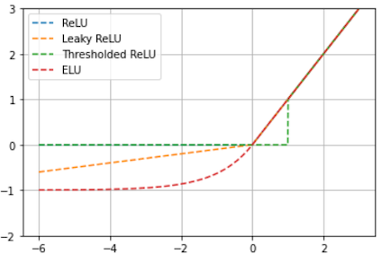

*그림 7-5. 활성함수 계열. 음수 구간에 기울기가 남아 있는지가 Dead Neuron 발생 여부를 가른다.*

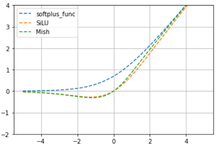

<!-- +강의 id=7.3_Parameter분석-07 w=w15b ts=[45:40] 유형=그림해설 채택=? -->
softplus와 SiLU, Mish는 0 아래로 한 번 내려갔다가 다시 올라오는 형태다. 그 덕분에 음수 쪽 포화 구간이 상당 부분 사라지고 기울기가 살아 있어 학습이 더 안정적으로 진행된다. 그만큼 성능이 함께 올라가는 경우도 있다.
<!-- /+강의 -->

### 처방 2 — 정규화

BatchNorm과 LayerNorm은 미니배치 단위로 값을 정규화하여 Dead Neuron을 줄이고 학습을 안정화한다.

이 효과를 설명하는 방식은 두 가지다. 원래는 **내부 공변량 이동(internal covariate shift)** 의 완화로 설명되었다. 이후 Santurkar et al.(2018)은 이를 재해석하여, 정규화의 진짜 효과는 **loss landscape을 매끄럽게 만들어 더 큰 학습률을 허용하는 데** 있다고 보았다.

구조에 따라 선택이 갈린다. Transformer는 배치 의존이 적은 LayerNorm을 사용한다.

### Activation Histogram으로 분포 형태를 진단하기

layer 출력의 히스토그램은 데이터 구조와 모델 학습 상태를 동시에 보여 준다. 네 가지 패턴을 구분해서 읽는다.

1. **0에 큰 막대** : ReLU를 통과한 값 다수가 0인 것은 정상적인 희소성이다. 다만 특정 뉴런이 "항상 0"이라면 그것은 Dead Neuron이며, 앞서 정의한 DeadRatio로 잡아낸다.
2. **이봉형(bimodal)** : 데이터에 두 개의 모드나 서브그룹이 있을 가능성을 보여 준다.
3. **한쪽으로 긴 꼬리(skewed)** : 소수의 강한 패턴이 지배하고 있음을 보여 준다.
4. **상한에 몰림(포화)** : 활성값이 폭주한 것이므로 정규화가 필요하다.

> 관련 노트북: `code/7.3.3.Activation_Distribution_Entropy.ipynb`

### 진단 절차 — 내부 상태 대시보드

실무에서는 학습 직후에 layer별로 다음 세 가지를 한 화면에 모아 둔다.

- (a) DeadRatio
- (b) 활성값의 평균과 분산
- (c) 히스토그램

이 **내부 상태 대시보드**를 만들어 놓고, 테스트 정확도가 떨어질 때 열어 본다. 성능 지표만 보고 원인을 추측하는 대신 layer의 동작을 직접 확인하기 위해서다.

---

## 7.3.7 Layer-wise Rank와 Activation Entropy
<!-- 슬라이드 536~540 -->

### 깊이에 따른 erank의 변화

지금까지는 하나의 layer를 보았다. 이제 각 layer의 erank를 **깊이 순으로 나열**해 보면 모델 전체가 정보를 어떻게 압축하는지가 드러난다.

정상적인 패턴은 **Compression Funnel(압축 깔때기)** 이다. 초기 layer의 erank는 입력 차원에 가깝고, 깊어질수록 필요한 축만 남아 값이 낮아진다.

이 곡선이 정상 범위를 벗어나는 경우를 **표현 병목** 이라 부른다. 특정 layer에서 erank가 급락하는 현상이며, 세 가지로 세분된다.

- **과압축** : 필요한 것보다 더 좁아진 경우다.
- **Rank Collapse(붕괴)** : 병목의 극단으로, erank가 1 부근까지 무너진 경우다. Dead Neuron이 다수일 때 나타난다.
- **학습 실패형 병목** : 큰 학습률이나 나쁜 초기화 탓에 어떤 layer의 뉴런이 대거 죽어 버린 경우다.

### Neural Collapse

깊이에 따른 erank 감소에는 이론적으로 예측되는 종착점도 있다. Papyan(2020)이 보고한 **Neural Collapse** 는 분류 직전 layer의 erank가 클래스 수 $K$ 에서 1을 뺀 $K-1$ 로 낮아지는 현상이다.

이때 클래스당 특징이 한 점으로 모이면서 $(K-1)$ 차원 구조, 곧 **simplex ETF** 를 형성한다. 구체적으로 3개 클래스는 2차원 평면 위에 3개의 점으로 배치되고, 4개 클래스는 3차원 공간에 정사면체의 꼭짓점으로 배치된다.

### Activation Entropy

**Activation Entropy** 는 layer 출력 분포의 엔트로피다. 읽는 법은 다음과 같다.

- **낮은 엔트로피** : 소수의 뉴런만 활성화된 상태다. 그 layer가 특화된 탐지기로 작동하고 있거나, 아니면 Dead Neuron이 발생한 경우다. 두 해석이 갈리므로 DeadRatio와 함께 보아야 한다.
- **높은 엔트로피** : 활성이 고르게 퍼져 있으며 표현이 분산되어 있음을 뜻한다.

### 실습 7.3.2 — Dead Neuron 분석

> 노트북: `code/7.3.2.Dead_Neuron_Diagnosis.ipynb`

**목적** : MNIST로 MLP 분류기를 학습하고 layer별 activation 결과를 분석한다. Dying ReLU가 학습 설정에서 어떻게 발생하는지를 직접 만들어 보고, DeadRatio · Activation Histogram · Activation Entropy 세 지표로 같은 현상을 각각 확인한다.

**조건** : 세 가지 조건으로 각각 학습한다.

- `lr = 0.1` (정상)
- `lr = 2.0` (과도한 learning rate)
- `init_bias = -3` (나쁜 초기화)

activation은 layer 출력을 그대로 뽑아 주는 sub model로 수집하고, DeadRatio는 "모든 샘플에서 최대 활성이 0에 가까운 뉴런"의 비율로 잰다.

```python
def hidden_acts(model, names, X):
    sub = keras.Model(model.input, [model.get_layer(n).output for n in names])
    outs = sub.predict(X, verbose=0)
    return outs if isinstance(outs, list) else [outs]

def dead_ratio(act):
    return float((act.max(axis=0) < 1e-6).mean())   # 모든 샘플에서 최대 활성 ≈ 0
```

```python
def build_mlp(lr, bias_init='zeros'):
    keras.utils.set_random_seed(SEED)
    inp = keras.Input((784,))
    h1 = layers.Dense(64, activation='relu', bias_initializer=bias_init, name='h1')(inp)
    h2 = layers.Dense(64, activation='relu', bias_initializer=bias_init, name='h2')(h1)
    out = layers.Dense(10, activation='softmax')(h2)
    m = keras.Model(inp, out)
    m.compile(optimizer=keras.optimizers.SGD(lr),
              loss='sparse_categorical_crossentropy', metrics=['accuracy'])
    return m

configs = {
  '정상(lr=0.1)':       dict(lr=0.1, bias_init='zeros'),
  '과도 lr(lr=2.0)':    dict(lr=2.0, bias_init='zeros'),
  '나쁜 init(bias=-3)': dict(lr=0.1, bias_init=keras.initializers.Constant(-3.0)),
}
for name, cfg in configs.items():
    m = build_mlp(**cfg)
    m.fit(X_tr, y_tr, epochs=8, batch_size=128, verbose=0)
    a1, a2 = hidden_acts(m, ['h1','h2'], X_te)
    acc = m.evaluate(X_te, y_te, verbose=0)[1]
    print(f'{name:18s} dead h1 {dead_ratio(a1)*100:5.1f}% '
          f'h2 {dead_ratio(a2)*100:5.1f}% | acc {acc:.3f}')
```

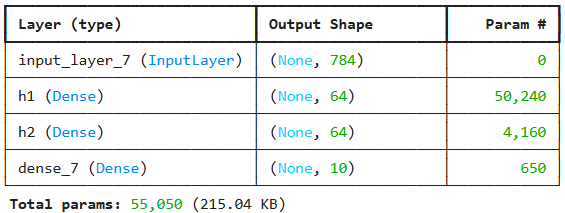

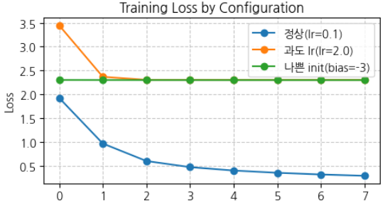

**관찰 대상** : 조건에 따라 은닉층 `h1`, `h2` 에서 Dead Neuron 비율이 어떻게 달라지는지, 그리고 Activation Histogram과 Activation Entropy가 어떻게 변하는지를 본다.

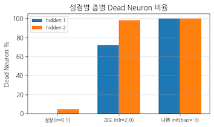

<!-- +강의 id=7.3_Parameter분석-08 w=w15b ts=[53:25] [53:58] 유형=결과해석 채택=? -->
정상 조건에서도 h2에서는 Dead Neuron이 조금 나타난다. lr을 2.0으로 올리면 64개 중 상당수가 죽고, bias를 -3으로 초기화한 경우에는 두 층이 모두 100%에 이른다. 앞의 Loss 곡선에서 학습이 전혀 진행되지 않은 것과 같은 사실을 뉴런 단위로 확인한 셈이다.
<!-- /+강의 -->

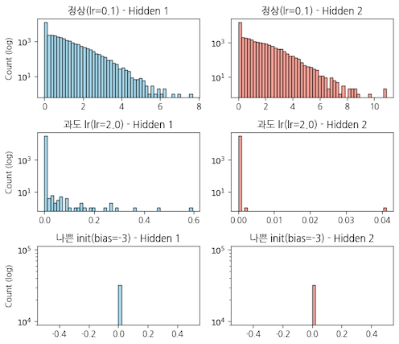

Activation Entropy는 뉴런별 평균 활성도를 확률 분포로 정규화한 뒤 Shannon Entropy를 계산해서 얻는다.

```python
def act_entropy(act):
    """뉴런들의 평균 활성도 분포에 대한 Shannon Entropy를 계산합니다."""
    mean_act = np.mean(act, axis=0)
    p = mean_act / (np.sum(mean_act) + 1e-9)        # 정규화하여 확률 분포 형태로 변환
    return -np.sum(p * np.log2(p + 1e-9))           # 0인 경우를 대비해 1e-9 추가
```

**BatchNorm의 회복력** : 같은 `lr = 2.0` 조건에 BatchNorm을 넣으면 결과가 달라진다. BatchNorm이 loss landscape을 매끄럽게 만들어 주므로 큰 learning rate에서도 학습이 가능해진다.

```python
def build_mlp_bn(lr):
    keras.utils.set_random_seed(SEED)
    inp = keras.Input((784,))
    x = layers.Dense(64, name='h1_lin')(inp); x = layers.BatchNormalization()(x)
    h1 = layers.Activation('relu', name='h1')(x)
    x = layers.Dense(64, name='h2_lin')(h1); x = layers.BatchNormalization()(x)
    h2 = layers.Activation('relu', name='h2')(x)
    out = layers.Dense(10, activation='softmax')(h2)
    m = keras.Model(inp, out)
    m.compile(optimizer=keras.optimizers.SGD(lr),
              loss='sparse_categorical_crossentropy', metrics=['accuracy'])
    return m

m_bn = build_mlp_bn(lr=2.0)
m_bn.fit(X_tr, y_tr, epochs=8, batch_size=128, verbose=0)
a1b, a2b = hidden_acts(m_bn, ['h1','h2'], X_te)
print(f'과도 lr=2.0 + BatchNorm → dead h1 {dead_ratio(a1b)*100:.1f}% '
      f'h2 {dead_ratio(a2b)*100:.1f}% (ReLU 단독 대비 회복)')
print(f'h1 Entropy: {act_entropy(a1b):5.2f}, h2 Entropy: {act_entropy(a2b):5.2f}')
```

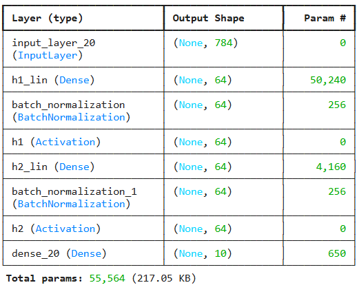

<!-- +강의 id=7.3_Parameter분석-09 w=w15b ts=[55:31] [56:18] 유형=그림해설 채택=? -->
summary에서 확인할 것은 순서다. BatchNorm은 활성함수보다 앞에 놓여야 하므로 Dense, BatchNormalization, Activation 순으로 배치된다. 이 순서로 넣으면 loss landscape이 매끄러워져 lr이 2.0인 조건에서도 학습이 정상적으로 진행된다.
<!-- /+강의 -->

### 실습 7.3.4 — Layer-wise activation SVD와 Activation Effective Rank 분석

> 노트북: `code/7.3.4.LayerWise_Effective_Rank.ipynb`

**목적** : MNIST로 Deep AE를 학습하고 layer별 activation의 erank를 분석한다. 실습 7.3.1에서는 **W**로 erank를 분석했다면, 여기서는 **activation** 으로 분석한다는 점이 다르다. 앞에서 설명한 압축 깔때기가 실제로 나타나는지를 확인하는 실습이다.

**모델 구조** : 인코더를 784 → 256 → 128 → 64 → 16으로 좁혀 간다.

```python
keras.utils.set_random_seed(SEED)
widths = [256, 128, 64, 16]
inp = keras.Input((784,)); x = inp
enc_names = []
for i, w in enumerate(widths):
    act = 'linear' if i == len(widths)-1 else 'relu'
    x = layers.Dense(w, activation=act, name=f'enc{i+1}')(x)
    enc_names.append(f'enc{i+1}')
z = x
for w in [64, 128, 256]:
    z = layers.Dense(w, activation='relu')(z)
out = layers.Dense(784, activation='sigmoid')(z)

ae = keras.Model(inp, out)
ae.summary(line_length=60)
ae.compile(optimizer=keras.optimizers.Adam(1e-3), loss='mse')
h = ae.fit(X_tr, X_tr, validation_data=(X_te, X_te), epochs=20, batch_size=64, verbose=0)
```

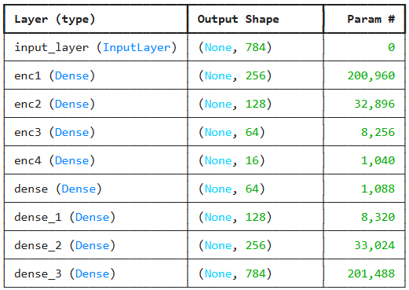

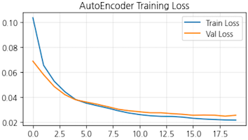

**절차** : sub model을 생성해 layer별 activation을 추출하고, 그것에 SVD를 적용해 erank를 구한다.

```python
def effective_rank(s):
    s = s[s > 1e-12]; p = s / s.sum()
    return float(np.exp(-(p*np.log(p)).sum()))

def act_erank(act):
    s = np.linalg.svd(act - act.mean(0), compute_uv=False)
    return effective_rank(s)

sub = keras.Model(ae.input, [ae.get_layer(n).output for n in enc_names])
acts = sub.predict(X_te, verbose=0)
data_er = act_erank(X_te)
rows = [('input(784)', 784, round(data_er, 2))]
for n, w, a in zip(enc_names, widths, acts):
    rows.append((f'{n}({w})', w, round(act_erank(a), 2)))
dfL = pd.DataFrame(rows, columns=['layer','width','effective_rank'])
print(dfL.to_string(index=False))
```

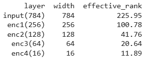

깊이가 깊어질수록 effective rank가 단조 감소한다. 앞에서 말한 압축 깔때기가 수치로 확인되는 대목이다.

**erank 기준의 모델 경량화** : 앞에서 산출된 erank의 1.5배를 각 layer의 폭으로 삼아 구조를 수정한다. 그리고 원본 모델과 최적화 모델의 activation entropy와 erank를 비교한다.

```python
# Effective rank를 새로운 층의 너비로 설정 (1.5배 후 반올림)
opt_widths = [int(np.round(er * 1.5)) for er in dfL['effective_rank'].values[1:]]
print(f'기존 인코더 Widths: {widths}')
print(f'최적화된 인코더 Widths (1.5배): {opt_widths}')
```

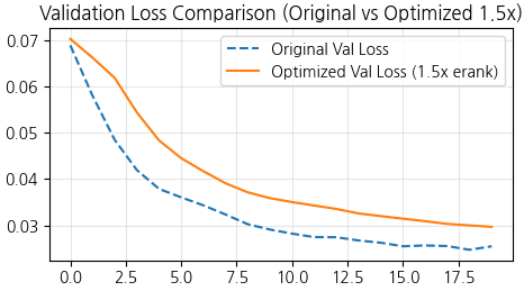

<!-- +강의 id=7.3_Parameter분석-10 w=w15b ts=[61:46] [62:15] 유형=그림해설 채택=? -->
폭을 줄인 모델의 검증 손실은 원본과 큰 차이 없이 내려가고, 곡선이 다시 벌어지는 과적합 징후도 보이지 않는다. 파라미터 수는 그 사이에 크게 줄었다. erank를 기준으로 목표 성능과 모델 크기를 함께 조정할 수 있다는 것을 보여 주는 결과다.
<!-- /+강의 -->

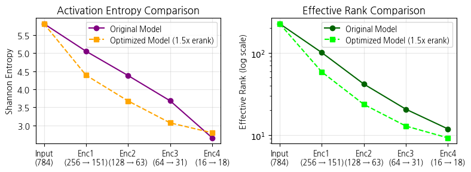

*그림 7-8. 경량화 전후 비교. 줄어든 노드에서 뉴런이 더 촘촘하게 데이터를 압축한다.*

<!-- +강의 id=7.3_Parameter분석-11 w=w15b ts=[62:38] [63:07] 유형=그림해설 채택=? -->
두 모델 모두 layer를 지날수록 엔트로피가 낮아진다. 엔트로피가 크면 활성값이 넓게 벌어져 있다는 뜻이고, 작아진다는 것은 비슷한 크기의 값으로 촘촘히 채워진다는 뜻이다. 깊어질수록 중복이 걷히면서 압축이 진행된다는 것을 이 곡선이 보여 준다.
<!-- /+강의 -->

해석은 두 가지다.

- **Effective Rank와 파라미터 효율성** : 불필요한 차원이 효과적으로 제거되었다. 최적화 모델은 파라미터를 대폭 줄이면서도 큰 성능 저하 없이 원본 데이터를 잘 복원한다.
- **Activation entropy 분석** : 최적화 모델은 더 낮은 위치에서 엔트로피 곡선을 형성한다. 줄어든 노드에서 뉴런이 더 촘촘하게 데이터를 압축하고 있다는 뜻이며, 잉여 용량이 효과적으로 제거되었음을 뒷받침한다.

---

## 7.3.8 Pruning
<!-- 슬라이드 541~543 -->

**Pruning** 은 중복되거나 불필요한 parameter를 제거하여 효율을 높이는 기법이다.

절차는 세 단계의 반복이다. 먼저 모델을 **학습**하고, 다음으로 정해 둔 threshold보다 낮은 가중치를 가진 **연결을 제거**하고, 마지막으로 남은 모델을 **재학습**한다. 조건이 충족될 때까지 이 과정을 반복(iterative)한다.

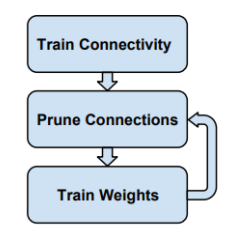

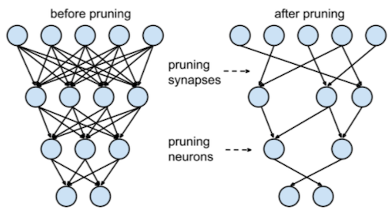

실무적으로 지켜야 할 규칙이 세 가지 있다.

- Pruning된 layer를 재학습할 때 **남아 있는 가중치를 초기화하지 말 것.** 이미 학습된 값을 그대로 이어서 써야 한다.
- 정규화는 L1보다 **L2가 유리**하다.
- Dropout은 pruning이 진행됨에 따라 **비율을 줄여야** 한다. 이미 연결이 줄어든 상태에서 같은 비율의 dropout을 유지하면 과도한 제약이 된다.

이 절차의 근거가 된 연구가 "Learning both Weights and Connections for Efficient Neural Networks"(2015)다. 가중치가 낮은 connection을 제거하고 재학습하기를 반복하면, **90%를 제거해도 유사한 성능이 유지된다**는 것을 보였다.

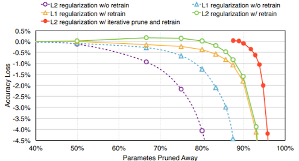

<!-- +강의 id=7.3_Parameter분석-12 w=w15b ts=[65:02] [65:47] 유형=그림해설 채택=? -->
곡선이 꺾이기 시작하는 지점은 제거율 90% 부근이다. 거기까지는 남은 10%의 연결만으로 원래의 정확도가 유지된다. L2 정규화와 재학습을 함께 돌린 계열에서는 중간에 원본보다 정확도가 오히려 올라가는 구간도 나타난다.
<!-- /+강의 -->

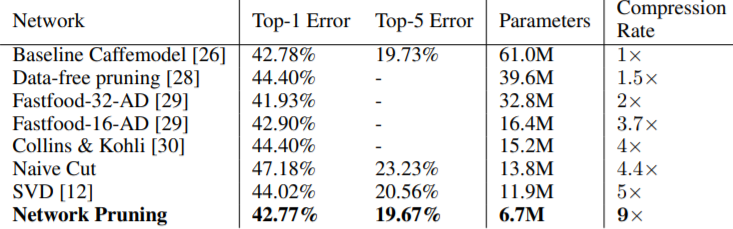

이 결과에 이어 2018년 3월 "The Lottery Ticket Hypothesis: Finding Sparse, Trainable Neural Networks"가 한 걸음을 더 나아갔다. **처음에 사용한 초기값을 그대로 사용하여 재학습하면 더 좋은 성능을 얻을 수 있다**는 것이다.

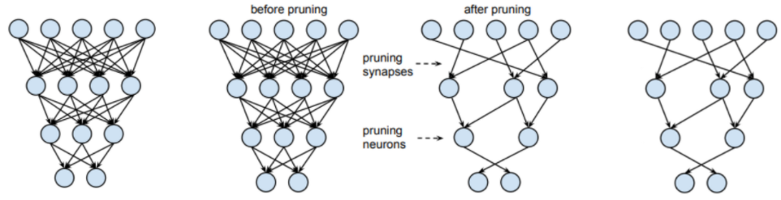

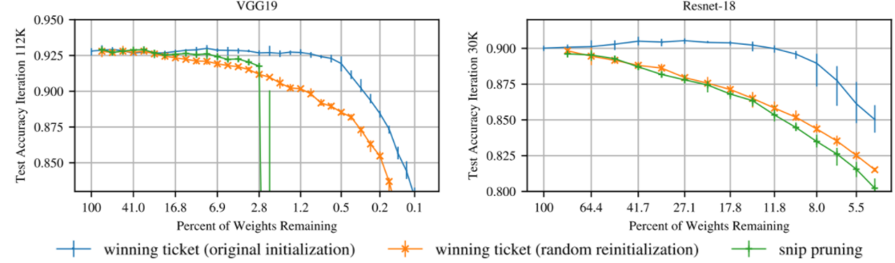

*그림 7-6. 초기값의 역할. 같은 마스크라도 원래 초기값으로 되돌렸을 때와 무작위로 재초기화했을 때의 결과가 다르다.*

<!-- +강의 id=7.3_Parameter분석-13 w=w15b ts=[67:19] [67:48] 유형=그림해설 채택=? -->
VGG19와 Resnet-18 두 곡선 모두, 가중치를 덜어 낸 뒤 오히려 원본보다 정확도가 높아지는 구간이 나타난다. 가지치기가 성능을 깎기만 하는 작업이 아니라는 뜻이며, 모델이 특별한 초기값과 경로를 만나면 더 좋은 결과에 이를 수 있다는 것을 보여 준다.
<!-- /+강의 -->

---

## 7.3.9 Lottery Ticket Hypothesis
<!-- 슬라이드 544 -->

### 가설의 내용

**Lottery Ticket Hypothesis(복권 가설, Frankle & Carbin, 2018)** 의 주장은 다음과 같다.

> **핵심 주장**
> 무작위로 초기화된 큰 신경망 안에는, 동일한 성능을 갖는 작은 부분망(winning ticket)이 존재한다.

이 주장을 Parameter 분포의 언어로 옮기면 이렇게 된다. **학습된 모델의 의미는 모든 Parameter에 고르게 퍼져 있지 않고, 소수의 당첨된 연결과 그 초기값에 집중되어 있다.**

### IMP — 학습 절차

winning ticket을 찾는 절차가 **IMP(Iterative Magnitude Pruning)** 다.

1. 모델을 끝까지 **학습**한다.
2. 크기가 작은 weight를 일정 비율 제거한다. 제거 대상을 나타내는 것이 **마스크 $m$** 이다.
3. 남은 weight를 **초기값으로 되돌린** 뒤 재학습한다.
4. 1로 돌아가 반복한다.

판정 기준은 다음과 같다. 마스크된 모델 $m \odot \theta_0$ 이 원본의 성능을 유지하면 그것이 **winning ticket** 이다.

### Parameter 분포 관점에서의 의미

이 가설은 Parameter 분포 분석과 여러 지점에서 맞물린다.

첫째, 크기 분포가 **두꺼운 꼬리(heavy-tailed)** 일수록 winning ticket이 더 희소하다. 즉 의미 있는 Parameter의 수가 적다는 뜻이다.

둘째, 7장에서 반복해서 나타난 세 가지 집중 패턴이 하나의 계열을 이룬다.

- **Low-Rank** : 차원의 집중
- **Lottery Ticket** : 연결의 집중
- **Head 중복성** : Head의 집중

셋째, 오토인코더에 적용하면 구체적인 질문에 답할 수 있다. **잠재 표현을 만드는 데 정말로 필요한 연결이 전체의 몇 퍼센트인지**를 측정할 수 있다.

### 비판적 시각

가설에는 실용상의 한계도 있다. winning ticket을 찾으려면 **원본 모델을 끝까지 학습해야** 한다. 즉 사전에 어떤 작은 모델이 좋을지를 미리 알 수는 없다.

그럼에도 이 결과가 갖는 의미는 크다. 학습된 구조가 희소하게 집중된다는 것은 **Parameter 분포 해석의 강력한 증거**다.

> **핵심 메시지**
> 모델의 의미는 평등하게 분산되어 있지 않다.

---

## 7.3.10 구조적 pruning과 Double Descent
<!-- 슬라이드 545~547 -->

### 무엇을 제거하는가

Pruning은 제거의 단위에 따라 두 계열로 나뉜다.

**비구조적(unstructured) pruning** 은 개별 weight를 제거해 희소 행렬을 만든다. 압축률은 높지만, 일반적인 하드웨어에서는 실제 속도 이득이 작다.

**구조적(structured) pruning** 은 채널, Head, layer 단위로 제거한다. 대표적인 방법은 다음과 같다.

- **Head pruning(Voita·Michel)** : 7.2에서 다룬 Head 중복성을 근거로 Head 단위를 통째로 제거한다.
- **Movement pruning(Sanh, 2020)** : Fine Tuning의 효율을 높이는 방법이다. 판단 기준이 크기가 아니라 **움직임**이라는 점이 특징이다. Fine Tuning 중에 weight가 0에 가까워지면 제거하고, 0에서 멀어지면 유지한다.

### Double Descent

큰 모델을 만든 뒤 줄이는 전략은 통계학의 전통적 직관과 충돌하는 것처럼 보인다. 그 충돌을 해소해 주는 현상이 **Double Descent**(Belkin, 2019 · Nakkiran, 2020)다.

전통적 직관과 달리, 모델을 과파라미터화할수록, 정확히는 보간 임계(interpolation threshold)를 넘어설수록 **일반화가 다시 좋아지는 구간**이 존재한다. 큰 모델이 더 잘 학습되고, 그 안에 좋은 ticket이 들어 있다는 것이다.

이 관점에서 보면 **과파라미터화는 낭비가 아니라, 좋은 부분망을 포함할 확률을 높이는 탐색 공간의 확대**일 수 있다. 그리고 이는 "먼저 크게 학습한 뒤 ticket을 찾는다"는 절차를 정당화한다.

### Transfer Learning과 Foundation Model에의 함의

winning ticket이 존재한다면, 실무 전략 하나가 자연스럽게 도출된다. **큰 모델을 사전학습한 뒤 작업별로 소수의 연결만 미세 조정하는 전략**이다.

이것이 LoRA를 비롯한 **parameter-efficient fine-tuning** 이 정당화되는 근거다. LoRA는 Fine Tuning에 필요한 weight 변화량이 **Low-Rank로 충분하다**는 가정에 기반한다. 7.3.2에서 다룬 Low-Rank 구조가 여기서 다시 등장한다.

### 실습 7.3.5 — Lottery Ticket과 IMP 적용

> 노트북: `code/7.3.5.Lottery_Ticket_IMP.ipynb`

**목적** : MNIST로 오토인코더를 학습한 뒤 IMP를 적용하여, sparsity에 따른 성능 변화를 비교한다. 앞에서 말로만 서술한 winning ticket이 실제로 존재하는지, 그리고 초기값 복원이 정말로 결과를 가르는지를 확인한다.

**모델 구조** : 가지치기 대상이 되는 Dense layer 네 개(`p1`~`p4`)를 둔다.

```python
def build_ae(seed=SEED):
    keras.utils.set_random_seed(seed)
    inp = keras.Input((784,))
    x = layers.Dense(128, activation='relu',   name='p1')(inp)
    x = layers.Dense(32,  activation='linear', name='p2')(x)
    x = layers.Dense(128, activation='relu',   name='p3')(x)
    out = layers.Dense(784, activation='sigmoid', name='p4')(x)
    m = keras.Model(inp, out)
    m.compile(optimizer=keras.optimizers.Adam(1e-3), loss='mse')
    return m

PRUNE = ['p1','p2','p3','p4']
init_w = {n: build_ae(SEED).get_layer(n).get_weights()[0].copy() for n in PRUNE}
```

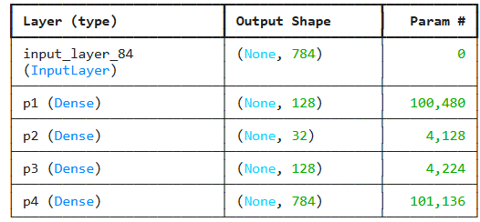

**IMP 절차** : 먼저 모델을 생성하고 초기화한 뒤 **초기 weight를 저장**해 둔다. 그 다음 아래를 반복한다.

1. 모델을 학습한다.
2. 각 layer의 모든 weight에서 크기 하위 25%를 마스크로 설정한다.
3. 모델의 초기 weight를 다시 불러온다.
4. 마스크된 weight를 0으로 만든다.
5. 재학습하고 1로 돌아간다.

마스크는 학습 중에도 계속 다시 적용해야 하므로, epoch가 끝날 때마다 `w * mask` 를 덮어쓰는 콜백을 붙인다.

```python
def fit_masked(model, masks, epochs=6):
    def reapply(e=None, l=None):
        for n in masks:
            w, b = model.get_layer(n).get_weights()
            model.get_layer(n).set_weights([w*masks[n], b])
    cb = keras.callbacks.LambdaCallback(on_epoch_end=lambda e, l: reapply())
    model.fit(X_tr, X_tr, epochs=epochs, batch_size=128, verbose=0, callbacks=[cb])
    reapply(); return model

def accumulate_prune(model, masks, frac_active):
    """현재 활성 가중치 중 |w| 작은 frac_active 비율을 추가로 0."""
    new = {}
    for n in PRUNE:
        w = model.get_layer(n).get_weights()[0]
        m = masks[n]
        thr = np.quantile(np.abs(w[m == 1]), frac_active)
        new[n] = (m * (np.abs(w) >= thr)).astype('float32')
    return new

def sparsity_of(masks):
    z = sum((m == 0).sum() for m in masks.values()); t = sum(m.size for m in masks.values())
    return z/t

def mse(model):
    return float(np.mean((model.predict(X_te, verbose=0) - X_te)**2))
```

기준선이 되는 dense 모델을 먼저 학습해 둔다.

```python
dense = build_ae(SEED)
dense.fit(X_tr, X_tr, epochs=6, batch_size=128, verbose=0)
dense_mse = mse(dense); print(f'dense (0% sparsity) MSE {dense_mse:.4f}')
```

비교 대상은 두 가지다. 같은 마스크를 **원래 초기값**에 씌운 winning ticket과, 같은 마스크를 **다른 초기값**에 씌운 무작위 재초기화 모델이다.

```python
masks = {n: np.ones_like(init_w[n]) for n in PRUNE}
cur = dense
rows = [(0.0, dense_mse, dense_mse)]
for rnd in range(9):
    masks = accumulate_prune(cur, masks, 0.25)   # 활성의 25%씩 누적 제거
    sp = sparsity_of(masks)
    wt = build_ae(SEED)                          # winning ticket: 원래 초기값
    for n in PRUNE:
        wt.get_layer(n).set_weights([init_w[n]*masks[n], wt.get_layer(n).get_weights()[1]])
    wt = fit_masked(wt, masks); wt_mse = mse(wt)
    rr = build_ae(SEED+101+rnd)                  # 무작위 재초기화: 다른 초기값
    for n in PRUNE:
        w = rr.get_layer(n).get_weights()[0]
        rr.get_layer(n).set_weights([w*masks[n], rr.get_layer(n).get_weights()[1]])
    rr = fit_masked(rr, masks); rr_mse = mse(rr)
    rows.append((sp, wt_mse, rr_mse))
    print(f'sparsity {sp*100:5.1f}% | winning ticket MSE {wt_mse:.4f} | '
          f'random reinit MSE {rr_mse:.4f}')
    cur = wt
```

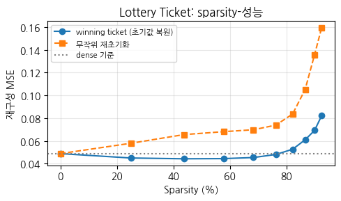

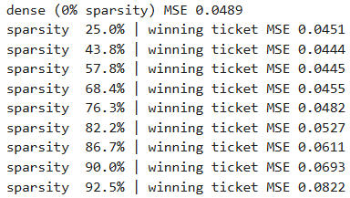

**결과** : 전체 weight의 **76.3%를 제거한 시점까지 성능 우위가 유지**된다. 원본 dense 모델의 MSE보다 winning ticket의 MSE가 더 낮게 유지되다가, 그 이후 sparsity에서 서서히 성능이 떨어진다. 같은 마스크를 쓰더라도 무작위로 재초기화한 쪽은 처음부터 계속 뒤처진다. 당첨은 구조만의 결과가 아니라 **구조와 초기값의 결합**이라는 뜻이다.

---

## 7.3.11 안정성 framework와 역추론의 지도
<!-- 슬라이드 548 -->

### 내부 지표는 흔들린다

7장에서 다룬 모든 내부 지표 — Head 분화, erank, DeadRatio, ticket — 는 **시드와 초기화에 따라 흔들린다.** 한 번 측정한 값을 그대로 결론으로 삼으면 안 된다.

따라서 Bootstrap, 시드 변동, FSI(Feature Stability Index) framework를 적용하여 내부 지표들의 **안정성과 재현성을 검증**해야 한다. 검증되지 않은 지표는 무의미할 뿐 아니라 오히려 위험하다.

<!-- +강의 id=7.3_Parameter분석-14 w=w15b ts=[02:56] 유형=개념보강 채택=? -->
지표가 흔들리는 원인이 측정 절차가 아니라 모델 자체에 있을 때도 있다. Dead Neuron이 많은 모델은 변동성이 커서 안정적인 상태에 이르지 못하고, 그 위에서는 분포나 Attention 정보를 검증해도 안정성이 흔들린다. 지표의 흔들림 자체가 모델 내부의 구조적 문제일 수 있다.
<!-- /+강의 -->

검증해야 할 질문은 구체적으로 다음과 같다.

- 이 Head의 역할은 시드를 바꾸어도 일관적인가? (attention weight의 일관성)
- 이 winning ticket은 재현되는가? (다시 학습해도 성능이 유지되는가)

<!-- +강의 id=7.3_Parameter분석-15 w=w15b ts=[80:27] [81:14] 유형=개념보강 채택=? -->
두 질문은 통과하지 못했을 때의 대가가 서로 다르다. 시드를 바꿀 때마다 Head의 역할이 뒤바뀌면 그 Head로는 어떤 해석도 할 수 없다. winning ticket이 재현되지 않는데도 모델을 줄이면, 줄인 모델의 성능을 보장할 수 없는 위험한 pruning이 된다.
<!-- /+강의 -->

### 데이터 구조와 Parameter 분포의 대응

학습된 모델의 Parameter 분포를 읽어 데이터 구조와 모델의 학습 상태를 추론하는 것은 일종의 **역추론**이다. 그 지도를 정리하면 다음과 같다.

| 데이터 구조 | Parameter 분포 신호 | 측정 도구 |
|---|---|---|
| 내재 차원 | 첫 layer Weight의 상위 특이값 집중 | Effective Rank $\approx k_{95}$ |
| 클러스터 · 서브그룹 | Attention Head가 그룹별 관계를 분담 | Head별 Attention matrix, Attention histogram · 엔트로피 |
| 출력 불확실성 | 마지막 layer Weight · 활성 분포의 분산 | Activation histogram, DeadRatio |
| Feature 의존 | Attention Head와 Attribution의 일치 / 불일치 | Head weight ↔ IG · SHAP 교차 |

<!-- +강의 id=7.3_Parameter분석-16 w=w15b ts=[82:04] [82:51] 유형=결과해석 채택=? -->
표는 분포에서 데이터로 거슬러 올라가는 방향으로 읽는다. Attention Head가 그룹별로 관계를 나눠 맡았다면 데이터셋에 클러스터나 서브그룹이 있다고 되짚는다. 마지막 layer는 불확실성이 클수록 Weight에 큰 값이 생기고 활성 분산도 커지므로, 성능이 같은 두 모델의 안정성 비교에 쓴다.
<!-- /+강의 -->

> 관련 노트북: `code/7.3.6.Comprehensive_Report.ipynb`

### 대응은 가설이지 증명이 아니다

이 지도를 쓸 때 반드시 붙여야 할 단서가 있다. **대응은 해석의 가설이지 인과의 증명이 아니다.**

- 같은 데이터로 학습한 두 모델이 서로 다른 Parameter 분포를 가질 수 있다. 모델 구조에 대한 민감도 때문이다.
- 역추론은 항상 **이 모델의 학습**에 의존하며, 그 범위 안에서만 유효하다.
- 따라서 여러 단계, 여러 도구의 신호를 교차 검증해야 한다.

---

## 7.3.12 정리
<!-- 슬라이드 549 -->

> **정리 — 7.3 Parameter 분포**
> Parameter 분포는 데이터 구조의 압축된 흔적이다.
>
> - **Effective Rank** : Weight의 SVD로 산출하며, 모델이 실제로 쓰는 차원 수를 나타낸다. 데이터의 내재 차원과 대응시켜 읽는다.
> - **Weight 분포** : 특이값 스펙트럼의 형태, 특히 heavy-tailed 꼬리는 일반화가 잘 되는 학습의 신호다.
> - **Dead Neuron 비율** : 모델의 학습 상태를 드러낸다. 필요하면 Data/Layer 정규화, LeakyReLU, SiLU로 처방한다.
> - **Activation 분포** : 모델의 학습 상태이자, 데이터 서브그룹 구조의 신호다.
> - **Lottery Ticket** : 의미가 소수의 연결에 집중되어 있음을 보인다. Low-Rank, Head 중복성과 같은 계열의 희소 집중 패턴이다.
> - **Layer-wise rank · entropy** : 깊이에 따른 정보 압축(Information Bottleneck)을 검토하는 도구이며, 반드시 안정성 검증을 거쳐 사용한다.
